# Automatic Model Parallelization As A Separation Of Model Definition And Execution Planning

**A concept-first academic systems survey of automatic and semi-automatic distributed execution for large neural networks**

**Source cutoff:** public sources available through **2026-04-28**

**Primary platform lens:** PyTorch on GPU clusters. JAX, XLA ([Accelerated Linear Algebra](https://openxla.org/xla) compiler), and OpenXLA are used as comparative design evidence for compiler-side sharding propagation, logical meshes, and SPMD ([single program, multiple data](https://en.wikipedia.org/wiki/SPMD)) lowering, not as the organizing structure of the paper.

**Central thesis:** model authors should be able to define a neural network in ordinary single-device tensor and module language, while a distinct execution-planning layer chooses placements, sharding strategies, collectives, schedules, lowering paths, checkpoint layouts, and state transitions. The separation is not merely an ergonomic wish; it is the systems boundary that lets model architecture, distributed runtime, compiler optimization, and hardware topology evolve at different rates.

**Scope:** this paper studies the primitives that make the separation feasible: logical meshes, placement states, sharding annotations, propagation rules, tactic or schedule languages, cost models, search procedures, SPMD lowering, pipeline scheduling, algebraic rewrites, state resharding, and correctness checks. The paper emphasizes dense transformer training because it is the best-documented public workload for these systems, while noting where long-context models, mixture-of-experts routing, dynamic control flow, and inference-serving constraints stretch or break the same abstractions.

**Out of scope:** this paper is not a catalog of distributed training frameworks, not a benchmark leaderboard, not an installation guide, and not a survey of all data-parallel training systems. It also does not claim that fully automatic native PyTorch planning is already solved. When a system exposes primitives but not a complete public automatic planner, the paper treats the missing planner as an integration or research gap rather than an implementation fact.

## Abstract

Automatic model parallelization is the systems problem of transforming a logical neural-network program into an efficient distributed execution without requiring the model author to manually write every tensor shard, collective, pipeline edge, rank-local branch, optimizer-state partition, or checkpoint layout. The strongest form of the idea separates two contracts. The first contract is a single-device semantic model: the researcher writes ordinary model code whose intended meaning is the mathematical computation and training update. The second contract is an execution plan: infrastructure assigns tensors and operations to a logical mesh, inserts communication, schedules work, lowers the computation to per-rank behavior, and preserves equivalence to the reference program within the expected numerical tolerance.

This survey is organized around primitives rather than frameworks. It uses PartIR and its automatic tactic-discovery line as evidence for incremental partitioning representations and search [S1, S2]; GSPMD (general and scalable parallelization for ML computation graphs) and OpenXLA Shardy as evidence for compiler propagation, sharding constraints, and SPMD lowering over logical meshes [S4, S5]; Automap, Alpa, FlexFlow/Unity, DistIR, Galvatron, and Slapo as evidence for alternative search spaces, simulators, schedule languages, and algebraic rewrites [S3, S8, S9, S10, S11, S12, S13]; and PyTorch DTensor ([Distributed Tensor](https://docs.pytorch.org/docs/stable/distributed.tensor.html)), DeviceMesh, tensor parallelism, Distributed Checkpoint, pipeline APIs, PyTorch/XLA SPMD, TorchTitan, and veScale as evidence for the current PyTorch-facing substrate and its remaining automation gap [S6, S7, S14, S15, S16, S17, S18, S20, S21, S24].

The main finding is that the field is converging on a compact vocabulary of reusable mechanisms. Logical meshes name the device topology independently of model code. Placement states describe whether tensors are replicated, sharded, partial, or intentionally local. Propagation and lowering rules derive intermediate layouts and communication from sparse constraints. Cost models and search choose among competing tactics under memory, bandwidth, latency, and schedule constraints. Checkpoint and state-resharding mechanisms keep training state independent of a single mesh shape. These mechanisms are more stable than any one framework interface, and they form the right level at which to reason about automatic model parallelization.

For PyTorch, the conclusion is deliberately nuanced. Public PyTorch components now expose many of the required execution primitives: `DeviceMesh`, DTensor placements and redistribution, tensor parallel plans, FSDP2 (Fully Sharded Data Parallel, version 2)-style sharded state, distributed checkpointing, pipeline APIs, and graph capture through `torch.export` [S15, S16, S17, S18, S19, S20, S21]. PyTorch/XLA demonstrates a compiler-backed SPMD path, while veScale articulates an eager-mode PyTorch-native SPMD direction [S6, S7, S14, S24]. However, those pieces should not be conflated with a mature, general, native eager PyTorch automatic parallelizer. The research and engineering opportunity is to build a planner that emits executable plans over these primitives while making all inferred or incomplete automation claims explicit.

## How To Read This Paper

Read this paper as a primitive map for designing, evaluating, or implementing automatic model-parallel execution systems. The sections are intentionally not organized as a sequence of framework profiles. A framework, repository, or paper appears when it supplies evidence for a mechanism: a representation, a propagation rule, a search method, a cost model, a lowering path, a schedule, or a state-management contract.

The most important boundary is the one between the logical model and the distributed execution. When the paper says "single-device model," it means the reference program the model author intends to write: a `torch.nn.Module`, JAX function, exported graph, or equivalent tensor program whose semantics are not defined by rank-local branches. When the paper says "execution plan," it means the separate artifact that decides how that program is partitioned, scheduled, communicated, and checkpointed across a logical or physical mesh. Claims about this boundary should be read conservatively: a system can support the separation partially, manually, semi-automatically, or automatically.

Use the primitive sections in three passes:

1. First, read the mechanism description. This gives the abstract contract: for example, what a placement state means, what sharding propagation must preserve, or what a pipeline schedule is allowed to reorder.
2. Second, read the PyTorch projection. This explains which public PyTorch primitives can express the mechanism today and where a planner layer would need to add analysis, search, metadata, or adaptation.
3. Third, read the evidence boundary. This is where the paper distinguishes implemented public behavior from design synthesis, inferred consequences, or under-developed automation.

The evidence labels have the following meanings:

| Label | Meaning | How to use it |
|---|---|---|
| `paper` | Peer-reviewed paper, arXiv preprint, conference paper, or official technical report. | Treat as algorithmic or empirical evidence, with attention to workload, hardware, and implementation assumptions. |
| `official repo` | Repository owned by the project, vendor, or research group that disclosed the system. | Treat as implementation evidence, but check maturity, branch state, archived status, and whether a feature is experimental. |
| `official docs/blog` | Vendor docs, project docs, release notes, or official engineering blog. | Treat as API or platform evidence, especially for PyTorch, JAX, XLA, and OpenXLA behavior. |
| `third-party integration` | Downstream runtime, integration report, or external project using the primitive. | Treat as portability or adoption evidence, not necessarily as proof of a general planner. |
| `inferred` | A systems consequence inferred from public architecture or APIs. | Treat as a design claim that needs either implementation validation or explicit citation before being stated as fact. |

Citation anchors use the existing `[S1]` style. Source links should be readable at the point of use, such as [PartIR][S1], [GSPMD][S4], [OpenXLA Shardy][S5], [PyTorch DTensor][S15], or [TorchTitan][S21], rather than long file paths or raw local filenames. When a statement combines several systems, the citation should support the mechanism being discussed, not merely the existence of the system.

The paper uses several scope rules to avoid overstating the state of the field:

- "Automatic" means that the system can choose at least some placements, tactics, schedules, or lowerings from constraints or cost models. It does not imply zero annotations, arbitrary Python support, or globally optimal plans.
- "Semi-automatic" means that users or library authors supply meaningful strategy structure, while the system handles propagation, adaptation, lowering, scheduling, or search within that structure.
- "PyTorch-native" means that the execution path is based primarily on PyTorch public abstractions and runtime behavior. PyTorch/XLA is PyTorch-facing but compiler-backed through XLA, so it is evidence for the design space rather than identical to eager DTensor execution.
- "Single-device semantics" does not mean that the model will fit on one device. It means that the model definition should preserve the same logical meaning as a reference single-device program.
- "Equivalence" means semantic agreement with the reference training computation within expected floating-point, random-number, kernel, and schedule tolerances. It includes parameters, gradients, optimizer state, checkpoint restore behavior, and user-visible outputs.

Renderer and notation conventions:

- Inline math uses `$...$`; displayed equations use `$$...$$`.
- Diagrams should use plain text or Unicode labels, followed by a notation key when symbols are abbreviated.
- Acronyms are expanded at first meaningful use unless they are common terms such as GPU, CPU, API, URL, or LLM.
- Code identifiers and API names appear in backticks. Long local source paths should not be used as link labels.

The reader should expect the strongest claims where multiple evidence types agree: for example, compiler-inserted communication is well supported by the GSPMD lineage [S4], logical placement abstractions are visible in JAX/OpenXLA and PyTorch DTensor/DeviceMesh [S5, S15, S16, S23], and practical PyTorch composition is demonstrated by TorchTitan-style training recipes [S21]. The reader should expect more caution around full eager PyTorch auto-planning, arbitrary dynamic Python, fully automatic mixture-of-experts placement, distributed randomness equivalence, topology-aware global search, and checkpoint portability across all possible strategy changes.

## 1. Shared System Model, Notation, And Evidence Policy

Automatic model parallelization is easiest to reason about when the paper separates three layers that are often conflated in framework documentation:

1. The **logical program**: the model, loss, optimizer update, and checkpoint state as if they lived on one device.
2. The **distributed state**: the same tensors represented as replicated, sharded, partial, or manually local values over a logical device mesh.
3. The **rank-local execution**: the program each process actually runs after communication, scheduling, and lowering have been inserted.

The contract of an automatic parallelizer is not that every rank sees the same tensors. The contract is that the distributed execution is equivalent to the logical program at the boundaries that matter: forward outputs, gradients, optimizer updates, random-number semantics where promised, and checkpoint reloads. GSPMD states this contract in compiler terms as sharding a single program and inserting communication [S4]. PyTorch DTensor and DeviceMesh expose the corresponding eager-mode vocabulary of logical meshes, placements, and redistribution [S15, S16]. Shardy, JAX sharding, and PyTorch/XLA show how the same idea appears in compiler or array-programming systems [S5, S23, S24].

### 1.1 Logical Program, Rank-Local Program, And Equivalence

Let the model be a parameterized function:

$$
y = f_\theta(x),
$$

and let one training step be:

$$
\theta_{t+1}
=
\operatorname{Opt}
\left(
\theta_t,\;
\nabla_{\theta}\mathcal{L}(f_{\theta_t}(x), y^\star),\;
s_t
\right).
$$

Symbols: $x$ is the input batch; $y$ is the model output; $y^\star$ is the target; $f_\theta$ is the model parameterized by $\theta$; $\theta_t$ is the logical parameter state at step $t$; $\mathcal{L}$ is the loss; $\nabla_{\theta}$ is the gradient with respect to parameters; $\operatorname{Opt}$ is the optimizer update rule; $s_t$ is non-parameter training state such as optimizer moments, learning-rate scheduler state, random-number generator state, or dataloader progress.

A parallelization plan $\pi$ transforms the logical program $P$ into rank-local programs:

$$
P_r
=
\operatorname{Lower}
\left(
P,\; \mathcal{M},\; \operatorname{place}_{\pi},\; \operatorname{sched}_{\pi},\; r
\right).
$$

Symbols: $P$ is the logical program; $P_r$ is the program executed by rank $r$; $\operatorname{Lower}$ is the lowering procedure; $\mathcal{M}$ is the logical device mesh; $\operatorname{place}_{\pi}$ maps tensors and state objects to placements; $\operatorname{sched}_{\pi}$ is the execution schedule, including pipeline order and communication overlap where modeled; $r$ is a mesh coordinate.

The equivalence target is:

$$
\operatorname{Assemble}_{\pi}
\left(
\{P_r\}_{r \in \mathcal{M}}
\right)
\approx
P,
$$

where $\approx$ means numerically equivalent within the tolerance declared by the experiment or framework. The tolerance should account for floating-point non-associativity, mixed precision, collective order, activation recomputation, and fused kernels. It should not excuse a changed optimizer rule, lost samples, silently different checkpoint state, or a local softmax that should have been global over a sharded dimension.

Symbols: $\operatorname{Assemble}_{\pi}$ reconstructs logical results from rank-local values according to plan $\pi$; $\{P_r\}_{r \in \mathcal{M}}$ is the set of all rank programs; $\approx$ denotes acceptable numerical equivalence, not arbitrary semantic drift.

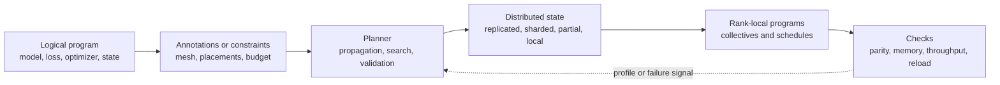

Diagram notation key: `Logical program` maps to $P$; `Planner` maps to the search or propagation procedure that chooses $\pi$; `Distributed state` maps to $\operatorname{place}_{\pi}$; `Rank-local programs` map to $\{P_r\}$; `Checks` map to numerical, memory, performance, and checkpoint validation.

### 1.2 Logical Tensors, Global Shapes, And Local Shards

A **logical tensor** is named by its global shape and semantic role before distribution. For example, an activation tensor may be:

$$
X \in \mathbb{R}^{B \times S \times H},
$$

where $B$ is the global batch size, $S$ is the global sequence length, and $H$ is hidden width. A rank may store only a slice of $X$, but formulas in this paper use the logical shape unless explicitly labeled local.

Let a logical tensor have shape:

$$
\operatorname{shape}(X) = (n_0, n_1, \ldots, n_{k-1}).
$$

If tensor dimension $j$ is sharded over mesh axis $a$ with degree $d_a$, the simple block-shard local interval for rank coordinate $r_a$ is:

$$
\ell_j(r_a)
=
\left\lfloor \frac{r_a n_j}{d_a} \right\rfloor,
\qquad
u_j(r_a)
=
\left\lfloor \frac{(r_a + 1)n_j}{d_a} \right\rfloor,
$$

and the local shard shape is:

$$
\operatorname{shape}
\left(
X^{(r_a)}
\right)
=
\left(
n_0,\ldots,n_{j-1},\;
u_j(r_a)-\ell_j(r_a),\;
n_{j+1},\ldots,n_{k-1}
\right).
$$

Symbols: $X$ is a logical tensor; $k$ is the tensor rank; $n_j$ is the size of tensor dimension $j$; $a$ is a mesh axis; $d_a$ is the number of ranks on axis $a$; $r_a \in \{0,\ldots,d_a-1\}$ is the coordinate of the current rank on axis $a$; $\ell_j(r_a)$ and $u_j(r_a)$ are the inclusive start and exclusive end of the local slice along dimension $j$; $X^{(r_a)}$ is the local shard on that axis. This balanced interval formula handles uneven shapes. Many systems store equivalent chunk metadata rather than recomputing the interval from the formula.

For multiple independent sharded dimensions, each sharded tensor dimension receives its own interval. For example, if $X \in \mathbb{R}^{B \times S \times H}$ is sharded over batch on axis `dp` and hidden width on axis `tp`, rank $(r_{\mathrm{dp}}, r_{\mathrm{tp}})$ stores:

$$
X^{(r_{\mathrm{dp}}, r_{\mathrm{tp}})}
\in
\mathbb{R}^{
(u_B-\ell_B) \times S \times (u_H-\ell_H)
}.
$$

Symbols: $r_{\mathrm{dp}}$ and $r_{\mathrm{tp}}$ are rank coordinates on the data-parallel and tensor-parallel axes; $\ell_B,u_B$ are the local interval bounds for the batch dimension; $\ell_H,u_H$ are the local interval bounds for the hidden dimension.

### 1.3 Device Meshes, Rank Coordinates, And Communication Groups

A logical device mesh is a named Cartesian product of mesh axes:

$$
\mathcal{M}
=
\mathcal{D}_{\mathrm{dp}}
\times
\mathcal{D}_{\mathrm{tp}}
\times
\mathcal{D}_{\mathrm{pp}}
\times
\mathcal{D}_{\mathrm{cp}}
\times
\mathcal{D}_{\mathrm{ep}}.
$$

Symbols: $\mathcal{M}$ is the logical mesh; $\mathcal{D}_{\mathrm{dp}}$ is the data-parallel or fully-sharded-data-parallel axis; $\mathcal{D}_{\mathrm{tp}}$ is the tensor-parallel axis; $\mathcal{D}_{\mathrm{pp}}$ is the pipeline-parallel axis; $\mathcal{D}_{\mathrm{cp}}$ is the context- or sequence-parallel axis; $\mathcal{D}_{\mathrm{ep}}$ is the expert-parallel axis. A given plan may omit axes it does not use.

A rank is addressed by coordinates:

$$
r =
\left(
r_{\mathrm{dp}}, r_{\mathrm{tp}}, r_{\mathrm{pp}}, r_{\mathrm{cp}}, r_{\mathrm{ep}}
\right),
$$

where each $r_a$ ranges from $0$ to $d_a-1$ on mesh axis $a$. The communication group for axis $a$ through rank $r$ is:

$$
G_a(r)
=
\{r' \in \mathcal{M} : r'_b = r_b \;\; \forall b \ne a\}.
$$

Symbols: $G_a(r)$ is the set of ranks that differ only along axis $a$ and therefore form a collective group for that axis; $r'$ is another rank coordinate; $b$ ranges over all mesh axes. PyTorch `DeviceMesh` manages this kind of group construction, while JAX `Mesh`, OpenXLA Shardy, and GSPMD expose related logical-axis concepts [S4, S5, S16, S23].

The mesh is logical, not necessarily physical. A planner may choose a mesh layout that places tensor-parallel groups inside a node for bandwidth and data-parallel groups across nodes for scale. Unless a source directly reports topology-aware mapping, this paper treats physical rank assignment as an implementation choice rather than a guaranteed property.

### 1.4 Placements And Tensor-State Contracts

A placement describes how a logical value is represented over one or more mesh axes. This paper uses the following shared vocabulary:

| Placement | Contract | Typical materialization | Evidence |
|---|---|---|---|
| Replicated | Every rank in the relevant mesh group stores the same logical value. | Keep local copy or all-reduce partial values into full copies. | DTensor, JAX, GSPMD [S4, S15, S23] |
| Sharded | Ranks store disjoint slices of one or more logical tensor dimensions. | Block shards, uneven chunks, or layout-specific chunk metadata. | DTensor `Shard`, JAX `PartitionSpec`, Shardy axes [S5, S15, S23] |
| Partial | Ranks store partial contributions to a value that requires a reduction before replicated use. | All-reduce for replicated result; reduce-scatter for sharded result. | DTensor `Partial`, GSPMD collective insertion [S4, S15] |
| Manual or local | A region intentionally receives local tensors and is responsible for its own communication contract. | Custom distributed code, explicit collectives, local kernels, or `shard_map`-like regions. | Shardy manual regions, JAX `shard_map`, PyTorch explicit distributed ops [S5, S16, S22] |

A compact placement type can be written:

$$
\operatorname{place}(X)
=
\left[
(a_0, s_0), (a_1, s_1), \ldots, (a_{m-1}, s_{m-1})
\right],
\qquad
s_i \in \{\operatorname{Replicate}, \operatorname{Shard}(j), \operatorname{Partial}, \operatorname{Manual}\}.
$$

Symbols: $\operatorname{place}(X)$ is the placement of tensor or state object $X$; $a_i$ is a mesh axis; $s_i$ is the placement state on that axis; $\operatorname{Shard}(j)$ means tensor dimension $j$ is partitioned over the axis; $\operatorname{Partial}$ means local values are pending a reduction; $\operatorname{Manual}$ means the automatic placement system delegates correctness inside that region.

Placement is state, not decoration. Operators consume and produce placements, and illegal placement combinations require redistribution or rejection. For an operator:

$$
Y = \operatorname{op}(X_1, X_2, \ldots, X_q),
$$

a propagation rule computes:

$$
\operatorname{place}(Y)
=
\Phi_{\operatorname{op}}
\left(
\operatorname{place}(X_1), \operatorname{place}(X_2), \ldots, \operatorname{place}(X_q)
\right),
$$

possibly with inserted redistribution.

Symbols: $Y$ is the output tensor; $X_i$ are input tensors; $q$ is the number of inputs; $\operatorname{op}$ is the logical operator; $\Phi_{\operatorname{op}}$ is the operator-specific placement propagation rule. Elementwise operators usually preserve a common placement; matrix multiplication may create partial values when the contracting dimension is sharded; normalization and softmax require special care if the normalized dimension is sharded.

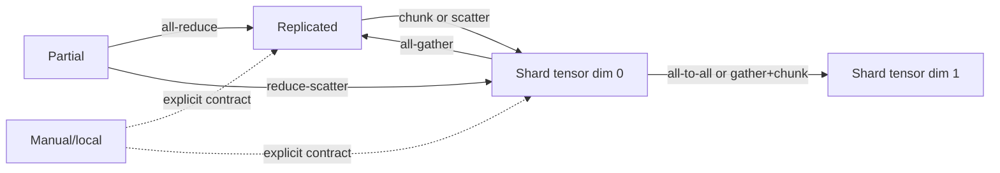

Diagram notation key: `Replicated` maps to $\operatorname{Replicate}$; `Shard tensor dim 0` maps to $\operatorname{Shard}(0)$; `Shard tensor dim 1` maps to $\operatorname{Shard}(1)$; `Partial` maps to $\operatorname{Partial}$; `Manual/local` maps to $\operatorname{Manual}$; edge labels name the communication or local transformation that changes placement.

### 1.5 Common Collectives And First-Order Communication Costs

This paper uses the following collective vocabulary. These are semantic contracts, not claims about a specific NCCL ([NVIDIA Collective Communications Library](https://developer.nvidia.com/nccl)) algorithm, topology, or overlap implementation.

| Collective | Contract | Common model-parallel use |
|---|---|---|
| All-reduce | Reduce values across a group and return the reduced result to every rank. | Data-parallel gradient synchronization; tensor-parallel partial outputs. |
| All-gather | Gather shards from all ranks and return the assembled value to every rank. | Parameter materialization; converting a sharded activation to replicated form. |
| Reduce-scatter | Reduce values across ranks and scatter shards of the reduced result. | Fully sharded gradient paths; partial-to-sharded tensor-parallel outputs. |
| All-to-all | Send a distinct shard from each rank to each other rank. | Sequence/context layout transpose; expert token dispatch; sharded-dimension exchange. |
| Broadcast | Copy a value from one source rank to all ranks in a group. | Initialization, metadata, seed or checkpoint coordination. |
| Send/recv | Point-to-point transfer between producer and consumer ranks. | Pipeline activations and gradients between adjacent stages. |

For first-order estimates, let $N$ be the number of logical elements in the tensor being communicated, $b$ be bytes per element, and $p$ be the collective group size. A ring-style per-rank volume approximation is:

$$
V_{\mathrm{ag}}
\approx
N b \cdot \frac{p-1}{p},
\qquad
V_{\mathrm{rs}}
\approx
N b \cdot \frac{p-1}{p},
$$

and an all-reduce implemented as reduce-scatter plus all-gather is:

$$
V_{\mathrm{ar}}
\approx
2 N b \cdot \frac{p-1}{p}.
$$

Symbols: $V_{\mathrm{ag}}$ is approximate per-rank all-gather volume; $V_{\mathrm{rs}}$ is approximate per-rank reduce-scatter volume; $V_{\mathrm{ar}}$ is approximate per-rank all-reduce volume; $N$ is logical element count; $b$ is bytes per element; $p$ is group size. These formulas omit startup latency, protocol thresholds, topology, contention, and overlap. Later category sections may use richer formulas when a specific algorithm requires them.

A simple communication time model is:

$$
T_{\mathrm{comm}}(c)
\approx
\alpha_c \cdot m_c
+
\frac{V_c}{\beta_c},
$$

where $c$ is a collective or point-to-point communication event.

Symbols: $T_{\mathrm{comm}}(c)$ is the estimated communication time for event $c$; $\alpha_c$ is an effective startup or synchronization cost; $m_c$ is the number of communication rounds or messages represented by the model; $V_c$ is the per-rank byte volume; $\beta_c$ is effective bandwidth for the relevant group and topology. This is a planner abstraction, not a replacement for profiling. PartIR, Alpa, DistIR, FlexFlow, and Galvatron all rely on some combination of symbolic modeling, simulation, profiling, or search over such costs [S1, S2, S8, S11, S12, S25].

### 1.6 Optimizer, Randomness, And Checkpoint State

The logical program includes more than parameters and activations. A correct distributed execution must place and reload:

| State | Examples | Placement concerns |
|---|---|---|
| Parameters | Transformer weights, embeddings, normalization scale and bias. | Replicated for small tensors, sharded for large tensors, materialized temporarily for compute. |
| Gradients | Per-parameter derivatives. | Partial after local backward, reduced or reduce-scattered before optimizer use. |
| Optimizer state | Adam moments, momentum buffers, step counters, master weights. | Often sharded with parameters; may exceed parameter memory by a large constant factor. |
| Activation state | Saved tensors for backward, recomputed checkpoints, pipeline buffers. | Sharded by tensor/context axes; rematerialized or scheduled to control peak memory. |
| Runtime state | Random-number generator state, dataloader position, scheduler state. | Must be reproducible or explicitly declared non-deterministic. |
| Checkpoint metadata | Tensor names, global shapes, placements, mesh shape, dtype, version. | Needed for load-time resharding and migration across mesh shapes. |

For an optimizer such as Adam with two moment buffers and optional full-precision master weights, a rough per-rank optimizer-plus-parameter memory estimate is:

$$
M_{\mathrm{param+opt}}
\approx
\sum_{W \in \Theta}
\frac{
N_W
\left(
b_W + b_g + n_{\mathrm{opt}} b_{\mathrm{opt}} + b_{\mathrm{master}}
\right)
}{s_W}.
$$

Symbols: $\Theta$ is the set of parameter tensors; $W$ is one parameter tensor; $N_W$ is the number of logical elements in $W$; $b_W$ is bytes per stored parameter element; $b_g$ is bytes per gradient element if gradients are resident; $n_{\mathrm{opt}}$ is the number of optimizer state tensors per parameter, such as two for Adam moments; $b_{\mathrm{opt}}$ is bytes per optimizer-state element; $b_{\mathrm{master}}$ is bytes per master-weight element, or $0$ if no master copy is kept; $s_W$ is the effective sharding degree for the parameter and its associated state. The estimate assumes optimizer state follows parameter sharding; ZeRO/FSDP-style designs and checkpoint formats may violate or refine that assumption.

Checkpointing must preserve logical identity separately from physical layout. A checkpoint entry should be understandable as:

$$
\operatorname{ckpt}(W)
=
\left(
\operatorname{name}(W),\;
\operatorname{shape}(W),\;
\operatorname{dtype}(W),\;
\operatorname{place}(W),\;
\operatorname{mesh},\;
\operatorname{payload}
\right).
$$

Symbols: $\operatorname{ckpt}(W)$ is the checkpoint record for tensor $W$; $\operatorname{name}(W)$ is its stable logical name; $\operatorname{shape}(W)$ is the global shape; $\operatorname{dtype}(W)$ is the element type; $\operatorname{place}(W)$ is the saved placement; $\operatorname{mesh}$ records the mesh used at save time; $\operatorname{payload}$ is the stored local or global tensor data. PyTorch Distributed Checkpoint and TorchTitan provide the main PyTorch-native public evidence for distributed checkpoint and resharding workflows [S18, S21]. veScale also exposes checkpointing as part of its distributed tensor programming stack [S7].

### 1.7 Planning Objective And Constraints

Automatic model parallelization is a constrained optimization problem. A candidate plan $\pi$ may choose placements, recomputation, pipeline stages, collective placement, operator rewrites, and schedule. A general objective is:

$$
\min_{\pi \in \Pi}
\left[
T_{\mathrm{compute}}(\pi)
+
T_{\mathrm{comm}}(\pi)
+
T_{\mathrm{schedule}}(\pi)
+
T_{\mathrm{io}}(\pi)
\right],
$$

subject to:

$$
M_{\mathrm{params}}(\pi)
+
M_{\mathrm{opt}}(\pi)
+
M_{\mathrm{grads}}(\pi)
+
M_{\mathrm{acts}}(\pi)
+
M_{\mathrm{workspace}}(\pi)
\le
M_{\mathrm{device}},
$$

and:

$$
\operatorname{legal}(\pi, P, \mathcal{M}) = \operatorname{true}.
$$

Symbols: $\Pi$ is the search space; $\pi$ is one candidate plan; $T_{\mathrm{compute}}$ is compute time; $T_{\mathrm{comm}}$ is communication time; $T_{\mathrm{schedule}}$ is overhead from pipeline bubbles, synchronization, dispatch, or runtime scheduling; $T_{\mathrm{io}}$ is checkpoint or data-loading time when included; $M_{\mathrm{params}}$, $M_{\mathrm{opt}}$, $M_{\mathrm{grads}}$, $M_{\mathrm{acts}}$, and $M_{\mathrm{workspace}}$ are parameter, optimizer, gradient, activation, and temporary memory; $M_{\mathrm{device}}$ is usable memory per device; $\operatorname{legal}$ checks shape divisibility or chunk metadata, operator placement support, dependency ordering, and semantic constraints.

The objective should be read as a shared contract for later sections, not as a claim that every system solves the same optimization problem. PartIR, Automap, Alpa, FlexFlow, Unity, DistIR, Galvatron, Slapo, and PaSE each choose different search spaces and evidence mechanisms [S1, S2, S3, S8, S9, S11, S12, S13, S27]. PyTorch-native systems often expose composable primitives rather than one fully automatic public planner [S15, S17, S18, S20, S21].

### 1.8 Evidence Grades And Source Policy

This paper uses evidence labels to avoid treating public papers, official implementation docs, and inferred systems consequences as the same kind of claim.

| Label | Use in this paper | Example source forms |
|---|---|---|
| `paper` | A claim directly supported by a paper, preprint, conference paper, or technical report. | GSPMD, Alpa, Unity, DistIR, Galvatron, PartIR [S1, S4, S8, S9, S11, S12] |
| `official repo` | A claim supported by project-owned source code, examples, or repository documentation. | TorchTitan, veScale, FlexFlow Train [S7, S10, S21] |
| `official docs/blog` | A claim supported by vendor or project documentation, guides, or official engineering posts. | PyTorch DTensor, DeviceMesh, Distributed Checkpoint (DCP), PyTorch/XLA, Shardy, JAX [S5, S15, S16, S18, S23, S24] |
| `third-party integration` | A claim supported by downstream integration or user-facing implementation evidence outside the original system. | Runtime or framework integrations when primary docs are unavailable. |
| `inferred` | A consequence reasoned from public APIs, shapes, or architecture, but not disclosed as an implementation fact. | Topology placement choices, hidden planner internals, unavailable production details. |

Rules for using these labels:

- Cite close to the technical claim, especially when naming a system capability or limitation.
- Use `inferred` for plausible planner behavior that public sources do not directly disclose.
- Preserve source scope for benchmarks: hardware, precision, model shape, sequence length, baseline, and whether results are simulated or measured.
- Treat repository maturity as evidence. An active official primitive and an archived research artifact can both be valuable, but they support different operational claims.
- Avoid using closed-lab rumors, private implementation knowledge, or uncited production anecdotes as evidence.

### 1.9 Renderer And Notation Conventions

The paper targets Markdown renderers used in common editors and review tools. To keep formulas and diagrams portable:

- Inline math uses `$...$`; displayed formulas use `$$...$$`.
- Every displayed formula group is followed by a `Symbols:` paragraph that defines every symbol introduced there.
- Mermaid node labels use plain text or Unicode, not raw LaTeX. A `Diagram notation key` follows each Mermaid diagram.
- Markdown tables avoid raw pipe characters inside math; use `\lvert x \rvert` rather than `|x|` inside table cells.
- Acronyms are expanded at first meaningful use unless they are common in the target audience, such as GPU, CPU, API, URL, or LLM.
- Global tensor shapes use capital dimension names such as $B$, $S$, and $H$; local shard sizes use interval notation such as $u_j(r_a)-\ell_j(r_a)$.
- The word `rank` means a process or device coordinate in the logical mesh unless the context explicitly says tensor rank.
- The word `axis` means a mesh axis when written as $a$ or named `dp`, `tp`, `pp`, `cp`, or `ep`; it means a tensor dimension when written as dimension $j$.

## 2. Technique Taxonomy

Automatic model parallelization is best read as a pipeline of primitive mechanisms, not as a list of frameworks. The primitives below answer four recurring questions: what must be separated from model code, what bottleneck or correctness problem the primitive addresses, what information flows into and out of it, and which PyTorch substrate could execute the resulting plan. A system such as GSPMD, PartIR, Alpa, Galvatron, Slapo, veScale, or TorchTitan combines several rows; the rows are the reusable vocabulary.

The taxonomy is intentionally asymmetric. Some primitives are representation primitives, such as meshes and placement states. Others are inference and planning primitives, such as sharding propagation, cost modeling, and search. The last group is execution and operations infrastructure, such as SPMD lowering, pipeline scheduling, checkpoint resharding, and equivalence checks. A PyTorch-native automatic parallelizer should connect these groups through a planner that emits plans over `DeviceMesh`, DTensor placements, FSDP2, tensor parallelism, pipeline APIs, and Distributed Checkpoint rather than inventing a separate execution framework.

### 2.1 Compact Primitive Map

| Primitive | Bottleneck or risk addressed | Required inputs | Produced outputs | PyTorch projection | Evidence pointer |
|---|---|---|---|---|---|
| Single-device semantic model | Prevents distributed concerns from leaking into architecture code; preserves a reference program for correctness. | `torch.nn.Module` or captured training step; example inputs; optional initialization and optimizer policy. | Logical graph or module tree, reference outputs/losses, model-state schema. | Plain `torch.nn.Module`, meta-device initialization, `torch.export` when capture is possible, eager fallback when it is not. | GSPMD single-program contract [S4] (`paper`); veScale eager SPMD goal [S6, S7] (`paper` + `official repo`); PyTorch export [S19] (`official docs`). |
| Logical mesh and named axes | Removes hard-coded rank arithmetic; lets one topology support data, tensor, pipeline, context, and expert axes. | Physical devices, topology hints, desired axis sizes and names, locality constraints. | `dp`, `tp`, `pp`, `cp`, `ep` axis groups and submeshes. | `DeviceMesh`, `init_device_mesh`, mesh slicing such as `mesh["tp"]`. | PyTorch DeviceMesh [S16] (`official docs`); JAX `Mesh`/`PartitionSpec` [S23] (`official docs`); Shardy mesh axes [S5] (`official docs/repo`). |
| Placement state type system | Makes tensor distribution explicit enough to infer or validate communication. | Tensor shapes, mesh axes, user hints, operator constraints. | Per-value placements: replicated, sharded by dimension, partial reduction, or local/manual. | DTensor `Replicate()`, `Shard(dim)`, `Partial()`, `redistribute`. | DTensor placement docs [S15] (`official docs`); GSPMD and Shardy sharding representations [S4, S5] (`paper` + `official docs/repo`). |
| Strategy or tactic language | Encodes parallelization separately from model source; supports both user constraints and planner-generated actions. | Model targets, mesh axes, legal actions, priority/constraint metadata, objective. | Tactics such as shard module, fully shard region, split stage, checkpoint region, force layout. | Conceptual `ParallelSpec`; concrete fragments via `parallelize_module`, FSDP2 `fully_shard`, pipeline splits, checkpoint wrappers. | PartIR tactics [S1] (`paper`); Slapo schedule primitives [S13] (`paper` + `official docs`); PyTorch TP plans [S17] (`official docs`). |
| Sharding propagation | Avoids requiring the user to annotate every intermediate tensor; detects illegal layout combinations early. | Input and parameter placements, operator graph, operator-specific sharding rules. | Placements for intermediate values; required redistribution edges; legality diagnostics. | DTensor operator propagation in eager mode; FX/ATen (PyTorch tensor operator library) or `torch.export` metadata propagation; PyTorch/XLA SPMD annotations. | GSPMD propagation [S4] (`paper`); Shardy propagation constraints [S5] (`official docs/repo`); DTensor operator semantics [S15] (`official docs`). |
| SPMD lowering and collective insertion | Converts abstract placements into rank-local computation and communication. | Logical graph, mesh, placements, redistribution edges, rank coordinate. | Per-rank program behavior; inserted all-gather, reduce-scatter, all-reduce, all-to-all, send/recv. | DTensor dispatch and `redistribute`; PyTorch/XLA SPMD; explicit `torch.distributed` collectives where planner support is absent. | GSPMD partitioner [S4] (`paper`); PyTorch/XLA SPMD [S14, S24] (`official docs/blog`); DTensor [S15] (`official docs`). |
| Composite parallelism composition and expressibility | Prevents local optima from treating FSDP, tensor parallel (TP), pipeline parallel (PP), context parallel (CP), expert parallel (EP), activation checkpointing, and optimizer sharding as unrelated features. | Mesh axes, module graph, placement rules, memory budget, supported execution adapters, and tactic ordering constraints. | Multi-axis plan assigning parameters, activations, optimizer state, layers, sequence shards, experts, schedules, and explicit unsupported/manual regions. | `DeviceMesh` submeshes; FSDP2 for data/shard axes; `parallelize_module` for TP; pipeline APIs; project-specific CP/EP adapters; conceptual `ParallelSpec` and `PlanIR`. | Alpa hierarchical planning [S8] (`paper` + `official repo`); Galvatron hybrid transformer planning [S12] (`paper` + `official docs/repo`); PartIR tactics [S1] (`paper`); TorchTitan composition [S21] (`official repo` + `paper`); veScale [S6, S7] (`paper` + `official repo`). |
| Cost model and simulator | Reduces full-cluster trial-and-error; filters plans that exceed memory or expose too much communication. | Graph shapes, candidate placements, kernel estimates, collective estimates, topology, precision, activation policy. | Estimated step time, memory, communication volume, overlap risk, checkpoint cost. | Fake/meta tensors; `torch.export` shape information; profiler-calibrated op tables; NCCL/group topology estimates; DCP cost terms when relevant. | PartIR estimation [S1] (`paper`); DistIR simulator [S11] (`paper`); FlexFlow simulator lineage [S10, S25] (`official repo` + `paper`); Galvatron memory/search model [S12] (`paper`). |
| Search and planning | Navigates a combinatorial space of legal placements, rewrites, and schedules. | Tactic space, cost model, legality checks, objectives, user constraints, calibration data. | Selected plan, ranked alternatives, rejected-plan diagnostics, confidence caveats. | External planner that emits `PlanIR` over DTensor/FSDP2/TP/PP/DCP or PyTorch/XLA SPMD annotations. | Automap [S3] (`paper`); PartIR automatic tactic discovery [S2] (`paper`); Alpa [S8] (`paper`); Unity [S9] (`paper`); Galvatron [S12] (`paper`). |
| Algebraic and graph rewrites | Makes better parallel plans possible by changing equivalent graph structure, not only tensor placement. | Captured graph or module schedule, rewrite library, numerical tolerance, placement constraints. | Rewritten graph, decomposed/fused operators, checkpoint regions, kernel substitutions, updated legality facts. | FX/export passes, AOTAutograd (ahead-of-time automatic differentiation) decompositions, `torch.compile`/kernel replacement, Slapo-style schedule edits. | Unity joint rewrite/search [S9] (`paper`); Slapo schedule language [S13] (`paper` + `official docs`); `torch.export` [S19] (`official docs`). |
| Pipeline and runtime scheduling | Turns stage placement into an efficient execution timeline; controls bubbles, overlap, and memory. | Stage partition, microbatch count, stage costs, activation sizes, send/recv topology, checkpoint policy. | Microbatch schedule, stage runtime graph, activation/gradient transfers, overlap plan, bubble estimate. | PyTorch distributed pipeline APIs; `DeviceMesh["pp"]`; TorchTitan pipeline helpers; explicit send/recv for custom runtimes. | Alpa runtime orchestration [S8] (`paper` + `official repo`); Galvatron pipeline choices [S12] (`paper`); PyTorch pipeline docs [S20] (`official docs`); TorchTitan [S21] (`official repo`). |
| State and checkpoint resharding | Keeps training state portable across mesh shapes, parallelism strategies, and restart configurations. | Current plan, target plan, parameter/optimizer/random-number-generator (RNG)/data-loader state, storage layout. | Sharded state dict, load-time reshard plan, restart-safe state metadata. | DTensor state dicts; PyTorch Distributed Checkpoint; FSDP2 state handling; TorchTitan checkpoint utilities. | PyTorch DCP [S18] (`official docs`); veScale checkpoint/resharding direction [S7] (`official repo/docs`); TorchTitan [S21] (`official repo`). |
| Debuggability and equivalence | Makes automatic plans trustworthy; catches silent semantic drift from bad propagation, nondeterminism, or state mismatch. | Reference run, distributed run, placement trace, RNG policy, tolerances, profile events. | Loss/gradient parity reports, placement dumps, per-rank traces, legality errors, reproducibility notes. | Small-model parity tests, DTensor layout assertions, deterministic RNG/state handling, `torch.profiler`, TorchTitan-style recipe checks. | veScale consistency focus [S6] (`paper`); TorchTitan operational examples [S21] (`official repo` + `paper`); PartIR predictability goal [S1] (`paper`). |

### 2.2 Dependency Graph

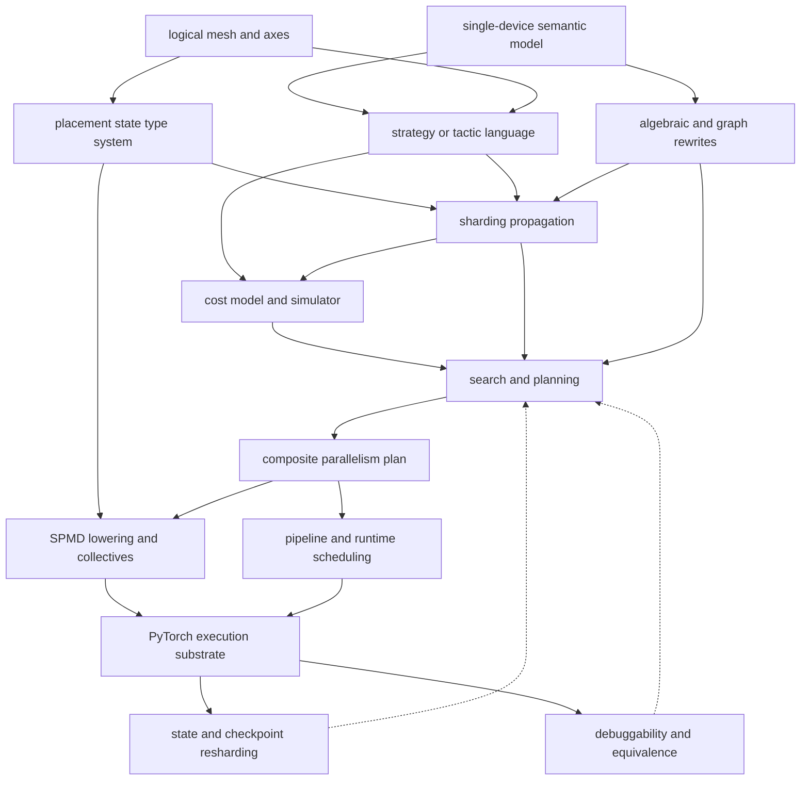

**Diagram notation key:** `SPMD` maps to single program, multiple data; `collectives` means all-gather, reduce-scatter, all-reduce, all-to-all, and point-to-point transfers; `PyTorch execution substrate` maps to DTensor, FSDP2, tensor parallelism, pipeline APIs, Distributed Checkpoint, PyTorch/XLA, and lower-level `torch.distributed` calls.

The dependency graph should not be read as a strict compiler pipeline. Eager PyTorch systems may interleave placement propagation with execution, while XLA-style systems run more of the inference and lowering in a compiler. The useful invariant is data ownership: meshes and placements describe where tensors may live; tactics describe what the planner is allowed to change; propagation and cost modeling evaluate consequences; lowering and scheduling make the plan executable; checkpointing and equivalence checks keep the execution tied to the original model contract.

### 2.3 Interpreting the Rows

The first three rows form the representation layer. A single-device model, a logical mesh, and placement states are enough to state the separation contract: the user owns the mathematical program, while the infrastructure owns where each value resides. This is the common design thread across GSPMD, Shardy, JAX sharding, DTensor, and veScale [S4, S5, S6, S15, S23].

The middle rows form the planner layer. Strategy languages, propagation, cost models, search, and rewrites are where systems differ most. PartIR emphasizes composable tactics and later automatic tactic discovery; Automap focuses on ergonomic automated parallelism; Alpa separates inter-operator and intra-operator planning; Unity searches algebraic rewrites together with parallelization; Galvatron narrows the search space for transformer training [S1, S2, S3, S8, S9, S12]. For PyTorch, this suggests that the planner should be allowed to emit ordinary native components rather than replace them: tensor-parallel plans for modules, FSDP2 wrapping, pipeline splits, checkpoint regions, DTensor redistributions, or PyTorch/XLA annotations [S14, S15, S17, S20, S21].

The final rows form the execution and operations layer. SPMD lowering and pipeline scheduling determine whether a placement plan is actually runnable; state resharding and equivalence checks determine whether it is usable in long-running training. This is where native PyTorch infrastructure matters most. `DeviceMesh`, DTensor, Distributed Checkpoint, tensor parallelism, and pipeline APIs are already public building blocks, while TorchTitan demonstrates that they can be composed into a large-model training stack [S15, S16, S17, S18, S20, S21]. What remains under-specified in public PyTorch is the fully automatic planner that chooses among these components for arbitrary model code.

## 3. Primitive Techniques And PyTorch Mappings

### 3.1 Single-Device Semantic Model

The single-device semantic model is the contract that the model definition describes the mathematical program, while placement, communication, and schedule are selected outside the model. A model author writes the reference computation:

$$
y = f_\theta(x)
$$

and the parallelization system chooses an execution plan:

$$
\pi : (f_\theta, x, \mathcal{M}, C) \mapsto
(\operatorname{place}, \operatorname{schedule}, \operatorname{collectives})
$$

Symbols: $f_\theta$ is the logical model parameterized by $\theta$; $x$ is an input batch or example input signature; $\mathcal{M}$ is the logical device mesh; $C$ is the set of user, hardware, and numerical constraints; $\pi$ is the planner; $\operatorname{place}$ maps tensors or graph values to placements; $\operatorname{schedule}$ orders work over devices and microbatches; $\operatorname{collectives}$ are inserted communication operations.

The problem solved by this primitive is ownership. Without a single-device semantic model, every model implementation must embed its own rank checks, local parameter slices, hand-written process groups, and custom load logic. That makes the model harder to test, harder to export, and harder to reuse under a different topology. With this primitive, the model remains the source of mathematical truth; distributed execution is a replaceable interpretation of that model. GSPMD states the compiler form of this idea: users write a mostly single-device program with sparse sharding annotations, and the partitioner infers per-operator partitions and communication [S4]. veScale states the PyTorch form: ordinary eager `torch.nn.Module` programs can be interpreted with SPMD tensor semantics and planning layered outside the authoring surface [S6, S7].

The practical PyTorch consequence is that model authors should not hand-shard modules as the default abstraction. Hand-sharding means constructing a smaller `Linear`, `Embedding`, attention head set, or feed-forward block per rank and manually encoding the rank-local shape in the module itself. That approach can be useful for expert kernels or legacy code, but it collapses semantic and physical concerns into one class. A planner then cannot easily prove that two local modules reconstruct one logical parameter, cannot freely move from tensor parallelism to FSDP, and cannot initialize or checkpoint without topology-specific code. The better default is to create the logical module once, often on the `meta` device or through fake tensors, and let the distributed runtime materialize only the local shards needed by the selected plan.

Meta-device and fake-tensor initialization make this separation concrete. The `meta` device records tensor metadata, such as shape, dtype, and stride, without allocating storage. Fake tensors extend this idea for analysis by carrying tensor metadata through operations in a way that resembles real execution. A planner can therefore inspect a trillion-parameter model's structure without first allocating trillion-parameter storage on one host or one GPU. Later, FSDP2, DTensor, tensor-parallel adapters, or a checkpoint loader can allocate exactly the local parameter shards required by the selected mesh and placements.

Inputs and outputs:

| Item | Description |
|---|---|
| Inputs | Model constructor, example input signatures, optional training step, target mesh, policy constraints, and checkpoint metadata if loading existing weights. |
| Intermediate evidence | Parameter names, module hierarchy, tensor shapes and dtypes, graph or eager traces when available, and operator-level shape propagation results. |
| Outputs | A logical model whose parameters, buffers, activations, gradients, and optimizer state have assigned placements and initialization rules. |
| Correctness condition | The distributed training step computes the same logical update as the reference program within the expected numerical tolerance and randomness policy. |

For a transformer block, the user-facing source should remain ordinary module code:

```python
class Block(torch.nn.Module):
    def __init__(self, hidden, mlp_hidden):
        super().__init__()
        self.norm = torch.nn.LayerNorm(hidden)
        self.qkv = torch.nn.Linear(hidden, 3 * hidden, bias=False)
        self.proj = torch.nn.Linear(hidden, hidden, bias=False)
        self.mlp = torch.nn.Sequential(
            torch.nn.Linear(hidden, mlp_hidden),
            torch.nn.GELU(),
            torch.nn.Linear(mlp_hidden, hidden),
        )

    def forward(self, x):
        h = self.norm(x)
        qkv = self.qkv(h)
        y = self.proj(attention(qkv))
        return x + self.mlp(y)
```

The distributed policy is separate:

```python
with torch.device("meta"):
    model = Transformer(config)

mesh = init_device_mesh(
    "cuda",
    (dp, tp, pp),
    mesh_dim_names=("dp", "tp", "pp"),
)

plan = {
    "layers.*.qkv": ColwiseParallel(),
    "layers.*.proj": RowwiseParallel(),
    "layers.*.mlp.0": ColwiseParallel(),
    "layers.*.mlp.2": RowwiseParallel(),
}

parallelize_module(model, mesh["tp"], plan)
fully_shard(model, mesh=mesh["dp"])
```

This example is intentionally schematic: the important boundary is that `Block` does not contain rank arithmetic, manually sliced weight shapes, or hard-coded process groups. The plan may be changed from pure FSDP to FSDP plus tensor parallelism, or later combined with pipeline stages, without rewriting the model class.

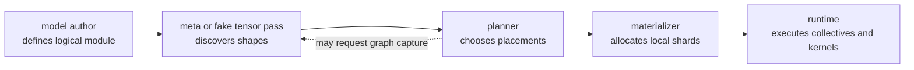

**Diagram notation key:** `logical module` means the model as if it were run on one device; `meta or fake tensor pass` means storage-free shape and dtype analysis; `placements` are replicated, sharded, partial, or manual states; `materializer` creates real local tensors only after a plan has been selected.

PyTorch mapping:

| Requirement | PyTorch projection |
|---|---|
| Preserve the model as the semantic source of truth | Keep `torch.nn.Module` definitions ordinary and avoid rank-local parameter definitions in model code. |
| Inspect shapes without allocating full storage | Use `meta`-device construction and fake tensor or export-based analysis where supported. |
| Capture analyzable regions | Use `torch.export`, FX, AOTAutograd, or eager tracing paths when the model permits capture [S19]. |
| Execute dynamic regions | Fall back to eager DTensor or explicit wrapper boundaries for code that cannot be fully captured [S15]. |
| Materialize distributed state | Use DTensor distribution, FSDP2 `fully_shard`, tensor-parallel `parallelize_module`, and distributed checkpoint load-time materialization [S15, S17, S18, S21]. |
| Preserve checkpoint portability | Store logical names and placement metadata so a checkpoint can be resharded onto a different mesh. |

Implementation examples are therefore best written as policy adapters, not module forks. A tensor-parallel adapter may replace selected `Linear` submodules with DTensor-aware layouts. An FSDP2 adapter may shard parameter storage and optimizer state after module construction. A pipeline adapter may split the module hierarchy into stage modules. In all three cases, the adapter acts on a single logical model rather than requiring the author to maintain separate model classes for each parallelism strategy.

Explore Further:

- GSPMD paper for the compiler version of single-program partitioning: https://arxiv.org/abs/2105.04663
- PyTorch DTensor documentation for eager distributed tensor semantics: https://docs.pytorch.org/docs/stable/distributed.tensor.html
- PyTorch tensor parallelism documentation for module-level layout plans: https://docs.pytorch.org/docs/stable/distributed.tensor.parallel
- PyTorch `torch.export` documentation for graph capture constraints: https://docs.pytorch.org/docs/stable/user_guide/torch_compiler/export.html
- TorchTitan repository for practical composition of meta initialization, FSDP2, tensor parallelism, and pipeline parallelism: https://github.com/pytorch/torchtitan

Evidence boundary: The concept-first claim is stable across GSPMD, JAX/OpenXLA, PyTorch/XLA SPMD, DTensor, veScale, Slapo, and TorchTitan: distributed placement should be separable from model meaning [S4, S6, S13, S14, S15, S21, S23]. The exact maturity of PyTorch mechanisms varies. `torch.export` has graph-capture constraints; DTensor and tensor-parallel APIs expose a practical mapping but are not a complete automatic planner; FSDP2 and TorchTitan show implementation patterns rather than a universal model-authoring standard. Claims about fake tensors as planner inputs should be presented as a PyTorch design projection unless tied to a specific implementation path in a given codebase.

### 3.2 Logical Mesh And Named Axes

A logical mesh names dimensions of a device set independently of physical rank numbers. Instead of saying "rank 3 communicates with ranks 1, 2, and 7," the plan says "this tensor is sharded over the `tp` axis" or "this module is replicated over the `dp` axis." The mesh becomes the coordinate system in which parallelism is expressed.

Let the logical mesh be:

$$
\mathcal{M}
=
\mathcal{D}_{\mathrm{dp}}
\times
\mathcal{D}_{\mathrm{tp}}
\times
\mathcal{D}_{\mathrm{pp}}
\times
\mathcal{D}_{\mathrm{cp}}
\times
\mathcal{D}_{\mathrm{ep}}.
$$

A rank is addressed by coordinates:

$$
r =
(r_{\mathrm{dp}}, r_{\mathrm{tp}}, r_{\mathrm{pp}}, r_{\mathrm{cp}}, r_{\mathrm{ep}}).
$$

Symbols: $\mathcal{M}$ is the logical mesh; $\mathcal{D}_{\mathrm{dp}}$, $\mathcal{D}_{\mathrm{tp}}$, $\mathcal{D}_{\mathrm{pp}}$, $\mathcal{D}_{\mathrm{cp}}$, and $\mathcal{D}_{\mathrm{ep}}$ are the data, tensor, pipeline, context, and expert axes; $r$ is a rank coordinate; each $r_a$ is the coordinate along mesh axis $a$.

The problem solved by named mesh axes is that model-parallel tactics need stable names for communication groups. Tensor parallelism generally wants fast, dense communication, so `tp` is often mapped within a node or within an NVLink/NVSwitch island. Data parallelism and FSDP can often tolerate wider cross-node communication, so `dp` may span nodes. Pipeline parallelism has a directional activation flow, so `pp` may map to an ordered list of stages that minimizes send/recv cost and balances compute. Context and expert axes may require all-to-all-heavy traffic, so their physical mapping depends on sequence length, routing distribution, and interconnect topology.

For an axis $a$, the communication group through rank $r$ is:

$$
G_a(r)
=
\{r' \in \mathcal{M} : r'_b = r_b \;\; \forall b \ne a\}.
$$

Symbols: $G_a(r)$ is the set of ranks that vary only along axis $a$ while matching $r$ on all other axes; $r'$ is a candidate rank coordinate; $b$ ranges over all mesh axes. A tensor sharded over `tp` uses $G_{\mathrm{tp}}(r)$ for tensor-parallel collectives; a gradient replicated over `dp` uses $G_{\mathrm{dp}}(r)$ for data-parallel reductions.

Physical topology mapping is a second function:

$$
\phi : \mathcal{M} \rightarrow \mathcal{P},
$$

where $\mathcal{P}$ is the set of physical devices and network links. The planner chooses $\phi$ so that heavy communication axes align with high-bandwidth topology. A common 16-GPU example is:

$$
\mathcal{M} = \mathcal{D}_{\mathrm{dp}}^{(2)}
\times \mathcal{D}_{\mathrm{pp}}^{(2)}
\times \mathcal{D}_{\mathrm{tp}}^{(4)},
$$

where each pipeline stage uses a four-GPU tensor-parallel group, and two data-parallel replicas span the remaining dimension. One physical mapping could place each `tp` group inside one 4-GPU locality domain, order `pp` stages across adjacent locality domains, and place `dp` replicas across equivalent domains.

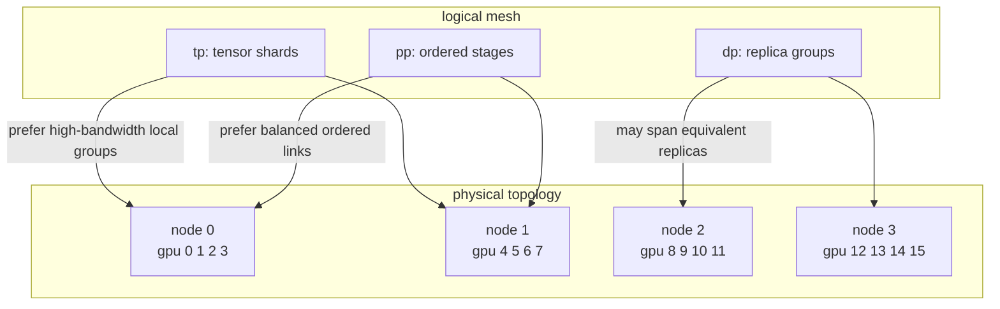

**Diagram notation key:** `dp` is data or FSDP replication; `pp` is pipeline stage order; `tp` is tensor-parallel sharding; `node` labels represent physical locality domains. The arrows illustrate mapping preferences, not a unique required placement.

Inputs and outputs:

| Item | Description |
|---|---|
| Inputs | Device inventory, process rank list, topology hints, desired mesh shape, named axis sizes, and tactic constraints. |
| Outputs | A named `DeviceMesh`, process groups for each axis or submesh, and a physical rank assignment $\phi$. |
| Derived objects | Axis groups $G_a(r)$, submeshes such as `mesh["tp"]`, and cross-axis products such as `mesh[("dp", "tp")]`. |
| Correctness condition | Every rank has one coordinate in the mesh; collective groups match placement semantics; all tactics refer to existing axes. |

PyTorch mapping:

```python
mesh = init_device_mesh(
    "cuda",
    (dp, pp, tp),
    mesh_dim_names=("dp", "pp", "tp"),
)

dp_mesh = mesh["dp"]
tp_mesh = mesh["tp"]
pp_mesh = mesh["pp"]

model = parallelize_module(model, tp_mesh, tp_plan)
fully_shard(model, mesh=dp_mesh)
```

The named-axis form allows a plan to be read without knowing global rank numbering. `ColwiseParallel()` can target the `tp` submesh; `fully_shard()` can target the `dp` submesh; a pipeline splitter can target the ordered `pp` axis. If the cluster topology changes from 8 GPUs per node to 4 GPUs per node, the plan may keep the same logical intent while the mesh constructor or topology mapper changes $\phi$.

Named axes are also where a planner distinguishes logical equivalence from performance equivalence. Two mappings can be semantically valid and still have very different cost. For example, placing an all-to-all-heavy expert axis across slow inter-node links may preserve correctness while destroying throughput. The automatic planner therefore needs both placement legality and topology-aware cost.

Explore Further:

- PyTorch DeviceMesh recipe: https://docs.pytorch.org/tutorials/recipes/distributed_device_mesh.html
- PyTorch distributed communication documentation: https://docs.pytorch.org/docs/stable/distributed.html
- JAX sharding, `Mesh`, `PartitionSpec`, and `NamedSharding`: https://docs.jax.dev/en/latest/jax.sharding.html
- OpenXLA Shardy overview: https://openxla.org/shardy/overview
- Alpa for automated inter- and intra-operator mapping across device meshes: https://research.google/pubs/alpa-automating-inter-and-intra-operator-parallelism-for-distributed-deep-learning/

Evidence boundary: PyTorch `DeviceMesh`, JAX `Mesh`, and Shardy provide public evidence for named logical axes [S5, S16, S23]. The stronger claim that a PyTorch-native planner can automatically choose an optimal physical mapping for arbitrary clusters should be treated as a design goal or inferred projection unless a specific implementation is cited. The paper can safely state that topology mapping is required for performance and that existing systems such as GSPMD, Alpa, and Galvatron demonstrate topology- or cost-aware planning in their own settings [S4, S8, S12].

### 3.3 Placement Types

Placement types are the semantic states assigned to tensors over mesh axes. They answer the question: what does this rank's local value mean relative to the logical tensor? Without this type information, a compiler or runtime cannot know whether a local tensor is a complete value, a slice of a larger value, or a partial sum waiting for reduction.

For tensor $X$ over mesh $\mathcal{M}$, define:

$$
\operatorname{place}(X)
=
\left[
(a_0, s_0),
(a_1, s_1),
\ldots,
(a_{m-1}, s_{m-1})
\right],
$$

where:

$$
s_i \in
\{
\operatorname{Replicate},
\operatorname{Shard}(j),
\operatorname{Partial}(\rho),
\operatorname{Manual}
\}.
$$

Symbols: $\operatorname{place}(X)$ is the placement assignment for logical tensor $X$; $a_i$ is a mesh axis; $s_i$ is the state on that axis; $\operatorname{Shard}(j)$ means tensor dimension $j$ is partitioned over that axis; $\operatorname{Partial}(\rho)$ means each rank holds an unreduced contribution under reduction operator $\rho$, commonly sum; $\operatorname{Manual}$ means the system treats the region as already local or explicitly managed.

`Replicate` means each rank in the relevant group stores the same logical tensor. `Shard(j)` means ranks store disjoint slices along tensor dimension $j$. `Partial` means ranks store values that are not yet the logical value, but become legal after a reduction. `Manual` marks a boundary where the automatic placement system does not interpret internal tensor semantics.

The problem solved by explicit placement types is legality. Consider matrix multiplication:

$$
Y = X W,
$$

where $X \in \mathbb{R}^{B \times H}$, $W \in \mathbb{R}^{H \times O}$, and $Y \in \mathbb{R}^{B \times O}$. If $W$ is column-sharded over `tp` along $O$, then each rank computes a shard of $Y$ and the output placement is $\operatorname{Shard}(1)$. If $W$ is row-sharded over `tp` along $H$, then each rank computes a partial contribution to every output column; the output placement is $\operatorname{Partial}(\mathrm{sum})$ until an all-reduce or reduce-scatter materializes a complete or sharded result.

Column-sharded case:

$$
W =
[W_0 \; W_1 \; \cdots \; W_{p-1}],
\quad
Y_i = X W_i,
\quad
\operatorname{place}(Y)=\operatorname{Shard}(O).
$$

Row-sharded case:

$$
X =
[X_0 \; X_1 \; \cdots \; X_{p-1}],
\quad
W =
\begin{bmatrix}
W_0 \\
W_1 \\
\vdots \\
W_{p-1}
\end{bmatrix},
\quad
\tilde{Y}_i = X_i W_i,
\quad
Y = \sum_{i=0}^{p-1} \tilde{Y}_i.
$$

Symbols: $p$ is the number of ranks on the tensor-parallel axis; $W_i$ is the local weight shard on rank $i$; $X_i$ is the local input shard on rank $i$; $\tilde{Y}_i$ is a local partial output; $Y$ is the logical output after reduction.

Pending-reduction legality is the most important subtlety. A `Partial` value is legal only for operations that can either preserve partialness or explicitly resolve it. Linear operations such as addition of two partial tensors with the same reduction group can remain partial. A matrix multiply may consume a sharded input and produce a partial output. But a non-linear operation such as softmax, dropout, layer normalization, or comparison generally cannot consume a partial sum as if it were the complete logical value. Before such an operation, the plan must materialize the value:

$$
\operatorname{Partial}(\mathrm{sum})
\xrightarrow{\operatorname{allreduce}}
\operatorname{Replicate}
$$

or:

$$
\operatorname{Partial}(\mathrm{sum})
\xrightarrow{\operatorname{reduce\_scatter}}
\operatorname{Shard}(j).
$$

This legality rule can be expressed as a type judgment:

$$
\Gamma \vdash op(X_1,\ldots,X_n) : P_{\mathrm{out}}
$$

only if every input placement $P_i$ satisfies the operator's placement rule. Symbols: $\Gamma$ is the environment containing mesh and placement metadata; $op$ is an operator; $X_i$ are input tensors; $P_{\mathrm{out}}$ is the inferred output placement. If no rule admits the input placements, the planner must insert redistribution, reject the tactic combination, or mark the region manual.

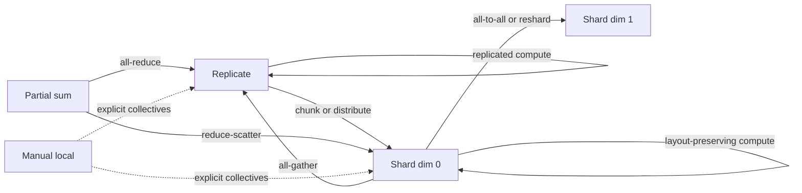

**Diagram notation key:** `Partial sum` is an unreduced value whose reduction operator is sum; `dim 0` and `dim 1` are tensor dimensions, not mesh dimensions; dotted edges from `Manual local` indicate that automatic legality checks stop at the manual boundary.

Inputs and outputs:

| Item | Description |
|---|---|
| Inputs | Tensor shape, mesh axes, operator semantics, tactic constraints, and current placements of operands. |
| Outputs | Output placement, required collectives, legality diagnostics, and possible redistribution alternatives. |
| Failure modes | Uneven shard without supported padding or metadata, partial value consumed by non-linear op, incompatible shard dimensions, or conflicting axis assignments. |
| Correctness condition | Local tensors reconstruct the intended logical tensor after the declared placement semantics and pending reductions are honored. |

PyTorch mapping:

| Placement concept | PyTorch projection |
|---|---|
| Replicated tensor | `DTensor` with `Replicate()` placement. |
| Dimension-sharded tensor | `DTensor` with `Shard(dim)` placement. |
| Pending reduction | `DTensor` with `Partial()` placement. |
| Placement conversion | `redistribute()` which may lower to all-gather, all-reduce, reduce-scatter, or all-to-all depending on source and target. |
| Module-level placement | Tensor parallel style objects such as `ColwiseParallel`, `RowwiseParallel`, `SequenceParallel`, `PrepareModuleInput`, and `PrepareModuleOutput` [S17]. |
| Manual escape hatch | Explicit distributed collectives or local tensors at an adapter boundary. |

Implementation examples:

```python
# Conceptual DTensor placement examples.
x_repl = distribute_tensor(x, mesh["tp"], [Replicate()])
w_col = distribute_tensor(w, mesh["tp"], [Shard(1)])
y_shard = torch.matmul(x_repl, w_col)

w_row = distribute_tensor(w, mesh["tp"], [Shard(0)])
x_row = distribute_tensor(x, mesh["tp"], [Shard(1)])
y_partial = torch.matmul(x_row, w_row)
y_full = y_partial.redistribute(mesh["tp"], [Replicate()])
```

This example should be read as placement logic rather than copy-paste API guidance. The actual operator behavior depends on DTensor operator coverage and the runtime's placement propagation rules. The important semantic distinction is that `y_shard` is already a valid shard of the logical output, while `y_partial` is an intermediate reduction state.

Explore Further:

- PyTorch DTensor placement documentation: https://docs.pytorch.org/docs/stable/distributed.tensor.html
- PyTorch tensor parallelism plans: https://docs.pytorch.org/docs/stable/distributed.tensor.parallel
- OpenXLA Shardy sharding representation: https://openxla.org/shardy/overview
- JAX sharding documentation: https://docs.jax.dev/en/latest/jax.sharding.html
- GSPMD paper for partitioned values and collective insertion: https://arxiv.org/abs/2105.04663

Evidence boundary: DTensor publicly documents `Replicate`, `Shard`, `Partial`, and redistribution [S15]. GSPMD, Shardy, and JAX provide related evidence for placement propagation and axis-based sharding [S4, S5, S23]. The legality table for pending reductions is a conceptual systematization: exact operator coverage, accepted partial states, and redistribution behavior are runtime-specific and should not be overclaimed as universal PyTorch behavior.

### 3.4 Strategy And Tactic Language

A strategy language records distributed execution intent separately from model code. A tactic is a composable planning unit: it targets a module, tensor, graph node, or region and applies a placement, rewrite, schedule, or runtime policy. Strategies are then ordered, checked for compatibility, propagated through the graph, and lowered into runtime-specific APIs.

PartIR uses tactics to compose SPMD partitioning strategies [S1, S2]. Slapo uses schedule primitives to transform model execution progressively [S13]. Automap frames the user-facing problem as ergonomic mapping of model definitions to distributed execution [S3]. PyTorch exposes fragments of this idea through tensor-parallel plans, FSDP2 sharding calls, pipeline stage construction, DTensor placement conversion, activation checkpointing, and distributed checkpointing [S15, S17, S18, S20, S21].

The problem solved by tactics is search-space control. Fully automatic planning over every possible graph partition, tensor layout, microbatch schedule, rematerialization policy, and checkpoint format is combinatorial. Pure hand-coding is brittle. Tactics provide a middle layer: each tactic is small enough to reason about, but structured enough for a planner to compose and validate.

A tactic can be modeled as:

$$
\tau =
(\operatorname{target}, \operatorname{action}, \operatorname{axis}, \operatorname{pre}, \operatorname{post}, \operatorname{cost}, \operatorname{priority}).
$$

Symbols: $\tau$ is one tactic; $\operatorname{target}$ is a module path, parameter pattern, graph node, or region; $\operatorname{action}$ is a transformation such as shard, replicate, pipeline, checkpoint, fuse, split, or prepare layout; $\operatorname{axis}$ is the mesh axis or submesh used by the tactic; $\operatorname{pre}$ is a set of preconditions; $\operatorname{post}$ is the placement or schedule effect; $\operatorname{cost}$ estimates memory, compute, and communication impact; $\operatorname{priority}$ resolves ordering when tactics overlap.

A strategy is a sequence or partially ordered set:

$$
\Sigma = \langle \tau_1, \tau_2, \ldots, \tau_k \rangle.
$$

The planner checks:

$$
\operatorname{legal}(\Sigma, f_\theta, \mathcal{M})
\land
M(\Sigma) \le M_{\mathrm{device}}
\land
\operatorname{equiv}(\Sigma(f_\theta), f_\theta).
$$

Symbols: $\Sigma$ is a candidate strategy; $k$ is the number of tactics; $\operatorname{legal}$ means tactic preconditions and placement rules are satisfied; $M(\Sigma)$ is the per-device memory required by the strategy; $M_{\mathrm{device}}$ is available device memory; $\operatorname{equiv}$ means the transformed distributed execution is equivalent to the reference model under the paper's numerical tolerance.

Inputs and outputs:

| Item | Description |
|---|---|
| Inputs | Model hierarchy or graph, mesh axes, placement rules, available runtime APIs, memory budget, topology costs, and optional user preferences. |
| Outputs | A validated plan containing module transformations, tensor placements, communication insertions, pipeline stages, checkpoint policy, and runtime schedule metadata. |
| Composition rules | Tactics may commute, override, refine, or conflict; the planner must define deterministic ordering and diagnostics. |
| Correctness condition | The composed strategy preserves reference semantics after all placement conversions, partial reductions, state sharding, and schedule boundaries are applied. |

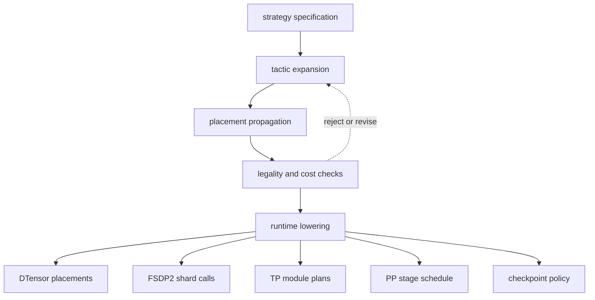

**Diagram notation key:** `strategy specification` is the user's or search algorithm's high-level intent; `tactic expansion` turns broad rules into concrete targets; `placement propagation` infers intermediate layouts; `runtime lowering` maps accepted tactics to actual PyTorch mechanisms.

A conceptual strategy can be written:

```python
strategy = ParallelSpec(
    mesh=MeshSpec(
        axes={"dp": 8, "pp": 4, "tp": 4},
        topology_policy="prefer_node_local_tp",
    ),
    tactics=[
        Tactic("tok_embeddings", "shard_embedding", axis="tp"),
        Tactic("layers.*.attention.qkv", "colwise_shard", axis="tp"),
        Tactic("layers.*.attention.out", "rowwise_shard", axis="tp"),
        Tactic("layers.*.feed_forward.w1", "colwise_shard", axis="tp"),
        Tactic("layers.*.feed_forward.w2", "rowwise_shard", axis="tp"),
        Tactic("layers.*.norm", "sequence_parallel", axis="tp"),
        Tactic("layers.*", "fully_shard", axis="dp"),
        Tactic("layers", "pipeline_stage", axis="pp", policy="balanced_layers"),
        Tactic("layers.*.attention", "activation_checkpoint", policy="selective"),
    ],
    objective="minimize_step_time_subject_to_memory",
)
```

This `ParallelSpec` is not claimed to be a public PyTorch API. It is a paper-level notation that separates the planning language from any one framework. Lowering to PyTorch would map pieces of the strategy to existing APIs:

| Tactic family | PyTorch lowering |
|---|---|
| `colwise_shard` / `rowwise_shard` | `parallelize_module` with `ColwiseParallel` and `RowwiseParallel` over the `tp` submesh [S17]. |
| `sequence_parallel` | `SequenceParallel` or explicit DTensor layouts for sequence-sharded normalization and dropout-compatible regions [S17]. |
| `prepare_input` / `prepare_output` | `PrepareModuleInput`, `PrepareModuleOutput`, or DTensor `redistribute()` calls [S15, S17]. |
| `fully_shard` | FSDP2 `fully_shard` over the `dp` submesh, including parameter, gradient, and optimizer-state sharding patterns used in TorchTitan [S21]. |
| `pipeline_stage` | PyTorch pipeline split and schedule APIs over the `pp` axis, with microbatch metadata and send/recv boundaries [S20]. |
| `activation_checkpoint` | PyTorch activation checkpointing policy attached to selected regions. |
| `load_reshard_checkpoint` | Distributed Checkpoint load and resharding metadata [S18]. |
| `manual_region` | Explicit distributed operations or custom kernels with declared boundary placements. |

Tactics also describe Slapo-like schedules, where transformations are not only tensor placements but execution rewrites. For example, a Slapo-like plan may replace a module, fuse adjacent operations, apply checkpointing, or reorder schedule boundaries before lowering to a runtime. In a PyTorch projection, those schedule tactics might become FX/export graph rewrites, module replacement passes, pipeline split points, or activation checkpoint wrappers. The key distinction is that a tactic's contract must state both its semantic effect and its runtime preconditions. A replacement that assumes hidden size divisibility by `tp` should declare that precondition; a rowwise shard that emits a partial output should declare the pending reduction in its postcondition.

Composable tactics should therefore carry at least four kinds of metadata:

| Metadata | Purpose |
|---|---|
| Target selector | Names the modules, tensors, graph nodes, or regions affected by the tactic. |
| Placement effect | Declares input and output placements, including pending `Partial` states. |
| Schedule effect | Declares stage boundaries, microbatching, rematerialization, or ordering constraints. |
| Evidence and fallback | States which runtime API can implement the tactic and what happens if preconditions fail. |

Example composition:

```python
# Paper-level lowering sketch.
tp_plan = {
    "layers.*.attention.qkv": ColwiseParallel(),
    "layers.*.attention.out": RowwiseParallel(),
    "layers.*.feed_forward.w1": ColwiseParallel(),
    "layers.*.feed_forward.w2": RowwiseParallel(),
    "layers.*.norm": SequenceParallel(),
}

parallelize_module(model, mesh["tp"], tp_plan)
fully_shard(model, mesh=mesh["dp"])
stages = split_into_pipeline_stages(model, axis=mesh["pp"], policy="balanced_layers")
schedule = build_pipeline_schedule(stages, microbatches=num_microbatches)
```

The order matters. Tensor-parallel replacement may need to happen before FSDP2 wrapping so that the sharded parameters are the objects FSDP manages. Pipeline splitting may need to happen before or after sharding depending on the implementation's state-dict and module ownership rules. A strategy language should make this ordering explicit instead of hiding it in incidental Python side effects.

Explore Further:

- PartIR tactics and automatic discovery: https://arxiv.org/abs/2401.11202 and https://arxiv.org/abs/2210.06352
- Slapo schedule language: https://awslabs.github.io/slapo/ and https://www.amazon.science/publications/slapo-a-schedule-language-for-progressive-optimization-of-large-deep-learning-model-training
- Automap ergonomic automated parallelism: https://arxiv.org/abs/2112.02958
- PyTorch tensor parallelism plans: https://docs.pytorch.org/docs/stable/distributed.tensor.parallel
- PyTorch distributed pipeline API: https://docs.pytorch.org/docs/stable/distributed.pipelining.html
- TorchTitan for composed FSDP2, TP, PP, and checkpointing patterns: https://github.com/pytorch/torchtitan

Evidence boundary: PartIR and Slapo provide research evidence for tactics and schedule primitives [S1, S2, S13]. Automap provides evidence for the ergonomic motivation [S3]. PyTorch provides runtime pieces but not a single general-purpose `ParallelSpec`; therefore `ParallelSpec`, `Tactic`, and `MeshSpec` should remain conceptual notation in the paper unless implemented elsewhere. Mappings to DTensor, FSDP2, tensor parallelism, pipeline APIs, and checkpointing are grounded in public PyTorch docs and TorchTitan patterns [S15, S17, S18, S20, S21], but the automatic composition logic is a planner design boundary rather than a documented PyTorch guarantee.

### 3.5 Sharding Propagation

Sharding propagation is the analysis that assigns placements to graph values before the system commits to rank-local code. It answers the question: if a few parameters, inputs, outputs, or intermediate tensors are constrained to be sharded in particular ways, which placements should the remaining tensors use so that the program is legal and cheap to execute? GSPMD frames this as compiler propagation from sparse sharding annotations over an HLO graph; Shardy generalizes the same family of ideas in MLIR with axis-based shardings, priorities, explicit constraints, and manual subcomputations; PartIR approaches the problem as incremental tactic-driven rewriting whose effects can be analyzed and simulated; DTensor performs placement propagation at PyTorch operator dispatch time for supported operators; PyTorch/XLA SPMD exposes the GSPMD path to PyTorch programs by marking tensors with mesh and partition specifications [S1, S4, S5, S14, S15, S24].

Let a logical program be a directed acyclic graph:

$$
G = (V, E),
\qquad
v = \operatorname{op}_v(u_1, \ldots, u_k),
\qquad
\pi_v \in \Pi(\mathcal{M}, \operatorname{shape}(v)).
$$

A propagation pass computes a placement assignment:

$$
\Pi_G^\star
=
\arg\min_{\Pi_G}
\left[
\sum_{v \in V} C_{\mathrm{local}}(v, \pi_{u_1}, \ldots, \pi_{u_k}, \pi_v)
+
\sum_{e=(u,v) \in E} C_{\mathrm{transition}}(\pi_u \rightarrow \pi_{u \mid v}, \operatorname{shape}(u))
\right]
$$

subject to:

$$
\pi_v \in \Phi_{\operatorname{op}_v}(\pi_{u_1}, \ldots, \pi_{u_k}),
\qquad
\pi_c = \bar{\pi}_c \quad \forall c \in \mathcal{C},
\qquad
\operatorname{LocalEval}_r(G, \Pi_G^\star) \equiv G
$$

up to the numerical tolerance expected of distributed floating-point execution.

Symbols: $G$ is the logical graph; $V$ and $E$ are graph values/operators and dataflow edges; $v$ is an output value; $u_i$ are input values; $\operatorname{op}_v$ is the operator producing $v$; $\mathcal{M}$ is the logical device mesh; $\pi_v$ is the placement of $v$ over that mesh; $\Pi(\mathcal{M}, \operatorname{shape}(v))$ is the set of legal placements for a tensor shape; $\Pi_G$ is the full graph placement assignment; $\Phi_{\operatorname{op}}$ is the operator-specific legality rule; $\mathcal{C}$ is the set of user or planner constraints; $\bar{\pi}_c$ is a required placement; $C_{\mathrm{local}}$ estimates per-rank compute and memory; $C_{\mathrm{transition}}$ estimates communication needed when a producer and consumer use different layouts; $\pi_{u \mid v}$ is the layout in which consumer $v$ reads producer $u$; $\operatorname{LocalEval}_r$ is the rank-$r$ execution induced by the assignment.

The essential distinction is that propagation is not yet lowering. Propagation may decide that a matrix multiplication output is `Shard(1)` or `Partial(sum)`; lowering later decides whether that partial value is left pending, all-reduced, reduce-scattered, or consumed directly by another local operation. In Shardy terms, propagation can move sharding axes through factors and data-flow edges until a fixed point, while explicit constraints and priorities bias which compatible axes win [S5]. In PartIR terms, a tactic such as sharding a linear layer is an incremental program transformation whose consequences should be evaluated locally and composed with other tactics [S1]. In a PyTorch projection, a planner can run a graph pass over `torch.export` or FX metadata, while native DTensor already performs a narrower form of rule-based propagation dynamically when DTensor inputs enter supported PyTorch operators [S15, S19].

#### Local Operator Rules

A useful propagation rule records which tensor dimensions are equivalent, which dimensions are reduced, and which mesh axes can be carried through without communication. The following rules use one mesh axis $a$ with degree $p_a$ for clarity; real plans compose several mesh axes, for example data, tensor, sequence, and expert axes.

**Elementwise and pointwise operations.** For:

$$
Y = f(X_1, \ldots, X_k),
\qquad
\operatorname{shape}(X_i) \text{ broadcast-compatible with } \operatorname{shape}(Y),
$$

an axis sharded on a non-broadcast dimension can usually propagate to the corresponding output dimension:

$$
X_i[d_i] \xleftrightarrow{\mathrm{broadcast\ map}} Y[d_y],
\qquad
a \in \pi_{X_i,d_i}
\Rightarrow
a \in \pi_{Y,d_y}.
$$

Symbols: $f$ is an elementwise function; $d_i$ and $d_y$ are input and output tensor dimensions; $a \in \pi_{X_i,d_i}$ means mesh axis $a$ shards tensor dimension $d_i$ of $X_i$. If two inputs demand incompatible shardings for the same logical output dimension, propagation must either choose one placement and insert a transition for the other input, reject the assignment, or ask a search layer to pick a different tactic. Broadcasting is safe only when every rank can produce the broadcasted slice it needs; broadcasting a replicated small bias into a sharded activation is local, but combining two differently sharded non-broadcast operands usually requires redistribution.

**Matrix multiplication.** For:

$$
C = A B,
\qquad
A \in \mathbb{R}^{m \times k},
\qquad
B \in \mathbb{R}^{k \times n},
\qquad
C \in \mathbb{R}^{m \times n},
$$

the non-contracting dimensions propagate to output dimensions:

$$
a \in \pi_{A,m} \Rightarrow a \in \pi_{C,m},
\qquad
a \in \pi_{B,n} \Rightarrow a \in \pi_{C,n}.
$$

Sharding the contracting dimension creates a pending reduction:

$$
a \in \pi_{A,k}
\land
a \in \pi_{B,k}
\Rightarrow
\pi_C \ni \operatorname{Partial}_a(\mathrm{sum}).
$$

Symbols: $m$ and $n$ are output dimensions; $k$ is the contracting dimension; $\operatorname{Partial}_a(\mathrm{sum})$ means each rank along mesh axis $a$ holds a partial contribution that must be summed before the value is used as an ordinary replicated or sharded tensor. This rule is the core of tensor-parallel linear layers. Column-wise sharding of $B$ gives column-sharded $C$ with no reduction; row-wise sharding of $B$ against the input feature dimension typically creates partial sums and then an all-reduce or reduce-scatter, unless the following consumer can use the partial state.

**Reductions.** For:

$$
Y = \operatorname{reduce}_{D,\rho}(X),
$$

where $D$ is the set of reduced tensor dimensions and $\rho$ is an associative reduction such as sum or max, propagation has two cases:

$$
d \notin D
\land
a \in \pi_{X,d}
\Rightarrow
a \in \pi_{Y,\operatorname{project}(d)},
$$

and:

$$
d \in D
\land
a \in \pi_{X,d}
\Rightarrow
\pi_Y \ni \operatorname{Partial}_a(\rho).
$$

Symbols: $\operatorname{project}(d)$ maps an unreduced input dimension to its output dimension after reduced axes are removed or kept as size-one dimensions. A reduction over a sharded dimension is not a local reduction of the global value; it is a local contribution to a global reduction. For sums and averages, this naturally becomes a partial placement. For max/min, production systems need matching reduce semantics and may require different collectives or avoid carrying a `Partial(sum)` abstraction. For softmax, the denominator couples all elements along the normalized dimension, so sharding the normalized dimension requires a distributed softmax sequence, usually local maximum, all-reduce maximum, local exponentiation and partial sum, all-reduce sum, then normalization. Treating the operation as independent local softmax is incorrect unless the normalized dimension is not sharded.

**Reshape, view, and transpose.** Layout-only operators are deceptively important because they can either preserve sharding for free or force expensive communication. For a reshape:

$$
Y = \operatorname{reshape}(X),
\qquad
\operatorname{numel}(X)=\operatorname{numel}(Y),
$$

a sharding axis can propagate without communication only when the reshape induces a contiguous factor mapping from sharded input dimension factors to output dimension factors:

$$
a \in \pi_{X,d}
\land
\operatorname{factor}(X_d, a) \mapsto \operatorname{factor}(Y_{d'}, a)
\Rightarrow
a \in \pi_{Y,d'}.
$$

Symbols: $\operatorname{factor}(X_d, a)$ is the portion of dimension $X_d$ split by mesh axis $a$; $d'$ is the corresponding output dimension or factor after reshape. If a reshape merges a sharded and unsharded dimension, splits a sharded factor across multiple output dimensions, or changes the major order expected by consumers, a compiler must either represent split axes precisely, all-gather before reshaping, or use all-to-all style redistribution. Shardy explicitly calls out richer reshape support and split axes as a motivation for its representation [S5]. A transpose or permute is simpler at the logical level:

$$
Y = \operatorname{transpose}_{\sigma}(X),
\qquad
a \in \pi_{X,d}
\Rightarrow
a \in \pi_{Y,\sigma(d)},
$$

but a following consumer may still require communication if it expects the mesh axis on a different tensor dimension.

**Attention-style intermediates.** For a standard attention block with batch $B$, sequence $S$, query heads $H_q$, key/value heads $H_{kv}$, head dimension $D_h$, and hidden width $H = H_q D_h$:

$$
Q \in \mathbb{R}^{B \times S_q \times H_q \times D_h},
\quad
K,V \in \mathbb{R}^{B \times S_k \times H_{kv} \times D_h},
$$

$$
L = Q K^\top
\in
\mathbb{R}^{B \times H_q \times S_q \times S_k},
\qquad
O = \operatorname{softmax}(L)V
\in
\mathbb{R}^{B \times S_q \times H_q \times D_h}.
$$

Head sharding usually propagates cleanly because each head can be evaluated independently:

$$
a \in \pi_{Q,H_q}
\land
a \in \pi_{K,H_{kv}}
\land
a \in \pi_{V,H_{kv}}
\Rightarrow
a \in \pi_{L,H_q}
\land
a \in \pi_{O,H_q},
$$

with the caveat that grouped-query or multi-query attention requires a compatible mapping from $H_q$ to $H_{kv}$. Batch sharding also propagates through attention. Sequence sharding is more delicate. Sharding $S_q$ can often preserve local rows of the attention matrix, but sharding $S_k$ shards the softmax normalization dimension and therefore requires a distributed softmax or all-gather of keys/values. Context parallel plans often use all-gather or all-to-all around $K,V$ and the attention logits, then reduce-scatter or all-to-all outputs back to the sequence-sharded layout. Propagation should represent these dependencies explicitly instead of treating attention as a black-box matmul followed by a local softmax.

#### Propagation Outcomes In A PyTorch Planner

For PyTorch, the practical planner contract is:

$$
\operatorname{Propagate}_{\mathrm{torch}}
:
(G_{\mathrm{ATen}}, \mathcal{M}, \mathcal{C}, \mathcal{R})
\rightarrow
(\Pi_G, \mathcal{T}_{\mathrm{required}}, \mathcal{U}_{\mathrm{unsupported}}).
$$

Symbols: $G_{\mathrm{ATen}}$ is a normalized ATen or export graph; $\mathcal{C}$ is the set of placement constraints; $\mathcal{R}$ is the available operator rule library; $\Pi_G$ is the inferred placement assignment; $\mathcal{T}_{\mathrm{required}}$ is the set of producer-consumer layout transitions that lowering must realize; $\mathcal{U}_{\mathrm{unsupported}}$ is the set of operators or Python effects that cannot be safely propagated.

Native eager PyTorch and XLA-style compiler paths have different evidence boundaries:

| Path | What propagation can rely on | Evidence boundary |
|---|---|---|
| Native PyTorch eager with DTensor | `DeviceMesh`, `Shard`, `Replicate`, `Partial`, DTensor operator dispatch, and `redistribute` for explicit layout changes [S15, S16]. | Public DTensor documents placement propagation for supported operators, but arbitrary Python, custom kernels, dynamic control flow, and unsupported ATen operators need fallback rules, explicit redistributions, or graph breaks. |
| Native PyTorch graph planner projection | `torch.export` or FX can expose an ATen-level graph to annotate with placements before emitting DTensor, tensor-parallel, FSDP, or pipeline APIs [S17, S19, S21]. | This is a design projection in this paper, not a single public PyTorch-native auto-parallel compiler with GSPMD maturity. It should be presented as a planner architecture. |
| PyTorch/XLA SPMD | `mark_sharding`, XLA meshes, partition specs, and XLA/GSPMD propagation over the compiled graph [S14, S24]. | Strongest public PyTorch evidence for GSPMD-style propagation and compiler-inserted collectives, but it targets the XLA backend and XLA execution constraints rather than ordinary eager CUDA execution. |
| OpenXLA Shardy | MLIR-based axis sharding, constraints, priorities, propagation, reshape support, and manual computation [S5]. | Strong design evidence for compiler IRs and a plausible target for exported PyTorch programs, but not itself the native PyTorch eager runtime. |
| PartIR | Incremental tactics, composability, and simulation-oriented predictability [S1, S2]. | Strong evidence for tactic composition and cost reasoning; it is not a drop-in PyTorch operator dispatcher. |

### 3.6 SPMD Lowering And Collective Insertion

SPMD lowering is the transformation that turns the logical placement assignment into executable rank-local behavior. Propagation says "this value is sharded along tensor dimension 1 over mesh axis `tp`" or "this value is partial over `tp`." Lowering says "rank $r$ computes this slice, reads this local shard, launches this all-reduce, and passes this local tensor to the next kernel." GSPMD and PyTorch/XLA perform this as a compiler partitioning pass that inserts collectives into the compiled graph; DTensor performs the analogous work at eager operator boundaries and at explicit `redistribute` calls; a PyTorch planner can also lower a graph plan by emitting DTensor redistributions, tensor-parallel wrappers, FSDP resharding points, or XLA sharding annotations [S4, S14, S15, S17, S24].

The lowering contract can be written as:

$$
\operatorname{Lower}_{\mathrm{SPMD}}
:
(P, \mathcal{M}, \Pi_G, \mathcal{T}_{\mathrm{required}})
\rightarrow
\{P_r\}_{r \in \mathcal{M}},
$$

such that:

$$
\operatorname{Assemble}
\left(
\{P_r(x^{(r)})\}_{r \in \mathcal{M}},
\Pi_{\mathrm{out}}
\right)
\equiv
P(x)
$$

within the accepted numerical tolerance.

Symbols: $P$ is the logical single-device program; $\mathcal{M}$ is the device mesh; $\Pi_G$ is the propagated placement assignment; $\mathcal{T}_{\mathrm{required}}$ is the set of required layout transitions; $P_r$ is the program executed by rank $r$; $x^{(r)}$ is rank $r$'s local input shard or replica; $\Pi_{\mathrm{out}}$ is the output placement; $\operatorname{Assemble}$ reconstructs the logical output from local rank outputs.

Collective insertion is the subproblem of realizing each producer-consumer layout mismatch. For an edge $e=(u,v)$:

$$
\operatorname{Insert}(e)
=
\operatorname{CollectivePlan}
\left(
\pi_{u}^{\mathrm{producer}},
\pi_{u \mid v}^{\mathrm{consumer}},
\operatorname{shape}(u),
\mathcal{M}
\right).
$$

Symbols: $\pi_{u}^{\mathrm{producer}}$ is the layout produced by $u$; $\pi_{u \mid v}^{\mathrm{consumer}}$ is the layout required by consumer $v$; $\operatorname{CollectivePlan}$ returns zero or more local operations and collectives such as chunk, all-gather, all-to-all, all-reduce, reduce-scatter, or send/recv.

For a tensor with $N$ logical elements, element size $b$ bytes, and collective group size $p$ on one mesh axis, a first-order per-rank transition cost model is:

$$
C_{\mathrm{transition}}(\pi \rightarrow \pi')
=
\alpha \cdot s(\pi,\pi')
+
\beta \cdot V(\pi \rightarrow \pi', N, b, p)
+
\gamma \cdot M_{\mathrm{peak}}(\pi \rightarrow \pi', N, b, p),
$$

with common volumes:

$$
V(\operatorname{Shard}(d) \rightarrow \operatorname{Replicate})
\approx
N b \frac{p-1}{p},
$$

$$
V(\operatorname{Partial} \rightarrow \operatorname{Replicate})
\approx
2 N b \frac{p-1}{p},
$$

$$
V(\operatorname{Partial} \rightarrow \operatorname{Shard}(d))
\approx
N b \frac{p-1}{p},
$$

$$
V(\operatorname{Shard}(d) \rightarrow \operatorname{Shard}(d'))
\approx
N b \frac{p-1}{p}
\quad
\text{when implemented as all-to-all and } d \ne d'.
$$

Symbols: $C_{\mathrm{transition}}$ is the estimated transition cost; $\alpha$ is latency cost per collective launch; $s(\pi,\pi')$ is the number of synchronization or collective steps; $\beta$ is inverse effective bandwidth; $V$ is per-rank communicated byte volume; $\gamma$ prices temporary memory pressure; $M_{\mathrm{peak}}$ is peak temporary memory caused by the transition; $N$, $b$, and $p$ are logical element count, bytes per element, and group size. These are first-order ring-style approximations. Real cost depends on topology, collective implementation, stream overlap, chunking, dtype conversion, fusion, and whether the compiler can combine adjacent transitions.

DTensor's documented `redistribute` transitions provide a concrete PyTorch eager realization of this mapping: `Shard(dim)` to `Replicate()` uses all-gather, `Shard(src_dim)` to `Shard(dst_dim)` uses all-to-all, `Replicate()` to `Shard(dim)` is local chunking, `Partial()` to `Replicate()` uses all-reduce, and `Partial()` to `Shard(dim)` uses reduce-scatter [S15]. GSPMD and PyTorch/XLA express the same idea at compiler level: the user marks or constrains sharding, the compiler partitions the graph, and proper collectives are inserted in the executable [S4, S14, S24].

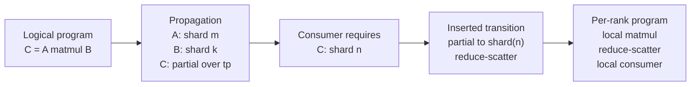

**Diagram notation key:** `shard m` means the tensor dimension $m$ is partitioned over a mesh axis; `shard k` means the contracting dimension $k$ is partitioned; `partial over tp` means each rank along the tensor-parallel mesh axis holds an unreduced sum contribution; `partial to shard(n)` corresponds to $\operatorname{Partial} \rightarrow \operatorname{Shard}(n)$; `reduce-scatter` both sums partial values and leaves each rank with one output shard.

#### Lowering Patterns

**Local compute with unchanged placement.** If a producer and consumer agree on placement, lowering emits no communication:

$$
\pi_u = \pi_{u \mid v}
\Rightarrow
\operatorname{Insert}(u,v)=\varnothing.
$$

For elementwise operations on equally sharded inputs, each rank applies the same scalar code to its local shard. For a transpose whose placement metadata is permuted consistently with the tensor dimensions, lowering may only change local strides or issue a local transpose.

**Materialization and rematerialization.** If a consumer needs a replicated tensor from a sharded one:

$$
\operatorname{Shard}_a(d) \rightarrow \operatorname{Replicate}_a
\Rightarrow
\operatorname{all\_gather}_a.
$$

This pattern appears when a non-sharding-aware kernel, a debugging hook, loss computation, or checkpoint writer requires the full value. A planner should treat this as a high-friction boundary because it can erase model-parallel memory savings. In PyTorch eager code, `full_tensor()` is a materialization convenience that gathers the logical tensor; in compiler paths, the equivalent communication may be inserted before an operation that cannot consume shards [S15].

**Partial resolution.** If a matmul, convolution, embedding, or reduction produces partial values:

$$
\operatorname{Partial}_a(\rho) \rightarrow \operatorname{Replicate}_a
\Rightarrow
\operatorname{all\_reduce}_a(\rho),
$$

or:

$$
\operatorname{Partial}_a(\rho) \rightarrow \operatorname{Shard}_a(d)
\Rightarrow
\operatorname{reduce\_scatter}_a(\rho, d).
$$

For sums, reduce-scatter is often preferable when the next consumer can use a sharded output, because it combines reduction with partitioning and avoids fully replicated materialization. Propagation should therefore not eagerly force every `Partial` to `Replicate`; it should preserve partial values until a consumer, aliasing boundary, or output contract makes resolution necessary.

**Layout transposition.** If a tensor is sharded over one logical dimension and a consumer requires sharding over another:

$$
\operatorname{Shard}_a(d) \rightarrow \operatorname{Shard}_a(d')
\Rightarrow
\operatorname{all\_to\_all}_a
\quad \text{or} \quad
\operatorname{all\_gather}_a + \operatorname{local\_chunk}_a.
$$

All-to-all is the natural representation when each rank owns a block that must be split and exchanged with every other rank. Some backends use all-gather plus slicing when all-to-all is unavailable, when shapes are small, or when the implementation wants simpler scheduling. Attention context parallelism, sequence parallelism, expert dispatch, and reshapes that move a sharded factor across dimensions all rely on this family of transitions.

**Pipeline and manual regions.** Pipeline stage boundaries are not pure tensor layout transitions because producer and consumer may live on disjoint mesh slices:

$$
\pi_u \text{ on stage } s
\rightarrow
\pi_{u \mid v} \text{ on stage } s+1
\Rightarrow
\operatorname{send}/\operatorname{recv}
\quad
\text{possibly combined with resharding}.
$$

Manual or local regions, such as Shardy manual computations or hand-written PyTorch distributed kernels, mark places where the compiler or planner should stop assuming that global tensor semantics are visible inside the region [S5]. Lowering must convert from global placements to the region's declared local contract at entry, and back from local outputs to global placements at exit.

#### Lowering Attention

Attention lowering makes the propagation/lowering distinction concrete. If heads are sharded, lowering emits independent local attention per head shard and may need only a final output projection transition. If the query sequence is sharded but keys and values are replicated or gathered, each rank computes a subset of query rows. If the key sequence is sharded, the logits and softmax denominator cross ranks:

$$
L_r = Q K_r^\top,
\qquad
m = \operatorname{all\_reduce}_{\max}( \max_r L_r ),
$$

$$
z_r = \exp(L_r - m),
\qquad
s = \operatorname{all\_reduce}_{\mathrm{sum}}( \sum_r z_r ),
\qquad
P_r = z_r / s.
$$

Symbols: $L_r$ is the local shard of attention logits using rank $r$'s key shard; $m$ is the global row-wise maximum used for numerical stability; $z_r$ is the local exponentiated logits shard; $s$ is the global row-wise denominator; $P_r$ is the local shard of probabilities. The subsequent multiplication $P_r V_r$ produces partial output contributions if the value sequence is sharded, requiring an all-reduce or reduce-scatter depending on the desired output layout. This is why a propagation rule that merely labels softmax output as "same sharding as input" is insufficient for attention when the normalized dimension is partitioned.

#### Compiler Lowering Versus Eager Lowering

The compiler path and eager path differ in where collectives become visible:

| Path | When collectives are inserted | What the user or planner sees |
|---|---|---|
| GSPMD / PyTorch/XLA SPMD | During XLA partitioning after sharding annotations and propagation [S4, S14, S24]. | User code can look single-device; collectives appear in compiler IR, HLO dumps, profiles, and executable behavior. |
| Shardy | During MLIR sharding propagation and later partitioning/lowering passes [S5]. | IR carries explicit axis-based shardings, constraints, priorities, and manual boundaries that make decisions more inspectable. |
| DTensor eager | During DTensor operator dispatch or explicit `redistribute` calls [S15]. | Collectives are runtime PyTorch distributed operations associated with tensor subclass behavior and placement transitions. |
| PartIR-style tactics | During tactic application and execution lowering by a target backend [S1]. | The user or auto-search system reasons about incremental transformations, predicted costs, and composed strategies. |
| Proposed native PyTorch planner | During plan emission from graph metadata to DTensor/FSDP/tensor-parallel/pipeline or XLA annotations. | This remains a design projection: the planner can use JAX/XLA evidence for algorithms, but native eager PyTorch needs explicit integration with supported operators and fallback behavior. |

The systems lesson is that propagation and lowering should be separate phases even when a runtime implementation fuses them. Propagation is a global reasoning problem over legal layouts, costs, and constraints. Lowering is an executable realization problem over collectives, local kernels, process groups, stream ordering, and memory lifetime. Combining them too early loses useful alternatives: for example, resolving every partial matmul result with all-reduce may be locally valid but worse than carrying the partial value into a following reduce-scatter; gathering before every reshape is simple but can destroy the benefit of Shardy-style split-axis reasoning; and eager PyTorch fallbacks may be correct but can hide large implicit collectives unless placement transitions are surfaced to the planner.

Evidence boundary: The strongest direct evidence for compiler-inserted collectives from sparse annotations is GSPMD and PyTorch/XLA SPMD [S4, S14, S24]. Shardy is direct evidence for a newer OpenXLA propagation representation influenced by both GSPMD and PartIR [S5]. DTensor is direct evidence that native PyTorch can express sharded tensor semantics, placement propagation, and redistribution collectives in eager mode [S15]. A fully automatic, native eager PyTorch planner that matches mature XLA GSPMD across arbitrary models should be treated as an architectural projection, not as an already demonstrated public system.

### 3.7 Composite Parallelism

Composite parallelism is the mechanism by which a planner uses more than one distributed dimension at the same time. A useful automatic parallelizer should not select "data parallel" or "tensor parallel" as mutually exclusive modes. It should construct a product plan over named mesh axes, decide which tensors and states are sharded on which axes, and then ensure that the resulting placements compose legally through forward, backward, optimizer update, checkpointing, and restart. This is the common systems lesson behind Alpa's separation of inter-operator and intra-operator planning, Galvatron's hybrid transformer search, PartIR's composable partitioning tactics, TorchTitan's PyTorch-native composition of FSDP2, tensor parallelism, pipeline parallelism, and checkpointing, and veScale's eager-mode multi-dimensional SPMD direction [S1, S6, S8, S12, S21].

Let the device mesh be:

$$
\mathcal{M}
=
\mathcal{D}_{\mathrm{dp}}
\times
\mathcal{D}_{\mathrm{tp}}
\times
\mathcal{D}_{\mathrm{pp}}
\times
\mathcal{D}_{\mathrm{cp}}
\times
\mathcal{D}_{\mathrm{ep}},
$$

and let a plan assign each logical object to one or more mesh axes:

$$
\pi(o)
=
\left(
\operatorname{place}_{\mathrm{dp}}(o),
\operatorname{place}_{\mathrm{tp}}(o),
\operatorname{stage}_{\mathrm{pp}}(o),
\operatorname{place}_{\mathrm{cp}}(o),
\operatorname{place}_{\mathrm{ep}}(o)
\right).
$$

Symbols: $\mathcal{M}$ is the logical device mesh; $\mathcal{D}_{\mathrm{dp}}$, $\mathcal{D}_{\mathrm{tp}}$, $\mathcal{D}_{\mathrm{pp}}$, $\mathcal{D}_{\mathrm{cp}}$, and $\mathcal{D}_{\mathrm{ep}}$ are data-, tensor-, pipeline-, context-, and expert-parallel axes; $o$ is a logical object such as a parameter, activation, gradient, optimizer buffer, or graph region; $\pi(o)$ is the plan assignment for that object; $\operatorname{place}_a$ is the placement state on axis $a$; $\operatorname{stage}_{\mathrm{pp}}$ maps an operation or module to a pipeline stage.

#### Composability And Expressibility

Composability asks whether two parallelism styles can be applied to the same logical program without conflicting ownership, communication, schedule, or state semantics. Expressibility asks whether the planning language can state that composition precisely enough for a compiler, runtime, or human reviewer to validate it. A system can be very powerful operationally but weakly expressible if the composition is hidden in rank-local Python branches; conversely, a clean IR can be highly analyzable but unable to express custom kernels or dynamic routing unless it admits manual regions.

A useful plan language should be able to express six kinds of composition:

| Expressibility requirement | Why it matters | PyTorch projection |
|---|---|---|
| Axis composition | DP/FSDP, TP, PP, CP, and EP need independent named process groups. | `DeviceMesh` with named dimensions and submesh slicing [S16]. |
| Value placement | Parameters, activations, gradients, optimizer state, and temporary buffers may use different placements on the same mesh. | DTensor placements, FSDP state, DCP state metadata [S15, S18]. |
| Region placement | Pipeline stages, checkpoint regions, expert regions, and manual/custom regions are not single tensors. | Pipeline stage APIs, activation checkpoint wrappers, explicit distributed regions [S20, S39]. |
| Ordering constraints | Some transformations are non-commutative: TP replacement before FSDP wrapping may differ from FSDP before TP. | Ordered tactic lists in a conceptual `ParallelSpec`; Slapo-style schedule ordering [S13, S17, S21]. |
| Cross-axis collectives | A tensor may require all-gather on `dp`, all-reduce on `tp`, send/recv on `pp`, and all-to-all on `ep` in one training step. | DTensor redistribution, tensor-parallel collectives, pipeline send/recv, explicit `torch.distributed` fallback [S15, S17, S20]. |
| Escape hatches | Unsupported operators, custom kernels, and model-specific routing still need declared local semantics. | `Manual` placement regions, `shard_map`-like design analogues, custom PyTorch distributed code [S5, S22]. |

The composition of tactics can be written as an ordered transformation:

$$
\pi
=
(\tau_k \circ \tau_{k-1} \circ \cdots \circ \tau_1)
(G,\mathcal{M},\Omega),
$$

with a legality condition:

$$
\operatorname{legal}(\pi)
\Leftrightarrow
\bigwedge_{i=1}^{k}
\operatorname{pre}(\tau_i, G_{i-1}, \mathcal{M}, \Omega)
\land
\operatorname{compatible}(\operatorname{effects}(\tau_i), E_{i-1}).
$$

Symbols: $\pi$ is the resulting plan; $\tau_i$ is tactic $i$; $G$ is the model graph or module tree; $\mathcal{M}$ is the logical mesh; $\Omega$ is the user objective and constraints; $G_{i-1}$ is the program representation before tactic $\tau_i$ is applied; $\operatorname{pre}$ checks tactic preconditions; $\operatorname{effects}$ returns placement, schedule, state, or rewrite effects; $E_{i-1}$ is the accumulated effect set from earlier tactics.

Two tactics commute only when applying them in either order yields equivalent placements, schedules, and state:

$$
\tau_a \circ \tau_b \equiv \tau_b \circ \tau_a
\quad
\text{only if}
\quad
\operatorname{effects}(\tau_a)
\perp
\operatorname{effects}(\tau_b)
\ \text{or their interaction is explicitly defined.}
$$

Symbols: $\tau_a$ and $\tau_b$ are two tactics; $\equiv$ means the resulting plans are semantically equivalent under the paper's correctness contract; $\perp$ means their effects are independent, such as sharding disjoint modules on disjoint axes. Many important tactics do not commute: tensor-parallel module replacement can change the parameters later seen by FSDP; pipeline splitting can change checkpoint region boundaries; expert routing can change whether tensor-parallel expert MLPs see packed or unpacked token buffers.

The compatibility surface is therefore better described as a matrix than as a list of features:

| Composition | Usually expressible as | Main conflict to check | Evidence and caveat |
|---|---|---|---|
| FSDP/ZeRO + TP | Parameter state sharded over `dp`; tensor dimensions sharded over `tp`. | Materialization order, optimizer-state ownership, tied weights, and rowwise partial reductions. | TorchTitan and Megatron-LM demonstrate operational composition; automatic selection remains planner work [S21, S33]. |
| FSDP/ZeRO + PP | Stage-local modules wrapped or sharded over data replicas. | Stage ownership, state-dict naming, optimizer step boundaries, checkpoint resharding. | PyTorch pipeline plus DCP provide primitives; stage partitioning must be planned [S18, S20]. |
| TP + PP | Tensor-parallel groups inside each pipeline stage. | Cross-stage activation layout must match receiver stage or include redistribution. | Common in large transformer recipes; express with `DeviceMesh` submeshes and pipeline metadata [S16, S20, S21]. |
| TP + CP or sequence parallelism | Hidden/head dimensions and sequence dimensions sharded simultaneously. | Attention softmax, layer normalization axes, masks, positional offsets, and K/V exchange. | Public evidence is thinner than dense TP; treat long-context automation conservatively [S15, S17, S33]. |
| EP + TP | Experts distributed over `ep`; each expert MLP may be tensor-parallel over `tp`. | Token dispatch layout, grouped GEMM packing, capacity factor, imbalance, and expert checkpointing. | GShard and Megatron-style MoE systems support the concept; generic PyTorch auto-planning is not solved [S29, S33]. |
| PP + activation rematerialization | Checkpoint regions aligned to stages and microbatches. | Recompute changes stage time, pipeline bubbles, RNG preservation, and saved tensor lifetime. | PyTorch checkpointing and pipeline APIs expose pieces; joint scheduling requires planner logic [S20, S39]. |
| Offload + any parallel style | State assigned to GPU HBM, CPU DRAM, NVMe, or remote storage. | Prefetch windows, overlap, bandwidth bottlenecks, and checkpoint consistency. | ZeRO-Offload/Infinity motivate memory-tier planning; PyTorch-native automatic offload composition is not a single public API [S38]. |

Expressibility has a ladder of representations:

| Representation level | What it can express well | What it hides or weakens |
|---|---|---|
| Rank-local imperative code | Arbitrary custom distributed algorithms and kernels. | Global equivalence, search, checkpoint portability, and plan comparison. |
| Module-level policy | Transformer-family TP/FSDP/PP recipes with readable module targets. | Fine-grained operator placement, irregular graphs, and compiler propagation. |
| Tensor placement system | Per-value `Shard`, `Replicate`, and `Partial` states plus redistributions. | Pipeline schedules, graph rewrites, optimizer ownership, and data semantics unless extended. |
| Tactic language | Ordered transformations over modules, graph values, schedules, and state. | Requires careful legality rules and adapter-specific lowering. |
| Compiler IR with sharding metadata | Whole-graph propagation, collective insertion, and rewrite opportunities. | Dynamic eager Python, custom ops, and interactive debugging unless manual regions are explicit. |

The practical implication for PyTorch is that no single existing abstraction is expressive enough by itself. `DeviceMesh` expresses axes, DTensor expresses tensor placements, tensor-parallel APIs express common module rewrites, pipeline APIs express stage schedules, DCP expresses sharded state, and `torch.export` expresses graph regions. The paper-level `ParallelSpec` and `PlanIR` exist to compose these surfaces into one auditable plan. That plan should record not only the selected parallel styles, but also which compositions are unsupported, which were forced by user constraints, which were inferred by search, and which require manual regions.

The composition contract is easier to state as state categories rather than feature names:

| State or region | Typical composition decision | Required communication or scheduling |
|---|---|---|
| Parameters | Shard over `dp` with FSDP or ZeRO-style partitioning; shard selected linear weights over `tp`; place layer subsets on `pp`; optionally shard experts over `ep`. | FSDP all-gather before use, tensor-parallel all-reduce or reduce-scatter at rowwise boundaries, pipeline send/recv for stage inputs, expert all-to-all for token dispatch. |
| Gradients | Reduce or reduce-scatter over `dp`; preserve tensor-parallel gradient layout; route stage boundary gradients backward through `pp`. | Data-parallel all-reduce or reduce-scatter, tensor-parallel collectives from backward rules, pipeline reverse send/recv. |
| Optimizer state | Partition moments and master parameters over `dp` or ZeRO axis; optionally maintain tensor-parallel shards matching parameter layout. | Optimizer step must run on the owner shard or materialize the needed state; checkpoint save/load must record logical state, not just rank-local tensors. |
| Activations | Replicate or shard batch over `dp`; shard hidden or head dimensions over `tp`; shard sequence over `cp`; store only local pipeline stage activations. | Tensor-parallel layout transitions, context-parallel attention exchange, activation checkpoint recompute, pipeline microbatch buffering. |
| Workspace and temporary buffers | Kernel- and schedule-dependent; often local to a placement choice. | Planner must reserve memory for fused attention, matmul workspaces, NCCL buffers, and graph-captured temporary storage. |

For a dense transformer block with activation $X \in \mathbb{R}^{B \times S \times H}$ and feed-forward expansion $F$, a common composite strategy is:

$$
X
\;\xrightarrow{\mathrm{tp}}\;
X_{\mathrm{local}} \in \mathbb{R}^{B_{\mathrm{dp}} \times S_{\mathrm{cp}} \times H_{\mathrm{tp}}},
\qquad
W_1
\;\xrightarrow{\mathrm{tp}}\;
W_{1,\mathrm{local}} \in \mathbb{R}^{H \times F_{\mathrm{tp}}},
$$

while the same module's parameters and optimizer state are partitioned over $\mathcal{D}_{\mathrm{dp}}$ and the layer is assigned to one $\mathcal{D}_{\mathrm{pp}}$ stage.

Symbols: $X$ is the logical activation; $B$ is global batch size; $S$ is sequence length; $H$ is hidden width; $F$ is feed-forward width; $B_{\mathrm{dp}}$ is the local batch after data-parallel splitting; $S_{\mathrm{cp}}$ is the local sequence after context-parallel splitting; $H_{\mathrm{tp}}$ and $F_{\mathrm{tp}}$ are local hidden or feed-forward shards after tensor parallelism; $W_1$ is the first feed-forward weight matrix.

The most important legality rule is that every axis must have a non-conflicting ownership story. For example, FSDP/ZeRO may shard a parameter over the data axis while tensor parallelism shards the same logical matrix over the feature axis, but the system must define when each rank materializes the shard required by its local matmul and where the optimizer update is applied. Pipeline parallelism adds another constraint: tensors crossing stage boundaries must be in a placement that the receiver can consume, or the boundary must include redistribution. Context parallelism and sequence parallelism are especially sensitive around attention softmax and layer normalization because sharding a normalized or attended dimension can silently change semantics unless the planner inserts the needed all-gather, all-to-all, ring attention, or distributed reduction.

Activation checkpointing is part of the composite plan, not an afterthought. If $A_\ell(\pi)$ is the activation memory for layer $\ell$ and $R_\ell(c_\ell)$ is the recompute cost induced by checkpoint decision $c_\ell \in \{0,1\}$, then a simple composite objective includes:

$$
M_{\mathrm{acts}}(\pi, c)
=
\sum_{\ell}
(1-c_\ell) A_\ell(\pi)
+ c_\ell A_{\ell,\mathrm{boundary}}(\pi),
\qquad
T_{\mathrm{recompute}}(\pi, c)
=
\sum_{\ell} c_\ell R_\ell(\pi).
$$

Symbols: $M_{\mathrm{acts}}$ is retained activation memory; $\pi$ is the parallelism plan; $c$ is the vector of checkpoint decisions; $c_\ell=1$ means layer $\ell$ is checkpointed; $A_\ell$ is the activation memory retained without checkpointing; $A_{\ell,\mathrm{boundary}}$ is the smaller set of inputs that must be saved for recompute; $T_{\mathrm{recompute}}$ is additional runtime from recomputation; $R_\ell$ is the recompute time for layer $\ell$.

Implementation examples:

- In native PyTorch, a planner can create a named `DeviceMesh`, slice it into `mesh["dp"]`, `mesh["tp"]`, `mesh["pp"]`, `mesh["cp"]`, and `mesh["ep"]`, then emit FSDP2 wrappers over the data axis, `parallelize_module` tensor-parallel plans over the tensor axis, pipeline splits over the pipeline axis, and explicit or library-backed context/expert communication where no stable high-level API exists [S15, S16, S17, S20, S21].
- In a compiler-oriented path, `torch.export` or an FX graph can carry placement metadata, while a backend adapter emits DTensor redistributions, PyTorch/XLA SPMD annotations, or a lower-level distributed IR. This mirrors the role of PartIR tactics and Alpa's staged planning without requiring the paper to claim those systems are PyTorch-native implementations [S1, S8, S19, S24].
- In a schedule-language path, Slapo-style transformations can express replacement, sharding, checkpointing, and tracing decisions progressively over a PyTorch model, while the automatic planner proposes or ranks the schedules [S13].

Evidence boundary: public sources strongly support the individual primitives and several composed recipes. TorchTitan is strong evidence that PyTorch-native FSDP2, tensor parallelism, pipeline parallelism, and distributed checkpointing can be composed in large-model training recipes [S21]. Galvatron supports automatic hybrid transformer planning with memory-aware checkpointing, but its scope is more domain-specific than arbitrary PyTorch graph parallelization [S12]. veScale and PartIR support the broader separation thesis and tactic composition, but full automatic composition of DP/FSDP/ZeRO, TP/SP, PP, CP, EP, checkpointing, and optimizer-state partitioning for arbitrary dynamic PyTorch programs remains a planner synthesis rather than a fully documented production fact [S1, S6, S7].

### 3.8 Cost Model And Simulator

A cost model predicts whether a candidate plan fits in memory and how long a step will take. A simulator turns that estimate into an executable or partially ordered timeline with compute kernels, collectives, sends, receives, recomputation, optimizer work, and checkpoint I/O. The boundary between the two is system-specific: DistIR emphasizes a distributed IR and simulator; FlexFlow and Unity use simulation to evaluate search candidates; PartIR uses predictability and compiler analyses around tactics; Galvatron uses memory and time estimates to make transformer hybrid search practical [S1, S9, S10, S11, S12].

For plan $\pi$, a conservative per-device peak memory model is:

$$
M_{\max}(\pi)
=
\max_t
\left[
M_{\mathrm{param}}(t,\pi)
+ M_{\mathrm{grad}}(t,\pi)
+ M_{\mathrm{opt}}(t,\pi)
+ M_{\mathrm{act}}(t,\pi)
+ M_{\mathrm{workspace}}(t,\pi)
+ M_{\mathrm{comm}}(t,\pi)
\right].
$$

Symbols: $M_{\max}$ is peak memory on a device; $t$ indexes the execution timeline; $\pi$ is a candidate plan; $M_{\mathrm{param}}$ is resident and materialized parameter memory; $M_{\mathrm{grad}}$ is gradient memory; $M_{\mathrm{opt}}$ is optimizer-state memory such as Adam moments and master weights; $M_{\mathrm{act}}$ is saved activation memory; $M_{\mathrm{workspace}}$ is temporary kernel workspace; $M_{\mathrm{comm}}$ is communication staging memory, including collective buffers or pipeline transfer buffers.

A planner needs separate resident and materialized parameter terms. Under FSDP or ZeRO-style sharding, the resident shard may be small, while a layer's full or partially gathered parameter can be temporarily materialized during compute:

$$
M_{\mathrm{param}}(t,\pi)
=
\frac{N_\theta b_\theta}{d_{\mathrm{state}}}
+ \sum_{\ell \in \operatorname{live}(t)}
\operatorname{mat}_{\ell}(\pi) N_{\theta,\ell} b_\theta.
$$

Symbols: $N_\theta$ is the total number of parameter elements assigned to the current model replica or stage; $b_\theta$ is bytes per parameter element; $d_{\mathrm{state}}$ is the optimizer or parameter-state sharding degree, often a data-parallel or ZeRO/FSDP group size; $\operatorname{live}(t)$ is the set of layers whose gathered parameters are live at time $t$; $\operatorname{mat}_{\ell}(\pi)$ is the materialization fraction for layer $\ell$ under plan $\pi$; $N_{\theta,\ell}$ is parameter elements in layer $\ell$.

For Adam-like optimizers, a first-order optimizer memory term is:

$$
M_{\mathrm{opt}}(\pi)
\approx
\frac{N_\theta (b_m + b_v + b_{\mathrm{master}})}{d_{\mathrm{opt}}},
$$

where $b_m$, $b_v$, and $b_{\mathrm{master}}$ are bytes per element for the first moment, second moment, and optional master parameter, and $d_{\mathrm{opt}}$ is the optimizer-state partitioning degree. This term must be combined with parameter and gradient sharding because some systems colocate optimizer shards with parameter shards, while others materialize or reshard state during updates.

Activation memory depends on tensor placements, microbatching, pipeline schedule, and checkpoint decisions:

$$
M_{\mathrm{act}}(t,\pi,c)
=
\sum_{a \in \operatorname{saved}(t)}
\frac{N_a b_a}{d_a(\pi)}
\cdot \gamma_a(c),
$$

Symbols: $a$ is a saved activation tensor; $N_a$ is its logical element count; $b_a$ is bytes per activation element; $d_a(\pi)$ is the product of sharding degrees that partition activation $a$ under plan $\pi$; $\gamma_a(c)$ is 1 if the activation is saved and a smaller boundary-retention factor if checkpointing stores only inputs needed for recompute.

Communication time is usually modeled as latency plus bandwidth plus topology and contention corrections. For a collective $k$ over group $g$:

$$
T_{\mathrm{comm}}(k,g,N,b)
\approx
\alpha_{k,g}
+ \beta_{k,g} V_k(N,b,\lvert g\rvert)
+ \chi_{k,g}(\pi,t),
$$

with common first-order per-rank volumes:

$$
V_{\mathrm{allreduce}}
\approx
2Nb\frac{p-1}{p},
\qquad
V_{\mathrm{allgather}}
\approx
Nb\frac{p-1}{p},
\qquad
V_{\mathrm{reducescatter}}
\approx
Nb\frac{p-1}{p},
\qquad
V_{\mathrm{alltoall}}
\approx
Nb\frac{p-1}{p}.
$$

Symbols: $T_{\mathrm{comm}}$ is communication time; $k$ is the collective type; $g$ is the rank group; $N$ is logical element count; $b$ is bytes per element; $p=\lvert g\rvert$ is group size; $\alpha_{k,g}$ is latency; $\beta_{k,g}$ is inverse effective bandwidth; $V_k$ is per-rank transfer volume; $\chi_{k,g}$ is an extra penalty for contention, topology, stream synchronization, or lack of overlap. The all-to-all formula is a volume approximation; implementation constants vary substantially with message size and topology.

The step-time model must account for overlap rather than merely summing all compute and communication:

$$
T_{\mathrm{step}}(\pi)
=
T_{\mathrm{critical}}
\left(
\mathcal{E}_{\mathrm{compute}}(\pi)
\cup
\mathcal{E}_{\mathrm{comm}}(\pi)
\cup
\mathcal{E}_{\mathrm{sched}}(\pi)
\cup
\mathcal{E}_{\mathrm{recompute}}(\pi)
\right),
$$

where $T_{\mathrm{critical}}$ returns the length of the longest dependency path in a simulated event graph. Symbols: $\mathcal{E}_{\mathrm{compute}}$ are compute events; $\mathcal{E}_{\mathrm{comm}}$ are collective or point-to-point communication events; $\mathcal{E}_{\mathrm{sched}}$ are launch, synchronization, and pipeline scheduling events; $\mathcal{E}_{\mathrm{recompute}}$ are activation-checkpoint recompute events. This event-graph view is the bridge from a static cost model to a simulator.

Implementation examples:

- A PyTorch-native estimator can run `torch.export` or FX shape propagation with fake tensors to obtain operator shapes, parameter sizes, aliasing information, and graph regions without allocating full tensors [S19]. Module traversal remains useful for eager-only plans that wrap `nn.Module` subtrees with FSDP2, tensor-parallel styles, or pipeline stages.
- Operator compute costs can be initialized analytically from FLOP counts, then calibrated with short profiling runs per kernel family, precision, hidden size, sequence length, and local shard shape. Collective coefficients can be calibrated from NCCL or backend microbenchmarks on each mesh axis [S16].
- Simulator events should include FSDP all-gather and reduce-scatter, tensor-parallel all-reduce or reduce-scatter, context/expert all-to-all, pipeline send/recv, recompute segments, optimizer steps, and checkpoint save/load or resharding if the objective includes operational time [S18, S20, S21].
- DistIR is the cleanest public example of making distributed program states explicit enough for simulation, while Galvatron is the most directly relevant example of memory-aware transformer planning with checkpoint decisions [S11, S12].

Evidence boundary: formulas in this section are first-order planning approximations. Public systems show that such models and simulators are useful, but they are not exact predictors across GPU generations, NCCL algorithms, kernel fusion choices, dynamic shapes, CUDA graph capture, overlap policies, or topology contention. The paper should treat estimated costs as ranking signals that require calibration and validation, not as guaranteed performance facts.

### 3.9 Search And Planning

Search and planning choose one executable distributed plan from a combinatorial space of placements, schedules, rewrites, and state policies. The field has converged on a practical pattern: constrain the search space with legality rules, exploit model or graph hierarchy, evaluate candidates with a cost model or simulator, and preserve enough intermediate representation to explain and debug the selected plan. Automap and PartIR show tactic-based search and later MCTS-style goal-oriented exploration; Alpa decomposes the problem into inter-operator stage planning and intra-operator sharding; FlexFlow explores SOAP dimensions with MCMC; Unity performs hierarchical graph-substitution search; DistIR makes strategies simulatable as distributed IR programs; Galvatron uses pruning and dynamic programming for transformer hybrid parallelism [S2, S3, S8, S9, S10, S11, S12, S25].

The generic optimization problem is:

$$
\pi^\star
=
\operatorname*{arg\,min}_{\pi \in \Pi}
C(\pi; G,\mathcal{M},\Omega)
$$

subject to:

$$
\operatorname{legal}(\pi,G)
\land
M_{\max}(\pi) \le M_{\mathrm{device}}
\land
Q(\pi,\Omega) = \mathrm{true}.
$$

Symbols: $\pi^\star$ is the selected plan; $\Pi$ is the candidate plan space; $C$ is the objective function; $G$ is the captured graph, module tree, or IR; $\mathcal{M}$ is the logical mesh; $\Omega$ is the user objective and constraint set; $\operatorname{legal}$ checks semantic, placement, and API constraints; $M_{\max}$ is estimated peak memory; $M_{\mathrm{device}}$ is usable per-device memory; $Q$ encodes non-memory constraints such as allowed APIs, required checkpoint format, maximum pipeline stages, deterministic mode, or disallowed rewrites.

A multi-objective planning cost can be written:

$$
C(\pi)
=
w_t T_{\mathrm{step}}(\pi)
+ w_m \max\left(0, M_{\max}(\pi)-M_{\mathrm{target}}\right)
+ w_r R_{\mathrm{risk}}(\pi)
+ w_e E_{\mathrm{engineering}}(\pi),
$$

Symbols: $T_{\mathrm{step}}$ is predicted step time; $M_{\mathrm{target}}$ is a memory target below the hard device limit; $R_{\mathrm{risk}}$ penalizes numerically sensitive or weakly supported rewrites; $E_{\mathrm{engineering}}$ penalizes plans that require custom kernels, unstable APIs, or non-portable runtime assumptions; $w_t$, $w_m$, $w_r$, and $w_e$ are user- or system-chosen weights.

Search methods differ in how they structure $\Pi$:

| Method | Mechanism | Strength | Typical legality filters |
|---|---|---|---|
| Dynamic programming | Break graph into layers, stages, or repeated blocks; store best subplans under memory and mesh states. | Efficient for transformers and repeated architectures. | Stage contiguity, tensor shape compatibility, memory budget, checkpoint state. |
| MCTS | Treat tactics as actions; use simulation rollouts and upper-confidence exploration to discover promising composite plans. | Useful when tactic effects are nonlocal and the branching factor is large. | Tactic preconditions, propagation success, collective support, per-rank memory. |
| MCMC | Randomly mutate candidate placements or SOAP-style dimensions and accept changes based on objective improvement or annealing. | Good for broad continuous-like spaces with fast incremental simulation. | Semantic equivalence, layout support, minimum performance thresholds. |
| Hierarchical search | First choose coarse regions, stages, or mesh splits; then choose intra-region layouts and checkpointing. | Reduces combinatorics and matches Alpa/Unity-style decomposition. | Region boundaries, pipeline balance, cross-region redistribution cost. |
| Rule-guided pruning | Remove dominated or unsupported strategies before expensive evaluation. | Essential for PyTorch-scale model graphs. | Unsupported ops, illegal softmax or normalization sharding, impossible divisibility, unavailable DTensor rule. |

A planner for PyTorch can be organized as a sequence of filters and refinements:

1. Capture or inspect the program with `torch.export`, FX, module traversal, or a hybrid eager/graph path.
2. Build legal mesh factorizations and rank groups with `DeviceMesh`.
3. Generate candidate tactics: FSDP/ZeRO sharding degree, tensor-parallel styles, sequence or context sharding, pipeline stage boundaries, expert placement, activation checkpoint decisions, optimizer-state partitioning, and graph rewrites.
4. Propagate placements through graph regions and reject candidates that require unsupported or semantics-changing redistributions.
5. Estimate memory and communication, then simulate critical-path time and pipeline bubbles.
6. Select the best plan under the objective and emit an executable representation using DTensor, FSDP2, tensor-parallel APIs, pipeline APIs, explicit collectives, PyTorch/XLA SPMD, or a backend-specific adapter.
7. Validate the plan on a small input and record a plan explanation: mesh axes, placements, collectives, rewrites, checkpoint regions, and expected peak memory.

Legality filters are as important as the optimizer. A candidate should be rejected when a tensor dimension is not divisible or not representable by the selected placement, when an operator lacks a correct sharding rule, when local softmax or normalization would change semantics, when pipeline boundaries cut across unsupported aliasing or mutation, when an expert routing plan cannot satisfy capacity constraints, or when optimizer-state ownership is ambiguous. These filters are the practical counterpart of PartIR tactic preconditions and compiler analyses [S1, S2].

Implementation examples:

- A dynamic-programming transformer planner can follow Galvatron's spirit: enumerate per-layer hybrid strategies, checkpoint options, and stage assignments; use memory constraints to prune; and combine repeated-block costs efficiently [S12].
- A tactic-based planner can represent actions such as `shard_linear_colwise`, `insert_activation_checkpoint`, `split_pipeline_stage`, `reshard_sequence`, and `partition_optimizer_state`. After each action, it invokes placement propagation and cost estimation, mirroring the PartIR and Automap lesson that search should be interleaved with compiler analysis rather than performed on names alone [S1, S2, S3].
- A hierarchical planner can first choose pipeline stages and mesh-axis allocation, then invoke an intra-stage SPMD or DTensor planner. This follows Alpa's design precedent while mapping the execution side to PyTorch primitives rather than JAX-only machinery [S8, S15, S16, S17, S20].
- A graph-substitution planner can include Unity-like rewrites and Slapo-style schedule primitives as actions, but should attach evidence labels to each rewrite because PyTorch export and AOTAutograd transformations have different traceability and correctness obligations than Unity's own graph system [S9, S13, S19].

Evidence boundary: the search algorithms listed here are directly supported by public systems, but no cited source proves a single general PyTorch-native planner that automatically handles arbitrary Python models, all parallelism axes, graph rewrites, and state partitioning end to end. The defensible claim is narrower: the public literature provides tested search patterns, and PyTorch now exposes enough distributed and graph-capture primitives for a planner to target. Generality must be qualified by operator coverage, traceability, runtime support, and validation results.

### 3.10 Algebraic And Graph Rewrites

Algebraic and graph rewrites change the program representation while preserving the logical training step. They matter for automatic parallelization because the best distributed plan may be impossible or expensive in the original graph but natural after substitution, decomposition, fusion, checkpoint insertion, or schedule rewriting. Unity makes this point explicitly by jointly optimizing graph substitutions and parallelization; Slapo shows a PyTorch-facing schedule language for progressive replacement, tracing, checkpointing, and sharding; PyTorch's `torch.export`, functionalization, AOTAutograd, and decomposition machinery define the modern graph boundary that a native planner must respect [S9, S13, S19].

A rewrite from subgraph $f$ to subgraph $g$ is semantically legal when:

$$
\forall x \in \mathcal{X},
\qquad
f(x) = g(x),
$$

or, for floating-point training where exact equality is unrealistic:

$$
\frac{\lVert f(x)-g(x)\rVert_2}{\lVert f(x)\rVert_2 + \epsilon}
\le
\tau.
$$

Symbols: $f$ is the original subgraph; $g$ is the rewritten subgraph; $x$ is an input from valid input domain $\mathcal{X}$; $\lVert \cdot \rVert_2$ is the Euclidean norm; $\epsilon$ prevents division by zero; $\tau$ is an accepted numerical tolerance. For training, an implementation should also compare gradients or loss trajectories because forward closeness alone may not preserve optimization behavior.

The primitive rewrite families are:

| Rewrite family | Parallelism effect | Example risk |
|---|---|---|
| Algebraic substitution | Replaces one equivalent expression with another that has better sharding or communication behavior. | Floating-point associativity can change numerical results; dropout or RNG movement can break equivalence. |
| Decomposition | Lowers a composite op into primitive ATen operations so the planner can see matmul, reduction, softmax, and normalization boundaries. | Decomposition may expose more graph nodes but lose a fused kernel's memory or performance properties. |
| Fusion | Combines adjacent operations to reduce materialization, memory traffic, and collective boundaries. | Fusion may require a specific local layout and can block later redistribution or checkpoint boundaries. |
| Checkpoint insertion | Replaces saved activations with recomputation edges. | Recompute must preserve RNG and side-effect behavior; schedule changes can alter memory peaks. |
| Kernel replacement | Swaps attention, normalization, or MLP implementations for distributed-friendly or fused kernels. | Replacement may impose hidden layout, dtype, sequence-length, or hardware constraints. |
| Graph partitioning | Cuts the graph into pipeline stages or planner regions. | Boundaries must respect aliasing, mutation, autograd dependencies, and cross-stage tensor placements. |

A rewrite-aware planner optimizes over both plan and graph:

$$
(\rho^\star,\pi^\star)
=
\operatorname*{arg\,min}_{\rho \in \mathcal{R},\;\pi \in \Pi(\rho(G))}
C(\pi; \rho(G), \mathcal{M}, \Omega)
$$

subject to:

$$
\operatorname{equiv}(\rho,G)
\land
\operatorname{legal}(\pi,\rho(G)).
$$

Symbols: $\rho$ is a sequence of rewrites; $\rho(G)$ is the rewritten graph; $\mathcal{R}$ is the rewrite search space; $\Pi(\rho(G))$ is the plan space induced by the rewritten graph; $C$ is the cost objective; $\mathcal{M}$ is the mesh; $\Omega$ is the objective and constraints; $\operatorname{equiv}$ checks semantic or tolerance-preserving equivalence; $\operatorname{legal}$ checks placement and runtime legality.

Fusion and decomposition are boundary choices. Decomposition is helpful before placement propagation because it exposes tensor dimensions and reduction axes. Fusion is helpful after placement because it can remove local intermediates and keep collective boundaries out of inner loops. A planner therefore needs phase ordering:

1. Normalize the graph enough to remove Python-level ambiguity and side effects.
2. Decompose only the operators whose internal structure matters for sharding or checkpointing.
3. Choose placements, pipeline cuts, and checkpoint regions.
4. Fuse or replace kernels only when the selected placement satisfies the kernel's layout contract.
5. Re-run memory and communication estimation because fusion changes workspace, activation liveness, and launch overhead.

PyTorch graph capture changes the legality surface. `torch.export` produces a normalized ATen graph under explicit traceability constraints; this is useful for planners but excludes arbitrary dynamic Python behavior [S19]. Functionalization rewrites mutations and views into a more functional form, which helps reason about aliasing and pipeline boundaries. AOTAutograd can expose forward and backward graphs and apply decompositions, which helps search over checkpointing and gradient communication. These tools make graph planning more tractable, but they also mean a plan that is legal for an exported graph may not cover eager-only code paths, custom autograd functions, or untraced control flow.

Implementation examples:

- Algebraic substitution: replace a sequence of equivalent reshapes, transposes, and matmuls with a layout that avoids a tensor-parallel all-gather, but only when the shape transformation preserves the logical contraction dimensions.
- Decomposition: expose attention as projections, score matmul, softmax, value matmul, and output projection so the planner can decide whether sequence/context sharding is legal around the softmax dimension.
- Fusion: after the placement plan is fixed, fuse bias, dropout, residual add, or normalization-adjacent operations when the fused kernel accepts the local DTensor layout and does not hide a required collective.
- Checkpoint rewrite: wrap selected regions with activation checkpointing or an equivalent graph-level recompute annotation; the cost model then trades retained activation memory against recompute time.
- Schedule rewrite: use Slapo-style scheduling to replace modules, trace subgraphs, or add sharding annotations without forcing the researcher to rewrite the original model definition [S13].

Evidence boundary: Unity is strong evidence for the value of joint graph substitution and parallelization in its own system, while Slapo is strong evidence for schedule-level PyTorch model transformation [S9, S13]. PyTorch `torch.export`, AOTAutograd, functionalization, DTensor, and pipeline APIs provide the substrate for a native implementation, but correctness is not automatic. Each rewrite needs a recorded equivalence class, numerical tolerance, operator coverage statement, and validation test. For custom kernels and attention replacements, implementations should distinguish documented API behavior from inferred layout or performance consequences.

### 3.11 Pipeline And Runtime Scheduling

Placement says where tensors live; runtime scheduling says when each rank computes, communicates, waits, frees buffers, accumulates gradients, and exposes errors. Pipeline parallelism is the clearest scheduling primitive because a layer partition is not executable by itself: once a model is split into stages, the runtime must introduce microbatches, point-to-point activation transfers, backward transfers, warmup, steady-state execution, drain, and memory reclamation. Alpa treats inter-operator parallelism and intra-operator sharding as a hierarchical planning problem; Galvatron includes pipeline choices in a broader transformer search space; PyTorch's `torch.distributed.pipelining` exposes pipeline split, stage, microbatch, and schedule APIs; TorchTitan demonstrates these PyTorch-native pieces in large-transformer recipes [S8, S12, S20, S21].

The pipeline abstraction can be written as an ordered stage graph:

$$
f_\theta(x)
=
\left(f^{(p-1)}_{\theta_{p-1}}
\circ
\cdots
\circ
f^{(1)}_{\theta_1}
\circ
f^{(0)}_{\theta_0}\right)(x),
$$

where each stage $i$ owns parameters $\theta_i$ and runs on one pipeline rank or one pipeline rank group. For a training batch split into $m$ microbatches, the stage input for microbatch $j$ is:

$$
a^{(i)}_j
=
f^{(i)}_{\theta_i}(a^{(i-1)}_j),
\qquad
0 \le i < p,\; 0 \le j < m.
$$

Symbols: $p$ is the number of pipeline stages; $m$ is the number of microbatches; $f^{(i)}_{\theta_i}$ is stage $i$; $\theta_i$ are parameters owned by stage $i$; $a^{(i)}_j$ is the activation produced by stage $i$ for microbatch $j$; $a^{(-1)}_j$ denotes the input shard for microbatch $j$.

At each boundary, the forward pass sends activations from stage $i$ to stage $i+1$, while the backward pass sends activation gradients from stage $i+1$ to stage $i$:

$$
\operatorname{send}_{i \rightarrow i+1}(a^{(i)}_j),
\qquad
\operatorname{send}_{i+1 \rightarrow i}\left(\nabla a^{(i)}_j\right).
$$

Symbols: $\operatorname{send}_{u \rightarrow v}$ is a point-to-point transfer from stage or rank group $u$ to $v$; $\nabla a^{(i)}_j$ is the gradient of the loss with respect to activation $a^{(i)}_j$. In PyTorch's pipeline runtime, a `PipelineStage` is responsible for communication buffers and send/recv operations with peers, while schedules decide the order in which microbatch actions are issued [S20].

The first-order bubble formula for fill-drain scheduling is:

$$
\eta_{\mathrm{flush}}
\approx
\frac{m}{m+p-1},
\qquad
\beta_{\mathrm{flush}}
\approx
1-\eta_{\mathrm{flush}}
=
\frac{p-1}{m+p-1}.
$$

Symbols: $\eta_{\mathrm{flush}}$ is idealized utilization for a fill-drain pipeline; $\beta_{\mathrm{flush}}$ is the corresponding idle-bubble fraction; $m$ is the number of microbatches; $p$ is the number of stages. The formula assumes balanced stage times, no communication overhead, no recomputation, and a single forward-then-backward flush. It is useful for intuition: increasing $m$ reduces the fill/drain fraction, but increases activation residency and scheduling overhead.

With unequal stage times, the step time is better approximated by:

$$
T_{\mathrm{pipe}}
\gtrsim
\sum_{i=0}^{p-1} t_i
+
(m-1)\max_i t_i
+
T_{\mathrm{drain}}
+
T_{\mathrm{comm}}^{\mathrm{visible}},
$$

where $t_i$ is the visible per-microbatch time for stage $i$ in the dominant scheduled action. For training schedules that separate forward compute, input-gradient backward compute, and weight-gradient backward compute, a more useful local model is:

$$
t_i
=
t^{F}_i
+
t^{B_x}_i
+
t^{B_w}_i
-
t^{\mathrm{overlap}}_i.
$$

Symbols: $T_{\mathrm{pipe}}$ is approximate pipeline step time; $t_i$ is per-microbatch stage time after local overlap; $T_{\mathrm{drain}}$ is remaining drain time after the steady state; $T_{\mathrm{comm}}^{\mathrm{visible}}$ is communication that cannot be hidden; $t^{F}_i$ is forward time; $t^{B_x}_i$ is backward time for input gradients; $t^{B_w}_i$ is backward time for weight gradients; $t^{\mathrm{overlap}}_i$ is the portion hidden under other work. This is still a cost model, not a correctness contract; real timelines depend on CUDA stream ordering, NCCL scheduling, host overhead, tensor shapes, and stage imbalance.

Common pipeline schedules differ in how they trade bubbles, memory, and overlap:

| Schedule family | Core idea | Strength | Cost or caveat | PyTorch projection |
|---|---|---|---|---|
| GPipe / fill-drain | Run all forward microbatches, then all backward microbatches. | Simple dependency structure and high batching within a phase. | Large activation residency and fill/drain bubble. | `ScheduleGPipe` [S20]. |
| 1F1B | After warmup, alternate one forward and one backward action. | Lower activation memory than fill-drain and better steady-state behavior. | Still has warmup/drain bubbles and requires careful gradient scaling. | `Schedule1F1B` [S20]. |
| Interleaved 1F1B | Place multiple virtual stages per rank and interleave their actions. | Can reduce imbalance and improve utilization. | More complex dependency and buffer management. | `ScheduleInterleaved1F1B` [S20]. |
| Looped breadth-first | For multiple local stages, prioritize earlier stages when several are ready. | Useful for particular local-stage layouts. | Schedule quality depends on stage ordering and readiness. | `ScheduleLoopedBFS` [S20]. |
| Zero-bubble variants | Split backward into input-gradient and weight-gradient work, using weight-gradient work to fill bubbles. | Conceptually reduces idle slots without changing model semantics. | Exact zero-bubble behavior requires favorable timing; PyTorch docs note equality assumptions for one ZB-V variant. | `ScheduleInterleavedZeroBubble`, `ScheduleZBVZeroBubble` [S20]. |
| Dual-pipe variants | Run complementary pipeline directions or paired schedules to increase overlap. | Can improve utilization for bidirectional or carefully paired stage layouts. | More runtime complexity and stricter topology assumptions. | `ScheduleDualPipeV` [S20]. |

Zero-bubble scheduling is best understood as dependency-aware work stealing inside the training step. The ordinary backward pass contains two distinguishable pieces: gradients with respect to inputs, which unblock the previous stage, and gradients with respect to local weights, which update local optimizer state but do not unblock an upstream stage immediately. A schedule can prioritize $B_x$ actions on the critical path and use $B_w$ actions to fill idle slots:

$$
B_i(j)
=
B_{x,i}(j)
+
B_{w,i}(j).
$$

Symbols: $B_i(j)$ is the backward work of stage $i$ for microbatch $j$; $B_{x,i}(j)$ computes activation/input gradients needed by the previous stage; $B_{w,i}(j)$ computes parameter gradients for local weights. This decomposition is conceptual; an implementation must ensure autograd graph ownership, accumulation order, and optimizer-step boundaries remain valid.

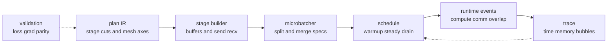

**Diagram notation key:** `plan IR` maps to the planner's intermediate representation; `stage cuts` are layer or graph boundaries assigned to pipeline stages; `send recv` means point-to-point activation and gradient transfers; `split and merge specs` are microbatch chunking and reconstruction rules; `compute comm overlap` means overlapping computation with communication when dependencies permit; `bubbles` are idle timeline slots.

An automatic planner should treat pipeline scheduling as a constrained runtime problem:

1. **Stage formation.** Split the graph into contiguous or dependency-respecting regions, recording stage input/output shapes, dtypes, and placement metadata. PyTorch's pipeline API can preserve forward behavior and activation flow more robustly than simple child-module slicing [S20].
2. **Boundary contract.** For each edge, record tensor shape, dtype, placement, producer stage, consumer stage, and whether communication is forward activation, backward gradient, or auxiliary state.
3. **Microbatch contract.** Specify which batch dimensions may be chunked, which arguments are replicated, how losses are scaled, and how outputs are merged.
4. **Schedule choice.** Select GPipe, 1F1B, interleaved, zero-bubble, or another schedule based on memory budget, stage balance, virtual-stage availability, and measured compute/communication times.
5. **Overlap policy.** Decide which send/recv operations may be issued asynchronously, which collectives from tensor or data parallelism may overlap with pipeline work, and where stream/event dependencies are required.
6. **Optimizer boundary.** Ensure that all microbatch gradients contributing to the logical batch are accumulated before optimizer update, gradient clipping, or scheduler advancement.
7. **Traceability.** Emit a schedule trace containing stage, microbatch, action type, tensor key, communication peer, start/end time, and error location.

Operational checklist for a pipeline schedule:

| Check | Why it matters |
|---|---|
| Every stage boundary has a shape/dtype contract. | Prevents late send/recv buffer mismatches and makes errors localizable. |
| The number of microbatches is compatible with the schedule. | Some interleaved schedules impose divisibility or virtual-stage constraints. |
| Loss scaling matches microbatch aggregation. | Avoids gradients that differ by a factor of $m$. |
| Activation checkpointing is modeled in the stage time and memory budget. | Recompute changes both bubble and memory estimates. |
| Pipeline send/recv does not conflict with tensor-parallel collectives on the same critical stream. | Unintended serialization can erase predicted overlap. |
| Stage time estimates are measured after sharding and kernel selection. | Single-device estimates miss DTensor redistribution and FSDP all-gather costs. |
| The runtime can dump a per-rank timeline. | Pipeline errors often appear as hangs unless the schedule is observable. |

Evidence boundary: PyTorch provides public pipeline split, stage, microbatch, and schedule APIs, including GPipe, 1F1B, interleaved, zero-bubble, and related schedule variants [S20]. TorchTitan is evidence that PyTorch-native training recipes compose pipeline parallelism with other distributed primitives [S21]. Alpa and Galvatron are evidence for automatic or semi-automatic planning that considers pipeline choices [S8, S12]. A general planner that automatically chooses stage cuts, microbatch count, overlap policy, and zero-bubble variants for arbitrary eager PyTorch programs remains a proposed synthesis rather than a fully documented native PyTorch feature.

### 3.12 State And Checkpoint Resharding

The state contract is the persistence side of model/execution separation. If model code defines a logical parameter named `layers.0.mlp.w1.weight`, the checkpoint should not permanently encode that the tensor was saved under a particular data-parallel degree, tensor-parallel degree, pipeline cut, FSDP shard, or rank count. A portable checkpoint records enough metadata to reconstruct logical state into a new placement. PyTorch Distributed Checkpoint (DCP) explicitly supports distributed save/load, sharded tensors and DTensors, and load-time resharding across cluster topologies; its state-dict APIs aim to return canonical fully qualified names and optimizer states that can be resharded across different trainer counts and parallelism combinations [S18]. veScale documents automatic checkpoint resharding and online resharding as a goal of its PyTorch-native system, with maturity caveats in its public documentation [S7]. TorchTitan uses PyTorch-native distributed checkpointing in large-model recipes [S21].

Let a training run use execution plan $\pi$ over mesh $\mathcal{M}$, then resume under plan $\pi'$ over mesh $\mathcal{M}'$. Checkpoint portability asks for:

$$
\operatorname{Load}_{\pi'}
\left(
\operatorname{Save}_{\pi}(S_t)
\right)
\equiv
S'_t
\quad
\text{such that}
\quad
\operatorname{Logical}(S'_t)
=
\operatorname{Logical}(S_t).
$$

Symbols: $S_t$ is all restart-relevant state at step $t$; $\pi$ is the old execution plan; $\pi'$ is the new execution plan; $\mathcal{M}$ and $\mathcal{M}'$ are old and new logical meshes; $\operatorname{Save}_{\pi}$ writes state from the old placement; $\operatorname{Load}_{\pi'}$ materializes state into the new placement; $\operatorname{Logical}$ maps physical shards back to the logical model state. Equality is exact for integer and metadata state, and tolerance-based for floating-point state if format conversion or dtype policy changes.

For one logical tensor $W \in \mathbb{R}^{n_0 \times n_1}$, a checkpoint should be interpretable as a set of slices:

$$
C(W)
=
\left\{
\left(k,\; \Omega_k,\; W[\Omega_k],\; \tau_k \right)
\right\}_{k=1}^{K},
$$

and a load under a new placement reads the intersections needed by each destination rank:

$$
W'[\Omega'_r]
=
\bigcup_{k:\; \Omega_k \cap \Omega'_r \ne \varnothing}
W[\Omega_k \cap \Omega'_r].
$$

Symbols: $C(W)$ is the stored checkpoint representation for tensor $W$; $k$ indexes stored shards; $\Omega_k$ is the logical index region covered by stored shard $k$; $W[\Omega_k]$ is the saved tensor data for that region; $\tau_k$ is metadata such as dtype, layout, shape, and version; $\Omega'_r$ is the destination logical region for rank $r$ under the new placement; $\cup$ denotes assembling non-overlapping logical slices. Production systems implement this through metadata and load plans rather than literally constructing set unions in user code.

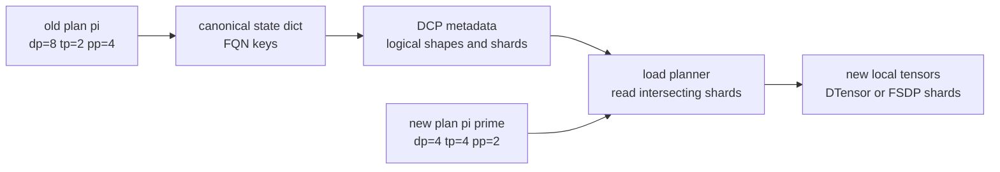

**Diagram notation key:** $\pi$ is the old execution plan; $\pi'$ is the new execution plan; `dp`, `tp`, and `pp` are data-, tensor-, and pipeline-parallel degrees; `FQN` means fully qualified name; `DCP` means PyTorch Distributed Checkpoint; `DTensor` means PyTorch Distributed Tensor; `FSDP` means Fully Sharded Data Parallel.

The state dictionary is the logical naming layer. Its keys should be stable with respect to parallel wrappers and parameter IDs:

$$
\operatorname{Key}(\theta_\ell)
=
\operatorname{FQN}(\theta_\ell),
\qquad
\operatorname{Key}(o_\ell)
=
\left(\operatorname{FQN}(\theta_\ell),\; \operatorname{slot}\right).
$$

Symbols: $\theta_\ell$ is a logical parameter; $o_\ell$ is optimizer state associated with $\theta_\ell$; $\operatorname{FQN}$ is the canonical fully qualified name from the unparallelized module hierarchy; $\operatorname{slot}$ is an optimizer buffer name such as `exp_avg`, `exp_avg_sq`, momentum, or step. PyTorch's DCP state-dict APIs are specifically designed to hide parallelism-specific state-dict APIs and convert optimizer parameter identifiers to canonical names [S18].

State categories and portability requirements:

| State | Logical identity | Resharding requirement | Common failure mode | PyTorch projection |
|---|---|---|---|---|
| Parameters | Canonical module FQN plus logical shape. | Load slices into destination DTensor, FSDP, TP, or replicated placement. | Wrapper-specific keys or missing buffers. | DCP `get_state_dict`, `set_state_dict`, DTensor/FSDP state handling [S18]. |
| Buffers | Canonical buffer FQN plus persistence flag. | Preserve exact logical value or documented non-persistent exclusion. | BatchNorm/running-stat or rotary-cache buffers silently diverge. | Module state dict plus DCP metadata [S18]. |
| Gradients | Parameter FQN plus accumulation step. | Usually omit except for fault tolerance inside a step; if saved, preserve accumulation semantics. | Resuming with half-accumulated gradients as if step boundary was clean. | Save only at safe boundaries unless mid-step restart is explicitly designed. |
| Optimizer state | Parameter FQN plus optimizer slot. | Reshard slots using the same logical layout as their parameter unless optimizer defines otherwise. | Parameter-ID keyed optimizer states become invalid after wrapping or rebuilding. | DCP optimizer state dict canonicalization [S18]. |
| RNG streams | Logical stream name, seed, offset/counter, rank/mesh policy. | Resume dropout, initialization, and stochastic layers under changed placement. | Same global seed but different shard order produces different masks. | Save CPU/CUDA generator state plus planner-level logical RNG metadata; veScale is evidence for distributed RNG consistency work [S6]. |
| Scheduler state | Optimizer/scheduler FQN and step counters. | Preserve exact scalar and configuration state. | Learning-rate schedule advances twice or restarts. | Application state plus DCP `Stateful` objects [S18]. |
| Data-loader state | Dataset epoch, sample cursor, sampler RNG, consumed tokens. | Preserve sample order when claiming deterministic continuation. | Loss parity fails because input order changed, not because model resharding failed. | Application-defined state in checkpoint. |
| Plan metadata | Mesh shape, placements, stage cuts, dtype, version. | Permit audit and compatibility checks, but not force same plan on load. | Checkpoint loads but cannot explain how it was produced. | Save plan file beside DCP checkpoint. |

Load-time resharding should be staged as a protocol rather than a best-effort `torch.load`:

1. **Construct destination objects first.** The model, optimizer, DTensors, FSDP shards, and buffers should exist with destination shapes, dtypes, devices, and placements before load. DCP load operates in place and requires allocated destination storage for tensors [S18].
2. **Build canonical state dictionaries.** Use canonical FQN-based model and optimizer state dictionaries so that source and destination plans can differ.
3. **Read checkpoint metadata.** Validate global shapes, dtypes, key sets, version fields, and allowed missing/unexpected keys.
4. **Plan shard intersections.** For each destination shard, compute which stored shards contain its logical slices. Prefer reading the least data needed by each rank.
5. **Materialize and transform.** Apply allowed dtype conversion, device movement, tensor-layout conversion, and key renaming through an explicit load planner.
6. **Commit into destination state.** Copy loaded slices into destination storage and call module/optimizer load hooks so non-tensor state is propagated.
7. **Verify logical equality.** For a small checkpoint, reconstruct full tensors or hashes from both old and new placements and compare logical values.

Two invariants make checkpoint resharding robust:

$$
\operatorname{Keys}(S_{\mathrm{model}})
=
\operatorname{Keys}(S'_{\mathrm{model}})
$$

and:

$$
\forall k,\quad
\operatorname{shape}_{\mathrm{logical}}(S[k])
=
\operatorname{shape}_{\mathrm{logical}}(S'[k]).
$$

Symbols: $S_{\mathrm{model}}$ and $S'_{\mathrm{model}}$ are source and destination model state dictionaries; $k$ is a state-dict key; $\operatorname{Keys}$ returns the set of keys; $\operatorname{shape}_{\mathrm{logical}}$ returns the unsharded logical tensor shape. Exceptions should be explicit: vocabulary expansion, adapter insertion, changed positional embeddings, or intentional partial loading.

RNG is a special case because placement can change the order and number of random draws. Saving only `torch.manual_seed` is not enough for strict equivalence when dropout masks, stochastic depth, data augmentation, or randomized initialization are sharded differently. A stronger logical RNG contract names streams and counters:

$$
R
=
\left\{
\left(s,\; \operatorname{seed}_s,\; \operatorname{counter}_s,\; \operatorname{domain}_s\right)
\right\}_{s \in \mathcal{S}},
$$

where $\mathcal{S}$ may include streams such as `params`, `dropout`, `data`, and `augmentation`.

Symbols: $R$ is RNG checkpoint state; $s$ is a logical random stream; $\operatorname{seed}_s$ is its seed; $\operatorname{counter}_s$ is its offset or consumed-randomness counter; $\operatorname{domain}_s$ describes whether the stream is global, per-rank, per-sample, per-layer, or per-shard. veScale's public paper emphasizes distributed RNG compatible with arbitrary sharded operators; that is strong evidence that RNG belongs in the parallelization contract, but not evidence that arbitrary PyTorch eager programs have a universal solved RNG scheme [S6].

Operational checklist for portable checkpoints:

| Check | Required artifact |
|---|---|
| Canonical model and optimizer keys. | FQN-keyed state dictionaries, no optimizer parameter-ID dependency. |
| Logical shape and dtype metadata. | Per-key metadata independent of rank-local shard shape. |
| Placement metadata. | Old plan saved for audit; new plan allowed at load. |
| Destination allocation before load. | Model and optimizer initialized under $\pi'$ before DCP load. |
| RNG and data state saved. | CPU/CUDA generator state plus logical stream metadata and sampler cursor. |
| Safe save boundary recorded. | Step number, microbatch accumulation position, optimizer-step status. |
| Version and compatibility policy. | PyTorch version, planner version, model config, allowed key transforms. |
| Post-load parity check. | Hashes or small full-tensor reconstruction for parameters and optimizer slots. |

Evidence boundary: PyTorch DCP directly documents distributed save/load, DTensor and sharded-state handling, in-place load, canonical FQN state dictionaries, optimizer-state canonicalization, and load-time resharding across topologies and parallelisms [S18]. TorchTitan provides public evidence of DCP use in a PyTorch-native large-model training stack [S21]. veScale provides evidence for the design goal of automatic distributed checkpointing and online resharding, but public documentation marks several automation capabilities as evolving or under development [S7]. Exact reproducibility across arbitrary changed mesh shapes also depends on RNG, data-loader, kernel determinism, and optimizer implementation details that are outside DCP alone.

### 3.13 Debuggability And Equivalence

A parallelization planner is useful only if users can understand its decisions and test that the distributed execution preserves the reference program. Debuggability is therefore not an afterthought; it is part of the execution contract. The planner should be able to answer: what placement does each tensor have, why was a collective inserted, where did a pipeline send/recv come from, which random stream generated this mask, which checkpoint key loaded this parameter, and which test establishes that the plan is equivalent to the single-device baseline?

Equivalence is not a single assertion. It is a layered argument:

$$
\operatorname{PlanOK}
=
\operatorname{ShapeOK}
\land
\operatorname{LayoutOK}
\land
\operatorname{NumericsOK}
\land
\operatorname{StateOK}
\land
\operatorname{TraceOK}.
$$

Symbols: $\operatorname{PlanOK}$ is the planner's overall correctness gate; $\operatorname{ShapeOK}$ means logical and local tensor shapes match the plan; $\operatorname{LayoutOK}$ means placements and mesh axes are legal; $\operatorname{NumericsOK}$ means forward, loss, and gradient comparisons pass tolerance; $\operatorname{StateOK}$ means parameters, optimizer state, RNG, and checkpoint load state are coherent; $\operatorname{TraceOK}$ means the observed collectives and send/recv edges match the planned execution.

The lowest-level tests are shape and layout assertions. For every graph value or module boundary $v$, record:

$$
\operatorname{Spec}(v)
=
\left(
\operatorname{shape}_{\mathrm{logical}}(v),
\operatorname{dtype}(v),
\operatorname{mesh}(v),
\operatorname{placement}(v)
\right).
$$

Symbols: $\operatorname{Spec}(v)$ is the expected distributed tensor contract for value $v$; $\operatorname{shape}_{\mathrm{logical}}$ is the unsharded shape; $\operatorname{dtype}$ is numerical type; $\operatorname{mesh}$ is the logical mesh or mesh slice; $\operatorname{placement}$ is a placement tuple such as replicated, sharded, or partial. In a PyTorch projection, DTensor placements and `DeviceMesh` coordinates are the natural runtime objects to assert [S15, S16].

Forward and gradient parity compare a distributed run against a reference run using the same logical inputs, initial weights, loss scaling, and random streams:

$$
\Delta_{\mathrm{loss}}
=
\left\lvert
\mathcal{L}_{\mathrm{dist}}
-
\mathcal{L}_{\mathrm{ref}}
\right\rvert,
$$

$$
\Delta_{\mathrm{grad}}(k)
=
\frac{
\left\lVert
\operatorname{Gather}(g_{\mathrm{dist}}[k])
-
g_{\mathrm{ref}}[k]
\right\rVert_2
}{
\left\lVert g_{\mathrm{ref}}[k]\right\rVert_2 + \epsilon
}.
$$

Symbols: $\Delta_{\mathrm{loss}}$ is absolute loss difference; $\mathcal{L}_{\mathrm{dist}}$ is the distributed loss after gathering or reducing as required; $\mathcal{L}_{\mathrm{ref}}$ is the single-device or single-rank reference loss; $\Delta_{\mathrm{grad}}(k)$ is relative gradient error for parameter key $k$; $g_{\mathrm{dist}}[k]$ is the distributed gradient; $\operatorname{Gather}$ reconstructs the logical gradient from shards; $g_{\mathrm{ref}}[k]$ is the reference gradient; $\epsilon$ prevents division by zero. Tolerances should be dtype-specific and schedule-aware: BF16, FP8, fused kernels, different reduction orders, and activation checkpointing can change roundoff without indicating semantic failure.

For optimizer equivalence, compare one complete update rather than only gradients:

$$
\Delta_{\theta}(k)
=
\frac{
\left\lVert
\operatorname{Gather}(\theta_{\mathrm{dist}, t+1}[k])
-
\theta_{\mathrm{ref}, t+1}[k]
\right\rVert_2
}{
\left\lVert \theta_{\mathrm{ref}, t+1}[k]\right\rVert_2 + \epsilon
}.
$$

Symbols: $\Delta_{\theta}(k)$ is relative parameter-update error for key $k$; $\theta_{\mathrm{dist}, t+1}$ and $\theta_{\mathrm{ref}, t+1}$ are distributed and reference parameters after one optimizer step. This catches bugs in loss scaling, gradient accumulation, optimizer-state sharding, and scheduler order that pure forward tests miss.

Collective traces make distributed behavior explainable. For each rank, the runtime can log:

$$
\operatorname{Trace}_r
=
\left[
\left(
t,\; op,\; group,\; tensor,\; shape,\; placement_{\mathrm{in}},\; placement_{\mathrm{out}}
\right)
\right].
$$

Symbols: $\operatorname{Trace}_r$ is the ordered communication trace for rank $r$; $t$ is logical or wall-clock time; $op$ is a collective or point-to-point operation such as all-reduce, all-gather, reduce-scatter, all-to-all, send, or recv; $group$ is the process group or mesh axis; $tensor$ is a stable tensor key; $shape$ is payload shape; $\operatorname{placement}_{\mathrm{in}}$ and $\operatorname{placement}_{\mathrm{out}}$ are before/after placements. Trace equality need not require identical low-level NCCL algorithms, but it should detect missing collectives, unexpected redistributions, wrong mesh axes, and send/recv mismatches.

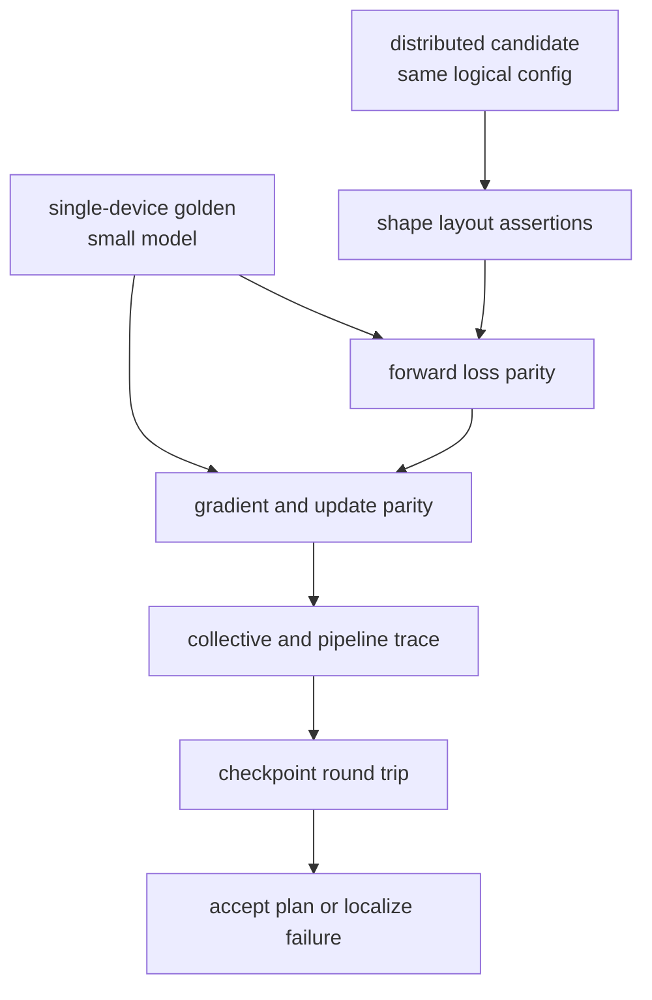

**Diagram notation key:** `golden` means the reference execution; `shape layout assertions` are DTensor/FSDP/pipeline boundary checks; `loss parity`, `gradient parity`, and `update parity` are numerical equivalence gates; `collective and pipeline trace` records communication behavior; `checkpoint round trip` tests save, load, and optional resharding.

Small-model golden tests are the most practical equivalence mechanism. A planner should maintain a suite of tiny models that exercise the same primitives as the large target:

| Golden test | Primitive exercised | Required assertion |
|---|---|---|
| Two-layer MLP with dropout | TP, RNG, loss scaling. | Equal loss and gradients under fixed logical RNG. |
| Transformer block | Attention layouts, residuals, norms, activation checkpointing. | Forward and backward parity within dtype tolerance. |
| Embedding plus tied output head | Shared parameters and state-dict aliasing. | One logical key or explicit alias policy preserved. |
| Two-stage pipeline | Send/recv, microbatch merge, gradient accumulation. | Same update as non-pipeline run. |
| FSDP plus TP toy model | Composite mesh placements. | Parameter and optimizer state match after one step. |
| Save under one mesh, load under another | DCP resharding and canonical keys. | Logical tensors and optimizer slots match after load. |

Determinism controls should be explicit:

1. Set CPU, CUDA, and framework seeds before model initialization and input creation.
2. Save and restore RNG states for each logical stream used by initialization, dropout, data order, and augmentation.
3. Use deterministic kernels where required for tests, or mark nondeterministic kernels and widen tolerances only for those tests.
4. Keep microbatch loss scaling identical to the reference batch loss.
5. Compare the same samples in the same order before diagnosing parallelism.
6. Gather sharded tensors by canonical FQN before comparison.
7. Run at least one test with world size one or fully replicated placement to separate planner bugs from distributed runtime bugs.

Debug artifacts should be designed for humans:

| Artifact | Contents | Failure localized |
|---|---|---|
| Plan dump | Mesh axes, placements, tactics, stage cuts, checkpoint policy. | Illegal or surprising planner decision. |
| Per-module layout table | Module FQN, input/output specs, parameter placements. | Wrong shard dimension or accidental replication. |
| Communication trace | Collective/send/recv sequence with groups and tensor keys. | Missing collective, wrong group, deadlock risk. |
| Pipeline timeline | Stage, microbatch, action type, wait time, buffer key. | Bubble source, imbalance, send/recv mismatch. |
| RNG report | Stream names, seeds, counters, domains. | Dropout or initialization mismatch. |
| Checkpoint manifest | Keys, logical shapes, shard metadata, plan/version. | Non-portable or partially loaded state. |
| Parity report | Loss, gradient, parameter-update deltas by key. | First numerically divergent layer or state slot. |

Operational checklist for accepting an automatic plan:

| Gate | Acceptance criterion |
|---|---|
| Static legality | Every tactic applies to a supported module/graph region; all placements are defined over valid mesh axes. |
| Shape/layout assertions | Runtime DTensor, FSDP, and pipeline boundary specs match the emitted plan. |
| Single-step parity | Small model passes forward, loss, gradient, and update parity. |
| Deterministic seed discipline | Test harness records seeds, RNG states, sample order, dtype, and kernel determinism settings. |
| Collective trace sanity | Observed collectives match expected placement transitions and pipeline edges. |
| Checkpoint round trip | Save/load preserves logical parameters, optimizer slots, scheduler state, and RNG state. |
| Reshard round trip | At least one test saves under $\pi$ and loads under $\pi'$ with changed mesh shape. |
| Evidence label | Unsupported automation or closed implementation assumptions are marked `inferred` rather than presented as public fact. |

Evidence boundary: DTensor and `DeviceMesh` provide inspectable placement objects for PyTorch-native layout assertions [S15, S16]. PyTorch pipeline APIs provide explicit stage and schedule abstractions that can be traced at the plan level [S20]. DCP provides public checkpoint metadata and state-dict mechanisms for state equivalence and resharding tests [S18]. TorchTitan and veScale are public evidence that usability, composability, and correctness are central concerns in PyTorch-native large-model training systems [S6, S7, S21]. There is no public universal proof that arbitrary eager PyTorch code transformed by an automatic planner is equivalent to its single-device reference. Practical systems should therefore combine static contracts, deterministic golden tests, runtime assertions, communication traces, and checkpoint round trips.

### 3.14 Cross-Cutting Planning Dimensions

The preceding primitive sections describe mechanisms that can be explained locally: placements, propagation, lowering, cost models, search, rewrites, schedules, state, and equivalence. A production-grade planner also needs a set of cross-cutting contracts that are easy to miss because they do not belong to a single operator. They should be represented explicitly in `ParallelSpec` and `PlanIR`, even when the first implementation supports only conservative defaults.

#### Planner Contract And Automation Levels

A planner consumes a logical training problem and emits a constrained execution problem. Its input is not merely a model graph. It also includes the training step, optimizer, data semantics, precision policy, device inventory, topology, memory tiers, checkpoint policy, reproducibility requirements, and user constraints. Its output is not merely a sharding annotation. It includes placements, rewrites, stage cuts, communication groups, runtime schedule, state layout, checkpoint/recovery policy, profiling hooks, and fallback regions.

A compact contract is:

$$
\operatorname{Plan}
=
\Psi(G, U, \mathcal{M}, \mathcal{T}, \mathcal{H}, \Omega),
$$

Symbols:

- $G$ is the captured or inferred model/training graph.
- $U$ is the training update contract: optimizer, loss normalization, gradient accumulation, and data consumption.
- $\mathcal{M}$ is the logical device mesh.
- $\mathcal{T}$ is the physical topology and memory-tier inventory.
- $\mathcal{H}$ is the history of measured costs, checkpoint state, and previous accepted plans.
- $\Omega$ is the objective, memory budget, user constraints, and allowed automation level.
- $\Psi$ is the planner.
- $\operatorname{Plan}$ is the emitted artifact: placements, tactics, collectives, schedules, state layout, and validation hooks.

Automation should be stated by level, not implied by branding:

| Level | What is automatic | What remains user- or library-authored |
|---|---|---|
| Manual | The runtime executes explicit placements, collectives, or module rewrites. | Most tactics, mesh axes, and schedule choices. |
| Semi-automatic | The user supplies strategy structure; the system propagates layouts, fills local choices, lowers collectives, or checks legality. | Objective, key constraints, unsupported regions, and many high-level choices. |
| Bounded automatic | The planner searches a known-safe tactic space under memory and throughput constraints. | Search space design, model-family policies, validation thresholds, and fallback policy. |
| Compiler-style automatic | Sparse annotations or constraints are propagated through a graph and lowered by a compiler partitioner. | Backend compatibility, custom/manual regions, and debugging interpretation. |

Evidence boundary: GSPMD and Shardy provide strong compiler-side evidence for sparse annotations and propagation [S4, S5]. PartIR, Automap, Galvatron, Alpa, FlexFlow, DistIR, and PaSE provide evidence for bounded tactic/search formulations [S1, S2, S3, S8, S10, S11, S12, S27]. PyTorch exposes many execution adapters, but the full planner contract remains a conceptual integration layer.

#### Topology-Aware Mesh Mapping

A logical mesh is insufficient without a mapping to physical devices. A planner should model a topology graph:

$$
\mathcal{T}=(\mathcal{P},\mathcal{E}),
\qquad
\phi : \mathcal{M} \rightarrow \mathcal{P}.
$$

Symbols: $\mathcal{T}$ is the physical topology graph; $\mathcal{P}$ is the set of devices, hosts, non-uniform memory access (NUMA) domains, network interface cards, and storage endpoints; $\mathcal{E}$ is the set of bandwidth/latency links such as NVLink, NVSwitch, PCIe, InfiniBand, or Ethernet; $\phi$ maps logical mesh coordinates onto physical resources; $\mathcal{M}$ is the logical mesh. The planner should prefer high-bandwidth local domains for axes with dense synchronization, such as tensor parallelism (`tp`), context parallelism (`cp`), and expert dispatch (`ep`) when all-to-all dominates. Data parallel (`dp`) and checkpoint traffic may tolerate wider placement but still need bandwidth and failure-domain constraints.

The cost model should therefore use axis-specific effective bandwidths:

$$
T_{\mathrm{comm}}(c,a)
\approx
\alpha_{c,a}(\phi)
+
\beta_{c,a}(\phi)V_c
+
\chi_{c,a}(\phi,\mathcal{S}).
$$

Symbols: $T_{\mathrm{comm}}(c,a)$ is communication time for event $c$ over mesh axis $a$; $c$ is a collective or point-to-point event; $a$ is a mesh axis; $\alpha_{c,a}$ is startup/synchronization cost under physical mapping $\phi$; $\beta_{c,a}$ is inverse effective bandwidth; $V_c$ is communicated byte volume; $\chi_{c,a}$ is contention or overlap penalty; $\mathcal{S}$ is the runtime schedule.

PyTorch projection: `DeviceMesh` supplies logical process groups [S16]; NCCL and distributed backends realize collectives; TorchTitan and Megatron-LM provide operational examples of mapping tensor, data, and pipeline parallelism onto GPU clusters [S21, S33]. A general topology optimizer above PyTorch should be treated as planner-level work, not as built-in `DeviceMesh` behavior.

#### Memory Hierarchy, Offload, And Prefetch Planning

Device memory is only one tier. Large-model training often uses a hierarchy:

| Tier | Typical contents | Planner concern |
|---|---|---|
| GPU high-bandwidth memory (HBM) | Active parameters, gradients, activations, kernel workspace. | Peak capacity, liveness, fragmentation, collective workspace. |
| CPU dynamic random-access memory (DRAM) and pinned buffers | Offloaded optimizer state, staged parameters, checkpoint buffers. | PCIe/NVLink bandwidth, pinned-memory pressure, prefetch timing. |
| Non-Volatile Memory Express (NVMe) or local SSD | Cold optimizer/parameter shards, checkpoint staging. | Read/write bandwidth, queue depth, overlap, failure recovery. |
| Remote/object storage | Durable checkpoints and artifacts. | Async upload, manifest validation, restore latency. |

A planner should extend the memory constraint from one number to per-tier constraints:

$$
M_{q}^{\mathrm{peak}}(\pi)
\le
C_q,
\qquad
q \in \{\mathrm{HBM},\mathrm{DRAM},\mathrm{NVMe},\mathrm{remote}\},
$$

and add transfer time:

$$
T_{\mathrm{offload}}(\pi)
=
\sum_{e \in \mathcal{O}(\pi)}
\max\left(0,\alpha_e+\frac{B_e}{\operatorname{BW}_e}-T_{\mathrm{overlap},e}\right).
$$

Symbols: $M_q^{\mathrm{peak}}(\pi)$ is peak memory required by plan $\pi$ in tier $q$; $C_q$ is usable capacity of tier $q$; $\mathcal{O}(\pi)$ is the set of offload or prefetch transfers; $B_e$ is bytes moved by event $e$; $\operatorname{BW}_e$ is effective bandwidth; $T_{\mathrm{overlap},e}$ is time hidden behind compute or other communication.

Evidence boundary: ZeRO-Offload and ZeRO-Infinity show why CPU and NVMe tiers belong in model-parallel planning [S38]. PyTorch DCP and TorchTitan support sharded checkpointing and staging [S18, S21], but no single public PyTorch primitive should be described as a complete automatic memory-tier planner.

#### Activation Rematerialization Planning

Activation rematerialization, often called activation checkpointing in PyTorch APIs, trades saved activation memory for recomputation. It is distinct from state checkpointing for restart. For a region $R$:

$$
\Delta M_R = M_{\mathrm{saved},R} - M_{\mathrm{boundary},R},
\qquad
\Delta T_R \approx T_{\mathrm{recompute},R} + T_{\mathrm{rng},R}.
$$

Symbols: $\Delta M_R$ is memory saved by rematerializing region $R$; $M_{\mathrm{saved},R}$ is memory that would have been retained for backward; $M_{\mathrm{boundary},R}$ is memory still needed at region boundaries; $\Delta T_R$ is added runtime; $T_{\mathrm{recompute},R}$ is recomputation time; $T_{\mathrm{rng},R}$ is overhead for preserving random-number-generator state when needed.

A planner must consider region-level and op-level policies, selective activation checkpointing, memory-budget APIs, interaction with pipeline stage memory, and dropout/RNG equivalence. PyTorch `torch.utils.checkpoint` documents recomputation and RNG-preservation semantics, while the PyTorch activation-checkpointing blog describes newer selective activation checkpoint and memory-budget directions [S39].

#### Training-Step, Data, And Global-Batch Semantics

The model/execution separation is incomplete unless the logical training update is defined independently of the number of ranks. A planner that changes data-parallel degree, pipeline microbatch count, context-parallel sequence split, or expert routing must preserve sample accounting and loss normalization.

For global batch $B_{\mathrm{global}}$:

$$
B_{\mathrm{global}}
=
B_{\mathrm{rank}} \cdot d_{\mathrm{dp}} \cdot m_{\mathrm{acc}},
$$

Symbols: $B_{\mathrm{global}}$ is the logical global batch size per optimizer update; $B_{\mathrm{rank}}$ is the per-rank batch; $d_{\mathrm{dp}}$ is the data-parallel degree; $m_{\mathrm{acc}}$ is gradient-accumulation steps. With pipeline parallelism, $B_{\mathrm{rank}}$ may be subdivided into microbatches; with context parallelism, each sample may also be split along sequence length. The checkpoint state should include sampler epoch, consumed examples or tokens, random seeds, learning-rate scheduler state, and any packing/variable-length batch metadata.

PyTorch projection: `DistributedSampler` is the standard data-sharding surface; DCP can store application state beyond tensors; TorchTitan-style recipes demonstrate training-loop integration [S18, S21, S40]. The planner cannot infer all application-level semantics; it should require an explicit data contract when changing world size or accumulation.

#### Distributed Autograd And Backward Boundaries

Forward placements induce backward placements. If $Y = XW$ and $W$ is column-sharded over `tp`, the backward gradients inherit communication requirements for $\nabla_X$ and $\nabla_W$. More generally:

$$
\operatorname{place}(\nabla X_i)
=
\Gamma_{\operatorname{op},i}
\left(\operatorname{place}(Y),\operatorname{place}(X_1),\ldots,\operatorname{place}(X_n)\right),
$$

Symbols: $\operatorname{place}(\nabla X_i)$ is the placement of the gradient for input $X_i$; $\Gamma_{\operatorname{op},i}$ is the backward placement rule for input $X_i$ of operator $\operatorname{op}$; $Y$ is the forward output; $X_1,\ldots,X_n$ are forward inputs. Saved tensors for backward may be sharded, replicated, offloaded, or recomputed. Custom autograd functions, mutation, aliasing, and manual distributed operations should become declared manual regions unless the planner has explicit sharding and backward rules.

PyTorch projection: eager autograd, AOTAutograd, DTensor dispatch, FSDP2, and pipeline backward schedules each expose part of this surface. The evidence boundary is important: arbitrary eager custom autograd plus automatic DTensor propagation is not solved by public PyTorch APIs alone.

#### Profiling-Guided Planning And Planner UX

Symbolic cost models should be treated as hypotheses. A robust planner records predicted costs, runs warmup probes, compares measured kernel/collective/stage times, and either recalibrates or explains why it refuses to replan. Replanning should happen only at explicit safe points unless the runtime can prove state compatibility.

Planner UX matters because separation should not mean opacity. A useful plan artifact should include:

- A diff between old and new placements, stages, and checkpoint layout.
- Rejected tactics with the violated invariant or memory constraint.
- Estimated versus measured cost tables.
- Human override points: freeze mesh, forbid offload, pin stage cuts, disable a rewrite, or declare a manual region.
- Versioned runtime assumptions for PyTorch, CUDA/NCCL, DTensor, tensor parallelism, pipeline APIs, and DCP.

Evidence boundary: PartIR tactics, Shardy priorities, Slapo schedules, Galvatron profiling, DistIR simulation, and PyTorch profiler-style tooling all support pieces of explainable planning [S1, S5, S11, S12, S13]. A fully integrated PyTorch planner UX is a proposed systems layer.

## 4. JAX And OpenXLA Ideas Projected To PyTorch

JAX and OpenXLA are useful here not because PyTorch should become JAX, but because they expose a mature public separation between logical tensor programs, named device meshes, placement annotations, compiler propagation, and SPMD lowering. The PyTorch projection should preserve PyTorch's default authoring style: users keep ordinary `torch.nn.Module` code, while an execution layer attaches mesh, placement, propagation, and scheduling decisions around it. The clean transfer is therefore conceptual, not syntactic.

The bridge has three evidence levels. Some ideas are already implemented in PyTorch primitives. Some are partial because PyTorch has either eager DTensor behavior or an XLA-backed compiler path, but not a single native whole-program planner for arbitrary eager PyTorch. Some remain proposed planner machinery: constraints, priorities, tactic search, and compile adapters that make JAX/OpenXLA-style propagation feel native in PyTorch.

| JAX/OpenXLA idea | Core idea | PyTorch projection | Status | Evidence boundary |
|---|---|---|---|---|
| JAX `Mesh` | Name logical axes over a global set of devices. | PyTorch `DeviceMesh` with `mesh_dim_names`, submesh slicing, and process-group management. | implemented | Public PyTorch primitive; automatic physical rank-to-axis assignment remains a planner problem [S16]. |
| `PartitionSpec` | Describe which tensor dimensions shard over which mesh axes. | DTensor `Placement` values, especially `Shard(dim)` and `Replicate()`, interpreted relative to named `DeviceMesh` axes. | implemented | Semantics transfer directly, but syntax and attachment point differ [S15, S23]. |
| `NamedSharding` | Bind an array to a mesh plus partition specification. | A DTensor binds a local tensor, `DeviceMesh`, and placement tuple. | implemented | DTensor covers the placement object model; integration coverage depends on supported ops and modules [S15]. |
| `pjit` plus GSPMD propagation | Trace a logical program, propagate sparse sharding hints, and insert collectives in a compiler partitioner. | PyTorch/XLA SPMD implements the direct XLA route; native PyTorch can use `torch.export` plus a future planner/compile adapter; eager DTensor handles supported operator-level propagation at runtime. | partial | Implemented in PyTorch/XLA, partial in native eager PyTorch because DTensor is not a whole-program GSPMD partitioner [S4, S14, S15, S19, S24]. |
| `shard_map` | Let users write explicit per-shard code over named mesh axes. | Explicit rank-local PyTorch code, DTensor local tensors plus explicit collectives, `parallelize_module` for supported module patterns, and custom distributed wrappers. | partial | PyTorch has explicit distributed building blocks and tensor-parallel plans, but no exact `shard_map` equivalent that uniformly scopes named-axis local code [S17, S22]. |
| OpenXLA Shardy constraints and priorities | Represent shardings as constraints with priorities, then propagate and refine them in compiler IR. | Proposed PyTorch planner constraints, tactic priorities, and explainable placement conflicts over FX/export/DTensor metadata. | proposed | Shardy is an OpenXLA design reference; a native PyTorch planner layer with equivalent priorities is a paper-level proposal [S5]. |
| StableHLO or MLIR sharding metadata | Carry sharding through compiler IR rather than only through Python objects. | Backend-dependent export/compile adapter that lowers `PlanIR` metadata into StableHLO, XLA annotations, or another compiler representation. | proposed | PyTorch/XLA supplies one concrete backend path; a general native bridge is backend-specific and not a single public PyTorch API [S14, S19, S24]. |

### 4.1 Meshes Transfer Cleanly: JAX `Mesh` To PyTorch `DeviceMesh`

The mesh abstraction transfers almost one-for-one. In both ecosystems, the key idea is that model code should not manipulate raw rank IDs. Instead, a logical mesh gives names to axes such as `dp`, `tp`, `pp`, `cp`, and `ep`, and those names become the vocabulary for placement decisions. A rank coordinate can be written:

$$
r = (r_{\mathrm{dp}}, r_{\mathrm{tp}}, r_{\mathrm{pp}}, r_{\mathrm{cp}}, r_{\mathrm{ep}}) \in \mathcal{M}.
$$

Symbols: $r$ is one process rank expressed as a coordinate; $\mathcal{M}$ is the logical device mesh; $r_{\mathrm{dp}}$, $r_{\mathrm{tp}}$, $r_{\mathrm{pp}}$, $r_{\mathrm{cp}}$, and $r_{\mathrm{ep}}$ are rank coordinates along data-, tensor-, pipeline-, context-, and expert-parallel axes.

JAX `Mesh` and PyTorch `DeviceMesh` both make the axis name a stable handle for later transformations. In PyTorch, this means tensor parallelism can use `mesh["tp"]`, FSDP can use `mesh["dp"]`, and pipeline scheduling can use `mesh["pp"]` without every subsystem rediscovering process groups [S16, S17, S21]. The implemented part is the mesh object and named-axis slicing. The proposed planner part is choosing the best axis order, mapping axes to intra-node versus inter-node links, and revising the mesh when the model or cluster changes.

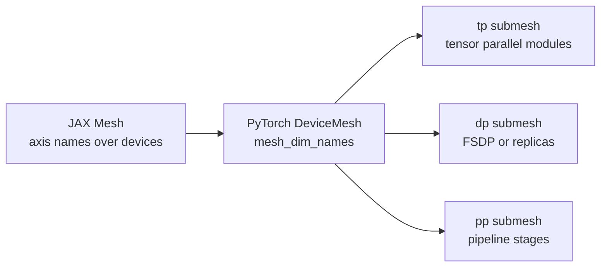

**Diagram notation key:** `tp` maps to tensor parallelism; `dp` maps to data parallelism or fully sharded data parallel groups; `pp` maps to pipeline parallelism.

Evidence boundary: `DeviceMesh` is an implemented PyTorch primitive. The paper should not imply that PyTorch automatically discovers the optimal mesh topology; that remains an external planner or user configuration problem.

### 4.2 Placement Specifications Transfer With A Syntax Change

`PartitionSpec` and `NamedSharding` transfer as a type-level idea: a logical tensor carries a relationship between tensor dimensions and mesh axes. The most compact conceptual mapping is:

$$
\operatorname{NamedSharding}(\mathcal{M}, \operatorname{PartitionSpec})
\quad\longrightarrow\quad
\operatorname{DTensor}(\mathcal{M}, \operatorname{Placements}).
$$

Symbols: $\mathcal{M}$ is the mesh; `PartitionSpec` is the JAX object describing tensor-dimension-to-mesh-axis mapping; `Placements` is the PyTorch DTensor tuple containing placement states such as `Shard(dim)`, `Replicate()`, and `Partial()`.

The ergonomic difference matters. In JAX, a tensor dimension can be annotated with a mesh axis name in a `PartitionSpec`, and `NamedSharding` binds that specification to a mesh [S23]. In PyTorch DTensor, placements are ordered relative to the mesh dimensions: a `Shard(1)` placement on a `tp` mesh axis means tensor dimension 1 is split across that axis [S15]. The idea is implemented; the exact representation differs.

| Logical placement intent | JAX expression style | PyTorch expression style | Status |
|---|---|---|---|
| Replicate tensor over axis | `PartitionSpec(None)` or omitted axis. | `Replicate()` over the corresponding `DeviceMesh` axis. | implemented |
| Shard batch over data axis | `PartitionSpec("dp", ...)`. | `Shard(0)` on `mesh["dp"]` or in a placement tuple aligned with `dp`. | implemented |
| Shard hidden/features over tensor axis | `PartitionSpec(..., "tp")`. | `Shard(hidden_dim)` on `mesh["tp"]`. | implemented |
| Represent pending reduction | GSPMD-internal partitioned value that lowers to reduction collectives. | `Partial()` DTensor placement. | implemented |
| Express manual per-shard region | `shard_map` or OpenXLA manual computation concepts. | Explicit local tensors and collectives; no exact uniform native equivalent. | partial |

The main planning lesson is that placement metadata should be a first-class contract, not an incidental runtime property. A PyTorch planner can attach a `PlacementSpec` to parameters, activations, graph values, and module boundaries, then realize it through DTensor where eager execution is desired or through PyTorch/XLA sharding annotations where XLA compilation is desired [S14, S15, S19].

Evidence boundary: DTensor implements the placement object model and many placement transitions. It does not, by itself, guarantee that every arbitrary PyTorch program has complete automatic placement inference or that every custom operator has a correct sharding rule.

### 4.3 `pjit` And GSPMD Become A Split PyTorch Story

The JAX/XLA model around `pjit` and GSPMD is the strongest public example of sparse user constraints plus compiler propagation. A user supplies input/output shardings or local annotations, the compiler propagates layouts through the graph, and SPMD lowering inserts collectives [S4, S23]. The PyTorch projection splits that story into three paths:

| PyTorch path | What it can inherit from GSPMD | What is missing or partial | Status |
|---|---|---|---|
| PyTorch/XLA SPMD | Direct use of XLA SPMD partitioning, sharding annotations, and compiler-inserted collectives. | Users accept XLA backend constraints and PyTorch/XLA coverage boundaries. | implemented |
| Eager DTensor | Runtime placement propagation for supported DTensor operators and explicit `redistribute` transitions. | No global compiler pass that sees all Python effects, all graph regions, and all future collectives before execution. | partial |
| `torch.export` plus planner adapter | Whole-graph ATen view suitable for propagation, cost modeling, and rewrite passes. | The adapter that turns a planned export graph into native DTensor/FSDP/TP/PP or compiler IR is proposed. | proposed |

The propagation contract can be stated without committing to a backend:

$$
\operatorname{place}(Y)
=
\Phi_{\operatorname{op}}
\left(
\operatorname{place}(X_1), \ldots, \operatorname{place}(X_k), \Omega
\right),
$$

where incompatible placements trigger a redistribution:

$$
X_i' = \operatorname{redistribute}(X_i,\; \operatorname{place}^{\star}(X_i)).
$$

Symbols: $Y$ is an operator output; $X_1,\ldots,X_k$ are operator inputs; $\Phi_{\operatorname{op}}$ is the operator-specific sharding rule; $\Omega$ is the set of user constraints, tactic priorities, and backend legality rules; $X_i'$ is an input after redistribution; $\operatorname{place}^{\star}(X_i)$ is the required placement for that operator.

The eager DTensor limit is important. DTensor can propagate placement through supported operations at runtime, but it is not the same as GSPMD's whole-graph partitioner. It may discover illegal or expensive redistributions locally, and it cannot optimize across all future uses unless another planner captures and analyzes the program. `torch.export` helps by producing a functional ATen graph, but it introduces traceability constraints and still needs a planner that can annotate graph values, run sharding rules, choose redistributions, and emit executable code [S15, S19].

Evidence boundary: PyTorch/XLA SPMD is implemented evidence that GSPMD ideas can serve PyTorch users through XLA [S14, S24]. Native PyTorch automatic SPMD over arbitrary eager programs is a design target assembled from DTensor, export graphs, and planner machinery, not a single mature public feature.

### 4.4 `shard_map` Projects To Explicit Local Code And Module Plans

`shard_map` is the bridge from automatic global propagation to explicit per-shard reasoning. It lets users write code that runs on local shards while still naming mesh axes at the boundary [S22]. The PyTorch analogue is less centralized: users can write rank-local code, use local tensors extracted from DTensor-aware regions, call explicit collectives, or rely on `parallelize_module` for common tensor-parallel modules [S17].

The conceptual boundary is:

$$
\operatorname{GlobalTensor}
\xrightarrow{\operatorname{enter\ local\ region}}
\operatorname{LocalShard}_{r}
\xrightarrow{\operatorname{explicit\ code}}
\operatorname{LocalOutput}_{r}
\xrightarrow{\operatorname{collective\ or\ placement\ contract}}
\operatorname{GlobalTensor}'.
$$

Symbols: $\operatorname{GlobalTensor}$ is the logical distributed tensor; $\operatorname{LocalShard}_{r}$ is the shard visible to rank $r$; $\operatorname{LocalOutput}_{r}$ is the rank-local result; $\operatorname{GlobalTensor}'$ is the reconstructed or logically distributed output after the local region.

In PyTorch, this pattern appears in three practical forms:

| Pattern | PyTorch expression | When it matches `shard_map` well | Status |
|---|---|---|---|
| Explicit rank-local code | Use `torch.distributed`, local tensors, and explicit all-reduce/all-gather/reduce-scatter/all-to-all. | Custom kernels, MoE routing, distributed softmax, or research code where communication is part of the algorithm. | implemented |
| Module-level parallelization | Use `parallelize_module` with `ColwiseParallel`, `RowwiseParallel`, `SequenceParallel`, and input/output layout helpers. | Standard transformer layers where the plan matches known tensor-parallel patterns. | implemented |
| DTensor local-region adapter | Planner-defined escape hatch that materializes local shards, runs user code, and reattaches placement metadata. | Future generalization of explicit local shard code with named-axis contracts. | proposed |

The partial status reflects API shape rather than missing expressiveness. PyTorch can express local distributed algorithms today, but the user must usually choose between lower-level rank-local distributed code and higher-level module-specific plans. A planner can treat `shard_map` as a design pattern: mark a region as manual, verify input and output placements, and avoid pretending the compiler can safely infer inside arbitrary local code.

Evidence boundary: JAX `shard_map` is a documented API [S22]. PyTorch has explicit collectives and tensor-parallel module plans [S16, S17], but a uniform named-axis local-code abstraction equivalent to `shard_map` is proposed in this paper rather than claimed as existing.

### 4.5 Shardy Priorities Become PyTorch Planner Constraints

OpenXLA Shardy is most useful as a design reference for debuggable propagation. Its axis-based sharding model and priority/constraint framing suggest how a PyTorch planner should mediate between user intent, backend legality, and cost-model choices [S5]. The PyTorch analogue should not be a hidden monolithic pass; it should produce explainable constraints and tactic priorities that can be inspected when a plan fails.

A paper-level PyTorch constraint can be represented:

$$
c =
(\operatorname{target},\; \operatorname{placement},\; \operatorname{priority},\; \operatorname{hard})
$$

and a plan is legal when:

$$
\operatorname{legal}(\pi)
=
\bigwedge_{c \in C_{\mathrm{hard}}}
\operatorname{satisfies}(\pi, c).
$$

Among legal plans, soft priorities shape the objective:

$$
\pi^\star =
\operatorname*{arg\,min}_{\pi \in \Pi}
\left[
C_{\mathrm{runtime}}(\pi)
+
\lambda
\sum_{c \in C_{\mathrm{soft}}}
w_c \cdot \operatorname{violation}(\pi, c)
\right].
$$

Symbols: $c$ is one planner constraint; $\operatorname{target}$ is a tensor, module, graph node, or region; $\operatorname{placement}$ is the requested layout; $\operatorname{priority}$ is its ordering or weight; $\operatorname{hard}$ indicates whether violation is forbidden; $\pi$ is a candidate plan; $C_{\mathrm{hard}}$ and $C_{\mathrm{soft}}$ are hard and soft constraint sets; $C_{\mathrm{runtime}}$ estimates compute, communication, memory, and scheduling cost; $\lambda$ scales soft-constraint penalties; $w_c$ is the weight of constraint $c$.

In PyTorch, the proposed planner layer would translate these constraints into existing execution surfaces:

| Constraint kind | Example | PyTorch realization | Status |
|---|---|---|---|
| Hard mesh-axis constraint | Attention projection weights must shard on `tp`. | DTensor placement or `parallelize_module` tensor-parallel style. | partial |
| Hard semantic constraint | Softmax over a sharded dimension must use a legal distributed softmax or all-gather first. | Operator sharding rule emits required collective or rejects plan. | proposed |
| Soft locality priority | Prefer `tp` within node and `dp` across nodes. | Mesh construction and cost model ranking. | proposed |
| Soft communication priority | Prefer reduce-scatter over all-reduce when output can remain sharded. | Placement propagation and redistribution selection. | proposed |
| Manual-region boundary | Do not infer through custom local code; require declared input/output placements. | Planner marks a manual region and validates boundary contracts. | proposed |

This is the bridge from Shardy back to PartIR-like tactics: a tactic proposes a placement or transformation; constraints decide whether it is legal; priorities decide which legal tactic should win when multiple layouts satisfy semantics. That makes failures readable: "rowwise MLP output requested `Shard(1)` over `tp`, but residual add requires matching activation placement and no legal redistribution was selected" is more useful than a late runtime collective mismatch.

Evidence boundary: Shardy provides public OpenXLA evidence for constraint-oriented sharding design [S5]. The `ParallelSpec`, `PlacementSpec`, hard/soft constraint sets, and priority objective above are proposed PyTorch planner abstractions, not current PyTorch APIs.

### 4.6 Projection Principle

The projection should be layered, because PyTorch has more than one execution mode:

1. Keep `torch.nn.Module` authoring as the stable user surface.
2. Use `DeviceMesh` and DTensor placements as the eager placement substrate.
3. Use `parallelize_module`, FSDP2, pipeline APIs, explicit collectives, and Distributed Checkpoint as concrete execution adapters.
4. Use PyTorch/XLA SPMD when the user wants direct XLA/GSPMD compiler lowering.
5. Use `torch.export` when whole-graph planning is more valuable than unrestricted Python dynamism.
6. Add a proposed planner layer for Shardy-style constraints, priorities, propagation diagnostics, and tactic search.

The overall bridge can be summarized:

$$
\operatorname{Project}
\left(
\operatorname{Mesh},
\operatorname{PartitionSpec},
\operatorname{NamedSharding},
\operatorname{GSPMD},
\operatorname{ShardyConstraints}
\right)
\Rightarrow
\left(
\operatorname{DeviceMesh},
\operatorname{DTensorPlacements},
\operatorname{ExportGraph},
\operatorname{PlanIR},
\operatorname{ExecutionAdapter}
\right).
$$

Symbols: $\operatorname{Project}$ is the paper's conceptual translation; `Mesh`, `PartitionSpec`, `NamedSharding`, `GSPMD`, and `ShardyConstraints` are JAX/OpenXLA-side ideas; `DeviceMesh`, `DTensorPlacements`, `ExportGraph`, `PlanIR`, and `ExecutionAdapter` are PyTorch-side counterparts used in this paper.

### 4.7 Explore Further

- [GSPMD paper][S4] for compiler propagation and collective insertion from sparse sharding annotations.
- [OpenXLA Shardy overview and repository][S5] for axis-based sharding, constraints, and propagation direction.
- [PyTorch/XLA SPMD docs and announcement][S14] for the direct XLA-backed PyTorch path.
- [PyTorch DTensor docs][S15] for `DeviceMesh`, placements, `Partial()`, and redistribution semantics.
- [PyTorch DeviceMesh recipe][S16] for named mesh construction and submesh use.
- [PyTorch tensor parallel docs][S17] for `parallelize_module` and module-level tensor-parallel plans.
- [PyTorch `torch.export` docs][S19] for the graph capture substrate that a native planner could annotate.
- [JAX `shard_map` docs][S22] for explicit local shard code over mesh axes.
- [JAX sharding docs][S23] for `Mesh`, `PartitionSpec`, and `NamedSharding`.

### 4.8 Evidence Boundary

This section is a projection, not a claim that PyTorch already has a single JAX-equivalent automatic parallelization stack. `DeviceMesh`, DTensor placements, tensor-parallel module plans, `torch.export`, and PyTorch/XLA SPMD are implemented public pieces [S14, S15, S16, S17, S19, S24]. The native PyTorch planner that combines whole-program propagation, Shardy-like priorities, tactic search, cost modeling, and backend selection is proposed. Eager DTensor is powerful but local and operator-oriented; PyTorch/XLA is the closest implemented GSPMD path but uses the XLA backend; explicit rank-local code remains necessary for custom distributed algorithms, manual regions, and some expert-routing or long-context patterns.

## 5. PyTorch Projection Blueprint

This section defines a conceptual PyTorch projection for automatic model parallelization. It is deliberately a paper-level interface design, not a claim about production PyTorch APIs. The purpose is to make the separation boundary concrete: a researcher writes an ordinary model; an infrastructure planner emits mesh, placement, tactic, schedule, and adapter decisions; an execution adapter realizes those decisions using the best available PyTorch substrate.

The blueprint has three layers:

1. A semantic layer: the `Model` and its reference single-device meaning.
2. A planning layer: `MeshSpec`, `PlacementSpec`, `Tactic`, `ParallelSpec`, and `PlanIR`.
3. An execution layer: `ExecutionAdapter` variants for eager PyTorch distributed primitives, PyTorch/XLA SPMD, and future compiler backends.

The key caveat is that public PyTorch provides many building blocks, including `DeviceMesh`, DTensor placements, tensor parallelism, FSDP2-style sharding, distributed checkpointing, `torch.export`, and pipeline APIs. It does not provide the complete automatic planner described here as a single stable public API. The interfaces below should therefore be read as a research contract for discussing systems architecture [S15, S16, S17, S18, S19, S20, S21, S24].

### 5.1 Conceptual Interface Contracts

The planner should make distributed execution inspectable before it becomes executable. Each interface below has fields, invariants, and responsibilities. The notation follows Section 1: a logical mesh is $\mathcal{M}$; a rank coordinate is $r$; placements are `Replicate`, `Shard(j)`, `Partial`, or `Manual`; and a candidate plan is $\pi$.

#### 5.1.1 `Model`

`Model` is the untouched semantic program. In PyTorch, its natural representation is a `torch.nn.Module`, possibly paired with a training-step function, optimizer construction, example inputs, and state initialization policy.

Conceptual shape:

```python
Model(
    module: torch.nn.Module,
    forward_signature: Signature,
    example_inputs: tuple[TensorSpec, ...],
    loss_fn: Optional[Callable],
    optimizer_spec: Optional[OptimizerSpec],
    init_policy: InitPolicy,
    state_names: dict[str, StateRole],
    rng_policy: RngPolicy,
)
```

Fields:

| Field | Meaning | Example |
|---|---|---|
| `module` | The user-authored module whose logical behavior is preserved. | `Transformer(layers=48, hidden=8192)`. |
| `forward_signature` | Input/output names, dynamic dimensions, and allowed dtypes. | `tokens: [B, S]`, `labels: [B, S]`. |
| `example_inputs` | Representative shapes for tracing, cost modeling, or validation. | Batch, sequence, and cache shape examples. |
| `loss_fn` | Optional logical training objective. | Cross entropy over vocabulary logits. |
| `optimizer_spec` | Optimizer type and logical hyperparameters, not rank-local state. | AdamW with betas and weight decay. |
| `init_policy` | Whether parameters are materialized normally, on `meta`, or from checkpoint. | Meta initialization followed by sharded materialization. |
| `state_names` | Role labels for parameters, buffers, optimizer state, RNG, and scheduler state. | `param`, `buffer`, `momentum`, `rng`. |
| `rng_policy` | Logical randomness contract for dropout, initialization, and sampling. | Per-layer deterministic streams. |

Invariants:

- `Model` is independent of the distributed mesh shape.
- The logical parameter set $\theta$ has stable names before and after planning.
- The reference computation $f_\theta(x)$ is defined without requiring rank-local tensor semantics.
- Dynamic dimensions are either bounded for planning or explicitly marked as requiring eager/runtime handling.
- If `torch.export` is used, graph capture constraints are properties of the adapter path, not the semantic model itself.

Responsibilities:

- Provide a single-device reference for parity tests.
- Expose enough module structure or graph structure for the planner to target tactics.
- Preserve optimizer and checkpoint state names so state can be resharded across plans.

Implementation links: PyTorch `torch.nn.Module`, `meta` initialization patterns in large-model training, `torch.export` for graph capture [S19], and TorchTitan-style model/config separation [S21].

Evidence boundary: PyTorch supports ordinary modules and graph capture, but arbitrary Python side effects, data-dependent control flow, and custom operators may not be exportable. The blueprint treats those cases as adapter constraints rather than model-author obligations.

#### 5.1.2 `MeshSpec`

`MeshSpec` describes logical device axes and their relationship to physical topology. It is the planner-side counterpart of PyTorch `DeviceMesh` [S16].

Conceptual shape:

```python
MeshSpec(
    axes: OrderedDict[str, int],
    axis_roles: dict[str, AxisRole],
    physical_topology: TopologySpec,
    rank_order: Optional[list[int]],
    submeshes: dict[str, tuple[str, ...]],
    bandwidth_hints: dict[tuple[str, str], BandwidthClass],
    fault_domain_hints: dict[str, str],
)
```

Fields:

| Field | Meaning | Example |
|---|---|---|
| `axes` | Named mesh dimensions and sizes. | `{"dp": 8, "tp": 4, "pp": 2}`. |
| `axis_roles` | Intended use of each axis. | Data/FSDP, tensor, pipeline, context, expert. |
| `physical_topology` | Nodes, GPUs per node, interconnect classes, and locality. | NVLink inside node, InfiniBand across nodes. |
| `rank_order` | Optional mapping from logical coordinates to global ranks. | TP contiguous inside a node. |
| `submeshes` | Named views consumed by adapters. | `{"tp_mesh": ("tp",), "fsdp_mesh": ("dp",)}`. |
| `bandwidth_hints` | Cost-model hints for collective coefficients. | `tp` high bandwidth, `dp` cross-node. |
| `fault_domain_hints` | Operational grouping for checkpointing or restart. | Node, rack, region. |

Invariants:

- $\prod_{a \in \mathrm{axes}} |\mathcal{D}_a|$ equals the world size or a declared subset of it.
- Axis names are unique and stable across `PlacementSpec` and `Tactic` references.
- A submesh references only existing axes.
- Physical rank order is a performance choice, not part of model semantics.

Responsibilities:

- Give every placement a named coordinate system.
- Let the planner slice submeshes for FSDP, tensor parallelism, pipeline stages, context parallelism, or expert parallelism.
- Carry topology facts into the cost model without hard-coding rank arithmetic into model code.

Implementation links: PyTorch `DeviceMesh` and device mesh slicing [S16]; JAX `Mesh` and `PartitionSpec` as a design analogue [S23]; OpenXLA Shardy mesh axes as compiler-side evidence [S5].

#### 5.1.3 `PlacementSpec`

`PlacementSpec` records how a logical tensor is distributed over the mesh. It is a planner-level type for DTensor-like placements [S15].

Conceptual shape:

```python
PlacementSpec(
    target: TargetRef,
    logical_shape: Shape,
    dtype: torch.dtype,
    placements: dict[str, Placement],
    partial_op: Optional[ReductionOp],
    layout_constraints: set[LayoutConstraint],
    alias_group: Optional[str],
    materialization: MaterializationPolicy,
)
```

Fields:

| Field | Meaning | Example |
|---|---|---|
| `target` | Parameter, buffer, activation, graph value, gradient, or optimizer slot. | `layers.0.mlp.w1.weight`. |
| `logical_shape` | Full unsharded tensor shape. | `[H, 4H]`. |
| `dtype` | Logical element type. | `bf16`, `fp32`. |
| `placements` | Per-axis placement states. | `{"dp": Shard(0), "tp": Shard(1)}`. |
| `partial_op` | Pending reduction when placement is `Partial`. | Sum over `tp`. |
| `layout_constraints` | Kernel or adapter constraints. | Last dimension contiguous, head dimension local. |
| `alias_group` | Shared-storage or tied-weight relationship. | Embedding and LM head tied weights. |
| `materialization` | Whether local shards, replicated tensors, or meta tensors exist at adapter entry. | Load shard from checkpoint. |

Invariants:

- A tensor dimension may be sharded by multiple mesh axes only when the planner defines an ordered tiling and the local shape is unambiguous.
- `Partial` must name a reduction operation and a consuming transition, such as all-reduce or reduce-scatter.
- Aliased tensors must have compatible placement or a declared synchronization rule.
- Placement must be legal for all consuming operators; otherwise `PlanIR` must insert redistribution before use.

Responsibilities:

- Make sharding explicit for parameters, activations, gradients, and optimizer state.
- Provide the input/output types for sharding propagation.
- Record transitions that lower to collectives.

Placement transition notation:

$$
\operatorname{redistribute}
\left(
X,\;
p_{\mathrm{src}}
\rightarrow
p_{\mathrm{dst}}
\right)
\mapsto
\{\operatorname{all\mbox{-}gather},\operatorname{reduce\mbox{-}scatter},\operatorname{all\mbox{-}reduce},\operatorname{all\mbox{-}to\mbox{-}all},\operatorname{local\_chunk}\}.
$$

Symbols: $X$ is a logical tensor; $p_{\mathrm{src}}$ is its source placement; $p_{\mathrm{dst}}$ is its destination placement; the right-hand set lists common lowering choices. A real adapter may implement the transition as a fused kernel, an explicit collective, or a compiler-inserted communication region.

Implementation links: PyTorch DTensor `Shard`, `Replicate`, `Partial`, and `redistribute` [S15]; PyTorch tensor parallel placement preparation APIs [S17].

#### 5.1.4 `Tactic`

`Tactic` is one composable partitioning, scheduling, or rewrite action. It is intentionally smaller than a full plan so it can be generated, searched, prioritized, rejected, and explained.

Conceptual shape:

```python
Tactic(
    name: str,
    target: TargetPattern,
    action: ActionKind,
    mesh_axes: tuple[str, ...],
    input_placements: dict[str, PlacementSpec],
    output_placements: dict[str, PlacementSpec],
    preconditions: list[Predicate],
    effects: list[Effect],
    cost_hint: Optional[CostHint],
    priority: int,
    provenance: EvidenceLabel,
)
```

Fields:

| Field | Meaning | Example |
|---|---|---|
| `name` | Human-readable tactic identifier. | `colwise_qkv_tp`. |
| `target` | Module path, parameter path, graph node, or region pattern. | `layers.*.attn.qkv`. |
| `action` | Shard, replicate, stage, checkpoint, fuse, split, annotate, or redistribute. | `ColwiseParallel`. |
| `mesh_axes` | Axes consumed by the tactic. | `("tp",)`. |
| `input_placements` | Required or preferred inputs. | Activation replicated on `tp`. |
| `output_placements` | Produced placements. | Output hidden dimension sharded on `tp`. |
| `preconditions` | Shape, divisibility, module, dtype, or capture constraints. | `H % tp == 0`. |
| `effects` | Placement changes, collectives, state changes, or schedule edges. | Adds all-reduce after rowwise output. |
| `cost_hint` | Approximate compute, memory, or communication change. | Reduces per-rank GEMM width by `tp`. |
| `priority` | Ordering among tactics when conflicts arise. | Pipeline split before intra-stage TP. |
| `provenance` | Why this tactic is admitted. | `official docs`, `paper`, `inferred`. |

Invariants:

- Preconditions must be checkable before execution.
- Effects must update `PlanIR` state rather than silently mutating model code.
- Conflicting tactics must be detectable through overlapping targets or incompatible placements.
- A tactic that changes semantics, such as approximate attention, is not a placement tactic unless it records a numerical tolerance contract.

Responsibilities:

- Give search algorithms a finite vocabulary of legal moves.
- Make user-specified constraints and automatically generated choices comparable.
- Preserve traceability from a plan decision to a paper, official API, or local implementation rule.

Examples:

```python
Tactic(
    name="mlp_up_colwise_tp",
    target="layers.*.mlp.w1",
    action="colwise_shard_linear",
    mesh_axes=("tp",),
    preconditions=["out_features % mesh['tp'] == 0"],
    effects=[
        "weight: Shard(1) on tp",
        "output: Shard(2) on tp",
    ],
    provenance="PyTorch tensor parallel docs [S17]",
)

Tactic(
    name="block_fsdp",
    target="layers.*",
    action="fully_shard_module",
    mesh_axes=("dp",),
    preconditions=["parameters materializable per FSDP unit"],
    effects=[
        "parameters: Shard(0) on dp outside compute",
        "parameters: all-gather before compute region",
        "gradients: reduce-scatter after backward region",
    ],
    provenance="TorchTitan/FSDP2-style usage [S21]",
)
```

#### 5.1.5 `ParallelSpec`

`ParallelSpec` is the user- or planner-facing strategy request. It should be permissive enough to express constraints and objectives, but not so executable that it becomes tied to one backend.

Conceptual shape:

```python
ParallelSpec(
    mesh: MeshSpec,
    tactics: list[Tactic],
    objectives: list[Objective],
    constraints: list[Constraint],
    search_policy: SearchPolicy,
    validation_policy: ValidationPolicy,
    checkpoint_policy: CheckpointPolicy,
    adapter_preferences: list[AdapterKind],
)
```

Fields:

| Field | Meaning | Example |
|---|---|---|
| `mesh` | Logical axes and topology. | `dp x tp x pp`. |
| `tactics` | Required, preferred, or forbidden tactic patterns. | Require TP for attention and MLP. |
| `objectives` | Optimization goals. | Minimize step time under 75 GB/device. |
| `constraints` | Hard legality constraints. | No sequence all-gather above 32k tokens. |
| `search_policy` | Search method and budget. | Greedy, dynamic programming, beam search, MCTS. |
| `validation_policy` | Required parity, profiling, and layout checks. | Loss tolerance and per-rank placement dump. |
| `checkpoint_policy` | State placement and resharding requirements. | Save logical state with DCP-compatible shards. |
| `adapter_preferences` | Preferred execution paths. | Eager first, then XLA, then compile backend. |

Invariants:

- Hard constraints override objectives.
- Required tactics must have legal preconditions on the target model and mesh.
- Adapter preferences are advisory unless the user marks one as required.
- A `ParallelSpec` may be incomplete; the planner is allowed to infer missing placements.

Responsibilities:

- Separate what the user cares about from exactly how PyTorch will execute it.
- Give automated search a bounded and reproducible problem statement.
- Preserve operational requirements such as checkpoint portability, debuggability, and memory ceilings.

Minimal examples:

```python
# 1D: fully sharded data parallel only.
ParallelSpec(
    mesh=MeshSpec(axes={"dp": 64}),
    tactics=[
        Tactic("all_blocks_fsdp", "layers.*", "fully_shard_module", ("dp",)),
    ],
    objectives=["minimize_memory", "preserve_eager_debuggability"],
    adapter_preferences=["eager_pytorch"],
)

# 2D: FSDP plus tensor parallelism.
ParallelSpec(
    mesh=MeshSpec(axes={"dp": 16, "tp": 4}),
    tactics=[
        Tactic("blocks_fsdp", "layers.*", "fully_shard_module", ("dp",)),
        Tactic("attention_tp", "layers.*.attn.*", "tensor_parallel", ("tp",)),
        Tactic("mlp_tp", "layers.*.mlp.*", "tensor_parallel", ("tp",)),
    ],
    objectives=["minimize_step_time_under_memory"],
    adapter_preferences=["eager_pytorch", "xla_spmd"],
)

# 3D: FSDP plus tensor plus pipeline.
ParallelSpec(
    mesh=MeshSpec(axes={"dp": 8, "tp": 4, "pp": 4}),
    tactics=[
        Tactic("stage_layers", "layers", "pipeline_partition", ("pp",)),
        Tactic("intra_stage_tp", "layers.*", "tensor_parallel", ("tp",)),
        Tactic("stage_fsdp", "layers.*", "fully_shard_module", ("dp",)),
    ],
    constraints=["balance_stage_flops", "activation_memory <= budget"],
    adapter_preferences=["eager_pytorch"],
)

# Compiler path: sparse sharding constraints, propagation delegated to backend.
ParallelSpec(
    mesh=MeshSpec(axes={"data": 8, "model": 8}),
    tactics=[
        Tactic("annotate_mlp", "layers.*.mlp.*", "compiler_sharding_hint", ("model",)),
        Tactic("annotate_batch", "inputs.tokens", "compiler_sharding_hint", ("data",)),
    ],
    objectives=["let_backend_insert_collectives"],
    adapter_preferences=["xla_spmd", "future_compile_backend"],
)
```

#### 5.1.6 `PlanIR`

`PlanIR` is the planner's auditable intermediate representation. It should be rich enough to simulate, validate, and lower, but not necessarily identical to FX, ATen, HLO, or MLIR.

Conceptual shape:

```python
PlanIR(
    graph: GraphRef,
    mesh: MeshSpec,
    placements: dict[ValueRef, PlacementSpec],
    tactics: list[Tactic],
    collectives: list[CollectiveOp],
    pipeline_schedule: Optional[PipelineSchedule],
    state_plan: StatePlan,
    cost_estimate: CostEstimate,
    validation_report: Optional[ValidationReport],
    lowering_contracts: dict[AdapterKind, LoweringContract],
)
```

Fields:

| Field | Meaning | Example |
|---|---|---|
| `graph` | Module tree, FX graph, export graph, or hybrid region graph. | Blocks and ATen operators. |
| `mesh` | The selected logical mesh. | `dp x tp x pp`. |
| `placements` | Placement for every relevant value. | Parameters, activations, grads, optimizer state. |
| `tactics` | Applied tactics in order. | Pipeline split, TP sharding, FSDP wrapping. |
| `collectives` | Required communication edges. | All-reduce, reduce-scatter, all-to-all, send/recv. |
| `pipeline_schedule` | Microbatch ordering if PP is used. | 1F1B, interleaved, zero-bubble-like schedule. |
| `state_plan` | Checkpoint and optimizer-state layout. | DCP-compatible state dict mapping. |
| `cost_estimate` | Memory, compute, communication, and schedule estimates. | Peak activation memory by stage. |
| `validation_report` | Results from dry-run, fake tensor, or small parity checks. | Loss delta, gradient delta, layout assertions. |
| `lowering_contracts` | Adapter-specific requirements. | Eager requires module paths; XLA requires exportable graph. |

Invariants:

- Every non-local communication edge has a producer placement, consumer placement, mesh axis, and collective kind.
- Every pipeline boundary has matching forward activation and backward gradient edges.
- Every state entry has a save/load placement or an explicit "not checkpointed" policy.
- Cost estimates are labeled as estimates and tied to shape, precision, and topology assumptions.
- If two adapters can lower the same plan, their contracts must identify any semantic or numerical differences.

Responsibilities:

- Serve as the handoff between search and execution.
- Let researchers compare plans independently of a particular runtime.
- Provide enough metadata for debugging: "why is this all-gather here?" should be answerable from `PlanIR`.

PlanIR diagram:

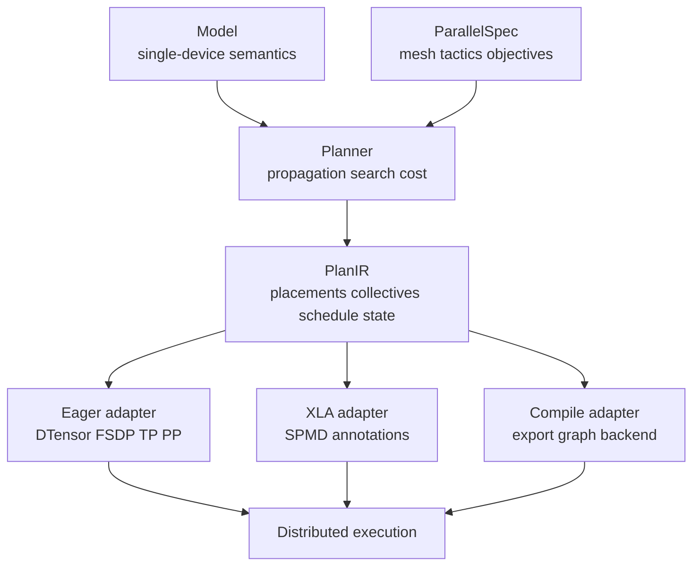

Diagram notation key: `PlanIR` maps to the planned intermediate representation; `DTensor` maps to PyTorch Distributed Tensor; `FSDP` maps to Fully Sharded Data Parallel; `TP` maps to tensor parallelism; `PP` maps to pipeline parallelism; `XLA` maps to Accelerated Linear Algebra compiler; `SPMD` maps to single program, multiple data.

#### 5.1.7 `ExecutionAdapter`

`ExecutionAdapter` lowers `PlanIR` into a concrete runtime path. Adapters should share the same semantic plan when possible, but they do not need to share identical implementation mechanisms.

Conceptual shape:

```python
ExecutionAdapter(
    kind: AdapterKind,
    supported_tactics: set[ActionKind],
    supported_placements: set[PlacementKind],
    graph_requirements: GraphRequirements,
    lowering: Callable[[PlanIR], ExecutablePlan],
    runtime_hooks: RuntimeHooks,
    checkpoint_hooks: CheckpointHooks,
    debug_hooks: DebugHooks,
)
```

Fields:

| Field | Meaning | Example |
|---|---|---|
| `kind` | Adapter family. | `eager_pytorch`, `xla_spmd`, `future_compile_backend`. |
| `supported_tactics` | Tactics the adapter can lower. | TP, FSDP, PP, compiler hints. |
| `supported_placements` | Placement states the adapter can represent directly. | DTensor `Shard`, XLA sharding annotations. |
| `graph_requirements` | Capture, static-shape, and operator requirements. | Exportable graph, supported ATen ops. |
| `lowering` | Transformation from `PlanIR` to executable plan. | Module wrapping, sharding annotation, graph rewrite. |
| `runtime_hooks` | Profiling, scheduling, and error-reporting hooks. | Stage timing and collective traces. |
| `checkpoint_hooks` | Save/load/reshard integration. | Distributed Checkpoint integration. |
| `debug_hooks` | Layout dumps, parity checks, and rank-local inspection. | Print DTensor placements. |

Invariants:

- The adapter must reject unsupported tactics rather than silently ignoring them.
- Adapter lowering must preserve `PlanIR` state names for checkpoint and optimizer state.
- Adapter-specific graph rewrites must be recorded as tactics or lowering effects.
- Runtime errors should be attributable to `PlanIR` objects where possible.

Responsibilities:

- Bridge paper-level placement and schedule decisions to actual PyTorch or compiler mechanisms.
- Report unsupported regions back to the planner for fallback or replanning.
- Keep backend-specific constraints out of the model definition.

### 5.2 Adapter Options And Lowering Paths

The same `PlanIR` can target different execution paths. The planner should distinguish the semantic plan from adapter-specific lowering.

| Adapter path | Best fit | Lowering mechanism | Strengths | Caveats |
|---|---|---|---|---|
| Eager DTensor/FSDP/TP/PP | PyTorch-native training, debuggability, dynamic modules. | Convert parameters/activations to DTensor, apply tensor parallel plans, wrap/shard modules, split pipeline stages. | Close to ordinary PyTorch; inspectable placements; composes with existing distributed primitives. | Coverage depends on DTensor ops, module patterns, FSDP/TP/PP compatibility, and runtime-specific scheduling. |
| PyTorch/XLA SPMD | Compiler-inserted collectives from sparse sharding annotations. | Attach XLA sharding annotations, let XLA/GSPMD-style partitioning propagate layouts and insert communication. | Strong compiler lineage; good match for global propagation and SPMD lowering. | XLA backend requirements; not identical to native eager CUDA execution; graph/capture constraints apply. |
| Future compile backend | Full-graph optimization over exported PyTorch programs. | Use `torch.export`/ATen graph plus placement metadata, lower through a compiler IR such as StableHLO, MLIR, or an implementation-specific backend. | Potential for joint placement, fusion, memory planning, and collective scheduling. | Conceptual in this paper; production maturity and API shape are not established. |

Eager adapter outline:

```python
class EagerPyTorchAdapter(ExecutionAdapter):
    def lower(self, plan: PlanIR) -> ExecutablePlan:
        mesh = init_device_mesh_from(plan.mesh)       # DeviceMesh-like
        model = materialize_or_load_model(plan.state_plan)

        for region in plan.pipeline_schedule.stages:
            assign_stage(region, mesh["pp"])

        for module_path, tp_tactics in plan.tactics.by_action("tensor_parallel"):
            parallelize_module(
                module_at(model, module_path),
                device_mesh=mesh["tp"],
                parallelize_plan=to_torch_tp_plan(tp_tactics),
            )

        for module_path in plan.tactics.targets("fully_shard_module"):
            fully_shard_like_fsdp2(module_at(model, module_path), mesh=mesh["dp"])

        return ExecutablePlan(model=model, mesh=mesh, schedule=plan.pipeline_schedule)
```

This snippet is illustrative. `fully_shard_like_fsdp2` is not a named production API in this blueprint; it represents the FSDP2-style module sharding path used in modern PyTorch-native large-model recipes [S21].

PyTorch/XLA SPMD adapter outline:

```python
class XlaSpmdAdapter(ExecutionAdapter):
    def lower(self, plan: PlanIR) -> ExecutablePlan:
        graph = export_if_needed(plan.graph)
        xla_mesh = make_xla_mesh(plan.mesh)

        for value, placement in plan.placements.items():
            mark_sharding(value, xla_mesh, to_xla_partition_spec(placement))

        # The backend propagates annotations and inserts collectives.
        return compile_with_xla_spmd(graph, mesh=xla_mesh)
```

Future compile adapter outline:

```python
class CompileBackendAdapter(ExecutionAdapter):
    def lower(self, plan: PlanIR) -> ExecutablePlan:
        exported = torch.export.export(plan.graph.module, plan.graph.example_inputs)
        annotated = attach_plan_metadata(exported, plan.placements, plan.collectives)
        optimized = backend_partition_and_schedule(annotated, objective=plan.cost_estimate)
        return backend_compile(optimized)
```

Evidence boundary: the eager path is a synthesis over public PyTorch primitives [S15, S16, S17, S20, S21]. The PyTorch/XLA path has public SPMD evidence [S24]. The future compile backend is a research projection that depends on graph capture, compiler IR support, and public backend capabilities.

### 5.3 How One Model Receives 1D, 2D, 3D, And Compiler Specs

The same semantic model should accept different `ParallelSpec` choices without changing the model class.

Logical model:

```python
class Transformer(torch.nn.Module):
    def __init__(self, vocab, n_layers, hidden, n_heads, ffn_hidden):
        super().__init__()
        self.tok_embeddings = torch.nn.Embedding(vocab, hidden)
        self.layers = torch.nn.ModuleList([
            TransformerBlock(hidden, n_heads, ffn_hidden)
            for _ in range(n_layers)
        ])
        self.norm = RMSNorm(hidden)
        self.output = torch.nn.Linear(hidden, vocab, bias=False)

    def forward(self, tokens):
        x = self.tok_embeddings(tokens)
        for block in self.layers:
            x = block(x)
        return self.output(self.norm(x))
```

For input tokens $T \in \mathbb{Z}^{B \times S}$, hidden activations have shape $X \in \mathbb{R}^{B \times S \times H}$, where $B$ is batch size, $S$ is sequence length, and $H$ is hidden width.

| Strategy | MeshSpec | Core placements | Typical adapter |
|---|---|---|---|
| 1D FSDP | `{"dp": N}` | Parameters, gradients, and optimizer state sharded over `dp`; activations local/replicated within each rank's mini-batch shard. | Eager FSDP2-style adapter. |
| 2D FSDP + TP | `{"dp": D, "tp": T}` | State sharded over `dp`; attention/MLP matrices sharded over `tp`; tensor-parallel partials reduced on `tp`. | Eager DTensor plus TP plus FSDP. |
| 3D FSDP + TP + PP | `{"dp": D, "tp": T, "pp": P}` | Layers partitioned over `pp`; each stage uses TP inside and FSDP over replicas. | Eager pipeline plus TP plus FSDP. |
| Compiler SPMD | `{"data": D, "model": T}` or backend-specific axes | Sparse sharding hints on batch, hidden, and weight dimensions; compiler propagates and inserts collectives. | PyTorch/XLA SPMD or future compile backend. |

The four specs can be expressed against the same `Model` object:

```python
model = Model(
    module=Transformer(vocab=128_000, n_layers=48, hidden=8192, n_heads=64, ffn_hidden=28672),
    example_inputs=(TensorSpec("tokens", shape=["B", "S"], dtype=torch.int64),),
    init_policy="meta_then_sharded_materialization",
)

spec_1d = ParallelSpec(
    mesh=MeshSpec(axes={"dp": 64}),
    tactics=[Tactic("all_blocks_fsdp", "layers.*", "fully_shard_module", ("dp",))],
    constraints=["peak_memory_per_rank <= 80GiB"],
    adapter_preferences=["eager_pytorch"],
)

spec_2d = ParallelSpec(
    mesh=MeshSpec(axes={"dp": 16, "tp": 4}),
    tactics=[
        Tactic("all_blocks_fsdp", "layers.*", "fully_shard_module", ("dp",)),
        Tactic("qkv_colwise", "layers.*.attn.qkv", "colwise_shard_linear", ("tp",)),
        Tactic("attn_out_rowwise", "layers.*.attn.out", "rowwise_shard_linear", ("tp",)),
        Tactic("mlp_up_colwise", "layers.*.mlp.w1", "colwise_shard_linear", ("tp",)),
        Tactic("mlp_down_rowwise", "layers.*.mlp.w2", "rowwise_shard_linear", ("tp",)),
    ],
    constraints=["hidden % mesh['tp'] == 0", "ffn_hidden % mesh['tp'] == 0"],
    adapter_preferences=["eager_pytorch"],
)

spec_3d = ParallelSpec(
    mesh=MeshSpec(axes={"dp": 8, "tp": 4, "pp": 4}),
    tactics=[
        Tactic("pipeline_layers", "layers", "pipeline_partition", ("pp",)),
        Tactic("stage_tp", "layers.*", "tensor_parallel_transformer_block", ("tp",)),
        Tactic("stage_fsdp", "layers.*", "fully_shard_module", ("dp",)),
        Tactic("activation_ckpt", "layers.*", "checkpoint_region", ()),
    ],
    constraints=[
        "n_layers % mesh['pp'] == 0 or use balanced partitioner",
        "microbatches >= mesh['pp']",
    ],
    adapter_preferences=["eager_pytorch"],
)

spec_compiler = ParallelSpec(
    mesh=MeshSpec(axes={"data": 8, "model": 8}),
    tactics=[
        Tactic("batch_shard", "inputs.tokens", "compiler_sharding_hint", ("data",)),
        Tactic("hidden_shard", "layers.*.{attn,mlp}.*", "compiler_sharding_hint", ("model",)),
    ],
    objectives=["delegate_propagation_and_collectives_to_backend"],
    adapter_preferences=["xla_spmd", "future_compile_backend"],
)
```

Conceptual planning function:

```python
def plan(model: Model, spec: ParallelSpec) -> PlanIR:
    graph = inspect_or_export(model, adapter_preferences=spec.adapter_preferences)
    candidates = generate_tactics(graph, spec.mesh, spec.tactics)
    placements = propagate_placements(graph, candidates)
    collectives = derive_collectives(placements)
    schedule = derive_pipeline_schedule(graph, candidates, spec.mesh)
    cost = estimate_cost(graph, placements, collectives, schedule, spec.mesh)
    selected = search(candidates, cost, constraints=spec.constraints)
    return PlanIR(
        graph=graph,
        mesh=spec.mesh,
        placements=selected.placements,
        tactics=selected.tactics,
        collectives=selected.collectives,
        pipeline_schedule=selected.schedule,
        state_plan=derive_state_plan(model, selected),
        cost_estimate=selected.cost,
        lowering_contracts=derive_lowering_contracts(selected, spec.adapter_preferences),
    )
```

Caveat: this is a conceptual planner skeleton. It names responsibilities that public systems implement in pieces: propagation and lowering in DTensor or XLA SPMD, module-level tensor parallelism in PyTorch TP, pipeline scheduling in PyTorch pipeline APIs, and end-to-end training recipes in TorchTitan [S15, S17, S20, S21, S24].

### 5.4 Worked Mapping: Dense Transformer Block

Consider a pre-norm dense transformer block:

$$
\begin{aligned}
U &= \operatorname{Norm}_1(X), \\
Q,K,V &= U W_{qkv}, \\
A &= \operatorname{Attention}(Q,K,V), \\
X' &= X + A W_o, \\
Z &= \operatorname{Norm}_2(X'), \\
M &= \phi(Z W_1) W_2, \\
Y &= X' + M.
\end{aligned}
$$

Symbols: $X \in \mathbb{R}^{B \times S \times H}$ is the input activation; $U$ and $Z$ are normalized activations; $Q$, $K$, and $V$ are attention projections; $A$ is attention output; $X'$ is the post-attention residual; $M$ is the MLP output; $Y$ is the block output; $W_{qkv} \in \mathbb{R}^{H \times 3H}$, $W_o \in \mathbb{R}^{H \times H}$, $W_1 \in \mathbb{R}^{H \times F}$, and $W_2 \in \mathbb{R}^{F \times H}$ are weights; $F$ is feed-forward width; $\phi$ is the activation function.

#### 5.4.1 Tensor-Parallel Placement

For a tensor axis `tp` of size $T$, a common Megatron-style mapping is:

| Region | Weight placement over `tp` | Activation placement over `tp` | Communication |
|---|---|---|---|
| Norm | Parameters replicated; input may be sequence-parallel or replicated. | `Replicate` or `Shard(sequence_dim)`. | Optional all-gather or reduce-scatter around sequence parallel regions. |
| QKV projection | $W_{qkv}$ sharded along output features: `Shard(1)`. | Output heads/features sharded. | No immediate all-reduce if downstream attention consumes sharded heads. |
| Attention | Heads partitioned across `tp` when `n_heads % T == 0`. | Per-rank subset of heads. | Usually local over heads; sequence/context sharding adds more communication. |
| Output projection | $W_o$ sharded along input features: `Shard(0)`. | Produces `Partial` hidden output. | All-reduce or reduce-scatter over `tp`. |
| MLP up/gate | $W_1$ sharded along output features: `Shard(1)`. | Intermediate $F/T$ features per rank. | Local activation. |
| MLP down | $W_2$ sharded along input features: `Shard(0)`. | Produces `Partial` hidden output. | All-reduce or reduce-scatter over `tp`. |

Conceptual placement snippets:

```python
PlacementSpec("X", shape=[B, S, H], placements={"dp": Shard(0), "tp": Replicate()})

PlacementSpec("W_qkv", shape=[H, 3 * H], placements={"dp": Shard(0), "tp": Shard(1)})
PlacementSpec("QKV", shape=[B, S, 3 * H], placements={"dp": Shard(0), "tp": Shard(2)})

PlacementSpec("W_o", shape=[H, H], placements={"dp": Shard(0), "tp": Shard(0)})
PlacementSpec("attn_out_partial", shape=[B, S, H], placements={"dp": Shard(0), "tp": Partial("sum")})
PlacementSpec("attn_out", shape=[B, S, H], placements={"dp": Shard(0), "tp": Replicate()})

PlacementSpec("W_1", shape=[H, F], placements={"dp": Shard(0), "tp": Shard(1)})
PlacementSpec("W_2", shape=[F, H], placements={"dp": Shard(0), "tp": Shard(0)})
```

The two important partial reductions are:

$$
X' = X + \operatorname{allreduce}_{\mathrm{tp}}\left(A W_o\right),
$$

and:

$$
Y = X' + \operatorname{allreduce}_{\mathrm{tp}}\left(\phi(Z W_1) W_2\right).
$$

Symbols: $\operatorname{allreduce}_{\mathrm{tp}}$ is an all-reduce over the tensor-parallel group; all other symbols are as defined above. A reduce-scatter variant can keep outputs sharded if the next region accepts sharded activations.

#### 5.4.2 Dense Block `PlanIR` Fragment

```python
PlanIR(
    graph="TransformerBlock[17]",
    mesh=MeshSpec(axes={"dp": 16, "tp": 4}),
    tactics=[
        Tactic("qkv_colwise", "attn.qkv", "colwise_shard_linear", ("tp",)),
        Tactic("out_rowwise", "attn.out", "rowwise_shard_linear", ("tp",)),
        Tactic("mlp_w1_colwise", "mlp.w1", "colwise_shard_linear", ("tp",)),
        Tactic("mlp_w2_rowwise", "mlp.w2", "rowwise_shard_linear", ("tp",)),
        Tactic("block_fsdp", ".", "fully_shard_module", ("dp",)),
    ],
    collectives=[
        CollectiveOp("attn_out_reduce", kind="all_reduce", axis="tp", tensor="attn_out_partial"),
        CollectiveOp("mlp_out_reduce", kind="all_reduce", axis="tp", tensor="mlp_out_partial"),
        CollectiveOp("param_gather", kind="all_gather", axis="dp", region="block_forward"),
        CollectiveOp("grad_reduce_scatter", kind="reduce_scatter", axis="dp", region="block_backward"),
    ],
)
```

The fragment is intentionally descriptive rather than executable. It says which effects must exist; the adapter decides whether they appear as DTensor redistributions, FSDP collectives, explicit distributed calls, or compiler-inserted communication.

#### 5.4.3 Legality Checks

| Check | Reason |
|---|---|
| `H % tp == 0` | Hidden projections must divide across tensor-parallel ranks. |
| `F % tp == 0` | MLP intermediate features must divide for colwise up projection. |
| `n_heads % tp == 0` | Head-parallel attention requires a whole number of heads per rank. |
| Norm placement compatible with activation placement | Normalization over hidden dimension may require local full hidden state or specialized sequence-parallel rule. |
| Residual operands have compatible placement | `X` and reduced projection outputs must be addable without implicit semantic error. |
| FSDP and TP wrapping order is adapter-defined | Parameters should not be double-sharded in contradictory ways. |

Implementation links: PyTorch tensor parallel plans for colwise/rowwise/sequence parallelism [S17], DTensor placement and redistribution [S15], and TorchTitan examples of composing PyTorch-native parallel dimensions [S21].

### 5.5 Worked Mapping: Hybrid FSDP + TP + PP Training Step

A hybrid training step combines data/state sharding, tensor parallel operator sharding, and pipeline scheduling. Let the mesh be:

$$
\mathcal{M}
=
\mathcal{D}_{\mathrm{dp}}
\times
\mathcal{D}_{\mathrm{tp}}
\times
\mathcal{D}_{\mathrm{pp}},
\qquad
r = (r_{\mathrm{dp}}, r_{\mathrm{tp}}, r_{\mathrm{pp}}).
$$

Symbols: $\mathcal{D}_{\mathrm{dp}}$ is the FSDP/data axis; $\mathcal{D}_{\mathrm{tp}}$ is the tensor-parallel axis; $\mathcal{D}_{\mathrm{pp}}$ is the pipeline axis; $r$ is a rank coordinate.

Suppose a transformer has $L$ layers and $P = |\mathcal{D}_{\mathrm{pp}}|$ pipeline stages. A simple balanced partition assigns:

$$
\operatorname{stage}(\ell)
=
\left\lfloor \frac{\ell P}{L} \right\rfloor.
$$

Symbols: $\ell$ is a layer index in $0,\ldots,L-1$; $L$ is the number of layers; $P$ is the number of pipeline stages; $\operatorname{stage}(\ell)$ is the pipeline stage assigned to layer $\ell$. Production systems usually use measured compute and memory rather than only layer count.

#### 5.5.1 Per-Step Timeline

For microbatch $m$, stage $p$, and tensor-parallel group `tp`, the step has the following conceptual events:

| Phase | Event | Axis | Communication |
|---|---|---|---|
| Load/materialize | Stage-local parameters are made available for compute. | `dp` | FSDP-style all-gather for current region. |
| Forward TP | QKV/MLP shards compute local projections. | `tp` | Rowwise outputs all-reduce or reduce-scatter. |
| Forward PP | Stage sends activation to next stage. | `pp` | Send/recv between adjacent stages. |
| Loss | Final stage computes loss for microbatch. | local or `dp` | Optional data-parallel loss reduction for logging. |
| Backward PP | Stage receives activation gradient from next stage. | `pp` | Send/recv reverse edge. |
| Backward TP | Tensor-parallel gradients are accumulated/reduced. | `tp` | All-reduce, reduce-scatter, or DTensor redistribution. |
| Backward FSDP | Parameter gradients are sharded. | `dp` | Reduce-scatter over FSDP group. |
| Optimizer | Optimizer updates local state shards. | `dp` | Usually local to state shard; checkpoint may reshard. |

Pipeline schedule diagram:

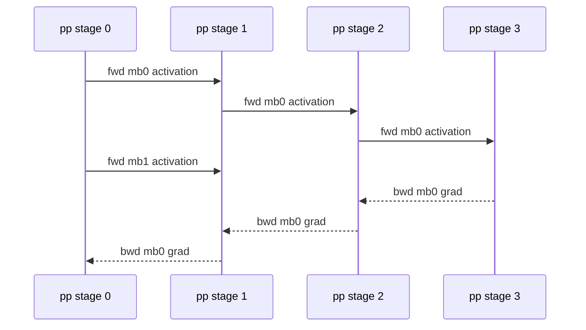

Diagram notation key: `pp stage k` maps to pipeline stage $k$; `mb0` and `mb1` are microbatches; `fwd activation` is the tensor sent in the forward pass; `bwd grad` is the gradient sent in the backward pass.

#### 5.5.2 Hybrid Training-Step Snippet

```python
def conceptual_train_step(executable: ExecutablePlan, batch):
    # The schedule controls microbatch order. The model code remains the
    # logical Transformer; rank-local behavior comes from the adapter.
    for event in executable.schedule.events:
        if event.kind == "fsdp_all_gather":
            event.region.materialize_params(axis="dp")

        elif event.kind == "forward_compute":
            with placement_context(event.region.placements):
                event.outputs = event.region.forward(event.microbatch)

        elif event.kind == "tp_redistribute":
            event.tensor = redistribute(event.tensor, event.src, event.dst, axis="tp")

        elif event.kind == "pp_send":
            send(event.tensor, dst=event.next_stage_rank)

        elif event.kind == "pp_recv":
            event.tensor = recv(src=event.prev_stage_rank)

        elif event.kind == "backward_compute":
            event.region.backward(event.grad)

        elif event.kind == "fsdp_reduce_scatter":
            event.region.shard_gradients(axis="dp")

    executable.optimizer.step_local_shards()
```

This code is not meant to run. It names the responsibilities that must be distributed across FSDP, TP, PP, autograd, and the runtime scheduler.

#### 5.5.3 Memory And Communication Accounting

For a parameter tensor with $N_\theta$ elements and element size $b$ bytes, FSDP-style state sharding across $D = |\mathcal{D}_{\mathrm{dp}}|$ gives a first-order per-rank parameter storage:

$$
M_{\mathrm{param,stored}}
\approx
\frac{N_\theta b}{D}.
$$

During a compute region that materializes full parameters within the FSDP unit, temporary parameter memory can rise toward:

$$
M_{\mathrm{param,compute}}
\approx
N_\theta b_{\mathrm{compute}},
$$

for that unit, before being released or resharded.

Symbols: $M_{\mathrm{param,stored}}$ is persistent parameter storage per rank; $M_{\mathrm{param,compute}}$ is temporary compute-region parameter memory; $N_\theta$ is the parameter element count for the unit; $b$ is storage bytes per element; $b_{\mathrm{compute}}$ is compute dtype bytes per element; $D$ is FSDP/data parallel degree. Optimizer state often multiplies persistent storage by an optimizer-specific factor.

For tensor-parallel rowwise outputs over $T = |\mathcal{D}_{\mathrm{tp}}|$, an all-reduce on an activation of $N_X$ elements has approximate per-rank volume:

$$
V_{\mathrm{tp\_ar}}
\approx
2 N_X b \cdot \frac{T-1}{T}.
$$

Symbols: $V_{\mathrm{tp\_ar}}$ is approximate tensor-parallel all-reduce traffic per rank; $N_X$ is activation element count; $b$ is bytes per element; $T$ is tensor-parallel degree. Kernel fusion, reduce-scatter alternatives, and overlap can change exposed cost.

#### 5.5.4 Adapter Caveats

- FSDP and tensor parallelism both transform parameters; the adapter must define ordering and ownership. A common conceptual ordering is: construct module, apply tensor-parallel layout inside a stage, then apply FSDP-style sharding to stage-local modules.
- Pipeline scheduling changes activation lifetimes. Cost estimates must include microbatch count, recomputation, and stage imbalance rather than only per-layer memory.
- Checkpoint state should be described in logical names and placements, not raw rank-local filenames. PyTorch Distributed Checkpoint is the relevant public substrate for sharded state and resharding [S18].
- Pipeline send/recv boundaries must preserve dtype, shape, and placement. A boundary activation may need redistribution before being sent if the next stage expects a different tensor-parallel layout.

Implementation links: PyTorch `DeviceMesh` [S16], tensor parallelism [S17], distributed pipeline APIs [S20], Distributed Checkpoint [S18], and TorchTitan's native PyTorch training recipes [S21].

### 5.6 Worked Mapping: MoE And Long-Context Extensions

Dense transformer blocks are the easier case. Mixture-of-Experts (MoE) and long-context attention force the planner to reason about dynamic token movement, load imbalance, and sequence-scale communication.

#### 5.6.1 MoE Mapping

For top-$k$ routing:

$$
E_t = \operatorname{TopK}(x_t W_r, k),
\qquad
y_t = \sum_{e \in E_t} \alpha_{t,e} f_e(x_t).
$$

Symbols: $x_t \in \mathbb{R}^{H}$ is token $t$; $W_r \in \mathbb{R}^{H \times E}$ is the router weight for $E$ experts; $E_t$ is the selected expert set; $k$ is the number of selected experts; $\alpha_{t,e}$ is the routing weight for token $t$ and expert $e$; $f_e$ is expert $e$; $y_t$ is the expert-combined token output.

Add an expert-parallel axis:

```python
MeshSpec(
    axes={"dp": 8, "tp": 2, "ep": 8},
    axis_roles={
        "dp": "state_and_data_sharding",
        "tp": "expert_internal_tensor_parallelism",
        "ep": "expert_placement_and_token_dispatch",
    },
)
```

MoE placement:

| Object | Placement | Notes |
|---|---|---|
| Dense attention and norms | `dp` plus optional `tp`. | Same as dense block. |
| Router weight $W_r$ | Replicated or sharded over `dp`; usually not over `ep` unless router is large. | Router must produce scores for all or routed subset of experts. |
| Expert weights | Expert id partitioned over `ep`; each expert MLP may also use `tp`. | `num_experts % ep == 0` or use uneven expert assignment metadata. |
| Tokens before dispatch | Sharded by batch/sequence over `dp` or `cp`. | Routing creates dynamic groups. |
| Dispatched token buffer | Grouped by destination expert over `ep`. | Requires all-to-all or equivalent exchange. |
| Expert outputs | Routed back to original token owners. | Requires inverse all-to-all and combine. |

Conceptual MoE `PlanIR` fragment:

```python
PlanIR(
    mesh=MeshSpec(axes={"dp": 8, "tp": 2, "ep": 8}),
    tactics=[
        Tactic("router_replicated", "layers.*.moe.router", "replicate", ("ep",)),
        Tactic("experts_on_ep", "layers.*.moe.experts", "expert_parallel", ("ep",)),
        Tactic("expert_mlp_tp", "layers.*.moe.experts.*.mlp", "tensor_parallel", ("tp",)),
        Tactic("moe_dispatch", "layers.*.moe", "token_all_to_all", ("ep",)),
    ],
    collectives=[
        CollectiveOp("dispatch_tokens", kind="all_to_all", axis="ep", tensor="routed_tokens"),
        CollectiveOp("combine_tokens", kind="all_to_all", axis="ep", tensor="expert_outputs"),
    ],
)
```

Planner obligations:

- Track token identity so inverse dispatch restores the original order.
- Estimate expert capacity and padding:

$$
C_e
=
\left\lceil
\frac{\gamma k B S}{E}
\right\rceil,
$$

where $C_e$ is nominal per-expert capacity, $\gamma$ is capacity factor, $k$ is top-$k$, $B$ is batch size, $S$ is sequence length, and $E$ is number of experts.

- Model imbalance: actual tokens per expert may exceed or fall below $C_e$.
- Decide whether dropped, padded, or overflow tokens are allowed by the model semantics.
- Preserve auxiliary load-balancing losses in the logical training objective.

Evidence boundary: dense transformer TP/FSDP/PP composition has stronger public PyTorch evidence than general automatic MoE planning. Expert routing often needs custom kernels or runtime-specific libraries. In this blueprint, `expert_parallel` and `token_all_to_all` are conceptual tactics, not stable PyTorch public APIs.

#### 5.6.2 Long-Context Mapping

Long-context training stresses attention memory. A planner may introduce a context-parallel axis `cp` that shards sequence positions:

```python
MeshSpec(
    axes={"dp": 4, "tp": 4, "cp": 4},
    axis_roles={
        "dp": "state_and_data_sharding",
        "tp": "hidden_and_head_parallelism",
        "cp": "sequence_context_parallelism",
    },
)
```

For $X \in \mathbb{R}^{B \times S \times H}$, a context placement can be:

```python
PlacementSpec(
    target="layers.*.attn.input",
    logical_shape=[B, S, H],
    placements={"dp": Shard(0), "cp": Shard(1), "tp": Replicate()},
)
```

Attention requires each query position to see the key/value positions allowed by the mask. If sequence is sharded over `cp`, the planner must choose one of several communication patterns:

| Pattern | Description | Communication |
|---|---|---|
| All-gather K/V | Materialize full keys and values on each context rank. | Simple but expensive for very long $S$. |
| Ring attention | Rotate K/V blocks among context ranks and accumulate partial attention. | Peer-to-peer or collective schedule over `cp`. |
| Block-sparse/windowed attention | Communicate only needed blocks. | Depends on mask and sparsity pattern. |
| Reduce-scatter outputs | Keep context-sharded outputs after attention. | Avoids full sequence materialization if next layer accepts `Shard(sequence)`. |

For full attention with context degree $C = |\mathcal{D}_{\mathrm{cp}}|$, a naive all-gather of K/V with $N_{kv}$ elements has approximate per-rank volume:

$$
V_{\mathrm{kv\_gather}}
\approx
N_{kv} b \cdot \frac{C-1}{C}.
$$

Symbols: $V_{\mathrm{kv\_gather}}$ is approximate per-rank communication volume for gathering keys and values; $N_{kv}$ is the logical K/V element count; $b$ is bytes per element; $C$ is context-parallel degree.

Long-context `PlanIR` fragment:

```python
PlanIR(
    mesh=MeshSpec(axes={"dp": 4, "tp": 4, "cp": 4}),
    tactics=[
        Tactic("sequence_shard_inputs", "layers.*.attn.input", "shard_sequence", ("cp",)),
        Tactic("head_tp", "layers.*.attn.qkv", "colwise_shard_linear", ("tp",)),
        Tactic("ring_kv_exchange", "layers.*.attn", "context_parallel_attention", ("cp",)),
        Tactic("keep_sequence_sharded", "layers.*.attn.output", "preserve_placement", ("cp",)),
    ],
    constraints=[
        "attention_mask compatible with context_parallel_attention",
        "downstream norms support sequence-sharded activations",
    ],
)
```

Caveats:

- Softmax over a sharded sequence dimension is not equivalent to independent local softmax unless the attention mask restricts each query to local keys. Full attention requires distributed max/sum or an algorithm such as ring/block attention.
- Positional encodings, rotary embeddings, and KV cache positions need global offsets, not local sequence indices alone.
- Variable sequence lengths and packed examples complicate capacity and communication estimates.
- Public PyTorch provides primitives for distributed tensors and collectives, but a fully automatic long-context planner is a research system layer.

Implementation links: DTensor placements and redistribution [S15], DeviceMesh [S16], PyTorch tensor parallel sequence-related APIs where applicable [S17], and compiler-side SPMD systems such as GSPMD/Shardy as design evidence [S4, S5, S24].

### 5.7 Caveats, Validation, And Implementation Links

This blueprint is useful only if it remains honest about the boundary between public substrate and proposed planner.

#### 5.7.1 Caveats

| Caveat | Consequence |
|---|---|
| These interfaces are conceptual. | Do not cite `Model`, `ParallelSpec`, or `PlanIR` as production PyTorch APIs. |
| Eager and compiler paths differ. | A plan that is natural for DTensor/FSDP may not be natural for XLA SPMD, and vice versa. |
| Operator coverage is incomplete. | Custom kernels, Python control flow, and unsupported DTensor ops may require manual tactics or fallback regions. |
| Cost models are estimates. | Kernel choice, overlap, topology, launch overhead, and runtime scheduling can dominate symbolic formulas. |
| Pipeline scheduling is part of semantics-adjacent execution. | Incorrect microbatch ordering or gradient accumulation changes training behavior. |
| State is more than parameters. | Optimizer slots, RNG, dataloader position, scheduler state, and tied weights need explicit state plans. |
| Numerical equivalence is tolerance-based. | Different collective orderings, precision choices, and fused kernels can change floating-point results. |

#### 5.7.2 Validation Checklist

Before an adapter runs a nontrivial `PlanIR`, it should produce:

- A placement table for parameters, activations at boundaries, gradients, and optimizer state.
- A collective table with source placement, destination placement, axis, tensor shape, and estimated volume.
- A pipeline schedule table with microbatch count, stage assignment, and expected activation lifetimes.
- A state plan showing how checkpoints are saved and loaded under the chosen mesh.
- A legality report for divisibility, operator support, adapter support, aliasing, and dynamic-shape assumptions.
- A small parity run when feasible:

$$
\Delta_{\mathrm{loss}}
=
\left\lvert
\mathcal{L}_{\mathrm{dist}}
-
\mathcal{L}_{\mathrm{ref}}
\right\rvert,
\qquad
\Delta_{\mathrm{grad}}
=
\frac{\lVert g_{\mathrm{dist}} - g_{\mathrm{ref}} \rVert_2}
{\lVert g_{\mathrm{ref}} \rVert_2 + \epsilon}.
$$

Symbols: $\Delta_{\mathrm{loss}}$ is absolute loss difference; $\mathcal{L}_{\mathrm{dist}}$ is distributed loss; $\mathcal{L}_{\mathrm{ref}}$ is reference loss; $\Delta_{\mathrm{grad}}$ is relative gradient difference; $g_{\mathrm{dist}}$ and $g_{\mathrm{ref}}$ are distributed and reference gradients; $\epsilon$ prevents division by zero.

#### 5.7.3 Implementation Links

The following public sources are the implementation anchors for this conceptual section:

| Conceptual piece | Public implementation anchor | Evidence label |
|---|---|---|
| Logical mesh | PyTorch `DeviceMesh` [S16] | `official docs` |
| Tensor placement | PyTorch DTensor `Shard`, `Replicate`, `Partial`, and redistribution [S15] | `official docs` |
| Module-level tensor parallelism | PyTorch tensor parallel APIs such as colwise, rowwise, sequence parallel, and layout preparation [S17] | `official docs` |
| Fully sharded training composition | TorchTitan and PyTorch-native FSDP2-style recipes [S21] | `official repo` |
| Pipeline splitting and scheduling | PyTorch distributed pipeline APIs [S20] | `official docs` |
| Sharded checkpointing and resharding | PyTorch Distributed Checkpoint [S18] | `official docs` |
| Graph capture for compiler paths | `torch.export` [S19] | `official docs` |
| Compiler SPMD path | PyTorch/XLA SPMD and GSPMD lineage [S4, S24] | `paper` + `official docs/blog` |
| Axis-based compiler sharding design | OpenXLA Shardy [S5] | `official docs/repo` |
| End-to-end PyTorch-native composition example | TorchTitan [S21] | `official repo` + `paper` |

Evidence boundary: this table maps concepts to public building blocks. It does not imply that the full automatic planner, every tactic, or every worked mapping is available as a stable end-user PyTorch API.

## 6. Evidence Matrix

This matrix should support decisions, not merely name systems. The useful distinction is whether a source contributes a planner abstraction, a lowering mechanism, a runtime primitive, or operational evidence that a plan can be made reliable on real models. Evidence grades remain conservative: `paper` means the claim is supported by a publication; `official docs/repo` means the public project documents the behavior; `inferred` means the paper's blueprint projects from the cited primitive rather than reporting an implemented end-to-end system.

| Primitive or source family | Source | Platform | Automation level | Planner, IR, or state model | Search or selection method | PyTorch relevance | Evidence grade | Caveat |
|---|---|---|---|---|---|---|---|---|
| Incremental SPMD tactics | [PartIR][S1] | Framework/runtime agnostic research compiler | Manual tactics plus automatic composition | Partitioning IR, tactic library, simulator | Tactic composition with explicit strategy objects | Strong template for `ParallelSpec`, `PlanIR`, and explainable transformations | `paper` | Public implementation evidence is mostly paper-level; not a PyTorch runtime. |
| Automatic tactic discovery | [PartIR auto search][S2] | PartIR/XLA-style setting | Automatic partitioner over tactic space | Compiler analyses over partitioning strategies | Monte Carlo tree search | Useful design precedent for bounded search over PyTorch placement tactics | `paper` | Demonstrates search method, not a PyTorch-native planner. |
| Ergonomic automated parallelism | [Automap][S3] | Compiler-integrated research prototype | Automatic prototype with user workflow focus | Platform-independent partitioning IR | Inductive tactics plus search | Supports the paper's argument that automation must be usable by model authors | `paper` | Research prototype; limited public production evidence. |
| Compiler SPMD partitioning | [GSPMD][S4] | XLA, TPU, and XLA backends | Sparse user hints plus compiler inference | HLO (High Level Optimizer) sharding annotations and SPMD partitioner | Sharding propagation and compiler lowering | Design reference and PyTorch/XLA path for compiler-inserted collectives | `paper` | Native eager PyTorch has different graph capture, dispatch, and debugging constraints. |
| Axis-based sharding representation | [Shardy][S5] | OpenXLA/MLIR (Multi-Level Intermediate Representation) | Constraint and propagation system | MLIR sharding representation with priorities and axes | Constraint propagation, priority resolution, manual regions | Design reference for debuggable placement constraints and manual escape hatches | `official docs/repo` | Public docs describe active infrastructure; Python-facing workflows and maturity are evolving. |
| Eager-mode SPMD tensor programming | [veScale][S6], [veScale repo][S7] | PyTorch | Semi-automatic today, automatic-planning direction | DTensor-centered state, schedules, and distributed checkpointing | Planner features documented as developing | Closest public PyTorch-native statement of the paper's separation thesis | `paper` + `official docs/repo` | Treat auto-plan and compile-mode claims conservatively where docs mark them under development. |
| Hierarchical inter/intra-operator planning | [Alpa][S8] | JAX, XLA, Ray | Automatic | Two-level plan over inter-operator stages and intra-operator sharding | Hierarchical optimization passes with profiling/cost modeling | Strong precedent for separating pipeline-level and operator-level planning | `paper` + `official repo` | Repo is archived; ideas are more durable than the codebase state. |
| Joint rewrite and parallelism search | [Unity][S9] | FlexFlow-based research system | Automatic | Parallel computation graph | Hierarchical graph-substitution search | Motivates pairing `torch.export`/FX rewrites with placement planning | `paper` | Not native PyTorch; rewrite legality must be revalidated for PyTorch semantics. |
| SOAP search lineage | [FlexFlow][S10], [FlexFlow SOAP][S25] | FlexFlow | Automatic | Operator graph plus simulator | Markov chain Monte Carlo over sample, operator, attribute, and parameter parallelism | Search-space lineage for tensor, data, and pipeline combinations | `paper` + `official repo` | Separate framework and runtime; PyTorch relevance is conceptual. |
| Distributed IR simulation | [DistIR][S11] | Framework-agnostic research IR | Search support and simulation | Distributed intermediate representation | Strategy enumeration/simulation | Useful model for validating `PlanIR` before committing to a runtime | `paper` | Preliminary research scope; not a maintained PyTorch backend. |
| Transformer hybrid search | [Galvatron][S12] | PyTorch with Megatron/DeepSpeed lineage | Automatic for transformer training plans | Model-specific planner and profiler-backed cost model | Decision tree plus dynamic programming | Practical precedent for PyTorch-adjacent automatic TP/PP/DP/checkpoint choice | `paper` + `official docs/repo` | Less general than graph-wide SPMD; strongest for transformer-like models. |
| Schedule language over PyTorch modules | [Slapo][S13] | PyTorch | Semi-automatic, user-guided | PyTorch module schedule and optimization primitives | Progressive schedule construction | Shows how to decouple model code from execution schedule without requiring a full compiler | `paper` + `official docs` | Not a full automatic planner by itself. |
| PyTorch/XLA SPMD bridge | [PyTorch/XLA SPMD][S14], [S24] | PyTorch front end, XLA backend | User annotations plus XLA partitioner | XLA sharded tensor/mark-sharding path | XLA SPMD propagation and lowering | Concrete PyTorch route to GSPMD-style compiler partitioning | `official docs/blog` | Backend-specific; eager PyTorch primitives do not get identical compiler behavior. |
| Native PyTorch sharded tensor substrate | [DTensor][S15] | PyTorch | Primitive substrate, not an automatic planner | `DeviceMesh` plus `Shard`, `Replicate`, `Partial` placements | Operator dispatch, layout propagation, explicit redistribution | Core execution substrate for PyTorch-native plans | `official docs` | Alpha/under-development status and operator coverage require compatibility checks. |
| Mesh and process-group abstraction | [DeviceMesh][S16] | PyTorch | Primitive substrate | N-dimensional mesh with named dimensions and communicators | User or planner maps ranks to axes | Required control plane for DP/TP/PP/CP/EP composition | `official docs` | Does not by itself solve topology-aware rank placement. |
| Tensor parallel module adapter | [PyTorch TP][S17] | PyTorch | User-specified plan | `parallelize_module` with `ParallelStyle` plans | Manual or external-planner selected styles | Practical adapter target for automatic PyTorch plans over common modules | `official docs` | Experimental API; plan coverage is module-dependent. |
| Checkpoint/state resharding | [DCP][S18] | PyTorch | Primitive substrate | Sharded state dict metadata and load-time resharding | User/runtime selected save-load policy | Critical for changing mesh shape, strategy, or recovery plan | `official docs` | Correctness depends on full optimizer, RNG, and data-loader state capture, not only parameter shards. |
| Graph capture boundary | [`torch.export`][S19] | PyTorch | Capture primitive, not a planner | Exported ATen graph with guards and constraints | External analyses can consume graph | Gives planners a more stable graph than arbitrary Python eager execution | `official docs` | Dynamic Python, data-dependent control flow, and unsupported ops remain boundaries. |
| Pipeline runtime substrate | [PyTorch pipeline][S20] | PyTorch | Manual or external-planner selected stages | Pipeline stages, microbatches, send/recv schedules | User/runtime schedules | Execution target for generated pipeline plans | `official docs` | Planner still needs partitioning, shape, and schedule decisions. |
| PyTorch-native compositional training stack | [TorchTitan][S21] | PyTorch | Configurable composition rather than general automatic planning | Native FSDP2, TP, PP, checkpointing, logging | Recipe/config driven | Demonstrates operational composition and debugging with public code | `official repo` + `paper` | Not a general-purpose automatic model-parallel planner. |
| User-controlled SPMD local code | [JAX shard_map][S22] | JAX | Manual/local SPMD blocks | Explicit per-device code region | User-specified local computation | Reference for PyTorch manual/local escape hatches in a larger planner | `official docs` | Semantics differ from PyTorch; useful as a design comparison. |
| Named mesh and sharding API | [JAX sharding][S23] | JAX | User annotations plus compiler/runtime propagation | `Mesh`, `PartitionSpec`, `NamedSharding` | User/compiler selected placements | Clarifies how named axes make strategy readable and portable | `official docs` | Direct syntax is not PyTorch; concepts map through `DeviceMesh` and placement objects. |
| Early automatic graph partitioning | [Tofu][S26] | MXNet/TensorFlow-like dataflow graph | Automatic | Fine-grained operator graph and operator semantics language | Recursive search minimizing communication cost | Historical source for operator semantics and graph partitioning in automatic model parallelism | `paper` | Pre-transformer and not PyTorch-native; still useful for graph-partitioning lineage. |
| General DNN parallel strategy search | [PaSE][S27] | DNN computation graph research setting | Automatic | Computation graph with per-layer/operation strategy choices | Dynamic programming / efficient search | Adds source coverage beyond transformer-specific planners | `paper` | Public evidence should be checked for venue/version before making strong claims. |
| Mesh language lineage | [Mesh-TensorFlow][S28] | TensorFlow/XLA/TPU | User-specified mesh/tensor-dimension layout, compiler lowering | Mesh dimensions and tensor-dimension annotations | User selects layout, compiler lowers to SPMD | Important predecessor for named mesh APIs, DTensor-style placements, and GSPMD | `paper` + `official repo` | Mostly manual annotation rather than automatic search. |
| Conditional computation with automatic sharding | [GShard][S29] | TensorFlow/XLA/TPU | Lightweight annotations plus automatic XLA sharding | Annotation API, XLA SPMD partitioning, MoE routing constraints | Compiler propagation and lowering | Source family for MoE/expert parallelism, sharding annotations, and sparse routing caveats | `paper` | TPU/XLA system; PyTorch MoE automation requires separate runtime and all-to-all handling. |
| Pipeline microbatching baseline | [GPipe][S30] | TensorFlow/TPU lineage | Mostly user partitioned, library-assisted | Sequential layer partition and microbatch pipeline schedule | Batch splitting and pipeline schedule | Baseline for PyTorch pipeline planners and activation-memory trade-offs | `paper` | Handles sequence-like networks best; not a graph-wide automatic planner. |
| Automatic pipeline partitioning and scheduling | [PipeDream][S31] | PyTorch/Caffe-era distributed training research | Automatic pipeline layer partitioning | Layer graph with stage placement and weight versioning | Dynamic programming / planner for balanced stages | Important for pipeline placement, schedule, and stale-weight correctness discussions | `paper` + `official repo/blog` | Uses weight versioning and asynchronous semantics that may not match synchronous PyTorch training goals. |
| Topology-aware synchronous pipeline planning | [DAPPLE][S32] | GPU clusters | Automatic hybrid DP/PP planner | Layer partition, stage replication, placement, schedule | Planner over partition, replication, placement, and topology | Strengthens topology and synchronous pipeline evidence | `paper` | Pipeline-focused, not full tensor/operator SPMD; public code maturity should be verified. |
| Composite transformer parallelism at scale | [Megatron-LM][S33] | PyTorch/NVIDIA GPU clusters | Expert-designed/manual configuration | Tensor, pipeline, sequence, and data parallel recipes | Human-selected strategies with measured trade-offs | Operational baseline and cost-model calibration source for transformer plans | `paper` + `official repo` | Not automatic; use as empirical baseline, not as automation evidence. |
| PyTorch static-graph auto-parallel effort | [Colossal-Auto][S34] | PyTorch/Colossal-AI | Automatic prototype/documented feature | FX-derived graph, meta tensor information, device mesh, shape-consistency system | Search under memory/runtime objectives | Relevant PyTorch-native auto-parallel source family outside core PyTorch | `official docs` | Verify current maintenance and supported model/operator coverage before relying on it. |
| Model-specific transformer sharding adapter | [Colossal-AI Shardformer][S35] | PyTorch/Hugging Face transformer ecosystem | Automatic preparation for supported transformer models | Model-policy rewrites for TP/PP-friendly transformer layers | Library-selected policies/plugins | Practical model-family adapter pattern for plan materialization | `official docs` | Model-specific and policy-driven; not a general planner over arbitrary graphs. |
| Automatic tensor-parallel plans for inference/training | [DeepSpeed AutoTP][S36] | PyTorch/Hugging Face/DeepSpeed | Automatic TP policy for supported models; training API combines TP and ZeRO | Injection/pattern rules, `tp_plan`, custom layer specs | Library-selected or preset/custom patterns | Operational evidence for "automatic enough" model-family TP adapters | `official docs` | Strongest for supported transformer families; not a general model-parallel compiler. |
| Transformers `tp_plan` API | [Transformers tensor parallelism][S37] | PyTorch/Transformers | Automatic predefined plan or manual plan for supported models | Per-model tensor-parallel plan over DeviceMesh/DTensor | Predefined model configurations | Shows ecosystem convergence on model-attached sharding plans | `official docs` | Inference-oriented in public docs; automatic plan means predefined support, not global search. |

## 7. Operational Decision Guide

Start from the separation boundary and the user persona. A researcher usually needs minimal model-code disruption and fast failure diagnosis. An infrastructure developer usually needs stable IR, testable plans, topology awareness, and state migration. The same primitive can serve both groups, but the first pilot should optimize for different risks.

### 7.1 Researcher-Facing Choices

| Situation | Prefer first | Why | Evidence to inspect | Watch for |
|---|---|---|---|---|
| You need to train or fine-tune a known transformer family soon | Configurable PyTorch stack with FSDP2/TP/PP/DCP, or a model-family adapter | Lowest integration burden and easiest comparison to known recipes | TorchTitan [S21], PyTorch TP [S17], DCP [S18], Megatron-LM [S33], DeepSpeed AutoTP [S36], Transformers TP [S37] | "Auto" may mean predefined model policy, not search; check supported models and APIs. |
| You want near-zero changes to `torch.nn.Module` code | Eager DTensor/SPMD path plus module-level scheduling | Preserves Python debugging and model author workflow | veScale [S6, S7], DTensor [S15], Slapo [S13] | Whole-program optimization is harder in eager mode; dynamic Python can hide graph structure. |
| You need compiler-inserted collectives from sparse annotations | XLA/OpenXLA SPMD path | Best public evidence for mature sharding propagation and lowering | GSPMD [S4], Shardy [S5], PyTorch/XLA SPMD [S14, S24], GShard [S29] | Backend change may affect operator coverage, debugging, and integration with PyTorch-native distributed APIs. |
| You are studying new model architectures with unusual tensor shapes | Strategy language or explicit placement primitives | Keeps the experiment explainable and debuggable while patterns stabilize | PartIR [S1], Slapo [S13], DTensor [S15], JAX sharding [S23] | A planner trained on transformer regularity may choose poor strategies for irregular graphs. |
| You are exploring MoE or sparse expert routing | Treat expert parallelism as a first-class placement family | Token routing and all-to-all dominate many dense-transformer assumptions | GShard [S29], DTensor/DeviceMesh [S15, S16], Megatron-LM [S33] | Public general-purpose planners under-specify routing imbalance, capacity factors, and per-expert checkpointing. |
| You need long-context or context-parallel experiments | Use explicit CP/sequence-parallel primitives before broad automation | Attention layout, KV/state placement, and sequence dimension sharding are easy to mis-model | PyTorch DTensor CP docs [S15], PyTorch TP [S17], TorchTitan [S21], Megatron-LM [S33] | Experimental APIs and memory formulas may not include attention-kernel workspace or overlap behavior. |

### 7.2 Infrastructure-Developer Choices

| Engineering goal | Build or evaluate first | Why | Evidence to inspect | Required validation |
|---|---|---|---|---|
| Stable planner input | Export/FX graph plus meta/fake tensor shape propagation, with eager fallback | A planner needs repeatable graph structure and tensor metadata | `torch.export` [S19], Colossal-Auto [S34], Unity [S9] | Coverage report for dynamic control flow, unsupported ops, aliasing, mutation, and decomposition choices. |
| Stable planner output | A small `PlanIR` with mesh axes, placements, tactics, schedule, and state policy | Decouples search from execution adapters and supports reproducible diffs | PartIR [S1], DistIR [S11], Shardy [S5] | Golden serialization tests and replay tests against eager reference. |
| PyTorch-native execution | Lower to DTensor, FSDP2, TP, pipeline, and DCP adapters | Uses public PyTorch distributed primitives rather than a bespoke runtime | DTensor [S15], DeviceMesh [S16], TP [S17], pipeline [S20], DCP [S18] | Operator coverage matrix, per-rank layout assertions, and checkpoint round-trip tests. |
| Topology-aware rank mapping | Separate logical mesh planning from physical placement | Logical axis names do not guarantee good NVLink/PCIe/InfiniBand placement | Alpa [S8], DAPPLE [S32], Megatron-LM [S33] | Calibrated collective benchmarks by group size, node boundary, precision, and concurrent traffic. |
| Search under memory budget | Start with transformer-specialized DP/TP/PP/checkpoint search, then generalize | Bounded search is much easier to validate than arbitrary graph-wide strategies | Galvatron [S12], PartIR [S1, S2], DistIR [S11], PaSE [S27] | Reject-plan explanations for memory, activation checkpointing, optimizer state, and pipeline bubbles. |
| Joint graph rewrite and placement | Stage rewrites behind equivalence tests before exposing to users | Rewrite legality and placement legality fail in different ways | Unity [S9], Slapo [S13], `torch.export` [S19] | Loss/gradient parity, RNG parity, graph-break reporting, and rollback path to placement-only planning. |
| Checkpoint and migration support | Treat state layout as part of the plan, not an afterthought | Strategy changes are operationally useless if checkpoints cannot move across meshes | DCP [S18], veScale [S7], TorchTitan [S21] | Save/load across changed DP/TP/PP meshes, optimizer state resharding, RNG/data-loader restoration. |
| API stability | Create a compatibility facade over alpha/experimental APIs | Planner artifacts should survive PyTorch minor-version churn | DTensor [S15], TP [S17], pipeline [S20] | Versioned adapters, feature probes, and CI against supported PyTorch versions. |

### 7.3 Suggested Adoption Path

1. Define the single-device reference and the acceptance tests: loss parity, gradient parity, determinism envelope, memory budget, and throughput target.
2. Implement a read-only analyzer that emits graph, parameter, activation, and candidate mesh metadata without changing execution.
3. Add a minimal plan format with named mesh axes, tensor placements, module tactics, pipeline stages, checkpoint policy, and required collectives.
4. Lower one narrow family first, preferably transformer blocks, into PyTorch-native adapters: `DeviceMesh`, DTensor placements, FSDP2, `parallelize_module`, pipeline stages, and DCP.
5. Add a conservative search mode that only chooses among known-safe tactics; require the planner to explain rejected plans.
6. Expand toward compiler-style propagation, graph rewrites, MoE routing, and topology-aware placement only after parity, checkpoint, and rollback tests are routine.

## 8. Open Questions And Evidence Boundaries

1. **Dynamic control flow remains the largest semantic boundary for PyTorch-native automation.** `torch.export` can give planners a stable graph, but it necessarily constrains Python behavior, guards shapes, and may reject or specialize programs [S19]. Eager DTensor preserves ordinary Python execution, but gives less global visibility to a planner [S15]. A practical system likely needs both: graph planning where export succeeds, and explicit eager tactics where it does not.
2. **Cost models must move beyond FLOPs and collective byte counts.** First-order formulas miss kernel choice, activation checkpoint recomputation, NCCL algorithm selection, overlap, straggler effects, MoE token imbalance, Python overhead, and allocator fragmentation. Galvatron, Alpa, DistIR, FlexFlow, PartIR, DAPPLE, and PaSE all show versions of cost modeling or simulation [S1, S8, S10, S11, S12, S27, S32], but a PyTorch planner still needs calibration on the target cluster.
3. **Topology is not just a mesh size.** A logical `dp x tp x pp x cp x ep` mesh must be mapped onto physical devices with NVLink, PCIe, NUMA, NIC, rack, and failure-domain constraints. DeviceMesh exposes logical groups [S16], but rank assignment, collective routing, and overlapping traffic remain planner/runtime responsibilities. Pipeline systems such as DAPPLE make topology explicit [S32]; PyTorch-native automation should do the same.
4. **Reproducibility needs a plan artifact, not just source code.** A paper-quality result should record model commit, data pipeline, PyTorch version, kernel/compiler settings, mesh, rank map, placements, pipeline schedule, checkpoint policy, RNG seeds, and planner cost inputs. Without a stable plan artifact, "automatic" results are hard to compare or reproduce.
5. **Checkpointing is part of correctness.** DCP and veScale show that sharded checkpointing and resharding are central primitives [S7, S18], but full recovery also includes optimizer state, scheduler state, random generators, dataloader position, pipeline stage metadata, and possibly expert/router state. A planner that changes strategy mid-run must validate state migration, not only tensor layout.
6. **API stability is a real research risk.** DTensor, PyTorch tensor parallelism, and pipeline APIs expose exactly the right substrate, but public docs mark some pieces alpha or experimental [S15, S17, S20]. A paper blueprint should treat these as evolving adapters and avoid claiming a stable public end-to-end automatic planner unless the implementation pins versions and tests compatibility.
7. **MoE and sparse routing are under-specified in general planners.** GShard demonstrates automatic sharding in a sparse expert setting [S29], but modern PyTorch MoE systems must plan all-to-all token dispatch, expert capacity, load imbalance, expert-state checkpointing, and mixed expert/data/tensor parallel groups. Dense transformer cost models do not automatically transfer.
8. **Long-context and context parallelism stress activation/state placement.** Sequence/context sharding changes attention communication, positional state, mask/buffer placement, and checkpoint boundaries. Experimental CP APIs in DTensor are promising [S15], but source coverage is thinner than for dense TP/PP/DP recipes.
9. **Graph rewrites and placement rewrites need separate legality proofs.** Unity shows why algebraic graph rewrites and parallelization should be optimized jointly [S9], yet PyTorch integration must preserve autograd, aliasing, mutation, RNG, numerical precision, and export guards. A safe near-term system should expose graph-rewrite provenance and allow placement-only fallback.
10. **Automatic does not mean model-agnostic.** DeepSpeed AutoTP, Transformers `tp_plan`, Shardformer, TorchTitan recipes, and Megatron-LM-style configurations are valuable operational evidence [S21, S33, S35, S36, S37], but much of their reliability comes from model-family knowledge. This distinction matters because predefined model policies are not the same thing as global search over arbitrary PyTorch graphs.
11. **Planner objectives are multi-tenant and operational, not only throughput.** Real training systems optimize for memory headroom, restart time, debuggability, elasticity, hardware availability, network contention, observability, and on-call risk. Public papers usually optimize training time under controlled hardware; production PyTorch adoption needs knobs for these non-paper objectives.
12. **Verification suites are still immature.** The field lacks a shared benchmark that compares automatic model-parallel planners on the same PyTorch models, hardware topologies, checkpoint migrations, dynamic-control-flow cases, and failure injection. Until such suites exist, evidence should be labeled by source family and scope rather than collapsed into a single maturity ranking.

## 9. Source Notes And Bibliography

### 9.1 Seed And Core Bibliography

- <a id="S1"></a>**[S1]** Sami Alabed et al., "PartIR: Composing SPMD Partitioning Strategies for Machine Learning," arXiv:2401.11202 / ASPLOS 2025. https://arxiv.org/abs/2401.11202
- <a id="S2"></a>**[S2]** Sami Alabed et al., "Automatic Discovery of Composite SPMD Partitioning Strategies in PartIR," arXiv:2210.06352, 2022. https://arxiv.org/abs/2210.06352
- <a id="S3"></a>**[S3]** Michael Schaarschmidt et al., "Automap: Towards Ergonomic Automated Parallelism for ML Models," arXiv:2112.02958, 2021. https://arxiv.org/abs/2112.02958
- <a id="S4"></a>**[S4]** Yuanzhong Xu et al., "GSPMD: General and Scalable Parallelization for ML Computation Graphs," arXiv:2105.04663, 2021. https://arxiv.org/abs/2105.04663
- <a id="S5"></a>**[S5]** OpenXLA Shardy documentation and repository. https://openxla.org/shardy/overview and https://github.com/openxla/shardy
- <a id="S6"></a>**[S6]** Youjie Li et al., "veScale: Consistent and Efficient Tensor Programming with Eager-Mode SPMD," arXiv:2509.07003, 2025. https://arxiv.org/abs/2509.07003
- <a id="S7"></a>**[S7]** Volcengine, `veScale` repository and documentation. https://github.com/volcengine/veScale and https://volcengine.github.io/veScaleWeb/guide/introduction.html
- <a id="S8"></a>**[S8]** Lianmin Zheng et al., "Alpa: Automating Inter- and Intra-Operator Parallelism for Distributed Deep Learning," OSDI 2022, and `alpa-projects/alpa`. https://research.google/pubs/alpa-automating-inter-and-intra-operator-parallelism-for-distributed-deep-learning/ and https://github.com/alpa-projects/alpa
- <a id="S9"></a>**[S9]** Colin Unger et al., "Unity: Accelerating DNN Training Through Joint Optimization of Algebraic Transformations and Parallelization," OSDI 2022. https://www.usenix.org/conference/osdi22/presentation/unger
- <a id="S10"></a>**[S10]** FlexFlow Train repository and FlexFlow SOAP lineage. https://github.com/flexflow/flexflow-train
- <a id="S11"></a>**[S11]** Keshav Santhanam et al., "DistIR: An Intermediate Representation for Optimizing Distributed Neural Networks," EuroMLSys 2021 / arXiv:2111.05426. https://www.microsoft.com/en-us/research/publication/distir-an-intermediate-representation-for-optimizing-distributed-neural-networks/ and https://arxiv.org/abs/2111.05426
- <a id="S12"></a>**[S12]** Xupeng Miao et al., "Galvatron: Efficient Transformer Training over Multiple GPUs Using Automatic Parallelism," PVLDB 2023 / arXiv:2211.13878, and Galvatron docs/repo. https://arxiv.org/abs/2211.13878 and https://hetu-galvatron.readthedocs.io/en/latest/1_overview/overview.html
- <a id="S13"></a>**[S13]** Hongzheng Chen et al., "Slapo: A Schedule Language for Progressive Optimization of Large Deep Learning Model Training," ASPLOS 2024, and Slapo docs. https://www.amazon.science/publications/slapo-a-schedule-language-for-progressive-optimization-of-large-deep-learning-model-training and https://awslabs.github.io/slapo/
- <a id="S14"></a>**[S14]** PyTorch/XLA SPMD blog and user guide. https://pytorch.org/blog/pytorch-xla-spmd/ and https://docs.pytorch.org/xla/release/r2.4/spmd.html
- <a id="S15"></a>**[S15]** PyTorch DTensor documentation. https://docs.pytorch.org/docs/stable/distributed.tensor.html
- <a id="S16"></a>**[S16]** PyTorch DeviceMesh recipe and distributed communication docs. https://docs.pytorch.org/tutorials/recipes/distributed_device_mesh.html and https://docs.pytorch.org/docs/stable/distributed.html
- <a id="S17"></a>**[S17]** PyTorch tensor parallelism documentation. https://docs.pytorch.org/docs/stable/distributed.tensor.parallel
- <a id="S18"></a>**[S18]** PyTorch Distributed Checkpoint documentation. https://docs.pytorch.org/docs/stable/distributed.checkpoint.html
- <a id="S19"></a>**[S19]** PyTorch `torch.export` documentation. https://docs.pytorch.org/docs/stable/user_guide/torch_compiler/export.html
- <a id="S20"></a>**[S20]** PyTorch distributed pipeline documentation. https://docs.pytorch.org/docs/stable/distributed.pipelining.html
- <a id="S21"></a>**[S21]** PyTorch TorchTitan repository and paper summary. https://github.com/pytorch/torchtitan and https://arxiv.org/abs/2410.06511
- <a id="S22"></a>**[S22]** JAX `shard_map` documentation. https://docs.jax.dev/en/latest/_autosummary/jax.shard_map.html
- <a id="S23"></a>**[S23]** JAX sharding, `Mesh`, `PartitionSpec`, and `NamedSharding` documentation. https://docs.jax.dev/en/latest/jax.sharding.html
- <a id="S24"></a>**[S24]** PyTorch/XLA SPMD announcement. https://pytorch.org/blog/pytorch-xla-spmd/
- <a id="S25"></a>**[S25]** Zhihao Jia et al., "Beyond Data and Model Parallelism for Deep Neural Networks," FlexFlow/SOAP, arXiv:1807.05358. https://arxiv.org/abs/1807.05358
- <a id="S26"></a>**[S26]** Minjie Wang et al., "Supporting Very Large Models using Automatic Dataflow Graph Partitioning," Tofu, EuroSys 2019. https://doi.org/10.1145/3302424.3303953
- <a id="S27"></a>**[S27]** Venmugil Elango, "PaSE: Parallelization Strategies for Efficient DNN Training," arXiv:2407.04001. https://arxiv.org/abs/2407.04001

### 9.2 Additional Bibliography Entries

- <a id="S28"></a>**[S28]** Noam Shazeer et al., "Mesh-TensorFlow: Deep Learning for Supercomputers," NeurIPS 2018, and TensorFlow Mesh repository. https://papers.neurips.cc/paper/8242-mesh-tensorflow-deep-learning-for-supercomputers and https://github.com/tensorflow/mesh
- <a id="S29"></a>**[S29]** Dmitry Lepikhin et al., "GShard: Scaling Giant Models with Conditional Computation and Automatic Sharding," ICLR 2021 / arXiv:2006.16668. https://arxiv.org/abs/2006.16668 and https://research.google/pubs/gshard-scaling-giant-models-with-conditional-computation-and-automatic-sharding/
- <a id="S30"></a>**[S30]** Yanping Huang et al., "GPipe: Efficient Training of Giant Neural Networks using Pipeline Parallelism," NeurIPS 2019 / arXiv:1811.06965. https://papers.nips.cc/paper/8305-gpipe-efficient-training-of-giant-neural-networks-using-pipeline-parallelism and https://arxiv.org/abs/1811.06965
- <a id="S31"></a>**[S31]** Deepak Narayanan et al., "PipeDream: Generalized Pipeline Parallelism for DNN Training," SOSP 2019 / arXiv:1806.03377, and Microsoft Research summary. https://www.microsoft.com/en-us/research/publication/pipedream-generalized-pipeline-parallelism-for-dnn-training/ and https://arxiv.org/abs/1806.03377
- <a id="S32"></a>**[S32]** Shiqing Fan et al., "DAPPLE: A Pipelined Data Parallel Approach for Training Large Models," PPoPP 2021 / arXiv:2007.01045. https://doi.org/10.1145/3437801.3441593 and https://arxiv.org/abs/2007.01045
- <a id="S33"></a>**[S33]** Deepak Narayanan et al., "Efficient Large-Scale Language Model Training on GPU Clusters Using Megatron-LM," SC 2021 / arXiv:2104.04473, and NVIDIA Megatron-LM repository. https://www.microsoft.com/en-us/research/publication/efficient-large-scale-language-model-training-on-gpu-clusters/ and https://github.com/NVIDIA/Megatron-LM
- <a id="S34"></a>**[S34]** Colossal-AI Colossal-Auto documentation, including static graph analysis, ColoTracer, device mesh, shape-consistency system, and fine-grained parallelism search. https://colossalai.org/docs/Colossal-Auto/get_started/introduction/
- <a id="S35"></a>**[S35]** Colossal-AI Shardformer documentation for automatic preparation of tensor/pipeline parallelism for supported Hugging Face transformer models. https://colossalai.org/docs/features/shardformer/
- <a id="S36"></a>**[S36]** DeepSpeed Automatic Tensor Parallelism documentation for inference and training. https://www.deepspeed.ai/tutorials/automatic-tensor-parallelism/ and https://www.deepspeed.ai/tutorials/autotp-training/
- <a id="S37"></a>**[S37]** Hugging Face Transformers tensor parallelism documentation, including `tp_plan="auto"` and DeviceMesh/DTensor-based implementation notes. https://huggingface.co/docs/transformers/main/en/perf_infer_gpu_multi
- <a id="S38"></a>**[S38]** ZeRO-Offload and ZeRO-Infinity source family for CPU/NVMe memory hierarchy and offload: Microsoft Research ZeRO-Offload page and SC21 ZeRO-Infinity paper page. https://www.microsoft.com/en-us/research/publication/zero-offload-democratizing-billion-scale-model-training/ and https://sc21.supercomputing.org/proceedings/tech_paper/tech_paper_pages/pap464.html
- <a id="S39"></a>**[S39]** PyTorch activation checkpointing documentation and PyTorch Foundation blog on selective activation checkpointing and memory-budget APIs. https://docs.pytorch.org/docs/stable/checkpoint and https://pytorch.org/blog/activation-checkpointing-techniques/
- <a id="S40"></a>**[S40]** PyTorch data loading, `DistributedSampler`, and reproducibility documentation. https://docs.pytorch.org/docs/stable/data.html#torch.utils.data.distributed.DistributedSampler and https://docs.pytorch.org/docs/stable/notes/randomness.html
- <a id="S41"></a>**[S41]** OpenXLA StableHLO overview and specification for framework/compiler interchange and process-grid semantics. https://openxla.org/stablehlo and https://openxla.org/stablehlo/spec

[S1]: #S1
[S2]: #S2
[S3]: #S3
[S4]: #S4
[S5]: #S5
[S6]: #S6
[S7]: #S7
[S8]: #S8
[S9]: #S9
[S10]: #S10
[S11]: #S11
[S12]: #S12
[S13]: #S13
[S14]: #S14
[S15]: #S15
[S16]: #S16
[S17]: #S17
[S18]: #S18
[S19]: #S19
[S20]: #S20
[S21]: #S21
[S22]: #S22
[S23]: #S23
[S24]: #S24
[S25]: #S25
[S26]: #S26
[S27]: #S27
[S28]: #S28
[S29]: #S29
[S30]: #S30
[S31]: #S31
[S32]: #S32
[S33]: #S33
[S34]: #S34
[S35]: #S35
[S36]: #S36
[S37]: #S37
[S38]: #S38
[S39]: #S39
[S40]: #S40
[S41]: #S41

## 10. Verification Notes

- Scope: this integrated artifact expands all major sections of the white paper using section-scoped draft artifacts written by parallel agents, then adds cross-cutting planner-dimension material from the structure-gap analysis.
- Source cutoff: claims are written against public evidence available through 2026-04-28. Fast-moving documentation entries, especially PyTorch, DeepSpeed, Hugging Face Transformers, Colossal-AI, Shardy, and veScale, should be checked again before using the paper as release-critical documentation.
- Evidence style: every evidence-matrix row includes platform, automation level, planner/IR/state model, PyTorch relevance, evidence grade, and caveat.
- Seed sources from the original plan are preserved: PartIR, Automap/automatic partitioning, veScale, GSPMD, Shardy, Alpa, Unity/FlexFlow, DistIR, Galvatron, Slapo, PyTorch DTensor/FSDP2/TP/PP/DCP, PyTorch/XLA SPMD, and TorchTitan.
- New source families are added conservatively: Mesh-TensorFlow, GShard, GPipe, PipeDream, DAPPLE, Megatron-LM, Colossal-Auto, Shardformer, DeepSpeed AutoTP, Transformers `tp_plan`, ZeRO-Offload/ZeRO-Infinity, PyTorch activation checkpointing, PyTorch data/reproducibility docs, and StableHLO.
- Some source-family claims are intentionally framed as operational or model-family evidence, not as proof of general automatic model parallelization. This matters for Megatron-LM, Shardformer, DeepSpeed AutoTP, Transformers `tp_plan`, TorchTitan, and Colossal-Auto.
- veScale [S6, S7] remains caveated around auto-plan and compile-mode maturity where public docs indicate evolving support.
- PyTorch DTensor, tensor parallelism, pipeline APIs, and related distributed surfaces retain alpha/experimental caveats where official docs use those labels.
- The paper keeps activation rematerialization distinct from state checkpointing, and keeps inference placement out of scope except as runtime-state abstraction evidence.
- Composite parallelism now has explicit coverage for expressibility: tactic ordering, compatibility matrices, representation levels, and unsupported/manual regions.
- Mechanical validation on 2026-04-28 checked unresolved markers, empty links, table pipe counts, balanced dollar math, internal source-link forms, and raw-LaTeX-free Mermaid bodies.
