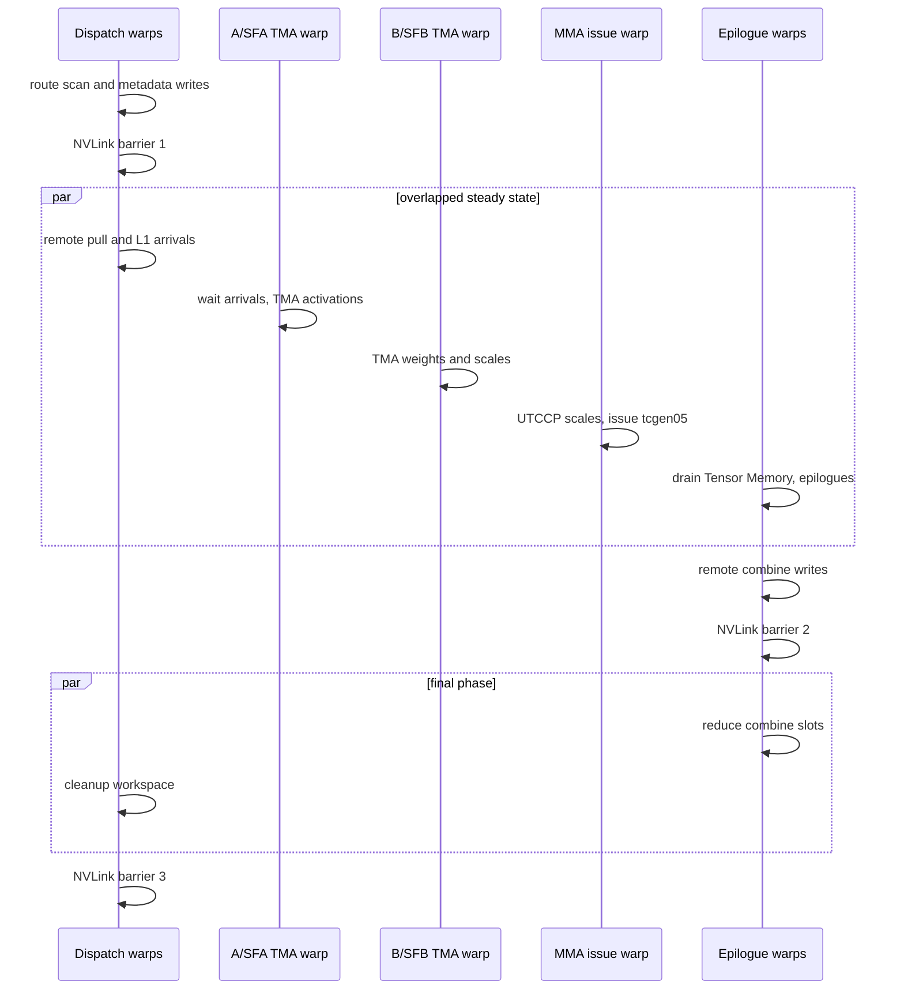
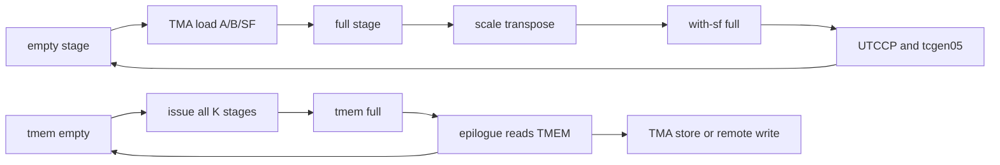

# DeepGEMM Mega MoE GPU Kernel Techniques: A Cookbook for Building the Kernel

## Abstract

This paper explains the GPU-kernel techniques behind DeepGEMM's Mega MoE
forward kernel, using `deepseek-ai/DeepGEMM` `main` at commit
`891d57b4db1071624b5c8fa0d1e51cb317fa709f` as the source cutoff. The focus is
not the public API, but the implementation pattern: how one SM100-only
FP8xFP4 kernel fuses expert dispatch, local expert pooling, Linear 1, SwiGLU,
FP8 requantization, Linear 2, remote BF16 combine writes, final top-k
reduction, and workspace cleanup.

The reader model is a CUDA or GPU-systems engineer who already knows ordinary
GEMM tiling and distributed Mixture-of-Experts (MoE) at a high level, but wants
to understand the reusable kernel-building techniques. Each section introduces
one technique, gives the shapes and synchronization contract, then maps it to
the DeepGEMM Mega MoE implementation. The companion implementation manual can
be read for API-level contracts and a longer end-to-end source walkthrough; this
paper is organized as a kernel cookbook.

Evidence policy: claims labeled `source-direct` are directly supported by the
DeepGEMM source at the cutoff commit. Claims labeled `official-docs` use NVIDIA
or CUDA documentation to define hardware terms. Performance motivations marked
`inferred` are conclusions from code structure and tests, not published
benchmark claims.

## 1. Kernel Cookbook Orientation

DeepGEMM Mega MoE is best understood as a set of coupled GPU-kernel techniques
rather than as a large GEMM call. The operation starts with tokens that live on
source ranks. Each token has up to $K_{\text{top}}$ expert choices. Each expert
is statically owned by one rank. The kernel turns this sparse distributed route
pattern into local grouped GEMMs by publishing route metadata, pulling only the
needed token rows into local expert pools, and then running two expert-local
matrix multiplies.

The logical MoE computation for token $t$ on rank $r$ is:

$$
y_{r,t}
= \sum_{s=0}^{K_{\text{top}}-1}
a_{r,t,s}
W^{(2)}_{e_{r,t,s}}
\operatorname{SwiGLU}
\left(
W^{(1)}_{e_{r,t,s}} x_{r,t}
\right).
$$

Symbols: $x_{r,t} \in \mathbb{R}^{H}$ is the source token activation, $e_{r,t,s}$
is the global expert id in top-k slot $s$, $a_{r,t,s}$ is the route weight,
$W^{(1)}$ maps $H$ to $2I$, $W^{(2)}$ maps $I$ to $H$, and $y_{r,t}$ is the BF16
output token.

The fused kernel rearranges this equation into a communication-friendly order:

1. Publish route metadata, not token payloads.
2. Pull source tokens to the expert-owning rank.
3. Store pulled rows in local expert-contiguous pools.
4. Run Linear 1 over pooled rows.
5. Apply SwiGLU and route weights, then requantize to FP8.
6. Run Linear 2 over the same pooled row order.
7. Write each expert contribution back to the source rank.
8. Reduce the top-k contribution slots locally into $y$.

The source implementation is SM100-only at this cutoff: the C++ API dispatches
to the SM100 path for architecture major 10 and rejects other architectures
([architecture gate][api-contract]). The fused kernel body is in the SM100
include ([kernel body][kernel]).

### 1.1 Common Symbols

| Symbol | Meaning |
| --- | --- |
| $R$ | Number of ranks in the expert-parallel group. |
| $r$ | Source rank id. |
| $d$ | Destination rank id that owns an expert. |
| $E$ | Total global expert count. |
| $E_r$ | Experts per rank, $E_r = E/R$. |
| $K_{\text{top}}$ | Number of top-k routes per token. |
| $T_{\max}$ | Allocated maximum local source tokens per rank. |
| $T$ | Live token count on one rank for one kernel call, $T \le T_{\max}$. |
| $H$ | Model hidden dimension. |
| $I$ | MoE intermediate dimension after SwiGLU halves are paired. |
| $P$ | Maximum pooled token-expert rows on one destination rank. |
| $B_M,B_N,B_K$ | GEMM tile dimensions chosen by heuristics. |
| $S_M$ | Scale-factor M extent used by SM100 scale movement, $S_M=\operatorname{align}(B_M,128)$. |

The rank that owns global expert $e$ and the expert's local index are:

$$
\rho(e) = \left\lfloor \frac{e}{E_r} \right\rfloor,
\qquad
q(e) = e \bmod E_r.
$$

Symbols: $\rho(e)$ is the owner rank, and $q(e)$ is the local expert index on
that owner rank. DeepGEMM computes this mapping during dispatch
([dispatch mapping][kernel-dispatch-count]).

### 1.2 The One Diagram to Keep in Mind

```mermaid
flowchart LR
  A["Source rank input x, x_sf, topk"] --> B["Route scan"]
  B --> C["Remote metadata write"]
  C --> D["NVLink barrier 1"]
  D --> E["Destination pull into L1 pool"]
  E --> F["Pooled L1 GEMM"]
  F --> G["SwiGLU and FP8 requant"]
  G --> H["Pooled L2 GEMM"]
  H --> I["Remote BF16 combine write"]
  I --> J["NVLink barrier 2"]
  J --> K["Local top-k reduce into y"]
  K --> L["Cleanup and NVLink barrier 3"]
```



Diagram notation key: `x_sf` is the packed UE8M0 input scale view, `L1 pool` is
the local destination-rank `l1_acts` and `l1_acts_sf` storage, `Pooled L1/L2
GEMM` means grouped expert-local GEMMs over contiguous pooled rows, and
`NVLink barrier` means DeepGEMM's symmetric-memory cross-rank barrier protocol.

## 2. Annotated Mega MoE Algorithm

This section gives the end-to-end algorithm once, then the rest of the paper
unpacks each numbered technique. The pseudocode is intentionally written at the
kernel-author level: it preserves the role split and synchronization edges
without copying source syntax.

```text
Algorithm: MegaMoEForwardKernelTechniques
Inputs:
  local source views:
    x[T, H]                 // FP8 E4M3
    x_sf[T, H / 128]        // int32, four UE8M0 scales per word
    topk_idx[T, K_top]      // int64 global expert ids
    topk_weights[T, K_top]  // float32 route weights
  local expert weights:
    W1[E_r, 2I, H]          // packed FP4 data plus packed UE8M0 scales
    W2[E_r, H, I]           // packed FP4 data plus packed UE8M0 scales
  symmetric workspace and payload buffers on every rank
Output:
  y[T, H]                   // BF16

Technique T1: symmetric address map
  every rank has the same byte layout:
    workspace, x, x_sf, topk, l1 pool, l2 pool, combine slots
  remote(rank, region, offset) is computed by symmetric-memory pointer mapping

Technique T2: metadata-first routing
  for each local token t and slot s:
    e = topk_idx[t, s]
    if e < 0: continue
    d = floor(e / E_r)
    q = e mod E_r
    reserve one metadata slot for destination rank d and local expert q
    remote(d).src_token_topk_idx[q, r, slot] = pack(t, s)
    increment local expert-send count for e

Technique T3: cross-rank publication barrier
  publish per-rank receive counts
  wait at NVLink barrier tag 1

Technique T4: remote token pull into local expert pool
  for each local expert q owned by this rank:
    for each source-rank metadata slot assigned to q:
      decode source rank, source token t, top-k slot s
      row = pool_row(q, ordinal_in_expert)
      async copy remote(source).x[t, :] into local l1_acts[row, :]
      copy remote(source).x_sf[t, :] into local l1_acts_sf[scale_row(row), :]
      l1_topk_weights[row] = remote(source).topk_weights[t, s]
      token_src_metadata[row] = {source, t, s}
      release-increment l1_arrival_count[pool_block(row)]

Technique T5: persistent local scheduler
  while work remains:
    choose a local expert wave and a tile
    wait until l1_arrival_count proves the tile's pooled rows are present
    emit L1 tile work
    later wait until L1 epilogue marks L2 input ready
    emit L2 tile work

Technique T6: TMA and SM100 Tensor Memory GEMM core
  for each emitted L1 or L2 tile:
    TMA-load activation tile and activation scales into shared memory
    TMA-load packed FP4 weight tile and weight scales into shared memory
    transpose packed scale factors into UTCCP-friendly layout
    copy scales to Tensor Memory
    issue block-scaled tcgen05 MMA into Tensor Memory accumulators
    signal Tensor Memory accumulator full

Technique T7: L1 epilogue as the fused activation boundary
  read L1 FP32 accumulators from Tensor Memory
  pair gate and up halves
  apply optional clamp and SwiGLU
  multiply by l1_topk_weights[row]
  reduce amax, compute UE8M0 output scales
  store FP8 output into l2_acts[row, :]
  store packed scales into l2_acts_sf[scale_row(row), :]
  release bits in l2_arrival_mask for the produced L2 K-blocks

Technique T8: L2 epilogue as remote combine writer
  read L2 FP32 accumulators from Tensor Memory
  cast to BF16 chunks
  use token_src_metadata[row] to find source rank, token, top-k slot
  remote(source).combine[topk_slot, token, hidden_chunk] = BF16 chunk

Technique T9: second cross-rank barrier and local reduction
  wait at NVLink barrier tag 2
  on each source rank:
    for each token t and hidden chunk:
      acc = 0
      for each valid top-k slot s:
        acc += BF16_to_FP32(combine[s, t, hidden_chunk])
      y[t, hidden_chunk] = BF16(acc)

Technique T10: cleanup with overlap
  dispatch warps clear counts, source metadata, arrival counters, and masks
  epilogue warps reduce combine slots
  wait at NVLink barrier tag 3 before the next call can reuse workspace
```

Source anchors: route scan and metadata write are in the dispatch path
([dispatch path][kernel-dispatch-count]); remote pull is in the pull path
([pull path][kernel-pull]); TMA and MMA roles are in the load and MMA paths
([load path][kernel-loads], [MMA path][kernel-mma]); L1 and L2 epilogues are in
the epilogue paths ([L1 epilogue][kernel-l1-epi], [L2 epilogue][kernel-l2-epi]);
final combine is in the combine path ([combine][kernel-combine]); cleanup is in
the cleanup path ([cleanup][kernel-clean]).

## 3. Technique Map

| Problem | Kernel technique | DeepGEMM implementation point | Evidence |
| --- | --- | --- | --- |
| Route sparse top-k tokens across ranks without launching a host all-to-all. | Symmetric memory plus remote metadata writes. | Source ranks write packed token/top-k ids into destination-rank workspace. | `source-direct` [dispatch path][kernel-dispatch-count] |
| Avoid moving every token to every rank. | Metadata-first dispatch, then destination-side payload pull. | Destination ranks pull only token rows assigned to local experts. | `source-direct` [pull path][kernel-pull] |
| Convert sparse routes into GEMM-shaped work. | Local expert pooling with tile-aligned expert segments. | `l1_acts` and `l2_acts` are pooled by local expert. | `source-direct` [layout pool][layout-pool], [scheduler][scheduler-blocks] |
| Keep one launch alive across dispatch, GEMM, epilogue, combine, cleanup. | Persistent kernel with warp-role specialization. | Dispatch, TMA, MMA, and epilogue branches live in one kernel body. | `source-direct` [kernel init][kernel-init] |
| Feed tensor cores without per-thread global loads. | Tensor Memory Accelerator (TMA) loads into shared memory. | Host creates TMA descriptors for activations, scales, weights, and stores. | `source-direct` [launch wrapper][launch-wrapper] |
| Support SM100 block-scaled FP8xFP4 MMA. | UE8M0 scale packing, UTCCP scale copies, and `tcgen05.mma`. | Scale factors are transposed and copied to Tensor Memory before MMA. | `source-direct` [MMA path][kernel-mma], `official-docs` [PTX MMA][ptx-mma] |
| Avoid register accumulator pressure. | SM100 Tensor Memory accumulators. | MMA accumulates into Tensor Memory, epilogues later load accumulators. | `source-direct` [MMA path][kernel-mma], `official-docs` [PTX Tensor Memory alloc][ptx-alloc] |
| Avoid races between asynchronous copies and consumers. | `mbarrier` and full/empty stage barriers. | Pull path, TMA pipeline, and Tensor Memory pipeline use phase-tracked barriers. | `source-direct` [kernel][kernel], `official-docs` [PTX mbarrier][ptx-mbarrier] |
| Make remote BF16 writes visible before local reduction. | System-scope NVLink barrier. | Barrier tag 2 separates remote combine writes from source-rank reduction. | `source-direct` [barrier][barrier], [combine][kernel-combine] |
| Reduce launch and memory traffic overhead. | Fuse route weight, activation, requantization, and final combine. | L1 epilogue writes weighted FP8 L2 input; final combine sums unweighted BF16 slots. | `source-direct` [L1 epilogue][kernel-l1-epi], [combine][kernel-combine] |

## 4. Technique 1: Symmetric Memory as a Distributed Address Map

The first design move is to allocate one same-sized registered byte buffer on
every rank. Because every rank uses the same byte layout, a kernel can compute
a remote address by taking a local region offset and applying the symmetric
memory mapping for the destination rank. This turns cross-rank communication
surfaces into ordinary device pointers plus explicit synchronization.

In Mega MoE, the symmetric buffer contains both communication-facing regions and
large local scratch regions:

| Region | Shape | Main user |
| --- | --- | --- |
| $x$ | $[T_{\max},H]$ FP8 | Source rank exposes input tokens. |
| `x_sf` | $[T_{\max},H/128]$ int32 | Source rank exposes packed input scales. |
| `topk_idx` | $[T_{\max},K_{\text{top}}]$ int64 | Source rank exposes expert ids. |
| `topk_weights` | $[T_{\max},K_{\text{top}}]$ FP32 | Source rank exposes route weights. |
| `l1_acts` | $[P,H]$ FP8 | Destination rank stores pulled token rows. |
| `l1_acts_sf` | $[P_{\mathrm{sf}},H/128]$ int32 | Destination rank stores pulled input scales in M-major layout. |
| `l2_acts` | $[P,I]$ FP8 | L1 epilogue stores post-SwiGLU activations. |
| `l2_acts_sf` | $[P_{\mathrm{sf}},I/128]$ int32 | L1 epilogue stores L2 activation scales. |
| Combine slots | $[K_{\text{top}},T_{\max},H]$ BF16 | Destination ranks write, source rank reduces. |

This table is source-direct from the API slicing and layout implementation
([API buffer layout][api-buffer], [device layout][kernel-layout]). The local
scratch regions are in symmetric memory primarily because the implementation
uses one registered global-memory allocation for all payload regions. Other
ranks generally do not need to read `l1_acts` or `l2_acts`; they are local
destination pools.

The capacity of the pooled rows is:

$$
P =
\operatorname{align}
\left(
R T_{\max} \min(K_{\text{top}}, E_r)
+ E_r(B_{M,\max}-1),
384
\right).
$$

Symbols: $P$ is the maximum local destination-rank pool rows, $R T_{\max}$ is
the maximum number of source tokens visible across the group, $\min(K_{\text{top}},E_r)$
bounds how many local experts one token can select on this destination rank,
and $E_r(B_{M,\max}-1)$ reserves worst-case per-expert tile padding. The formula
is implemented in the Mega MoE layout utilities ([layout pool][layout-pool]).

Kernel-author recipe:

1. Define one null-base layout function that computes offsets without needing
   an actual allocation.
2. Use the same layout function on host and device.
3. Put synchronization words and metadata before payload buffers.
4. Keep local scratch in the same allocation when it simplifies pointer
   arithmetic and lifetime management.
5. Treat symmetric memory as an address-map mechanism, not as an implicit
   coherence or ordering mechanism.

## 5. Technique 2: Metadata-First Dispatch and Expert Pooling

A naive MoE implementation might all-to-all token payloads first and then
discover how to run expert GEMMs. DeepGEMM does the opposite. It first publishes
compact route metadata: for each valid local top-k route, the source rank writes
an encoded pair `(source token, top-k slot)` into the destination rank's
metadata area. Only after every rank has published metadata does the destination
rank pull the exact token rows it needs.

The packed metadata is conceptually:

$$
\operatorname{packed}(t,s) = t K_{\text{top}} + s.
$$

Symbols: $t$ is the source-rank token index and $s$ is the top-k slot. The
destination rank decodes $t=\lfloor \operatorname{packed}/K_{\text{top}}\rfloor$
and $s=\operatorname{packed} \bmod K_{\text{top}}$ before pulling token data.

The destination rank arranges received rows by local expert. For local expert
$e$ with $n_e$ received rows and selected tile size $B_M$, the pool block offset
is:

$$
O_e = \sum_{j=0}^{e-1} \left\lceil \frac{n_j}{B_M} \right\rceil.
$$

The physical row for ordinal $u$ inside expert $e$ is:

$$
\operatorname{pool\_row}(e,u) = O_e B_M + u.
$$

Symbols: $O_e$ is measured in $B_M$-row blocks, and $u$ is the row ordinal within
the received rows for expert $e$. This is the scheduler's core conversion from
sparse routes to contiguous GEMM tiles ([scheduler blocks][scheduler-blocks]).

```text
Algorithm: MetadataFirstPoolConstruction
on source rank r:
  for t in local tokens:
    for s in 0 .. K_top - 1:
      e = topk_idx[t, s]
      if e < 0: continue
      d = floor(e / E_r)
      q = e mod E_r
      # smem_expert_count[e] was initialized by the count pass to this SM's
      # exclusive low32 offset inside expert_send_count[e].
      slot = atomic_add_block(smem_expert_count[e], 1)
      remote(d).src_token_topk_idx[q, r, slot] = t * K_top + s
      expert_send_count[e] += 1

after NVLink barrier tag 1, on destination rank d:
  compute n_q from receive counts
  compute O_q prefix sums over ceil_div(n_q, B_M)
  for each q, source rank r, metadata slot:
    packed = src_token_topk_idx[q, r, slot]
    t = packed / K_top
    s = packed % K_top
    row = O_q * B_M + ordinal_in_expert(q)
    l1_acts[row, :] = remote(r).x[t, :]
    l1_acts_sf[scale_row(row), :] = remote(r).x_sf[t, :]
    l1_topk_weights[row] = remote(r).topk_weights[t, s]
```

Inferred performance rationale: metadata-first dispatch avoids moving token
payloads for experts that are not selected, and expert pooling gives the GEMM
core contiguous $M$ tiles even though the original routes are sparse and
distributed. The source directly implements the metadata write and pull
protocol; the bandwidth rationale is inferred from that structure.

The line `atomic_add_block(smem_expert_count[e], 1)` is the precise meaning of
the earlier "reserve one metadata slot" shorthand. The reservation is not a
remote allocator and not a cross-rank atomic. The source rank first contributes
its per-SM count for expert $e$ to `expert_send_count[e]` with a packed 64-bit
atomic add:

```text
send_value = (1 << 32) | local_count[e]
old_status = atomic_add(expert_send_count[e], send_value)
smem_expert_count[e] = low32(old_status)
```

The returned low 32 bits are this SM's exclusive starting offset for expert
$e$. During the metadata write pass, block-local atomics advance that cursor so
each route gets a unique `slot` in:

```text
remote(dst_rank).src_token_topk_idx[dst_local_expert, my_rank, slot]
```

Only source rank `my_rank` writes the `[dst_local_expert, my_rank, :]` slice, so
the remote metadata store itself can be a plain remote write. Count publication
and the tag-1 NVLink barrier make those plain writes visible before the
destination rank starts pulling payload rows.

## 6. Technique 3: Persistent Kernel Roles

Mega MoE needs dispatch, communication, GEMM production, MMA issue, epilogue
work, reduction, and cleanup to overlap. The kernel therefore uses a persistent
role split: different warp ranges execute different long-running loops. The
source makes this visible as separate branches for dispatch warps, A/SFA TMA
loader, B/SFB TMA loader, MMA issuer, and epilogue/combine warps
([kernel init][kernel-init], [load path][kernel-loads], [MMA path][kernel-mma],
[epilogues][kernel-l1-epi]).



Diagram notation key: `A/SFA` means activation data and activation scale factors;
`B/SFB` means weight data and weight scale factors; `UTCCP` is the SM100 scale
copy path used to move packed scale factors into Tensor Memory.

The role split is useful only if every role has a precise ownership boundary.
The exact counts are template-selected, but the relative organization is:

| Relative warp range | Role | Main loop | Publishes to |
| --- | --- | --- | --- |
| `0 .. kNumDispatchWarps - 1` | Dispatch and pull warps | Route scan, metadata writes, receive-count publication, remote pull, cleanup. | Destination route metadata, receive counts, `l1_arrival_count`, cleanup barrier. |
| `kNumDispatchWarps + 0` | A/SFA TMA warp | Load activation tile A and activation scale factors SFA. | Shared-memory stage full state. |
| `kNumDispatchWarps + 1` | B/SFB TMA warp | Load packed FP4 weight tile B and weight scale factors SFB. | Shared-memory stage full state. |
| `kNumDispatchWarps + 2` | MMA issue warp | Wait for TMA-loaded operands, move scale factors through the SM100 scale path, issue `tcgen05.mma`. | Shared-memory stage empty state and Tensor Memory full state. |
| Remaining GEMM/epilogue warps | Epilogue and combine warps | Drain Tensor Memory accumulators, run L1 or L2 epilogue, reduce combine slots. | `l2_arrival_mask`, remote combine slots, Tensor Memory empty state. |

Symbols: A is the activation operand, B is the packed FP4 weight operand, SFA is
the activation scale-factor operand, and SFB is the weight scale-factor operand.
The source describes the non-epilogue GEMM split as A/SFA warp, B/SFB warp, and
MMA issue warp after the dispatch-warp range ([load path][kernel-loads],
[MMA path][kernel-mma]).

### 6.1 CTA Cluster Topology

Mega MoE launches a persistent grid. On each rank, the host launch uses:

```text
gridDim.x    = num_sms
clusterDim.x = 2
```

where `num_sms` is the selected number of SM work slots from the device runtime.
CUDA still counts `gridDim.x` in CTAs, so this means the rank launches
`num_sms` CTAs total, grouped into `num_sms / 2` two-CTA clusters. The useful
mental model is one resident persistent CTA per selected SM, with adjacent CTAs
co-scheduled as a cluster. Each cluster is one persistent work engine that
processes many scheduler blocks over the life of the kernel; it is not one CTA
or one cluster per expert.

Inside each cluster:

```text
cluster_rank = block_rank_in_cluster()  // 0 or 1
leader CTA   = cluster_rank == 0
peer CTA     = cluster_rank == 1
```

The two CTAs interact through four mechanisms:

| Mechanism | What crosses the CTA boundary | Why it is needed |
| --- | --- | --- |
| Cluster launch and cluster sync | Both CTAs are resident together and can synchronize as a cluster. | Initialization, Tensor Memory setup, and final cleanup must agree across the CTA pair. |
| Cluster-rank tile offsets | Each CTA loads or stores a different slice of the logical tile. | The 2-CTA cluster covers a larger logical tile than one CTA's local shared-memory slice. |
| CTA-group `tcgen05` MMA | The leader issues a `cta_group::2` MMA operation spanning leader and peer CTA state. | SM100 can execute one logical tensor-core operation over the two-CTA group. |
| Multicast or cluster-wide barrier arrivals | Completion of MMA and scale-readiness phases is signaled to both CTAs. | Epilogue and producer roles in both CTAs must see the same phase transitions. |

The source path applies a cluster-rank offset to the TMA coordinates for the
non-leader CTA. In the Mega MoE activation path this is easiest to think of as
splitting the pooled-row tile: CTA 0 handles one half of the local tile slice,
and CTA 1 handles the other half. More generally, the SM100 helper chooses
whether the cluster rank offsets the M axis or the N axis according to the
selected tile/layout policy.

The important asymmetry is that both CTAs participate in data movement,
scale-factor staging, Tensor Memory state, and epilogue work, but the
tensor-core issue path is leader-controlled. The leader CTA waits until the
cluster's operand stages and scale factors are ready, then issues the
2-CTA-group `tcgen05.mma`; completion is signaled so epilogue work in both CTAs
can drain the Tensor Memory accumulators.

```text
Algorithm: TwoCTAClusterHandshake
for each scheduled GEMM tile:
  both CTAs:
    compute cluster_rank-specific A/B/SF coordinates
    TMA-load this CTA's operand slice into this CTA's shared memory
    transpose this CTA's scale-factor slice
    arrive cluster-visible operand-ready barriers

  leader CTA only:
    wait until both CTAs have operand and scale slices ready
    UTCCP-copy scale factors into Tensor Memory scale columns
    issue tcgen05.mma.cta_group::2 for the CTA pair
    signal Tensor Memory full state for both CTAs

  both CTAs:
    epilogue warps wait Tensor Memory full
    read this CTA's accumulator slice
    perform L1 or L2 epilogue for this CTA's rows/chunks
    release Tensor Memory empty state
```

This is separate from the rank-local grid synchronization used by dispatch.
Grid sync coordinates all persistent CTAs on one GPU for phases such as route
metadata publication. Cluster sync coordinates only the two CTAs in one SM100
CTA pair for the tensor-core pipeline.

### 6.2 Role Ownership and Communication Matrix

The roles communicate only through explicit state. This is the part to copy if
you are designing a similar persistent kernel: do not let one role infer that
another role is done from loop position alone.

| State | Written by | Read by | Meaning |
| --- | --- | --- | --- |
| `src_token_topk_idx` | Dispatch warps on source rank, via remote store. | Dispatch puller on destination rank. | Packed `(source token, top-k slot)` for one routed row. |
| `recv_count` and `recv_count_sum` | Source-rank SM0 after route scan. | Destination dispatch puller and scheduler. | Number of rows each source rank sends to each local expert, plus completion status. |
| `l1_arrival_count[pool_block]` | Destination dispatch puller. | A/SFA TMA warp and scheduler. | Number of pooled rows in an L1 block that are ready in `l1_acts`. |
| `empty_barriers[stage]` | MMA issue warp after consuming a shared stage. | A/SFA and B/SFB TMA warps. | Shared-memory operand stage can be reused. |
| `full_barriers[stage]` | A/SFA and B/SFB TMA warps after TMA completion. | MMA issue path. | Operand bytes and scale bytes are present in shared memory. |
| `tmem_empty[stage]` | Epilogue warps after reading accumulators. | MMA issue warp. | Tensor Memory accumulator stage can be overwritten. |
| `tmem_full[stage]` | MMA issue warp after final K block commits. | Epilogue warps. | Tensor Memory accumulator tile is complete. |
| `l2_arrival_mask[pool_block]` | L1 epilogue warps. | A/SFA TMA warp and scheduler for L2 phase. | Which L2 activation K-blocks are ready for a pooled block. |
| Combine slots | L2 epilogue warps, via remote store. | Source-rank epilogue/combine warps. | BF16 contribution for one top-k route. |
| NVLink barrier tags | All ranks. | All ranks. | Cross-rank phase boundary before pull, before combine, and after cleanup. |

The communication pattern has three scales:

- **Warp-local or CTA-local**: warp lanes cooperate on route scan, block-local
  atomics, scale transforms, and epilogue reductions.
- **Rank-local**: grid sync and release/acquire counters order work among CTAs
  on one GPU.
- **Cross-rank**: symmetric-memory remote writes are ordered by NVLink barrier
  tags before remote pulls and before final combine.

### 6.3 Dispatch Warps

Dispatch warps are the only role that touches route metadata. They run two
passes over local top-k routes, then become remote pullers. Their work is wide
and irregular, so it is spread across multiple dispatch warps and SMs.

```text
Algorithm: DispatchWarpRole
inputs:
  topk_idx[T, K_top], topk_weights[T, K_top], x[T, H], x_sf[T, H / 128]
  symmetric workspace

phase A: count local routes
  zero per-SM smem_count[E]
  tokens_per_warp = floor(32 / K_top)
  for token group assigned to this dispatch warp:
    each active lane owns one (token, top-k slot)
    e = topk_idx[token, slot]
    if e >= 0:
      atomic_add_block(smem_count[e], 1)
  dispatch_group_sync()

phase B: reserve source-rank metadata ranges
  for expert e assigned to this dispatch thread:
    send_value = (1 << 32) | smem_count[e]
    old_status = atomic_add(workspace.expert_send_count[e], send_value)
    smem_count[e] = low32(old_status)  // exclusive base offset for this SM
  dispatch_group_sync()

phase C: write remote metadata
  for token group assigned to this dispatch warp:
    each active lane owns one valid route (token, slot, e)
    dst_rank = floor(e / E_r)
    dst_local_expert = e mod E_r
    metadata_slot = atomic_add_block(smem_count[e], 1)
    packed = token * K_top + slot
    remote(dst_rank).src_token_topk_idx[dst_local_expert,
                                        my_rank,
                                        metadata_slot] = packed
  grid_sync()

phase D: publish receive counts and wait before pull
  if this is the elected publishing SM:
    for each global expert e:
      dst_rank = floor(e / E_r)
      dst_local_expert = e mod E_r
      status = workspace.expert_send_count[e]
      remote(dst_rank).recv_count[my_rank, dst_local_expert] = low32(status)
      atomic_add_system(remote(dst_rank).recv_count_sum[dst_local_expert],
                        status)
  nvlink_barrier(tag = before_pull)

phase E: pull local expert payloads
  cache finalized expert counts from recv_count_sum
  // fetch_expert_recv_count checks high32(recv_count_sum[e]) == S * R;
  // after tag-1 this should already be true for the dispatch puller
  for each destination-local pooled row assigned to this dispatch warp:
    choose source_rank and source_slot from recv_count[:, local_expert]
    packed = src_token_topk_idx[local_expert, source_rank, source_slot]
    token = packed / K_top
    slot = packed % K_top
    pool_row = pool_row(local_expert, ordinal)
    async copy remote(source_rank).x[token, :] to l1_acts[pool_row, :]
    copy remote(source_rank).x_sf[token, :] to l1_acts_sf[scale_row(pool_row), :]
    l1_topk_weights[pool_row] = remote(source_rank).topk_weights[token, slot]
    token_src_metadata[pool_row] = {source_rank, token, slot}
    release_add(l1_arrival_count[pool_block(pool_row)], 1)

phase F: cleanup after epilogue crosses before-combine boundary
  wait for cross-role cleanup point
  clear send counts, receive counts, source metadata, L1 arrivals, L2 masks
  nvlink_barrier(tag = after_cleanup)
```

The `grid_sync()` after phase C is a rank-local rendezvous among the persistent
dispatch participants on one GPU. It is not an NVLink barrier and it does not
wait for other ranks. Each CTA contributes through its dispatch-side
`thread_idx == 0`; the surrounding `sync_scope()` is the dispatch named barrier,
so the dispatch threads inside that CTA cannot let their phase-C work escape
past the grid rendezvous. The shared counter lives in the symmetric workspace
header. Nonzero SMs add `1` to the counter with GPU-scope release semantics;
SM0 adds `$2^{31} - (S - 1)$`, where `$S$` is the number of participating SMs.
The low bits count arrivals and the high bit is a phase bit. Every participating
CTA then spins with GPU-scope acquire loads until the high bit has flipped.

For this specific phase boundary, the reason is simple: phase C is distributed
across all SMs, but phase D's receive-count publication is performed by the
elected publishing SM. Without the grid sync, SM0 could publish
`recv_count[my_rank, dst_local_expert]` before another SM had finished writing
some of the corresponding `src_token_topk_idx` slots. A destination rank would
then see a valid count after the NVLink barrier and could pull a metadata slot
whose packed `(token, slot)` value had not been written yet. The grid sync
prevents that local race; the following `nvlink_barrier(tag = before_pull)`
then provides the cross-rank visibility edge before any rank begins remote
payload pulls ([dispatch path][kernel-dispatch-count], [barrier][barrier]).

In pseudocode, the implementation idea is:

```text
function grid_sync_after_phase_c(sm_idx, thread_idx, S):
  dispatch_group_sync()

  if thread_idx == 0:
    counter = workspace.grid_sync_count[this_sync_site]
    if sm_idx == 0:
      delta = 2^31 - (S - 1)  // last arrival also toggles phase
    else:
      delta = 1               // ordinary arrival

    old = atomic_add_release_gpu(counter, delta)
    target_phase = high_bit(old) xor 1
    while high_bit(load_acquire_gpu(counter)) != target_phase:
      spin

  dispatch_group_sync()
```

This construction relies on the persistent launch contract: the kernel launches
one resident CTA per participating SM. If a CTA that must arrive at the grid
sync were not resident, the counter would wait forever.

The phase-E `recv_count_sum` line is about finalizing the work contract, not
about repairing a missing NVLink ordering edge. `recv_count_sum[e]` is a packed
64-bit status: the low 32 bits are the number of pooled rows for local expert
`e`, and the high 32 bits count how many source-SM contributions have been
included. The final high-half value is `$S R$`, where `$S$` is participating SMs
per rank and `$R$` is ranks. In the dispatch-pull branch, the call to
`fetch_expert_recv_count()` happens after the tag-1 NVLink barrier, so the
high-half wait should normally pass immediately; the barrier is the visibility
edge for the receive-count writes. The same helper is also used by the GEMM
scheduler roles, which can enter `scheduler.for_each_block()` without
participating in the tag-1 barrier. For those roles, the high-half polling is
the readiness predicate that tells them the expert row counts are final before
they compute expert ranges, pool-block offsets, and tile bounds
([dispatch pull count fetch][kernel-dispatch-count], [scheduler count wait][scheduler-blocks]).

The dispatch role communicates with GEMM through `l1_arrival_count`, not by
calling the GEMM code directly. That is the crucial decoupling: dispatch can
continue pulling later pooled rows while the A/SFA warp starts loading earlier
ready blocks.

In this pseudocode, `dispatch_group_sync()` means the source-level named CTA
barrier:

```text
ptx::sync_aligned(kNumDispatchThreads, kDispatchBarrierIdx)
```

It synchronizes only the dispatch-thread group inside one CTA. In the default
Mega MoE heuristic, `kNumDispatchThreads = 128`, so this covers four dispatch
warps in that CTA. It does not synchronize the two CTAs in a cluster, all CTAs
on the rank, or all ranks. DeepGEMM uses it after the local count pass so all
dispatch threads see complete `smem_count`, after the send-count atomic pass so
all threads see the per-SM exclusive offsets, and as the CTA-local synchronization
callback inside rank-local grid sync and NVLink-barrier helpers.

Do not confuse this named CTA barrier with `dispatch_barriers[warp_idx]`. The
latter is a per-dispatch-warp `ClusterTransactionBarrier` used later in the
remote-pull path as the `mbarrier` object for asynchronous token TMA loads.

### 6.4 A/SFA TMA Warp

The A/SFA warp is the activation producer for the tensor-core pipeline. It walks
the same deterministic scheduler sequence as the B/SFB and MMA roles. For an L1
block, A is `l1_acts`; for an L2 block, A is `l2_acts`. Before it loads A, it
waits for the readiness state corresponding to the current phase.

```text
Algorithm: ASFAWarpRole
for block in deterministic_scheduler_order:
  if block.phase == L1:
    wait acquire until l1_arrival_count[block.pool_block] == block.valid_m
    A_map = tensor_map_l1_acts
    SFA_map = tensor_map_l1_acts_sf
  else:
    wait acquire until l2_arrival_mask[block.pool_block]
                       contains required K-block bits
    A_map = tensor_map_l2_acts
    SFA_map = tensor_map_l2_acts_sf

  for k_block in block.K_range:
    stage = next_shared_memory_stage()
    wait empty_barrier[stage]
    compute A coordinates:
      m = block.pool_m + cta_half_m_offset
      k = k_block * B_K
    compute SFA coordinates:
      sfa_m = scale_row(block.pool_m) + cta_scale_offset
      sfa_k = k_block
    issue TMA load A_map[m:m+B_M, k:k+B_K] into smem_A[stage]
    issue TMA load SFA_map[sfa_m, sfa_k] into smem_SFA[stage]
    arrive full_barrier[stage] for the A/SFA portion
```

The A/SFA warp communicates forward through the shared-memory full barrier. It
does not know whether the block is ultimately L1 or L2 beyond choosing the
right tensor maps and readiness predicate. That phase abstraction is what lets
the same TMA role feed both Linear 1 and Linear 2.

### 6.5 B/SFB TMA Warp

The B/SFB warp is the weight producer. Its work is more regular than the A/SFA
warp because expert weights are already local to the destination rank and have
been transformed into the Mega MoE layout before launch.

```text
Algorithm: BSFBWarpRole
for block in deterministic_scheduler_order:
  if block.phase == L1:
    B_map = tensor_map_l1_weights
    SFB_map = tensor_map_l1_weight_scales
    shape_n = 2 * I
  else:
    B_map = tensor_map_l2_weights
    SFB_map = tensor_map_l2_weight_scales
    shape_n = H

  for k_block in block.K_range:
    stage = matching_shared_memory_stage()
    wait empty_barrier[stage]
    compute B coordinates:
      n = block.local_expert * shape_n + block.n_block * B_N
      k = k_block * B_K
    compute SFB coordinates:
      sfb_n = block.n_block * B_N
      sfb_k = block.local_expert * ceil(shape_k / (32 * 4)) + k_block
    issue TMA load B_map[n:n+B_N, k:k+B_K] into smem_B[stage]
    issue TMA load SFB_map[sfb_n, sfb_k] into smem_SFB[stage]
    arrive full_barrier[stage] for the B/SFB portion
```

The B/SFB warp communicates with the MMA issue warp through the same shared
stage protocol as the A/SFA warp. The full-stage condition is not semantically
"A is done" or "B is done"; it means every operand byte and scale byte required
for that K stage is now in shared memory.

### 6.6 MMA Issue Warp

The MMA issue warp is the consumer of shared-memory stages and the producer of
Tensor Memory accumulators. It is the role that joins the A/SFA and B/SFB
streams. It waits until a shared-memory stage is full, transforms or copies the
scale factors into the SM100 Tensor Memory scale layout, issues block-scaled
`tcgen05.mma`, and then releases the shared-memory stage.

```text
Algorithm: MMAIssueWarpRole
for block in deterministic_scheduler_order:
  accum_stage = next_tensor_memory_stage()
  wait tmem_empty[accum_stage]

  for k_block in block.K_range:
    stage = matching_shared_memory_stage()
    wait full_barrier[stage]

    if k_block == first:
      initialize or zero Tensor Memory accumulator tile

    transform packed SFA/SFB chunks as required by the scale-copy path
    UTCCP-copy SFA from smem_SFA[stage] to Tensor Memory scale columns
    UTCCP-copy SFB from smem_SFB[stage] to Tensor Memory scale columns

    issue tcgen05.mma using:
      shared-memory descriptor for A
      shared-memory descriptor for B
      Tensor Memory addresses for SFA and SFB scales
      Tensor Memory accumulator address for accum_stage

    arrive empty_barrier[stage]

  commit final MMA work to tmem_full[accum_stage]
```

The MMA issue warp never pulls remote data and never writes the final output.
Its two communication edges are local: shared-memory stage barriers on the input
side and Tensor Memory full barriers on the output side.

### 6.7 Epilogue and Combine Warps

Epilogue warps consume Tensor Memory. Their behavior depends on whether the
scheduler block is an L1 block or an L2 block.

```text
Algorithm: EpilogueWarpRole
wait for initial cross-role synchronization with dispatch roles

for block in deterministic_scheduler_order:
  accum_stage = matching_tensor_memory_stage()
  wait tmem_full[accum_stage]

  if block.phase == L1:
    for pooled rows and intermediate columns assigned to this epilogue warp:
      read FP32 gate/up accumulators from Tensor Memory
      apply optional clamp
      value = l1_topk_weights[row] * silu(gate) * up
      participate in amax reduction for FP8 scale selection
      store FP8 value into l2_acts[row, :]
      store packed UE8M0 scale into l2_acts_sf[scale_row(row), :]
    wait until L1 output stores are complete
    elected epilogue warp release-ORs required bits into l2_arrival_mask

  else:
    for pooled rows and hidden chunks assigned to this epilogue warp:
      read FP32 L2 accumulators from Tensor Memory
      values = BF16(accumulators)
      meta = token_src_metadata[row]
      remote(meta.source_rank).combine[meta.topk_slot,
                                       meta.token,
                                       hidden_chunk] = values

  arrive tmem_empty[accum_stage]

free Tensor Memory after all scheduled blocks finish
nvlink_barrier(tag = before_combine)
signal dispatch warps that cleanup can begin

for local token and hidden chunk assigned to this epilogue warp:
  acc = 0
  for slot in valid top-k slots:
    acc += BF16_to_FP32(combine[slot, token, hidden_chunk])
  y[token, hidden_chunk] = BF16(acc)
```

The L1 epilogue communicates forward to the A/SFA warp through
`l2_arrival_mask`. The L2 epilogue communicates backward to source ranks through
remote combine slots. The final combine is deliberately local to the original
source rank and begins only after the tag-2 NVLink barrier.

### 6.8 Deterministic Scheduler Agreement

The A/SFA, B/SFB, MMA, and epilogue roles all need to agree on which tile is
"current." Mega MoE achieves this by making the scheduler state deterministic:
given the same workspace counts, template constants, and phase, each role walks
the same sequence of local expert waves and tile indices. They do not pass a
large work descriptor through a queue. Instead, the queue is implicit in shared
scheduler state and readiness predicates.

```text
Algorithm: SharedSchedulerContract
for every GEMM-facing role:
  block = scheduler.next()
  block contains:
    phase             // L1 or L2
    local_expert
    pool_m block
    n block
    K-block range
    valid_m
    pool_block id

  role-specific behavior:
    A/SFA waits data readiness and TMA-loads activations
    B/SFB TMA-loads local expert weights
    MMA waits operands and issues tensor-core work
    epilogue waits Tensor Memory and stores the phase result
```

If the roles disagree on scheduler order, the kernel can deadlock without an
obvious memory fault: A might load one tile, B another, MMA a third, and the
epilogue might wait on a Tensor Memory stage that is never filled. This is why
shape-dependent constants such as $B_M$, $B_N$, $B_K$, stage counts, and expert
wave size are chosen once by the host/JIT path and baked into one template
specialization.

Kernel-author rule: persistent role kernels need explicit cross-role contracts.
In Mega MoE those contracts are arrival counters, L2 masks, full/empty TMA stage
barriers, Tensor Memory full/empty barriers, deterministic scheduler order, and
NVLink barriers. The roles are allowed to overlap only where one of those
contracts gives a real happens-before edge.

## 7. Technique 4: TMA Descriptors and Shared-Memory Staging

Tensor Memory Accelerator (TMA) lets the kernel move rectangular tiles between
global memory and shared memory without every thread issuing scalar loads. The
Mega MoE host wrapper constructs TMA descriptors for activation tiles, activation
scale tiles, packed FP4 weights, weight scales, L1 output stores, and final
combine/output movement ([launch wrapper][launch-wrapper]). CUDA exposes tensor
map descriptor concepts in the driver API documentation ([CUDA tensor maps][cuda-tensormap]).

DeepGEMM uses three related TMA patterns:

1. **Activation TMA**: load $B_M \times B_K$ FP8 rows from `l1_acts` or
   `l2_acts`.
2. **Weight TMA**: load packed FP4 expert weight tiles and packed UE8M0 weight
   scale tiles.
3. **Degenerate scale TMA**: treat scale-factor movement as a narrow TMA box,
   effectively a one-dimensional copy even though the descriptor is still a
   tensor map.

For activation scales, the visible shape is:

$$
\texttt{x\_sf} \in [T_{\max}, H/128].
$$

This does not mean one scale covers 128 hidden values. It means one scale covers
32 hidden values, and four one-byte UE8M0 scales are packed into one `int32`:

$$
\frac{H/32}{4} = \frac{H}{128}.
$$

Symbols: $H/32$ is the raw number of scale bytes per token row, and $H/128$ is
the number of packed 32-bit words.

The TMA pipeline is a producer-consumer loop:

```text
Algorithm: TMAProducerStage
for each GEMM tile and K stage:
  stage = stage_id mod num_stages
  wait empty_barrier[stage]
  issue TMA load for A tile into smem_A[stage]
  issue TMA load for SFA tile into smem_SFA[stage]
  issue TMA load for B tile into smem_B[stage]
  issue TMA load for SFB tile into smem_SFB[stage]
  arrive full_barrier[stage] when TMA transactions complete
```

The corresponding MMA role waits on `full_barrier[stage]`, performs any scale
transpose and scale copy needed for SM100 block scaling, issues MMA, then
releases the stage through `empty_barrier[stage]`.

Shared-memory swizzling matters because TMA and UMMA expect shared-memory tiles
to satisfy specific access-layout requirements. The implementation uses
swizzled shared-memory descriptors for ordinary data tiles and unswizzled or
degenerate maps for packed scale factors where the scale-copy path needs a
different row organization ([TMA descriptor construction][launch-wrapper],
[load path][kernel-loads]).

Evidence boundary: this paper describes the technique and source usage, but not
the full CUDA tensor-map binary descriptor format. For descriptor details, use
the CUDA tensor-map documentation and DeepGEMM's runtime descriptor construction
code ([CUDA tensor maps][cuda-tensormap], [runtime utils][runtime-utils]).

## 8. Technique 5: SM100 Tensor Memory and `tcgen05` MMA

On SM100, the kernel's main GEMM core uses Tensor Memory as the accumulator
destination for fifth-generation tensor-core operations. Instead of each thread
owning a large register fragment for $C$, the MMA operation accumulates into
Tensor Memory columns. Epilogue warps later load those accumulators, apply
activation or output conversion, and store results.

The source initializes cluster-level state and Tensor Memory allocation near
kernel startup ([kernel init][kernel-init]). NVIDIA PTX documents the relevant
Tensor Memory allocation and MMA operations as part of the `tcgen05` instruction
family ([PTX Tensor Memory alloc][ptx-alloc], [PTX MMA][ptx-mma]).

The block-scaled MMA core can be sketched as:

```text
Algorithm: SM100BlockScaledMMA
for each output tile:
  wait tmem_empty[accumulator_stage]
  for each K stage:
    wait with_sf_full[stage]
    if first K stage:
      initialize Tensor Memory accumulator tile
    UTCCP-copy SFA scale tile from shared memory to Tensor Memory
    UTCCP-copy SFB scale tile from shared memory to Tensor Memory
    issue tcgen05.mma with:
      A descriptor from shared memory
      B descriptor from shared memory
      SFA and SFB Tensor Memory scale addresses
      accumulator Tensor Memory address
    release shared-memory empty barrier for this K stage
  commit MMA completion to tmem_full[accumulator_stage]
```

Conceptually, for a tile:

$$
C_{m,n}
=
\sum_{k}
\left(
s^A_{m,\lfloor k/32 \rfloor}
\widehat{A}_{m,k}
\right)
\left(
s^B_{n,\lfloor k/32 \rfloor}
\widehat{B}_{n,k}
\right).
$$

Symbols: $\widehat{A}$ is FP8 activation data, $\widehat{B}$ is packed FP4
weight data after unpacking by the tensor-core operation, $s^A$ and $s^B$ are
UE8M0 scale factors for 32-wide K groups, and $C$ is the FP32 accumulator tile in
Tensor Memory. The formula is conceptual; the exact instruction-level scale
application is defined by SM100 block-scaled `tcgen05.mma`.

Why this technique matters:

- Tensor Memory holds accumulator state that would otherwise create heavy
  register pressure.
- TMA producers can fill shared-memory stages while the MMA issuer consumes
  previous stages.
- Epilogue warps can be decoupled from MMA issue and drain completed accumulator
  tiles through Tensor Memory barriers.

Evidence boundary: DeepGEMM's use of Tensor Memory and `tcgen05` is
source-direct. The mathematical description above is a kernel-author mental
model, not a substitute for the PTX instruction specification.

## 9. Technique 6: UE8M0 Scale Packing, K-Major Inputs, and M-Major Pools

FP8 and FP4 are not used alone. The Mega MoE kernel uses block scaling with
UE8M0 scale factors. The scale layout has to satisfy three different users:

1. The Python/caller-visible input tensor wants token-contiguous rows.
2. TMA wants descriptor-friendly global-memory layout.
3. SM100 UTCCP scale copy wants scale chunks arranged for Tensor Memory.

The input scale view is K-major:

$$
\texttt{x\_sf}[t,j],
\qquad
j = \left\lfloor \frac{h}{128} \right\rfloor.
$$

Symbols: $t$ is token row, $h$ is hidden column, and $j$ is the packed `int32`
scale-word index. The byte inside that word is selected by
$\left(\lfloor h/32 \rfloor \bmod 4\right)$.

The pooled scale views are M-major:

$$
\texttt{l1\_acts\_sf}[\operatorname{scale\_row}(m), j],
\qquad
\texttt{l2\_acts\_sf}[\operatorname{scale\_row}(m), j].
$$

The source transforms scale rows during remote pull and during L1 epilogue so
later TMA and UTCCP paths can consume scale factors efficiently
([scale-factor layout helper][kernel-sf], [pull path][kernel-pull],
[L1 epilogue][kernel-l1-epi]).

The scale-factor row extent for a $B_M$ tile is padded to 128:

$$
S_M = \operatorname{align}(B_M,128).
$$

For a candidate block size $b$, the maximum scale rows needed for the pool are:

$$
Q_b = \frac{P}{b} \operatorname{align}(b,128).
$$

The host allocates:

$$
P_{\mathrm{sf}} =
\max_{b \in \{8,16,32,64,96,128,192\}} Q_b.
$$

Symbols: $P_{\mathrm{sf}}$ is the padded scale-factor pool row capacity, $P$ is
the pooled activation row capacity, and the candidate set is the source-defined
candidate $B_M$ table ([layout pool][layout-pool], [API buffer layout][api-buffer]).

Kernel-author recipe:

1. Keep caller input scales in a simple row-major shape.
2. Convert scale rows at the moment data enters the pooled representation.
3. Allocate scale pools for the largest padding overhead among all candidate
   tile sizes, because the JIT-selected tile size can vary by problem.
4. Never infer scale coverage from tensor shape alone; `H/128` is a packed word
   count, while the scale granularity is 32 hidden elements.

## 10. Technique 7: Full/Empty Pipelines and Barriers

The kernel has several independent producer-consumer relationships:

- Remote pull produces `l1_acts`; L1 GEMM consumes it.
- TMA warps produce shared-memory stages; MMA issue consumes them.
- MMA issue produces Tensor Memory accumulator tiles; epilogue warps consume
  them.
- L1 epilogue produces `l2_acts`; L2 GEMM consumes it.
- L2 epilogue produces remote combine slots; final combine consumes them.

Each relationship uses the narrowest synchronization primitive that fits the
visibility problem.

| Producer | Consumer | Synchronization technique |
| --- | --- | --- |
| Remote puller | L1 TMA loader | GPU-scope release increment and acquire polling on `l1_arrival_count`. |
| TMA loaders | MMA issuer | Shared-memory full/empty barriers. |
| MMA issuer | Epilogue warps | Tensor Memory full/empty barriers. |
| L1 epilogue | L2 TMA loader | Release OR into `l2_arrival_mask` and acquire polling. |
| L2 epilogue remote writes | Source-rank final reducer | NVLink barrier tag 2. |
| Cleanup | Next call | NVLink barrier tag 3 plus per-call cleanup discipline. |

NVIDIA PTX documents `mbarrier` as a phase-based asynchronous barrier and
documents bulk asynchronous copy completion mechanisms used by TMA-style copies
([PTX mbarrier][ptx-mbarrier], [PTX cp.async.bulk][ptx-cp-async-bulk]).
DeepGEMM's communication barrier header implements rank-local grid sync and the
cross-rank NVLink barrier ([barrier][barrier]).

The TMA/Tensor Memory timeline can be read as two rings:



Diagram notation key: `SF` means scale factors, `with-sf full` means the scale
factors are loaded and transformed for the MMA issue path, and `TMEM` means
SM100 Tensor Memory.

Kernel-author invariant: do not signal a consumer until the data and its
visibility scope are both correct. For example, the remote puller must not
increment the L1 arrival counter until the pulled token row and copied scale row
are actually available in the local pool. The final reducer must not read BF16
combine slots until all ranks have crossed the tag-2 NVLink barrier.

## 11. Technique 8: NVLink Ordering and Remote BF16 Combine Writes

The kernel uses remote writes twice in opposite directions:

1. Source ranks write compact metadata to destination ranks.
2. Destination ranks write BF16 expert contributions back to source ranks.

Both need a cross-rank ordering edge. DeepGEMM's NVLink barrier uses symmetric
workspace words and system-scope ordering to create that edge. The barrier is
called with different tags so phases cannot be confused: before payload pull,
before final combine, and after cleanup ([barrier][barrier], [barrier tags][kernel-init]).

Remote combine uses the source metadata recorded during remote pull:

```text
Algorithm: RemoteCombineWrite
for each completed L2 pooled row:
  meta = token_src_metadata[row]
  source_rank = meta.rank
  token = meta.token
  slot = meta.topk_slot
  for each hidden chunk:
    values = BF16(L2_accumulators[row, chunk])
    remote(source_rank).combine[slot, token, chunk] = values

wait NVLink barrier tag 2

on source rank:
  for token and hidden chunk:
    acc = 0
    for slot in valid top-k slots:
      acc += combine[slot, token, chunk]
    y[token, chunk] = BF16(acc)
```

The route weight is applied before Linear 2 in the L1 epilogue, so the final
combine reduction is a plain sum of BF16 contribution slots:

$$
\sum_s W^{(2)}_{e_s}\left(a_s z_s\right)
=
\sum_s a_s W^{(2)}_{e_s}z_s.
$$

Symbols: $a_s$ is the route weight for top-k slot $s$, $z_s$ is the SwiGLU
activation before route weighting, and the equality holds in exact arithmetic.
In the quantized kernel, the rounding point is fixed by multiplying by $a_s$,
then quantizing the weighted activation to FP8 before Linear 2.

Inferred performance rationale: remote BF16 combine writes avoid routing final
outputs through an additional host-visible all-to-all. The source directly shows
remote combine writes and an in-kernel final reduction; the performance benefit
depends on topology, route balance, and tensor shapes.

## 12. Technique 9: L1 and L2 Epilogues as Fusion Boundaries

The L1 epilogue is the main fusion boundary. It turns Linear 1 accumulators into
Linear 2 inputs without materializing a full BF16/FP32 intermediate. For each
pooled row, Linear 1 produces gate and up halves:

$$
(g,u) = \operatorname{split}_{I,I}(C^{(1)}).
$$

The epilogue computes:

$$
z = a \cdot \operatorname{SwiGLU}(g,u)
  = a \cdot \operatorname{silu}(g) \odot u.
$$

Symbols: $C^{(1)}$ is the L1 FP32 accumulator row, $g$ is the gate half, $u$ is
the up half, $a$ is the route weight stored in `l1_topk_weights`, and $\odot$ is
elementwise multiplication.

It then computes an FP8 scale, stores FP8 activations in `l2_acts`, stores packed
UE8M0 scales in `l2_acts_sf`, and marks the produced L2 K-blocks in
`l2_arrival_mask` ([L1 epilogue][kernel-l1-epi]). This turns the activation
function, route weighting, quantization, and L2 readiness signal into one
epilogue.

The L2 epilogue is the communication boundary. It reads FP32 accumulators from
Tensor Memory, converts to BF16 chunks, and remote-writes those chunks to the
source rank's combine slots using `token_src_metadata` ([L2 epilogue][kernel-l2-epi]).

```text
Algorithm: L1EpilogueBoundary
for each completed L1 output tile:
  for each valid pooled row:
    read gate/up accumulators from Tensor Memory
    gate = optional_clamp(gate)
    up = optional_clamp(up)
    weighted = route_weight[row] * silu(gate) * up
    scale = ue8m0_scale_from_amax(weighted)
    l2_acts[row, :] = fp8(weighted / scale)
    l2_acts_sf[scale_row(row), :] = pack_ue8m0(scale)
  after stores are visible:
    release bits in l2_arrival_mask
```

Kernel-author rule: a fused epilogue must define both the numerical rounding
boundary and the synchronization boundary. In Mega MoE, the numerical boundary
is FP8 requantization after weighted SwiGLU; the synchronization boundary is the
release of L2 readiness bits after the `l2_acts` and `l2_acts_sf` stores are
complete.

## 13. Technique 10: Scheduler Heuristics and Performance Reasoning

The scheduler must convert irregular expert counts into tile work that keeps
SM100 tensor cores busy without over-padding too much. The key shape statistic
is the expected token-expert rows per local expert:

$$
\lambda =
\frac{R T K_{\text{top}}}{E}.
$$

Symbols: $R$ is rank count, $T$ is live local source tokens per rank,
$K_{\text{top}}$ is top-k routes per token, and $E$ is total experts. This is a
rough expectation under balanced routing; real routing can be skewed.

DeepGEMM's heuristic selects among candidate $B_M$ values and chooses pipeline
and wave parameters based on problem shape ([block heuristic][heur-block],
[wave heuristic][heur-wave], [config heuristic][heur-config]). The candidate
table in the layout header includes:

$$
B_M \in \{8,16,32,64,96,128,192\}.
$$

Technique consequences:

| Design choice | Benefit | Cost or risk |
| --- | --- | --- |
| Larger $B_M$ | Better tensor-core utilization and lower scheduling overhead. | More per-expert padding and possibly later first-output readiness. |
| Smaller $B_M$ | Less padding for sparse experts. | More blocks, more scheduler overhead, less efficient epilogues. |
| Expert waves | Limit active expert set and keep local state manageable. | Incorrect wave sizing can starve L1 or L2 work. |
| Pooled scale padding to 128 | Matches SM100 scale movement requirements. | Scale pool can be larger than activation pool intuition suggests. |
| Metadata-first remote pull | Moves only selected token rows. | Requires correct cross-rank publication and pull scheduling. |

Inferred performance reasoning:

- The persistent role split is meant to overlap NVLink remote pulls, TMA loads,
  tensor-core work, epilogues, and cleanup.
- The L1 epilogue's FP8 requantization reduces the L2 activation footprint and
  lets Linear 2 reuse the same FP8xFP4 block-scaled machinery.
- Applying the route weight before Linear 2 makes final combine a simple sum,
  reducing final reduction complexity.
- The exact bottleneck depends on route skew, $T$, $K_{\text{top}}$, $E_r$,
  hidden sizes, NVLink topology, and selected tile size. This paper does not
  claim benchmark numbers.

## 14. From-Scratch Build Recipe

This checklist is intentionally ordered by dependency. A similar kernel should
be built from the memory contract upward, then the communication protocol, then
the GEMM core, then epilogues and cleanup.

### 14.1 Layout and Host Contract

- Define $R$, $E$, $E_r$, $K_{\text{top}}$, $T_{\max}$, $H$, $I$, and the
  supported precision recipe.
- Align $T_{\max}$ to the least common multiple required by candidate $B_M$
  tile sizes.
- Allocate one symmetric byte buffer per rank with identical offsets.
- Place barrier words, route metadata, arrival counters, payload views, pooled
  views, and combine slots in one deterministic layout.
- Expose only the caller-owned views required for staging: $x$, `x_sf`,
  `topk_idx`, and `topk_weights`.

### 14.2 Dispatch and Pooling

- Map each global expert id to owner rank and local expert id.
- Count local routes while skipping negative or masked expert ids.
- Publish compact source-token/top-k metadata to owner ranks.
- Publish receive counts and wait at the first cross-rank barrier.
- Pull only selected token rows and scale rows into local expert pools.
- Store source metadata beside each pooled row for later combine writeback.
- Signal L1 arrivals only after token data, scale data, route weight, and source
  metadata are available.

### 14.3 GEMM Core

- Choose $B_M$, $B_N$, $B_K$, pipeline stages, and expert wave size from shape.
- Build TMA descriptors for activation data, activation scales, weight data,
  weight scales, L1 output, combine, and output as needed.
- Use persistent roles: dispatch/pull, TMA producers, scale transform, MMA
  issue, and epilogues.
- Allocate Tensor Memory once per cluster or CTA group according to the target
  SM100 MMA instruction shape.
- Use full/empty barriers for shared-memory stages and Tensor Memory stages.
- Copy scale factors into Tensor Memory before issuing block-scaled `tcgen05`
  MMA.

### 14.4 Epilogues and Communication

- In the L1 epilogue, pair gate and up halves, apply SwiGLU, multiply route
  weights, compute FP8 scales, store `l2_acts`, store `l2_acts_sf`, and release
  L2 readiness bits.
- In the L2 epilogue, convert accumulators to BF16 and remote-write combine
  slots using per-row source metadata.
- Wait at the second cross-rank barrier before any source rank reduces combine
  slots.
- Reduce top-k combine slots locally into $y$.

### 14.5 Cleanup and Verification

- Clear per-call counts, metadata, L1 arrival counters, L2 masks, and optional
  stats state.
- Overlap cleanup with final combine only if no cleanup target can be read by
  the combine phase.
- Wait at the final cross-rank barrier before reusing workspace.
- Test single-rank and multi-rank cases, all-local and all-remote routing,
  masked routes, uneven token counts, small and large $B_M$ regimes, and route
  skew.
- Diagnose hangs by phase: metadata barrier, L1 arrival, L2 mask, Tensor Memory
  full/empty barrier, combine barrier, or cleanup barrier.

## 15. Evidence and Source Index

| Topic | Source | Evidence grade |
| --- | --- | --- |
| Public Mega MoE API, architecture gate, buffer slicing | [C++ Mega API][api-contract] | `source-direct` |
| Python symmetric buffer helper and weight transform | [Python Mega module][mega-py] | `source-direct` |
| Layout constants, pool capacity, workspace accessors | [Mega MoE layout][layout-pool], [workspace layout][layout-workspace] | `source-direct` |
| Local expert scheduler and block offsets | [Mega MoE scheduler][scheduler-blocks] | `source-direct` |
| Grid sync and cross-rank NVLink barrier | [DeepGEMM barrier header][barrier] | `source-direct` |
| SM100 kernel body | [SM100 Mega MoE kernel][kernel] | `source-direct` |
| TMA descriptor construction and launch | [SM100 launch wrapper][launch-wrapper] | `source-direct` |
| Heuristic block and wave selection | [Mega MoE heuristics][heur-config] | `source-direct` |
| Benchmark and correctness harness | [Mega MoE test harness][test-harness] | `source-direct` |
| CUDA tensor-map descriptors | [CUDA tensor map docs][cuda-tensormap] | `official-docs` |
| PTX `tcgen05.mma` | [PTX MMA docs][ptx-mma] | `official-docs` |
| PTX Tensor Memory allocation | [PTX Tensor Memory allocation][ptx-alloc] | `official-docs` |
| PTX `mbarrier` and async copy completion | [PTX mbarrier][ptx-mbarrier], [PTX cp.async.bulk][ptx-cp-async-bulk] | `official-docs` |

Evidence boundary: the public source directly supports the implementation
structure, shapes, barriers, and role split described here. The source does not
publish a formal performance model for every technique. Where this paper says a
technique is likely meant to reduce traffic, improve overlap, or reduce launch
overhead, that is labeled as inferred and should be validated with workload
measurements.

## 16. Verification Notes for This Paper

This document is derived from the existing implementation manual and primary
source links at the fixed commit. Shape claims are checked against the buffer
layout and API slicing. Scheduling claims are checked against the Mega MoE
scheduler and heuristic source paths. Hardware terminology is tied to NVIDIA or
CUDA documentation where public documentation exists. No new benchmark numbers
are introduced.

[api-buffer]: https://github.com/deepseek-ai/DeepGEMM/blob/891d57b4db1071624b5c8fa0d1e51cb317fa709f/csrc/apis/mega.hpp#L18-L130
[api-contract]: https://github.com/deepseek-ai/DeepGEMM/blob/891d57b4db1071624b5c8fa0d1e51cb317fa709f/csrc/apis/mega.hpp#L150-L225
[mega-py]: https://github.com/deepseek-ai/DeepGEMM/blob/891d57b4db1071624b5c8fa0d1e51cb317fa709f/deep_gemm/mega/__init__.py#L16-L105
[layout-pool]: https://github.com/deepseek-ai/DeepGEMM/blob/891d57b4db1071624b5c8fa0d1e51cb317fa709f/deep_gemm/include/deep_gemm/layout/mega_moe.cuh#L10-L31
[layout-workspace]: https://github.com/deepseek-ai/DeepGEMM/blob/891d57b4db1071624b5c8fa0d1e51cb317fa709f/deep_gemm/include/deep_gemm/layout/mega_moe.cuh#L40-L172
[scheduler-blocks]: https://github.com/deepseek-ai/DeepGEMM/blob/891d57b4db1071624b5c8fa0d1e51cb317fa709f/deep_gemm/include/deep_gemm/scheduler/mega_moe.cuh#L79-L218
[barrier]: https://github.com/deepseek-ai/DeepGEMM/blob/891d57b4db1071624b5c8fa0d1e51cb317fa709f/deep_gemm/include/deep_gemm/comm/barrier.cuh#L18-L81
[launch-wrapper]: https://github.com/deepseek-ai/DeepGEMM/blob/891d57b4db1071624b5c8fa0d1e51cb317fa709f/csrc/jit_kernels/impls/sm100_fp8_fp4_mega_moe.hpp#L130-L217
[runtime-utils]: https://github.com/deepseek-ai/DeepGEMM/blob/891d57b4db1071624b5c8fa0d1e51cb317fa709f/csrc/jit_kernels/impls/runtime_utils.hpp
[heur-block]: https://github.com/deepseek-ai/DeepGEMM/blob/891d57b4db1071624b5c8fa0d1e51cb317fa709f/csrc/jit_kernels/heuristics/mega_moe.hpp#L58-L93
[heur-wave]: https://github.com/deepseek-ai/DeepGEMM/blob/891d57b4db1071624b5c8fa0d1e51cb317fa709f/csrc/jit_kernels/heuristics/mega_moe.hpp#L95-L123
[heur-config]: https://github.com/deepseek-ai/DeepGEMM/blob/891d57b4db1071624b5c8fa0d1e51cb317fa709f/csrc/jit_kernels/heuristics/mega_moe.hpp#L178-L238
[test-harness]: https://github.com/deepseek-ai/DeepGEMM/blob/891d57b4db1071624b5c8fa0d1e51cb317fa709f/tests/test_mega_moe.py#L38-L251
[kernel]: https://github.com/deepseek-ai/DeepGEMM/blob/891d57b4db1071624b5c8fa0d1e51cb317fa709f/deep_gemm/include/deep_gemm/impls/sm100_fp8_fp4_mega_moe.cuh
[kernel-layout]: https://github.com/deepseek-ai/DeepGEMM/blob/891d57b4db1071624b5c8fa0d1e51cb317fa709f/deep_gemm/include/deep_gemm/impls/sm100_fp8_fp4_mega_moe.cuh#L93-L159
[kernel-sf]: https://github.com/deepseek-ai/DeepGEMM/blob/891d57b4db1071624b5c8fa0d1e51cb317fa709f/deep_gemm/include/deep_gemm/impls/sm100_fp8_fp4_mega_moe.cuh#L121-L132
[kernel-init]: https://github.com/deepseek-ai/DeepGEMM/blob/891d57b4db1071624b5c8fa0d1e51cb317fa709f/deep_gemm/include/deep_gemm/impls/sm100_fp8_fp4_mega_moe.cuh#L262-L356
[kernel-dispatch-count]: https://github.com/deepseek-ai/DeepGEMM/blob/891d57b4db1071624b5c8fa0d1e51cb317fa709f/deep_gemm/include/deep_gemm/impls/sm100_fp8_fp4_mega_moe.cuh#L363-L439
[kernel-pull]: https://github.com/deepseek-ai/DeepGEMM/blob/891d57b4db1071624b5c8fa0d1e51cb317fa709f/deep_gemm/include/deep_gemm/impls/sm100_fp8_fp4_mega_moe.cuh#L444-L600
[kernel-clean]: https://github.com/deepseek-ai/DeepGEMM/blob/891d57b4db1071624b5c8fa0d1e51cb317fa709f/deep_gemm/include/deep_gemm/impls/sm100_fp8_fp4_mega_moe.cuh#L605-L660
[kernel-loads]: https://github.com/deepseek-ai/DeepGEMM/blob/891d57b4db1071624b5c8fa0d1e51cb317fa709f/deep_gemm/include/deep_gemm/impls/sm100_fp8_fp4_mega_moe.cuh#L661-L772
[kernel-mma]: https://github.com/deepseek-ai/DeepGEMM/blob/891d57b4db1071624b5c8fa0d1e51cb317fa709f/deep_gemm/include/deep_gemm/impls/sm100_fp8_fp4_mega_moe.cuh#L777-L880
[kernel-l1-epi]: https://github.com/deepseek-ai/DeepGEMM/blob/891d57b4db1071624b5c8fa0d1e51cb317fa709f/deep_gemm/include/deep_gemm/impls/sm100_fp8_fp4_mega_moe.cuh#L941-L1123
[kernel-l2-epi]: https://github.com/deepseek-ai/DeepGEMM/blob/891d57b4db1071624b5c8fa0d1e51cb317fa709f/deep_gemm/include/deep_gemm/impls/sm100_fp8_fp4_mega_moe.cuh#L1128-L1239
[kernel-combine]: https://github.com/deepseek-ai/DeepGEMM/blob/891d57b4db1071624b5c8fa0d1e51cb317fa709f/deep_gemm/include/deep_gemm/impls/sm100_fp8_fp4_mega_moe.cuh#L1242-L1372
[cuda-tensormap]: https://docs.nvidia.com/cuda/cuda-driver-api/group__CUDA__TENSOR__MEMORY.html
[ptx-mma]: https://docs.nvidia.com/cuda/parallel-thread-execution/index.html#tensorcore-5th-generation-instructions-tcgen05-mma
[ptx-alloc]: https://docs.nvidia.com/cuda/parallel-thread-execution/index.html#tensorcore-5th-generation-instructions-tcgen05-alloc-tcgen05-dealloc-tcgen05-relinquish-alloc-permit
[ptx-mbarrier]: https://docs.nvidia.com/cuda/parallel-thread-execution/index.html#parallel-synchronization-and-communication-instructions-mbarrier
[ptx-cp-async-bulk]: https://docs.nvidia.com/cuda/parallel-thread-execution/index.html#data-movement-and-conversion-instructions-cp-async-bulk
