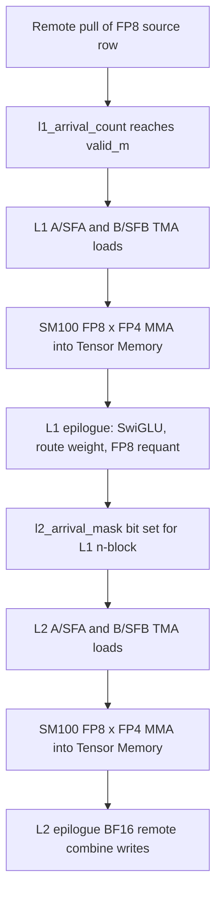
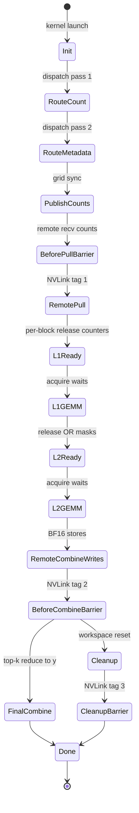
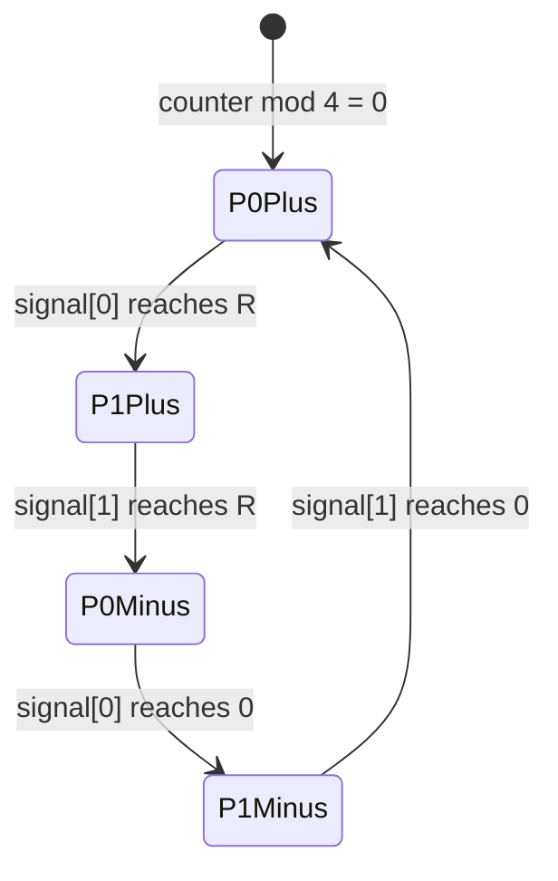

# DeepGEMM Mega MoE: A Kernel-Author Implementation Manual

**Source cutoff:** `deepseek-ai/DeepGEMM` commit `891d57b4db1071624b5c8fa0d1e51cb317fa709f`.
**Platform focus:** NVIDIA Blackwell SM100, FP8 activations by FP4 weights, UE8M0 block scales, BF16 output.
**Audience:** GPU and LLM systems engineers who want enough source-grounded detail to design a similar fused MoE kernel from scratch.
**Evidence policy:** Repository claims are pinned to the source cutoff. Hardware terminology is clarified with official NVIDIA documentation. Performance explanations are marked as inferred unless tied to a measured run.

## Abstract

DeepGEMM's Mega MoE path is not a single GEMM with a larger API surface. It is a fused distributed expert feed-forward layer. The public README describes the operation as a single "mega-kernel" that fuses expert-parallel dispatch, Linear 1, SwiGLU, Linear 2, expert-parallel combine, and overlap between NVLink communication and tensor-core computation ([README Mega MoE](https://github.com/deepseek-ai/DeepGEMM/blob/891d57b4db1071624b5c8fa0d1e51cb317fa709f/README.md#L114-L140)). At commit `891d57b4`, the implementation is SM100-only: the C++ API dispatches into the SM100 implementation when `arch_major == 10` and rejects other architectures ([C++ architecture gate](https://github.com/deepseek-ai/DeepGEMM/blob/891d57b4db1071624b5c8fa0d1e51cb317fa709f/csrc/apis/mega.hpp#L203-L219)).

Conceptually, each rank owns a batch of local tokens, each token chooses up to $K_{\text{top}}$ global experts, and each global expert is statically owned by one rank. The kernel first exchanges route metadata through PyTorch symmetric memory, then pulls FP8 token rows into a local expert pool on the destination rank, runs two FP8xFP4 block-scaled SM100 matrix multiplies with a fused SwiGLU and route-weight epilogue between them, writes BF16 expert contributions back into source-rank combine slots, and finally reduces valid top-k slots into the caller's BF16 output.

The algorithmic contract is the MoE feed-forward equation:

$$
\begin{aligned}
e_{r,t,s} &\in \{-1, 0, \ldots, E-1\}, \\
\rho(e) &= \left\lfloor e / E_r \right\rfloor, \\
q(e) &= e \bmod E_r, \\
\begin{bmatrix} g_{r,t,s} \\ u_{r,t,s} \end{bmatrix}
&= W^{(1)}_{e_{r,t,s}} x_{r,t}, \\
z_{r,t,s} &= a_{r,t,s} \cdot \operatorname{SiLU}(g_{r,t,s}) \odot u_{r,t,s}, \\
o_{r,t,s} &= W^{(2)}_{e_{r,t,s}} z_{r,t,s}, \\
y_{r,t} &= \sum_{s: e_{r,t,s} \ge 0} o_{r,t,s}.
\end{aligned}
$$

Symbols: $r$ is the source rank, $t$ is the token index on that rank, $s$ is the top-k route slot, $E$ is total experts, $E_r = E/R$ is experts per rank, $\rho(e)$ is the rank that owns global expert $e$, $q(e)$ is the local expert index on that rank, $x$ is the input token, $a$ is the route weight, $W^{(1)}$ maps hidden dimension $H$ to $2I$, $W^{(2)}$ maps intermediate dimension $I$ back to $H$, $g$ and $u$ are gate and up-projection halves, $z$ is the weighted SwiGLU activation, $o$ is one expert contribution, and $y$ is the final BF16 output token.

The real kernel implements this contract with FP8 E4M3 activations, packed FP4 E2M1 weights, UE8M0 scale factors, FP32 tensor-core accumulation, FP8 requantization between the two linears, BF16 expert writeback, and BF16 final output. The public wrapper and tests show that callers copy FP8 inputs, packed input scales, top-k indices, and top-k weights into a symmetric buffer before every call ([Python buffer wrapper](https://github.com/deepseek-ai/DeepGEMM/blob/891d57b4db1071624b5c8fa0d1e51cb317fa709f/deep_gemm/mega/__init__.py#L16-L72), [test setup and call](https://github.com/deepseek-ai/DeepGEMM/blob/891d57b4db1071624b5c8fa0d1e51cb317fa709f/tests/test_mega_moe.py#L52-L121)).

Inferred design rationale: fusing dispatch, both GEMMs, activation, requantization, combine, and cleanup into one persistent kernel is primarily a latency and overlap strategy. The source directly shows separate warp roles for dispatch, TMA loads, MMA issue, epilogues, combine, and cleanup; the exact speedup is workload-dependent and is not claimed here without running the benchmark.

## 1. Scope, Notation, and Kernel-Author Blueprint

### 1.1 Scope

This section covers only the SM100 FP8xFP4 Mega MoE forward path at the stated commit. The intended reader is a CUDA kernel author who understands GEMM tiling, Tensor Memory Accelerator (TMA), asynchronous barriers, and distributed MoE at a high level, but wants a source-grounded map of this specific fused kernel.

Covered:

- The public Mega MoE contract exposed through `get_symm_buffer_for_mega_moe`, `transform_weights_for_mega_moe`, and `fp8_fp4_mega_moe`.
- Global dimensions, rank ownership, route metadata, and expert-local pooling.
- The mathematical MoE contract and where the implementation intentionally changes numeric staging through quantization.
- FP8 E4M3, FP4 E2M1, BF16, FP32, and UE8M0 scale factors at a conceptual kernel-author level.
- The fused dataflow: metadata dispatch, remote token pull, Linear 1, SwiGLU, FP8 requantization, Linear 2, remote BF16 combine write, final top-k reduction, and workspace cleanup.
- The source and evidence policy for the full paper.
- A roadmap for implementing a similar SM100 fused MoE kernel.

Intentionally not covered:

- SM90, dense GEMM APIs, MQA kernels, HyperConnection kernels, backward kernels, or training optimizer behavior.
- Router network design, top-k softmax computation, load-balancing losses, or how `topk_idx` and `topk_weights` are produced before the kernel.
- Full explanations of NVIDIA PTX, TMA, Tensor Memory, `tcgen05`, `mbarrier`, or NVLink hardware. These are linked as external references only where they define terms used by the kernel.
- A measured performance claim. The test harness contains benchmark accounting, but this draft does not run it ([test benchmark accounting](https://github.com/deepseek-ai/DeepGEMM/blob/891d57b4db1071624b5c8fa0d1e51cb317fa709f/tests/test_mega_moe.py#L217-L239)).
- A portable library design. This is a blueprint for one aggressively specialized SM100 kernel family.

### 1.2 Mental Model

Think of the kernel as a distributed MoE feed-forward layer that owns its own temporary network protocol.

In a conventional decomposition, the runtime might launch one communication kernel for dispatch, one or more grouped GEMMs for Linear 1, an activation kernel, one or more grouped GEMMs for Linear 2, a communication kernel for combine, and a reduction kernel. DeepGEMM instead places all of these inside one persistent grid. The symmetric buffer gives every rank a registered byte region that can be addressed by other ranks. The kernel uses that buffer for route counts, source-token metadata, pulled activations, intermediate activations, remote BF16 contribution slots, and synchronization words.


Diagram notation key: "local symmetric views" are $x$, `x_sf`, `topk_idx`, and `topk_weights` inside the per-rank symmetric byte buffer. "Remote metadata writes" means writes through symmetric-memory address mapping, not a separate host all-to-all launch. "Expert pool" is the destination-rank layout where rows are grouped by local expert. "Block scaled MMA" means SM100 `tcgen05` MMA with FP8/FP4 data and UE8M0 scale factors.

The kernel is organized around four ideas:

1. Symmetric memory replaces explicit all-to-all buffers. A pointer inside the local registered buffer can be mapped to the corresponding logical address in another rank's registered buffer ([symmetric pointer mapping](https://github.com/deepseek-ai/DeepGEMM/blob/891d57b4db1071624b5c8fa0d1e51cb317fa709f/deep_gemm/include/deep_gemm/layout/sym_buffer.cuh#L9-L37)).
2. Route metadata moves before token payloads. Dispatch first counts and publishes which source token/top-k pairs belong to each destination expert. Only after an NVLink barrier does the destination rank pull FP8 token rows and scale factors ([dispatch metadata path](https://github.com/deepseek-ai/DeepGEMM/blob/891d57b4db1071624b5c8fa0d1e51cb317fa709f/deep_gemm/include/deep_gemm/impls/sm100_fp8_fp4_mega_moe.cuh#L363-L439), [remote pull path](https://github.com/deepseek-ai/DeepGEMM/blob/891d57b4db1071624b5c8fa0d1e51cb317fa709f/deep_gemm/include/deep_gemm/impls/sm100_fp8_fp4_mega_moe.cuh#L444-L600)).
3. Expert work is scheduled in waves. For a wave of local experts, the scheduler emits all Linear 1 blocks, then all Linear 2 blocks, and then advances to the next wave ([scheduler state machine](https://github.com/deepseek-ai/DeepGEMM/blob/891d57b4db1071624b5c8fa0d1e51cb317fa709f/deep_gemm/include/deep_gemm/scheduler/mega_moe.cuh#L147-L218)).
4. The two GEMMs share a fused epilogue boundary. Linear 1 writes FP8 post-SwiGLU activations and UE8M0 scales for Linear 2, so no separate activation kernel or full-precision intermediate tensor is materialized ([L1 epilogue](https://github.com/deepseek-ai/DeepGEMM/blob/891d57b4db1071624b5c8fa0d1e51cb317fa709f/deep_gemm/include/deep_gemm/impls/sm100_fp8_fp4_mega_moe.cuh#L941-L1123)).

Inferred design rationale: the route-metadata-first protocol reduces cross-rank payload movement to only the tokens actually needed by local experts. The code directly implements metadata writes and later token pulls; the motivation is inferred from this structure and from the fused-overlap goal described in the README.

### 1.3 Global Notation

Use this table throughout the paper. Local sections may add symbols, but should not redefine these.

| Symbol or name | Meaning | Source-grounded constraints |
|---|---|---|
| $R$ | Number of ranks in the process group | `R = len(sym_buffer_ptrs)` in the C++ API and JIT wrapper |
| $r$ | Source rank index | $0 \le r < R$ |
| $E$ | Total number of experts | Must satisfy $E \bmod R = 0$ |
| $E_r$ | Experts per rank | $E_r = E/R$; used by host checks and device template defaults |
| $e$ | Global expert id | Valid route ids are $0 \le e < E$; negative ids are inactive |
| $q$ | Local expert id on owning rank | $q = e \bmod E_r$ |
| $\rho(e)$ | Rank that owns global expert $e$ | $\rho(e)=\lfloor e/E_r\rfloor$ |
| $T$ | Live local token count on a rank | Inferred from `y.size(0)`; must be $T \le T_{\max}$ |
| $T_{\max}$ | Allocated max tokens per rank after alignment | Python aligns requested max tokens by the kernel token alignment |
| $K_{\text{top}}$ | Number of route slots per token | Device code statically requires $K_{\text{top}} \le 32$ |
| $H$ | Hidden size | Must be divisible by `128` for scale-factor packing and checks |
| $I$ | Intermediate hidden size | Must be divisible by `128`; L1 output width is $2I$ |
| $B_M$ | Selected GEMM M tile size over pooled expert rows | Heuristic candidates are source-defined; selected from expected tokens per expert |
| $B_N$ | GEMM N tile size | Mega MoE heuristic fixes this at `128` |
| $B_K$ | GEMM K tile size | Mega MoE heuristic fixes this at `128` |
| $S_M$ | Scale-factor M extent used by SM100 UTCCP path | $S_M = \operatorname{align}(B_M,128)$ |
| $P_{\max}$ | Max pooled routed rows per destination rank | Derived from rank count, token capacity, top-k, and per-expert padding |
| $x$ | Caller-provided FP8 token activations | Shape $[T,H]$ logically; stored in buffer view $[T_{\max},H]$ |
| `x_sf` | Caller-provided packed UE8M0 input scales | Shape $[T_{\max},H/128]$ as `int32`, four scales per word |
| `topk_idx` | Caller-provided global expert ids | Shape $[T_{\max},K_{\text{top}}]$, dtype `int64` |
| `topk_weights` | Caller-provided route weights | Shape $[T_{\max},K_{\text{top}}]$, dtype `float32` |
| $W^{(1)}_e$ | First expert weight | Logical shape $[2I,H]$; packed FP4 storage halves the K byte extent |
| $W^{(2)}_e$ | Second expert weight | Logical shape $[H,I]$; packed FP4 storage halves the K byte extent |
| `l1_acts` | Destination-rank pooled FP8 inputs to Linear 1 | Shape $[P_{\max},H]$ |
| `l2_acts` | Pooled FP8 inputs to Linear 2 | Shape $[P_{\max},I]$ |
| `combine` | BF16 top-k contribution buffer | Logical shape $[K_{\text{top}},T_{\max},H]$ on each source rank |
| $y$ | Caller output | Shape $[T,H]$, dtype BF16 |

Primary source links for this table:

- Buffer view shapes and dtypes are constructed by [C++ symmetric buffer slicing](https://github.com/deepseek-ai/DeepGEMM/blob/891d57b4db1071624b5c8fa0d1e51cb317fa709f/csrc/apis/mega.hpp#L91-L130).
- Host checks for recipe, activation, architecture, weights, hidden/intermediate agreement, stats, and buffer size are in [Mega MoE API checks](https://github.com/deepseek-ai/DeepGEMM/blob/891d57b4db1071624b5c8fa0d1e51cb317fa709f/csrc/apis/mega.hpp#L150-L219).
- Candidate `BLOCK_M` constants and pool capacity are in [Mega MoE layout constants](https://github.com/deepseek-ai/DeepGEMM/blob/891d57b4db1071624b5c8fa0d1e51cb317fa709f/deep_gemm/include/deep_gemm/layout/mega_moe.cuh#L10-L31).
- $B_N$, $B_K$, scale-factor block sizes, stages, and warp counts are selected in [Mega MoE heuristics](https://github.com/deepseek-ai/DeepGEMM/blob/891d57b4db1071624b5c8fa0d1e51cb317fa709f/csrc/jit_kernels/heuristics/mega_moe.hpp#L178-L238).

### 1.4 Dimensions, Ranks, and Layout Invariants

The rank ownership rule is simple and should be the first invariant in any implementation:

$$
E_r = \frac{E}{R}, \qquad
\rho(e) = \left\lfloor \frac{e}{E_r} \right\rfloor, \qquad
q(e) = e - \rho(e)E_r.
$$

Symbols: $E_r$ is experts per rank, $E$ is total experts, $R$ is rank count, $\rho(e)$ is the owner rank for global expert $e$, and $q(e)$ is the expert's local index on that rank. The source computes destination rank and local expert exactly this way during dispatch ([dispatch mapping](https://github.com/deepseek-ai/DeepGEMM/blob/891d57b4db1071624b5c8fa0d1e51cb317fa709f/deep_gemm/include/deep_gemm/impls/sm100_fp8_fp4_mega_moe.cuh#L400-L407)).

The allocated token capacity is aligned upward:

$$
T_{\max} = \operatorname{align}(T_{\max}^{\text{requested}}, 384).
$$

Symbols: $T_{\max}^{\mathrm{requested}}$ is the caller's maximum token count per rank, $T_{\max}$ is the actual capacity passed into buffer allocation, and `384` is the token alignment returned by `get_token_alignment_for_mega_moe`. The value comes from `kLCMCandidateBlockM`, the least-common multiple used across candidate M tile sizes ([Python alignment](https://github.com/deepseek-ai/DeepGEMM/blob/891d57b4db1071624b5c8fa0d1e51cb317fa709f/deep_gemm/mega/__init__.py#L58-L72), [layout constants](https://github.com/deepseek-ai/DeepGEMM/blob/891d57b4db1071624b5c8fa0d1e51cb317fa709f/deep_gemm/include/deep_gemm/layout/mega_moe.cuh#L10-L15)).

The destination-rank expert pool must be large enough for the worst case number of routed rows that one rank might receive, plus per-expert tile padding:

$$
P_{\max} =
\operatorname{align}
\left(
R T_{\max} \min(K_{\text{top}}, E_r)
+ E_r(B_{M,\max} - 1),
384
\right).
$$

Symbols: $P_{\max}$ is max pooled route rows on a destination rank, $R T_{\max}$ is the maximum source tokens across all ranks, $\min(K_{\text{top}},E_r)$ bounds how many routes from one source token can target the same destination rank, $B_{M,\max}=192$ is the largest candidate `BLOCK_M`, and $E_r(B_{M,\max}-1)$ covers per-expert padding. This is the source formula in layout form ([pool capacity formula](https://github.com/deepseek-ai/DeepGEMM/blob/891d57b4db1071624b5c8fa0d1e51cb317fa709f/deep_gemm/include/deep_gemm/layout/mega_moe.cuh#L16-L25)).

The selected tile shape is heuristic:

$$
\mu = \frac{T R K_{\text{top}}}{E}.
$$

Symbols: $\mu$ is expected routed rows per global expert, $T$ is live tokens per rank, $R$ is rank count, $K_{\text{top}}$ is number of route slots per token, and $E$ is total experts. The heuristic chooses smaller $B_M$ for small $\mu$ and larger $B_M$ for larger $\mu$; $B_N = 128$ and $B_K = 128$ are fixed for Mega MoE at this commit ([block heuristic](https://github.com/deepseek-ai/DeepGEMM/blob/891d57b4db1071624b5c8fa0d1e51cb317fa709f/csrc/jit_kernels/heuristics/mega_moe.hpp#L58-L93), [fixed N/K choices](https://github.com/deepseek-ai/DeepGEMM/blob/891d57b4db1071624b5c8fa0d1e51cb317fa709f/csrc/jit_kernels/heuristics/mega_moe.hpp#L183-L190)).

The implementation requires:

- $E \bmod R = 0$.
- $T \le T_{\max}$.
- `H % 128 == 0` and `I % 128 == 0`.
- $K_{\text{top}} \le 32$.
- Recipe `(1, 1, 32)` and activation `swiglu`.
- SM100 architecture.
- L1 logical weight shape $[E_r,2I,H]$.
- L2 logical weight shape $[E_r,H,I]$.
- K-major contiguous packed FP4 weight layout after the required weight transform.

These constraints are not optional tuning advice; they are asserted by the C++ API or static device checks ([host checks](https://github.com/deepseek-ai/DeepGEMM/blob/891d57b4db1071624b5c8fa0d1e51cb317fa709f/csrc/apis/mega.hpp#L150-L219), [device static checks](https://github.com/deepseek-ai/DeepGEMM/blob/891d57b4db1071624b5c8fa0d1e51cb317fa709f/deep_gemm/include/deep_gemm/impls/sm100_fp8_fp4_mega_moe.cuh#L67-L180)).

### 1.5 Mathematical Contract

For a single valid route, the ideal real-valued expert computation is:

$$
h^{(1)}_{r,t,s} = W^{(1)}_{e_{r,t,s}} x_{r,t}
\in \mathbb{R}^{2I}.
$$

Symbols: $h^{(1)}$ is the Linear 1 result, $W^{(1)}$ is the selected expert's first weight matrix, $x$ is the hidden vector, and $2I$ is split into gate and up halves.

Split:

$$
h^{(1)}_{r,t,s} =
\begin{bmatrix}
g_{r,t,s} \\
u_{r,t,s}
\end{bmatrix},
\qquad
g_{r,t,s}, u_{r,t,s} \in \mathbb{R}^{I}.
$$

Symbols: $g$ is the gate vector and $u$ is the up vector.

Apply SwiGLU and route weight:

$$
z_{r,t,s}
= a_{r,t,s}
\cdot
\left(
\operatorname{SiLU}(g_{r,t,s}) \odot u_{r,t,s}
\right),
\qquad
\operatorname{SiLU}(g) = \frac{g}{1 + \exp(-g)}.
$$

Symbols: $a$ is the scalar route weight from `topk_weights`, $z$ is the post-activation vector, and $\odot$ is elementwise multiplication. The device epilogue applies optional clamping, computes the SiLU expression, multiplies by route weight, reduces amax, and requantizes to FP8 for Linear 2 ([SwiGLU and FP8 requantization](https://github.com/deepseek-ai/DeepGEMM/blob/891d57b4db1071624b5c8fa0d1e51cb317fa709f/deep_gemm/include/deep_gemm/impls/sm100_fp8_fp4_mega_moe.cuh#L993-L1093)).

Then:

$$
o_{r,t,s} = W^{(2)}_{e_{r,t,s}} z_{r,t,s}
\in \mathbb{R}^{H},
\qquad
y_{r,t} = \sum_{s: e_{r,t,s} \ge 0} o_{r,t,s}.
$$

Symbols: $o$ is one routed expert's output contribution, $W^{(2)}$ is the selected expert's second weight matrix, and $y$ is the final hidden vector for token $(r,t)$. Linear 2 writes each $o$ to a BF16 combine slot on the source rank, and the final combine step sums valid top-k slots ([L2 remote write](https://github.com/deepseek-ai/DeepGEMM/blob/891d57b4db1071624b5c8fa0d1e51cb317fa709f/deep_gemm/include/deep_gemm/impls/sm100_fp8_fp4_mega_moe.cuh#L1128-L1224), [final combine](https://github.com/deepseek-ai/DeepGEMM/blob/891d57b4db1071624b5c8fa0d1e51cb317fa709f/deep_gemm/include/deep_gemm/impls/sm100_fp8_fp4_mega_moe.cuh#L1242-L1370)).

A kernel author should treat the implementation as the following numerically staged approximation:

$$
\widehat{x}_{r,t} = Q_{\mathrm{FP8}}(x_{r,t}; s^x_{r,t}),
\qquad
\widehat{W}^{(1)}_e = Q_{\mathrm{FP4}}(W^{(1)}_e; s^{W1}_e),
\qquad
\widehat{W}^{(2)}_e = Q_{\mathrm{FP4}}(W^{(2)}_e; s^{W2}_e).
$$

Symbols: $Q_{\mathrm{FP8}}$ and $Q_{\mathrm{FP4}}$ are conceptual quantizers, $s^x$ is an input scale, and $s^{W1}$, $s^{W2}$ are expert weight scales. In the source, tests cast activations to FP8 with packed UE8M0 scales and weights to packed FP4 with transformed scales before calling the fused kernel ([test quantization setup](https://github.com/deepseek-ai/DeepGEMM/blob/891d57b4db1071624b5c8fa0d1e51cb317fa709f/tests/test_mega_moe.py#L80-L101)).

The route weight is applied before Linear 2:

$$
W^{(2)}_e(a z) = a W^{(2)}_e z
$$

in exact arithmetic. Symbols: $a$ is a scalar route weight and $z$ is the unweighted SwiGLU activation. In this implementation, the equality explains why the route weight can be fused into the Linear 1 epilogue. The quantized kernel fixes a particular rounding point: it multiplies by $a$, then quantizes the weighted activation to FP8 before Linear 2.

Inferred design rationale: applying the route weight before Linear 2 lets the final combine reduction be an unweighted sum over BF16 contribution slots. This is directly consistent with the code structure, but the source does not state it as a design rationale.

### 1.6 Precision Formats and Scaling

This paper should use precision terms in the following restricted way.

FP8 E4M3 activation:

- Used for caller inputs $x$, pooled Linear 1 activations, and pooled Linear 2 activations.
- The test utility computes one scale per `gran_k` group, divides by the scale, and casts to `torch.float8_e4m3fn`; Mega MoE uses `gran_k = 32` for inputs ([FP8 utility](https://github.com/deepseek-ai/DeepGEMM/blob/891d57b4db1071624b5c8fa0d1e51cb317fa709f/deep_gemm/utils/math.py#L25-L37), [test input cast](https://github.com/deepseek-ai/DeepGEMM/blob/891d57b4db1071624b5c8fa0d1e51cb317fa709f/tests/test_mega_moe.py#L85-L87)).
- NVIDIA PTX documents E4M3 as an 8-bit alternate floating-point format with 4 exponent bits and 3 mantissa bits ([PTX alternate floating-point formats](https://docs.nvidia.com/cuda/archive/13.2.0/parallel-thread-execution/index.html#alternate-floating-point-data-formats)).

FP4 E2M1 weights:

- Used for L1 and L2 expert weights on SM100.
- Stored packed, two 4-bit values per byte. The host shape checker expands the logical K dimension for packed FP4 tensors ([packed FP4 shape check](https://github.com/deepseek-ai/DeepGEMM/blob/891d57b4db1071624b5c8fa0d1e51cb317fa709f/csrc/utils/layout.hpp#L45-L60)).
- The test utility shows a conceptual quantization table with magnitude levels `{0, 0.5, 1, 1.5, 2, 3, 4, 6}` and a sign bit for nonzero values ([FP4 utility](https://github.com/deepseek-ai/DeepGEMM/blob/891d57b4db1071624b5c8fa0d1e51cb317fa709f/deep_gemm/utils/math.py#L72-L101)).
- NVIDIA PTX documents E2M1 as a 4-bit alternate floating-point format used in packed form ([PTX alternate floating-point formats](https://docs.nvidia.com/cuda/archive/13.2.0/parallel-thread-execution/index.html#alternate-floating-point-data-formats)).

UE8M0 scale factors:

- Used for SM100 packed scale factors.
- Conceptually a power-of-two scale with an 8-bit exponent and no mantissa.
- DeepGEMM packs four UE8M0 scale bytes into one `int32` for SM100 scale tensors, which is why `x_sf` has shape $[T_{\max},H/128]$ for 32-element K groups.
- Scale-factor layout is transformed to an MN-major, TMA-compatible, UTCCP-friendly representation for SM100 ([scale transform API](https://github.com/deepseek-ai/DeepGEMM/blob/891d57b4db1071624b5c8fa0d1e51cb317fa709f/csrc/apis/layout.hpp#L47-L60), [weight transform helper](https://github.com/deepseek-ai/DeepGEMM/blob/891d57b4db1071624b5c8fa0d1e51cb317fa709f/deep_gemm/mega/__init__.py#L87-L105)).

FP32 accumulation:

- SM100 block-scaled MMA accumulates into FP32 in Tensor Memory. The kernel uses CUTLASS/CuTe instruction descriptors and issues `tcgen05.mma` through a DeepGEMM PTX wrapper ([MMA issue path](https://github.com/deepseek-ai/DeepGEMM/blob/891d57b4db1071624b5c8fa0d1e51cb317fa709f/deep_gemm/include/deep_gemm/impls/sm100_fp8_fp4_mega_moe.cuh#L777-L873), [DeepGEMM tcgen05 wrapper](https://github.com/deepseek-ai/DeepGEMM/blob/891d57b4db1071624b5c8fa0d1e51cb317fa709f/deep_gemm/include/deep_gemm/ptx/tcgen05.cuh#L40-L80)).
- NVIDIA PTX documents `tcgen05` as the 5th-generation tensor-core instruction family ([PTX tcgen05 documentation](https://docs.nvidia.com/cuda/archive/13.2.0/parallel-thread-execution/index.html#tensorcore-5th-generation-instructions-tcgen05-mma)).

BF16 output:

- Linear 2 epilogue casts FP32 accumulator values to BF16 before remote combine slot writes.
- Final combine accumulates BF16 slot chunks in FP32 registers, casts back to BF16, and stores $y$ ([final combine reduction](https://github.com/deepseek-ai/DeepGEMM/blob/891d57b4db1071624b5c8fa0d1e51cb317fa709f/deep_gemm/include/deep_gemm/impls/sm100_fp8_fp4_mega_moe.cuh#L1323-L1369)).

Kernel-author rule: never describe "FP8xFP4" as one format. It is a mixed-precision computation using FP8 activations, FP4 weights, UE8M0 block scales, FP32 accumulation, FP8 intermediate requantization, and BF16 externally visible output.

### 1.7 Shared Source and Evidence Policy

Use these evidence labels in the full paper:

| Evidence label | Meaning | Example |
|---|---|---|
| `source-direct` | Directly visible in DeepGEMM source at commit `891d57b4` | API assertions, buffer shapes, kernel branches, scheduler state |
| `test-direct` | Directly visible in DeepGEMM tests or benchmark harness | Quantization setup, equality check against optional baseline, FLOP/byte accounting |
| `official-docs` | NVIDIA or PyTorch documentation used to define hardware/runtime terms | PTX data formats, TMA, Tensor Memory, `mbarrier`, `tcgen05` |
| `inferred` | Reasoning from source structure, comments, or constraints, not stated as a measured result | Bottleneck analysis, why a particular fusion boundary likely exists |
| `out-of-scope` | Known related material intentionally excluded | SM90, MQA, backward, router design |

Source rules:

- Anchor repository claims to commit-specific GitHub links.
- Prefer source files over generated documentation.
- Do not generalize Mega MoE claims to dense GEMM or SM90 unless the cited source explicitly supports it.
- Mark performance claims as `inferred` unless they come from a benchmark run with shape, hardware, precision, rank count, and baseline stated.
- Treat comments in source as evidence for developer intent only when quoted or paraphrased close to the relevant code.
- For external hardware terms, cite official NVIDIA docs rather than third-party summaries.

Primary source map:

| Concept | Evidence | Link |
|---|---|---|
| Public README description | `source-direct` | [README Mega MoE](https://github.com/deepseek-ai/DeepGEMM/blob/891d57b4db1071624b5c8fa0d1e51cb317fa709f/README.md#L114-L140) |
| Python symmetric buffer wrapper | `source-direct` | [deep_gemm/mega/__init__.py](https://github.com/deepseek-ai/DeepGEMM/blob/891d57b4db1071624b5c8fa0d1e51cb317fa709f/deep_gemm/mega/__init__.py#L16-L72) |
| Weight transform for Mega MoE | `source-direct` | [Mega MoE weight transform](https://github.com/deepseek-ai/DeepGEMM/blob/891d57b4db1071624b5c8fa0d1e51cb317fa709f/deep_gemm/mega/__init__.py#L75-L105) |
| Host API validation and slicing | `source-direct` | [csrc/apis/mega.hpp](https://github.com/deepseek-ai/DeepGEMM/blob/891d57b4db1071624b5c8fa0d1e51cb317fa709f/csrc/apis/mega.hpp#L18-L225) |
| Workspace and buffer layout | `source-direct` | [layout/mega_moe.cuh](https://github.com/deepseek-ai/DeepGEMM/blob/891d57b4db1071624b5c8fa0d1e51cb317fa709f/deep_gemm/include/deep_gemm/layout/mega_moe.cuh#L40-L258) |
| Symmetric pointer mapping | `source-direct` | [layout/sym_buffer.cuh](https://github.com/deepseek-ai/DeepGEMM/blob/891d57b4db1071624b5c8fa0d1e51cb317fa709f/deep_gemm/include/deep_gemm/layout/sym_buffer.cuh#L9-L37) |
| Heuristic config | `source-direct` | [heuristics/mega_moe.hpp](https://github.com/deepseek-ai/DeepGEMM/blob/891d57b4db1071624b5c8fa0d1e51cb317fa709f/csrc/jit_kernels/heuristics/mega_moe.hpp#L58-L238) |
| JIT launch wrapper | `source-direct` | [sm100 launch wrapper](https://github.com/deepseek-ai/DeepGEMM/blob/891d57b4db1071624b5c8fa0d1e51cb317fa709f/csrc/jit_kernels/impls/sm100_fp8_fp4_mega_moe.hpp#L51-L218) |
| Device kernel | `source-direct` | [sm100_fp8_fp4_mega_moe.cuh](https://github.com/deepseek-ai/DeepGEMM/blob/891d57b4db1071624b5c8fa0d1e51cb317fa709f/deep_gemm/include/deep_gemm/impls/sm100_fp8_fp4_mega_moe.cuh#L49-L1380) |
| Persistent scheduler | `source-direct` | [scheduler/mega_moe.cuh](https://github.com/deepseek-ai/DeepGEMM/blob/891d57b4db1071624b5c8fa0d1e51cb317fa709f/deep_gemm/include/deep_gemm/scheduler/mega_moe.cuh#L12-L218) |
| Grid and NVLink barriers | `source-direct` | [comm/barrier.cuh](https://github.com/deepseek-ai/DeepGEMM/blob/891d57b4db1071624b5c8fa0d1e51cb317fa709f/deep_gemm/include/deep_gemm/comm/barrier.cuh#L18-L81) |
| Test harness and benchmark accounting | `test-direct` | [tests/test_mega_moe.py](https://github.com/deepseek-ai/DeepGEMM/blob/891d57b4db1071624b5c8fa0d1e51cb317fa709f/tests/test_mega_moe.py#L43-L239) |
| PTX data formats and `tcgen05` | `official-docs` | [NVIDIA PTX ISA](https://docs.nvidia.com/cuda/archive/13.2.0/parallel-thread-execution/index.html) |

### 1.8 Fused Pipeline Overview

A similar kernel needs six layers of state:

1. Caller-visible state: $x$, `x_sf`, `topk_idx`, `topk_weights`, weights, optional stats, and output $y$.
2. Symmetric workspace state: barrier words, expert counts, route metadata, arrival counters, and source metadata.
3. Pooled expert state: L1 activations, L1 scales, route weights, L2 activations, L2 scales.
4. TMA/Tensor Memory state: tensor maps, shared-memory stages, scale-factor staging, accumulator stages.
5. Scheduler state: current expert wave, phase, M/N/K block ids, and per-expert token counts.
6. Combine state: BF16 top-k slots and final $y$ reduction.

The source implementation makes warp roles explicit:

| Role | Work | Key source |
|---|---|---|
| Dispatch warps | Scan routes, count experts, write metadata, pull tokens, copy scales, store route weights and source metadata, clean workspace | [dispatch path](https://github.com/deepseek-ai/DeepGEMM/blob/891d57b4db1071624b5c8fa0d1e51cb317fa709f/deep_gemm/include/deep_gemm/impls/sm100_fp8_fp4_mega_moe.cuh#L359-L660) |
| A/SFA TMA warp | Load activation tiles and activation scale factors | [activation TMA loader](https://github.com/deepseek-ai/DeepGEMM/blob/891d57b4db1071624b5c8fa0d1e51cb317fa709f/deep_gemm/include/deep_gemm/impls/sm100_fp8_fp4_mega_moe.cuh#L661-L729) |
| B/SFB TMA warp | Load packed FP4 weight tiles and weight scale factors | [weight TMA loader](https://github.com/deepseek-ai/DeepGEMM/blob/891d57b4db1071624b5c8fa0d1e51cb317fa709f/deep_gemm/include/deep_gemm/impls/sm100_fp8_fp4_mega_moe.cuh#L730-L772) |
| MMA issue warp | Copy scales via UTCCP and issue SM100 block-scaled MMA | [MMA issue path](https://github.com/deepseek-ai/DeepGEMM/blob/891d57b4db1071624b5c8fa0d1e51cb317fa709f/deep_gemm/include/deep_gemm/impls/sm100_fp8_fp4_mega_moe.cuh#L777-L873) |
| Epilogue warps | Consume Tensor Memory accumulators, perform L1/L2 epilogues, and run final combine | [epilogue and combine path](https://github.com/deepseek-ai/DeepGEMM/blob/891d57b4db1071624b5c8fa0d1e51cb317fa709f/deep_gemm/include/deep_gemm/impls/sm100_fp8_fp4_mega_moe.cuh#L887-L1370) |

The synchronization plan has three visible levels:

- Cluster-level synchronization for two-CTA Tensor Memory allocation and CTA-pair operations.
- Intra-kernel full/empty barriers for shared-memory/Tensor Memory producer-consumer staging.
- Cross-rank NVLink barriers built on grid sync and symmetric-memory signal words.

Source-direct details:

- Cluster sync and Tensor Memory allocation appear near kernel initialization ([cluster sync and allocation](https://github.com/deepseek-ai/DeepGEMM/blob/891d57b4db1071624b5c8fa0d1e51cb317fa709f/deep_gemm/include/deep_gemm/impls/sm100_fp8_fp4_mega_moe.cuh#L272-L313)).
- Barrier arrays are allocated for dispatch, full, empty, tensor-memory full, tensor-memory empty, and combine staging ([barrier layout](https://github.com/deepseek-ai/DeepGEMM/blob/891d57b4db1071624b5c8fa0d1e51cb317fa709f/deep_gemm/include/deep_gemm/impls/sm100_fp8_fp4_mega_moe.cuh#L262-L270)).
- NVLink barriers separate metadata dispatch from payload pull, remote BF16 writes from combine reduction, and workspace cleanup from subsequent use ([barrier tags](https://github.com/deepseek-ai/DeepGEMM/blob/891d57b4db1071624b5c8fa0d1e51cb317fa709f/deep_gemm/include/deep_gemm/impls/sm100_fp8_fp4_mega_moe.cuh#L340-L343), [NVLink barrier helper](https://github.com/deepseek-ai/DeepGEMM/blob/891d57b4db1071624b5c8fa0d1e51cb317fa709f/deep_gemm/include/deep_gemm/comm/barrier.cuh#L37-L81)).

### 1.9 Implementation Roadmap for a Similar Kernel

This roadmap is ordered by dependency. A kernel author should resist starting at the MMA loop; the communication, layout, and quantization contracts determine what the MMA loop must consume.

1. Define the MoE contract.

   Decide whether route weights are applied before or after Linear 2, what dtype the final combine accumulates in, how masked routes are represented, and whether exact baseline equality is a requirement.

2. Freeze rank ownership and route metadata.

   Implement $\rho(e)=\lfloor e/E_r\rfloor$ and $q(e)=e \bmod E_r$. Define a compact source-route id such as $tK_{\text{top}}+s$, plus a reverse metadata record such as `{rank, token, slot}` for remote combine writes. DeepGEMM uses both ([workspace metadata](https://github.com/deepseek-ai/DeepGEMM/blob/891d57b4db1071624b5c8fa0d1e51cb317fa709f/deep_gemm/include/deep_gemm/layout/mega_moe.cuh#L33-L38), [source metadata store](https://github.com/deepseek-ai/DeepGEMM/blob/891d57b4db1071624b5c8fa0d1e51cb317fa709f/deep_gemm/include/deep_gemm/impls/sm100_fp8_fp4_mega_moe.cuh#L541-L600)).

3. Design the symmetric buffer layout.

   Allocate one same-sized registered byte buffer per rank. Put synchronization words first, then caller-filled input views, pooled L1/L2 views, and combine slots. Make buffer slicing deterministic on host and device. DeepGEMM derives the same layout in C++ slicing and device code ([host slicing](https://github.com/deepseek-ai/DeepGEMM/blob/891d57b4db1071624b5c8fa0d1e51cb317fa709f/csrc/apis/mega.hpp#L18-L130), [device buffer layout](https://github.com/deepseek-ai/DeepGEMM/blob/891d57b4db1071624b5c8fa0d1e51cb317fa709f/deep_gemm/include/deep_gemm/impls/sm100_fp8_fp4_mega_moe.cuh#L93-L159)).

4. Specify quantization and scale layouts.

   Decide activation granularity, weight granularity, packed-scale format, and UTCCP/TMA layout. For DeepGEMM Mega MoE, input and intermediate activations use FP8 E4M3, weights use packed FP4 E2M1, and scale factors use packed UE8M0. L1 weights are also interleaved so the epilogue can consume gate/up pairs locally ([weight interleave and scale transpose](https://github.com/deepseek-ai/DeepGEMM/blob/891d57b4db1071624b5c8fa0d1e51cb317fa709f/deep_gemm/mega/__init__.py#L75-L105)).

5. Build host-side validation before writing the kernel.

   Validate architecture, hidden/intermediate divisibility, recipe, activation, weight layout, scale layout, stats layout, buffer size, and rank/expert divisibility. DeepGEMM's C++ API is a good checklist ([Mega MoE API checks](https://github.com/deepseek-ai/DeepGEMM/blob/891d57b4db1071624b5c8fa0d1e51cb317fa709f/csrc/apis/mega.hpp#L150-L219)).

6. Specialize through JIT or templates.

   Make token capacity, dimensions, rank count, expert count, top-k, tile shape, stage count, and activation clamp compile-time constants where they control shared memory, static assertions, or loop unrolling. DeepGEMM generates a template instantiation string and launches through a JIT runtime ([kernel generation](https://github.com/deepseek-ai/DeepGEMM/blob/891d57b4db1071624b5c8fa0d1e51cb317fa709f/csrc/jit_kernels/impls/sm100_fp8_fp4_mega_moe.hpp#L51-L89)).

7. Implement metadata dispatch.

   Scan route slots, skip negative experts, count per-expert work, publish source-route ids to destination ranks, publish receive counts, and place an NVLink barrier before payload pulls. This is the first correctness-critical distributed section.

8. Implement remote pull into local expert pools.

   Destination ranks pull FP8 token rows and input scales from source ranks, transform scale row layout as needed, store route weights, and record source metadata for combine. Arrival counters must let the GEMM scheduler know when a block of pooled expert rows is ready.

9. Implement expert-wave scheduling.

   Cache per-expert receive counts, assign persistent blocks over local experts, emit Linear 1 blocks for a wave, then Linear 2 blocks for that wave. The scheduler must account for variable per-expert row counts and tile padding ([scheduler internals](https://github.com/deepseek-ai/DeepGEMM/blob/891d57b4db1071624b5c8fa0d1e51cb317fa709f/deep_gemm/include/deep_gemm/scheduler/mega_moe.cuh#L43-L218)).

10. Implement the SM100 TMA and MMA pipeline.

   Create TMA descriptors for L1/L2 activations, L1/L2 scales, L1/L2 weights, weight scales, and L1 output. Use shared-memory full/empty barriers for tile stages. Copy scale factors to Tensor Memory and issue block-scaled `tcgen05` MMA. DeepGEMM's wrapper constructs nine tensor maps ([TMA descriptor creation](https://github.com/deepseek-ai/DeepGEMM/blob/891d57b4db1071624b5c8fa0d1e51cb317fa709f/csrc/jit_kernels/impls/sm100_fp8_fp4_mega_moe.hpp#L135-L180)).

11. Implement Linear 1 epilogue.

   Load FP32 accumulators from Tensor Memory, pair gate/up lanes, apply optional clamp, compute SwiGLU, multiply route weight, reduce amax, compute UE8M0 scale, store FP8 intermediate activations, store intermediate scales, and mark the corresponding Linear 2 block ready.

12. Implement Linear 2 epilogue and remote BF16 writes.

   Convert Linear 2 FP32 accumulators to BF16, use source metadata to find the original rank/token/top-k slot, and write each contribution into the source rank's combine buffer. Then place an NVLink barrier before local combine reduction.

13. Implement final combine.

   For each local token, identify valid top-k slots, load BF16 slot chunks, accumulate in FP32 registers, cast to BF16, and store $y$. DeepGEMM double-buffers combine loads and uses a separate store buffer ([combine path](https://github.com/deepseek-ai/DeepGEMM/blob/891d57b4db1071624b5c8fa0d1e51cb317fa709f/deep_gemm/include/deep_gemm/impls/sm100_fp8_fp4_mega_moe.cuh#L1242-L1370)).

14. Overlap cleanup and verify reusable state.

   Clear expert counts, arrival counters, and masks before the next call. DeepGEMM overlaps cleanup with the combine epilogue and exposes a debug mode that zeros the whole symmetric buffer after each call ([cleanup path](https://github.com/deepseek-ai/DeepGEMM/blob/891d57b4db1071624b5c8fa0d1e51cb317fa709f/deep_gemm/include/deep_gemm/impls/sm100_fp8_fp4_mega_moe.cuh#L605-L660), [debug zeroing](https://github.com/deepseek-ai/DeepGEMM/blob/891d57b4db1071624b5c8fa0d1e51cb317fa709f/csrc/apis/mega.hpp#L221-L225)).

15. Validate against a decomposed baseline.

   The source test compares the fused result and optional receive stats against a non-overlapped baseline when external dependencies are available ([correctness test](https://github.com/deepseek-ai/DeepGEMM/blob/891d57b4db1071624b5c8fa0d1e51cb317fa709f/tests/test_mega_moe.py#L144-L200)). A new implementation should also test masked routes, small expert loads, large expert loads, uneven rank counts when supported, and all legal $B_M$ choices.

### 1.10 What Later Sections Assume

Later paper sections can assume the following shared preliminaries without redefining them:

- Global expert ids map to `(owner rank, local expert)` by integer division and modulus.
- The kernel computes a top-k MoE feed-forward contract with L1, SwiGLU, L2, and top-k sum.
- `FP8xFP4` means FP8 activations and FP4 weights with UE8M0 block scaling, not a single datatype.
- The symmetric buffer is both the communication substrate and scratch workspace.
- Pooled expert rows are the M dimension for both grouped GEMMs.
- The implementation's source-supported pipeline is dispatch -> pull -> L1 -> SwiGLU/requant -> L2 -> remote write -> combine -> cleanup.
- Claims about "why" a design improves performance should be marked `inferred` unless backed by benchmark data.

### 1.11 Non-Goals and Boundary Conditions

This draft should not be used to claim:

- That DeepGEMM's Mega MoE is generally faster for every MoE shape.
- That the same design applies unchanged to Hopper SM90.
- That the final result is numerically identical to an arbitrary high-precision MoE implementation.
- That router computation, expert load balancing, or top-k normalization happens inside the kernel.
- That the public API is stable beyond commit `891d57b4`.
- That the benchmark harness results are reproduced in this workspace.

The safest summary sentence is:

DeepGEMM Mega MoE at commit `891d57b4` is a source-visible SM100 fused distributed MoE forward kernel whose novelty for a kernel author is the combination of symmetric-memory routing, local expert pooling, SM100 FP8xFP4 block-scaled MMA, fused SwiGLU/requantization, remote BF16 combine writes, and in-kernel top-k reduction.

## 2. Public Contract

This section describes the host-side contract for Mega MoE at
`deepseek-ai/DeepGEMM` commit
`891d57b4db1071624b5c8fa0d1e51cb317fa709f`. Its goal is operational:
a reader should be able to implement a compatible host API without reverse
engineering the CUDA kernel. The contract is intentionally narrower than the
general DeepGEMM package contract. Mega MoE is the fused path that combines EP
dispatch, FP8 x FP4 linear 1, SwiGLU, FP8 x FP4 linear 2, and EP combine in one
multi-rank kernel, and the README states that it requires symmetric memory and
multi-process launch ([README.md](https://github.com/deepseek-ai/DeepGEMM/blob/891d57b4db1071624b5c8fa0d1e51cb317fa709f/README.md#L114-L140)).

### 2.1 Public API Surface

The Python package root re-exports Mega MoE through four names:
`SymmBuffer`, `get_symm_buffer_for_mega_moe`,
`transform_weights_for_mega_moe`, and `fp8_fp4_mega_moe`
([deep_gemm/__init__.py](https://github.com/deepseek-ai/DeepGEMM/blob/891d57b4db1071624b5c8fa0d1e51cb317fa709f/deep_gemm/__init__.py#L83-L89)).
The implementation lives in `deep_gemm/mega/__init__.py`, while validation and
buffer slicing are performed by C++ functions registered from
`csrc/apis/mega.hpp` when TensorMap support is available
([deep_gemm/mega/__init__.py](https://github.com/deepseek-ai/DeepGEMM/blob/891d57b4db1071624b5c8fa0d1e51cb317fa709f/deep_gemm/mega/__init__.py#L16-L128),
[csrc/apis/mega.hpp](https://github.com/deepseek-ai/DeepGEMM/blob/891d57b4db1071624b5c8fa0d1e51cb317fa709f/csrc/apis/mega.hpp#L227-L232)).

| API | Inputs | Output | Host-side meaning |
|---|---|---|---|
| `get_symm_buffer_for_mega_moe(group, num_experts, num_max_tokens_per_rank, num_topk, hidden, intermediate_hidden, use_fp8_dispatch=True, activation="swiglu")` | A distributed process group and static MoE dimensions. | `SymmBuffer` | Allocates one symmetric byte buffer per rank, registers it through PyTorch symmetric memory, zeros it, synchronizes ranks, and exposes typed tensor views. |
| `transform_weights_for_mega_moe(l1_weights, l2_weights)` | Two tuples `(packed_fp4_weight, packed_ue8m0_sf)` for local L1 and L2 experts. | `(transformed_l1, transformed_l2)` | Reorders already quantized weights and scale factors into the Mega MoE kernel layout. It is not a quantizer. |
| `fp8_fp4_mega_moe(y, l1_weights, l2_weights, sym_buffer, cumulative_local_expert_recv_stats=None, recipe=(1, 1, 32), activation="swiglu", activation_clamp=None, fast_math=True)` | Output tensor, transformed local weights, symmetric buffer, optional stats, and specialization flags. | Mutates $y$ and optionally stats. | Launches the fused SM100 Mega MoE kernel. The live token count is `y.size(0)`. |
| `SymmBuffer.destroy()` | None. | None. | Drops Python references to the symmetric-memory handle, raw buffer, group, and some input views. Callers should still order this after all ranks have finished using the buffer. |

The optional `use_fp8_dispatch` argument is forwarded during buffer allocation,
but at this commit the C++ buffer layout is hard-coded around FP8 activations
and the launch-side buffer-size validation recomputes the layout with
`use_fp8_dispatch=true` ([csrc/apis/mega.hpp](https://github.com/deepseek-ai/DeepGEMM/blob/891d57b4db1071624b5c8fa0d1e51cb317fa709f/csrc/apis/mega.hpp#L29-L37),
[csrc/apis/mega.hpp](https://github.com/deepseek-ai/DeepGEMM/blob/891d57b4db1071624b5c8fa0d1e51cb317fa709f/csrc/apis/mega.hpp#L189-L198)).
A compatible host API should treat FP8 dispatch as the only supported public
mode for this kernel.

### 2.2 Symbols and Static Dimensions

The following symbols are used throughout the contract:

| Symbol | Meaning |
|---|---|
| $R$ | Number of ranks in `group`, equal to `group.size()` and to `len(sym_buffer.handle.buffer_ptrs)`. |
| `rank` | Local rank inside the process group. |
| $E$ | Global number of experts, `num_experts`. |
| $E_{\text{rank}}$ | Local experts per rank, `E / R`; $E$ must be divisible by $R$. |
| $T_{\mathrm{req}}$ | Caller-requested maximum tokens per rank. |
| $T_{\max}$ | Aligned maximum tokens per rank stored in `SymmBuffer.num_max_tokens_per_rank`. |
| $T$ | Live tokens for one invocation, inferred from `y.size(0)`. |
| $K_{\text{top}}$ | Number of routed expert choices per token, `num_topk`. |
| $H$ | Hidden size, `hidden`. |
| $I$ | Intermediate hidden size, `intermediate_hidden`. |
| $P$ | Maximum shared local expert token-pool capacity. |
| $P_{\mathrm{sf}}$ | Maximum scale-factor pool rows after block-size padding. |

The token-capacity alignment is:

```text
T_max = align(T_req, 384)
align(x, a) = ceil(x / a) * a
```

The value `384` is returned by `get_token_alignment_for_mega_moe()` and is the
least common multiple used by the candidate `BLOCK_M` values
([deep_gemm/mega/__init__.py](https://github.com/deepseek-ai/DeepGEMM/blob/891d57b4db1071624b5c8fa0d1e51cb317fa709f/deep_gemm/mega/__init__.py#L58-L72),
[csrc/apis/mega.hpp](https://github.com/deepseek-ai/DeepGEMM/blob/891d57b4db1071624b5c8fa0d1e51cb317fa709f/csrc/apis/mega.hpp#L14-L16),
[deep_gemm/include/deep_gemm/layout/mega_moe.cuh](https://github.com/deepseek-ai/DeepGEMM/blob/891d57b4db1071624b5c8fa0d1e51cb317fa709f/deep_gemm/include/deep_gemm/layout/mega_moe.cuh#L10-L15)).

The local expert-pool capacities are:

```text
E_rank = E / R
P = align(R * T_max * min(K_top, E_rank) + E_rank * (192 - 1), 384)
P_sf = max_{B in {8, 16, 32, 64, 96, 128, 192}} (P / B) * align(B, 128)
```

These formulas are the host-visible form of `get_num_max_pool_tokens` and
`get_num_padded_sf_pool_tokens` in the Mega MoE layout utilities
([deep_gemm/include/deep_gemm/layout/mega_moe.cuh](https://github.com/deepseek-ai/DeepGEMM/blob/891d57b4db1071624b5c8fa0d1e51cb317fa709f/deep_gemm/include/deep_gemm/layout/mega_moe.cuh#L16-L31)).

### 2.3 Symmetric-Memory Lifecycle

`get_symm_buffer_for_mega_moe` first aligns $T_{\mathrm{req}}$ to $T_{\max}$, then constructs
`SymmBuffer`. Construction calls the C++ size/slicing function, allocates
`num_bytes` of `torch.int8` CUDA symmetric memory, rendezvous-registers the
buffer across the process group, zeros the buffer, runs a group barrier, and
synchronizes CUDA before exposing tensor views
([deep_gemm/mega/__init__.py](https://github.com/deepseek-ai/DeepGEMM/blob/891d57b4db1071624b5c8fa0d1e51cb317fa709f/deep_gemm/mega/__init__.py#L16-L48)).
The README notes that this path requires PyTorch symmetric memory support,
specifically PyTorch >= 2.9 for the shown usage
([README.md](https://github.com/deepseek-ai/DeepGEMM/blob/891d57b4db1071624b5c8fa0d1e51cb317fa709f/README.md#L116-L123)).

All ranks in the process group must call buffer construction with identical
static dimensions. The C++ size function asserts $E \bmod R = 0$, derives
$E_{\text{rank}}$, builds workspace metadata, appends input/output scratch regions, and
returns both `num_bytes` and a slicing closure
([csrc/apis/mega.hpp](https://github.com/deepseek-ai/DeepGEMM/blob/891d57b4db1071624b5c8fa0d1e51cb317fa709f/csrc/apis/mega.hpp#L18-L90)).
The device-side symmetric pointer wrapper stores the local base pointer plus
remote offsets and maps a local pointer to a destination rank by adding that
rank's offset. It has a compile-time maximum of 72 ranks
([deep_gemm/include/deep_gemm/layout/sym_buffer.cuh](https://github.com/deepseek-ai/DeepGEMM/blob/891d57b4db1071624b5c8fa0d1e51cb317fa709f/deep_gemm/include/deep_gemm/layout/sym_buffer.cuh#L7-L37)).

The raw symmetric buffer begins with a workspace and then places tensor regions
in a fixed order. A compatible host implementation does not need to expose every
region, but it must preserve the same offsets because the kernel uses remote
pointer mapping across ranks.

Algorithm 1 gives the allocation and slicing flow that a compatible host API
must reproduce.

```text
Algorithm 1: AllocateSymmBufferForMegaMoE
Inputs:
  group, E, T_req, K_top, H, I, use_fp8_dispatch=true, activation="swiglu"
Output:
  SymmBuffer object with raw symmetric storage, rendezvous handle, and views

1. R = group.size()
2. Assert E % R == 0.
3. T_max = align(T_req, get_token_alignment_for_mega_moe())  # 384
4. Compute workspace = Workspace(base=null, R, E, T_max, K_top).
5. Compute P and P_sf from the Mega MoE layout formulas.
6. Lay out regions in this order:
     workspace
     x
     x_sf
     topk_idx
     topk_weights
     l1_acts
     l1_acts_sf
     l1_topk_weights
     l2_acts
     l2_acts_sf
     combine_slots
7. num_bytes = end_offset(combine_slots).
8. buffer = symmetric_memory.empty(num_bytes, dtype=int8, device="cuda").
9. handle = symmetric_memory.rendezvous(buffer, group).
10. Zero buffer.
11. group.barrier(); cuda.synchronize().
12. Create typed from_blob views at the computed offsets.
13. Store group, handle, buffer, E, T_max, K_top, H, and I in the wrapper.
```

| Region | Logical shape | Dtype | Bytes per logical row | Exposed in Python |
|---|---:|---|---:|---|
| Workspace | Internal counters, source indices, barriers | mixed | n/a | No |
| $x$ | $[T_{\max},H]$ | `torch.float8_e4m3fn` | $H$ | Yes |
| `x_sf` | $[T_{\max},H/128]$ | `torch.int32` packed UE8M0 | $H/32$ | Yes |
| `topk_idx` | $[T_{\max},K_{\text{top}}]$ | `torch.int64` | $8K_{\text{top}}$ | Yes |
| `topk_weights` | $[T_{\max},K_{\text{top}}]$ | `torch.float32` | $4K_{\text{top}}$ | Yes |
| `l1_acts` | $[P,H]$ | `torch.float8_e4m3fn` | $H$ | Yes |
| `l1_acts_sf` | $[P_{\mathrm{sf}},H/128]$ | `torch.int32` packed UE8M0 | $H/32$ | Yes |
| `l1_topk_weights` | $[P]$ | `torch.float32` | `4` | No |
| `l2_acts` | $[P,I]$ | `torch.float8_e4m3fn` | $I$ | Yes |
| `l2_acts_sf` | $[P_{\mathrm{sf}},I/128]$ | `torch.int32` packed UE8M0 | $I/32$ | Yes |
| Combine slots | $[K_{\text{top}},T_{\max},H]$ | BF16 | $2H$ | No |

The C++ slicing closure constructs the exposed views with `torch::from_blob`.
$x$, `x_sf`, `topk_idx`, `topk_weights`, `l1_acts`, and `l2_acts` use default
contiguous strides. `l1_acts_sf` and `l2_acts_sf` are explicit MN-major views:
their row dimension has stride `1`, and their scale-column dimension has stride
$P_{\mathrm{sf}}$ ([csrc/apis/mega.hpp](https://github.com/deepseek-ai/DeepGEMM/blob/891d57b4db1071624b5c8fa0d1e51cb317fa709f/csrc/apis/mega.hpp#L91-L130)).

The workspace itself reserves bytes for grid/NVLink barriers, expert send and
receive counts, per-expert received-token sums, L1/L2 arrival metadata,
dispatch source token-topk indices, and combine source metadata. Its byte count
is aligned to 16 bytes for TensorMap requirements
([deep_gemm/include/deep_gemm/layout/mega_moe.cuh](https://github.com/deepseek-ai/DeepGEMM/blob/891d57b4db1071624b5c8fa0d1e51cb317fa709f/deep_gemm/include/deep_gemm/layout/mega_moe.cuh#L40-L101),
[deep_gemm/include/deep_gemm/layout/mega_moe.cuh](https://github.com/deepseek-ai/DeepGEMM/blob/891d57b4db1071624b5c8fa0d1e51cb317fa709f/deep_gemm/include/deep_gemm/layout/mega_moe.cuh#L128-L172)).

### 2.4 Tensor Shapes, Dtypes, and Strides

The caller-visible input/output tensors have the following contract.

| Tensor | Shape | Dtype | Required layout | Producer |
|---|---:|---|---|---|
| `buffer.x[:T]` | $[T,H]$ | `torch.float8_e4m3fn` | Contiguous rows, copied into `buffer.x`. | Caller. |
| `buffer.x_sf[:T]` | `[T, H / 128]` | `torch.int32` packed UE8M0 | Contiguous K-major input-scale rows. | Caller. |
| `buffer.topk_idx[:T]` | $[T,K_{\text{top}}]$ | `torch.int64` | Contiguous rows. Entries are global expert ids or negative inactive routes. | Caller. |
| `buffer.topk_weights[:T]` | $[T,K_{\text{top}}]$ | `torch.float32` | Contiguous rows. Used in SwiGLU output scaling. | Caller. |
| $y$ | $[T,H]$ | `torch.bfloat16` | Row-major contiguous by contract. The C++ wrapper does not validate shape, dtype, or stride. | Caller allocates; kernel writes. |
| `cumulative_local_expert_recv_stats` | $[E_{\text{rank}}]$ | `torch.int32` | Contiguous. Optional. | Caller allocates and initializes; kernel adds received-token counts. |

The C++ validation layer infers $T$ from `y.size(0)` and checks
$T \le T_{\max}$, but it does not check `y.size(1)`, `y.dtype`, or `y.stride`.
The device kernel writes $y$ as a flat BF16 row-major buffer using $H$ from the
validated weight shapes, so incompatible $y$ metadata can become memory
corruption rather than a clean host error
([csrc/apis/mega.hpp](https://github.com/deepseek-ai/DeepGEMM/blob/891d57b4db1071624b5c8fa0d1e51cb317fa709f/csrc/apis/mega.hpp#L150-L173),
[csrc/jit_kernels/impls/sm100_fp8_fp4_mega_moe.hpp](https://github.com/deepseek-ai/DeepGEMM/blob/891d57b4db1071624b5c8fa0d1e51cb317fa709f/csrc/jit_kernels/impls/sm100_fp8_fp4_mega_moe.hpp#L187-L217)).

The reference test constructs inputs in the intended way: BF16 activations are
converted to FP8 with per-32-element UE8M0 scale factors packed into `int32`,
then copied into the first $T$ rows of the symmetric buffer before launch
([tests/test_mega_moe.py](https://github.com/deepseek-ai/DeepGEMM/blob/891d57b4db1071624b5c8fa0d1e51cb317fa709f/tests/test_mega_moe.py#L65-L87),
[tests/test_mega_moe.py](https://github.com/deepseek-ai/DeepGEMM/blob/891d57b4db1071624b5c8fa0d1e51cb317fa709f/tests/test_mega_moe.py#L103-L121)).
The packing helper computes `sf = ceil_ue8m0(amax / 448.0)` for FP8 and packs
four UE8M0 exponent bytes into each `torch.int32`
([deep_gemm/utils/math.py](https://github.com/deepseek-ai/DeepGEMM/blob/891d57b4db1071624b5c8fa0d1e51cb317fa709f/deep_gemm/utils/math.py#L13-L37)).

### 2.5 Weight Layouts and Transform Semantics

Mega MoE expects local expert weights only. Global expert $e$ belongs to rank
$\lfloor e/E_{\text{rank}}\rfloor$ and local expert $e \bmod E_{\text{rank}}$; therefore each rank's L1
and L2 weight tensors contain exactly $E_{\text{rank}}$ experts in local-expert order.
The C++ wrapper validates that L1 and L2 have the same local expert count and
that L1's logical output width is $2I$
([csrc/apis/mega.hpp](https://github.com/deepseek-ai/DeepGEMM/blob/891d57b4db1071624b5c8fa0d1e51cb317fa709f/csrc/apis/mega.hpp#L161-L173)).

| Weight tuple | Tensor | Shape before `transform_weights_for_mega_moe` | Shape after transform | Dtype | Required layout |
|---|---|---:|---:|---|---|
| L1 | data | $[E_{\text{rank}},2I,H/2]$ | same shape | `torch.int8` packed FP4 E2M1 | K-major, contiguous; `stride(-1) == 1`. |
| L1 | scale | $[E_{\text{rank}},2I,H/128]$ | same shape | `torch.int32` packed UE8M0 | TMA-aligned MN-major; `stride(-2) == 1`, `stride(-1) == align(2 * I, 4)`. |
| L2 | data | $[E_{\text{rank}},H,I/2]$ | same shape | `torch.int8` packed FP4 E2M1 | K-major, contiguous; `stride(-1) == 1`. |
| L2 | scale | $[E_{\text{rank}},H,I/128]$ | same shape | `torch.int32` packed UE8M0 | TMA-aligned MN-major; `stride(-2) == 1`, `stride(-1) == align(H, 4)`. |

The packed FP4 shape stores two logical K elements in each byte. This is why the
C++ shape checker doubles the last dimension when a K-major tensor has
`torch.int8` packed-FP4 storage; packed FP4 is represented as `torch.kInt8` in
the C++ utility layer
([csrc/utils/layout.hpp](https://github.com/deepseek-ai/DeepGEMM/blob/891d57b4db1071624b5c8fa0d1e51cb317fa709f/csrc/utils/layout.hpp#L45-L60),
[csrc/utils/math.hpp](https://github.com/deepseek-ai/DeepGEMM/blob/891d57b4db1071624b5c8fa0d1e51cb317fa709f/csrc/utils/math.hpp#L10-L27)).
K-major means `stride(-1) == 1`; for 3D grouped tensors the major-layout check
also requires `stride(0) == size(-2) * size(-1)`
([csrc/utils/layout.hpp](https://github.com/deepseek-ai/DeepGEMM/blob/891d57b4db1071624b5c8fa0d1e51cb317fa709f/csrc/utils/layout.hpp#L12-L24)).

The scale-factor layout is checked with `gran_mn=1` and `gran_k=32`. Because
SM100 packs four UE8M0 values into each `torch.int32`, the scale tensor's last
dimension is `ceil(K / (32 * 4))`, which is `K / 128` for the valid Mega MoE
shapes. With TMA stride checking enabled, the MN dimension must be contiguous
and the scale-column stride must equal `get_tma_aligned_size(mn, 4)`, i.e.
`align(mn, 4)` for `int32` scale tensors
([csrc/apis/mega.hpp](https://github.com/deepseek-ai/DeepGEMM/blob/891d57b4db1071624b5c8fa0d1e51cb317fa709f/csrc/apis/mega.hpp#L175-L180),
[csrc/utils/layout.hpp](https://github.com/deepseek-ai/DeepGEMM/blob/891d57b4db1071624b5c8fa0d1e51cb317fa709f/csrc/utils/layout.hpp#L79-L117)).

`transform_weights_for_mega_moe` performs two operations:

1. For L1 only, it interleaves gate and up rows in groups of 8. Starting from
   `[gate_0..gate_{I-1}, up_0..up_{I-1}]`, the transformed row order is
   `[gate_0..gate_7, up_0..up_7, gate_8..gate_15, up_8..up_15, ...]`.
2. For both L1 and L2 scale tensors, it transposes scale rows within each
   128-row MN block using a `4 x 32` reshape/transpose pattern for the SM100
   UTCCP scale-copy path.

Both operations are implemented in Python with `torch.empty_like(...).copy_(...)`,
so the transformed outputs preserve the destination tensor metadata expected by
the C++ scale and data checks
([deep_gemm/mega/__init__.py](https://github.com/deepseek-ai/DeepGEMM/blob/891d57b4db1071624b5c8fa0d1e51cb317fa709f/deep_gemm/mega/__init__.py#L75-L105)).
The test demonstrates the intended pre-transform pipeline: cast each local BF16
expert weight matrix to FP4, transform its scale factors through
`transform_sf_into_required_layout(..., recipe=(1, 32), num_groups=...)` with
`num_groups` set to $E_{\text{rank}}$,
then call `transform_weights_for_mega_moe`
([tests/test_mega_moe.py](https://github.com/deepseek-ai/DeepGEMM/blob/891d57b4db1071624b5c8fa0d1e51cb317fa709f/tests/test_mega_moe.py#L88-L101)).

The generic layout helper explains why this two-step scale flow is required on
SM100: FP32 scale factors with granularity `(1, 32)` are transformed into
packed-UE8M0 `int32`, TMA-aligned, MN-major tensors
([csrc/apis/layout.hpp](https://github.com/deepseek-ai/DeepGEMM/blob/891d57b4db1071624b5c8fa0d1e51cb317fa709f/csrc/apis/layout.hpp#L36-L60)).
The underlying FP4 helper uses `sf = ceil_ue8m0(amax / 6.0)` and packs two FP4
E2M1 values per byte
([deep_gemm/utils/math.py](https://github.com/deepseek-ai/DeepGEMM/blob/891d57b4db1071624b5c8fa0d1e51cb317fa709f/deep_gemm/utils/math.py#L72-L101)).

Algorithm 2 states the weight preparation sequence in host terms. The important
boundary is that `transform_weights_for_mega_moe` consumes already packed FP4
weights and already TMA-aligned packed scale factors.

```text
Algorithm 2: PrepareLocalWeightsForMegaMoE
Inputs:
  l1_bf16_local: [E_rank, 2 * I, H]
  l2_bf16_local: [E_rank, H, I]
Outputs:
  transformed_l1 = (l1_data_int8, l1_sf_int32)
  transformed_l2 = (l2_data_int8, l2_sf_int32)

1. For each local expert g in 0..E_rank-1:
     (a) Quantize l1_bf16_local[g] with FP4 E2M1, gran_k=32.
         Result data shape: [2 * I, H / 2].
         Result FP32 UE8M0 scale shape before packing: [2 * I, H / 32].
     (b) Quantize l2_bf16_local[g] with FP4 E2M1, gran_k=32.
         Result data shape: [H, I / 2].
         Result FP32 UE8M0 scale shape before packing: [H, I / 32].
2. Stack expert data tensors into:
     l1_data: [E_rank, 2 * I, H / 2], int8, K-major contiguous
     l2_data: [E_rank, H, I / 2], int8, K-major contiguous
3. Stack expert scale tensors and call:
     l1_sf = transform_sf_into_required_layout(l1_sf_float, 2 * I, H,
                                               recipe=(1, 32),
                                               num_groups=E_rank)
     l2_sf = transform_sf_into_required_layout(l2_sf_float, H, I,
                                               recipe=(1, 32),
                                               num_groups=E_rank)
   On SM100 this packs four UE8M0 values into each int32 and returns
   TMA-aligned MN-major scale tensors.
4. Call:
     transformed_l1, transformed_l2 =
         transform_weights_for_mega_moe((l1_data, l1_sf), (l2_data, l2_sf))
5. Internally, this interleaves L1 gate/up rows in groups of 8 and applies
   the UTCCP 4 x 32 scale-row transpose to both L1 and L2 scales.
```

### 2.6 Routing and Expert-to-Rank Mapping

`topk_idx` entries are global expert ids. Negative entries are inactive: the
dispatch scan reads each slot and only processes it if `expert_idx >= 0`
([deep_gemm/include/deep_gemm/impls/sm100_fp8_fp4_mega_moe.cuh](https://github.com/deepseek-ai/DeepGEMM/blob/891d57b4db1071624b5c8fa0d1e51cb317fa709f/deep_gemm/include/deep_gemm/impls/sm100_fp8_fp4_mega_moe.cuh#L363-L379)).
The caller is responsible for ensuring every non-negative id is less than $E$;
the kernel indexes expert-count arrays with the id and does not perform an
upper-bound check before doing so
([deep_gemm/include/deep_gemm/impls/sm100_fp8_fp4_mega_moe.cuh](https://github.com/deepseek-ai/DeepGEMM/blob/891d57b4db1071624b5c8fa0d1e51cb317fa709f/deep_gemm/include/deep_gemm/impls/sm100_fp8_fp4_mega_moe.cuh#L385-L407)).

The mapping is:

```text
E_rank = E / R
owner_rank(e) = floor(e / E_rank)
local_expert(e) = e - owner_rank(e) * E_rank
valid active route iff 0 <= e < E
inactive route iff e < 0
```

Algorithm 3 is a host-side equivalent of the kernel's route partitioning. It is
useful for validating inputs, constructing tests, or computing expected local
receive counts.

```text
Algorithm 3: MapRoutesToOwnerRanks
Inputs:
  topk_idx: [T, K_top]
  E, R
Output:
  per_rank_routes: list of routes for each destination rank

1. E_rank = E / R.
2. Initialize per_rank_routes[r] = [] for r in 0..R-1.
3. For token t in 0..T-1:
     For slot k in 0..K_top-1:
       e = topk_idx[t, k]
       If e < 0:
         continue
       Assert e < E.
       dst_rank = floor(e / E_rank)
       local_expert = e - dst_rank * E_rank
       Append (token=t, slot=k, local_expert=local_expert)
         to per_rank_routes[dst_rank].
4. Local received-token count for rank r is len(per_rank_routes[r]).
5. Local received-token count for expert j on rank r is the number of
   appended routes with local_expert == j.
```

During dispatch, the kernel maps each active route to `owner_rank(e)`, writes a
source token-topk index into the destination rank's workspace slot for
`local_expert(e)`, and later publishes per-rank/per-expert counts using the same
division and remainder mapping
([deep_gemm/include/deep_gemm/impls/sm100_fp8_fp4_mega_moe.cuh](https://github.com/deepseek-ai/DeepGEMM/blob/891d57b4db1071624b5c8fa0d1e51cb317fa709f/deep_gemm/include/deep_gemm/impls/sm100_fp8_fp4_mega_moe.cuh#L400-L429)).
The reference test uses the equivalent ownership interval
$rE_{\text{rank}} \le e < (r+1)E_{\text{rank}}$ when counting local received tokens
for benchmarking
([tests/test_mega_moe.py](https://github.com/deepseek-ai/DeepGEMM/blob/891d57b4db1071624b5c8fa0d1e51cb317fa709f/tests/test_mega_moe.py#L204-L208)).

`topk_weights` are carried alongside routed tokens. The remote pull path reads
the selected weight for each `(token, topk_slot)` and stores it in the internal
`l1_topk_weights` pool
([deep_gemm/include/deep_gemm/impls/sm100_fp8_fp4_mega_moe.cuh](https://github.com/deepseek-ai/DeepGEMM/blob/891d57b4db1071624b5c8fa0d1e51cb317fa709f/deep_gemm/include/deep_gemm/impls/sm100_fp8_fp4_mega_moe.cuh#L557-L586)).
The L1 epilogue then multiplies the SwiGLU result by that cached route weight
before quantizing the intermediate activation to FP8 for L2
([deep_gemm/include/deep_gemm/impls/sm100_fp8_fp4_mega_moe.cuh](https://github.com/deepseek-ai/DeepGEMM/blob/891d57b4db1071624b5c8fa0d1e51cb317fa709f/deep_gemm/include/deep_gemm/impls/sm100_fp8_fp4_mega_moe.cuh#L964-L1021)).
For inactive negative routes, the test also zeros the corresponding weights,
which is a safe caller convention even though inactive routes are skipped by the
dispatch scan
([tests/test_mega_moe.py](https://github.com/deepseek-ai/DeepGEMM/blob/891d57b4db1071624b5c8fa0d1e51cb317fa709f/tests/test_mega_moe.py#L75-L78)).

### 2.7 Per-Call Copy Rules

Before every `fp8_fp4_mega_moe` call, the caller must populate the live prefix
of the symmetric buffer:

```python
buffer.x[:T].copy_(x_fp8)
buffer.x_sf[:T].copy_(x_sf)
buffer.topk_idx[:T].copy_(topk_idx)
buffer.topk_weights[:T].copy_(topk_weights)
```

This rule is shown in the README and test, and the C++ wrapper explicitly notes
that debug mode zeros the entire symmetric buffer after a call, requiring the
caller to re-copy inputs before the next call
([README.md](https://github.com/deepseek-ai/DeepGEMM/blob/891d57b4db1071624b5c8fa0d1e51cb317fa709f/README.md#L125-L137),
[tests/test_mega_moe.py](https://github.com/deepseek-ai/DeepGEMM/blob/891d57b4db1071624b5c8fa0d1e51cb317fa709f/tests/test_mega_moe.py#L103-L121),
[csrc/apis/mega.hpp](https://github.com/deepseek-ai/DeepGEMM/blob/891d57b4db1071624b5c8fa0d1e51cb317fa709f/csrc/apis/mega.hpp#L221-L224)).
Rows $T,\ldots,T_{\max}-1$ need not contain valid inputs for the current call.

Algorithm 4 makes the per-call staging boundary explicit.

```text
Algorithm 4: StageInputsAndLaunchOneCall
Inputs:
  buffer, transformed_l1, transformed_l2
  x_bf16: [T, H]
  topk_idx: [T, K_top]
  topk_weights: [T, K_top]
  optional stats: [E_rank]
Output:
  y: [T, H], BF16

1. Assert T <= buffer.num_max_tokens_per_rank.
2. Validate topk_idx with Algorithm 3, or otherwise guarantee:
     every active id satisfies 0 <= id < E.
3. Quantize x_bf16 with per-token FP8 E4M3, gran_k=32, UE8M0 scales:
     x_fp8: [T, H], float8_e4m3fn
     x_sf: [T, H / 128], int32 packed UE8M0
4. Copy exactly the live prefix:
     buffer.x[0:T, :] = x_fp8
     buffer.x_sf[0:T, :] = x_sf
     buffer.topk_idx[0:T, :] = topk_idx
     buffer.topk_weights[0:T, :] = topk_weights
5. Allocate y = empty([T, H], dtype=BF16, row-major contiguous).
6. Launch fp8_fp4_mega_moe(y, transformed_l1, transformed_l2, buffer,
                           stats, recipe=(1, 1, 32),
                           activation="swiglu", activation_clamp>=0,
                           fast_math=...)
7. Do not reuse or destroy buffer, y, stats, or weights until the kernel has
   completed on every participating rank.
```

The Python wrapper does not insert a per-call distributed host barrier. All
ranks must launch the kernel cooperatively and must ensure their copies are
visible before launch on the CUDA stream being used. The kernel contains its own
grid and NVLink synchronization protocol, but that protocol assumes all ranks
enter the kernel with matching static dimensions and valid symmetric-memory
handles. Workspace counters are cleaned internally after use; in debug mode the
whole symmetric buffer is zeroed
([deep_gemm/include/deep_gemm/impls/sm100_fp8_fp4_mega_moe.cuh](https://github.com/deepseek-ai/DeepGEMM/blob/891d57b4db1071624b5c8fa0d1e51cb317fa709f/deep_gemm/include/deep_gemm/impls/sm100_fp8_fp4_mega_moe.cuh#L612-L642),
[csrc/apis/mega.hpp](https://github.com/deepseek-ai/DeepGEMM/blob/891d57b4db1071624b5c8fa0d1e51cb317fa709f/csrc/apis/mega.hpp#L221-L224)).

### 2.8 C++ Validation and Error Boundary

The C++ wrapper is strict about the fields it validates. It asserts the recipe,
activation, activation clamp, weight major layout, packed scale layout,
optional stats layout, buffer size, expert divisibility, and architecture before
launching the SM100 runtime
([csrc/apis/mega.hpp](https://github.com/deepseek-ai/DeepGEMM/blob/891d57b4db1071624b5c8fa0d1e51cb317fa709f/csrc/apis/mega.hpp#L150-L219)).
`DG_HOST_ASSERT` failures throw `DGException` with file and line information
([csrc/utils/exception.hpp](https://github.com/deepseek-ai/DeepGEMM/blob/891d57b4db1071624b5c8fa0d1e51cb317fa709f/csrc/utils/exception.hpp#L29-L40)).

| Category | Checked by C++ | Caller responsibility that is not fully checked |
|---|---|---|
| Static dimensions | $E \bmod R = 0$; $T \le T_{\max}$; L1/L2 local expert counts match; $2I$ L1 output width; $H$ matches between L1 and L2. | All ranks must pass the same $E$, $T_{\max}$, $K_{\text{top}}$, $H$, $I$, and activation. |
| Hidden/intermediate divisibility | `H % 128 == 0` and `I % 128 == 0` during buffer sizing. | TMA-aligned `Data` regions also assume per-row byte widths compatible with 16-byte alignment; production shapes should satisfy the stricter implied alignment. |
| Route ids | Negative ids are skipped. | Every non-negative id must be `< E`; otherwise the kernel can index out of bounds. |
| Output tensor | `T = y.size(0)` is read. | $y$ must be BF16, row-major contiguous, and shaped $[T,H]$; this is assumed, not validated. |
| Weight data | K-major, grouped, packed FP4 on SM100, contiguous. | Weights must be local to this rank and already quantized. |
| Weight scales | `torch.int32`, grouped, `(1, 32)` granularity after packing, TMA-aligned MN-major. | The caller must run the scale transform before `transform_weights_for_mega_moe` and preserve the transformed tensor metadata. |
| Stats | Optional tensor is contiguous `torch.int32` with $E_{\text{rank}}$ elements. | The caller chooses initialization. The kernel adds received-token counts; it does not reset the stats tensor. |
| Streams/lifetime | Buffer bytes and remote pointer count are checked. | All ranks must keep the `SymmBuffer`, transformed weights, output, and optional stats alive until the kernel completes. |

The optional stats tensor accumulates local received-token counts. The device
code reads each local expert's received-token sum, adds it into the stats array
when the pointer is non-null, and then clears internal workspace counters
([deep_gemm/include/deep_gemm/impls/sm100_fp8_fp4_mega_moe.cuh](https://github.com/deepseek-ai/DeepGEMM/blob/891d57b4db1071624b5c8fa0d1e51cb317fa709f/deep_gemm/include/deep_gemm/impls/sm100_fp8_fp4_mega_moe.cuh#L612-L642)).

Algorithm 5 summarizes the C++ validation and launch path. The key point for a
compatible host API is that some failures are explicit assertions while others
remain caller-side preconditions.

```text
Algorithm 5: ValidateAndLaunchMegaMoE
Inputs:
  y, transformed_l1, transformed_l2, optional stats, sym_buffer,
  sym_buffer_ptrs, rank, T_max, E, K_top, recipe, activation,
  activation_clamp, fast_math

1. T = y.size(0).
2. Assert recipe == (1, 1, 32).
3. Assert activation == "swiglu".
4. If activation_clamp is None:
     clamp = infinity
   Else:
     clamp = activation_clamp; assert clamp >= 0.
5. Unpack transformed_l1 into (l1_data, l1_sf).
   Unpack transformed_l2 into (l2_data, l2_sf).
6. Assert l1_data and l2_data are K-major and contiguous.
7. Determine arch_major = device_runtime.get_arch_major().
8. Validate grouped packed-FP4 shapes:
     l1_data -> (E_rank, 2 * I, H)
     l2_data -> (E_rank, H, I)
   Assert the two E_rank values and H values match.
9. Assert T <= T_max.
10. Validate l1_sf and l2_sf as int32, grouped, TMA-aligned,
    MN-major, granularity (1, 32).
11. If stats is present:
      assert stats.dtype == int32
      assert stats.numel() == E_rank
      assert stats is contiguous
12. R = len(sym_buffer_ptrs); assert E == E_rank * R.
13. Recompute required symmetric-buffer bytes and assert
    sym_buffer.nbytes >= required_bytes.
14. Slice already registered buffer views from sym_buffer.
15. If arch_major == 10:
      build TensorMap descriptors and launch sm100_fp8_fp4_mega_moe.
    Else:
      fail with "Unsupported architecture".
16. If DG_COMM_KERNEL_DEBUG is enabled:
      zero the entire symmetric buffer after launch.
```

### 2.9 Architecture and Build Gates

The general README lists SM90 and SM100 as DeepGEMM targets, but this Mega MoE
kernel is SM100-only at the public launch boundary. The C++ wrapper dispatches
to `sm100_fp8_fp4_mega_moe` only when `device_runtime->get_arch_major() == 10`;
all other architectures fail with `Unsupported architecture`
([README.md](https://github.com/deepseek-ai/DeepGEMM/blob/891d57b4db1071624b5c8fa0d1e51cb317fa709f/README.md#L27-L38),
[csrc/apis/mega.hpp](https://github.com/deepseek-ai/DeepGEMM/blob/891d57b4db1071624b5c8fa0d1e51cb317fa709f/csrc/apis/mega.hpp#L203-L219)).
The generated runtime instantiates an SM100 implementation and creates TensorMap
descriptors for L1/L2 activations, weights, scales, and output/intermediate
storage before building and launching the JIT kernel
([csrc/jit_kernels/impls/sm100_fp8_fp4_mega_moe.hpp](https://github.com/deepseek-ai/DeepGEMM/blob/891d57b4db1071624b5c8fa0d1e51cb317fa709f/csrc/jit_kernels/impls/sm100_fp8_fp4_mega_moe.hpp#L111-L180),
[csrc/jit_kernels/impls/sm100_fp8_fp4_mega_moe.hpp](https://github.com/deepseek-ai/DeepGEMM/blob/891d57b4db1071624b5c8fa0d1e51cb317fa709f/csrc/jit_kernels/impls/sm100_fp8_fp4_mega_moe.hpp#L187-L217)).

At build time, the Mega C++ APIs are registered only under
`DG_TENSORMAP_COMPATIBLE`, which is defined as `CUDA_VERSION >= 12010`
([csrc/apis/mega.hpp](https://github.com/deepseek-ai/DeepGEMM/blob/891d57b4db1071624b5c8fa0d1e51cb317fa709f/csrc/apis/mega.hpp#L227-L232),
[csrc/utils/compatibility.hpp](https://github.com/deepseek-ai/DeepGEMM/blob/891d57b4db1071624b5c8fa0d1e51cb317fa709f/csrc/utils/compatibility.hpp#L7-L12)).
The README recommends CUDA 12.9 or higher for SM100
([README.md](https://github.com/deepseek-ai/DeepGEMM/blob/891d57b4db1071624b5c8fa0d1e51cb317fa709f/README.md#L32-L38)).

### 2.10 Minimal Compatible Host Sequence

The following pseudocode is intentionally conservative. It mirrors the test's
setup but separates one-time allocation/weight preparation from per-call input
copy and launch.

```python
import torch
import torch.distributed as dist
import deep_gemm
from deep_gemm.utils import per_token_cast_to_fp8, per_token_cast_to_fp4


def cast_grouped_weights_to_fp4_for_mega(w_bf16, *, num_groups):
    # w_bf16: [num_groups, N, K], BF16, local experts only.
    num_groups_, n, k = w_bf16.shape
    assert num_groups_ == num_groups
    assert k % 128 == 0

    packed = torch.empty((num_groups, n, k // 2),
                         device=w_bf16.device, dtype=torch.int8)
    sf_float = torch.empty((num_groups, n, k // 32),
                           device=w_bf16.device, dtype=torch.float32)

    for g in range(num_groups):
        packed[g], sf_float[g] = per_token_cast_to_fp4(
            w_bf16[g], use_ue8m0=True, gran_k=32)

    # On SM100 this returns int32 packed UE8M0, TMA-aligned, MN-major scales.
    sf_int = deep_gemm.transform_sf_into_required_layout(
        sf_float, n, k, (1, 32), num_groups)
    return packed.contiguous(), sf_int


def prepare_mega_moe(group, *,
                     num_experts, num_max_tokens_per_rank,
                     num_topk, hidden, intermediate_hidden,
                     l1_bf16_local, l2_bf16_local):
    rank_count = dist.get_world_size(group)
    assert num_experts % rank_count == 0
    num_experts_per_rank = num_experts // rank_count

    buffer = deep_gemm.get_symm_buffer_for_mega_moe(
        group, num_experts, num_max_tokens_per_rank,
        num_topk, hidden, intermediate_hidden)

    l1 = cast_grouped_weights_to_fp4_for_mega(
        l1_bf16_local, num_groups=num_experts_per_rank)
    l2 = cast_grouped_weights_to_fp4_for_mega(
        l2_bf16_local, num_groups=num_experts_per_rank)
    transformed_l1, transformed_l2 = deep_gemm.transform_weights_for_mega_moe(l1, l2)

    return buffer, transformed_l1, transformed_l2


def run_mega_moe_once(buffer, transformed_l1, transformed_l2,
                      x_bf16, topk_idx, topk_weights,
                      *, activation_clamp=10.0, stats=None):
    # x_bf16: [T, H], BF16.
    # topk_idx: [T, K_top], int64 global expert ids, or negative inactive ids.
    # topk_weights: [T, K_top], float32.
    T = x_bf16.size(0)
    H = x_bf16.size(1)
    assert T <= buffer.num_max_tokens_per_rank

    x_fp8, x_sf = per_token_cast_to_fp8(
        x_bf16, use_ue8m0=True, gran_k=32, use_packed_ue8m0=True)

    buffer.x[:T].copy_(x_fp8)
    buffer.x_sf[:T].copy_(x_sf)
    buffer.topk_idx[:T].copy_(topk_idx)
    buffer.topk_weights[:T].copy_(topk_weights)

    y = torch.empty((T, H), dtype=torch.bfloat16, device=x_bf16.device)
    deep_gemm.fp8_fp4_mega_moe(
        y, transformed_l1, transformed_l2, buffer,
        cumulative_local_expert_recv_stats=stats,
        recipe=(1, 1, 32),
        activation="swiglu",
        activation_clamp=activation_clamp,
        fast_math=True)
    return y
```

This sequence matches the reference test's essential ordering: initialize
distributed state, allocate the symmetric buffer, create local expert weights,
cast activations to FP8 with packed UE8M0 scales, cast local weights to packed
FP4 with transformed scales, copy the four live input views before each call,
allocate BF16 $y$, launch the fused kernel, and destroy distributed resources
only after all ranks have finished
([tests/test_mega_moe.py](https://github.com/deepseek-ai/DeepGEMM/blob/891d57b4db1071624b5c8fa0d1e51cb317fa709f/tests/test_mega_moe.py#L43-L121),
[tests/test_mega_moe.py](https://github.com/deepseek-ai/DeepGEMM/blob/891d57b4db1071624b5c8fa0d1e51cb317fa709f/tests/test_mega_moe.py#L252-L257)).

## 3. Data Model and Buffer Layout

Mega MoE's data model is a symmetric byte buffer plus a set of typed views over
fixed offsets inside that buffer. Each rank allocates the same number of bytes,
registers the allocation with PyTorch symmetric memory, and passes the vector of
registered base pointers into the C++ launcher. The device-side
`layout::SymBuffer` stores the local rank's base address and the signed offset
from that base to every other rank's base; mapping a local logical pointer to a
remote rank is then `remote_ptr = local_ptr + offsets[remote_rank]`
([symmetric pointer map](https://github.com/deepseek-ai/DeepGEMM/blob/891d57b4db1071624b5c8fa0d1e51cb317fa709f/deep_gemm/include/deep_gemm/layout/sym_buffer.cuh#L7-L38)).
The consequence is important: the buffers do not need identical virtual
addresses, but they do need identical logical layouts.

The host API computes the required size by constructing a `Workspace(nullptr,
...)` and then walking `layout::Buffer` objects from the prior region's end
pointer. Because the base is null, the resulting pointer values are byte
offsets, not dereferenceable addresses. The returned slicing closure later adds
those integer offsets to the real `buffer.data_ptr()` and creates the public
PyTorch views with `torch::from_blob`
([null-base sizing and slicing](https://github.com/deepseek-ai/DeepGEMM/blob/891d57b4db1071624b5c8fa0d1e51cb317fa709f/csrc/apis/mega.hpp#L26-L130)).
The SM100 kernel reconstructs the same `Workspace` and `Buffer` sequence from
`sym_buffer.get_base_ptr()` before doing any dispatch, GEMM, or combine work
([device reconstruction](https://github.com/deepseek-ai/DeepGEMM/blob/891d57b4db1071624b5c8fa0d1e51cb317fa709f/deep_gemm/include/deep_gemm/impls/sm100_fp8_fp4_mega_moe.cuh#L93-L159)).

Algorithm sketch: null-base sizing and typed slicing.

```text
function make_buffer_layout(R, E, T, K, H, I):
    workspace = Workspace(base = null, R, E, T, K)
    cursor = workspace.end_offset()

    x        = Buffer(Data(row_bytes = H),        tokens = T, base = cursor)
    cursor   = x.end_offset()
    x_sf     = Buffer(Data(row_bytes = H / 32),   tokens = T, base = cursor)
    cursor   = x_sf.end_offset()
    topk_idx = Buffer(Data(row_bytes = 8 * K, require_tma = false),
                      tokens = T, base = cursor)
    cursor   = topk_idx.end_offset()
    topk_w   = Buffer(Data(row_bytes = 4 * K, require_tma = false),
                      tokens = T, base = cursor)
    cursor   = topk_w.end_offset()

    P = max_pool_tokens(R, E, T, K)
    Q = max_padded_sf_pool_tokens(P)

    l1        = Buffer(Data(row_bytes = H),      tokens = P, base = cursor)
    cursor    = l1.end_offset()
    l1_sf     = Buffer(Data(row_bytes = H / 32), tokens = Q, base = cursor)
    cursor    = l1_sf.end_offset()
    l1_weight = Buffer(Data(row_bytes = 4, require_tma = false),
                       tokens = P, base = cursor)
    cursor    = l1_weight.end_offset()
    l2        = Buffer(Data(row_bytes = I),      tokens = P, base = cursor)
    cursor    = l2.end_offset()
    l2_sf     = Buffer(Data(row_bytes = I / 32), tokens = Q, base = cursor)
    cursor    = l2_sf.end_offset()
    combine   = Buffer(Data(row_bytes = 2 * H), outer = K,
                       tokens = T, base = cursor)

    return combine.end_offset(), offsets_for_all_regions

function slice(real_base, offsets, T, K, H, I, P, Q):
    view.x            = tensor(real_base + offsets.x,        fp8,   [T, H])
    view.x_sf         = tensor(real_base + offsets.x_sf,     int32, [T, H / 128])
    view.topk_idx     = tensor(real_base + offsets.topk_idx, int64, [T, K])
    view.topk_weights = tensor(real_base + offsets.topk_w,   fp32,  [T, K])
    view.l1_acts      = tensor(real_base + offsets.l1,       fp8,   [P, H])
    view.l1_acts_sf   = tensor(real_base + offsets.l1_sf,    int32,
                               [Q, H / 128], stride = [1, Q])
    view.l2_acts      = tensor(real_base + offsets.l2,       fp8,   [P, I])
    view.l2_acts_sf   = tensor(real_base + offsets.l2_sf,    int32,
                               [Q, I / 128], stride = [1, Q])
    return view
```

### Symbols

Use these symbols to recreate the layout. All byte formulas below are per rank.

| Symbol | Meaning |
| --- | --- |
| $R$ | Number of ranks in the symmetric-memory group. |
| $E$ | Global number of experts. The API requires $E \bmod R = 0$. |
| $E_r$ | Experts owned by one rank, $E_r = E / R$. |
| $T$ | `num_max_tokens_per_rank` after Python/API alignment. |
| $K$ | Top-k routing fanout, `num_topk`. |
| $H$ | Model hidden size, `hidden`. |
| $I$ | Intermediate hidden size, `intermediate_hidden`. |
| $B$ | Runtime-selected GEMM `BLOCK_M`. |
| $B_{\min}$ | Minimum candidate block M, 8. |
| $B_{\max}$ | Maximum candidate block M, 192. |
| $L$ | Token-capacity alignment, 384. |
| $P$ | Maximum pooled expert-token rows. |
| $Q$ | Maximum padded scale-factor pool rows. |

The candidate table is fixed in `layout/mega_moe.cuh` as
`{8, 16, 32, 64, 96, 128, 192}`, with `kLCMCandidateBlockM = 384`
([candidate block sizes](https://github.com/deepseek-ai/DeepGEMM/blob/891d57b4db1071624b5c8fa0d1e51cb317fa709f/deep_gemm/include/deep_gemm/layout/mega_moe.cuh#L10-L15)).
The Python entry point aligns `num_max_tokens_per_rank` to this 384-token value
before allocating the buffer, and the C++ API exposes the same token alignment
constant ([token alignment API](https://github.com/deepseek-ai/DeepGEMM/blob/891d57b4db1071624b5c8fa0d1e51cb317fa709f/csrc/apis/mega.hpp#L14-L16)).

### Pool Capacity

The expert-token pool is not a fixed slab per expert. It is one contiguous pool
shared by all local experts on the rank. Its capacity is sized for the worst
legal routing distribution plus per-expert block padding:

$$
P =
\operatorname{align}\left(
R T \min(K, E_r) + E_r (B_{\max} - 1),
L
\right)
$$

Symbols: `align(x, a) = ceil(x / a) * a`; $RT$ is the maximum number of source
tokens visible to this destination rank across all ranks; $\min(K, E_r)$ is the
maximum number of local experts a single source token can select; and
$E_r(B_{\max}-1)$ reserves the worst per-expert rounding loss. This is exactly
the `get_num_max_pool_tokens` formula
([pool capacity helper](https://github.com/deepseek-ai/DeepGEMM/blob/891d57b4db1071624b5c8fa0d1e51cb317fa709f/deep_gemm/include/deep_gemm/layout/mega_moe.cuh#L16-L25)).

For a selected runtime block size $B$, let $n_e$ be the number of assignments
received by local expert $e$. The pool block offset for expert $e$ is:

$$
O_e = \sum_{j=0}^{e-1} \left\lceil \frac{n_j}{B} \right\rceil
$$

The physical row for token ordinal $u$ inside expert $e$ is:

$$
\operatorname{pool\_row}(e,u) = O_e B + u
$$

The scheduler computes this same prefix sum with `ceil_div(count, BLOCK_M)` and
uses it as the current pool block offset
([pool block scheduler](https://github.com/deepseek-ai/DeepGEMM/blob/891d57b4db1071624b5c8fa0d1e51cb317fa709f/deep_gemm/include/deep_gemm/scheduler/mega_moe.cuh#L79-L108)).

Algorithm sketch: expert pool offsets.

```text
function compute_expert_pool_offsets(recv_count_per_expert, B):
    running_blocks = 0
    for e in 0 .. E_r - 1:
        pool_block_offset[e] = running_blocks
        blocks_for_e = ceil_div(recv_count_per_expert[e], B)
        running_blocks += blocks_for_e
    return pool_block_offset

function pool_row(e, token_ordinal_in_expert, B, pool_block_offset):
    return pool_block_offset[e] * B + token_ordinal_in_expert
```

Scale-factor rows need a different capacity because SM100 uses a 128-row
UTCCP-aligned scale layout. For candidate block size $b$, define:

$$
S_b = \operatorname{align}(b, 128)
$$

$$
Q_b = \frac{P}{b} S_b
$$

The host allocates:

$$
Q = \max_{b \in \{8,16,32,64,96,128,192\}} Q_b
$$

This is the source of `num_max_padded_sf_pool_tokens`
([scale-factor pool sizing](https://github.com/deepseek-ai/DeepGEMM/blob/891d57b4db1071624b5c8fa0d1e51cb317fa709f/csrc/apis/mega.hpp#L53-L61),
[scale-factor helper](https://github.com/deepseek-ai/DeepGEMM/blob/891d57b4db1071624b5c8fa0d1e51cb317fa709f/deep_gemm/include/deep_gemm/layout/mega_moe.cuh#L27-L31)).
At this commit the maximum is taken over the whole candidate table, including
`8`, even though the SM100 heuristic currently selects `16` or larger. Treat the
API result as authoritative, because the JIT configuration is allowed to vary
with the actual token count.

### Raw Byte Layout

The workspace comes first. Define $P_b = P / B_{\min}$, the maximum number of
pool blocks needed by the workspace arrival arrays. Let
$S_{\text{meta}} = \operatorname{sizeof}(\texttt{TokenSrcMetadata})$.

| Region | Offset | Bytes | Notes |
| --- | --- | --- | --- |
| Barrier words | $0$ | $32$ | Four grid counters, one NVLink barrier counter, two signed NVLink phase signals. |
| Expert send counts | $32$ | $8E$ | One `uint64_t` per global expert in the source rank's workspace. |
| Expert recv counts | $32 + 8E$ | $8E$ | Addressed as `[source_rank, local_expert]`. |
| Expert recv-count sums | $32 + 16E$ | $8E_r$ | Low 32 bits hold token count; high 32 bits are readiness arrivals. |
| L1 arrival counts | $32 + 16E + 8E_r$ | $4 \operatorname{align}(P_b,2)$ | Padded to an even entry count so the next region is 8-byte aligned. |
| L2 arrival masks | previous end | $8P_b$ | One `uint64_t` bit mask per worst-case pool block. |
| Dispatch source indices | previous end | $4 E_r R (RT)$ | `int` values containing `token_idx * K + topk_slot`. |
| Token source metadata | previous end | $P S_{\text{meta}}$ | One metadata record per pooled token row. |
| Workspace end | aligned end | round up to 16 bytes | TMA descriptor alignment boundary. |

The field order and sizes are implemented by `Workspace::get_num_bytes()`, and
the typed accessors encode the same offsets
([workspace byte walk](https://github.com/deepseek-ai/DeepGEMM/blob/891d57b4db1071624b5c8fa0d1e51cb317fa709f/deep_gemm/include/deep_gemm/layout/mega_moe.cuh#L69-L97),
[workspace accessors](https://github.com/deepseek-ai/DeepGEMM/blob/891d57b4db1071624b5c8fa0d1e51cb317fa709f/deep_gemm/include/deep_gemm/layout/mega_moe.cuh#L104-L172)).

Let $W$ be the 16-byte-aligned workspace end. The payload buffers are then:

| Region | Offset | Bytes | Logical shape |
| --- | --- | --- | --- |
| $x$ | $W$ | $TH$ | $[T,H]$ FP8 E4M3. |
| `x_sf` | previous end | $T(H/32)$ | `[T, H/128]` int32 packed UE8M0, K-major. |
| `topk_idx` | previous end | $8TK$ | `[T, K]` int64. |
| `topk_weights` | previous end | $4TK$ | `[T, K]` float32. |
| `l1_acts` | previous end | $PH$ | $[P,H]$ FP8 E4M3. |
| `l1_acts_sf` | previous end | $Q(H/32)$ | `[Q, H/128]` int32 packed UE8M0, M-major stride. |
| `l1_topk_weights` | previous end | $4P$ | Internal $[P]$ float32 route weights. |
| `l2_acts` | previous end | $PI$ | $[P,I]$ FP8 E4M3. |
| `l2_acts_sf` | previous end | $Q(I/32)$ | `[Q, I/128]` int32 packed UE8M0, M-major stride. |
| BF16 combine slots | previous end | $2KTH$ | Internal `[K, T, H]` BF16. |

The API's `layout::Data` and `layout::Buffer` abstractions are intentionally
small: `Data` stores the bytes in one logical token row and whether that row
requires 16-byte TMA alignment; `Buffer` multiplies row bytes by token count and
optionally by a rank-like outer dimension
([data and buffer abstractions](https://github.com/deepseek-ai/DeepGEMM/blob/891d57b4db1071624b5c8fa0d1e51cb317fa709f/deep_gemm/include/deep_gemm/layout/mega_moe.cuh#L175-L258)).
For Mega MoE, the outer dimension of the combine buffer is not a rank count; it
is reused as the top-k slot count.

The C++ API exposes these payload regions as typed views:

| View | Dtype | Shape | Stride in elements | Producer |
| --- | --- | --- | --- | --- |
| $x$ | FP8 E4M3 | $[T,H]$ | contiguous | Caller copies FP8 activations before each call. |
| `x_sf` | int32 | `[T, H/128]` | contiguous | Caller copies packed UE8M0 scales. |
| `topk_idx` | int64 | `[T, K]` | contiguous | Caller copies expert ids; negative ids are ignored. |
| `topk_weights` | float32 | `[T, K]` | contiguous | Caller copies route weights. |
| `l1_acts` | FP8 E4M3 | $[P,H]$ | contiguous | Dispatch pull writes pooled L1 inputs. |
| `l1_acts_sf` | int32 | `[Q, H/128]` | `[1, Q]` | Dispatch pull writes M-major L1 input scales. |
| `l2_acts` | FP8 E4M3 | $[P,I]$ | contiguous | L1 epilogue writes post-SwiGLU FP8 output. |
| `l2_acts_sf` | int32 | `[Q, I/128]` | `[1, Q]` | L1 epilogue writes M-major L2 input scales. |

The view construction, including the non-contiguous scale strides, is in
`slice_input_buffers`
([typed public views](https://github.com/deepseek-ai/DeepGEMM/blob/891d57b4db1071624b5c8fa0d1e51cb317fa709f/csrc/apis/mega.hpp#L91-L128)).

### Scale Layouts: K-Major Inputs, M-Major Pools

The input scale view `x_sf` is K-major: for token $t$ and packed scale column
$k_p$, the byte address is:

$$
\operatorname{addr}_{x\_sf}(t,k_p)
= o_{x\_sf} + 4 \left(t \frac{H}{128} + k_p\right)
$$

Pooled scale tensors are M-major. For pooled scale row $s$ and packed scale
column $k_p$:

$$
\operatorname{addr}_{l1\_sf}(s,k_p)
= o_{l1\_sf} + 4 \left(k_p Q + s\right)
$$

The same formula applies to `l2_acts_sf`, replacing $H$ with $I$ and
$o_{l1\_sf}$ with $o_{l2\_sf}$. The API explicitly documents this split:
`x_sf` is K-major, while `l1_acts_sf` and `l2_acts_sf` are M-major
([scale-layout note](https://github.com/deepseek-ai/DeepGEMM/blob/891d57b4db1071624b5c8fa0d1e51cb317fa709f/csrc/apis/mega.hpp#L91-L92)).
The dispatch pull implements the conversion by reading a contiguous remote
`x_sf` row and writing each packed K column at `local_sf_ptr[j * Q + sf_row]`
([dispatch scale copy](https://github.com/deepseek-ai/DeepGEMM/blob/891d57b4db1071624b5c8fa0d1e51cb317fa709f/deep_gemm/include/deep_gemm/impls/sm100_fp8_fp4_mega_moe.cuh#L557-L570)).

Within the M-major row number, SM100 applies a 4-by-32 transpose. For selected
block size $B$, $S_B = \operatorname{align}(B,128)$, token ordinal $u$ inside
the current expert, and expert pool block offset $O_e$:

$$
b = \left\lfloor \frac{u}{B} \right\rfloor,\quad
i = u \bmod B
$$

$$
g = i\ \&\ \sim127,\quad
c = i\ \&\ 31,\quad
r = (i \gg 5)\ \&\ 3
$$

$$
\operatorname{perm}(i) = g + 4c + r
$$

$$
\operatorname{sf\_row}(e,u) = (O_e + b) S_B + \operatorname{perm}(i)
$$

Symbols: $g$ selects the 128-row group, which matters for `BLOCK_M = 192`; $c$
is the row within a 32-row stripe; and $r$ is the stripe id inside the 4-by-32
group. The device helper is `transform_sf_token_idx`
([SM100 scale-row transform](https://github.com/deepseek-ai/DeepGEMM/blob/891d57b4db1071624b5c8fa0d1e51cb317fa709f/deep_gemm/include/deep_gemm/impls/sm100_fp8_fp4_mega_moe.cuh#L121-L132)).

Algorithm sketch: scale-factor row transform.

```text
function transform_sf_token_idx(u, B):
    S = align(B, 128)
    idx = u mod B
    block_in_expert = u // B

    group128 = idx & ~127
    col32 = idx & 31
    row4 = (idx >> 5) & 3
    permuted_idx = group128 + col32 * 4 + row4

    return block_in_expert * S + permuted_idx

function pooled_sf_row(e, u, B, pool_block_offset):
    S = align(B, 128)
    return pool_block_offset[e] * S + transform_sf_token_idx(u, B)
```

### Dispatch Source Indices and `TokenSrcMetadata`

Dispatch has two different metadata streams.

First, each source rank scans its local `topk_idx` view. For every non-negative
expert id, it counts assignments, reserves a per-source slot, and writes a
compact source index into the destination rank's workspace:

$$
\operatorname{src\_token\_topk\_idx} = tK + k
$$

where $t$ is the source token index and $k$ is the top-k slot. The raw array is
addressed as:

$$
A_{\text{src}}[e_{\text{local}}, r_{\text{src}}, s]
$$

with byte address:

$$
o_{\text{src}} +
4\left((e_{\text{local}} R + r_{\text{src}})(RT) + s\right)
$$

The helper uses `num_max_recv_tokens_per_expert = R*T` as the stride for each
source-rank slice. This is more conservative than the maximum filled entries
from one source rank, but it is the exact layout encoded in
`get_src_token_topk_idx_ptr`
([source-index accessor](https://github.com/deepseek-ai/DeepGEMM/blob/891d57b4db1071624b5c8fa0d1e51cb317fa709f/deep_gemm/include/deep_gemm/layout/mega_moe.cuh#L157-L165)).
The SM100 dispatch path writes these entries remotely, then publishes per-rank
receive counts and receive-count sums before the NVLink barrier
([dispatch metadata publication](https://github.com/deepseek-ai/DeepGEMM/blob/891d57b4db1071624b5c8fa0d1e51cb317fa709f/deep_gemm/include/deep_gemm/impls/sm100_fp8_fp4_mega_moe.cuh#L363-L439)).

Second, after the destination rank pulls each routed token into its local expert
pool, it writes a `TokenSrcMetadata` record next to the pooled row:

```cpp
struct TokenSrcMetadata {
    uint32_t rank_idx;
    uint32_t token_idx;
    uint32_t topk_idx;
};
```

Here `rank_idx` is the original source rank, not necessarily the rank that owns
the expert. The record lets the Linear 2 epilogue write the BF16 output back to
the correct source rank, token, and top-k slot. The struct definition and
metadata accessor are in the layout header
([TokenSrcMetadata definition](https://github.com/deepseek-ai/DeepGEMM/blob/891d57b4db1071624b5c8fa0d1e51cb317fa709f/deep_gemm/include/deep_gemm/layout/mega_moe.cuh#L33-L38),
[metadata accessor](https://github.com/deepseek-ai/DeepGEMM/blob/891d57b4db1071624b5c8fa0d1e51cb317fa709f/deep_gemm/include/deep_gemm/layout/mega_moe.cuh#L167-L172)).
The dispatch pull fills it after copying the token and route weight into the
pool
([metadata write during pull](https://github.com/deepseek-ai/DeepGEMM/blob/891d57b4db1071624b5c8fa0d1e51cb317fa709f/deep_gemm/include/deep_gemm/impls/sm100_fp8_fp4_mega_moe.cuh#L541-L600)).

Algorithm sketch: metadata publication, pull, and combine indexing.

```text
function publish_source_indices(rank, topk_idx):
    local_count_by_global_expert = zeros(E)

    for t in 0 .. num_tokens - 1:
        for k in 0 .. K - 1:
            expert = topk_idx[t, k]
            if expert >= 0:
                local_count_by_global_expert[expert] += 1

    sm_offset_by_expert = atomic_add_send_counts(local_count_by_global_expert)

    for t in 0 .. num_tokens - 1:
        for k in 0 .. K - 1:
            expert = topk_idx[t, k]
            if expert < 0:
                continue

            dst_rank = expert // E_r
            local_expert = expert % E_r
            slot = sm_offset_by_expert[expert]++
            encoded = t * K + k
            remote(dst_rank).src_idx[local_expert, rank, slot] = encoded

    publish_recv_counts_to_destination_ranks()
    nvlink_barrier_before_pull()

function pull_tokens_and_write_metadata(dst_rank):
    recv_count = finalized_recv_counts_for_local_experts()
    pool_offset = compute_expert_pool_offsets(recv_count, B)

    for local_expert in 0 .. E_r - 1:
        for u in 0 .. recv_count[local_expert] - 1:
            src_rank, src_slot = decode_round_robin_source_slot(
                u, per_rank_recv_counts[local_expert])
            encoded = src_idx[local_expert, src_rank, src_slot]
            src_token = encoded // K
            src_topk = encoded % K

            row = pool_row(local_expert, u, B, pool_offset)
            l1_acts[row, :] = remote(src_rank).x[src_token, :]
            l1_acts_sf[pooled_sf_row(local_expert, u, B, pool_offset), :] =
                remote(src_rank).x_sf[src_token, :]
            l1_topk_weights[row] =
                remote(src_rank).topk_weights[src_token, src_topk]
            token_src_metadata[row] = {src_rank, src_token, src_topk}

function l2_epilogue_write_combine(row, hidden_block_values):
    meta = token_src_metadata[row]
    dst = combine[meta.topk_idx, meta.token_idx, hidden_block]
    remote(meta.rank_idx).store(dst, hidden_block_values)
```

### BF16 Combine Slots

The combine region is an internal BF16 tensor with logical shape `[K, T, H]`.
The byte address for top-k slot $k$, source token $t$, and hidden element $h$ is:

$$
\operatorname{addr}_{\text{combine}}(k,t,h)
= o_{\text{combine}} + 2\left((kT + t)H + h\right)
$$

Linear 2 does not write this region on the destination expert rank. It reads the
`TokenSrcMetadata` for each valid pooled row, takes `topk_idx` as the combine
slot, takes `token_idx` as the source token row, maps the pointer to
`rank_idx`, and stores the BF16 chunk through symmetric memory
([remote BF16 combine write](https://github.com/deepseek-ai/DeepGEMM/blob/891d57b4db1071624b5c8fa0d1e51cb317fa709f/deep_gemm/include/deep_gemm/impls/sm100_fp8_fp4_mega_moe.cuh#L1199-L1218)).
After an NVLink barrier, the source rank's combine phase iterates local tokens,
loads only the non-negative top-k slots from this local combine region,
accumulates them in FP32 registers, casts back to BF16, and writes $y$
([combine reduction](https://github.com/deepseek-ai/DeepGEMM/blob/891d57b4db1071624b5c8fa0d1e51cb317fa709f/deep_gemm/include/deep_gemm/impls/sm100_fp8_fp4_mega_moe.cuh#L1281-L1368)).

### Alignment and Validity Rules

The allocation and kernel assume these conditions:

- `num_experts % num_ranks == 0`; otherwise there is no integer local expert
  count ([expert divisibility check](https://github.com/deepseek-ai/DeepGEMM/blob/891d57b4db1071624b5c8fa0d1e51cb317fa709f/csrc/apis/mega.hpp#L19-L25)).
- `num_max_tokens_per_rank` should be aligned to 384 by the public Python helper
  before sizing the buffer. If a caller bypasses that helper, all pool formulas
  can still be computed, but they will no longer match the supported API
  contract.
- `hidden` and `intermediate_hidden` must be multiples of 128, and
  `num_max_padded_sf_pool_tokens` must be divisible by 4
  ([SF buffer checks](https://github.com/deepseek-ai/DeepGEMM/blob/891d57b4db1071624b5c8fa0d1e51cb317fa709f/csrc/apis/mega.hpp#L87-L90)).
- Any `layout::Data` with `require_tma_alignment = true` requires its row byte
  count to be a multiple of 16. The top-k index, top-k weight, and per-pooled-row
  route-weight layouts opt out of this because they are scalar metadata rather
  than TMA rows
  ([Data alignment assertion](https://github.com/deepseek-ai/DeepGEMM/blob/891d57b4db1071624b5c8fa0d1e51cb317fa709f/deep_gemm/include/deep_gemm/layout/mega_moe.cuh#L175-L187)).
- The host checks the Mega MoE recipe `(1, 1, 32)`, `activation == "swiglu"`,
  SM100 weight major type, FP4 scale layout, tensor contiguity, and
  `num_tokens <= num_max_tokens_per_rank` before launching
  ([Mega MoE launch checks](https://github.com/deepseek-ai/DeepGEMM/blob/891d57b4db1071624b5c8fa0d1e51cb317fa709f/csrc/apis/mega.hpp#L150-L199)).

### Cleanup Requirements

The symmetric buffer must start from a clean workspace. The Python `SymmBuffer`
constructor allocates symmetric int8 storage, rendezvous-registers it, zeros the
whole buffer, then synchronizes the group before exposing the views
([Python symmetric buffer setup](https://github.com/deepseek-ai/DeepGEMM/blob/891d57b4db1071624b5c8fa0d1e51cb317fa709f/deep_gemm/mega/__init__.py#L31-L49)).
After each normal kernel call, dispatch warps clean the workspace pieces that
are reused as synchronization state: expert send counts, expert receive-count
sums, per-rank expert receive counts, and L1/L2 arrival counters or masks. This
cleanup is overlapped with the combine reduction and is followed by another
NVLink barrier
([workspace cleanup](https://github.com/deepseek-ai/DeepGEMM/blob/891d57b4db1071624b5c8fa0d1e51cb317fa709f/deep_gemm/include/deep_gemm/impls/sm100_fp8_fp4_mega_moe.cuh#L605-L660)).

The kernel does not clear all payload data. That is safe because source-index
entries, token metadata, pooled rows, and combine slots are overwritten for the
currently valid assignments, while the combine reduction reads only non-negative
top-k slots for `token_idx < num_tokens`. In debug mode,
`DG_COMM_KERNEL_DEBUG` zeros the entire symmetric buffer after the call, so the
caller must copy $x$, `x_sf`, `topk_idx`, and `topk_weights` into the views
again before the next invocation
([debug zero behavior](https://github.com/deepseek-ai/DeepGEMM/blob/891d57b4db1071624b5c8fa0d1e51cb317fa709f/csrc/apis/mega.hpp#L221-L224)).
The test harness follows this rule by copying inputs immediately before each
fused call.

The Python `destroy()` method releases the rendezvous handle, raw buffer, group,
and exposed views by dropping references. A custom integration should provide an
equivalent lifetime boundary so that registered symmetric memory is not kept
alive accidentally
([Python destroy method](https://github.com/deepseek-ai/DeepGEMM/blob/891d57b4db1071624b5c8fa0d1e51cb317fa709f/deep_gemm/mega/__init__.py#L50-L56)).

Algorithm sketch: per-call cleanup.

```text
function cleanup_workspace_after_pull(sm_idx):
    synchronize_dispatch_and_epilogue_warps()

    if sm_idx == 0:
        for global_expert in 0 .. E - 1:
            expert_send_count[global_expert] = 0
    else:
        recv_count = finalized_recv_counts_for_local_experts()
        pool_offset = compute_expert_pool_offsets(recv_count, B)

        for local_expert assigned_to_this_sm:
            n = recv_count[local_expert]
            m_blocks = ceil_div(n, B)
            base_block = pool_offset[local_expert]

            expert_recv_count_sum[local_expert] = 0
            if cumulative_stats is not null:
                cumulative_stats[local_expert] += n

            for src_rank in 0 .. R - 1:
                expert_recv_count[src_rank, local_expert] = 0

            for b in 0 .. m_blocks - 1:
                l1_arrival_count[base_block + b] = 0
                l2_arrival_mask[base_block + b] = 0

    nvlink_barrier_after_workspace_clean()
```

### Implementation Pitfalls

- Do not size the scale pools from the runtime-selected `BLOCK_M` unless you
  are also fixing the JIT configuration. The public buffer size is deliberately
  the maximum over candidate block sizes.
- Do not treat `l1_acts_sf` or `l2_acts_sf` as row-major contiguous tensors.
  Their shape is `[Q, H/128]` or `[Q, I/128]`, but their element stride is
  `[1, Q]`.
- Do not confuse scale row bytes with scale columns. `H/32` bytes means
  `H/128` int32 values, because each int32 packs four UE8M0 scale values.
- Do not replace the source-index stride `RT` with $T$ when recreating raw
  offsets. The accessor uses `num_max_recv_tokens_per_expert = R*T` for each
  `(local_expert, source_rank)` slice.
- Do not interpret `TokenSrcMetadata.rank_idx` as the destination expert rank.
  It is the source rank that must receive the BF16 combine contribution.
- Do not assume symmetric-memory buffers have equal virtual addresses across
  ranks. Always map through the `SymBuffer` offset table.
- Do not rely on stale combine slots being zero. Correctness comes from the
  current `topk_idx` mask and the current metadata writes, not from clearing the
  combine region.
- Be careful if porting the null-base sizing technique to stricter C++ settings:
  DeepGEMM uses it only to manufacture offsets and never dereferences those
  null-derived pointers before adding the offsets to a real tensor base.

## 4. JIT Specialization and Launch Path

This section describes the Mega MoE host-side launch path in DeepGEMM at commit
`891d57b4db1071624b5c8fa0d1e51cb317fa709f`. The important design pattern is
not merely "compile a CUDA kernel at runtime." The wrapper performs a specific
sequence of work: expose a Python function through pybind11, initialize a small
runtime for device and compiler state, validate tensor contracts, choose a
shape-dependent Mega MoE configuration, build TMA descriptors, specialize a
kernel by embedding dimensions into C++ template arguments, compile or load a
cached CUBIN, and finally launch with dynamic shared memory and 2-CTA clusters.
The resulting wrapper is short enough to study, but it encodes most of the
constraints that a similar Blackwell fused MoE launcher must respect
[python-api][runtime-api][mega-api][mega-wrapper].

### 4.1 Python Entry Point and Runtime Initialization

The Python path has two layers before it reaches the SM100 launch wrapper. The
first layer is the compiled extension module. `csrc/python_api.cpp` defines the
`PYBIND11_MODULE` entry point and delegates API registration to submodules,
including `deep_gemm::mega::register_apis(m)` and
`deep_gemm::runtime::register_apis(m)` [python-api]. The Mega registration
function exposes `get_token_alignment_for_mega_moe`,
`get_symm_buffer_size_for_mega_moe`, and `fp8_fp4_mega_moe` when tensor maps are
available [mega-api].

The second layer is the Python convenience package. `deep_gemm/__init__.py`
imports the `_C` extension, re-exports runtime knobs such as `set_num_sms`,
`set_pdl`, and `set_ignore_compile_dims`, imports the Python Mega helpers, and
then calls `_C.init(library_root, cuda_home)` [python-init]. The `_C.init`
binding is implemented in `csrc/apis/runtime.hpp`; under the tensor-map
compatibility guard it records the library root, CUDA home, `cuobjdump` path,
and include root by calling `Compiler::prepare_init`,
`KernelRuntime::prepare_init`, and `IncludeParser::prepare_init` [runtime-api].
This is intentionally done once at module import, while heavier objects such as
the compiler and device runtime are lazily constructed later [compiler]
[device-runtime].

The Python Mega helper `deep_gemm/mega/__init__.py` is also part of the launch
story. It allocates symmetric memory, obtains peer buffer pointers through
PyTorch symmetric memory rendezvous, creates views for tokens, scales, indices,
and intermediate buffers, transforms weights into the required FP4 and UE8M0
layouts, and finally calls `_C.fp8_fp4_mega_moe(...)` with the output tensor,
transformed weights, optional statistics tensor, symmetric buffer, peer pointer
array, rank index, capacity, expert count, top-k, recipe, activation, clamp, and
fast-math mode [mega-py].

Algorithm-style, the Python-to-C++ dispatch path is:

```text
algorithm PythonToCppMegaMoEDispatch
input:
    group, num_experts, num_max_tokens_per_rank, num_topk
    hidden, intermediate_hidden
    output y
    transformed or transformable L1/L2 weights
    optional stats tensor

on import deep_gemm:
    load extension module _C
    register C++ APIs through PYBIND11_MODULE
    cuda_home = find CUDA_HOME, CUDA_PATH, nvcc, or /usr/local/cuda
    _C.init(library_root = dirname(deep_gemm package),
            cuda_home = cuda_home)

when constructing SymmBuffer:
    aligned_capacity =
        align(num_max_tokens_per_rank,
              _C.get_token_alignment_for_mega_moe())
    num_bytes, slice =
        _C.get_symm_buffer_size_for_mega_moe(
            group.size(),
            num_experts,
            aligned_capacity,
            num_topk,
            hidden,
            intermediate_hidden,
            use_fp8_dispatch = true,
            activation = "swiglu")
    buffer = symmetric_memory_empty(num_bytes)
    handle = symmetric_memory_rendezvous(buffer, group)
    x, x_sf, topk_idx, topk_weights,
    l1_acts, l1_acts_sf, l2_acts, l2_acts_sf = slice(buffer)

when calling fp8_fp4_mega_moe:
    l1_weights, l2_weights =
        transform_weights_for_mega_moe(l1_weights, l2_weights)
    _C.fp8_fp4_mega_moe(
        y,
        l1_weights,
        l2_weights,
        optional_stats,
        sym_buffer.buffer,
        sym_buffer.handle.buffer_ptrs,
        sym_buffer.group.rank(),
        sym_buffer.num_max_tokens_per_rank,
        sym_buffer.num_experts,
        sym_buffer.num_topk,
        recipe = (1, 1, 32),
        activation = "swiglu",
        activation_clamp,
        fast_math)
```

For a similar wrapper, keep the same separation of responsibilities:

| Layer | Responsibilities | Values it should not decide |
|---|---|---|
| Python package import | Locate CUDA, initialize C++ runtime paths, expose runtime knobs. | Kernel tile sizes and launch grid. |
| Python operation wrapper | Allocate or pass workspace, prepare user-facing tensor views, pass process-group metadata. | Shared-memory byte layout inside the kernel. |
| C++ API function | Validate tensor shapes, dtypes, layout, architecture, and workspace capacity. | Compiler cache layout and CUBIN loading internals. |
| SM100 launch wrapper | Choose heuristic config, build TMA descriptors, assemble template and runtime arguments. | User-facing distributed memory allocation policy. |
| JIT runtime | Generate source, compile or load a cached CUBIN, construct launch attributes. | Operation-specific tensor semantics. |

### 4.2 C++ API Validation and Dispatch

The C++ function `deep_gemm::mega::fp8_fp4_mega_moe` is the checked boundary
between Python and the SM100 JIT wrapper [mega-api]. It unpacks L1 and L2 weight
tuples, derives `num_tokens` from `y.size(0)`, accepts only the recipe
`(1, 1, 32)`, requires the activation string to be `swiglu`, and turns a missing
activation clamp into positive infinity. It then checks that both weight tensors
are K-major, uses the grouped FP8/FP4 checker to recover
`num_experts_per_rank`, `hidden`, and `intermediate_hidden`, verifies that
`num_tokens <= num_max_tokens_per_rank`, checks the relationship
`intermediate_hidden_2 == 2 * intermediate_hidden`, requires contiguous weights,
checks UE8M0 scale layout for both weight matrices, validates the optional
statistics counter, and verifies that the symmetric buffer is large enough
[mega-api].

Only after those checks does the API slice the symmetric buffer into registered
input and intermediate views, inspect `device_runtime->get_arch_major()`, and
dispatch to `sm100_fp8_fp4_mega_moe` when the major architecture is 10
[mega-api][device-runtime]. This keeps the SM100 wrapper focused on launch
construction. The wrapper receives tensors that already satisfy the data-layout
contract and scalar parameters that have already been validated.

Inside `sm100_fp8_fp4_mega_moe`, the host code derives:

```text
num_ranks = len(sym_buffer_ptrs)
num_experts = num_experts_per_rank * num_ranks
num_padded_sf_pool_tokens = l1_acts_sf.size(0)
```

It then calls `get_mega_moe_config(...)`, constructs nine TMA descriptors,
converts the optional stats tensor to a nullable `int*`, packages compile-time
and runtime values into `SM100FP8FP4MegaMoERuntime::Args`, generates JIT code,
builds or loads the runtime, and launches it [mega-wrapper].

### 4.3 Compile-Time Versus Runtime Arguments

The Mega MoE launch wrapper has a deliberate split between values baked into
the generated C++ type and values passed to the CUDA kernel at launch. In
`SM100FP8FP4MegaMoERuntime::generate_impl`, the host emits a tiny translation
unit that includes `<deep_gemm/impls/sm100_fp8_fp4_mega_moe.cuh>` and takes the
address of `sm100_fp8_fp4_mega_moe_impl<...>` with a long template argument
list [mega-wrapper][mega-kernel]. The purpose is to force instantiation of one
specialized kernel symbol for the current shape and heuristic configuration.

The same `Args` struct also contains true runtime values. `launch_impl` passes
only these dynamic values to `launch_kernel`: output pointer, optional stats
pointer, actual `num_tokens`, symmetric-buffer metadata, and the nine tensor
maps [mega-wrapper].

| Category | Fields | Why this category |
|---|---|---|
| Problem capacity constants | `num_max_tokens_per_rank`, `hidden`, `intermediate_hidden`, `num_experts`, `num_topk`, `num_ranks` | These shape the compile-time buffer layouts, scheduler template, loop bounds, and static assertions in the kernel. |
| Numeric policy constants | `activation_clamp`, `fast_math` | The generated kernel can eliminate the clamp branch when the clamp is infinity and choose fast or precise exponential code at compile time. |
| Heuristic tile constants | `BLOCK_M`, `BLOCK_N`, `BLOCK_K`, `STORE_BLOCK_M`, `SF_BLOCK_M`, `SF_BLOCK_N`, `kNumStages`, thread counts, `kNumExpertsPerWave`, pool capacities | These determine shared-memory layout, tensor-memory columns, TMA tile boxes, barrier arrays, and scheduler waves. |
| Launch constants baked into the kernel | `kNumSMs` from `launch_args.grid_dim.first` and `kNumRanks` | The persistent scheduler and grid synchronization logic use fixed SM and rank counts. |
| Runtime pointers and counts | $y$, nullable `cumulative_local_expert_recv_stats`, `num_tokens`, `layout::SymBuffer<>` | These differ from call to call even for the same compiled kernel. `num_tokens` is actual work, while max capacity is compiled. |
| Runtime tensor maps | L1/L2 activation, scale, weight, and output tensor maps | The descriptors encode concrete base pointers and strides for the current tensors, while their tile shapes are chosen from the compiled config. |
| Host launch metadata | `LaunchArgs` | The host runtime consumes it to form CUDA launch attributes; the kernel itself receives no `LaunchArgs` object. |

This table is the first rule for designing a similar wrapper: compile values
that control code structure, memory layout, tile shape, or synchronization
topology; pass values that are data pointers, dynamic counts, or CUDA
descriptors tied to the current tensor allocation.

The packaging step can be described as the following algorithm. The key point is
that "compile args" are not passed to the kernel as ordinary parameters; they
are rendered into the generated template-instantiation source.

```text
algorithm PackageTemplateAndRuntimeArgs
input:
    validated tensors and scalar parameters
    MegaMoEConfig config
    TMA descriptors descs

compile_args = {
    num_max_tokens_per_rank,
    hidden,
    intermediate_hidden,
    num_experts,
    num_topk,
    num_ranks,
    activation_clamp,
    fast_math,
    config.num_experts_per_wave,
    config.block_m,
    config.block_n,
    config.block_k,
    config.store_block_m,
    config.sf_block_m,
    config.sf_block_n,
    config.num_max_pool_tokens,
    config.num_padded_sf_pool_tokens,
    config.num_stages,
    config.num_dispatch_threads,
    config.num_non_epilogue_threads,
    config.num_epilogue_threads,
    num_sms
}

runtime_args = {
    y.data_ptr,
    optional_stats.data_ptr_or_null,
    num_tokens,
    SymBuffer(sym_buffer_ptrs, rank_idx),
    descs.l1_acts,
    descs.l1_acts_sf,
    descs.l1_weights,
    descs.l1_weights_sf,
    descs.l1_output,
    descs.l2_acts,
    descs.l2_acts_sf,
    descs.l2_weights,
    descs.l2_weights_sf
}

launch_args = {
    grid_dim_x = num_sms,
    num_threads =
        config.num_dispatch_threads
        + config.num_non_epilogue_threads
        + config.num_epilogue_threads,
    smem_size = config.smem_size,
    cluster_dim = 2
}

generated_code =
    instantiate sm100_fp8_fp4_mega_moe_impl<compile_args...>

return Args(compile_args, runtime_args, launch_args, generated_code)
```

### 4.4 Heuristic Configuration Selection

`get_mega_moe_config` builds a `MegaMoEConfig` in four phases: choose block
shape, compute scale and workspace capacities, choose expert-wave grouping, and
fit the pipeline into SM100 shared memory [mega-heuristics]. The resulting
configuration contains all tile sizes, pool capacities, swizzle modes,
wave-scheduling parameters, pipeline stage count, shared-memory size, and thread
counts needed by the wrapper [mega-heuristics].

In compact pseudocode, the heuristic is:

```text
algorithm SelectMegaMoEConfig
input:
    num_ranks
    num_experts
    num_experts_per_rank
    num_max_tokens_per_rank
    num_tokens
    num_topk
    hidden
    intermediate_hidden
    num_padded_sf_pool_tokens

expected_global =
    num_tokens * num_ranks * num_topk / num_experts

if expected_global <= 8.5:
    cluster_size, BLOCK_M, STORE_BLOCK_M, epilogue_wgs = 2, 16, 8, 2
else if expected_global <= 16.5:
    cluster_size, BLOCK_M, STORE_BLOCK_M, epilogue_wgs = 2, 32, 16, 2
else if expected_global <= 32.5:
    cluster_size, BLOCK_M, STORE_BLOCK_M, epilogue_wgs = 2, 64, 32, 1
else if expected_global <= 64.5:
    cluster_size, BLOCK_M, STORE_BLOCK_M, epilogue_wgs = 2, 96, 16, 2
else if expected_global <= 96.5:
    cluster_size, BLOCK_M, STORE_BLOCK_M, epilogue_wgs = 2, 128, 32, 2
else:
    cluster_size, BLOCK_M, STORE_BLOCK_M, epilogue_wgs = 2, 192, 32, 2

BLOCK_N = 128
BLOCK_K = 128
LOAD_BLOCK_M = BLOCK_M / 2
LOAD_BLOCK_N = BLOCK_N
SF_BLOCK_M, SF_BLOCK_N =
    get_sf_uttcp_aligned_block_sizes(BLOCK_M, BLOCK_N, MXFP8FP4)

num_max_pool_tokens =
    get_num_max_pool_tokens(num_ranks,
                            num_max_tokens_per_rank,
                            num_topk,
                            num_experts_per_rank)

num_experts_per_wave =
    SelectExpertsPerWave(num_experts_per_rank,
                         num_tokens,
                         num_topk,
                         intermediate_hidden,
                         BLOCK_M,
                         BLOCK_N,
                         device_runtime.get_num_sms())

num_dispatch_threads = 128
num_non_epilogue_threads = 128
num_epilogue_threads = epilogue_wgs * 128

num_stages, smem_size =
    FitPipelineIntoSharedMemory(SM100_SMEM_CAPACITY,
                                num_experts,
                                hidden,
                                BLOCK_M,
                                BLOCK_N,
                                BLOCK_K,
                                STORE_BLOCK_M,
                                SF_BLOCK_M,
                                SF_BLOCK_N,
                                num_dispatch_threads / 32,
                                num_epilogue_threads / 32)

return MegaMoEConfig(
    block_m = BLOCK_M,
    block_n = BLOCK_N,
    block_k = BLOCK_K,
    load_block_m = LOAD_BLOCK_M,
    load_block_n = LOAD_BLOCK_N,
    store_block_m = STORE_BLOCK_M,
    sf_block_m = SF_BLOCK_M,
    sf_block_n = SF_BLOCK_N,
    num_max_pool_tokens = num_max_pool_tokens,
    num_padded_sf_pool_tokens = num_padded_sf_pool_tokens,
    swizzle_acts_mode = 128,
    swizzle_weights_mode = 128,
    num_experts_per_wave = num_experts_per_wave,
    num_stages = num_stages,
    smem_size = smem_size,
    thread_counts = all_thread_counts)
```

The first heuristic estimates the expected routed tokens per global expert:

```text
expected_tokens_per_global_expert =
    num_tokens * num_ranks * num_topk / num_experts
```

Because `num_experts = num_experts_per_rank * num_ranks`, this is equivalent to
`num_tokens * num_topk / num_experts_per_rank` when `num_tokens` is a per-rank
token count. The code uses the global form in the block-size function because
that function receives the global expert count [mega-heuristics].

| Expected routed tokens per global expert | Cluster size | `BLOCK_M` | `STORE_BLOCK_M` | Epilogue threads | Intended regime |
|---:|---:|---:|---:|---:|---|
| `<= 8.5` | 2 | 16 | 8 | 256 | Very sparse routing, such as long-tail rollout. |
| `<= 16.5` | 2 | 32 | 16 | 256 | Small decoding batches. |
| `<= 32.5` | 2 | 64 | 32 | 128 | Medium decoding batches. |
| `<= 64.5` | 2 | 96 | 16 | 256 | Larger decoding batches. |
| `<= 96.5` | 2 | 128 | 32 | 256 | Medium expert parallelism or larger batches. |
| `> 96.5` | 2 | 192 | 32 | 256 | Prefill or dense per-expert routing. |

`BLOCK_N` and `BLOCK_K` are fixed to 128 in this wrapper, and
`LOAD_BLOCK_M = BLOCK_M / 2` because the kernel always multicasts activations
across the 2-CTA cluster [mega-heuristics][mega-kernel]. The scale-factor block
sizes are chosen through `SM100ArchSpec::get_sf_uttcp_aligned_block_sizes`,
which aligns `BLOCK_M` and `BLOCK_N` to the 128-element UTCCP granularity for
MXFP8/FP4 MMA [sm100-heuristics].

The second heuristic chooses how many local experts to process in a wave. It
uses the local expected tokens per expert:

```text
expected_tokens_per_local_expert =
    num_tokens * num_topk / num_experts_per_rank
```

If this value is less than 1, most experts are expected to be empty, so the
wrapper processes all local experts in one wave:

```text
num_experts_per_wave = num_experts_per_rank
```

Otherwise, it estimates how many L1 GEMM blocks one expert contributes:

```text
num_m_blocks = ceil(ceil(expected_tokens_per_local_expert) / BLOCK_M)
num_n_blocks = (2 * intermediate_hidden) / BLOCK_N
num_l1_blocks_per_expert = num_m_blocks * num_n_blocks
```

It then picks enough experts to keep the SMs busy under an imbalance factor of
2, caps the result by the number of local experts, and rounds upward until every
wave has the same expert count:

```text
candidate =
    ceil(2 * num_sms / num_l1_blocks_per_expert)

num_experts_per_wave =
    min(candidate, num_experts_per_rank)

while num_experts_per_wave < num_experts_per_rank
      and num_experts_per_rank % num_experts_per_wave != 0:
    num_experts_per_wave += 1
```

This rule is worth copying in spirit even when the constants change. It avoids
building a wave around a single "average" expert, accounts for uneven routing,
and enforces divisibility so the scheduler can use uniform wave structure
[mega-heuristics].

### 4.5 Shared-Memory Sizing and Pipeline Stages

The Mega MoE heuristic computes dynamic shared memory before launch, rather
than hard-coding a stage count. SM100 capacity is represented by
`SM100ArchSpec::smem_capacity = 232448` bytes [sm100-heuristics]. The Mega
MoE helper uses 1024-byte alignment for large regions, two epilogue stages, two
TMA-store stages, and a per-stage accounting model that mirrors the `extern
__shared__` layout in the instantiated kernel [mega-heuristics][mega-kernel].

The fixed dispatch region is:

```text
smem_expert_count_size =
    align(num_experts * sizeof(uint32_t), 1024)

smem_send_buffers_size =
    align(bytes(layout::Buffer(layout::Data(hidden),
                               num_dispatch_warps, 1)),
          1024)

smem_dispatch_size =
    smem_expert_count_size + smem_send_buffers_size
```

The C/D region is the maximum of the L1 post-SwiGLU FP8 TMA-store staging
buffer and the L2 BF16 output buffer:

```text
num_epilogue_warpgroups = num_epilogue_warps / 4

smem_cd_l1 =
    num_epilogue_warpgroups
    * STORE_BLOCK_M
    * (BLOCK_N / 2)
    * 2                 # two TMA-store stages, FP8 element size is 1 byte

smem_cd_l2 =
    num_epilogue_warpgroups
    * STORE_BLOCK_M
    * BLOCK_N
    * sizeof(nv_bfloat16)

smem_cd = max(smem_cd_l1, smem_cd_l2)
```

The remaining fixed terms are barrier storage, amax-reduction scratch, and a
small tensor-memory pointer slot:

```text
smem_barriers =
    (num_dispatch_warps + 2 * num_epilogue_stages
     + 2 * num_epilogue_warps) * 8

smem_amax_reduction =
    STORE_BLOCK_M * num_epilogue_warps * sizeof(float)

smem_tmem_ptr = 4

smem_fixed =
    smem_dispatch_size
    + smem_cd
    + smem_amax_reduction
    + smem_barriers
    + smem_tmem_ptr
```

Finally, each pipeline stage contributes A, B, SFA, SFB, and two stage-local
barriers:

```text
LOAD_BLOCK_M = BLOCK_M / 2

smem_sfa_per_stage = SF_BLOCK_M * sizeof(uint32_t)
smem_sfb_per_stage = SF_BLOCK_N * sizeof(uint32_t)

smem_per_stage =
    LOAD_BLOCK_M * BLOCK_K
    + BLOCK_N * BLOCK_K
    + smem_sfa_per_stage
    + smem_sfb_per_stage
    + 2 * 8

num_stages =
    floor((smem_capacity - smem_fixed) / smem_per_stage)

smem_size =
    smem_fixed + num_stages * smem_per_stage
```

The helper asserts `num_stages >= 2` [mega-heuristics]. The device kernel then
declares `extern __shared__ __align__(1024) uint8_t smem_buffer[]` and carves
that dynamic buffer into expert counters, send buffers, C/D staging, A and B
tiles, scale tiles, amax scratch, barriers, and the tensor-memory pointer
[mega-kernel]. Thus the host heuristic and device layout must stay in lockstep:
if a similar kernel adds a shared-memory region, both the host sizing formula
and the device pointer arithmetic must change together.

### 4.6 TMA Descriptor Construction

The launch wrapper builds nine `CUtensorMap` objects before compilation and
launch [mega-wrapper]. DeepGEMM factors descriptor construction through
`runtime_utils.hpp`. `make_tma_2d_desc` maps PyTorch dtypes to CUDA tensor-map
dtypes, converts swizzle mode to CUDA's tensor-map swizzle enum, uses the tensor
base pointer and outer stride, and calls `cuTensorMapEncodeTiled` through the
lazy driver wrapper [runtime-utils][handle]. When a nonzero swizzle mode is
requested, the shared-memory inner box dimension is expressed in bytes by
setting `smem_inner_dim = swizzle_mode / element_size` [runtime-utils]. For
FP4, the helper also handles the packed or unpacked shared-memory data-type
choice and enforces the relevant 128-element inner-dimension condition
[runtime-utils].

Scale descriptors use `make_tma_sf_desc`. The helper requires MN-major scales,
disallows swizzling for scale tensor maps, TMA-aligns the MN dimension, and
uses an outer dimension of:

```text
ceil(shape_k / (gran_k * packing_factor)) * num_groups

where packing_factor = 1 for float scales
                   = 4 for int-packed UE8M0 scales
```

In Mega MoE the scales are int-packed UE8M0, so the K-side scale dimension is
compressed by four factors per `int` [runtime-utils][mega-py].

The descriptor construction algorithm is:

```text
algorithm BuildMegaMoETMADescriptors
input:
    tensors:
        l1_acts, l1_acts_sf, l2_acts, l2_acts_sf
        l1_weights, l1_weights_sf, l2_weights, l2_weights_sf
    shape:
        hidden, intermediate_hidden, num_experts_per_rank
    config:
        block sizes, scale block sizes, pool sizes, swizzle modes

kGranK = 32

descs.l1_acts =
    make_tma_2d_desc(tensor = l1_acts,
                     gmem_inner = hidden,
                     gmem_outer = config.num_max_pool_tokens,
                     smem_inner = config.block_k,
                     smem_outer = config.load_block_m,
                     outer_stride = l1_acts.stride(-2),
                     swizzle = config.swizzle_acts_mode)

descs.l1_acts_sf =
    make_tma_sf_desc(major = MN,
                     tensor = l1_acts_sf,
                     shape_mn = config.num_padded_sf_pool_tokens,
                     shape_k = hidden,
                     block_mn = config.sf_block_m,
                     gran_k = kGranK,
                     num_groups = 1,
                     swizzle = 0)

descs.l1_weights =
    make_tma_2d_desc(tensor = l1_weights,
                     gmem_inner = hidden,
                     gmem_outer =
                         num_experts_per_rank * intermediate_hidden * 2,
                     smem_inner = config.block_k,
                     smem_outer = config.load_block_n,
                     outer_stride = l1_weights.stride(-2),
                     swizzle = config.swizzle_weights_mode)

descs.l1_weights_sf =
    make_tma_sf_desc(MN,
                     l1_weights_sf,
                     shape_mn = intermediate_hidden * 2,
                     shape_k = hidden,
                     block_mn = config.block_n,
                     gran_k = kGranK,
                     num_groups = num_experts_per_rank,
                     swizzle = 0)

descs.l1_output =
    make_tma_2d_desc(tensor = l2_acts,
                     gmem_inner = intermediate_hidden,
                     gmem_outer = config.num_max_pool_tokens,
                     smem_inner = config.block_n / 2,
                     smem_outer = config.store_block_m,
                     outer_stride = l2_acts.stride(-2),
                     swizzle = config.swizzle_acts_mode / 2)

descs.l2_acts =
    make_tma_2d_desc(tensor = l2_acts,
                     gmem_inner = intermediate_hidden,
                     gmem_outer = config.num_max_pool_tokens,
                     smem_inner = config.block_k,
                     smem_outer = config.load_block_m,
                     outer_stride = l2_acts.stride(-2),
                     swizzle = config.swizzle_acts_mode)

descs.l2_acts_sf =
    make_tma_sf_desc(MN,
                     l2_acts_sf,
                     shape_mn = config.num_padded_sf_pool_tokens,
                     shape_k = intermediate_hidden,
                     block_mn = config.sf_block_m,
                     gran_k = kGranK,
                     num_groups = 1,
                     swizzle = 0)

descs.l2_weights =
    make_tma_2d_desc(tensor = l2_weights,
                     gmem_inner = intermediate_hidden,
                     gmem_outer = num_experts_per_rank * hidden,
                     smem_inner = config.block_k,
                     smem_outer = config.load_block_n,
                     outer_stride = l2_weights.stride(-2),
                     swizzle = config.swizzle_weights_mode)

descs.l2_weights_sf =
    make_tma_sf_desc(MN,
                     l2_weights_sf,
                     shape_mn = hidden,
                     shape_k = intermediate_hidden,
                     block_mn = config.block_n,
                     gran_k = kGranK,
                     num_groups = num_experts_per_rank,
                     swizzle = 0)

return descs
```

The SM100 wrapper constructs the following descriptors:

| Descriptor | Tensor | Global logical shape | Shared tile box | Groups or stride detail | Swizzle |
|---|---|---|---|---|---|
| `tensor_map_l1_acts` | `l1_acts` | `hidden x num_max_pool_tokens` | `BLOCK_K x LOAD_BLOCK_M` | outer stride from `l1_acts.stride(-2)` | 128 B |
| `tensor_map_l1_acts_sf` | `l1_acts_sf` | `num_padded_sf_pool_tokens x hidden` scale space | `SF_BLOCK_M x 1` | `gran_k = 32`, one group | none |
| `tensor_map_l1_weights` | `l1_weights` | `hidden x (num_experts_per_rank * intermediate_hidden * 2)` | `BLOCK_K x LOAD_BLOCK_N` | outer stride from `l1_weights.stride(-2)` | 128 B |
| `tensor_map_l1_weights_sf` | `l1_weights_sf` | `(intermediate_hidden * 2) x hidden` scale space | `BLOCK_N x 1` | `gran_k = 32`, grouped by local expert | none |
| `tensor_map_l1_output` | `l2_acts` | `intermediate_hidden x num_max_pool_tokens` | `(BLOCK_N / 2) x STORE_BLOCK_M` | L1 output is the L2 activation buffer | 64 B |
| `tensor_map_l2_acts` | `l2_acts` | `intermediate_hidden x num_max_pool_tokens` | `BLOCK_K x LOAD_BLOCK_M` | outer stride from `l2_acts.stride(-2)` | 128 B |
| `tensor_map_l2_acts_sf` | `l2_acts_sf` | `num_padded_sf_pool_tokens x intermediate_hidden` scale space | `SF_BLOCK_M x 1` | `gran_k = 32`, one group | none |
| `tensor_map_l2_weights` | `l2_weights` | `intermediate_hidden x (num_experts_per_rank * hidden)` | `BLOCK_K x LOAD_BLOCK_N` | outer stride from `l2_weights.stride(-2)` | 128 B |
| `tensor_map_l2_weights_sf` | `l2_weights_sf` | `hidden x intermediate_hidden` scale space | `BLOCK_N x 1` | `gran_k = 32`, grouped by local expert | none |

Two details are easy to miss. First, the L1 output descriptor targets `l2_acts`
because the post-SwiGLU L1 result is exactly the L2 activation buffer; since
SwiGLU halves the N width, the descriptor uses `BLOCK_N / 2` and halves the
activation swizzle from 128 B to 64 B [mega-wrapper]. Second, activation scale
descriptors use the padded scale-pool token count rather than the raw token
capacity. That count is computed in the symmetric-buffer sizing path by taking
the maximum padded scale-pool size across candidate `BLOCK_M` values, so any
heuristic choice has enough scale storage [mega-api].

### 4.7 JIT Code Generation, Compilation, and Caching

The generated source is intentionally tiny. `generate_impl` emits one include
and one dummy function that takes the address of the desired
`sm100_fp8_fp4_mega_moe_impl<...>` instantiation [mega-wrapper]. The common
`LaunchRuntime::generate` wrapper then computes an include hash through
`IncludeParser`, prepends that hash as a source comment, and returns the full
source string [kernel-runtime][include-parser]. The include hash means that
changes to `deep_gemm/include/deep_gemm/...` headers affect the generated code
string even if the explicit wrapper source is unchanged [include-parser].

Compilation and caching are handled by `Compiler::build(name, code)`
[compiler]. Its cache key is based on:

```text
kernel_signature =
    name + compiler_signature + compiler_flags + generated_code

cache_path =
    $DG_JIT_CACHE_DIR/cache/kernel.<name>.<hash(kernel_signature)>
```

If `DG_JIT_CACHE_DIR` is not set, the cache root defaults to
`$HOME/.deep_gemm` [compiler]. The build path first checks the in-memory
`KernelRuntimeCache`; if a runtime has already been loaded for the cache
directory, it is reused [cache]. If not, the cache checks whether the on-disk
directory exists and contains both `kernel.cu` and `kernel.cubin`; a valid disk
entry is loaded into a new `KernelRuntime` [cache][kernel-runtime].

On a cache miss, the compiler writes `kernel.cu` and compiles into a temporary
directory. NVCC is the default backend, while `DG_JIT_USE_NVRTC=1` selects
NVRTC through the lazy compiler factory [compiler]. The NVCC backend uses the
CUDA home path recorded at initialization, accepts an override through
`DG_JIT_NVCC_COMPILER`, checks for NVCC 12.3 or newer, derives the target
architecture from `device_runtime->get_arch(...)`, and compiles a CUBIN with
the DeepGEMM include directory and optimization flags [compiler][device-runtime].
The NVRTC backend builds equivalent include and architecture options and writes
the resulting CUBIN bytes to disk [compiler].

DeepGEMM writes into a temporary directory, fsyncs files and directories, and
then atomically renames the directory to the final cache path [compiler]. This
is important in distributed jobs: multiple ranks may race to compile the same
shape, and an atomic directory rename allows the losing rank to discard its
temporary result and load the winner's cache entry [compiler]. `KernelRuntime`
then loads the CUBIN, finds the single legal kernel symbol either by CUDA
library enumeration or by parsing `cuobjdump -symbols`, and stores the loaded
kernel handle and library handle [kernel-runtime][handle].

### 4.8 Launch Configuration and CUDA Attributes

For Mega MoE, the host constructs:

```text
num_sms = device_runtime->get_num_sms()

num_threads =
    config.num_dispatch_threads
    + config.num_non_epilogue_threads
    + config.num_epilogue_threads

launch_args =
    LaunchArgs(grid_dim_x = num_sms,
               num_threads = num_threads,
               smem_size = config.smem_size,
               cluster_dim = 2)
```

`num_dispatch_threads` is 128, `num_non_epilogue_threads` is 128, and
`num_epilogue_threads` comes from the `BLOCK_M` threshold table above
[mega-heuristics][mega-wrapper]. The grid is persistent: one block per selected
SM, with the selected SM count also baked into the kernel template as `kNumSMs`
[mega-wrapper][mega-kernel]. The cluster dimension is 2 because the device
kernel uses 2-CTA SM100 behavior, including 2-CTA tensor-memory allocation and
cluster synchronization [mega-wrapper][mega-kernel].

The common launch path in `LaunchRuntime::launch` obtains the current PyTorch
CUDA stream, copies `args.launch_args`, overwrites `enable_pdl` from
`device_runtime->get_pdl()`, forms `dim3` grid and block dimensions, and calls
`construct_launch_config(...)` [kernel-runtime][device-runtime]. Note the
subtlety: `LaunchArgs` defaults `enable_pdl` to true, but DeepGEMM's common
launch path replaces it with the runtime global. Since `DeviceRuntime` starts
with PDL disabled, PDL is only added when Python has called `set_pdl(true)`
[kernel-runtime][device-runtime][runtime-api].

The common cluster launch algorithm is:

```text
algorithm LaunchSpecializedClusterKernel
input:
    kernel_runtime
    args with launch_args and runtime kernel parameters

kernel = kernel_runtime.kernel
stream = at_cuda_get_current_stream()
launch_args = copy(args.launch_args)
launch_args.enable_pdl = device_runtime.get_pdl()

grid_dim =
    (launch_args.grid_dim.x,
     launch_args.grid_dim.y,
     1)

block_dim =
    (launch_args.num_threads, 1, 1)

launch_config =
    construct_launch_config(kernel,
                            stream,
                            launch_args.smem_size,
                            grid_dim,
                            block_dim,
                            launch_args.cluster_dim,
                            launch_args.enable_pdl)

launch_impl(kernel, launch_config, args.runtime_args)
```

The lower-level launch configuration has the same shape for the CUDA Runtime
API and CUDA Driver API paths [handle]:

```text
function construct_launch_config(kernel, stream, smem_size,
                                 grid_dim, block_dim,
                                 cluster_dim, enable_pdl):
    if smem_size > 0:
        set kernel max dynamic shared memory size to smem_size

    config.grid = grid_dim
    config.block = block_dim
    config.dynamic_shared_memory_bytes = smem_size
    config.stream = stream

    attrs = []

    if cluster_dim > 1:
        attrs.append(cluster_dimension = (cluster_dim, 1, 1))

    if enable_pdl:
        attrs.append(programmatic_stream_serialization_allowed = true)

    config.attrs = attrs
    return config
```

The dynamic shared-memory attribute is required because the selected Mega MoE
configuration may request far more than CUDA's default per-block dynamic shared
memory limit [handle]. The `cluster_dimension` launch attribute is required for
the 2-CTA cluster topology [handle][mega-kernel]. The optional PDL attribute is
orthogonal: it allows programmatic stream serialization when enabled, but the
Mega MoE wrapper's correctness does not rely on PDL being on by default
[handle][device-runtime].

### 4.9 End-to-End Pseudocode for a Similar Wrapper

The following pseudocode compresses the host-side design into one function. It
is not a literal transcription, but each step corresponds to the source files
cited in this section.

```text
function launch_sm100_fp8_fp4_mega_moe(
    y,
    l1_acts, l1_acts_sf,
    l2_acts, l2_acts_sf,
    l1_weights, l2_weights,
    l1_weights_sf, l2_weights_sf,
    optional_stats,
    sym_buffer_ptrs,
    rank_idx,
    num_max_tokens_per_rank,
    num_experts_per_rank,
    num_tokens,
    num_topk,
    hidden,
    intermediate_hidden,
    activation_clamp,
    fast_math):

    num_ranks = len(sym_buffer_ptrs)
    num_experts = num_experts_per_rank * num_ranks
    num_padded_sf_pool_tokens = rows(l1_acts_sf)

    config = get_mega_moe_config(
        num_ranks,
        num_experts,
        num_experts_per_rank,
        num_max_tokens_per_rank,
        num_tokens,
        num_topk,
        hidden,
        intermediate_hidden,
        num_padded_sf_pool_tokens)

    desc_l1_acts = make_tma_2d_desc(
        l1_acts,
        gmem_inner = hidden,
        gmem_outer = config.num_max_pool_tokens,
        smem_inner = config.block_k,
        smem_outer = config.load_block_m,
        outer_stride = stride_m(l1_acts),
        swizzle = config.swizzle_acts_mode)

    desc_l1_acts_sf = make_tma_sf_desc(
        major = MN,
        tensor = l1_acts_sf,
        shape_mn = config.num_padded_sf_pool_tokens,
        shape_k = hidden,
        block_mn = config.sf_block_m,
        gran_k = 32,
        num_groups = 1,
        swizzle = 0)

    desc_l1_weights = make_tma_2d_desc(
        l1_weights,
        gmem_inner = hidden,
        gmem_outer = num_experts_per_rank * intermediate_hidden * 2,
        smem_inner = config.block_k,
        smem_outer = config.load_block_n,
        outer_stride = stride_m(l1_weights),
        swizzle = config.swizzle_weights_mode)

    desc_l1_weights_sf = make_tma_sf_desc(
        MN, l1_weights_sf,
        shape_mn = intermediate_hidden * 2,
        shape_k = hidden,
        block_mn = config.block_n,
        gran_k = 32,
        num_groups = num_experts_per_rank,
        swizzle = 0)

    desc_l1_output = make_tma_2d_desc(
        l2_acts,
        gmem_inner = intermediate_hidden,
        gmem_outer = config.num_max_pool_tokens,
        smem_inner = config.block_n / 2,
        smem_outer = config.store_block_m,
        outer_stride = stride_m(l2_acts),
        swizzle = config.swizzle_acts_mode / 2)

    desc_l2_acts = make_tma_2d_desc(
        l2_acts,
        gmem_inner = intermediate_hidden,
        gmem_outer = config.num_max_pool_tokens,
        smem_inner = config.block_k,
        smem_outer = config.load_block_m,
        outer_stride = stride_m(l2_acts),
        swizzle = config.swizzle_acts_mode)

    desc_l2_acts_sf = make_tma_sf_desc(
        MN, l2_acts_sf,
        shape_mn = config.num_padded_sf_pool_tokens,
        shape_k = intermediate_hidden,
        block_mn = config.sf_block_m,
        gran_k = 32,
        num_groups = 1,
        swizzle = 0)

    desc_l2_weights = make_tma_2d_desc(
        l2_weights,
        gmem_inner = intermediate_hidden,
        gmem_outer = num_experts_per_rank * hidden,
        smem_inner = config.block_k,
        smem_outer = config.load_block_n,
        outer_stride = stride_m(l2_weights),
        swizzle = config.swizzle_weights_mode)

    desc_l2_weights_sf = make_tma_sf_desc(
        MN, l2_weights_sf,
        shape_mn = hidden,
        shape_k = intermediate_hidden,
        block_mn = config.block_n,
        gran_k = 32,
        num_groups = num_experts_per_rank,
        swizzle = 0)

    num_sms = device_runtime.get_num_sms()
    total_threads =
        config.num_dispatch_threads
        + config.num_non_epilogue_threads
        + config.num_epilogue_threads

    args = Args(
        # Compile-time specialization fields.
        num_max_tokens_per_rank = num_max_tokens_per_rank,
        hidden = hidden,
        intermediate_hidden = intermediate_hidden,
        num_experts = num_experts,
        num_topk = num_topk,
        num_ranks = num_ranks,
        activation_clamp = activation_clamp,
        fast_math = fast_math,
        config = config,

        # Runtime kernel fields.
        y = data_ptr(y),
        cumulative_local_expert_recv_stats = nullable_data_ptr(optional_stats),
        num_tokens = num_tokens,
        sym_buffer_ptrs = SymBuffer(sym_buffer_ptrs, rank_idx),
        tensor_maps = all_descriptors_above,

        # Host launch fields.
        launch_args = LaunchArgs(
            grid_dim_x = num_sms,
            num_threads = total_threads,
            smem_size = config.smem_size,
            cluster_dim = 2))

    code = Runtime.generate(args)
    kernel_runtime = compiler.build("sm100_fp8_fp4_mega_moe", code)
    Runtime.launch(kernel_runtime, args)
```

For an implementation, the main invariant is that the generated template
argument list, host-side `MegaMoEConfig`, TMA descriptor boxes, launch thread
count, and device kernel's `extern __shared__` layout must describe the same
kernel. If one of these is changed in isolation, the kernel may still compile
but will use incompatible tile coordinates, barrier offsets, or shared-memory
regions.

### 4.10 Why Dimensions Are Baked Into Templates

DeepGEMM's JIT specialization pays compilation cost to remove dynamic choices
from the device kernel. For this fused kernel, that trade is especially
important:

1. Shared memory is a compile-time layout. The kernel uses `constexpr` sizes for
   expert counters, send buffers, A and B tiles, scale tiles, C/D staging, amax
   reduction, barriers, and tensor-memory metadata [mega-kernel]. The host
   passes only the final dynamic byte count.
2. Tensor-memory and UMMA constraints are compile-time checks. The device code
   asserts relationships such as `BLOCK_N == 128`, `BLOCK_K == 128`,
   `SF_BLOCK_M == align(BLOCK_M, 128)`, and valid tensor-memory column counts
   [mega-kernel].
3. The scheduler topology depends on constants. `MegaMoEScheduler` is
   instantiated with block shape, L1/L2 shapes, local experts, experts per wave,
   SM count, and rank count [mega-kernel].
4. Loops and branch structure become simpler. Top-k lane grouping, stage
   rotation, epilogue store atoms, combine chunks, and activation math are all
   easier for NVCC or NVRTC to optimize when the relevant dimensions are
   constants [mega-kernel][compiler].
5. The cache key records the specialization. Because the generated code string
   includes all template arguments, a different shape, tile heuristic, thread
   layout, SM count, rank count, clamp, or fast-math policy naturally maps to a
   different cached kernel [compiler][mega-wrapper].

The cost is that a new combination of compile-time arguments may trigger
compilation. DeepGEMM reduces the operational cost with a persistent disk cache,
an in-memory runtime cache, atomic cache publication, and a tiny generated
translation unit [compiler][cache][kernel-runtime].

### 4.11 Design Checklist

A similar JIT launch wrapper should satisfy the following checklist:

| Step | Required design decision | DeepGEMM reference |
|---|---|---|
| 1 | Register a narrow C++ API through the extension module and initialize compiler/runtime paths once from Python. | `python_api.cpp`, `runtime.hpp`, `deep_gemm/__init__.py` [python-api][runtime-api][python-init] |
| 2 | Keep the Python helper responsible for distributed workspace allocation and user-facing tensor views. | `deep_gemm/mega/__init__.py` [mega-py] |
| 3 | Validate tensor layouts, dtype, shape relationships, recipe, activation, architecture, and workspace capacity before entering the architecture wrapper. | `csrc/apis/mega.hpp` [mega-api] |
| 4 | Build a single config object containing tile sizes, scale tile sizes, pool capacities, swizzle modes, waves, stages, shared-memory size, and thread counts. | `mega_moe.hpp` [mega-heuristics] |
| 5 | Use formulas for expected tokens per expert and experts per wave; round wave sizes to divisors of local expert count. | `mega_moe.hpp` [mega-heuristics] |
| 6 | Size dynamic shared memory with the same region order used by device pointer carving. | `mega_moe.hpp`, `sm100_fp8_fp4_mega_moe.cuh` [mega-heuristics][mega-kernel] |
| 7 | Construct all data and scale TMA descriptors on the host, using unswizzled MN-major descriptors for UE8M0 scale tensors. | `sm100_fp8_fp4_mega_moe.hpp`, `runtime_utils.hpp` [mega-wrapper][runtime-utils] |
| 8 | Generate a tiny source file that instantiates exactly one template-specialized kernel. | `sm100_fp8_fp4_mega_moe.hpp`, `kernel_runtime.hpp` [mega-wrapper][kernel-runtime] |
| 9 | Hash compiler identity, flags, include hash, and generated source into the cache key. | `compiler.hpp`, `include_parser.hpp` [compiler][include-parser] |
| 10 | Launch with grid size based on selected SM count, block size based on role-specific thread counts, `cluster_dim = 2`, and dynamic shared memory equal to the heuristic result. | `sm100_fp8_fp4_mega_moe.hpp`, `kernel_runtime.hpp`, `handle.hpp` [mega-wrapper][kernel-runtime][handle] |

### 4.12 Source Map

The citations above are pinned to DeepGEMM commit
`891d57b4db1071624b5c8fa0d1e51cb317fa709f`.

[python-api]: https://github.com/deepseek-ai/DeepGEMM/blob/891d57b4db1071624b5c8fa0d1e51cb317fa709f/csrc/python_api.cpp

[runtime-api]: https://github.com/deepseek-ai/DeepGEMM/blob/891d57b4db1071624b5c8fa0d1e51cb317fa709f/csrc/apis/runtime.hpp

[mega-api]: https://github.com/deepseek-ai/DeepGEMM/blob/891d57b4db1071624b5c8fa0d1e51cb317fa709f/csrc/apis/mega.hpp

[mega-wrapper]: https://github.com/deepseek-ai/DeepGEMM/blob/891d57b4db1071624b5c8fa0d1e51cb317fa709f/csrc/jit_kernels/impls/sm100_fp8_fp4_mega_moe.hpp

[mega-heuristics]: https://github.com/deepseek-ai/DeepGEMM/blob/891d57b4db1071624b5c8fa0d1e51cb317fa709f/csrc/jit_kernels/heuristics/mega_moe.hpp

[sm100-heuristics]: https://github.com/deepseek-ai/DeepGEMM/blob/891d57b4db1071624b5c8fa0d1e51cb317fa709f/csrc/jit_kernels/heuristics/sm100.hpp

[runtime-utils]: https://github.com/deepseek-ai/DeepGEMM/blob/891d57b4db1071624b5c8fa0d1e51cb317fa709f/csrc/jit_kernels/impls/runtime_utils.hpp

[kernel-runtime]: https://github.com/deepseek-ai/DeepGEMM/blob/891d57b4db1071624b5c8fa0d1e51cb317fa709f/csrc/jit/kernel_runtime.hpp

[compiler]: https://github.com/deepseek-ai/DeepGEMM/blob/891d57b4db1071624b5c8fa0d1e51cb317fa709f/csrc/jit/compiler.hpp

[cache]: https://github.com/deepseek-ai/DeepGEMM/blob/891d57b4db1071624b5c8fa0d1e51cb317fa709f/csrc/jit/cache.hpp

[handle]: https://github.com/deepseek-ai/DeepGEMM/blob/891d57b4db1071624b5c8fa0d1e51cb317fa709f/csrc/jit/handle.hpp

[include-parser]: https://github.com/deepseek-ai/DeepGEMM/blob/891d57b4db1071624b5c8fa0d1e51cb317fa709f/csrc/jit/include_parser.hpp

[device-runtime]: https://github.com/deepseek-ai/DeepGEMM/blob/891d57b4db1071624b5c8fa0d1e51cb317fa709f/csrc/jit/device_runtime.hpp

[python-init]: https://github.com/deepseek-ai/DeepGEMM/blob/891d57b4db1071624b5c8fa0d1e51cb317fa709f/deep_gemm/__init__.py

[mega-py]: https://github.com/deepseek-ai/DeepGEMM/blob/891d57b4db1071624b5c8fa0d1e51cb317fa709f/deep_gemm/mega/__init__.py

[mega-kernel]: https://github.com/deepseek-ai/DeepGEMM/blob/891d57b4db1071624b5c8fa0d1e51cb317fa709f/deep_gemm/include/deep_gemm/impls/sm100_fp8_fp4_mega_moe.cuh

## 5. Algorithm Walkthrough: End-to-End Control Flow

Source cutoff: `deepseek-ai/DeepGEMM` commit
`891d57b4db1071624b5c8fa0d1e51cb317fa709f`.

This walkthrough follows the fused SM100 Mega MoE kernel from the user-visible
test harness down to the persistent device control flow. The important idea is
that Mega MoE is not implemented as "dispatch, GEMM, combine" kernels glued
together by the host. It is one persistent, role-specialized kernel in which
dispatch warps publish route metadata, expert-owning ranks pull remote source
rows into local expert pools, GEMM warps consume readiness counters, epilogue
warps transform and push results, and the original source ranks finally reduce
their top-k slots.

Primary source anchors:

| Source | Role in this section |
|---|---|
| [`sm100_fp8_fp4_mega_moe.cuh`](https://github.com/deepseek-ai/DeepGEMM/blob/891d57b4db1071624b5c8fa0d1e51cb317fa709f/deep_gemm/include/deep_gemm/impls/sm100_fp8_fp4_mega_moe.cuh) | Device kernel, warp roles, barriers, dispatch, GEMM, epilogues, combine, cleanup |
| [`scheduler/mega_moe.cuh`](https://github.com/deepseek-ai/DeepGEMM/blob/891d57b4db1071624b5c8fa0d1e51cb317fa709f/deep_gemm/include/deep_gemm/scheduler/mega_moe.cuh) | Persistent per-SM block scheduler and L1/L2 phase ordering |
| [`layout/mega_moe.cuh`](https://github.com/deepseek-ai/DeepGEMM/blob/891d57b4db1071624b5c8fa0d1e51cb317fa709f/deep_gemm/include/deep_gemm/layout/mega_moe.cuh) | Symmetric workspace layout, pool capacity, metadata accessors, buffer math |
| [`tests/test_mega_moe.py`](https://github.com/deepseek-ai/DeepGEMM/blob/891d57b4db1071624b5c8fa0d1e51cb317fa709f/tests/test_mega_moe.py) | End-to-end API use, masking, FP8/FP4 conversion, baseline equivalence, performance accounting |

### 5.1 Symbols and Workspace Geometry

Let:

| Symbol | Meaning |
|---|---|
| $R$ | number of ranks, `kNumRanks` |
| `S` | number of SM-sized persistent CTAs, `kNumSMs` |
| $E$ | global expert count, `kNumExperts` |
| $E_r = E/R$ | experts owned by each rank, `kNumExpertsPerRank` |
| $K$ | top-k routes per token, `kNumTopk` |
| $T_{\max}$ | maximum tokens per rank, `kNumMaxTokensPerRank` |
| $H$ | hidden size, `kHidden` |
| $I$ | intermediate hidden size, `kIntermediateHidden` |
| $B_M,B_N,B_K$ | GEMM block sizes, `BLOCK_M`, `BLOCK_N`, `BLOCK_K` |

The test allocates a symmetric Mega MoE buffer, fills `buffer.x`,
`buffer.x_sf`, `buffer.topk_idx`, and `buffer.topk_weights`, then calls
`deep_gemm.fp8_fp4_mega_moe(...)` with transformed L1/L2 FP4 weights. It also
allows route masking by writing `-1` into selected `topk_idx` slots, which the
kernel treats as invalid routes
([test setup and fused call](https://github.com/deepseek-ai/DeepGEMM/blob/891d57b4db1071624b5c8fa0d1e51cb317fa709f/tests/test_mega_moe.py#L52-L121)).

The device kernel first constructs a `layout::Workspace` at the start of the
symmetric buffer and then places the registered user-visible buffers after it:
FP8 input tokens, packed UE8M0 input scales, top-k expert indices, top-k weights,
L1 token pool, L1 scale pool, route weights, L2 token pool, L2 scale pool, and
the BF16 combine slots
([kernel buffer construction](https://github.com/deepseek-ai/DeepGEMM/blob/891d57b4db1071624b5c8fa0d1e51cb317fa709f/deep_gemm/include/deep_gemm/impls/sm100_fp8_fp4_mega_moe.cuh#L93-L159)).

The workspace reserves:

```text
barrier bytes
send_count[E]
recv_count[R][E_r]
recv_count_sum[E_r]
l1_arrival_count[max_pool_blocks]
l2_arrival_mask[max_pool_blocks]
src_token_topk_idx[E_r][R][R * T_max]
token_src_metadata[max_pool_tokens]
```

These regions are exposed through typed accessors such as
`get_expert_send_count_ptr`, `get_expert_recv_count_ptr`,
`get_expert_recv_count_sum_ptr`, `get_l1_arrival_count_ptr`,
`get_l2_arrival_mask_ptr`, `get_src_token_topk_idx_ptr`, and
`get_token_src_metadata_ptr`
([workspace accessors](https://github.com/deepseek-ai/DeepGEMM/blob/891d57b4db1071624b5c8fa0d1e51cb317fa709f/deep_gemm/include/deep_gemm/layout/mega_moe.cuh#L129-L172)).

The maximum local expert-token pool is sized pessimistically:

```text
max_recv_tokens_to_rank = R * T_max
max_experts_per_token = min(K, E_r)
max_pool_tokens =
  align(max_recv_tokens_to_rank * max_experts_per_token
        + E_r * (max_candidate_BM - 1),
        lcm_candidate_BM)

padded_sf_pool_tokens =
  (max_pool_tokens / BM) * align(BM, 128)
```

The first term covers the worst possible number of routed rows that could land
on one rank; the second term covers per-expert $B_M$ padding; the scale pool
rounds each token block up to the 128-row alignment required by the SM100 scale
copy path
([pool sizing](https://github.com/deepseek-ai/DeepGEMM/blob/891d57b4db1071624b5c8fa0d1e51cb317fa709f/deep_gemm/include/deep_gemm/layout/mega_moe.cuh#L16-L31)).

### 5.2 Global Skeleton

At a high level, each kernel invocation performs the following phases:

```text
phase 0: initialize shared barriers, shared scratch, and SM100 tensor memory
phase 1: scan local top-k routes and count global experts
phase 2: rescan routes and write packed source indices to destination ranks
phase 3: publish per-rank receive counts and wait at an NVLink barrier
phase 4: pull remote FP8 tokens, input scales, route weights, and source metadata
phase 5: run the persistent scheduler over L1 and L2 expert blocks
phase 6: L1 epilogue applies SwiGLU, route weight, FP8 requantization, and L2-ready bits
phase 7: L2 epilogue writes BF16 expert outputs to source-rank combine slots
phase 8: wait at an NVLink barrier and reduce local top-k combine slots into y
phase 9: overlap final combine with workspace cleanup, then wait for cleanup completion
```

The barrier structure is:


The device code names these three cross-rank tags `kBeforeDispatchPullBarrierTag`,
`kBeforeCombineReduceBarrierTag`, and `kAfterWorkspaceCleanBarrierTag`
([barrier tags](https://github.com/deepseek-ai/DeepGEMM/blob/891d57b4db1071624b5c8fa0d1e51cb317fa709f/deep_gemm/include/deep_gemm/impls/sm100_fp8_fp4_mega_moe.cuh#L340-L343)).

### 5.3 Route Scanning and Packed Source Indices

Every valid routed pair `(token t, topk slot s)` is converted into a single
32-bit source identifier:

```text
packed = t * K + s
t = packed / K
s = packed % K
```

The dispatch scanner assigns a warp to a small group of tokens. With
`tokens_per_warp = floor(32 / K)`, active lane `lane` reads:

```text
t = i + floor(lane / K)
s = lane % K
g = topk_idx[t, s]
```

Routes with `g < 0` are ignored. For a valid global expert $g$, the destination
rank and destination-local expert are:

```text
dst_rank = floor(g / E_r)
dst_local_expert = g % E_r
```

The code implements this through a reusable `read_topk_idx` lambda that first
counts routes and later replays the same scan to write metadata
([route scanner](https://github.com/deepseek-ai/DeepGEMM/blob/891d57b4db1071624b5c8fa0d1e51cb317fa709f/deep_gemm/include/deep_gemm/impls/sm100_fp8_fp4_mega_moe.cuh#L364-L383)).

The first pass counts routes in shared memory:

```text
for each valid route (t, s, g):
    smem_expert_count[g] += 1
```

After the first pass, each SM contributes its local expert counts to
`workspace.expert_send_count[g]` using a 64-bit atomic add:

```text
send_value = (1 << 32) | local_count[g]
old_status = atomic_add(expert_send_count[g], send_value)
smem_expert_count[g] = low32(old_status)
```

The high 32 bits are a contributor count; the low 32 bits are the token count.
The returned low bits become this SM's exclusive global offset for expert $g$.
This is why the second pass can reuse `smem_expert_count[g]` as a write cursor
without a separate prefix-sum kernel
([two-pass count and offset publication](https://github.com/deepseek-ai/DeepGEMM/blob/891d57b4db1071624b5c8fa0d1e51cb317fa709f/deep_gemm/include/deep_gemm/impls/sm100_fp8_fp4_mega_moe.cuh#L385-L398)).

The second pass writes only metadata, not token payload:

```text
for each valid route (t, s, g):
    dst_rank = g / E_r
    dst_local_expert = g % E_r
    slot = atomic_add_block(smem_expert_count[g], 1)
    remote workspace[dst_rank].src_token_topk_idx[dst_local_expert, my_rank, slot] = t * K + s
```

The metadata address is computed by
`get_src_token_topk_idx_ptr(expert, rank, token)`, whose linearized offset is:

```text
src_token_topk_idx_offset =
  expert * (R * max_recv_tokens_per_expert)
  + rank * max_recv_tokens_per_expert
  + token

max_recv_tokens_per_expert = R * T_max
```

That index space is intentionally addressed by destination-local expert, source
rank, and a source-rank-local slot
([metadata write path](https://github.com/deepseek-ai/DeepGEMM/blob/891d57b4db1071624b5c8fa0d1e51cb317fa709f/deep_gemm/include/deep_gemm/impls/sm100_fp8_fp4_mega_moe.cuh#L400-L407),
[metadata layout](https://github.com/deepseek-ai/DeepGEMM/blob/891d57b4db1071624b5c8fa0d1e51cb317fa709f/deep_gemm/include/deep_gemm/layout/mega_moe.cuh#L157-L165)).

### 5.4 Receive Count Publication

After metadata writes, dispatch warps perform a grid sync so every SM on the
source rank has finished contributing its part of `expert_send_count`
([grid sync before count publication](https://github.com/deepseek-ai/DeepGEMM/blob/891d57b4db1071624b5c8fa0d1e51cb317fa709f/deep_gemm/include/deep_gemm/impls/sm100_fp8_fp4_mega_moe.cuh#L409-L413)).
Then only SM0 publishes the receive-count summary to destination ranks:

```text
for global expert g in 0 .. E-1:
    dst_rank = g / E_r
    dst_local_expert = g % E_r
    status = expert_send_count[g]

    remote workspace[dst_rank].recv_count[my_rank, dst_local_expert] = low32(status)
    atomic_add_system(remote workspace[dst_rank].recv_count_sum[dst_local_expert], status)
```

For a destination-local expert $e$, the final receive sum has:

```text
low32(recv_count_sum[e])  = total received routes for expert e
high32(recv_count_sum[e]) = S * R
```

The high-half equality is the completion condition used by both the scheduler and
the dispatch puller. They spin until every SM on every rank has contributed its
send status
([count publication](https://github.com/deepseek-ai/DeepGEMM/blob/891d57b4db1071624b5c8fa0d1e51cb317fa709f/deep_gemm/include/deep_gemm/impls/sm100_fp8_fp4_mega_moe.cuh#L415-L430),
[scheduler count wait](https://github.com/deepseek-ai/DeepGEMM/blob/891d57b4db1071624b5c8fa0d1e51cb317fa709f/deep_gemm/include/deep_gemm/scheduler/mega_moe.cuh#L183-L197)).

An NVLink barrier then separates route metadata/count publication from payload
pulls. The kernel asks for a post-barrier grid sync, so no rank begins pulling
remote token rows until all ranks can see complete metadata
([before-pull barrier](https://github.com/deepseek-ai/DeepGEMM/blob/891d57b4db1071624b5c8fa0d1e51cb317fa709f/deep_gemm/include/deep_gemm/impls/sm100_fp8_fp4_mega_moe.cuh#L432-L439)).

### 5.5 Remote Pull and Rank Interleaving

The destination rank does not wait for a host-side dispatcher to produce a packed
activation tensor. Its own dispatch warps pull the needed rows from source ranks.
Before pulling, each warp caches per-expert total receive counts through the same
`fetch_expert_recv_count()` routine that the GEMM scheduler uses
([pull setup](https://github.com/deepseek-ai/DeepGEMM/blob/891d57b4db1071624b5c8fa0d1e51cb317fa709f/deep_gemm/include/deep_gemm/impls/sm100_fp8_fp4_mega_moe.cuh#L444-L456)).

For local expert $e$, let `c_r` be the number of routes sent by source rank $r$.
The puller linearizes all rows for the expert into `q = 0 .. n_e - 1`, where
`n_e = sum_r c_r`, but it maps $q$ back to `(source_rank, slot_in_that_rank)` by
iterative min-peeling:

```text
function pick_rank_and_slot(q, counts c[0:R]):
    remaining = c
    offset = 0
    slot = q

    while true:
        active = [r for r in 0:R if remaining[r] > 0]
        a = len(active)
        length = min(remaining[r] for r in active)
        round_tokens = a * length

        if slot < round_tokens:
            source_rank = active[slot % a]
            slot_in_rank = offset + floor(slot / a)
            return source_rank, slot_in_rank

        slot -= round_tokens
        offset += length
        for r in active:
            remaining[r] -= length
```

This produces a round-robin interleave across currently active source ranks until
one or more ranks run out of rows, then peels those ranks away and continues. In
effect, if the counts are `[4, 2, 1]`, the first round visits ranks
`0, 1, 2`, the next round visits `0, 1`, and the tail visits `0`. The source-slot
index remains monotonic within each source rank. This is the rank-selection logic
implemented in the pull loop
([rank interleaving](https://github.com/deepseek-ai/DeepGEMM/blob/891d57b4db1071624b5c8fa0d1e51cb317fa709f/deep_gemm/include/deep_gemm/impls/sm100_fp8_fp4_mega_moe.cuh#L459-L539)).

Once `(source_rank, slot_in_rank)` is selected, the puller reads the packed
source id:

```text
packed = src_token_topk_idx[e, source_rank, slot_in_rank]
source_token = packed / K
source_topk_slot = packed % K
```

Then it pulls payloads and records metadata:

```text
pool_block_offset(e) = sum_{j < e} ceil(n_j / BM)
pool_token = pool_block_offset(e) * BM + q
pool_block = pool_block_offset(e) + floor(q / BM)

1. TMA-load FP8 token[source_token] from source_rank into shared scratch.
2. Copy packed input SF from source_rank into l1_sf_buffer at the transformed SF index.
3. Load topk_weight[source_token, source_topk_slot] and store it in l1_topk_weights[pool_token].
4. TMA-store the pulled token into l1_token_buffer[pool_token].
5. Store TokenSrcMetadata{source_rank, source_token, source_topk_slot}.
6. release-increment l1_arrival_count[pool_block].
```

The scale-factor token index transform used for L1 and L2 SF pools is:

```text
idx = token_idx_in_expert % BM
transform_sf_token_idx(token_idx_in_expert) =
    floor(token_idx_in_expert / BM) * SF_BLOCK_M
  + (idx & ~127)
  + (idx & 31) * 4
  + ((idx >> 5) & 3)
```

This is the SM100 UTCCP-oriented 4-by-32 transpose layout for 128-row groups
([SF transform](https://github.com/deepseek-ai/DeepGEMM/blob/891d57b4db1071624b5c8fa0d1e51cb317fa709f/deep_gemm/include/deep_gemm/impls/sm100_fp8_fp4_mega_moe.cuh#L121-L132)).
The remote pull path overlaps the token TMA load with the packed scale copy,
then stores the token to the L1 pool, writes source metadata for the later L2
remote write, and increments the L1 readiness counter
([remote pull payload path](https://github.com/deepseek-ai/DeepGEMM/blob/891d57b4db1071624b5c8fa0d1e51cb317fa709f/deep_gemm/include/deep_gemm/impls/sm100_fp8_fp4_mega_moe.cuh#L541-L600),
[metadata struct](https://github.com/deepseek-ai/DeepGEMM/blob/891d57b4db1071624b5c8fa0d1e51cb317fa709f/deep_gemm/include/deep_gemm/layout/mega_moe.cuh#L33-L38)).

### 5.6 Scheduler Phases and Local Readiness

The scheduler is a small persistent state machine with three phases:
`None`, `Linear1`, and `Linear2`
([phase enum](https://github.com/deepseek-ai/DeepGEMM/blob/891d57b4db1071624b5c8fa0d1e51cb317fa709f/deep_gemm/include/deep_gemm/scheduler/mega_moe.cuh#L12-L17)).
It first caches the finalized `recv_count_sum` values, then starts at expert 0.
Each lane owns a strided subset of expert counts, and warp exchange retrieves the
count for the requested expert
([scheduler state and counts](https://github.com/deepseek-ai/DeepGEMM/blob/891d57b4db1071624b5c8fa0d1e51cb317fa709f/deep_gemm/include/deep_gemm/scheduler/mega_moe.cuh#L47-L77)).

For expert $e$, define:

```text
n_e = received route count for local expert e
m_blocks(e) = ceil(n_e / BM)
pool_block_offset(e) = sum_{j < e} m_blocks(j)
valid_m(e, m) = min(n_e - m * BM, BM)
valid_m_umma(e, m) = align(valid_m(e, m), 16)
```

The scheduler computes `pool_block_offset(e)` from the cached token counts and
uses it to map expert-local `m_block_idx` values into the shared pool
([pool offset and valid M](https://github.com/deepseek-ai/DeepGEMM/blob/891d57b4db1071624b5c8fa0d1e51cb317fa709f/deep_gemm/include/deep_gemm/scheduler/mega_moe.cuh#L79-L114)).

Work is issued in expert waves:

```text
for wave_start in 0, kNumExpertsPerWave, ...:
    emit all L1 blocks for experts in this wave
    emit all L2 blocks for the same experts
```

Within each phase, `block_idx` starts at `blockIdx.x` and advances by `S`, so the
persistent grid is distributed by SM id. The scheduler derives:

```text
L1 n blocks = L1_SHAPE_N / BN = (2 * I) / BN
L1 k blocks = L1_SHAPE_K / BK = H / BK
L2 n blocks = L2_SHAPE_N / BN = H / BN
L2 k blocks = L2_SHAPE_K / BK = I / BK
```

For L1, `m_block_idx = block_idx / L1_n_blocks`; for L2,
`m_block_idx = block_idx / L2_n_blocks`; in both cases
`n_block_idx = block_idx - m_block_idx * n_blocks`. When L1 finishes a wave, the
scheduler rewinds to the wave start and switches to L2; when L2 finishes, it
returns to L1 for the next wave
([scheduler state machine](https://github.com/deepseek-ai/DeepGEMM/blob/891d57b4db1071624b5c8fa0d1e51cb317fa709f/deep_gemm/include/deep_gemm/scheduler/mega_moe.cuh#L116-L180),
[for-each block loop](https://github.com/deepseek-ai/DeepGEMM/blob/891d57b4db1071624b5c8fa0d1e51cb317fa709f/deep_gemm/include/deep_gemm/scheduler/mega_moe.cuh#L199-L218)).

Readiness is local and block-granular:

```text
before L1(e, m, n):
    wait until l1_arrival_count[pool_block_offset(e) + m] == valid_m(e, m)

before L2(e, m, n):
    expected = (1 << (2 * L2_k_blocks)) - 1
    wait until l2_arrival_mask[pool_block_offset(e) + m] == expected
```

The implementation expresses the second formula as
`((1ull << num_k_blocks) << num_k_blocks) - 1` to avoid undefined behavior when
`num_k_blocks == 32`. L2 waits for all L1 n-block outputs for the same `m`
block, because L1 starts from width $2I$ and the SwiGLU epilogue halves it to
width $I$
([L1/L2 readiness waits](https://github.com/deepseek-ai/DeepGEMM/blob/891d57b4db1071624b5c8fa0d1e51cb317fa709f/deep_gemm/include/deep_gemm/impls/sm100_fp8_fp4_mega_moe.cuh#L666-L699)).

The local block dependency is:



### 5.7 TMA and MMA Pipeline

The non-epilogue GEMM roles are split by warp:

```text
warp kNumDispatchWarps + 0: load A activations and SFA
warp kNumDispatchWarps + 1: load B weights and SFB
warp kNumDispatchWarps + 2: issue SM100 MMA
```

The A/SFA warp chooses L1 or L2 activation tensor maps according to the scheduler
phase. For L1, A is the local expert token pool. For L2, A is the post-SwiGLU FP8
pool. It waits on the empty shared-memory stage, computes `m_idx`, `k_idx`,
`sfa_m_idx`, and `sfa_k_idx`, applies the 2-CTA half-`M` offset for the
non-leader CTA, and issues TMA copies for activation data and packed scale
factors
([A/SFA TMA warp](https://github.com/deepseek-ai/DeepGEMM/blob/891d57b4db1071624b5c8fa0d1e51cb317fa709f/deep_gemm/include/deep_gemm/impls/sm100_fp8_fp4_mega_moe.cuh#L666-L729)).

The B/SFB warp chooses L1 or L2 transformed FP4 weights and their scale tensor
maps. Its logical offsets are:

```text
n_idx = local_expert * shape_n + n_block_idx * BN
k_idx = k_block_idx * BK
sfb_n_idx = n_block_idx * BN
sfb_k_idx = local_expert * ceil(shape_k / (32 * 4)) + k_block_idx
```

It then TMA-loads the packed FP4 weight tile and the corresponding UE8M0 scale
tile
([B/SFB TMA warp](https://github.com/deepseek-ai/DeepGEMM/blob/891d57b4db1071624b5c8fa0d1e51cb317fa709f/deep_gemm/include/deep_gemm/impls/sm100_fp8_fp4_mega_moe.cuh#L734-L772)).

The MMA issue warp waits for the full stage, copies SFA and SFB from shared
memory into tensor memory with the SM100 UTCCP path, and issues block-scaled
`MXF8F6F4` MMA. DeepGEMM swaps A/B for the instruction shape, updates the
runtime UMMA N dimension to `valid_m_umma`, and accumulates into tensor-memory
stages. On the final K block for an output tile, it arrives at the tensor-memory
full barrier so epilogue warps can consume the accumulators
([MMA issue path](https://github.com/deepseek-ai/DeepGEMM/blob/891d57b4db1071624b5c8fa0d1e51cb317fa709f/deep_gemm/include/deep_gemm/impls/sm100_fp8_fp4_mega_moe.cuh#L777-L875)).

In pseudocode:

```text
for scheduled block b in scheduler order:
    accum_stage = iter % num_epilogue_stages
    wait tmem_empty[accum_stage]

    for k_block in 0 .. num_k_blocks - 1:
        A_warp: wait empty[stage], TMA A and SFA, arrive full[stage]
        B_warp: wait empty[stage], TMA B and SFB, arrive full[stage]
        MMA_warp:
            wait full[stage]
            UTCCP-copy SFA/SFB into tensor memory
            issue MMA for BK / 32 slices
            arrive empty[stage]
            if last k_block: arrive tmem_full[accum_stage]
        advance stage and phase
```

### 5.8 L1 Epilogue: SwiGLU and FP8 Requantization

For a scheduled L1 block, the epilogue consumes tensor-memory FP32 accumulators
with logical width $2I$. The width is interpreted as gate/up pairs, and the
resulting post-SwiGLU width is $I$. For each pooled route row and intermediate
channel:

```text
gate_raw, up_raw = L1_accumulator_pair
gate_bf16 = bf16(gate_raw)
up_bf16 = bf16(up_raw)

if activation_clamp is finite:
    gate_bf16 = min(gate_bf16, activation_clamp)
    up_bf16 = min(max(up_bf16, -activation_clamp), activation_clamp)

silu_gate = gate / (1 + exp(-gate))
z = silu_gate * up * route_weight
```

The route weight was stored during the remote pull in `l1_topk_weights`, and the
epilogue loads it with a small per-32-row register cache. Multiplying the route
weight here means L2 sees weighted activations:

```text
L2(z * a) = a * L2(z)
```

In exact arithmetic this is equivalent to applying the top-k weight after L2.
In this kernel it also fixes the quantization boundary: the weighted SwiGLU
result is the tensor that is requantized to FP8 before Linear 2.

For each small row/channel group, the epilogue reduces an absolute maximum,
computes an E4M3 scale and reciprocal scale, casts four values to FP8 E4M3, and
stores them through shared memory into the L2 activation tensor. It also writes
the L2 activation scale as packed UE8M0 in the MN-major scale layout. The scale
address is based on:

```text
k_idx = 2 * l1_n_block_idx + warp_idx_in_warpgroup / 2
k_uint_idx = floor(k_idx / 4)
byte_idx = k_idx % 4
mn_stride = padded_sf_pool_tokens * sizeof(uint32)
sf_addr = k_uint_idx * mn_stride
        + sf_pool_token_idx * sizeof(uint32)
        + byte_idx
```

The stored UE8M0 byte is derived from the exponent bits of the floating scale.
After all TMA stores for the L1 output block complete, epilogue warp 0 sets the
corresponding L2 readiness bit:

```text
l2_arrival_mask[pool_block] |= 1 << l1_n_block_idx
```

This entire path, including BF16 rounding, clamp behavior, SwiGLU, amax
reduction, FP8 store, packed scale store, and L2-ready bit update, is in the L1
epilogue region
([L1 epilogue](https://github.com/deepseek-ai/DeepGEMM/blob/891d57b4db1071624b5c8fa0d1e51cb317fa709f/deep_gemm/include/deep_gemm/impls/sm100_fp8_fp4_mega_moe.cuh#L941-L1123)).
The test baseline mirrors this decomposition as dispatch, grouped L1 GEMM,
SwiGLU plus FP8 conversion, grouped L2 GEMM, and combine, then checks bitwise
equality against the fused path when the optional baseline dependencies are
available
([baseline and correctness check](https://github.com/deepseek-ai/DeepGEMM/blob/891d57b4db1071624b5c8fa0d1e51cb317fa709f/tests/test_mega_moe.py#L144-L199)).

### 5.9 L2 Epilogue: BF16 Remote Writes

For a scheduled L2 block, the epilogue consumes tensor-memory FP32 accumulators
with logical output width $H$, converts them to BF16, and writes the expert
contribution into the original source rank's combine buffer. It does not reduce
top-k contributions yet; it writes one BF16 slot per original top-k position.

For each valid row in the pool block:

```text
pool_token = pool_block_offset(e) * BM + m_block_idx * BM + row_in_block
metadata = token_src_metadata[pool_token]

dst_rank = metadata.rank_idx
dst_token = metadata.token_idx
dst_slot = metadata.topk_idx
dst_col_byte = n_block_idx * BN * sizeof(bfloat16)

remote combine_buffer[dst_slot, dst_token, dst_col_byte + lane_chunk] = bf16_values
```

The actual store granularity is a `float4`, i.e. 16 bytes, which corresponds to
eight BF16 elements. The destination pointer is formed from
`combine_token_buffer.get_rank_buffer(dst_topk_idx).get_data_buffer(dst_token)`
and then mapped through `sym_buffer.map(..., dst_rank_idx)` for the remote write
([L2 remote write path](https://github.com/deepseek-ai/DeepGEMM/blob/891d57b4db1071624b5c8fa0d1e51cb317fa709f/deep_gemm/include/deep_gemm/impls/sm100_fp8_fp4_mega_moe.cuh#L1128-L1237)).

After all L2 epilogue warps finish their remote writes, the kernel executes the
second NVLink barrier. This barrier is the visibility edge between "remote
experts have written my combine slots" and "I may start reading and summing my
local combine slots"
([before-combine barrier](https://github.com/deepseek-ai/DeepGEMM/blob/891d57b4db1071624b5c8fa0d1e51cb317fa709f/deep_gemm/include/deep_gemm/impls/sm100_fp8_fp4_mega_moe.cuh#L1232-L1240)).

### 5.10 Final Combine Reduction

The final combine runs on the original source rank. Epilogue warps iterate over
local source tokens in a grid stride:

```text
for token t assigned to this epilogue warp:
    valid_slots = {s | topk_idx[t, s] >= 0}
    for each hidden chunk:
        reduced = 0 in FP32 registers
        for s in valid_slots:
            chunk_values = TMA-load combine_buffer[s, t, chunk]
            reduced += bf16_to_fp32(chunk_values)
        y[t, chunk] = bf16(reduced)
```

The combine code uses two load buffers and one store buffer in shared memory. It
TMA-loads the next top-k slot while accumulating the current one, casts the final
FP32 register accumulation to BF16, and TMA-stores the output chunk to $y$
([combine reduction](https://github.com/deepseek-ai/DeepGEMM/blob/891d57b4db1071624b5c8fa0d1e51cb317fa709f/deep_gemm/include/deep_gemm/impls/sm100_fp8_fp4_mega_moe.cuh#L1242-L1370)).

Because route weights were already applied in the L1 epilogue, this final
combine is a pure sum over valid top-k slots:

```text
y[t, h] = sum_{s: topk_idx[t, s] >= 0} combine_buffer[s, t, h]
```

The test's performance accounting treats communication as $H$ bytes for FP8
dispatch pull plus `2H` bytes for BF16 combine write-back per received route,
matching the two remote payload movements in the fused implementation
([test performance accounting](https://github.com/deepseek-ai/DeepGEMM/blob/891d57b4db1071624b5c8fa0d1e51cb317fa709f/tests/test_mega_moe.py#L204-L238)).

### 5.11 Workspace Cleanup

Workspace cleanup is performed by dispatch warps after they finish remote pull,
but it is delayed until epilogue warps have crossed the before-combine barrier.
That is the point at which the scheduler no longer needs send counts, receive
counts, L1 arrival counters, or L2 readiness masks for the current invocation.
The same intra-CTA barrier index is used to line up dispatch and epilogue roles:

```text
dispatch warps:
    finish remote pull
    wait with epilogue warps
    clean workspace while epilogue warps reduce combine slots

epilogue warps:
    finish L2 remote writes
    NVLink barrier tag 2
    wait with dispatch warps
    reduce combine slots into y
```

The cleanup division is:

```text
SM0:
    clear expert_send_count[g] for all global experts g

SMs 1..S-1:
    for assigned local experts e:
        n_e = low32(recv_count_sum[e])
        pool_offset = pool_block_offset(e)
        recv_count_sum[e] = 0
        if cumulative stats pointer is present:
            cumulative_local_expert_recv_stats[e] += n_e
        clear recv_count[r, e] for all ranks r
        clear l1_arrival_count[pool_offset + m]
        clear l2_arrival_mask[pool_offset + m]
```

Finally, dispatch warps run the third NVLink barrier so all ranks finish cleanup
before the symmetric workspace can be reused by a later Mega MoE call
([cleanup path](https://github.com/deepseek-ai/DeepGEMM/blob/891d57b4db1071624b5c8fa0d1e51cb317fa709f/deep_gemm/include/deep_gemm/impls/sm100_fp8_fp4_mega_moe.cuh#L605-L660)).
The test passes an optional cumulative local expert receive-stat tensor into the
fused kernel and compares it with the baseline statistic output in the same
bitwise correctness loop
([stats and correctness](https://github.com/deepseek-ai/DeepGEMM/blob/891d57b4db1071624b5c8fa0d1e51cb317fa709f/tests/test_mega_moe.py#L111-L121)).

### 5.12 Central Phase Algorithms

The following algorithm blocks are the spine of the implementation. The prose
above explains why the phases exist; these blocks show the control flow the
kernel is actually organizing around.

**Algorithm 1: Route Scan and Local Expert Count**

Source: [route scanner and count pass](https://github.com/deepseek-ai/DeepGEMM/blob/891d57b4db1071624b5c8fa0d1e51cb317fa709f/deep_gemm/include/deep_gemm/impls/sm100_fp8_fp4_mega_moe.cuh#L364-L398).

```text
input:
    local topk_idx[T][K]
    my_rank
    sm_idx, dispatch_warp_idx, lane_idx

output:
    smem_count[g] initialized as this SM's global write offset for expert g
    workspace.send_count[g] containing packed status for this source rank

zero smem_count[0:E]

tokens_per_warp = floor(32 / K)
active_lanes = tokens_per_warp * K
start = (sm_idx * num_dispatch_warps + dispatch_warp_idx) * tokens_per_warp
stride = S * num_dispatch_warps * tokens_per_warp

for base_token in start, start + stride, ... while base_token < num_tokens:
    if lane_idx < active_lanes:
        t = base_token + floor(lane_idx / K)
        s = lane_idx % K
        if t < num_tokens:
            g = topk_idx[t, s]
            if g >= 0:
                atomic_add_block(smem_count[g], 1)
    warp_sync()

dispatch_group_sync()

for g assigned to this dispatch thread:
    status_delta = (1 << 32) | smem_count[g]
    old_status = atomic_add(workspace.send_count[g], status_delta)
    smem_count[g] = low32(old_status)

dispatch_group_sync()
```

**Algorithm 2: Metadata Dispatch with Packed Token-Topk Indices**

Source: [metadata write pass](https://github.com/deepseek-ai/DeepGEMM/blob/891d57b4db1071624b5c8fa0d1e51cb317fa709f/deep_gemm/include/deep_gemm/impls/sm100_fp8_fp4_mega_moe.cuh#L400-L407).

```text
input:
    local topk_idx[T][K]
    smem_count[g] = per-SM exclusive offset from Algorithm 1

output:
    remote workspace[dst_rank].src_token_topk_idx[dst_local_expert, my_rank, slot]

for base_token in route_scan_order:
    if lane owns a valid route:
        t = base_token + floor(lane_idx / K)
        s = lane_idx % K
        g = topk_idx[t, s]

        if g >= 0:
            dst_rank = floor(g / E_r)
            dst_local_expert = g % E_r
            slot = atomic_add_block(smem_count[g], 1)
            packed = t * K + s

            remote(dst_rank).src_token_topk_idx[dst_local_expert, my_rank, slot] = packed

grid_sync()
```

**Algorithm 3: Receive-Count Publication**

Source: [count publication and before-pull barrier](https://github.com/deepseek-ai/DeepGEMM/blob/891d57b4db1071624b5c8fa0d1e51cb317fa709f/deep_gemm/include/deep_gemm/impls/sm100_fp8_fp4_mega_moe.cuh#L409-L439).

```text
input:
    workspace.send_count[g] for every global expert g

output:
    destination recv_count[source_rank, local_expert]
    destination recv_count_sum[local_expert]

if sm_idx == 0:
    for global expert g assigned to this dispatch thread:
        dst_rank = floor(g / E_r)
        dst_local_expert = g % E_r
        status = workspace.send_count[g]

        remote(dst_rank).recv_count[my_rank, dst_local_expert] = low32(status)
        atomic_add_system(remote(dst_rank).recv_count_sum[dst_local_expert], status)

dispatch_group_sync()
nvlink_barrier(tag = before_dispatch_pull, post_grid_sync = true)
```

**Algorithm 4: Remote Pull into the Local Expert Pool**

Source: [rank interleaving and payload pull](https://github.com/deepseek-ai/DeepGEMM/blob/891d57b4db1071624b5c8fa0d1e51cb317fa709f/deep_gemm/include/deep_gemm/impls/sm100_fp8_fp4_mega_moe.cuh#L444-L600).

```text
input:
    recv_count[source_rank, local_expert]
    recv_count_sum[local_expert]
    src_token_topk_idx[local_expert, source_rank, slot]
    remote input token, input SF, and topk weight buffers

output:
    l1_token_pool
    l1_sf_pool
    l1_topk_weights
    token_src_metadata
    l1_arrival_count

wait until high32(recv_count_sum[e]) == S * R for all local experts e
cache n_e = low32(recv_count_sum[e])

global_dispatch_warp = sm_idx * num_dispatch_warps + dispatch_warp_idx
global_dispatch_warps = S * num_dispatch_warps

for global row ordinal q_global = global_dispatch_warp;
    q_global < sum_e n_e;
    q_global += global_dispatch_warps:

    e, q = locate_expert_and_row(q_global, n_e)
    counts = recv_count[:, e]
    source_rank, source_slot = interleaved_rank_select(q, counts)

    packed = src_token_topk_idx[e, source_rank, source_slot]
    source_token = floor(packed / K)
    source_topk_slot = packed % K

    pool_block_offset = sum_{j < e} ceil(n_j / BM)
    pool_token = pool_block_offset * BM + q
    pool_block = pool_block_offset + floor(q / BM)

    async_tma_load shared_token_scratch <- remote(source_rank).input_token[source_token]
    copy packed input SF from remote(source_rank).input_sf[source_token] to l1_sf_pool
    route_weight = remote(source_rank).topk_weight[source_token, source_topk_slot]

    wait token TMA load
    tma_store l1_token_pool[pool_token] <- shared_token_scratch
    l1_topk_weights[pool_token] = route_weight
    token_src_metadata[pool_token] = {source_rank, source_token, source_topk_slot}
    wait token TMA store

    release_add(l1_arrival_count[pool_block], 1)
```

The helper in Algorithm 4 is:

```text
interleaved_rank_select(q, counts):
    remaining = counts
    offset = 0
    slot = q

    while true:
        active = ranks with remaining[r] > 0
        active_count = len(active)
        round_len = min(remaining[r] for r in active)
        round_tokens = active_count * round_len

        if slot < round_tokens:
            return active[slot % active_count], offset + floor(slot / active_count)

        slot -= round_tokens
        offset += round_len
        for r in active:
            remaining[r] -= round_len
```

**Algorithm 5: Persistent Scheduler Loop**

Source: [scheduler state machine](https://github.com/deepseek-ai/DeepGEMM/blob/891d57b4db1071624b5c8fa0d1e51cb317fa709f/deep_gemm/include/deep_gemm/scheduler/mega_moe.cuh#L147-L218).

```text
input:
    finalized recv_count_sum[e]
    blockIdx.x

output:
    stream of scheduled blocks:
        phase, local_expert, num_k_blocks, m_block_idx, n_block_idx

fetch_expert_recv_count()
current_expert = 0
current_pool_block_offset = 0
next_phase = Linear1
block_idx = blockIdx.x

scheduler_loop:
while current_expert < E_r:
    wave_end = align(current_expert + 1, experts_per_wave)

    if next_phase == Linear1:
        while current_expert < wave_end:
            m_blocks = ceil(n_current_expert / BM)
            m_block = floor(block_idx / L1_n_blocks)

            if m_block < m_blocks:
                n_block = block_idx - m_block * L1_n_blocks
                block_idx += S
                yield Linear1, current_expert, L1_k_blocks, m_block, n_block
                continue scheduler_loop

            block_idx -= m_blocks * L1_n_blocks
            advance to next expert

        next_phase = Linear2
        rewind current_expert to wave_start

    else:
        while current_expert < wave_end:
            m_blocks = ceil(n_current_expert / BM)
            m_block = floor(block_idx / L2_n_blocks)

            if m_block < m_blocks:
                n_block = block_idx - m_block * L2_n_blocks
                block_idx += S
                yield Linear2, current_expert, L2_k_blocks, m_block, n_block
                continue scheduler_loop

            block_idx -= m_blocks * L2_n_blocks
            advance to next expert

        next_phase = Linear1
```

**Algorithm 6: L1 Epilogue, SwiGLU, and FP8 Requantization**

Source: [L1 epilogue](https://github.com/deepseek-ai/DeepGEMM/blob/891d57b4db1071624b5c8fa0d1e51cb317fa709f/deep_gemm/include/deep_gemm/impls/sm100_fp8_fp4_mega_moe.cuh#L941-L1123).

```text
input:
    Tensor Memory accumulators for L1 block, shape valid_m x 2I
    l1_topk_weights[pool_token]

output:
    l2_token_pool FP8 activations, shape valid_m x I
    l2_sf_pool packed UE8M0 scales
    l2_arrival_mask bit for this L1 n block

wait tmem_full[accum_stage]

for each store block in this epilogue warpgroup:
    if store block begins beyond valid_m:
        arrive tmem_empty[accum_stage]
        break

    for each atom row group:
        route_weight = cached l1_topk_weights[pool_token]
        gate_raw, up_raw = load gate/up accumulator pair from Tensor Memory

        gate_bf16 = bf16(gate_raw)
        up_bf16 = bf16(up_raw)
        if activation clamp is finite:
            gate_bf16 = min(gate_bf16, clamp)
            up_bf16 = min(max(up_bf16, -clamp), clamp)

        gate = fp32(gate_bf16)
        up = fp32(up_bf16)
        swiglu = gate / (1 + exp(-gate)) * up
        weighted = swiglu * route_weight
        collect weighted values for requantization
        update row/channel amax

    if this was the final atom for the block:
        arrive tmem_empty[accum_stage]

    reduce amax across paired warps
    sf, sf_inv = e4m3_scale_and_inverse(amax)

    for each collected weighted value:
        fp8_value = e4m3(weighted * sf_inv)
        store fp8_value to shared output tile
        store UE8M0 exponent byte to l2_sf_pool

    tma_store l2_token_pool tile from shared output tile

wait all L1 output TMA stores for this block
if elected epilogue warp:
    release_or(l2_arrival_mask[pool_block], 1 << l1_n_block_idx)
```

**Algorithm 7: L2 Epilogue BF16 Remote Write**

Source: [L2 epilogue remote writes](https://github.com/deepseek-ai/DeepGEMM/blob/891d57b4db1071624b5c8fa0d1e51cb317fa709f/deep_gemm/include/deep_gemm/impls/sm100_fp8_fp4_mega_moe.cuh#L1128-L1237).

```text
input:
    Tensor Memory accumulators for L2 block, shape valid_m x H
    token_src_metadata[pool_token]

output:
    remote combine_buffer[topk_slot, token, hidden columns]

wait tmem_full[accum_stage]

for each store block in this epilogue warpgroup:
    if store block begins beyond valid_m:
        arrive tmem_empty[accum_stage]
        break

    for each atom row group:
        values_fp32 = load L2 accumulators from Tensor Memory
        values_bf16 = bf16(values_fp32)
        store values_bf16 to shared memory

    if this was the final atom for the block:
        arrive tmem_empty[accum_stage]

    sync so shared BF16 tile is ready

    for each valid row handled by this warp:
        pool_token = pool_block_base + row
        metadata = token_src_metadata[pool_token]
        dst_rank = metadata.rank_idx
        dst_token = metadata.token_idx
        dst_slot = metadata.topk_idx

        dst_col = n_block_idx * BN + lane_column_chunk
        packed_bf16 = read 16-byte chunk from shared memory
        remote(dst_rank).combine_buffer[dst_slot, dst_token, dst_col] = packed_bf16

sync so shared memory can be reused by the next epilogue block
```

**Algorithm 8: Final Combine Reduction**

Source: [combine reduction](https://github.com/deepseek-ai/DeepGEMM/blob/891d57b4db1071624b5c8fa0d1e51cb317fa709f/deep_gemm/include/deep_gemm/impls/sm100_fp8_fp4_mega_moe.cuh#L1242-L1370).

```text
input:
    local topk_idx[T][K]
    local combine_buffer[K][T][H]

output:
    y[T][H]

nvlink_barrier(tag = before_combine_reduce)

for token t assigned to this epilogue warp:
    valid_mask = {s | s < K and topk_idx[t, s] >= 0}

    for chunk in hidden_chunks:
        reduced = 0 in FP32 registers
        stage = 0

        issue TMA load for first valid slot into load_buffer[stage]

        while there is a loaded slot:
            issue TMA load for next valid slot into load_buffer[stage ^ 1]
            wait load_buffer[stage]
            reduced += bf16_to_fp32(load_buffer[stage])
            stage = stage ^ 1

        bf16_chunk = bf16(reduced)
        store bf16_chunk to shared store buffer
        TMA-store shared store buffer to y[t, chunk]
```

**Algorithm 9: Workspace Cleanup**

Source: [cleanup path](https://github.com/deepseek-ai/DeepGEMM/blob/891d57b4db1071624b5c8fa0d1e51cb317fa709f/deep_gemm/include/deep_gemm/impls/sm100_fp8_fp4_mega_moe.cuh#L605-L660).

```text
input:
    workspace state from this invocation
    optional cumulative_local_expert_recv_stats

output:
    workspace counters and readiness state reset for the next invocation

dispatch warps wait until epilogue warps have crossed before-combine barrier

if sm_idx == 0:
    for global expert g assigned to this dispatch thread:
        workspace.send_count[g] = 0

else:
    for local expert e assigned to this SM:
        n_e = low32(workspace.recv_count_sum[e])
        pool_offset = pool_block_offset(e)
        m_blocks = ceil(n_e / BM)

        if dispatch_warp_idx == 0:
            workspace.recv_count_sum[e] = 0

        if dispatch_warp_idx == 1 and stats pointer is present:
            atomic_add(cumulative_local_expert_recv_stats[e], n_e)

        for source_rank r assigned to this dispatch thread:
            workspace.recv_count[r, e] = 0

        for m in 0 .. m_blocks - 1 assigned to this dispatch thread:
            workspace.l1_arrival_count[pool_offset + m] = 0
            workspace.l2_arrival_mask[pool_offset + m] = 0

nvlink_barrier(tag = after_workspace_clean)
```

### 5.13 Consolidated Role Pseudocode

The following pseudocode compresses the full implementation into the order of
observable dependencies. It is intentionally written in terms of the kernel's
logical state rather than CUDA syntax:

```text
kernel mega_moe(y, weights_l1, weights_l2, sym_buffer, num_tokens):
    initialize workspace views and registered buffers
    initialize shared-memory barriers
    allocate SM100 tensor memory
    scheduler = MegaMoEScheduler(workspace)

    parallel role dispatch_warps:
        zero shared expert counts

        # Pass 1: local route counts.
        for valid local route (t, s, g):
            smem_count[g] += 1

        # Publish per-SM offsets.
        for global expert g assigned to this thread:
            old = atomic_add(workspace.send_count[g], (1 << 32) | smem_count[g])
            smem_count[g] = low32(old)

        # Pass 2: write packed route metadata.
        for valid local route (t, s, g):
            dst_rank = g / E_r
            dst_e = g % E_r
            slot = smem_count[g]++
            remote(dst_rank).src_token_topk_idx[dst_e, my_rank, slot] = t * K + s

        grid_sync()

        # Publish counts to expert-owning ranks.
        if sm_idx == 0:
            for global expert g:
                dst_rank = g / E_r
                dst_e = g % E_r
                status = workspace.send_count[g]
                remote(dst_rank).recv_count[my_rank, dst_e] = low32(status)
                atomic_add_system(remote(dst_rank).recv_count_sum[dst_e], status)

        nvlink_barrier(tag = before_pull)
        sync_with_epilogue_roles()

        # Pull payloads for local experts.
        wait until recv_count_sum high halves indicate all ranks and SMs arrived
        for local expert e and interleaved row q assigned to this dispatch warp:
            source_rank, source_slot = pick_rank_and_slot(q, recv_count[:, e])
            packed = src_token_topk_idx[e, source_rank, source_slot]
            t = packed / K
            s = packed % K
            pool_token = pool_block_offset(e) * BM + q
            pull FP8 token[t] from source_rank into l1_token_pool[pool_token]
            copy packed input SF[t] into l1_sf_pool
            copy topk_weight[t, s] into l1_topk_weights[pool_token]
            token_src_metadata[pool_token] = {source_rank, t, s}
            release_add l1_arrival_count[pool_block], 1

        sync_with_epilogue_roles_after_before_combine_barrier()

        # Cleanup overlaps final combine.
        clean send counts, recv counts, receive sums, readiness counters, and stats
        nvlink_barrier(tag = after_cleanup)

    parallel role A_SFA_TMA_warp:
        for block in scheduler.for_each_block():
            wait L1 arrival counter or L2 readiness mask
            for each k block:
                wait shared stage empty
                TMA-load A tile and SFA tile
                arrive shared stage full

    parallel role B_SFB_TMA_warp:
        for block in scheduler.for_each_block():
            for each k block:
                wait shared stage empty
                TMA-load FP4 B tile and SFB tile
                arrive shared stage full

    parallel role MMA_issue_warp:
        for block in scheduler.for_each_block():
            wait tensor-memory accumulator stage empty
            for each k block:
                wait shared stage full
                UTCCP-copy SFA and SFB into tensor memory
                issue SM100 block-scaled FP8 x FP4 MMA
                arrive shared stage empty
                if final k block:
                    arrive tensor-memory full

    parallel role epilogue_warps:
        sync_with_dispatch_roles()

        for block in scheduler.for_each_block():
            wait tensor-memory full
            if block.phase == Linear1:
                load FP32 accumulators from tensor memory
                compute weighted SwiGLU
                reduce amax, compute FP8 scales, write FP8 L2 input and UE8M0 SFA
                set l2_arrival_mask bit for this L1 n block
            else:
                load FP32 accumulators from tensor memory
                cast to BF16
                use TokenSrcMetadata to remote-write combine slot
            arrive tensor-memory empty

        free tensor memory
        nvlink_barrier(tag = before_combine)
        sync_with_dispatch_roles()

        for local token t assigned to this epilogue warp:
            for each hidden chunk:
                sum all valid combine_buffer[topk_slot, t, chunk] in FP32
                cast to BF16 and TMA-store y[t, chunk]
```

The fused result is required to match the decomposed baseline exactly in the
test harness: generated inputs are cast to FP8, weights are cast to FP4 with
UE8M0 scales and transformed for Mega MoE, the fused result is compared against
DeepEP dispatch plus grouped GEMMs plus SwiGLU plus combine, and both the output
tensor and cumulative expert receive stats are checked for bitwise equality
([test harness end-to-end](https://github.com/deepseek-ai/DeepGEMM/blob/891d57b4db1071624b5c8fa0d1e51cb317fa709f/tests/test_mega_moe.py#L85-L199)).

## 6. Hardware Mapping: SM100 GEMM, TMA, and Tensor Memory Pipeline

This section describes the standalone SM100 FP8/FP4 1D1D GEMM core that
DeepGEMM uses as the conceptual template for its Mega MoE math path. The goal
is not to reproduce every template specialization, but to make the hardware
mapping concrete enough that a reader can sketch a similar 2-CTA clustered GEMM
core: one TMA producer warp, one leader CTA UMMA issue warp, one scale-factor
transpose warp, and 128 epilogue threads moving Tensor Memory accumulators back
to global memory.

The main implementation anchors are the SM100 FP8/FP4 device kernel
[`sm100_fp8_fp4_gemm_1d1d.cuh`][dg-sm100-kernel], the TMA wrapper
[`tma_copy.cuh`][dg-tma-copy], the inline PTX wrappers in
[`ptx/tcgen05.cuh`][dg-tcgen05], and the UMMA descriptor helpers in
[`mma/sm100.cuh`][dg-mma-sm100]. The launch and descriptor setup are in
[`sm100_fp8_fp4_gemm_1d1d.hpp`][dg-sm100-launch] and
[`runtime_utils.hpp`][dg-runtime-utils]. Official CUDA, PTX, and CUTLASS
documents are cited where the code relies on SM100 architectural behavior.

### 6.1 SM100-only gate and launch contract

There are two gates. The host API dispatches to this path only when the runtime
device major architecture is 10 and the transformed scale tensors are packed
integer UE8M0 tensors. In the public GEMM API, SM90 is selected for FP32 scale
factors, while SM100 is selected for `arch_major == 10` and integer scale
factors; otherwise the API reports an unsupported architecture or scale-factor
type ([`gemm.hpp`][dg-gemm-api]). The device kernel then adds a second guard:
the SM100 body is compiled under `__CUDA_ARCH__ >= 1000`; the fallback branch
asserts that the kernel only supports `sm_100f` ([`sm100_fp8_fp4_gemm_1d1d.cuh`][dg-sm100-kernel]).

The JIT launch wrapper builds the kernel template from a `GemmDesc` and
`GemmConfig`, then launches with:

```
gridDim.x      = configured number of SM work slots
blockDim.x     = 256 threads
clusterDim.x   = layout.get_cluster_size(), either 1 or 2
dynamic_smem   = pipeline_config.smem_size
```

The runtime launch helper encodes the cluster size with
`cudaLaunchAttributeClusterDimension` for runtime API launches, or
`CU_LAUNCH_ATTRIBUTE_CLUSTER_DIMENSION` for driver API launches
([`kernel_runtime.hpp`][dg-kernel-runtime], [`handle.hpp`][dg-handle]). This is
the CUDA mechanism documented for runtime thread-block clusters: the grid is
still counted in thread blocks, but blocks are co-scheduled in clusters, and
the cluster rank is visible to the kernel [CUDA thread-block clusters][cuda-clusters].
Blackwell keeps this cluster model and supports distributed shared memory inside
clusters [Blackwell tuning guide][nvidia-blackwell].

The SM100 kernel also calls `cudaGridDependencySynchronize()` after shared
memory, barrier, and Tensor Memory setup. This lets a programmatic dependent
launch wait for an upstream producer while the expensive per-CTA initialization
has already been performed.

### 6.2 Tile equations

Use the following symbols for one logical output tile:

| Symbol | Meaning |
|---|---|
| $B_M$, $B_N$, $B_K$ | `BLOCK_M`, `BLOCK_N`, `BLOCK_K` template parameters |
| `C` | `kNumMulticast`, the CTA cluster size, either 1 or 2 |
| `Amaj`, `Bmaj` | UMMA major mode of A and B, each $K$ or `MN` |
| `swap` | `kSwapAB`; when true, the kernel computes through swapped UMMA operands |
| `granA`, `granB` | K granularity of packed UE8M0 scale factors, 32 or 128 |

The core hard constraints are:

```
B_K = 128
C in {1, 2}
UMMA_K = 32
LAYOUT_AD_M = 128
```

For the 2-CTA shape, the kernel computes per-CTA load extents by:

```
LOAD_M = B_M / (kIsMulticastOnA ? C : 1)
LOAD_N = B_N / (kIsMulticastOnA ? 1 : C)
```

and the single UMMA instruction shape by:

```
UMMA_M = 128 * C
UMMA_N = swap ? B_M : B_N
UMMA_K = 32
```

Thus one full $B_K = 128$ K tile is four UMMA issue steps. The kernel checks
that the resulting instruction shape is one of the SM100-legal families:

```
UMMA_M =  64 and  8 <= UMMA_N <= 256 and UMMA_N %  8 == 0
UMMA_M = 128 and 16 <= UMMA_N <= 256 and UMMA_N % 16 == 0
UMMA_M = 256 and 16 <= UMMA_N <= 256 and UMMA_N % 16 == 0
```

CUTLASS's Blackwell documentation lists the same design space at a higher
level: SM100 dense float8-by-float4/floating 4/6-bit kernels have 1SM and 2SM
dispatch policies with tile shapes such as `128x128x128`,
`128x256x128`, and `256x256x128` [CUTLASS Blackwell tile tables][cutlass-blackwell].

Scale-factor extents are aligned to the UTCCP copy granularity:

```
SF_M = align(B_M, 128)
SF_N = align(B_N, 128)
SFA columns in TMEM = SF_M / 32
SFB columns in TMEM = SF_N / 32
```

Scale-factor reload frequency depends on the recipe:

```
SFA reload interval in K blocks = (granA == 32 ? 1 : 4)
SFB reload interval in K blocks = (granB == 32 ? 1 : 4)
```

The factor of four comes from the packed SM100 UE8M0 representation: four scale
factors are packed into one 32-bit integer on the host side, and the kernel
computes `shape_sf_k = ceil(shape_k / (granK * 4))` before issuing TMA loads.
PTX defines `ue8m0` as an 8-bit exponent-only unsigned floating format
[PTX alternate formats][ptx-ue8m0].

### 6.3 2-CTA cluster and CTA-pair semantics

The cluster dimension is the software launch mechanism; `tcgen05` CTA groups
are the Tensor Core mechanism. DeepGEMM uses both:

| Layer | DeepGEMM mechanism | Hardware meaning |
|---|---|---|
| CUDA launch | `clusterDim.x = 2` | Two CTAs are co-scheduled as one cluster. |
| CTA rank | `cute::block_rank_in_cluster()` | Rank 0 is the leader CTA; rank 1 is the peer CTA. |
| Tensor Memory allocation | `cute::TMEM::Allocator2Sm` | Allocate TMEM columns for a 2-SM CTA group. |
| UMMA issue | `tcgen05.mma.cta_group::2` wrapper | One issuing thread launches MMA over current CTA plus peer CTA Tensor Memory. |
| Completion signal | `umma_arrive_multicast_2x1SM` | Completion/release barriers are signaled across both CTAs. |

PTX specifies that `.cta_group::1` performs the operation on the executing
CTA's Tensor Memory, while `.cta_group::2` performs it on the executing CTA and
its peer CTA; it also requires all `tcgen05` instructions in a kernel to use
the same CTA-group qualifier [PTX tcgen05.mma][ptx-mma]. This explains why
DeepGEMM chooses the wrapper type once from `kNumMulticast`:

```
kNumMulticast == 1 -> SM100_MMA_MXF8F6F4_SS
kNumMulticast == 2 -> SM100_MMA_MXF8F6F4_2x1SM_SS
```

In the TMA producer, the cluster rank offsets the logical tile differently
depending on the cluster axis:

```
if C == 2 and kIsMulticastOnA:
    m_idx += cluster_rank * LOAD_M
else if C == 2:
    n_idx += cluster_rank * LOAD_N
```

This is the sketch rule: first draw the logical `B_M x B_N` output tile, then
draw how the two CTAs' local shared-memory tiles cover the operand axis selected
by `kIsMulticastOnA`. The leader CTA issues the UMMA, but both CTAs own the
local shared-memory and Tensor Memory state needed by the CTA-group operation.

### 6.4 Warp-role table

The launch configuration uses 256 threads. The SM100 heuristic config assigns
128 non-epilogue threads and 128 epilogue threads
([`heuristics/sm100.hpp`][dg-heur-sm100]). The device branch structure makes
the steady-state roles:

| Warp(s) | CTA participation | Role | Main barriers touched |
|---|---|---|---|
| Warp 0 | every CTA, elected lane for copies | Prefetch TMA descriptors; persistently schedule tiles; issue TMA loads for A, B, SFA, and SFB; arrive on `full_barriers`. | waits `empty_barriers`, arrives `full_barriers` |
| Warp 1 | leader CTA only for MMA loop | Initialize barriers; wait for scale-transposed data; copy scale factors into TMEM with UTCCP; issue block-scaled UMMA; release SMEM; signal final TMEM full. | waits `with_sf_full_barriers` and `tmem_empty_barriers`; arrives `empty_barriers` and `tmem_full_barriers` |
| Warp 2 | every CTA | Allocate TMEM during initialization; then transpose scale-factor chunks in shared memory into the layout required by UTCCP. | waits `full_barriers`, arrives `with_sf_full_barriers` |
| Warp 3 | every CTA | No steady-state branch in this kernel; reaches synchronizations and exit. | cluster/CTA sync only |
| Warps 4-7 | every CTA | Epilogue: wait for TMEM accumulators, load TMEM to registers, convert/cast, store to swizzled shared memory, TMA-store to D, then release TMEM accumulator stage. | waits `tmem_full_barriers`; arrives `tmem_empty_barriers`; uses named barrier 0 |

The role split is intentionally asymmetric. TMA and scale transposition are
single-warp producer work; UMMA issue has single-thread semantics, so the leader
CTA only needs one elected issuing thread; the epilogue gets a full 128 threads
because draining Tensor Memory and filling TMA-store shared memory is bandwidth
intensive.

Algorithmically, the kernel is easiest to read as four persistent role loops
that share the same scheduler order. Each role calls `scheduler.get_next_block`
independently, but because the scheduler is deterministic and persistent over
SM work slots, the roles rendezvous on the same `(m_block, n_block, group)` tile
through barriers:

```text
algorithm SM100_FP8_FP4_GEMM_CTA()
    initialize descriptor prefetch, shared-memory views, barriers, and TMEM
    wait for optional grid dependency
    initialize scheduler

    if warp == 0:
        TMA_PRODUCER_LOOP()
    else if warp == 1 and cluster_rank == 0:
        LEADER_UMMA_LOOP()
    else if warp == 2:
        SCALE_TRANSPOSE_LOOP()
    else if warp in epilogue_warps:
        EPILOGUE_DRAIN_LOOP()

    cluster_or_cta_sync()
    if warp == 0:
        free TMEM columns
```

The branch table above is the "shape" of the kernel. The detailed loops below
fill in what each role does.

### 6.5 Shared-memory arena and 128B swizzling

The dynamic shared-memory arena is declared as:

```
extern __shared__ __align__(1024) uint8_t smem_buffer[];
```

The 1024-byte alignment is deliberate: the kernel stores 128B-swizzled tiles in
shared memory and asserts that the A/B/CD regions are 1024-byte aligned. The
host TMA descriptor creation uses CUDA tensor-map swizzle modes; NVIDIA's driver
API documentation defines these modes as bank-swizzling patterns in shared
memory and notes the 128B swizzle inner-dimension constraints
[CUDA tensor-map API][cuda-tensormap].

The arena order is:

```
smem_buffer
  + CD TMA-store staging, 2 stages
  + A load staging, kNumStages
  + B load staging, kNumStages
  + SFA staging, kNumStages
  + SFB staging, kNumStages
  + ClusterTransactionBarrier arrays
  + one uint32_t TMEM pointer slot
```

The key byte formulas are:

```
SMEM_CD_STAGE = STORE_M * STORE_N * sizeof(CD)
SMEM_CD       = 2 * SMEM_CD_STAGE

SMEM_A_STAGE  = LOAD_M * B_K * sizeof(A)
SMEM_B_STAGE  = LOAD_N * B_K * sizeof(B)

SMEM_SFA_STAGE = SF_M * sizeof(uint32_t)
SMEM_SFB_STAGE = SF_N * sizeof(uint32_t)
```

The barrier arrays are placed after SFB:

```
full_barriers:         kNumStages
empty_barriers:        kNumStages
with_sf_full_barriers: kNumStages
tmem_full_barriers:    2
tmem_empty_barriers:   2
```

The TMA descriptor swizzle and the UMMA shared-memory descriptor swizzle must
agree. DeepGEMM chooses the largest swizzle mode among `128, 64, 32, 16` that
divides the inner tile byte extent ([`heuristics/utils.hpp`][dg-heur-utils]).
For K-major UMMA descriptors, `mma/sm100.cuh` asserts:

```
kSwizzleMode == B_K * sizeof(dtype)
```

so a K-major FP8 tile with $B_K = 128$ uses `128B` swizzling, while a packed FP4
K-major tile can still map through the descriptor helper's packed shared-memory
type.

The epilogue performs an explicit 128B-style bank-group permutation before TMA
store. In the non-swap path, each lane computes a bank-group index, then xors
the column by a row-dependent swizzle:

```
bank_group = i + lane * (kSwizzleCDMode / 16)
row        = shortcut ? (i / 8 + lane) : (bank_group / 8)
col        = shortcut ? i              : (bank_group % 8)
col        = col ^ (row % (kSwizzleCDMode / 16))
```

This layout makes the shared-memory staging tile match the swizzled TMA-store
descriptor, not merely the logical row-major output tile.

### 6.6 TMA tensor maps and "1D TMA" scale loads

DeepGEMM creates host-side `CUtensorMap` descriptors for A, B, C/D, SFA, and
SFB. The descriptor helper passes:

```
tensor rank
global dimensions
global strides in bytes
shared-memory box dimensions
element strides
interleave = none
selected swizzle mode
L2 promotion = 256B
OOB fill = none
```

to `cuTensorMapEncodeTiled` ([`runtime_utils.hpp`][dg-runtime-utils]). The CUDA
driver API describes `cuTensorMapEncodeTiled` as creating an opaque tensor-map
descriptor for a tiled memory region and states that tensor-map objects are
supported on compute capability 9.0 or higher [CUDA tensor-map API][cuda-tensormap].

A and B are ordinary 2D tiled TMA maps. If an operand is K-major, its TMA inner
dimension is K; if it is MN-major, its TMA inner dimension is M or N:

```
K-major A:  global view (K, M), shared box (B_K, LOAD_M)
MN-major A: global view (M, K), shared box (LOAD_M, B_K)
K-major B:  global view (K, N), shared box (B_K, LOAD_N)
MN-major B: global view (N, K), shared box (LOAD_N, B_K)
```

The `tma::copy` wrapper hides the atomization rule. If there is no swizzle, the
inner block is copied as one TMA box. If the shared-memory destination is
swizzled, the wrapper breaks the inner dimension into atoms of:

```
INNER_ATOM = kSwizzleMode / sizeof(dtype)
```

and issues one TMA operation per atom ([`tma_copy.cuh`][dg-tma-copy]). For
clustered SM100 copies, the wrapper can use `SM100_TMA_2SM_LOAD_2D/3D`; in this
GEMM kernel the A/B/SF calls pass `num_tma_multicast = 1`, so the 2-CTA
cooperation is carried by the cluster offsets and UMMA CTA-group semantics, not
by TMA multicast.

The scale-factor maps are the important "1D TMA" case. They are encoded as
degenerate 2D TMA tiles with a box of `block_mn x 1`, no swizzle, and an outer
dimension equal to the packed scale-K columns:

```
shape_sf_k = ceil(shape_k / (granK * 4))
SFA TMA box = B_M x 1
SFB TMA box = B_N x 1
```

The kernel issues these loads as:

```
tma::copy<B_M, 1, 0>(tensor_map_sfa, ..., smem_sfa, sfa_m_idx, sfa_k_idx)
tma::copy<B_N, 1, 0>(tensor_map_sfb, ..., smem_sfb, sfb_n_idx, sfb_k_idx)
```

Calling this "1D" is a useful mental shorthand: the TMA instruction is still a
2D tiled tensor-map operation, but the tile has only one column in the
scale-K direction.

The TMA producer loop is the first half of the full-empty pipeline. Its job is
to respect the consumer release barrier, compute tile coordinates, issue all
global-to-shared copies for one K stage, and then publish the byte count to the
transaction barrier:

```text
algorithm TMA_PRODUCER_LOOP()
    stage = 0
    phase = 0

    while scheduler.get_next_block(m_block, n_block):
        total_k_blocks = ceil(current_shape_k / 128)

        for k_block in 0 .. total_k_blocks-1:
            empty[stage].wait(phase ^ 1)

            m_idx, n_idx = logical tile origin
            k_a_idx, k_b_idx = logical K origins for A and B

            if cluster_size == 2:
                if kIsMulticastOnA:
                    m_idx += cluster_rank * LOAD_M
                else:
                    n_idx += cluster_rank * LOAD_N

            issue TMA load for A into smem_a[stage]
            issue TMA load for B into smem_b[stage]
            arrival_bytes = bytes(A stage) + bytes(B stage)

            if k_block % sfa_reload_interval == 0:
                issue degenerate TMA load for SFA into smem_sfa[stage]
                arrival_bytes += B_M * sizeof(uint32_t)

            if k_block % sfb_reload_interval == 0:
                issue degenerate TMA load for SFB into smem_sfb[stage]
                arrival_bytes += B_N * sizeof(uint32_t)

            full[stage].arrive_and_expect_tx(arrival_bytes)
            advance stage modulo kNumStages and flip phase on wrap
```

The matching scale-transpose loop consumes `full[stage]` and produces
`with_sf_full[stage]`. It is short, but it is what makes the later UTCCP copy
legal:

```text
algorithm SCALE_TRANSPOSE_LOOP()
    stage = 0
    phase = 0

    while scheduler.get_next_block(m_block, n_block):
        total_k_blocks = ceil(current_shape_k / 128)

        for k_block in 0 .. total_k_blocks-1:
            full[stage].wait(phase)

            if k_block % sfa_reload_interval == 0:
                for each 128-word chunk in smem_sfa[stage]:
                    warp_transpose_4_by_32_words(chunk)
                fence_view_async_shared()

            if k_block % sfb_reload_interval == 0:
                for each 128-word chunk in smem_sfb[stage]:
                    warp_transpose_4_by_32_words(chunk)
                fence_view_async_shared()

            with_sf_full[stage].arrive()
            advance stage modulo kNumStages and flip phase on wrap
```

### 6.7 Tensor Memory allocation and layout

SM100 UMMA accumulates into Tensor Memory rather than into per-thread
accumulator registers. The kernel computes a single column budget:

```
kNumAccumTmemCols = UMMA_N * 2
kNumSFATmemCols   = SF_M / 32
kNumSFBTmemCols   = SF_N / 32
kNumTmemCols      = align_to_one_of_32_64_128_256_512(
                      kNumAccumTmemCols
                    + kNumSFATmemCols
                    + kNumSFBTmemCols)

kTmemStartColOfSFA = kNumAccumTmemCols
kTmemStartColOfSFB = kNumAccumTmemCols + kNumSFATmemCols
```

The two accumulator stages are fixed in this kernel (`kNumEpilogueStages = 2`).
For tile iteration `iter`, the accumulator stage is:

```
accum_stage = iter % 2
accum_phase = (iter / 2) & 1
tmem_base   = accum_stage * UMMA_N
```

Allocation uses a CuTe allocator selected by the CTA-group size:

```
C == 1 -> cute::TMEM::Allocator1Sm
C == 2 -> cute::TMEM::Allocator2Sm
```

Warp 2 performs the allocation and stores the returned Tensor Memory pointer in
shared memory. After all persistent work finishes, warp 0 frees
`kNumTmemCols`. PTX documents these operations as dynamic Tensor Memory
management instructions: `tcgen05.alloc`, `tcgen05.dealloc`, and
`tcgen05.relinquish_alloc_permit` [PTX TMEM allocation][ptx-alloc].

For a sketch, draw Tensor Memory columns in this order:

```
0                                      UMMA_N*2
| accumulator stage 0 | accumulator stage 1 | SFA scale cols | SFB scale cols |
```

Each accumulator stage is reused only after the epilogue arrives on the
matching `tmem_empty_barrier`.

The Tensor Memory stage-reuse protocol is independent of the A/B shared-memory
pipeline. Shared memory advances by K stage; Tensor Memory advances by output
tile:

```text
algorithm TMEM_STAGE_REUSE_FOR_OUTPUT_TILE(iter)
    accum_stage = iter % 2
    accum_phase = (iter / 2) & 1

    # Leader CTA, before issuing the first UMMA for this output tile.
    tmem_empty[accum_stage].wait(accum_phase ^ 1)
    tcgen05.fence::after_thread_sync

    # Leader CTA issues all K blocks into this accumulator stage.
    for each k_block:
        issue four UMMA slices into tmem_base = accum_stage * UMMA_N

    # Leader CTA, after the final K block has committed.
    tmem_full[accum_stage].arrive()

    # Epilogue warps, for the same output tile.
    tmem_full[accum_stage].wait(accum_phase)
    tcgen05.fence::after_thread_sync
    drain accumulators into CD shared-memory staging
    tmem_empty[accum_stage].arrive()
```

This is why the accumulator column budget is `2 * UMMA_N`, not
`kNumStages * UMMA_N`. K-stage buffering happens in shared memory; output-tile
buffering happens in Tensor Memory.

### 6.8 UMMA and shared-memory descriptors

The UMMA descriptor helpers build SM100 shared-memory descriptors. The helper
sets:

```
version              = 1
lbo_mode             = 0
layout_type          = SWIZZLE_NONE, 32B, 64B, 128B, or 128B_BASE32B
start_address        = shared_address >> 4
stride_byte_offset   = stride_bytes >> 4
leading_byte_offset  = leading_bytes >> 4
```

([`mma/sm100.cuh`][dg-mma-sm100]). For K-major descriptors, the shared-memory
tile has one swizzle atom along K, so the leading byte offset can be zero. For
MN-major descriptors, the helper requires the M/N index to be aligned to an
inner atom and sets stride/leading offsets so that UMMA traverses the swizzled
shared-memory tile correctly.

The kernel precomputes one descriptor for stage 0, then creates per-pipeline
stage low-word values in lanes `0..kNumStages-1`:

```
a_desc_lo(stage) = a_desc.lo + stage * SMEM_A_STAGE / 16
b_desc_lo(stage) = b_desc.lo + stage * SMEM_B_STAGE / 16
```

During the MMA loop, `ptx::exchange` broadcasts the descriptor low word for the
current `stage_idx`, and `advance_umma_desc_lo` advances by the `k * UMMA_K`
slice within the $B_K = 128$ tile. This is a compact way to keep all stages in
one descriptor family while avoiding descriptor reconstruction in the inner
loop.

The instruction descriptor is block-scaled:

```
make_instr_desc_block_scaled<A, B, float, ue8m0,
                             UMMA_M, UMMA_N, Amaj, Bmaj>()
```

or the swapped equivalent. For `swap == true`, the kernel updates the runtime
$N_{\mathrm{UMMA}}$ field from the effective M extent in the block. That is needed because
the swapped path maps the logical M extent into UMMA N.

### 6.9 FP8-by-FP4 block-scaled MMA and UTCCP scale copies

The math instruction is the SM100 block-scaled MX family:

```
tcgen05.mma.cta_group::{1,2}.kind::mxf8f6f4.block_scale
```

DeepGEMM wraps the one-CTA and two-CTA forms in
`SM100_MMA_MXF8F6F4_SS` and `SM100_MMA_MXF8F6F4_2x1SM_SS`
([`ptx/tcgen05.cuh`][dg-tcgen05]). PTX describes `tcgen05.mma` as an
asynchronous MxNxK matrix multiply-accumulate into Tensor Memory; with
`.block_scale`, A and B are scaled by Tensor Memory scale matrices before the
MMA [PTX tcgen05.mma][ptx-mma].

For each $B_K = 128$ TMA stage, the leader CTA issues four UMMA steps:

```
for k in 0..3:
    sfa_id = (granA == 32 ? k : k_block_idx % sfa_reload_interval)
    sfb_id = (granB == 32 ? k : k_block_idx % sfb_reload_interval)
    enable_input_d = (k_block_idx > 0 or k > 0)
    issue UMMA at tmem accumulator column accum_stage * UMMA_N
```

The first 32-wide K slice uses `enable_input_d = false`, so it computes
`D = A * B`. Later slices and later K blocks use `enable_input_d = true`, so
they accumulate into the same Tensor Memory tile.

The scale-factor path has two steps:

1. Warp 2 transposes the TMA-loaded scale chunks in shared memory. The
   transform reads four 32-element groups with an xor on `lane_idx >> 3`, then
   writes them back as `lane_idx * 4 + permuted_i`. Each chunk is exactly 128
   `uint32_t` elements.
2. The leader CTA, in an elected lane, uses CuTe's
   `SM100_UTCCP_4x32dp128bit_1cta` or `SM100_UTCCP_4x32dp128bit_2cta` copy to
   move those transposed scale chunks from shared memory into the SFA and SFB
   Tensor Memory columns.

The practical point is that the scale factors are not consumed directly from
global memory or directly from the TMA-loaded shared-memory layout. They are
first TMA-loaded as packed UE8M0 words, warp-transposed into the UTCCP-required
shared-memory layout, copied into Tensor Memory, and then referenced by the
block-scaled UMMA instruction through `scale-A-tmem` and `scale-B-tmem`.

The leader CTA's issue path is the critical algorithm. It is leader-only because
`tcgen05.mma` has single-thread issue semantics, but it still waits for
cluster-scope readiness and uses multicast arrival when `C == 2`:

```text
algorithm LEADER_UMMA_LOOP()
    instr_desc = block_scaled_mxf8f6f4_desc(UMMA_M, UMMA_N, Amaj, Bmaj)
    sf_desc = shared_memory_desc_for_UTCCP()
    a_desc_stage_los = precompute A descriptor low words for all stages
    b_desc_stage_los = precompute B descriptor low words for all stages

    stage = 0
    phase = 0

    while scheduler.get_next_block(m_block, n_block):
        iter = scheduler.current_iter
        accum_stage = iter % 2
        accum_phase = (iter / 2) & 1

        tmem_empty[accum_stage].wait(accum_phase ^ 1)
        tcgen05.fence::after_thread_sync

        if swap:
            update instr_desc.n_dim from effective M in this block

        total_k_blocks = ceil(current_shape_k / 128)

        for k_block in 0 .. total_k_blocks-1:
            with_sf_full[stage].wait(phase)
            tcgen05.fence::after_thread_sync

            a_desc.lo = descriptor low word for A at current stage
            b_desc.lo = descriptor low word for B at current stage

            if elected_lane:
                if k_block % sfa_reload_interval == 0:
                    for each SFA 128-word chunk:
                        UTCCP copy smem_sfa chunk to TMEM SFA columns

                if k_block % sfb_reload_interval == 0:
                    for each SFB 128-word chunk:
                        UTCCP copy smem_sfb chunk to TMEM SFB columns

                for kk in 0 .. 3:
                    sfa_id = (granA == 32 ? kk : k_block % sfa_reload_interval)
                    sfb_id = (granB == 32 ? kk : k_block % sfb_reload_interval)
                    runtime_desc = instr_desc with sfa_id and sfb_id

                    advance A and B descriptors to kk * 32

                    if swap:
                        tcgen05.mma(B_desc, A_desc,
                                    tmem = accum_stage * UMMA_N,
                                    enable_input_d = (k_block > 0 or kk > 0),
                                    runtime_desc,
                                    scale_B_tmem, scale_A_tmem)
                    else:
                        tcgen05.mma(A_desc, B_desc,
                                    tmem = accum_stage * UMMA_N,
                                    enable_input_d = (k_block > 0 or kk > 0),
                                    runtime_desc,
                                    scale_A_tmem, scale_B_tmem)

            if k_block == total_k_blocks - 1:
                umma_arrive(empty[stage])
                umma_arrive(tmem_full[accum_stage])
            else:
                umma_arrive(empty[stage])

            advance stage modulo kNumStages and flip phase on wrap
```

### 6.10 Pipeline barriers and timeline

The kernel uses five logical barrier families:

| Barrier | Producer | Consumer | Purpose |
|---|---|---|---|
| `empty_barriers[stage]` | UMMA issue warp | TMA load warp | Shared-memory stage is free for the next A/B/SF TMA load. |
| `full_barriers[stage]` | TMA load warp | Scale transpose warp | TMA transactions for A/B/SF have completed. |
| `with_sf_full_barriers[stage]` | Scale transpose warp | UMMA issue warp | Scale shared-memory chunks have been transposed and fenced. |
| `tmem_empty_barriers[stage]` | Epilogue threads | UMMA issue warp | Tensor Memory accumulator stage is free for a new output tile. |
| `tmem_full_barriers[stage]` | UMMA issue warp | Epilogue threads | Final K block for an output tile has completed into Tensor Memory. |

The barrier arrival counts encode who participates. `full` and `empty` need
one transaction-style arrival per TMA/UMMA stage. `with_sf_full` is initialized
with `C * 32` because each CTA's scale-transpose warp contributes 32 lanes.
`tmem_empty` is initialized with `C * kNumUMMAStoreThreads` because every
epilogue store thread in the CTA group participates in releasing the Tensor
Memory stage.

One K-stage of the steady-state pipeline is:

```
TMA warp:
    wait(empty[stage], phase^1)
    issue TMA A/B
    maybe issue TMA SFA/SFB
    full[stage].arrive_and_expect_tx(bytes)

Scale transpose warp:
    wait(full[stage], phase)
    if scale was loaded:
        transpose 128-word chunks for UTCCP
        fence_view_async_shared()
    with_sf_full[stage].arrive()

Leader MMA warp:
    wait(with_sf_full[stage], phase)
    tcgen05.fence::after_thread_sync
    if scale was loaded:
        UTCCP copy SFA/SFB into TMEM scale columns
    issue four UMMA K slices
    commit/arrive empty[stage]
    if last K block:
        commit/arrive tmem_full[accum_stage]

Epilogue warps:
    wait(tmem_full[accum_stage], accum_phase)
    tcgen05.fence::after_thread_sync
    read TMEM accumulators
    write swizzled CD shared-memory staging
    tmem_empty[accum_stage].arrive() on final store chunk
    TMA-store CD to global memory
```

The same dependency chain can be drawn as a compact timeline. `p` is the
current parity phase for the shared-memory stage, and $q$ is the accumulator
phase for the output tile:

```text
time ---->

shared stage s, phase p:

TMA warp       wait empty[s,p^1]  | TMA A/B/SF -> smem[s] | arrive full[s,p]
SF warp                              wait full[s,p]       | transpose SF | arrive with_sf[s,p]
Leader warp                                                   wait with_sf[s,p]
Leader warp                                                   UTCCP + tcgen05.mma
Leader warp                                                   arrive empty[s,p]

TMEM accumulator a, phase q:

Leader warp     wait tmem_empty[a,q^1] | issue all K blocks into TMEM[a]
Leader warp                                final K commit -> arrive tmem_full[a,q]
Epilogue warps                                      wait tmem_full[a,q]
Epilogue warps                                      TMEM load -> smem_cd -> arrive tmem_empty[a,q]
Epilogue warps                                      TMA store smem_cd -> global D
```

This timeline shows the two nested producer-consumer rings: A/B/SF shared
memory is reused every K stage, while Tensor Memory is reused every output
tile. The rings meet only at the leader UMMA warp and at the epilogue release
of `tmem_empty`.

PTX documents the relevant ordering model: `tcgen05.commit` makes an mbarrier
track prior asynchronous `tcgen05` operations, and `tcgen05.fence` orders
`tcgen05` operations with respect to thread synchronization [PTX tcgen05 commit
and fence][ptx-commit-fence].

### 6.11 Accumulator stages and epilogue reads

The accumulator pipeline is double-buffered in Tensor Memory. Before issuing
UMMA for tile `iter`, the leader waits on:

```
tmem_empty[iter % 2].wait(((iter / 2) & 1) ^ 1)
```

After the final K block of the tile, the leader signals:

```
tmem_full[iter % 2]
```

The epilogue waits on that full barrier, reads Tensor Memory into registers, and
stores a swizzled shared-memory tile for TMA store. PTX defines `tcgen05.ld` as
an asynchronous collective load from Tensor Memory into registers, and requires
all threads in the warp to use the same Tensor Memory address for the collective
load [PTX tcgen05.ld][ptx-ld].

In the non-swap epilogue path (`sm100_store_cd.cuh`):

| Output dtype | TMEM load | Register handling | Shared-memory store |
|---|---|---|---|
| FP32 | `SM100_TMEM_LOAD_32dp32b4x` | 4 FP32 words per 16B bank group | direct `st.shared` |
| BF16 | `SM100_TMEM_LOAD_32dp32b8x` | 8 FP32 words, cast and pack to BF16 pairs | packed `st.shared` |

In the swap-AB path (`sm100_store_cd_swap_ab.cuh`), the BF16 case uses
`SM100_TMEM_LOAD_16dp256b1x` twice, starting from lane groups 0 and 16, then
uses a transposed STSM store so that the shared-memory tile matches the TMA
store layout.

The epilogue releases the Tensor Memory accumulator stage before the global TMA
store has necessarily completed. This is safe because the accumulator data has
already been copied out of Tensor Memory into the shared-memory CD staging
buffer. The store pipeline is protected separately by:

```
tma_store_wait<kNumTMAStoreStages - 1>()
NamedBarrier::sync(kNumUMMAStoreThreads, 0)
tma_store_fence()
TMA STORE or TMA REDUCE_ADD
tma_store_arrive()
```

The non-swap epilogue loop can be sketched as:

```text
algorithm EPILOGUE_DRAIN_LOOP()
    tma_stage = 0

    while scheduler.get_next_block(m_block, n_block):
        iter = scheduler.current_iter
        accum_stage = iter % 2
        accum_phase = (iter / 2) & 1

        tmem_full[accum_stage].wait(accum_phase)
        tcgen05.fence::after_thread_sync

        tmem_base = accum_stage * UMMA_N
        base_m = global M origin for this output tile
        base_n = global N origin for this output tile

        for m_wave in 0 .. (B_M / STORE_M)-1:
            for n_store in 0 .. (B_N / STORE_N)-1:
                if epilogue_warp_idx == 0:
                    tma_store_wait(kNumTMAStoreStages - 1)
                named_barrier_sync(kNumUMMAStoreThreads)

                for each 16B bank group assigned to this lane:
                    tmem_addr = tmem_base
                              + m_wave * B_N
                              + n_store * STORE_N
                              + bank_group_offset
                    values = tcgen05_ld_from_tmem(tmem_addr)
                    if output is BF16:
                        values = cast_and_pack_fp32_to_bf16(values)
                    st_shared_swizzled(smem_cd[tma_stage], values)

                if this is the final m_wave and final n_store:
                    tcgen05.fence::before_thread_sync
                    tmem_empty[accum_stage].arrive()

                tma_store_fence()
                named_barrier_sync(kNumUMMAStoreThreads)

                if epilogue_warp_idx == 0 and elected_lane:
                    TMA_STORE_OR_REDUCE_ADD(smem_cd[tma_stage],
                                            global_n = base_n + n_store * STORE_N,
                                            global_m = base_m + m_wave * STORE_M)
                    tma_store_arrive()

                tma_stage = (tma_stage + 1) % kNumTMAStoreStages
```

The swap-AB epilogue follows the same wait and store-stage discipline, but its
inner loop drains TMEM in M-oriented store blocks and uses transposed STSM so
that the final shared-memory layout still matches the C/D TMA descriptor.

If `kWithAccumulation` is true, DeepGEMM requires FP32 output and chooses a
TMA reduce-add store; otherwise it chooses a plain TMA store
([`sm100_store_cd.cuh`][dg-store-cd]). The CUDA-side C/D tensor map is always
encoded with N as the inner dimension, so the epilogue presents `(n_idx, m_idx)`
coordinates to the TMA store.

### 6.12 Register reconfiguration: relevant, but not used here

SM100 supports PTX `setmaxnreg`, which can increase or decrease the maximum
number of registers owned by a warp from a per-CTA register pool. PTX specifies
that `setmaxnreg.inc` blocks until enough registers are available, that all
warps in a warpgroup must execute the same instruction, and that the requested
register count must be a multiple of 8 in the range 24 to 256
[PTX setmaxnreg][ptx-setmaxnreg].

This specific DeepGEMM SM100 FP8/FP4 GEMM core does not issue `setmaxnreg`.
That is an important negative fact for a reader sketching this kernel. The
reason is architectural: the large accumulator footprint is in Tensor Memory,
not in per-thread registers. The TMA producer, scale transpose warp, UMMA issue
warp, and epilogue warps have different live values, but the implementation
keeps the design simple with `__launch_bounds__(256, 1)` and avoids dynamic
register ownership changes.

For a similar SM100 core, register reconfiguration would be an optional
extension, not a required part of the DeepGEMM mapping. If added, it would need
to obey the PTX warpgroup-uniformity rule and be placed around role phases where
producer warps release registers before consumer or epilogue warps request
more. It should not be drawn into the DeepGEMM pipeline unless the code grows an
explicit `setmaxnreg` path.

### 6.13 Sketch recipe for a 2-CTA SM100 GEMM core

To sketch a similar core, draw these components in order:

1. Logical tile:

   ```
   C_tile = B_M x B_N
   K tile = 128
   cluster size C = 2
   UMMA instruction = (128*C) x UMMA_N x 32
   ```

2. Per-CTA shared memory:

   ```
   CD staging: 2 x STORE_M x STORE_N
   A staging:  kNumStages x LOAD_M x 128
   B staging:  kNumStages x LOAD_N x 128
   SFA/SFB:    kNumStages x align(B_M or B_N, 128)
   barriers:   full, empty, with_sf_full, tmem_full, tmem_empty
   tmem ptr:   one uint32_t slot
   ```

3. Tensor Memory columns:

   ```
   [accum stage 0: UMMA_N cols]
   [accum stage 1: UMMA_N cols]
   [SFA: align(B_M,128)/32 cols]
   [SFB: align(B_N,128)/32 cols]
   ```

4. Warp roles:

   ```
   warp 0: TMA A/B/SF producer
   warp 1: leader-only UTCCP + UMMA issuer
   warp 2: SF transpose producer
   warp 3: unused/reserved in this kernel
   warps 4-7: TMEM load + shared-memory CD store + TMA global store
   ```

5. Inner K pipeline:

   ```
   empty -> TMA -> full -> SF transpose -> with_sf_full
         -> UTCCP -> 4 UMMA slices -> empty
         -> on final K: tmem_full -> epilogue -> tmem_empty
   ```

6. Descriptor checks:

   ```
   TMA tensor maps: global dimensions, byte strides, box dimensions, swizzle
   UMMA smem desc: version 1, swizzle layout, start_address >> 4, SBO/LBO >> 4
   MMA instr desc: block-scaled mxf8f6f4 with UE8M0 scale type
   ```

This recipe is the minimum set of moving parts needed to explain the DeepGEMM
SM100 GEMM core without opening the source. Mega MoE adds expert scheduling,
communication, and fused activation around this same hardware idea: TMA fills
swizzled shared memory, UTCCP moves scale factors into Tensor Memory, UMMA
accumulates into Tensor Memory, and the epilogue drains Tensor Memory through
swizzled shared memory into TMA stores.

### 6.14 Source map

| Topic | Source |
|---|---|
| Device kernel, SM100 gate, role branches, TMEM sizing, barriers, UTCCP, UMMA loop | [`deep_gemm/include/deep_gemm/impls/sm100_fp8_fp4_gemm_1d1d.cuh`][dg-sm100-kernel] |
| Host launch wrapper, template instantiation, TMA descriptor construction | [`csrc/jit_kernels/impls/sm100_fp8_fp4_gemm_1d1d.hpp`][dg-sm100-launch] |
| TMA load wrapper, swizzled inner atomization, SM100 2SM TMA variants | [`deep_gemm/include/deep_gemm/common/tma_copy.cuh`][dg-tma-copy] |
| UMMA descriptor helpers, scale descriptor, runtime scale-id descriptor update | [`deep_gemm/include/deep_gemm/mma/sm100.cuh`][dg-mma-sm100] |
| Inline `tcgen05.mma` wrappers and fences | [`deep_gemm/include/deep_gemm/ptx/tcgen05.cuh`][dg-tcgen05] |
| Non-swap epilogue Tensor Memory reads and TMA stores | [`deep_gemm/include/deep_gemm/epilogue/sm100_store_cd.cuh`][dg-store-cd] |
| Swap-AB epilogue Tensor Memory reads and transposed STSM path | [`deep_gemm/include/deep_gemm/epilogue/sm100_store_cd_swap_ab.cuh`][dg-store-cd-swap] |
| SM100 heuristic tile, cluster, stage, shared-memory, and launch config | [`csrc/jit_kernels/heuristics/sm100.hpp`][dg-heur-sm100] |
| Tensor-map creation helpers | [`csrc/jit_kernels/impls/runtime_utils.hpp`][dg-runtime-utils] |
| CUDA cluster launch attributes | [`csrc/jit/handle.hpp`][dg-handle] |
| CUDA runtime launch path | [`csrc/jit/kernel_runtime.hpp`][dg-kernel-runtime] |

[dg-sm100-kernel]: https://github.com/deepseek-ai/DeepGEMM/blob/891d57b4db1071624b5c8fa0d1e51cb317fa709f/deep_gemm/include/deep_gemm/impls/sm100_fp8_fp4_gemm_1d1d.cuh
[dg-sm100-launch]: https://github.com/deepseek-ai/DeepGEMM/blob/891d57b4db1071624b5c8fa0d1e51cb317fa709f/csrc/jit_kernels/impls/sm100_fp8_fp4_gemm_1d1d.hpp
[dg-tma-copy]: https://github.com/deepseek-ai/DeepGEMM/blob/891d57b4db1071624b5c8fa0d1e51cb317fa709f/deep_gemm/include/deep_gemm/common/tma_copy.cuh
[dg-mma-sm100]: https://github.com/deepseek-ai/DeepGEMM/blob/891d57b4db1071624b5c8fa0d1e51cb317fa709f/deep_gemm/include/deep_gemm/mma/sm100.cuh
[dg-tcgen05]: https://github.com/deepseek-ai/DeepGEMM/blob/891d57b4db1071624b5c8fa0d1e51cb317fa709f/deep_gemm/include/deep_gemm/ptx/tcgen05.cuh
[dg-store-cd]: https://github.com/deepseek-ai/DeepGEMM/blob/891d57b4db1071624b5c8fa0d1e51cb317fa709f/deep_gemm/include/deep_gemm/epilogue/sm100_store_cd.cuh
[dg-store-cd-swap]: https://github.com/deepseek-ai/DeepGEMM/blob/891d57b4db1071624b5c8fa0d1e51cb317fa709f/deep_gemm/include/deep_gemm/epilogue/sm100_store_cd_swap_ab.cuh
[dg-heur-sm100]: https://github.com/deepseek-ai/DeepGEMM/blob/891d57b4db1071624b5c8fa0d1e51cb317fa709f/csrc/jit_kernels/heuristics/sm100.hpp
[dg-heur-utils]: https://github.com/deepseek-ai/DeepGEMM/blob/891d57b4db1071624b5c8fa0d1e51cb317fa709f/csrc/jit_kernels/heuristics/utils.hpp
[dg-runtime-utils]: https://github.com/deepseek-ai/DeepGEMM/blob/891d57b4db1071624b5c8fa0d1e51cb317fa709f/csrc/jit_kernels/impls/runtime_utils.hpp
[dg-handle]: https://github.com/deepseek-ai/DeepGEMM/blob/891d57b4db1071624b5c8fa0d1e51cb317fa709f/csrc/jit/handle.hpp
[dg-kernel-runtime]: https://github.com/deepseek-ai/DeepGEMM/blob/891d57b4db1071624b5c8fa0d1e51cb317fa709f/csrc/jit/kernel_runtime.hpp
[dg-gemm-api]: https://github.com/deepseek-ai/DeepGEMM/blob/891d57b4db1071624b5c8fa0d1e51cb317fa709f/csrc/apis/gemm.hpp

[cuda-clusters]: https://docs.nvidia.com/cuda/cuda-c-programming-guide/index.html#thread-block-clusters
[cuda-tensormap]: https://docs.nvidia.com/cuda/cuda-driver-api/group__CUDA__TENSOR__MEMORY.html
[nvidia-blackwell]: https://docs.nvidia.com/cuda/blackwell-tuning-guide/index.html
[ptx-ue8m0]: https://docs.nvidia.com/cuda/parallel-thread-execution/index.html#alternate-floating-point-data-formats
[ptx-alloc]: https://docs.nvidia.com/cuda/parallel-thread-execution/index.html#tensorcore-5th-generation-instructions-tcgen05-alloc-tcgen05-dealloc-tcgen05-relinquish-alloc-permit
[ptx-mma]: https://docs.nvidia.com/cuda/parallel-thread-execution/index.html#tensorcore-5th-generation-instructions-tcgen05-mma
[ptx-ld]: https://docs.nvidia.com/cuda/parallel-thread-execution/index.html#tensorcore-5th-generation-instructions-tcgen05-ld
[ptx-commit-fence]: https://docs.nvidia.com/cuda/parallel-thread-execution/index.html#tensorcore-5th-generation-specialized-synchronization-operations
[ptx-setmaxnreg]: https://docs.nvidia.com/cuda/parallel-thread-execution/index.html#miscellaneous-instructions-setmaxnreg
[cutlass-blackwell]: https://docs.nvidia.com/cutlass/media/docs/cpp/blackwell_functionality.html

## 7. Communication, Synchronization, Memory Ordering, and Overlap

Source cutoff: `deepseek-ai/DeepGEMM` commit
`891d57b4db1071624b5c8fa0d1e51cb317fa709f`.

This section treats Mega MoE as a distributed protocol embedded inside one
SM100 kernel. The protocol is not just "all-to-all plus GEMM." It is a sequence
of remote metadata writes, local and cross-rank barriers, remote token pulls,
arrival counters, GEMM readiness masks, remote BF16 combine writes, final
top-k reduction, and cleanup overlapped with compute. The main implementation
lesson is that the communication path is intentionally sparse: source ranks
publish route metadata, destination ranks pull only the token rows they own,
and source ranks later reduce BF16 contribution slots written back by the
destination ranks.

Primary source anchors:

| Source | Role in this section |
|---|---|
| [`comm/barrier.cuh`](https://github.com/deepseek-ai/DeepGEMM/blob/891d57b4db1071624b5c8fa0d1e51cb317fa709f/deep_gemm/include/deep_gemm/comm/barrier.cuh) | Custom grid sync, cross-rank NVLink barrier, release/acquire signaling, timeout diagnostics |
| [`layout/sym_buffer.cuh`](https://github.com/deepseek-ai/DeepGEMM/blob/891d57b4db1071624b5c8fa0d1e51cb317fa709f/deep_gemm/include/deep_gemm/layout/sym_buffer.cuh) | Symmetric address mapping from a local logical pointer to another rank's registered buffer |
| [`layout/mega_moe.cuh`](https://github.com/deepseek-ai/DeepGEMM/blob/891d57b4db1071624b5c8fa0d1e51cb317fa709f/deep_gemm/include/deep_gemm/layout/mega_moe.cuh) | Workspace byte layout, grid/NVLink barrier words, expert counts, arrival counters, L2 masks, route metadata |
| [`sm100_fp8_fp4_mega_moe.cuh`](https://github.com/deepseek-ai/DeepGEMM/blob/891d57b4db1071624b5c8fa0d1e51cb317fa709f/deep_gemm/include/deep_gemm/impls/sm100_fp8_fp4_mega_moe.cuh) | Persistent kernel roles, metadata publication, remote pulls, arrival updates, epilogues, combine, cleanup |
| [NVIDIA CUDA C++ Programming Guide 12.9.1: Cooperative Groups and barriers](https://docs.nvidia.com/cuda/archive/12.9.1/cuda-c-programming-guide/index.html#cooperative-groups) | Official synchronization visibility model used as the reference for grid-style barriers |
| [NVIDIA CUDA C++ Programming Guide 12.9.1: memory synchronization domains](https://docs.nvidia.com/cuda/archive/12.9.1/cuda-c-programming-guide/index.html#memory-synchronization-domains) | Official discussion of device and system scope, including cumulative effects of system-scope synchronization |
| [NVIDIA PTX ISA 8.8: memory consistency model](https://docs.nvidia.com/cuda/archive/12.9.1/parallel-thread-execution/index.html#memory-consistency-model) | Official release/acquire and scope model for PTX operations |
| [NVIDIA PTX ISA 8.8: `barrier.cluster`](https://docs.nvidia.com/cuda/archive/12.9.1/parallel-thread-execution/index.html#parallel-synchronization-and-communication-instructions-barrier-cluster) | Official cluster barrier semantics, including relaxed arrive and acquire wait |
| [NVIDIA PTX ISA 8.8: `mbarrier`](https://docs.nvidia.com/cuda/archive/12.9.1/parallel-thread-execution/index.html#parallel-synchronization-and-communication-instructions-mbarrier) | Official asynchronous-operation tracking and phase-completion rules |
| [NVIDIA PTX ISA 8.8: `cp.async.bulk`](https://docs.nvidia.com/cuda/archive/12.9.1/parallel-thread-execution/index.html#data-movement-and-conversion-instructions-cp-async-bulk) | Official bulk asynchronous copy completion mechanisms used by the TMA-style loads and stores |

### 7.1 Communication State Machine

At a protocol level, each rank moves through the same states in the same order.
The state machine below deliberately separates publication, pulling, compute,
combine, and cleanup, because these phases use different synchronization
scopes.



Diagram notation key: `NVLink tag 1` is `kBeforeDispatchPullBarrierTag`,
`NVLink tag 2` is `kBeforeCombineReduceBarrierTag`, and `NVLink tag 3` is
`kAfterWorkspaceCleanBarrierTag`; the tag is printed on timeout but is not a
separate memory location. The three tags are declared near the start of the
SM100 kernel's role-specialized section
([barrier tag constants](https://github.com/deepseek-ai/DeepGEMM/blob/891d57b4db1071624b5c8fa0d1e51cb317fa709f/deep_gemm/include/deep_gemm/impls/sm100_fp8_fp4_mega_moe.cuh#L340-L343)).

The states overlap in time after the first cross-rank barrier. Dispatch warps
pull remote token rows and publish L1 arrival counters while the GEMM load warp
polls those counters and begins work on blocks that are ready. L1 epilogue
warps publish L2 readiness masks while later L1 or L2 work is still in flight.
After L2 epilogues write BF16 contributions back to source ranks, epilogue
warps reduce local top-k slots while dispatch warps clear the workspace for the
next call. The implementation places these roles in disjoint warp ranges and
uses shared-memory barriers to prevent their shared scratch regions from being
reused too early
([warp roles and cross-role barriers](https://github.com/deepseek-ai/DeepGEMM/blob/891d57b4db1071624b5c8fa0d1e51cb317fa709f/deep_gemm/include/deep_gemm/impls/sm100_fp8_fp4_mega_moe.cuh#L352-L360),
[dispatch/epilogue cross-role sync](https://github.com/deepseek-ai/DeepGEMM/blob/891d57b4db1071624b5c8fa0d1e51cb317fa709f/deep_gemm/include/deep_gemm/impls/sm100_fp8_fp4_mega_moe.cuh#L442-L447),
[epilogue-side cross-role sync](https://github.com/deepseek-ai/DeepGEMM/blob/891d57b4db1071624b5c8fa0d1e51cb317fa709f/deep_gemm/include/deep_gemm/impls/sm100_fp8_fp4_mega_moe.cuh#L920-L930)).

### 7.2 Symmetric Memory Is a Logical Address Map

Mega MoE assumes every rank has registered a byte buffer with the same logical
layout. It does not assume the buffers have identical virtual addresses. The
device-side `SymBuffer` stores the local rank's base pointer and an array of
signed offsets from the local base to each rank's base. Mapping is therefore
integer pointer translation:

```text
remote_ptr = local_logical_ptr + (base[dst_rank] - base[local_rank])
```

This is implemented by storing `base = c[rank_idx]` and
`offsets[i] = c[i] - base`, then returning `ptr + offsets[dst_rank]` in
`map()` ([symmetric pointer map](https://github.com/deepseek-ai/DeepGEMM/blob/891d57b4db1071624b5c8fa0d1e51cb317fa709f/deep_gemm/include/deep_gemm/layout/sym_buffer.cuh#L20-L36)).

Algorithm sketch: symmetric mapping.

```text
function build_sym_buffer(base_ptrs, my_rank):
    local_base = base_ptrs[my_rank]
    for rank in 0 .. max_ranks - 1:
        if rank < len(base_ptrs):
            offset[rank] = base_ptrs[rank] - local_base
        else:
            offset[rank] = 0
    return local_base, offset

function map_to_rank(local_logical_ptr, dst_rank):
    return local_logical_ptr + offset[dst_rank]
```

The invariant is stronger than "all ranks allocated enough memory." Every rank
must construct the same workspace and payload layout from the same parameters:
rank count, expert count, max tokens per rank, top-k, hidden size, intermediate
hidden size, block size, and scale-factor pool capacity. If one rank computes a
different offset for `src_token_topk_idx`, `combine_token_buffer`, or an arrival
counter, the protocol will write syntactically valid addresses containing
semantically wrong fields. The source enforces some of this through host-side
buffer sizing and architecture checks, while the device code reconstructs the
same `Workspace` and `Buffer` sequence from the symmetric base pointer
([device workspace reconstruction](https://github.com/deepseek-ai/DeepGEMM/blob/891d57b4db1071624b5c8fa0d1e51cb317fa709f/deep_gemm/include/deep_gemm/impls/sm100_fp8_fp4_mega_moe.cuh#L93-L159)).

### 7.3 Workspace Protocol Surface

The workspace begins with a compact synchronization header. The first 32 bytes
contain four grid sync counters, one NVLink barrier counter, and two signed
NVLink signal words. The rest of the workspace contains expert send and receive
counts, per-pool-block L1 arrival counters, per-pool-block L2 arrival masks,
dispatch metadata for remote pulling, and source metadata for combine
write-back
([workspace byte walk](https://github.com/deepseek-ai/DeepGEMM/blob/891d57b4db1071624b5c8fa0d1e51cb317fa709f/deep_gemm/include/deep_gemm/layout/mega_moe.cuh#L52-L97),
[barrier header layout](https://github.com/deepseek-ai/DeepGEMM/blob/891d57b4db1071624b5c8fa0d1e51cb317fa709f/deep_gemm/include/deep_gemm/layout/mega_moe.cuh#L104-L126)).

| Region | Producer | Consumer | Ordering primitive |
|---|---|---|---|
| `grid_sync_count[k]` | all SMs on one rank | all SMs on the same rank | `atomic_add_rel` plus `ld_acq` in `grid_sync` |
| `nvl_barrier_signal[phase]` | SM0 threads on every rank | SM0 thread 0 on every rank | system-scope release reduction plus system-scope acquire load |
| `expert_send_count[e]` | dispatch warps on source rank | SM0 count publisher, cleanup | local atomic add and rank-local grid sync |
| `expert_recv_count[src_rank, local_expert]` | SM0 dispatch threads on source rank, writing remote | destination dispatch puller | cross-rank barrier before pull |
| `expert_recv_count_sum[local_expert]` | source-rank SM0 via remote system atomic | destination scheduler and cleanup | cross-rank barrier before pull |
| `src_token_topk_idx[expert, src_rank, slot]` | dispatch warps on source rank, writing remote | destination dispatch puller | cross-rank barrier before pull |
| `token_src_metadata[pool_row]` | destination dispatch puller | L2 epilogue write-back | L1 arrival release/acquire before GEMM and scheduler order |
| `l1_arrival_count[pool_block]` | destination dispatch puller | GEMM load warp | GPU-scope release add plus acquire poll |
| `l2_arrival_mask[pool_block]` | L1 epilogue | L2 GEMM load warp | GPU-scope release OR plus acquire poll |
| BF16 combine slot `[topk, token, hidden]` | destination L2 epilogue, writing remote | source final combine | cross-rank barrier before combine |

Two details are easy to miss. First, `expert_recv_count_sum` is a packed 64-bit
status: low 32 bits hold the token count and high 32 bits count contributing
SMs, because dispatch adds `(1 << 32) | local_count` while computing offsets
([dispatch offset publication](https://github.com/deepseek-ai/DeepGEMM/blob/891d57b4db1071624b5c8fa0d1e51cb317fa709f/deep_gemm/include/deep_gemm/impls/sm100_fp8_fp4_mega_moe.cuh#L385-L398)). Second, the L2 arrival mask is 64-bit because one L2 K-block waits for two L1 output N-blocks when L1's post-SwiGLU output block width is half of `BLOCK_N`
([L2 mask wait logic](https://github.com/deepseek-ai/DeepGEMM/blob/891d57b4db1071624b5c8fa0d1e51cb317fa709f/deep_gemm/include/deep_gemm/impls/sm100_fp8_fp4_mega_moe.cuh#L690-L699)).

### 7.4 Grid Sync: Rank-Local Release/Acquire Barrier

DeepGEMM implements a grid-wide synchronization among the persistent CTAs of
one rank. The code explicitly says the idea follows
`cooperative_groups::this_grid().sync()` and uses a single counter with the
high bit as a phase tag
([grid sync implementation](https://github.com/deepseek-ai/DeepGEMM/blob/891d57b4db1071624b5c8fa0d1e51cb317fa709f/deep_gemm/include/deep_gemm/comm/barrier.cuh#L17-L34)). NVIDIA's Cooperative Groups documentation describes group `sync()` as a barrier that makes pre-sync memory accesses visible to the group after the synchronization point, and the PTX memory model defines release/acquire patterns and their scope
([CUDA Cooperative Groups](https://docs.nvidia.com/cuda/archive/12.9.1/cuda-c-programming-guide/index.html#cooperative-groups),
[PTX release/acquire patterns](https://docs.nvidia.com/cuda/archive/12.9.1/parallel-thread-execution/index.html#release-and-acquire-patterns)).

Algorithm sketch: rank-local grid sync.

```text
function grid_sync(workspace, sm_idx, thread_idx, sync_scope):
    FINISH = 0x80000000

    sync_scope()  // local CTA or role-specific barrier

    if thread_idx == 0:
        counter = workspace.grid_sync_count[index]

        if sm_idx == 0:
            delta = FINISH - (num_sms - 1)
        else:
            delta = 1

        old = atomic_add_release_gpu(counter, delta)

        repeat:
            new = load_acquire_gpu(counter)
        until ((new xor old) & FINISH) != 0

    sync_scope()
```

The arithmetic makes the high bit toggle once all `num_sms` CTAs have arrived.
If SM0 arrives first, it adds `FINISH - (num_sms - 1)` and the other CTAs add
one each; if SM0 arrives last, it completes the same total delta. Every
participant waits for the high bit to differ from the value it observed before
its release add.

Ordering invariant G1: all writes performed before the first `sync_scope()` and
the `atomic_add_release_gpu` become visible, at GPU scope, to rank-local threads
that pass the acquire polling loop. This is why the dispatch path can write
remote route metadata from many SMs, call grid sync, and then let SM0 publish
receive counts without racing those metadata writes
([grid sync before count publication](https://github.com/deepseek-ai/DeepGEMM/blob/891d57b4db1071624b5c8fa0d1e51cb317fa709f/deep_gemm/include/deep_gemm/impls/sm100_fp8_fp4_mega_moe.cuh#L409-L429)).

Liveness invariant G2: every persistent CTA counted by `kNumSMs` must be
resident and must execute the same grid sync instance. A from-scratch
implementation that launches more CTAs than can be concurrently resident, or
lets one role branch skip the grid sync, can deadlock because unscheduled or
diverged CTAs never contribute their phase toggle.

### 7.5 Cross-Rank NVLink Barrier: Phase, Sign, and System Scope

The cross-rank barrier wraps two mechanisms:

1. An optional rank-local grid sync before signaling.
2. A system-scope signal exchange through symmetric memory.
3. An optional rank-local grid sync after all ranks have arrived.

Only SM0 participates in the cross-rank signal exchange. Each rank keeps one
counter and two signal words. The low two bits of the counter encode
`signal_phase = counter & 1` and `signal_sign = counter >> 1`. For two uses of
a phase, ranks first add `+1` until the signal reaches `num_ranks`, then later
add `-1` until it returns to zero. This avoids clearing signal words between
barriers
([NVLink barrier implementation](https://github.com/deepseek-ai/DeepGEMM/blob/891d57b4db1071624b5c8fa0d1e51cb317fa709f/deep_gemm/include/deep_gemm/comm/barrier.cuh#L37-L82)).

Algorithm sketch: cross-rank barrier.

```text
function nvlink_barrier(workspace, sym_buffer, sm_idx, thread_idx,
                        sync_scope, sync_prologue, sync_epilogue, tag):
    assert num_ranks <= num_threads

    if sync_prologue:
        grid_sync(workspace, sm_idx, thread_idx, sync_scope)

    if sm_idx == 0:
        status = workspace.nvl_counter & 3
        phase = status & 1
        sign = status >> 1
        signal = workspace.nvl_signal[phase]

        if thread_idx < num_ranks:
            remote_signal = sym_buffer.map(signal, thread_idx)
            red_add_release_system(remote_signal, sign ? -1 : +1)

        sync_scope()

        if thread_idx == 0:
            workspace.nvl_counter += 1
            target = sign ? 0 : num_ranks
            start = clock64()
            while load_acquire_system(signal) != target:
                if clock64() - start >= timeout_cycles:
                    print(rank, counter, signal, target, phase, sign, tag)
                    assert(false)

    if sync_epilogue:
        grid_sync(workspace, sm_idx, thread_idx, sync_scope)
```

State diagram for one rank's local barrier header:



Diagram notation key: $R$ is `kNumRanks`; `P0Plus` means phase 0 and `+1`
signals; `P1Minus` means phase 1 and `-1` signals. The real counter is
monotonic; only the low two bits choose the phase and sign.

Ordering invariant N1: a rank must not read remote payload protected by a
cross-rank barrier until it has observed the barrier signal with a
system-scope acquire load. DeepGEMM uses `red_add_rel_sys` for signaling and
`ld_acq_sys` for waiting
([system-scope signal and acquire wait](https://github.com/deepseek-ai/DeepGEMM/blob/891d57b4db1071624b5c8fa0d1e51cb317fa709f/deep_gemm/include/deep_gemm/comm/barrier.cuh#L57-L72)).

Ordering invariant N2: the cross-rank release signal is meaningful for writes
by all role threads because it is preceded, when needed, by grid sync and
role-local barriers. The grid sync gathers rank-local writes into the signaling
threads; the system-scope release/acquire pair then carries those writes across
ranks. This is the same cumulative reasoning discussed in NVIDIA's memory
synchronization-domain documentation: system-scope synchronization may need to
carry writes made visible through prior device-scope synchronization
([CUDA memory synchronization domains](https://docs.nvidia.com/cuda/archive/12.9.1/cuda-c-programming-guide/index.html#memory-synchronization-domains)).

Ordering invariant N3: a release reduction is not an acquire. NVIDIA's PTX
documentation explicitly separates release and acquire patterns and notes that
atomic reductions do not form acquire patterns. DeepGEMM therefore never treats
`red.*.release` as the consumer-side wait; it waits with `ld.acquire.*` on the
same signal, counter, or mask location
([PTX release/acquire patterns](https://docs.nvidia.com/cuda/archive/12.9.1/parallel-thread-execution/index.html#release-and-acquire-patterns),
[PTX reductions and acquire](https://docs.nvidia.com/cuda/archive/12.9.1/parallel-thread-execution/index.html#reductions-do-not-form-acquire-patterns)).

The barrier includes a 30 second timeout, assuming a 2 GHz `clock64`, and prints
rank, counter, current signal, target, phase, sign, and tag before asserting.
That timeout is not a recovery protocol; it is a deadlock diagnostic for
implementation errors such as mismatched rank count, divergent barrier order, a
lost signal, or a rank that exited early
([timeout diagnostic](https://github.com/deepseek-ai/DeepGEMM/blob/891d57b4db1071624b5c8fa0d1e51cb317fa709f/deep_gemm/include/deep_gemm/comm/barrier.cuh#L63-L74)).

### 7.6 Dispatch Metadata and Count Publication

The first communication phase moves metadata, not token payloads. Dispatch
warps scan local `topk_idx`, count routes per global expert, reserve per-expert
slots with a 64-bit atomic, and write packed source token/top-k indices into
the destination rank's workspace. A packed source index is:

```text
src_token_topk_idx = token_idx * K + topk_slot
```

The destination rank later decodes it with division and modulo by $K$
([remote pull decode](https://github.com/deepseek-ai/DeepGEMM/blob/891d57b4db1071624b5c8fa0d1e51cb317fa709f/deep_gemm/include/deep_gemm/impls/sm100_fp8_fp4_mega_moe.cuh#L541-L546)).

Algorithm sketch: route metadata publication.

```text
function publish_routes_on_source_rank():
    // pass 1: count local routes by global expert
    for each local token t and top-k slot s:
        e = topk_idx[t, s]
        if e >= 0:
            smem_expert_count[e] += 1

    barrier(dispatch_threads)

    // reserve global slots inside this source rank's workspace
    for e assigned to this dispatch thread:
        send_value = (1 << 32) | smem_expert_count[e]
        old = atomic_add(workspace.expert_send_count[e], send_value)
        smem_expert_count[e] = low32(old)

    barrier(dispatch_threads)

    // pass 2: write source token/top-k metadata to owning rank
    for each local token t and top-k slot s:
        e = topk_idx[t, s]
        if e >= 0:
            dst_rank = e / experts_per_rank
            dst_expert = e % experts_per_rank
            slot = atomic_add_block(smem_expert_count[e], 1)
            ptr = workspace.src_token_topk_idx[dst_expert, my_rank, slot]
            *sym_buffer.map(ptr, dst_rank) = t * K + s

    grid_sync(dispatch_grid_counter)

    // SM0 publishes receive counts to destination ranks
    if sm_idx == 0:
        for global expert e:
            dst_rank = e / experts_per_rank
            dst_expert = e % experts_per_rank
            status = workspace.expert_send_count[e]
            remote_recv_count[my_rank, dst_expert] = low32(status)
            atomic_add_system(remote_recv_count_sum[dst_expert], status)

    barrier(dispatch_threads)
    nvlink_barrier(tag = before_dispatch_pull, sync_prologue = false)
```

The plain remote write to `src_token_topk_idx` is safe because the dispatch
grid sync and the tag-1 NVLink barrier occur before any destination rank begins
pulling. The count publication is also protected by the same tag-1 barrier.
DeepGEMM disables the barrier's prologue grid sync at this point because it has
already run a dispatch grid sync immediately before count publication; the code
comments state that after the prior grid sync there are no more writes by other
SMs except SM0
([metadata writes](https://github.com/deepseek-ai/DeepGEMM/blob/891d57b4db1071624b5c8fa0d1e51cb317fa709f/deep_gemm/include/deep_gemm/impls/sm100_fp8_fp4_mega_moe.cuh#L400-L407),
[count publication](https://github.com/deepseek-ai/DeepGEMM/blob/891d57b4db1071624b5c8fa0d1e51cb317fa709f/deep_gemm/include/deep_gemm/impls/sm100_fp8_fp4_mega_moe.cuh#L416-L429),
[tag-1 barrier call](https://github.com/deepseek-ai/DeepGEMM/blob/891d57b4db1071624b5c8fa0d1e51cb317fa709f/deep_gemm/include/deep_gemm/impls/sm100_fp8_fp4_mega_moe.cuh#L433-L440)).

### 7.7 Remote Token Pulls and L1 Arrival Counters

After tag 1, destination ranks own a complete receive-count table and a list of
source token/top-k slots for each local expert. The destination rank then pulls
remote payloads into its local expert pool. The puller chooses a global
`token_idx` over the rank's pooled expert rows, maps that row to a local expert
and a source rank slot, reads the packed `src_token_topk_idx`, and pulls:

- FP8 token bytes from the source rank's $x$ buffer.
- Packed UE8M0 input scale factors from the source rank's `x_sf` buffer.
- The route weight from the source rank's `topk_weights` buffer.
- Source metadata `{rank, token, topk}` for later BF16 combine write-back.

The FP8 token row is moved with a TMA-style asynchronous load into shared
memory, waited on through an `mbarrier`, and then stored into the local L1 pool.
The scale factors are copied by lanes while the token load is in flight. The
route weight and combine metadata are written after the source index is known.
Only after the local token store completes does the puller release-increment
the L1 arrival counter for that pool block
([remote token and scale pull](https://github.com/deepseek-ai/DeepGEMM/blob/891d57b4db1071624b5c8fa0d1e51cb317fa709f/deep_gemm/include/deep_gemm/impls/sm100_fp8_fp4_mega_moe.cuh#L547-L585),
[metadata and L1 arrival update](https://github.com/deepseek-ai/DeepGEMM/blob/891d57b4db1071624b5c8fa0d1e51cb317fa709f/deep_gemm/include/deep_gemm/impls/sm100_fp8_fp4_mega_moe.cuh#L593-L600)).

Algorithm sketch: destination-rank pull.

```text
function pull_one_pooled_row(pool_token_idx):
    src = workspace.src_token_topk_idx[local_expert, src_rank, src_slot]
    src_token = src / K
    src_topk = src % K

    // Asynchronous token pull.
    tma_load_1d(shared_pull_buffer,
                remote(input_token_buffer[src_token], src_rank),
                pull_mbarrier,
                hidden_bytes)

    // Overlap scale-factor copy with the TMA token load.
    for each scale word assigned to this lane:
        l1_sf_pool[scale_word, transformed_pool_row] =
            remote(input_sf_buffer[src_token], src_rank)[scale_word]

    if elected_lane:
        weight = remote(topk_weights[src_token, src_topk], src_rank)
        l1_topk_weights[pool_token_idx] = weight

        mbarrier_arrive_and_set_tx(pull_mbarrier, hidden_bytes)
        mbarrier_wait_and_flip_phase(pull_mbarrier)

        tma_store_1d(l1_token_buffer[pool_token_idx],
                     shared_pull_buffer,
                     hidden_bytes)

        token_src_metadata[pool_token_idx] =
            {src_rank, src_token, src_topk}

        tma_store_arrive()
        tma_store_wait_all()

        red_add_release_gpu(l1_arrival_count[pool_block], 1)
```

NVIDIA's PTX documentation states that an `mbarrier` phase completes only when
both the pending arrival count and transaction count reach zero, and that
`cp.async.bulk` can use an `mbarrier::complete_tx::bytes` mechanism for bulk
copy completion. That is the model used by the pull path: the token load is not
consumed until the mbarrier phase completes, and the L1 readiness counter is not
released until the local token store has completed
([PTX mbarrier phase completion](https://docs.nvidia.com/cuda/archive/12.9.1/parallel-thread-execution/index.html#phase-completion-of-the-mbarrier-object),
[PTX bulk copy completion](https://docs.nvidia.com/cuda/archive/12.9.1/parallel-thread-execution/index.html#data-movement-and-conversion-instructions-cp-async-bulk)).

Ordering invariant A1: L1 GEMM may read `l1_token_buffer`, `l1_sf_buffer`,
`l1_topk_weights_buffer`, and `token_src_metadata` for a pool block only after
`l1_arrival_count[pool_block]` reaches the expected number of valid rows. The
producer uses a GPU-scope release add; the GEMM load warp uses an acquire poll
([L1 acquire wait](https://github.com/deepseek-ai/DeepGEMM/blob/891d57b4db1071624b5c8fa0d1e51cb317fa709f/deep_gemm/include/deep_gemm/impls/sm100_fp8_fp4_mega_moe.cuh#L681-L686)).

Ordering invariant A2: the counter value is a count of valid rows, not a padded
`BLOCK_M` count. Padding rows must not be waited on, and they must not publish
spurious arrivals. The scheduler supplies $m_{\mathrm{valid}}$ as the expected value for
the current block.

### 7.8 L2 Arrival Masks

The boundary between L1 and L2 is a readiness mask, not a count. L1 epilogue
warps apply SwiGLU, route weighting, FP8 requantization, and scale-factor
generation, then TMA-store the post-activation tile to the L2 activation pool.
After the TMA store completes and epilogue threads synchronize, one elected warp
sets a bit in `l2_arrival_mask[pool_block]` with a GPU-scope release OR
([L1 epilogue L2 notification](https://github.com/deepseek-ai/DeepGEMM/blob/891d57b4db1071624b5c8fa0d1e51cb317fa709f/deep_gemm/include/deep_gemm/impls/sm100_fp8_fp4_mega_moe.cuh#L1108-L1121)).

The L2 GEMM load warp polls that mask with an acquire load until all required
bits are present:

```text
expected = (1 << (2 * num_l2_k_blocks)) - 1
while load_acquire_gpu(l2_arrival_mask[pool_block]) != expected:
    spin
```

The source expresses this as `((1ull << num_k_blocks) << num_k_blocks) - 1` to
avoid undefined behavior when `num_k_blocks == 32`
([L2 acquire wait](https://github.com/deepseek-ai/DeepGEMM/blob/891d57b4db1071624b5c8fa0d1e51cb317fa709f/deep_gemm/include/deep_gemm/impls/sm100_fp8_fp4_mega_moe.cuh#L690-L699)).

Why two bits per L2 K-block? L1 computes `2 * intermediate_hidden` columns, but
the SwiGLU epilogue halves the width into an `intermediate_hidden` activation.
The L1 output tile width used for TMA store is `BLOCK_N / 2`, so an L2 K-block
of width `BLOCK_K == BLOCK_N` depends on two L1 output N-blocks. The release OR
is therefore a per-output-tile readiness mark, and the L2 wait requires all
post-SwiGLU tiles needed by that L2 K range.

Ordering invariant M1: the mask bit must be released only after the L2
activation bytes and L2 scale factors are both ready. DeepGEMM writes the scale
bytes during the L1 epilogue, waits for the TMA store to complete, synchronizes
epilogue threads, and only then release-ORs the bit.

Ordering invariant M2: the mask must be zero before reuse. Cleanup clears the
L1 arrival counters and L2 masks for the exact number of received M-blocks per
expert; a stale bit can make L2 consume old activation data
([arrival cleanup](https://github.com/deepseek-ai/DeepGEMM/blob/891d57b4db1071624b5c8fa0d1e51cb317fa709f/deep_gemm/include/deep_gemm/impls/sm100_fp8_fp4_mega_moe.cuh#L641-L648)).

### 7.9 Remote BF16 Combine Writes

The L2 epilogue converts tensor-memory accumulators to BF16, stages them
through shared memory, and writes each valid row into the source rank's combine
slot. The destination slot is recovered from `token_src_metadata[pool_row]`,
which was written during the remote pull. The combine buffer is logically
indexed by top-k slot, token index, and hidden offset; the L2 epilogue writes a
`float4` vector to the mapped remote address
([L2 remote combine write path](https://github.com/deepseek-ai/DeepGEMM/blob/891d57b4db1071624b5c8fa0d1e51cb317fa709f/deep_gemm/include/deep_gemm/impls/sm100_fp8_fp4_mega_moe.cuh#L1128-L1223)).

Algorithm sketch: L2 epilogue write-back.

```text
function write_l2_row_to_source(pool_row, n_block, lane):
    meta = token_src_metadata[pool_row]
    dst_rank = meta.rank_idx
    dst_token = meta.token_idx
    dst_topk = meta.topk_idx

    packed_bf16 = shared_l2_epilogue_tile[row, lane_chunk]

    dst = combine_token_buffer[dst_topk, dst_token]
    dst_ptr = dst + hidden_byte_offset(n_block, lane)
    *sym_buffer.map(dst_ptr, dst_rank) = packed_bf16
```

There is no atomic add in the remote BF16 write path. That is correct because
each valid route owns exactly one combine slot `(topk_slot, token)` and a
disjoint hidden slice. The final sum over top-k happens later on the source
rank. A from-scratch implementation that tries to accumulate directly into $y$
would need a different numerical and synchronization protocol.

The visibility point for these plain remote stores is tag 2. After all L2
epilogues finish and tensor memory is freed, epilogue warps call
`nvlink_barrier` with the default prologue and epilogue. The prologue grid sync
gathers all rank-local remote BF16 writes before SM0 sends system-scope release
signals; after every rank observes the system-scope acquire, the source rank can
read its local combine slots
([tag-2 barrier before combine](https://github.com/deepseek-ai/DeepGEMM/blob/891d57b4db1071624b5c8fa0d1e51cb317fa709f/deep_gemm/include/deep_gemm/impls/sm100_fp8_fp4_mega_moe.cuh#L1225-L1237)).

Ordering invariant C1: combine reduction must not read `combine_token_buffer`
before tag 2 completes. The final combine path uses the source rank's local
combine buffer after the barrier, double-buffering TMA loads of top-k slots into
shared memory while accumulating BF16 values in registers
([final combine load/reduce loop](https://github.com/deepseek-ai/DeepGEMM/blob/891d57b4db1071624b5c8fa0d1e51cb317fa709f/deep_gemm/include/deep_gemm/impls/sm100_fp8_fp4_mega_moe.cuh#L1283-L1369)).

### 7.10 Dispatch, GEMM, Epilogue, and Combine Overlap

Mega MoE overlaps communication and computation through role specialization.
The dispatch warps do not stop after publishing route metadata; after tag 1
they become remote pullers. The GEMM TMA load warp runs in a separate branch
and waits block-by-block for arrivals. The MMA warpgroup consumes loaded tiles.
The epilogue warps consume tensor-memory outputs, publish L2 readiness, write
remote BF16 combine slots, and finally reduce top-k outputs.

```mermaid
flowchart LR
  D0["Dispatch: route metadata"] --> B1["Tag 1: before pull"]
  B1 --> D1["Dispatch: remote pull"]
  D1 --> A1["Release L1 arrival counts"]
  A1 --> G1["GEMM load waits per L1 block"]
  G1 --> M1["MMA pipeline"]
  M1 --> E1["L1 epilogue: SwiGLU and FP8 store"]
  E1 --> A2["Release L2 masks"]
  A2 --> G2["L2 GEMM waits per mask"]
  G2 --> E2["L2 epilogue: remote BF16 writes"]
  E2 --> B2["Tag 2: before combine"]
  B2 --> C["Final top-k combine"]
  B2 --> Z["Workspace cleanup"]
  Z --> B3["Tag 3: cleanup done"]
```



The overlap is not speculative. It is guarded by per-block readiness:

- Dispatch can continue pulling later rows while GEMM consumes earlier L1-ready
  blocks.
- L1 epilogue can publish L2 mask bits while other L1/L2 blocks are in the
  persistent schedule.
- Final combine can run while dispatch warps clear counts and arrival state.

The code even documents measured local costs in comments: source-index writes
are annotated around two microseconds for 512 tokens, SM offset computation
around 6.5 microseconds, the tag-2 NVLink barrier around four microseconds, and
one-token one-top-k combine around three microseconds. These are code comments,
not portable benchmark claims, but they reveal which regions the implementation
expects to hide with overlap
([dispatch comments](https://github.com/deepseek-ai/DeepGEMM/blob/891d57b4db1071624b5c8fa0d1e51cb317fa709f/deep_gemm/include/deep_gemm/impls/sm100_fp8_fp4_mega_moe.cuh#L391-L400),
[combine comments](https://github.com/deepseek-ai/DeepGEMM/blob/891d57b4db1071624b5c8fa0d1e51cb317fa709f/deep_gemm/include/deep_gemm/impls/sm100_fp8_fp4_mega_moe.cuh#L1229-L1245)).

Inferred design rationale: the protocol avoids a monolithic all-to-all payload
exchange because metadata is smaller than token payloads, and because remote
pull lets each destination rank stream only rows for experts it owns. The
source directly shows metadata-first publication and later remote token pulls;
the performance motivation follows from the fused-overlap structure.

### 7.11 Cleanup Overlap and Final Workspace Barrier

After tag 2, epilogue warps start final combine and dispatch warps start
cleanup. The two activities touch different data:

- Final combine reads `input_topk_idx_buffer` and local BF16 combine slots, then
  writes $y$.
- Cleanup clears `expert_send_count`, `expert_recv_count_sum`,
  `expert_recv_count`, `l1_arrival_count`, and `l2_arrival_mask`; it may also
  accumulate optional expert receive statistics.

The dispatch and epilogue branches meet at an unaligned cross-role barrier
before cleanup and combine begin, so cleanup cannot start before all remote
BF16 writes have been protected by tag 2. Cleanup then runs mostly on dispatch
warps while epilogue warps reduce output tokens
([cleanup start](https://github.com/deepseek-ai/DeepGEMM/blob/891d57b4db1071624b5c8fa0d1e51cb317fa709f/deep_gemm/include/deep_gemm/impls/sm100_fp8_fp4_mega_moe.cuh#L607-L648),
[combine start](https://github.com/deepseek-ai/DeepGEMM/blob/891d57b4db1071624b5c8fa0d1e51cb317fa709f/deep_gemm/include/deep_gemm/impls/sm100_fp8_fp4_mega_moe.cuh#L1239-L1282)).

Algorithm sketch: cleanup.

```text
function cleanup_workspace_after_tag2():
    barrier(dispatch_threads + epilogue_threads)

    if sm_idx == 0:
        for e in global_experts assigned to this dispatch thread:
            expert_send_count[e] = 0
    else:
        for local_expert assigned to this SM:
            num_recv = low32(expert_recv_count_sum[local_expert])
            num_blocks = ceil_div(num_recv, BLOCK_M)
            pool_offset = scheduler.pool_block_offset(local_expert)

            barrier(dispatch_threads)

            if dispatch_warp == 0:
                expert_recv_count_sum[local_expert] = 0
            if dispatch_warp == 1 and stats_enabled:
                cumulative_stats[local_expert] += num_recv

            for src_rank assigned to this thread:
                expert_recv_count[src_rank, local_expert] = 0

            for block in 0 .. num_blocks - 1 assigned to this thread:
                l1_arrival_count[pool_offset + block] = 0
                l2_arrival_mask[pool_offset + block] = 0

    nvlink_barrier(tag = cleanup_done,
                   sync_prologue = true,
                   sync_epilogue = false)
```

Tag 3 ensures every rank has finished clearing the workspace fields that other
ranks may write or read in the next invocation. The barrier intentionally skips
the epilogue grid sync at kernel end, because no later code in this kernel needs
all dispatch CTAs to rejoin after the cross-rank cleanup signal
([tag-3 cleanup barrier](https://github.com/deepseek-ai/DeepGEMM/blob/891d57b4db1071624b5c8fa0d1e51cb317fa709f/deep_gemm/include/deep_gemm/impls/sm100_fp8_fp4_mega_moe.cuh#L653-L660)).

Initial workspace state matters. The Python `SymmBuffer` wrapper allocates
symmetric memory, rendezvous-registers it, zeroes the buffer, runs a group
barrier, and synchronizes CUDA before exposing the views
([initial symmetric buffer zeroing](https://github.com/deepseek-ai/DeepGEMM/blob/891d57b4db1071624b5c8fa0d1e51cb317fa709f/deep_gemm/mega/__init__.py#L31-L41)). Debug mode can zero the entire buffer after a call, and the C++ API notes that callers must recopy inputs before the next kernel call in that mode
([debug zero note](https://github.com/deepseek-ai/DeepGEMM/blob/891d57b4db1071624b5c8fa0d1e51cb317fa709f/csrc/apis/mega.hpp#L221-L224)).

### 7.12 Ordering Invariants for a From-Scratch Implementation

The following invariants are the minimum useful checklist for reimplementing
the protocol.

| ID | Invariant | Violation symptom |
|---|---|---|
| O1 | All ranks allocate and register the same logical symmetric layout. | Remote writes land in wrong fields or wrong payload slots. |
| O2 | All ranks enter NVLink barriers in the same order with the same rank count. | 30 second timeout at tag 1, 2, or 3. |
| O3 | Every grid sync instance is reached by exactly the `kNumSMs` persistent CTAs. | Rank-local spin in `grid_sync`. |
| O4 | Plain remote metadata writes complete before tag 1 release signaling. | Destination pulls stale or uninitialized `src_token_topk_idx` and counts. |
| O5 | `l1_arrival_count` is incremented only after token bytes, scale bytes, weight, and source metadata are ready. | L1 GEMM reads partial rows or wrong write-back metadata. |
| O6 | `l2_arrival_mask` bits are set only after L1 output bytes and scale bytes are ready. | L2 GEMM reads partial post-SwiGLU activations. |
| O7 | BF16 combine stores complete before tag 2 release signaling. | Source final combine reads missing top-k contributions. |
| O8 | Cleanup clears only after tag 2 and the dispatch/epilogue cross-role barrier. | Counts or masks are zeroed while compute still needs them. |
| O9 | Release operations are matched by acquire loads at the consumer, not by reductions. | A consumer observes a flag without seeing the protected data. |
| O10 | Mbarrier phases are waited before reuse. | TMA pull or combine double-buffering races the previous transaction phase. |
| O11 | Arrival arrays are cleared for exactly the blocks used by the previous invocation. | Stale arrivals make later invocations skip required waits. |
| O12 | No two producers write the same combine slot and hidden slice. | Non-atomic BF16 writes race and final top-k sum is corrupted. |

### 7.13 Deadlock and Failure Modes

The most common bugs in a from-scratch version are not arithmetic mistakes; they
are protocol mismatches.

| Failure mode | Why it deadlocks or corrupts | Defensive rule |
|---|---|---|
| Non-resident CTAs participate in `grid_sync` | The counter waits for CTAs that have not been scheduled. | Launch one persistent CTA per intended SM, or use a real cooperative grid primitive with the required launch contract. |
| Rank count differs across ranks | Tag targets are computed from `kNumRanks`; one rank waits for a signal count no other rank will produce. | Validate process-group size before launch and bake the same `kNumRanks` into all kernels. |
| One rank skips a barrier on an early error path | The remaining ranks wait forever for its release signal. | All error paths after launch must converge to the same barriers or trap the whole grid. |
| Barrier header not initialized or corrupted | Phase/sign protocol starts from an inconsistent counter/signal pair. | Zero the symmetric buffer before first use and never clear the barrier header during cleanup. |
| Reusing one grid sync counter for dispatch and epilogue | Independent role branches can alias phases and release the wrong waiters. | Keep separate grid sync indices, as DeepGEMM does for dispatch and epilogue. |
| Using device-scope release for cross-rank payloads | The release does not cover peer devices or host-visible/system scope. | Use system-scope release/acquire for cross-rank barrier signals. |
| Polling with relaxed loads | The flag may become visible without the protected writes. | Poll readiness with acquire loads at the matching scope. |
| Treating `red.release` as acquire | PTX reductions do not form acquire patterns. | Use `ld.acquire` for the consumer-side wait. |
| Setting L1 arrival before TMA store completion | GEMM can consume shared or global data before the async store is done. | Wait for the TMA transaction, then release-increment the arrival counter. |
| Setting too few L2 mask bits | L2 GEMM spins forever waiting for the expected mask. | Derive expected bits from the L1 output tile count and assert the bit width. |
| Setting too many L2 mask bits or leaving stale bits | L2 GEMM can consume uninitialized tiles. | Clear masks after use and set exactly one bit per produced L1 output tile. |
| Cleaning counts before all ranks finish pulling | A destination rank can lose receive-count information still needed by its puller. | Start cleanup only after remote combine writes and tag 2. |
| Starting next invocation before all ranks finish cleanup | A fast rank can write into a slow rank's old workspace state. | Use a final cross-rank cleanup barrier before any rank can safely reuse shared protocol fields. |
| Duplicate route slot ownership | Two L2 epilogues write the same BF16 combine slot without atomics. | Make `(source rank, token, topk slot, hidden slice)` single-writer by construction. |

The built-in timeout in `nvlink_barrier` helps identify which cross-rank phase
failed, but it cannot diagnose rank-local grid sync deadlocks, mbarrier misuse,
or stale arrival masks. For those, a debug build should add bounded spin waits
around L1/L2 arrival polls, emit the local expert, pool block, expected value,
and current value, and avoid printing from every lane.

### 7.14 Evidence Boundary

Directly supported by source: symmetric pointer translation, workspace field
layout, grid sync arithmetic, NVLink barrier phase/sign protocol, release and
acquire operations used by barrier and arrival paths, remote metadata writes,
remote token pulls, L1 arrival counters, L2 arrival masks, remote BF16 combine
writes, final combine double-buffering, cleanup overlap, and timeout
diagnostics.

Supported by official NVIDIA documentation: the memory-model distinction
between release and acquire patterns, device versus system scope, Cooperative
Groups-style synchronization visibility, cluster barrier acquire/release
defaults, `mbarrier` phase completion, and `cp.async.bulk` completion
mechanisms.

Inferred design rationale: metadata-first dispatch, destination-driven pulls,
and cleanup/final-combine overlap are latency-hiding choices. The code directly
implements these mechanisms; the exact performance benefit depends on routing
distribution, token count, rank count, NVLink topology, and selected tile size.

## 8. Performance Reasoning and Verification Implementation Manual

Source cutoff: `deepseek-ai/DeepGEMM` commit
`891d57b4db1071624b5c8fa0d1e51cb317fa709f`.

This section is an implementation and debugging manual for the SM100 FP8-by-FP4
Mega MoE path. It is deliberately practical: how to run the benchmark, what the
baseline proves, how shape choices affect the kernel, how to account for bytes,
where the bottlenecks are likely to appear, how to interpret the optional stats
tensor, and what to test when reimplementing the kernel. Claims marked
**Inferred performance reasoning** are derived from the source structure and
the harness formulas rather than from new measurements.

### 8.1 Source Anchors and Symbols

Primary implementation anchors:

| Anchor | Role |
|---|---|
| [`tests/test_mega_moe.py`][test-harness] | Distributed harness, input generation, baseline comparison, byte models, CLI |
| [`scripts/run_ncu_mega_moe.sh`][ncu-script] | NCU warmup and profiling wrapper |
| [`deep_gemm/mega/__init__.py`][mega-py-buffer] | Python symmetric buffer allocation, alignment, weight transform, public launch |
| [`csrc/apis/mega.hpp`][api-buffer] | Buffer byte layout, tensor view slicing, API validation, debug zeroing |
| [`csrc/jit_kernels/heuristics/mega_moe.hpp`][heur-config] | Mega MoE block, wave, shared-memory, and thread heuristics |
| [`csrc/jit_kernels/heuristics/sm100.hpp`][sm100-heur] | SM100 shared-memory capacity and UTCCP scale-factor alignment helper |
| [`csrc/jit_kernels/impls/sm100_fp8_fp4_mega_moe.hpp`][launch-wrapper] | Host launch wrapper, TMA descriptor construction, JIT specialization |
| [`layout/mega_moe.cuh`][layout-pool] | Candidate block sizes, pool capacity, workspace metadata, typed accessors |
| [`scheduler/mega_moe.cuh`][scheduler-blocks] | Persistent L1/L2 block scheduler and expert-wave state machine |
| [`comm/barrier.cuh`][barrier] | Grid and NVLink barriers, including timeout diagnostics |
| [`sm100_fp8_fp4_mega_moe.cuh`][kernel-layout] | Device kernel: dispatch, pull, GEMM, epilogues, combine, cleanup |

Symbols used below:

| Symbol | Meaning |
|---|---|
| $R$ | number of ranks |
| `S` | number of SMs, also the persistent grid size |
| $T$ | live tokens per rank for one call |
| $T_{\max}$ | maximum tokens per rank allocated in the symmetric buffer |
| $E$ | global expert count |
| $E_r = E/R$ | experts owned by one rank |
| $K$ | top-k routes per token |
| $H$ | hidden size |
| $I$ | intermediate hidden size |
| $N_{\mathrm{recv}}$ | active routed token-expert pairs received by one rank |
| $E_{\mathrm{touch}}$ | local experts touched by at least one routed token |
| $B_M,B_N,B_K$ | GEMM block sizes `BLOCK_M`, `BLOCK_N`, `BLOCK_K` |
| $S_{BM},S_{BN}$ | scale-factor tile sizes `SF_BLOCK_M`, `SF_BLOCK_N` |
| $B_{\mathrm{red}}$ | assumed effective reduction bandwidth in bytes per second |

Under uniform routing and no masks, the expected route load per rank is

```text
E[N_recv] = T * K
```

because the global call has `R * T * K` routes and each rank owns `1 / R` of
the experts. The expected routes per local expert are

```text
lambda = T * K / E_r = R * T * K / E
```

The heuristic uses the equivalent global-expert expression
$T R K/E$ when choosing $B_M$ [heur-block].

### 8.2 Benchmark Harness Setup

The canonical harness is `tests/test_mega_moe.py`. It initializes NCCL through
`init_dist`, seeds each rank deterministically with its rank id, allocates a
Mega MoE symmetric buffer, creates random BF16 inputs and weights, casts inputs
to FP8 and weights to packed FP4, optionally masks some routes by writing `-1`
expert ids, and copies the live inputs into the registered buffer before every
fused-kernel call [test-harness] [test-inputs] [test-fused].

Minimal benchmark sequence:

```text
algorithm RunMegaMoEHarness
input:
    num_processes, T_max, optional T, H, I, E, K
    optional masked_ratio, fast_math, activation_clamp

spawn num_processes local workers unless --local-rank-idx is provided
for each worker rank r:
    initialize NCCL process group
    allocate SymmBuffer(group, E, T_max, K, H, I)
    create random x, W1, W2, topk_idx, topk_weights
    if masked_ratio > 0:
        set selected topk_idx entries to -1
        set matching topk_weights to 0
    cast x to FP8 E4M3 with packed UE8M0 scales
    cast W1 and W2 to packed FP4 with UE8M0 scales
    transform Mega MoE weights
    copy x, x_sf, topk_idx, topk_weights into symmetric buffer
    launch fp8_fp4_mega_moe
    optionally compare against legacy baseline
    benchmark fused call with bench_kineto
    print TFLOPS, modeled HBM GB/s, modeled NVLink GB/s, reduction estimate
```

The default model shape in the CLI requests
$T_{\max}^{\mathrm{requested}}=8192$, $H=7168$, $I=3072$, $E=384$, $K=6$,
$\mathrm{activation\_clamp}=10$, and $\mathrm{fast\_math}=1$. Because the
Python allocation helper rounds token capacity to a 384-token multiple, this
request produces an actual buffer capacity of $T_{\max}=8448$. If
`--num-tokens` is zero, each rank uses
$T_{\max}^{\mathrm{requested}}-\mathrm{random\_removed}$ live tokens, where
`random_removed` is sampled up to `--num-max-removed-tokens`; this is a simple
way to exercise uneven live token counts while retaining one buffer capacity
[test-cli].

Setup checklist:

| Item | Why it matters | Source |
|---|---|---|
| Use SM100 hardware | C++ dispatch rejects non-SM100 architectures for this path. | [api-contract] |
| Use a PyTorch build with `torch.distributed._symmetric_memory` | The Python buffer wrapper allocates symmetric memory and rendezvous-registers peer pointers. | [mega-py-buffer] |
| Make $H$ and $I$ multiples of 128 | Input and intermediate scale-factor views are packed in `hidden / 128` and `intermediate_hidden / 128` `int32` columns. | [test-inputs] [api-buffer] |
| Recopy inputs before every fused call | Debug mode can zero the whole symmetric buffer after launch. The harness explicitly recopies before launch. | [test-fused] [api-contract] |
| Keep transformed weights contiguous and K-major | The C++ API checks K-major layout and contiguous weight tensors. | [api-contract] |
| Pass a stats tensor only if it is contiguous `int32` with $E_r$ elements | The launch wrapper passes a raw `int*` to the kernel only after these checks. | [api-contract] |

For profiling, `scripts/run_ncu_mega_moe.sh` sets `DG_JIT_WITH_LINEINFO=1`,
warms up the JIT cache with `--ncu-profile-only`, then launches one NCU process
per local rank using `--local-rank-idx` and locks onto the
`sm100_fp8_fp4_mega_moe_impl` kernel name [ncu-script]. The harness also has
`--dump-profile-traces` for Kineto JSON traces [test-cli].

Useful run modes:

```text
# Correctness plus benchmark, with default 8 local ranks.
python tests/test_mega_moe.py

# Fused-only smoke run, useful when legacy baseline dependencies are absent.
python tests/test_mega_moe.py --ncu-profile-only

# Boundary shape run near the lambda <= 16.5 heuristic threshold.
python tests/test_mega_moe.py \
  --num-processes 8 \
  --num-max-tokens-per-rank 1024 \
  --num-tokens 1024 \
  --num-experts 384 \
  --num-topk 6

# NCU source counters.
bash scripts/run_ncu_mega_moe.sh --num-processes 8 --output work/mega-ncu
```

### 8.3 Correctness Baseline and What It Proves

The optional legacy baseline is a non-overlapped sequence:

1. DeepEP dispatch expands FP8 input tokens, top-k ids, and route weights.
2. DeepGEMM grouped FP8-by-FP4 GEMM computes L1 into BF16.
3. TileLang applies SwiGLU, route weighting, clamping, and FP8 requantization.
4. DeepGEMM grouped FP8-by-FP4 GEMM computes L2 into BF16.
5. DeepEP combine returns the top-k-reduced output [test-baseline].

The harness compares the fused output and optional cumulative receive stats
against the baseline with `torch.equal`, so the expected result is bitwise
identity, not approximate numerical agreement [test-correctness].

```text
algorithm CorrectnessLoop
input:
    num_correctness_tests, fused_runner, baseline_runner

for i in 1..num_correctness_tests:
    create fresh random inputs and transformed weights
    fused_y, fused_stats = fused_runner()
    base_y, base_stats = baseline_runner()
    assert bitwise_equal(fused_y, base_y)
    assert bitwise_equal(fused_stats, base_stats)
```

This proves that, for the exercised shapes and the same quantized inputs and
weights, the fused kernel preserves the legacy semantics of dispatch, L1 GEMM,
SwiGLU, route-weight multiply, FP8 requantization, L2 GEMM, combine, and
stats accumulation. It does not prove a real-valued BF16 model reference, since
the reference path already uses the same FP8/FP4 quantized data model.

Recommended correctness extensions are listed in Section 8.11.

### 8.4 Shape Regimes and `BLOCK_M` Heuristic

The Mega MoE heuristic fixes $B_N=128$ and $B_K=128$, then selects $B_M$,
`STORE_BLOCK_M`, and the number of epilogue threads from the expected number of
tokens per global expert [heur-block] [heur-config]. The candidate $B_M$ values
come from the layout header, whose least common multiple is 384; the Python
buffer wrapper aligns $T_{\max}$ to this value before allocation [layout-pool]
[mega-py-align].

Block selection table:

| Expected tokens per expert $\lambda$ | $B_M$ | `STORE_BLOCK_M` | Epilogue warpgroups | Intended regime from comments |
|---:|---:|---:|---:|---|
| $\lambda \le 8.5$ | 16 | 8 | 2 | Very small token-per-expert, long-tail rollout |
| $8.5 < \lambda \le 16.5$ | 32 | 16 | 2 | Small batch decoding |
| $16.5 < \lambda \le 32.5$ | 64 | 32 | 1 | Medium batch decoding |
| $32.5 < \lambda \le 64.5$ | 96 | 16 | 2 | Larger small-EP decoding |
| $64.5 < \lambda \le 96.5$ | 128 | 32 | 2 | Medium EP decoding |
| $\lambda > 96.5$ | 192 | 32 | 2 | Prefill or large EP decoding |

For a local expert with $n_e$ received routes, its M-block count is:

```text
M_blocks(e) = ceil(n_e / BM)
padding_rows(e) = M_blocks(e) * BM - n_e
```

The total expert-pool row padding for one rank is:

```text
pool_padding_rows = sum_e (ceil(n_e / BM) * BM - n_e)
```

The heuristic trades off three competing effects:

| Larger $B_M$ improves | Larger $B_M$ can hurt |
|---|---|
| Fewer M blocks per expert, so fewer scheduler iterations and barrier arrivals. | More padding for sparse or skewed experts. |
| Better tensor-core tile occupancy for dense experts. | Larger $N_{\mathrm{UMMA}}=B_M$, increasing tensor-memory accumulator columns. |
| Lower per-row overhead for TMA descriptor and epilogue bookkeeping. | Larger store groups can delay the first L1 output block and the first L2 dependency. |
| Lower $S_{BM}/B_M$ scale-factor padding when $B_M$ reaches 128. | $B_M=192$ requires $S_{BM}=256$, reintroducing scale padding. |

**Inferred performance reasoning:** Small $B_M$ is most attractive when the
distribution has many one-digit route counts per expert because it bounds
padding and makes $m_{\mathrm{valid}}$ close to $B_M$. Large $B_M$ becomes attractive when
most experts have many routes because the fixed work per tile and barrier
handshakes are amortized over more rows. The heuristic's thresholds encode this
balance but do not adapt to actual per-expert skew beyond the expected mean.

### 8.5 Expert-Wave Scheduling Tradeoffs

After $B_M$ is chosen, the heuristic chooses `num_experts_per_wave`. It estimates
the L1 block count per expert as:

```text
num_m_blocks_est = ceil(ceil(lambda) / BM)
num_n_blocks_l1 = (2 * I) / BN
l1_blocks_per_expert = num_m_blocks_est * num_n_blocks_l1
```

Then it picks the smallest wave size that can keep the SMs busy after applying
an imbalance factor of 2, caps at $E_r$, and rounds upward until it divides
$E_r$ [heur-wave]:

```text
wave = ceil(2 * S / l1_blocks_per_expert)
wave = min(wave, E_r)
while wave < E_r and E_r % wave != 0:
    wave += 1
```

If $\lambda < 1$, the heuristic processes all local experts in one wave because
most experts are expected to have no routes [heur-wave].

The device scheduler is a persistent state machine. It first waits until the
expert receive counters are finalized, then iterates L1 blocks for a wave of
experts, switches to L2 blocks for that same wave, and then advances to the
next wave [scheduler-wait] [scheduler-blocks].

```text
algorithm MegaMoEBlockScheduler
state:
    phase in {Linear1, Linear2}
    current_expert, current_pool_block_offset, block_idx

fetch_expert_recv_count():
    for each expert assigned to this lane:
        wait until high32(recv_count_sum[expert]) == S * R
        cache low32(recv_count_sum[expert]) as num_tokens[expert]

for_each_block(callback):
    fetch_expert_recv_count()
    set_expert(0)
    while current_expert < E_r:
        if phase == Linear1:
            if block_idx maps to an L1 block inside current wave:
                callback(Linear1, expert, k_blocks_l1, m_block, n_block)
                block_idx += S
            else:
                phase = Linear2
                rewind current_expert to wave start
        else:
            if block_idx maps to an L2 block inside current wave:
                callback(Linear2, expert, k_blocks_l2, m_block, n_block)
                block_idx += S
            else:
                phase = Linear1
                advance to next wave
```

Tradeoffs:

| Wave choice | Benefit | Cost or risk |
|---|---|---|
| More experts per wave | More independent L1 blocks, better ability to occupy all SMs under sparse routing. | L2 waits until all L1 blocks in the wave are scheduled, reducing fine-grained L1/L2 overlap. |
| Fewer experts per wave | L2 for early experts can begin sooner in principle. | Sparse experts may not expose enough blocks to fill all SMs. |
| Divisor rounding | Every wave has the same number of experts, simplifying scheduler math. | The rounded value can be larger than the minimum occupancy target. |
| $\lambda < 1$ all-expert wave | Avoids many empty wave transitions. | Actual skew can still concentrate work into a few experts. |

The kernel currently waits for the full L1 output availability mask before L2
consumes a pool block. Comments say an earlier on-demand L1/L2 overlap was
removed because it was negative when wave sizing already guarantees L1
completion before L2 starts [kernel-loads].

**Inferred performance reasoning:** The wave heuristic is primarily a work
exposure heuristic, not a latency heuristic. It tries to ensure enough L1 tiles
exist to occupy the persistent grid under uneven routing. If the target
deployment has very small $E_r$ or strong expert skew, a from-scratch
implementation should test a switch that allows L2 to consume partial L1 masks
earlier, because the source itself leaves that possibility as future work
[kernel-loads].

### 8.6 Pool Padding and Scale-Factor Layout Overhead

The maximum local pool capacity is intentionally pessimistic. The layout
computes:

```text
max_recv_tokens = R * T_max
max_experts_per_token = min(K, E_r)
num_max_pool_tokens =
    align(max_recv_tokens * max_experts_per_token
          + E_r * (max_candidate_BM - 1),
          lcm_candidate_BM)
```

Here $B_{M,\max}=192$ and $\operatorname{lcm}(B_M)=384$ [layout-pool]. This
covers the worst case where every remote token routes to local experts, plus
per-expert padding up to the largest candidate block.

Scale-factor pool capacity is different from activation pool capacity:

```text
num_padded_sf_pool_tokens(BM) =
    (num_max_pool_tokens / BM) * align(BM, 128)
```

The C++ buffer sizing code allocates the maximum of this expression over all
candidate $B_M$ values, so the allocated L1 and L2 scale-factor pools can be
larger than the rows that a given runtime $B_M$ actually uses [api-buffer].

Scale-factor row inflation by candidate $B_M$:

| $B_M$ | $S_{BM}=\operatorname{align}(B_M,128)$ | $S_{BM}/B_M$ |
|---:|---:|---:|
| 16 | 128 | 8.00 |
| 32 | 128 | 4.00 |
| 64 | 128 | 2.00 |
| 96 | 128 | 1.33 |
| 128 | 128 | 1.00 |
| 192 | 256 | 1.33 |

The kernel's `transform_sf_token_idx` remaps rows within each $B_M$ block into
the 4x32 layout needed by the SM100 UTCCP scale-copy path [kernel-sf]. During
dispatch, input scale factors are read from the remote K-major input view and
written into the local M-major L1 scale pool [kernel-pull]. During the L1
epilogue, the kernel computes new FP8 output scales and writes them into the L2
scale pool using the same transformed row layout [kernel-l1-epi]. TMA
descriptors for L1 and L2 scale factors are built as MN-major scale maps with
`SF_BLOCK_M` and `kGranK = 32` [launch-wrapper].

**Inferred performance reasoning:** The benchmark's printed HBM model excludes
scale-factor traffic. A more conservative implementation model should add
scale-factor reads and writes. A first-order traffic model is:

```text
input_sf_bytes_per_received_route = H / 128 * 4 = H / 32
l2_sf_bytes_per_received_route = I / 128 * 4 = I / 32

sfa_tma_bytes_l1_per_tile = SBM * 4
sfa_tma_bytes_l2_per_tile = SBM * 4
sfb_tma_bytes_per_tile = SBN * 4 = 128 * 4
```

These are small compared with FP4 weights for large $H$ and $I$, but they are
not small compared with dispatch metadata for very small $T$ or very sparse
experts. The overhead is most visible for $B_M \in \{16,32,64\}$, where $S_{BM}/B_M$
is large.

### 8.7 HBM and NVLink Byte Models

The harness prints three performance views: TFLOPS, HBM GB/s, and NVLink GB/s.
It derives $N_{\mathrm{recv}}$ by all-gathering all ranks' top-k indices, masking to the
local rank's expert id range, and counting nonnegative entries [test-accounting].

The FLOP model is:

```text
flops = 2 * N_recv * (3 * H * I)
```

Explanation: L1 has gate and up projections, so it costs
$2N_{\mathrm{recv}}H(2I)=4N_{\mathrm{recv}}HI$ FLOPs. L2 costs
$2N_{\mathrm{recv}}IH$. The sum is $6N_{\mathrm{recv}}HI$, which is the same as
$2N_{\mathrm{recv}}(3HI)$ [test-accounting].

The harness HBM model is:

```text
hbm_bytes =
    E_touch * (2 * I * H / 2)       # L1 FP4 weights
  + E_touch * (H * I / 2)           # L2 FP4 weights
  + N_recv * H                      # L1 FP8 activation read
  + N_recv * I                      # L1 FP8 activation write after SwiGLU
  + N_recv * I                      # L2 FP8 activation read
  + N_recv * 2 * H                  # L2 BF16 output write
```

The model counts packed FP4 weights as 0.5 bytes per scalar, FP8 activations as
1 byte per scalar, and BF16 L2 outputs as 2 bytes per scalar [test-accounting].
It does not include top-k metadata, scale factors, arrival counters, workspace
cleanup, combine-slot reads, or final output stores.

The harness NVLink model is:

```text
nvlink_bytes = N_recv * (H + 2 * H) = 3 * N_recv * H
```

The $H$ term corresponds to remote FP8 dispatch pull. The $2H$ term
corresponds to remote BF16 combine write-back [test-accounting]. The device
kernel also writes remote source-token metadata, publishes expert counts,
loads remote top-k weights, pulls remote input scale factors, and uses NVLink
barriers [kernel-dispatch-count] [kernel-pull] [barrier].

More complete inferred byte model:

```text
active_routes = N_recv

dispatch_payload_nvl =
    active_routes * H                  # FP8 token pull
  + active_routes * (H / 32)           # packed input scale pull, int32 per 128 hidden elems
  + active_routes * 4                  # topk weight read
  + active_routes * 4                  # source token-topk metadata write

combine_payload_nvl =
    active_routes * 2 * H              # BF16 L2 output write-back

reduction_local_bytes =
    T * (K_valid_mean * 2 * H + 2 * H) # combine slot reads plus final y write
```

$K_{\mathrm{valid,mean}}$ is the average number of nonnegative routes per local token
after masking. Metadata terms are usually dominated by activation bytes for
large $H$, but they matter for deadlock debugging because a missing metadata
write can stall a later pull even if the payload byte model looks small.

**Inferred performance reasoning:** When $E_{\mathrm{touch}}$ is high, weight traffic can
dominate HBM even if each expert has few tokens, because each touched expert
requires L1 and L2 weight tiles. When $N_{\mathrm{recv}}$ is high but $E_{\mathrm{touch}}$ is modest,
activation, scale, and combine traffic become more visible. For random routing,
the expected touched local experts are approximately:

```text
E[E_touch] = E_r * (1 - (1 - 1 / E) ** (R * T * K_valid_mean))
```

This expectation assumes independent uniform expert choices. Real routers may
be more skewed, so stats-based validation should replace this expectation in
production measurements.

### 8.8 Reduction Cost Model

The harness treats top-k reduction as a serial local bandwidth cost:

```text
t_reduction = T * H * 2 * (1 + K) / 6.5e12
```

Symbol meanings:

| Symbol | Meaning |
|---|---|
| $T$ | live tokens on this rank |
| $H$ | hidden dimension |
| `2` | BF16 bytes per element |
| $K$ | top-k combine slots read per token |
| `1` | final BF16 output write per token |
| `6.5e12` | assumed local effective bandwidth in bytes per second |

The harness then estimates overlapped throughput by removing this reduction
time from the fused time:

```text
approx_factor = t_fused / (t_fused - t_reduction)
```

and multiplies TFLOPS, HBM GB/s, and NVLink GB/s by $f_{\mathrm{approx}}$
[test-accounting]. The actual device combine stage reuses early shared memory,
uses two load stages plus one store buffer per epilogue warp, chooses one or two
chunks based on shared-memory and register limits, TMA-loads each active combine
slot, accumulates BF16 pairs into FP32 registers, casts back to BF16, and TMA
stores $y$ [kernel-combine].

**Inferred performance reasoning:** The harness formula is a useful separation
of "main fused expert work" from "final local top-k reduction," but it can
overstate overlap-adjusted rates if $t_{\mathrm{fused}}$ is close to $t_{\mathrm{reduction}}$ or if
the combine stage contends with cleanup for shared-memory or barrier resources.
A robust report should print both raw and reduction-adjusted rates and should
flag cases where `t_fused <= 1.25 * t_reduction`.

### 8.9 Expected Bottlenecks and Mitigations

| Symptom | Likely bottleneck | Evidence | Mitigation or experiment |
|---|---|---|---|
| High time with small $\lambda$ and many touched experts | Per-expert overhead, padding, dispatch metadata, and weight touches dominate useful MMA work. | $B_M$ drops to 16 or 32 for small $\lambda$; pool blocks are rounded by $B_M$. | Sweep $T$, $K$, and mask ratio around heuristic thresholds; inspect stats deltas per expert. |
| Good raw TFLOPS but poor end-to-end time | Final top-k reduction is large relative to fused expert work. | Harness estimates $t_{\mathrm{reduction}}$ separately; kernel combine is a distinct post-barrier stage. | Print raw and adjusted rates; test $K=1$, $K=2$, default $K=6$, and masked routes. |
| Low HBM GB/s with high $E_{\mathrm{touch}}$ | Weight traffic is not reused enough per expert. | HBM model includes full L1/L2 FP4 weight touch per touched expert. | Bucket by routes per touched expert; compare skewed and uniform routing. |
| NVLink timeout before pull | Source-index or expert-count publication did not complete on all ranks. | Barrier tag 1 wraps the pre-pull cross-rank barrier. | Check all ranks call the kernel with same $E$, $K$, $T_{\max}$, and symmetric buffer registration. |
| L1 TMA load warp spins | Dispatch did not increment L1 arrival for a pool block. | L1 waits for `l1_arrival_count == valid_m`. | Inspect route metadata, pool offsets, and negative-route handling. |
| L2 TMA load warp spins | L1 epilogue did not set all required bits in `l2_arrival_mask`. | L2 waits for a mask covering $2n_{K\text{-blocks}}$ L1 output blocks. | Check L1 output TMA stores, `n_block_idx` mask bits, and $I/B_N$ divisibility. |
| Kernel is sensitive to `fast_math` | SwiGLU exponential and reciprocal path differ. | L1 epilogue selects `__expf` and `fast_rcp` when `kFastMath` is true. | Run correctness for both `--fast-math 0` and `--fast-math 1` against matching baseline settings. |
| Stats tensor grows unexpectedly | Stats are cumulative, not per-call overwritten. | Kernel uses `red_add` into `cumulative_local_expert_recv_stats`. | Zero stats before the measured window or compare deltas. |
| Buffer memory much larger than live route count | Buffer is sized for worst-case routing and max scale-factor padding. | Pool and scale capacity formulas are worst-case at allocation time. | Report allocated GiB, live $N_{\mathrm{recv}}$, and actual stats histogram together. |

### 8.10 Stats Tensor Meaning

`cumulative_local_expert_recv_stats` is optional. If provided, it must be a
contiguous `int32` tensor with $E_r$ entries [api-contract]. The harness
initializes fused and baseline stats to the same random vector, runs each path,
and compares the resulting tensors bitwise [test-inputs] [test-correctness].

Inside the fused kernel, cleanup reads each local expert's receive count before
clearing workspace counters and atomically adds that call's `num_recv_tokens`
for the expert into `cumulative_local_expert_recv_stats[i]` [kernel-clean].
Therefore:

```text
stats_after[e] = stats_before[e] + routes_received_by_local_expert_e
```

The tensor is cumulative across kernel invocations. It is a convenient
low-overhead routing histogram, but it is not automatically reset per benchmark
iteration.

Verification formula:

```text
expected_delta[e_local] =
    count over all ranks r, tokens t, slots s:
        topk_idx_r[t, s] == rank_idx * E_r + e_local

observed_delta[e_local] =
    stats_after[e_local] - stats_before[e_local]

assert observed_delta == expected_delta
```

This check should be added even when the legacy baseline is unavailable,
because it validates the dispatch count path independently of numerical output.

### 8.11 Verification Matrix for Reimplementation

| Area | Test case | Expected result | Notes |
|---|---|---|---|
| API contract | Non-SM100 architecture | Host rejects unsupported architecture. | API dispatch reaches only `arch_major == 10`. |
| API contract | $H$ or $I$ not multiple of 128 | Host or harness assertion. | Scale views require packed `int32` per 128 elements. |
| API contract | Noncontiguous weights | Host assertion. | C++ checks L1/L2 contiguity. |
| API contract | Wrong recipe or activation | Host assertion. | Only `(1, 1, 32)` and `swiglu` are accepted. |
| Baseline | Default shape with legacy deps | Bitwise output and stats equality. | Mirrors current harness. |
| Baseline-free | Deterministic slow reference for small $T$, $E$, $H$, $I$ | Exact match after reproducing quantized operations. | Needed when DeepEP/TileLang are absent. |
| Masking | `masked_ratio = 1.0` | Output is zero or baseline-equivalent; stats deltas are zero. | Current harness supports masks but default is 0. |
| Empty input | $T=0$ | No deadlock, empty output, zero stats delta. | Exercises loops with no route payloads. |
| Top-k bounds | $K=1$, default $K=6$, and maximum supported $K \le 32$ | Correct output and no lane-mask bugs. | Kernel assumes top-k fits one warp. |
| Route skew | All routes to one local expert | Correct output, one stats delta nonzero, no pool overflow. | Stress $\lceil n_e/B_M\rceil$ and one expert's block count. |
| All remote | Each rank routes mostly to another rank | Correct output and no NVLink barrier timeout. | Stress symmetric-memory address mapping. |
| All local | Each rank routes to its own experts | Correct output with minimal remote payload except barriers. | Separates GEMM and combine from remote pull. |
| Heuristic thresholds | Shapes where $\lambda$ is near 8.5, 16.5, 32.5, 64.5, 96.5 | Printed config changes only at expected thresholds. | Enable `DG_PRINT_CONFIGS` or `DG_JIT_DEBUG`. |
| Uneven live tokens | Use `--num-max-removed-tokens` | Correct output and stats for different $T$ per rank. | Current harness randomizes live count when `--num-tokens 0`. |
| Stats | Run two calls without resetting stats | Second output correct; stats equal initial plus two deltas. | Confirms cumulative semantics. |
| Debug zero | Enable `DG_COMM_KERNEL_DEBUG` | Recopying inputs keeps results correct; skipping recopy fails predictably. | API zeros buffer after launch in debug mode. |
| Clamp | `activation_clamp = 0`, `10`, and infinity-equivalent path | Baseline-equivalent behavior for matching settings. | L1 epilogue clamps gate/up before SwiGLU. |
| Fast math | `--fast-math 0` and `--fast-math 1` | Baseline-equivalent for same setting; outputs may differ across settings. | The epilogue uses different exponential/reciprocal paths. |
| Combine | `K_valid_mean < K` via masks | Reduction reads only nonnegative slots. | Kernel ballots valid top-k ids before loading combine slots. |
| Profiling | NCU script with source counters | One profiled kernel per rank after JIT warmup. | Script uses `--local-rank-idx` mode. |

### 8.12 Debugging Deadlocks

The kernel has multiple intentional spin waits and cross-rank barriers. A
deadlock diagnosis should first identify which wait is active.

Barrier and wait map:

| Location | Wait condition | If it stalls, suspect |
|---|---|---|
| `fetch_expert_recv_count` in scheduler | `high32(recv_count_sum[e]) == S * R` | Some SM or rank did not publish expert count, or workspace was cleared early. |
| NVLink barrier tag 1 | All ranks reached pre-dispatch-pull barrier. | Mismatched launch, invalid symmetric pointers, rank failure before pull. |
| L1 load wait | `l1_arrival_count[pool_block] == valid_m` | Missing token pull, bad source-index metadata, wrong pool offset, route id out of range. |
| L2 load wait | `l2_arrival_mask[pool_block] == expected_mask` | L1 epilogue did not store or signal all output blocks. |
| Tensor-memory barriers | `tmem_empty`/`tmem_full` phases alternate | CTA cluster shape, epilogue warp count, or early-break path mismatch. |
| NVLink barrier tag 2 | All ranks finished remote combine writes before local reduction. | A rank is stuck in L2 epilogue or failed to write combine slots. |
| NVLink barrier tag 3 | All ranks finished workspace cleanup. | Cleanup loop mismatch, stats pointer fault, or earlier rank failure. |

The NVLink barrier prints a timeout after 30 seconds with rank, counter, signal,
target, phase, sign, and tag [barrier]. Tags are defined in the kernel as:

```text
tag 1 = before dispatch pull
tag 2 = before combine reduce
tag 3 = after workspace clean
```

Source-grounded triage procedure:

```text
algorithm DebugMegaMoEDeadlock
input:
    timeout message or profiler stall location

if timeout tag is printed:
    if tag == 1:
        check that every rank launched same kernel specialization
        check symmetric buffer pointer list length and rank order
        check expert count publication path
    if tag == 2:
        inspect L1/L2 epilogue waits and remote combine writes
        compare stats deltas if kernel returned on any rank
    if tag == 3:
        inspect cleanup loop and optional stats tensor pointer
else:
    attach NCU/source counters or add temporary printf on one rank
    locate spin wait:
        recv_count_sum high32 wait -> dispatch count publication
        l1_arrival_count wait -> token pull path
        l2_arrival_mask wait -> L1 epilogue signal path
        combine load wait -> combine barrier or combine-slot write path

always verify:
    identical E, K, H, I, T_max, group size on all ranks
    all ranks copied live x/x_sf/topk_idx/topk_weights before launch
    topk_idx values are either -1 or in [0, E)
    stats tensor is either None or valid int32 contiguous E_r
```

Common root causes in reimplementations:

| Bug | Why it deadlocks or corrupts output |
|---|---|
| Counting masked `-1` routes | Can write source metadata to invalid expert slots or inflate receive counts. |
| Using global expert id where local expert id is required | Writes counts into the wrong rank-local workspace region. |
| Clearing `recv_count_sum` before all scheduler users cached it | Scheduler waits or reads inconsistent token counts. |
| Forgetting high32 completion count in `recv_count_sum` | Scheduler waits forever for `S * R` completion. |
| Computing pool offsets from bytes instead of M blocks | L1 arrivals and L2 masks do not match scheduler block indices. |
| Using $B_M$ rows for SFA TMA instead of $\operatorname{align}(B_M,128)$ | UTCCP scale copies read the wrong layout. |
| Not writing `token_src_metadata` during pull | L2 epilogue cannot return BF16 rows to the original token and top-k slot. |
| Letting dispatch and epilogue reuse the same intra-SM barrier concurrently | Kernel explicitly separates these with a combined dispatch/epilogue barrier. |
| Skipping the post-combine NVLink barrier | Source rank may reduce combine slots before remote writes are visible. |

### 8.13 From-Scratch Implementation Checklist

Use this checklist if rebuilding the Mega MoE path outside DeepGEMM.

#### Contract and Harness

- Define the public contract first: FP8 E4M3 inputs, packed UE8M0 input
  scales, packed FP4 E2M1 weights, UE8M0 weight scales, BF16 output, `swiglu`,
  recipe `(1, 1, 32)`, $K \le 32$, and SM100-only launch.
- Build a harness that can run with and without the legacy baseline. The
  baseline-free mode should still verify stats deltas, route masks, and a slow
  small-shape numerical reference.
- Align $T_{\max}$ to the LCM of candidate $B_M$ values, currently 384.
- Print the selected config on first use: $B_M$, $B_N$, $B_K$, `STORE_BLOCK_M`,
  $S_{BM}$, $S_{BN}$, `num_experts_per_wave`, stages, shared memory, and thread
  counts.
- Always copy live $x$, `x_sf`, `topk_idx`, and `topk_weights` into the
  symmetric buffer immediately before launch.

#### Symmetric Buffer and Workspace

- Lay out workspace first, then registered input views, L1 pool, L1 scale pool,
  route weights, L2 pool, L2 scale pool, and BF16 combine slots.
- Size the activation pool for worst-case local routing:
  $RT_{\max}\min(K,E_r)$ plus per-expert $B_M$ padding.
- Size scale-factor pools for the worst candidate $B_M$, not only the current
  runtime $B_M$, if one buffer must support all JIT specializations.
- Keep `x_sf` K-major for caller input but L1/L2 pool scales M-major for TMA
  and UTCCP consumption.
- Store source metadata `{rank_idx, token_idx, topk_idx}` per pooled route so
  L2 can write combine data back to the source rank.

#### Dispatch and Receive Counting

- For each valid route, atomically count by global expert id inside the SM.
- Publish per-SM counts into a global send count with a high32 completion tag
  and low32 count.
- Publish per-source-rank receive counts and sum them into the destination
  rank's local expert `recv_count_sum`.
- Use a cross-rank barrier before any destination rank pulls source tokens.
- Pull FP8 token data, input scales, and route weights; write L1 pool rows,
  L1 scale rows, source metadata, and L1 arrival counters.

#### Scheduling and GEMM

- Cache per-expert receive counts after the high32 completion count reaches
  `S * R`.
- Schedule persistent blocks by wave: all L1 blocks in the wave, then all L2
  blocks in the wave.
- Keep $B_N$ and L1/L2 N-block counts even for 2-CTA clusters.
- Use $m_{\mathrm{valid}}=\min(n_e-m_{\mathrm{block}}B_M,B_M)$ for stores and masks, and
  `align(valid_m, 16)` where UMMA requires it.
- TMA-load A and B tiles plus SFA/SFB into shared memory, UTCCP-copy scale
  factors into tensor memory, and issue block-scaled SM100 MMA.

#### Epilogues and Combine

- In the L1 epilogue, consume interleaved gate/up output pairs, clamp, apply
  SwiGLU, multiply by route weight, compute amax, derive FP8 scale, write L2
  activation rows, write L2 scale rows, and set L2 arrival-mask bits.
- In the L2 epilogue, cast accumulator rows to BF16, look up source metadata,
  and write the BF16 row into the source rank's combine slot for the original
  top-k position.
- Use an NVLink barrier after all L2 combine writes and before local top-k
  reduction.
- In the final combine, read only nonnegative top-k slots, accumulate in FP32,
  cast to BF16, and store $y$.

#### Cleanup and Stats

- Add per-call local expert receive counts into `cumulative_local_expert_recv_stats`
  if the pointer is non-null.
- Clear send counts, receive counts, receive sums, L1 arrival counters, and L2
  arrival masks before the next call.
- Use a final cross-rank cleanup barrier if any rank can launch the next call
  before all peers have cleaned their symmetric workspace.
- In debug mode, zero the full symmetric buffer after launch and require input
  recopy before the next launch.

#### Measurement

- Report live $T$, $N_{\mathrm{recv}}$, $E_{\mathrm{touch}}$, stats histogram, buffer GiB, raw time,
  reduction estimate, raw TFLOPS, adjusted TFLOPS, HBM GB/s, and NVLink GB/s.
- Keep the harness byte model visible in the report, and separately list
  excluded bytes: scales, route metadata, barriers, workspace cleanup, combine
  reads, and final output writes.
- Sweep around $\lambda$ thresholds and include skewed route distributions, not
  only uniform random `torch.topk` routes.

### 8.14 Verification Matrix to Performance Diagnosis Mapping

| If this verification fails | Look first at | Then inspect |
|---|---|---|
| Output mismatch, stats match | L1 epilogue, L2 GEMM, combine accumulation | Weight transform, scale layout, fast-math/clamp settings |
| Stats mismatch, output mismatch | Dispatch count and source metadata | Global-to-local expert mapping and mask handling |
| Stats mismatch, output happens to match | Stats accumulation or cleanup | `cumulative_local_expert_recv_stats` pointer and per-expert delta |
| Hang before any GEMM work | Expert count finalization or tag-1 barrier | `recv_count_sum` high32 completion and symmetric pointers |
| Hang during L1 load | Dispatch pull path | `l1_arrival_count`, source token-topk index, pool offsets |
| Hang during L2 load | L1 epilogue signal path | `l2_arrival_mask`, L1 output TMA store, `n_block_idx` |
| Hang before reduction | L2 epilogue remote writes or tag-2 barrier | `token_src_metadata`, combine buffer addressing |
| Correctness passes but poor performance | Shape regime, padding, weight touches, reduction | $\lambda$, $B_M$, $E_{\mathrm{touch}}$, $t_{\mathrm{reduction}}$, stats histogram |

### 8.15 Implementation Notes

The harness imports DeepGEMM utilities, initializes distributed ranks, allocates
the symmetric buffer, creates quantized inputs, copies live inputs into buffer
views before launch, optionally runs a DeepEP/TileLang baseline, checks bitwise
equality, derives $N_{\mathrm{recv}}$, and prints performance accounting
[test-harness] [test-inputs] [test-fused] [test-baseline]
[test-correctness] [test-accounting].

The Python Mega wrapper aligns $T_{\max}$, allocates and rendezvous-registers
PyTorch symmetric memory, zeros it, synchronizes, exposes typed views, transforms
L1 gate/up weights, transposes scale factors for UTCCP, and forwards to the C++
extension [mega-py-buffer] [mega-py-align] [mega-py-transform].

The C++ API computes the full symmetric-buffer layout and validates recipe,
activation, weight layout, scale-factor layout, stats tensor shape, buffer size,
expert divisibility, and architecture before dispatching to the SM100 wrapper
[api-buffer] [api-contract].

The launch wrapper builds the Mega MoE config, constructs TMA descriptors for
L1/L2 activations, scales, weights, and L1 output, specializes the kernel with
the chosen template arguments, and launches one 2-CTA cluster per SM with
dynamic shared memory [launch-wrapper].

The heuristic code chooses $B_M$, `STORE_BLOCK_M`, epilogue threads,
`num_experts_per_wave`, pipeline stages, shared-memory size, 128-byte swizzles,
and fixed dispatch/non-epilogue thread counts [heur-block] [heur-wave]
[heur-pipeline] [heur-config]. The SM100 helper gives the 232448-byte shared
memory capacity and 128-element UTCCP scale-factor alignment [sm100-heur].

The layout header defines candidate block sizes, pool and scale-pool capacity,
workspace regions, barrier signal layout, expert count accessors, L1/L2 arrival
accessors, source token-top-k metadata, and combine source metadata
[layout-pool] [layout-workspace] [layout-accessors].

The scheduler waits for finalized expert receive counts, computes per-expert
pool block offsets, iterates L1 and L2 blocks by wave, and exposes $m_{\mathrm{valid}}$
for partial final blocks [scheduler-state] [scheduler-blocks]
[scheduler-wait].

The barrier header implements grid sync and the NVLink cross-rank barrier, with
a 30-second timeout diagnostic that includes the barrier tag [barrier].

The device kernel implements the actual role split: dispatch warps count and
publish routes, pull remote token data and scales, write L1 arrivals, clean
workspace and update stats; TMA warps load activation and weight tiles; the MMA
warp issues block-scaled SM100 MMA; epilogue warps apply L1 SwiGLU and scale
generation, L2 BF16 remote combine writes, final top-k reduction, tensor-memory
allocation and cleanup. Its shared-memory and tensor-memory budgets are derived
from the chosen block sizes and epilogue structure [kernel-smem] [kernel-init]
[kernel-dispatch-count] [kernel-pull] [kernel-clean] [kernel-loads]
[kernel-mma] [kernel-l1-epi] [kernel-l2-epi] [kernel-combine].

[test-harness]: https://github.com/deepseek-ai/DeepGEMM/blob/891d57b4db1071624b5c8fa0d1e51cb317fa709f/tests/test_mega_moe.py#L38-L57
[test-inputs]: https://github.com/deepseek-ai/DeepGEMM/blob/891d57b4db1071624b5c8fa0d1e51cb317fa709f/tests/test_mega_moe.py#L65-L101
[test-fused]: https://github.com/deepseek-ai/DeepGEMM/blob/891d57b4db1071624b5c8fa0d1e51cb317fa709f/tests/test_mega_moe.py#L103-L121
[test-baseline]: https://github.com/deepseek-ai/DeepGEMM/blob/891d57b4db1071624b5c8fa0d1e51cb317fa709f/tests/test_mega_moe.py#L144-L187
[test-correctness]: https://github.com/deepseek-ai/DeepGEMM/blob/891d57b4db1071624b5c8fa0d1e51cb317fa709f/tests/test_mega_moe.py#L189-L202
[test-accounting]: https://github.com/deepseek-ai/DeepGEMM/blob/891d57b4db1071624b5c8fa0d1e51cb317fa709f/tests/test_mega_moe.py#L204-L251
[test-cli]: https://github.com/deepseek-ai/DeepGEMM/blob/891d57b4db1071624b5c8fa0d1e51cb317fa709f/tests/test_mega_moe.py#L263-L295
[ncu-script]: https://github.com/deepseek-ai/DeepGEMM/blob/891d57b4db1071624b5c8fa0d1e51cb317fa709f/scripts/run_ncu_mega_moe.sh#L48-L84
[mega-py-buffer]: https://github.com/deepseek-ai/DeepGEMM/blob/891d57b4db1071624b5c8fa0d1e51cb317fa709f/deep_gemm/mega/__init__.py#L31-L48
[mega-py-align]: https://github.com/deepseek-ai/DeepGEMM/blob/891d57b4db1071624b5c8fa0d1e51cb317fa709f/deep_gemm/mega/__init__.py#L58-L72
[mega-py-transform]: https://github.com/deepseek-ai/DeepGEMM/blob/891d57b4db1071624b5c8fa0d1e51cb317fa709f/deep_gemm/mega/__init__.py#L75-L105
[api-buffer]: https://github.com/deepseek-ai/DeepGEMM/blob/891d57b4db1071624b5c8fa0d1e51cb317fa709f/csrc/apis/mega.hpp#L18-L130
[api-contract]: https://github.com/deepseek-ai/DeepGEMM/blob/891d57b4db1071624b5c8fa0d1e51cb317fa709f/csrc/apis/mega.hpp#L150-L225
[heur-block]: https://github.com/deepseek-ai/DeepGEMM/blob/891d57b4db1071624b5c8fa0d1e51cb317fa709f/csrc/jit_kernels/heuristics/mega_moe.hpp#L58-L93
[heur-wave]: https://github.com/deepseek-ai/DeepGEMM/blob/891d57b4db1071624b5c8fa0d1e51cb317fa709f/csrc/jit_kernels/heuristics/mega_moe.hpp#L95-L123
[heur-pipeline]: https://github.com/deepseek-ai/DeepGEMM/blob/891d57b4db1071624b5c8fa0d1e51cb317fa709f/csrc/jit_kernels/heuristics/mega_moe.hpp#L125-L176
[heur-config]: https://github.com/deepseek-ai/DeepGEMM/blob/891d57b4db1071624b5c8fa0d1e51cb317fa709f/csrc/jit_kernels/heuristics/mega_moe.hpp#L178-L238
[sm100-heur]: https://github.com/deepseek-ai/DeepGEMM/blob/891d57b4db1071624b5c8fa0d1e51cb317fa709f/csrc/jit_kernels/heuristics/sm100.hpp#L14-L25
[launch-wrapper]: https://github.com/deepseek-ai/DeepGEMM/blob/891d57b4db1071624b5c8fa0d1e51cb317fa709f/csrc/jit_kernels/impls/sm100_fp8_fp4_mega_moe.hpp#L130-L217
[layout-pool]: https://github.com/deepseek-ai/DeepGEMM/blob/891d57b4db1071624b5c8fa0d1e51cb317fa709f/deep_gemm/include/deep_gemm/layout/mega_moe.cuh#L10-L31
[layout-workspace]: https://github.com/deepseek-ai/DeepGEMM/blob/891d57b4db1071624b5c8fa0d1e51cb317fa709f/deep_gemm/include/deep_gemm/layout/mega_moe.cuh#L40-L97
[layout-accessors]: https://github.com/deepseek-ai/DeepGEMM/blob/891d57b4db1071624b5c8fa0d1e51cb317fa709f/deep_gemm/include/deep_gemm/layout/mega_moe.cuh#L104-L172
[scheduler-state]: https://github.com/deepseek-ai/DeepGEMM/blob/891d57b4db1071624b5c8fa0d1e51cb317fa709f/deep_gemm/include/deep_gemm/scheduler/mega_moe.cuh#L19-L59
[scheduler-blocks]: https://github.com/deepseek-ai/DeepGEMM/blob/891d57b4db1071624b5c8fa0d1e51cb317fa709f/deep_gemm/include/deep_gemm/scheduler/mega_moe.cuh#L79-L180
[scheduler-wait]: https://github.com/deepseek-ai/DeepGEMM/blob/891d57b4db1071624b5c8fa0d1e51cb317fa709f/deep_gemm/include/deep_gemm/scheduler/mega_moe.cuh#L183-L218
[barrier]: https://github.com/deepseek-ai/DeepGEMM/blob/891d57b4db1071624b5c8fa0d1e51cb317fa709f/deep_gemm/include/deep_gemm/comm/barrier.cuh#L18-L81
[kernel-layout]: https://github.com/deepseek-ai/DeepGEMM/blob/891d57b4db1071624b5c8fa0d1e51cb317fa709f/deep_gemm/include/deep_gemm/impls/sm100_fp8_fp4_mega_moe.cuh#L93-L159
[kernel-sf]: https://github.com/deepseek-ai/DeepGEMM/blob/891d57b4db1071624b5c8fa0d1e51cb317fa709f/deep_gemm/include/deep_gemm/impls/sm100_fp8_fp4_mega_moe.cuh#L121-L132
[kernel-smem]: https://github.com/deepseek-ai/DeepGEMM/blob/891d57b4db1071624b5c8fa0d1e51cb317fa709f/deep_gemm/include/deep_gemm/impls/sm100_fp8_fp4_mega_moe.cuh#L192-L223
[kernel-init]: https://github.com/deepseek-ai/DeepGEMM/blob/891d57b4db1071624b5c8fa0d1e51cb317fa709f/deep_gemm/include/deep_gemm/impls/sm100_fp8_fp4_mega_moe.cuh#L262-L356
[kernel-dispatch-count]: https://github.com/deepseek-ai/DeepGEMM/blob/891d57b4db1071624b5c8fa0d1e51cb317fa709f/deep_gemm/include/deep_gemm/impls/sm100_fp8_fp4_mega_moe.cuh#L363-L439
[kernel-pull]: https://github.com/deepseek-ai/DeepGEMM/blob/891d57b4db1071624b5c8fa0d1e51cb317fa709f/deep_gemm/include/deep_gemm/impls/sm100_fp8_fp4_mega_moe.cuh#L444-L600
[kernel-clean]: https://github.com/deepseek-ai/DeepGEMM/blob/891d57b4db1071624b5c8fa0d1e51cb317fa709f/deep_gemm/include/deep_gemm/impls/sm100_fp8_fp4_mega_moe.cuh#L605-L660
[kernel-loads]: https://github.com/deepseek-ai/DeepGEMM/blob/891d57b4db1071624b5c8fa0d1e51cb317fa709f/deep_gemm/include/deep_gemm/impls/sm100_fp8_fp4_mega_moe.cuh#L661-L772
[kernel-mma]: https://github.com/deepseek-ai/DeepGEMM/blob/891d57b4db1071624b5c8fa0d1e51cb317fa709f/deep_gemm/include/deep_gemm/impls/sm100_fp8_fp4_mega_moe.cuh#L777-L880
[kernel-l1-epi]: https://github.com/deepseek-ai/DeepGEMM/blob/891d57b4db1071624b5c8fa0d1e51cb317fa709f/deep_gemm/include/deep_gemm/impls/sm100_fp8_fp4_mega_moe.cuh#L941-L1123
[kernel-l2-epi]: https://github.com/deepseek-ai/DeepGEMM/blob/891d57b4db1071624b5c8fa0d1e51cb317fa709f/deep_gemm/include/deep_gemm/impls/sm100_fp8_fp4_mega_moe.cuh#L1128-L1239
[kernel-combine]: https://github.com/deepseek-ai/DeepGEMM/blob/891d57b4db1071624b5c8fa0d1e51cb317fa709f/deep_gemm/include/deep_gemm/impls/sm100_fp8_fp4_mega_moe.cuh#L1242-L1372
