# A Parallelism-Centered Survey of Frontier LLM Training and Inference Systems

**A research white paper from the perspective of parallelism**

**Scope:** public sources through **2026-04-27**
**Primary platform:** NVIDIA CUDA GPUs, with notes on TPU/JAX/[XLA](https://openxla.org/xla) (Accelerated Linear Algebra compiler) and portable [DSLs](https://en.wikipedia.org/wiki/Domain-specific_language) (domain-specific languages) where those systems materially affect parallelism design.
**Source policy:** recent 2024-2026 systems are prioritized. Older work is used as lineage when it explains the shape of a modern technique.

## Abstract

Large language models are no longer scaled by one form of parallelism. Frontier training and inference systems combine data-parallel state sharding, tensor-parallel matrix partitions, pipeline schedules, sequence/context splits, expert routing, serving replicas, [KV-cache](https://arxiv.org/abs/2309.06180) (attention key/value cache) placement, prefill/decode separation, low-precision distributed kernels, and topology-aware communication. The practical question is no longer "which parallelism should I use?" but "which axis of the model, batch, sequence, experts, time, or request stream is the current bottleneck, and which platform techniques make that split profitable?"

This paper surveys LLM parallelism from that operational point of view. Each major parallelism family is treated as a separate section: what is partitioned, which communication appears, what CUDA or platform techniques carry the method, and which public papers or repositories disclose the approach. The paper deliberately leads with recent sources such as DeepSeek-V3/V4, DualPipe/DualPipeV, DeepEP, DeepGEMM, FlashAttention-4, Dynamic Context Parallelism, TorchTitan, Megatron-Core, TensorRT-LLM, SGLang, vLLM, MaxText, [ZeRO++](https://www.deepspeed.ai/tutorials/zeropp/) (communication-optimized Zero Redundancy Optimizer variant), and recent pipeline scheduling papers. Classical systems such as GPipe, early Megatron-LM, GShard, Switch Transformer, PipeDream, and original ZeRO appear as historical anchors, not as the center of gravity.

The central thesis is that modern LLM parallelism is a placement problem over four coupled resources: high-bandwidth memory, tensor-core compute, interconnect bandwidth, and scheduler latency. A parallel split that saves memory can expose communication; a sparse expert layout can save FLOPs but create all-to-all traffic; a pipeline schedule can reduce memory while increasing activation traffic; an inference KV-cache layout can raise batch size while complicating prefix sharing and speculative decoding. Frontier systems increasingly solve these tradeoffs by co-designing algorithms, CUDA kernels, communication libraries, and runtime schedulers rather than treating parallelism as a framework flag.

## How To Read This Paper

Specialist abbreviations are expanded at their first substantive use in the prose or diagram setup; broadly familiar terms such as GPU, CPU, API, ID, and DNN are left plain.

All diagrams are Mermaid-only and use Unicode/plain-text notation inside diagram labels rather than LaTeX. Each diagram is followed by a notation key mapping the visible symbols back to the LaTeX notation used in the prose.

The taxonomy diagram below uses [DP](https://pytorch.org/tutorials/beginner/dist_overview.html) (data parallelism), [FSDP](https://docs.pytorch.org/docs/stable/fsdp.html) (Fully Sharded Data Parallel), [ZeRO](https://www.deepspeed.ai/tutorials/zero/) (Zero Redundancy Optimizer), [HSDP](https://github.com/pytorch/torchtitan/blob/main/docs/fsdp.md) (hybrid sharded data parallelism), [TP](https://docs.nvidia.com/megatron-core/developer-guide/latest/user-guide/parallelism-guide.html) (tensor parallelism), [SP](https://docs.nvidia.com/megatron-core/developer-guide/latest/user-guide/parallelism-guide.html) (sequence parallelism), [CP](https://docs.nvidia.com/megatron-core/developer-guide/latest/user-guide/features/context_parallel.html) (context parallelism), [PP](https://docs.pytorch.org/docs/stable/distributed.pipelining.html) (pipeline parallelism), [EP](https://github.com/NVIDIA/TensorRT-LLM/blob/main/docs/source/features/parallel-strategy.md) (expert parallelism), [MoE](https://en.wikipedia.org/wiki/Mixture_of_experts) (mixture of experts), and [P/D](https://arxiv.org/abs/2401.09670) (prefill/decode) as specialist shorthand.

The paper uses local maps inside each major section rather than a single executive table. Each section first teaches the parallelism family from primitives, then maps those primitives to recent papers, repositories, platform mechanisms, and evidence boundaries. The later **cross-cutting platform map** compresses the CUDA/runtime mechanisms that recur across multiple parallelism families.


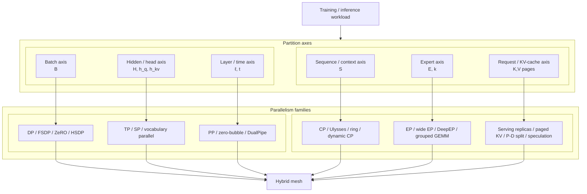

**Diagram notation key:** `B`, `H`, `S`, `E`, and `k` match the prose formulas; `h_q` maps to $h_q$ and `h_kv` maps to $h_{\mathrm{kv}}$; `ℓ` maps to $\ell$; `K,V` maps to the key/value tensors used by attention and KV cache sections.


## 1. Shared System Model, Notation, Placement, and Evidence Policy

This section collects the concepts that every later parallelism family reuses: evidence labels, tensor symbols, device meshes, process groups, placement states, collectives, and first-order memory/communication estimates. The family sections then focus on the specific split they implement rather than redefining $B$, $S$, $H$, rank groups, or collective semantics each time.

### 1.1 Evidence Grades and Source Interpretation

The paper distinguishes public evidence from inference. A claim about a model architecture is stronger when it comes from an official model card or report; a claim about deployment feasibility may come from a runtime integration; a claim about a private production training mesh should be labeled inferred unless the model owner or implementation discloses it.

| Label | Evidence Level | How To Interpret It |
|---|---|---|
| `paper` | Peer-reviewed paper, arXiv preprint, official technical report, or conference paper | Strong for the studied setting; may not transfer unchanged to every model, cluster, or precision regime. |
| `official repo` | Repository owned by the project or organization that disclosed the system | Strong evidence that a technique is implemented publicly; performance and production settings may still differ. |
| `official docs/blog` | Vendor docs, model cards, engineering blogs, official reports, or official project docs | Strong evidence for architecture, APIs, or vendor-supported behavior. |
| `third-party integration` | Runtime, deployment, or implementation report by a downstream system | Strong evidence for deployment feasibility; weaker evidence for the model owner's private training stack. |
| `inferred` | Systems consequence inferred from public architecture or integration evidence | Useful for reasoning, but not direct evidence. Treat exact private kernels, schedules, meshes, and bucket sizes as unknown. |

Examples used throughout the paper: DeepSeek-V3 report, DeepSeek-V4 model card, and Llama reports are architecture/training evidence; DualPipe, DeepEP, DeepGEMM, FlashMLA, TorchTitan, and MaxText are implementation evidence; NVIDIA DeepSeek-V4 and SGLang/Miles reports are runtime integration evidence; "DeepSeek-V4 likely needs CP plus sparse KV layout" is an inference from public model and serving evidence.

### 1.2 Shared Symbols and Transformer Shapes

The symbols below are shared defaults. A later section can override or refine a symbol locally when a subtopic needs more precision.

| Symbol | Meaning |
|---|---|
| $r$ | Rank index inside the relevant group. |
| $p$ or $g$ | Number of ranks in a communication group. |
| $d_{\mathrm{dp}}$, $d_{\mathrm{tp}}$, $d_{\mathrm{pp}}$, $d_{\mathrm{cp}}$, $d_{\mathrm{ep}}$ | Data-, tensor-, pipeline-, context-, and expert-parallel degrees. |
| $B$ | Batch size for the local context under discussion; when global batch is needed it is written explicitly as $B_{\mathrm{global}}$. |
| $B_{\mu}$ or $b_{\mu}$ | Per-rank microbatch size. |
| $S$ | Sequence length in tokens, or maximum padded sequence length in a batch. |
| $N = BS$ | Flattened token count after batch and sequence are merged. |
| $H$ or $H_{\ell}$ | Hidden width, optionally at layer $\ell$. |
| $F$ | Output width of a generic linear projection. |
| $F_{\mathrm{ff}}$ or $H_{\mathrm{ff}}$ | Feed-forward or expert intermediate width. |
| $h_q$ | Number of query heads. |
| $h_{kv}$ | Number of key/value heads. |
| $d_h$ or $d$ | Per-head dimension, with $H=h_qd$ for the attention output projection. |
| $V$ | Vocabulary size when discussing embeddings or logits. |
| $E$ | Number of routed experts in an MoE layer. |
| $k$ or $K$ | Router top-k value, i.e. number of experts selected per token. |
| $\Theta_{\ell}$ | Parameter tensor or parameter bucket for layer $\ell$. |
| $\Theta_{\ell}^{[r]}$ | Shard of $\Theta_{\ell}$ owned by rank $r$. |
| $G_{\ell,r}$ | Local gradient contribution for $\Theta_{\ell}$ computed on rank $r$. |
| $G_{\ell}^{[r]}$ | Reduced gradient shard owned by rank $r$ after reduce-scatter. |
| $O_{\ell}$ | Optimizer state associated with $\Theta_{\ell}$. |
| $P=\sum_{\ell}\lvert\Theta_{\ell}\rvert$ | Total number of trainable parameter elements. |
| $b_w$, $b_g$, $b_o$, $b_{\mathrm{act}}$ | Bytes per stored weight, gradient, optimizer-state element, and activation element. |

The dense transformer activation convention is:

$$
X \in \mathbb{R}^{B \times S \times H}.
$$

Here $X$ is the hidden-state tensor entering a transformer sublayer, $B$ is batch size, $S$ is sequence length, and $H$ is hidden width. When batch and sequence are flattened for matrix multiplication, the same activation is often viewed as:

$$
X_{\mathrm{flat}} \in \mathbb{R}^{N \times H},
\qquad
N=BS.
$$

For attention, the projections produce:

$$
Q \in \mathbb{R}^{B \times S \times h_q \times d},
\qquad
K,V \in \mathbb{R}^{B \times S \times h_{kv} \times d}.
$$

The symbol $Q$ denotes query vectors, $K$ key vectors, and $V$ value vectors. Multi-head attention has $h_{kv}=h_q$; grouped-query attention has $h_{kv}<h_q$; multi-query attention has $h_{kv}=1$. Family sections add local shapes such as pipeline boundary activations $h_{i,s}$, expert-local token matrices $X_e$, or paged KV-cache blocks.

A standard pre-norm decoder transformer block preserves the residual hidden shape $[B,S,H]$ at its input and output. The module dimensions below describe the dense, unsharded logical tensors before any TP, CP, PP, EP, FSDP, or serving-specific placement is applied. Bias vectors are omitted unless a model uses them.

| Module or Tensor | Parameter Shape | Input Shape | Output / State Shape | Notes |
|---|---:|---:|---:|---|
| Token embedding | $W_{\mathrm{tok}}\in\mathbb{R}^{V\times H}$ | token ids $[B,S]$ | $X_0\in\mathbb{R}^{B\times S\times H}$ | Lookup maps each token id to one hidden vector. |
| Attention norm | $\gamma,\beta\in\mathbb{R}^{H}$, or scale-only $\gamma\in\mathbb{R}^{H}$ | $X\in\mathbb{R}^{B\times S\times H}$ | $X_{\mathrm{attn}}\in\mathbb{R}^{B\times S\times H}$ | LayerNorm/RMSNorm changes values, not shape. |
| Query projection | $W_Q\in\mathbb{R}^{H\times h_q d}$ | $X_{\mathrm{attn}}$ | $Q\in\mathbb{R}^{B\times S\times h_q\times d}$ | Usually reshaped from $[B,S,h_q d]$. |
| Key projection | $W_K\in\mathbb{R}^{H\times h_{kv}d}$ | $X_{\mathrm{attn}}$ | $K\in\mathbb{R}^{B\times S\times h_{kv}\times d}$ | $h_{kv}=h_q$ for MHA, smaller for GQA/MQA. |
| Value projection | $W_V\in\mathbb{R}^{H\times h_{kv}d}$ | $X_{\mathrm{attn}}$ | $V\in\mathbb{R}^{B\times S\times h_{kv}\times d}$ | Same head count as $K$. |
| RoPE or position transform | usually no trainable matrix | $Q,K$ | $Q',K'$ with same shapes as $Q,K$ | Rotary or positional transforms preserve tensor shape. |
| Attention scores | no parameter | $Q',K'$ | $A_{\mathrm{score}}\in\mathbb{R}^{B\times h_q\times S\times S}$ | For GQA/MQA, each query head maps to one KV head. Causal or sparse masks modify the valid entries. |
| Attention probabilities | no parameter | $A_{\mathrm{score}}$ | $P_{\mathrm{attn}}\in\mathbb{R}^{B\times h_q\times S\times S}$ | Softmax is over the key-token dimension. |
| Attention value product | no parameter | $P_{\mathrm{attn}},V$ | $O_{\mathrm{head}}\in\mathbb{R}^{B\times S\times h_q\times d}$ | Heads are then flattened to $[B,S,H]$. |
| Attention output projection | $W_O\in\mathbb{R}^{H\times H}$ | $\operatorname{reshape}(O_{\mathrm{head}})\in\mathbb{R}^{B\times S\times H}$ | $O_{\mathrm{attn}}\in\mathbb{R}^{B\times S\times H}$ | Row/column TP often splits this projection. |
| Attention residual add | no parameter | $X,O_{\mathrm{attn}}$ | $X_1=X+O_{\mathrm{attn}}\in\mathbb{R}^{B\times S\times H}$ | Residual branch requires identical placement before addition. |
| MLP norm | $\gamma,\beta\in\mathbb{R}^{H}$, or scale-only $\gamma\in\mathbb{R}^{H}$ | $X_1$ | $X_{\mathrm{mlp}}\in\mathbb{R}^{B\times S\times H}$ | Same hidden shape. |
| Gated MLP gate/up projections | $W_g,W_u\in\mathbb{R}^{H\times F_{\mathrm{ff}}}$ | $X_{\mathrm{mlp}}$ | $G,U\in\mathbb{R}^{B\times S\times F_{\mathrm{ff}}}$ | Many implementations fuse this as $W_{\mathrm{in}}\in\mathbb{R}^{H\times 2F_{\mathrm{ff}}}$. |
| Gated activation/product | no parameter | $G,U$ | $Z_{\mathrm{ff}}\in\mathbb{R}^{B\times S\times F_{\mathrm{ff}}}$ | SwiGLU-like form: $Z_{\mathrm{ff}}=\phi(G)\odot U$. |
| MLP down projection | $W_d\in\mathbb{R}^{F_{\mathrm{ff}}\times H}$ | $Z_{\mathrm{ff}}$ | $O_{\mathrm{mlp}}\in\mathbb{R}^{B\times S\times H}$ | Returns to residual hidden width. |
| MLP residual add | no parameter | $X_1,O_{\mathrm{mlp}}$ | $X_2=X_1+O_{\mathrm{mlp}}\in\mathbb{R}^{B\times S\times H}$ | Block output shape equals block input shape. |
| MoE replacement for dense MLP | router $W_R\in\mathbb{R}^{H\times E}$; expert weights often $W_{g,e},W_{u,e}\in\mathbb{R}^{H\times F_{\mathrm{ff}}}$ and $W_{d,e}\in\mathbb{R}^{F_{\mathrm{ff}}\times H}$ | $X_{\mathrm{mlp}}$ | router logits $[B,S,E]$, top-k ids/weights $[B,S,k]$, output $[B,S,H]$ | EP sections specialize the routed-token buffers and expert-local shapes. |
| LM head | $W_{\mathrm{lm}}\in\mathbb{R}^{H\times V}$, often tied to $W_{\mathrm{tok}}^\top$ | final hidden $[B,S,H]$ | logits $[B,S,V]$ | Vocab parallelism shards the $V$ dimension. |

The dense block can be summarized by:

$$
X_1 = X + \operatorname{reshape}\!\left(
\operatorname{softmax}\!\left(\frac{QK^\top}{\sqrt{d}} + M\right)V
\right)W_O,
$$

where $Q=X_{\mathrm{attn}}W_Q$, $K=X_{\mathrm{attn}}W_K$, $V=X_{\mathrm{attn}}W_V$, $M$ is the attention mask, and the reshape converts $[B,S,h_q,d]$ back to $[B,S,H]$.

For a gated MLP:

$$
X_2 = X_1 + \left(\phi(X_{\mathrm{mlp}}W_g)\odot X_{\mathrm{mlp}}W_u\right)W_d.
$$

Here $\phi$ is the activation function, often SiLU for SwiGLU-style blocks, and $\odot$ is elementwise multiplication. Both formulas describe the logical dense block; parallel sections later decide which dimensions are sharded or materialized.

```mermaid
flowchart TB

  subgraph INPUT["Input and embedding"]
    direction LR
    TOK["Input: token ids<br/>shape [B,S]"]
    EMB["Params: Wtok [V,H]<br/>Output: X0 [B,S,H]"]
    TOK --> EMB
  end

  subgraph ATTN["Attention sublayer"]
    direction TB
    subgraph AROW1["projections and scores"]
      direction LR
      LN1["Input: X0 or X [B,S,H]<br/>Params: gamma,beta [H]<br/>Output: Xattn [B,S,H]"]
      QKV["Input: Xattn [B,S,H]<br/>Params: Wq [H,hq*d]<br/>Wk,Wv [H,hkv*d]<br/>Output: Q [B,S,hq,d]<br/>K,V [B,S,hkv,d]"]
      SCORE["Input: Q,K,mask M<br/>Params: none<br/>Output: Pattn [B,hq,S,S]"]
      LN1 --> QKV --> SCORE
    end
    subgraph AROW2["values and residual"]
      direction LR
      VAL["Input: Pattn,V<br/>Params: none<br/>Output: Ohead [B,S,hq,d]"]
      WO["Input: reshape Ohead [B,S,H]<br/>Params: Wo [H,H]<br/>Output: Oattn [B,S,H]"]
      RES1["Input: X + Oattn<br/>Params: none<br/>Output: X1 [B,S,H]"]
      VAL --> WO --> RES1
    end
    SCORE --> VAL
  end

  subgraph MLP["MLP or MoE sublayer"]
    direction TB
    subgraph MROW1["dense gated MLP"]
      direction LR
      LN2["Input: X1 [B,S,H]<br/>Params: gamma,beta [H]<br/>Output: Xmlp [B,S,H]"]
      UP["Input: Xmlp [B,S,H]<br/>Params: Wg,Wu [H,Fff]<br/>Output: G,U [B,S,Fff]"]
      PROD["Input: G,U<br/>Params: none<br/>Output: Zff [B,S,Fff]"]
      LN2 --> UP --> PROD
    end
    subgraph MROW2["down projection and residual"]
      direction LR
      DOWN["Input: Zff [B,S,Fff]<br/>Params: Wd [Fff,H]<br/>Output: Omlp [B,S,H]"]
      RES2["Input: X1 + Omlp<br/>Params: none<br/>Output: X2 [B,S,H]"]
      LM["Input: X2 [B,S,H]<br/>Params: Wlm [H,V]<br/>Output: logits [B,S,V]"]
      DOWN --> RES2 --> LM
    end
    PROD --> DOWN
  end

  EMB --> LN1
  RES1 --> LN2
```

**Diagram notation key:** `Wtok` maps to $W_{\mathrm{tok}}$; `X0`, `X1`, and `X2` map to $X_0$, $X_1$, and $X_2$; `Wq`, `Wk`, `Wv`, and `Wo` map to $W_Q$, $W_K$, $W_V$, and $W_O$; `hq` and `hkv` map to $h_q$ and $h_{kv}$; `Pattn` maps to $P_{\mathrm{attn}}$; `Wg`, `Wu`, and `Wd` map to $W_g$, $W_u$, and $W_d$; `Fff` maps to $F_{\mathrm{ff}}$; `phi(G) dot U` maps to $\phi(G)\odot U$; `Wlm` maps to $W_{\mathrm{lm}}$.

### 1.3 Device Meshes, Rank Coordinates, and Process Groups

A hybrid LLM job can be described as a logical device mesh. Let:

$$
W = d_{\mathrm{dp}} d_{\mathrm{pp}} d_{\mathrm{tp}} d_{\mathrm{cp}} d_{\mathrm{ep}},
$$

where $W$ is total rank count and the $d_x$ terms are the parallelism degrees along each mesh axis. Dense models often have $d_{\mathrm{ep}}=1$; short-context models often have $d_{\mathrm{cp}}=1$. Megatron-style sequence parallelism is usually not a separate world-size factor; it is a tensor placement used inside a TP group.

Each rank has a logical coordinate:

$$
\rho =
(i_{\mathrm{dp}}, i_{\mathrm{pp}}, i_{\mathrm{tp}}, i_{\mathrm{cp}}, i_{\mathrm{ep}}),
\qquad
0 \le i_x < d_x.
$$

The runtime forms process groups by varying one coordinate while holding the others fixed. For example:

$$
G_{\mathrm{tp}}(i_{\mathrm{dp}},i_{\mathrm{pp}},i_{\mathrm{cp}},i_{\mathrm{ep}})
=
\{(i_{\mathrm{dp}},i_{\mathrm{pp}},j,i_{\mathrm{cp}},i_{\mathrm{ep}})
:\ 0 \le j < d_{\mathrm{tp}}\}.
$$

This is the tensor-parallel group for ranks that share data, pipeline, context, and expert coordinates but differ in tensor shard. Similarly:

$$
G_{\mathrm{dp}}(i_{\mathrm{pp}},i_{\mathrm{tp}},i_{\mathrm{cp}},i_{\mathrm{ep}})
=
\{(j,i_{\mathrm{pp}},i_{\mathrm{tp}},i_{\mathrm{cp}},i_{\mathrm{ep}})
:\ 0 \le j < d_{\mathrm{dp}}\}.
$$

This is the data-parallel or sharded-data-parallel group for ranks that own equivalent model shards and process different data.

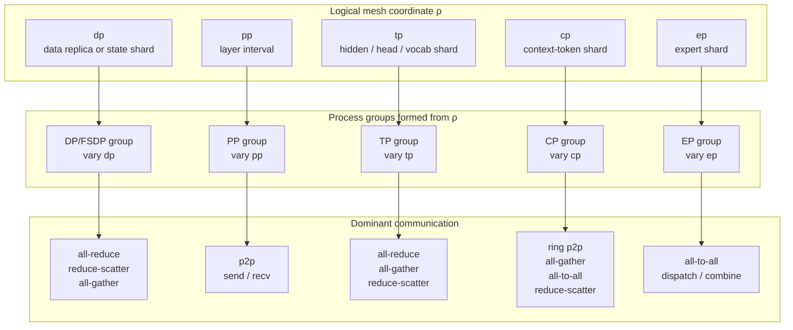

**Diagram notation key:** `ρ` maps to $\rho$, the logical rank coordinate; `dp`, `pp`, `tp`, `cp`, and `ep` are mesh axes. The diagram labels process groups by the coordinate that varies inside the group.

The main axes are:

| Axis | Coordinate | Split Object | Common Placement State | Dominant Communication | Primary Bottleneck Addressed |
|---|---:|---|---|---|---|
| DP / DDP | $i_{\mathrm{dp}}$ | data batch replicas | parameters replicated, gradients partial | all-reduce | throughput with replicated model memory |
| FSDP / ZeRO | $i_{\mathrm{dp}}$ | parameters, gradients, optimizer states across data ranks | parameters sharded at rest, temporarily materialized for compute | all-gather parameters, reduce-scatter gradients | model-state HBM |
| TP | $i_{\mathrm{tp}}$ | hidden dimension, attention heads, MLP columns/rows, vocabulary | tensors sharded or partial on TP | all-reduce, all-gather, reduce-scatter | too-wide layers or logits |
| PP | $i_{\mathrm{pp}}$ | layer depth | each rank owns a layer interval | p2p activation/gradient send/recv | too many layers or activation memory |
| CP | $i_{\mathrm{cp}}$ | context tokens inside attention | sequence sharded on CP | ring p2p, all-gather, all-to-all, reduce-scatter | long-context attention memory/compute |
| EP | $i_{\mathrm{ep}}$ | MoE experts and routed tokens | experts sharded on EP, tokens permuted by router | all-to-all dispatch/combine | sparse parameter scale |

The same rank belongs to multiple overlapping groups. Correctness requires that every operation uses the group matching the tensor placement. A row-parallel TP linear produces `Partial(tp)` output and must reduce on $G_{\mathrm{tp}}$, not on the DP group. An FSDP parameter shard must be gathered over ranks that hold the same PP/TP/CP/EP coordinate, not over ranks that own different tensor-parallel shards.

References for this subsection: [NVIDIA Megatron-Core parallelism guide](https://docs.nvidia.com/megatron-core/developer-guide/latest/user-guide/parallelism-guide.html), [TorchTitan](https://github.com/pytorch/torchtitan), [PyTorch DTensor](https://docs.pytorch.org/docs/stable/distributed.tensor.html), [DeepSpeed](https://github.com/deepspeedai/DeepSpeed), [MaxText](https://github.com/AI-Hypercomputer/maxtext), [GSPMD](https://arxiv.org/abs/2105.04663), [Pathways](https://research.google/pubs/pathways-asynchronous-distributed-dataflow-for-ml/).

### 1.4 Placement States and Tensor Layout Transitions

A placement state says what each rank physically stores relative to a logical tensor. The same logical tensor can move through several placement states during one layer.

| Placement State | Meaning |
|---|---|
| `Rep(axis)` or replicated | Every rank along `axis` has the same logical values. |
| `Shard(dim on axis)` or sharded | Tensor dimension `dim`, or flattened bucket storage, is partitioned across ranks on `axis`. |
| `Partial(axis)` or partial | Each rank holds a local contribution that must be reduced along `axis`. |
| `Materialized(axis)` or gathered | A previously sharded tensor has been reconstructed for a compute window. |
| `Reduced-sharded` | Values have been reduced across ranks, but each rank keeps only its shard of the reduced result. |
| `Offloaded` | State lives outside GPU high-bandwidth memory, usually CPU memory, NVMe, or object storage. |
| `Quantized(dtype, scale_layout)` | Payload and scale tensors together define the value. |
| `Cached` | Serving state, such as KV blocks, is retained across decode steps. |

For example, a dense attention input $X \in \mathbb{R}^{b \times S \times H}$ might be placed as `Shard(S on cp), Rep(tp)` before a column-parallel QKV projection, giving each CP rank:

$$
X_{\mathrm{local}} \in \mathbb{R}^{b \times S/d_{\mathrm{cp}} \times H}.
$$

If sequence parallelism also shards selected activations across the TP group, the local tensor for those operators may become:

$$
X_{\mathrm{local,SP}} \in
\mathbb{R}^{b \times S/(d_{\mathrm{cp}}d_{\mathrm{tp}}) \times H}.
$$

This distinction matters: CP changes the attention algorithm because remote keys and values may be needed; Megatron-style SP mainly changes activation storage and communication around TP layers.

Dense placement example:

| Tensor | Global Shape | Placement | Local Shape on One Rank |
|---|---|---|---|
| token ids | $[B,S]$ | `Shard(B on dp), Shard(S on cp)` | $[b,S/d_{\mathrm{cp}}]$ |
| activation $X$ before attention | $[b,S,H]$ per DP replica | `Shard(S on cp), Rep(tp)` | $[b,S/d_{\mathrm{cp}},H]$ |
| activation $X$ with Megatron-style SP | $[b,S,H]$ | `Shard(S on cp and tp)` | $[b,S/(d_{\mathrm{cp}}d_{\mathrm{tp}}),H]$ |
| QKV column-parallel weight | $[H,3H]$ | `Shard(output hidden on tp)`, plus optional `Shard(dp)` at rest under FSDP | $[H,3H/d_{\mathrm{tp}}]$ when materialized for TP compute |
| attention heads | $[b,S,h_q,d]$ | `Shard(S on cp), Shard(head on tp)` | $[b,S/d_{\mathrm{cp}},h_q/d_{\mathrm{tp}},d]$ |
| output projection row-parallel weight | $[H,H]$ | `Shard(input hidden on tp)` | $[H/d_{\mathrm{tp}},H]$ |
| PP stage layers | $[L]$ | `Shard(layer on pp)` | $L/d_{\mathrm{pp}}$ layers |
| LM head | $[H,V]$ | often `Shard(V on tp)` | $[H,V/d_{\mathrm{tp}}]$ |

MoE placement example:

| Object | Placement | Local Shape / Count |
|---|---|---|
| expert ids | `Shard(E on ep)` | $E/d_{\mathrm{ep}}$ experts per EP rank |
| expert first projection | `Shard(E on ep), Shard(H_ff on tp)` | $[E/d_{\mathrm{ep}},H,H_{\mathrm{ff}}/d_{\mathrm{tp}}]$ |
| routed token buffer | `Permuted by top-k router, partitioned by ep destination` | variable count $T_e$ per expert owner |
| expert output before combine | `Shard(tokens on ep), Shard(hidden on tp)` or gathered hidden depending on implementation | variable $[T_e,H/d_{\mathrm{tp}}]$ or $[T_e,H]$ |
| combined MoE output | token order restored, usually same placement as input activation | $[b,S/d_{\mathrm{cp}},H]$ or $[b,S/(d_{\mathrm{cp}}d_{\mathrm{tp}}),H]$ under SP |

References for this subsection: [NVIDIA Megatron-Core parallelism guide](https://docs.nvidia.com/megatron-core/developer-guide/latest/user-guide/parallelism-guide.html), [Megatron-Core context parallelism](https://docs.nvidia.com/megatron-core/developer-guide/latest/user-guide/features/context_parallel.html), [TorchTitan](https://github.com/pytorch/torchtitan), [MaxText](https://github.com/AI-Hypercomputer/maxtext), [JAX distributed arrays and automatic parallelization](https://jax.readthedocs.io/en/latest/notebooks/Distributed_arrays_and_automatic_parallelization.html).

### 1.5 Communication Primitives and Cost Models

Most LLM parallelism is built from a small vocabulary of collectives and peer-to-peer transfers. A collective is a group operation; p2p send/recv is an explicit transfer between ranks. CUDA and NCCL implementations may lower collectives into algorithm-specific message schedules, but the model-level contract is the operation below.

| Primitive | Common Use | Shape Intuition |
|---|---|---|
| `all-reduce` | DDP gradient averaging; TP partial-output summation; vocab loss statistics | Every rank starts with same-shaped partials and ends with the same reduced tensor. |
| `reduce-scatter` | FSDP/ZeRO gradient sharding; TP sequence-parallel output | Every rank contributes full or chunked partials and keeps one reduced shard. |
| `all-gather` | FSDP parameter materialization; SP or CP layout reconstruction | Every rank starts with a shard and receives all shards. |
| `all-to-all` | EP token dispatch/combine; Ulysses sequence/head exchange; some quantized gradient exchanges | Every rank sends a different slice to every other rank. |
| `p2p send/recv` | Pipeline activation and gradient edges; ring attention KV streaming; explicit KV transfer in serving | One rank sends a tensor or metadata packet to another rank. |

The group-operation inventory used later is:

| Group | Coordinates Varying | Phase | Operation |
|---|---|---|---|
| $G_{\mathrm{dp}}$ for DDP | dp | backward | gradient all-reduce |
| $G_{\mathrm{dp}}$ for FSDP/ZeRO | dp | forward prefetch | parameter all-gather |
| $G_{\mathrm{dp}}$ for FSDP/ZeRO | dp | backward | gradient reduce-scatter |
| $G_{\mathrm{tp}}$ | tp | column/row-parallel linears | all-reduce, all-gather, or reduce-scatter depending on layout |
| $G_{\mathrm{tp}}$ | tp | vocab-parallel loss | all-reduce for max/sum statistics, optional gather for logits |
| $G_{\mathrm{pp}}$ | pp | forward | p2p send activation to next stage |
| $G_{\mathrm{pp}}$ | pp | backward | p2p send activation gradient to previous stage |
| $G_{\mathrm{cp}}$ | cp | attention | ring p2p K/V exchange, all-gather K/V, all-to-all heads/tokens, or reduce-scatter partial outputs |
| $G_{\mathrm{ep}}$ | ep | MoE dispatch | all-to-all tokens to expert owners |
| $G_{\mathrm{ep}}$ | ep | MoE combine | all-to-all expert outputs back to token owners |

Let $p$ be the number of ranks in a communication group and let $n$ be bytes in the full logical tensor being exchanged. The estimates below use the common large-message, ring-style convention that $V^{\mathrm{send}}$ is **remote bytes sent per rank** and $V^{\mathrm{recv}}$ is **remote bytes received per rank**. For these symmetric collectives, send and receive volumes match. If a profiler or NIC budget reports transmit plus receive bytes, multiply the one-direction value by two.

$$
V^{\mathrm{send}}_{\mathrm{allgather}}
=
V^{\mathrm{recv}}_{\mathrm{allgather}}
= \frac{p-1}{p}n,
\qquad
V^{\mathrm{send}}_{\mathrm{reducescatter}}
=
V^{\mathrm{recv}}_{\mathrm{reducescatter}}
= \frac{p-1}{p}n,
\qquad
V^{\mathrm{send}}_{\mathrm{allreduce}}
=
V^{\mathrm{recv}}_{\mathrm{allreduce}}
= 2\frac{p-1}{p}n.
$$

For a balanced all-to-all, let $n_{\mathrm{local}}$ be the total local payload before exchange, including the self-destination slice. Then remote bytes per rank are approximately:

$$
V^{\mathrm{send}}_{\mathrm{alltoall}}
=
V^{\mathrm{recv}}_{\mathrm{alltoall}}
\approx
\frac{p-1}{p}n_{\mathrm{local}}.
$$

If $n_{\mathrm{send,remote}}$ is already defined to exclude the self slice, then $V^{\mathrm{send}}_{\mathrm{alltoall}}=n_{\mathrm{send,remote}}$ by definition. These are volume estimates, not full latency models. Other algorithms, such as tree or hierarchical collectives, change latency phases and topology behavior but not the basic remote-payload accounting. A common latency-bandwidth approximation is:

$$
T_{\mathrm{coll}}
\approx
\alpha m + \beta V + T_{\mathrm{contention}},
$$

where $\alpha$ is launch or message latency, $m$ is the number of communication phases, $\beta$ is inverse effective bandwidth, $V$ is the per-rank volume under the chosen accounting convention, and $T_{\mathrm{contention}}$ captures interference with other traffic.

Topology changes the same formula. NVLink, NVSwitch, PCIe, InfiniBand, RoCE, and TPU interconnects expose different bandwidth, latency, and bisection behavior. A common design split is: keep high-frequency TP and latency-sensitive EP/CP traffic inside the fastest available local domain, then place larger but more overlappable DP/FSDP/HSDP traffic across slower domains.

References for this subsection: [NVIDIA NCCL collective operations](https://docs.nvidia.com/deeplearning/nccl/archives/nccl_2297/user-guide/docs/usage/collectives.html), [NVIDIA NCCL point-to-point operations](https://docs.nvidia.com/deeplearning/nccl/user-guide/docs/api/p2p.html), [NVIDIA Megatron-Core parallelism guide](https://docs.nvidia.com/megatron-core/developer-guide/latest/user-guide/parallelism-guide.html), [PyTorch distributed overview](https://pytorch.org/tutorials/beginner/dist_overview.html), [Ultra-Scale Playbook](https://nanotron-ultrascale-playbook.static.hf.space/index.html).

### 1.6 Memory, Bandwidth, and Overlap Accounting

Parallelism choices are constrained by peak rank memory and exposed communication. For dense parameters with TP, PP, and FSDP-style state sharding over DP, a first-order persistent state estimate per rank is:

$$
M_{\mathrm{state,rank}}
\approx
\frac{P_{\mathrm{dense}}}{d_{\mathrm{pp}} d_{\mathrm{tp}} d_{\mathrm{dp}}}
(b_w+b_g+b_o).
$$

Here $P_{\mathrm{dense}}$ is dense parameter count, and $b_w$, $b_g$, and $b_o$ are bytes per weight, gradient, and optimizer-state element. The formula estimates persistent state, not peak HBM. During compute, parameters may be materialized for one or more layers:

$$
M_{\mathrm{peak,rank}}
\approx
M_{\mathrm{state,rank}}
+
\max_{\ell \in \mathrm{stage}}
\frac{P_\ell b_w}{d_{\mathrm{tp}}}
+
M_{\mathrm{act,rank}}
+
M_{\mathrm{workspace}}.
$$

Here $P_\ell$ is parameter count for layer $\ell$, $M_{\mathrm{act,rank}}$ is activation memory, and $M_{\mathrm{workspace}}$ is temporary kernel and communication workspace.

For activations, a rough stage-local estimate is:

$$
M_{\mathrm{act,rank}}
\propto
\frac{b_{\mu} S H}{d_{\mathrm{cp}}}
\cdot
\frac{L}{d_{\mathrm{pp}}}
\cdot
\frac{b_{\mathrm{act}}}{c_{\mathrm{ckpt}}},
$$

where $L$ is layer count, $b_{\mathrm{act}}$ is bytes per activation element, and $c_{\mathrm{ckpt}}$ is the reduction factor from activation checkpointing. If SP shards selected activations across TP, those particular tensors gain another factor of $d_{\mathrm{tp}}$, but not every activation does.

For MoE parameters with EP:

$$
M_{\mathrm{expert,rank}}
\approx
\frac{P_{\mathrm{expert}}}{d_{\mathrm{pp}} d_{\mathrm{tp}} d_{\mathrm{ep}}}
(b_w+b_g+b_o),
$$

before any additional DP/FSDP sharding. EP reduces expert residency but introduces all-to-all token traffic. If the local routed activation payload is $n_{\mathrm{tok}}$ bytes including any self-destination assignments, and the EP group has size $d_{\mathrm{ep}}$, a balanced all-to-all has per-rank remote send volume and remote receive volume approximately:

$$
V_{\mathrm{EP,a2a}}
\approx
\frac{d_{\mathrm{ep}}-1}{d_{\mathrm{ep}}} n_{\mathrm{tok}},
$$

twice per MoE layer if dispatch and combine carry similar payloads.

For FSDP over a DP group of size $d_{\mathrm{dp}}$, each full parameter all-gather for full tensor payload $n_{\theta}$ has per-rank remote send volume and remote receive volume:

$$
V_{\mathrm{FSDP,ag}}
\approx
\frac{d_{\mathrm{dp}}-1}{d_{\mathrm{dp}}} n_{\theta},
$$

and each gradient reduce-scatter has the same one-direction volume under the ring-style model. A transmit-plus-receive accounting would double these values. The practical question is how much of this volume is hidden behind forward or backward compute.

References for this subsection: [DeepSpeed ZeRO tutorial](https://www.deepspeed.ai/tutorials/zero/), [ZeRO-Infinity paper page](https://www.microsoft.com/en-us/research/publication/zero-infinity-breaking-the-gpu-memory-wall-for-extreme-scale-deep-learning/), [DeepSpeed ZeRO++ tutorial](https://www.deepspeed.ai/tutorials/zeropp/), [TorchTitan FSDP/HSDP notes](https://github.com/pytorch/torchtitan/blob/main/docs/fsdp.md), [PyTorch FSDP2 tutorial](https://docs.pytorch.org/tutorials/intermediate/FSDP_tutorial.html), [Megatron-Core distributed optimizer](https://docs.nvidia.com/megatron-core/developer-guide/0.15.0/api-guide/dist_optimizer.html), [Ultra-Scale Playbook](https://nanotron-ultrascale-playbook.static.hf.space/index.html).

### 1.7 How Later Sections Use This Shared Layer

Each family section now assumes this shared vocabulary and then adds only the local contracts needed for that family. Data parallelism specializes state placement over $G_{\mathrm{dp}}$; tensor parallelism specializes matrix and head shards over $G_{\mathrm{tp}}$; pipeline parallelism specializes p2p activation contracts over $G_{\mathrm{pp}}$; context parallelism specializes attention over $G_{\mathrm{cp}}$; expert parallelism specializes routed all-to-all over $G_{\mathrm{ep}}$; serving specializes request replicas, KV-cache placement, and scheduler state. Hybrid composition returns to the mesh view and asks how to map all of those groups to physical hardware.

## 2. Data Parallelism, FSDP, ZeRO, HSDP, and State Sharding


Data parallelism is the batch-axis form of distributed training. Each rank runs the same model program on different examples, computes local gradients, and synchronizes enough state that all ranks implement the same optimizer step. The modern frontier-era version is not just "replicate the model and all-reduce gradients." It is a family of state-placement strategies that decide where parameters, gradients, optimizer states, and offloaded copies live at every moment of forward, backward, and optimizer execution.

The recent systems direction is led by PyTorch FSDP2 and TorchTitan's FSDP/HSDP usage, DeepSpeed ZeRO++ for communication-reduced ZeRO, Megatron-Core's distributed optimizer and FSDP/DTensor checkpoint formats, and memory-compression work such as COAT. Older work such as DDP, original ZeRO, ZeRO-Offload, and ZeRO-Infinity remains the lineage, but the current design point is more precise: state is sharded, materialized only for a compute window, communicated with topology-aware collectives, optionally quantized, and sometimes moved through CPU or NVMe tiers.


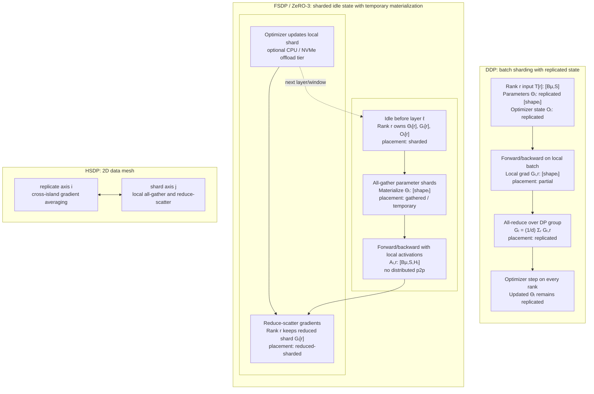

**Diagram notation key:** `Bμ` maps to $B_{\mu}$; `Θₗ` maps to $\Theta_{\ell}$; `Θₗ[r]` maps to $\Theta_{\ell}^{[r]}$; `Gₗ,r` maps to $G_{\ell,r}$; `Gₗ[r]` maps to $G_{\ell}^{[r]}$; `Oₗ` maps to $O_{\ell}$; `Aₗ,r` maps to $A_{\ell,r}$; `Σᵣ` maps to $\sum_r$.


### 2.1 DDP: Replicated State, Batch Shards, and Gradient All-Reduce

DistributedDataParallel is the baseline. The model parameters and optimizer states are replicated on every rank. The user or data loader provides different examples to each rank, typically through a distributed sampler. DDP itself synchronizes gradients, not input data.

For one local microbatch on rank $r$, let $B_r$ be the set of examples represented by tokens $T_r \in \mathbb{Z}^{B_{\mu}\times S}$, let $f_{\Theta}$ be the model with parameters $\Theta=\{\Theta_{\ell}\}$, and let $\mathcal{L}(B_r;\Theta)$ be the mean loss on rank $r$'s examples. The local gradient is

$$
G_{\ell,r}=\nabla_{\Theta_{\ell}}\mathcal{L}(B_r;\Theta).
$$

Here $G_{\ell,r}$ has the same logical shape as $\Theta_{\ell}$ and is in the partial placement state because it only reflects rank $r$'s examples. DDP computes the data-parallel average

$$
G_{\ell}=\frac{1}{d}\sum_{r=0}^{d-1}G_{\ell,r}.
$$

In this equation, $d$ is the number of data-parallel ranks, $r$ indexes ranks, and $G_{\ell}$ is the replicated averaged gradient used by the optimizer. After the all-reduce, every rank holds $G_{\ell}$ with the same shape as $\Theta_{\ell}$. If the optimizer update is written abstractly as

$$
(\Theta_{\ell}^{t+1},O_{\ell}^{t+1})=
U(\Theta_{\ell}^{t},O_{\ell}^{t},G_{\ell}),
$$

then $t$ is the optimizer step index, $U$ is the optimizer rule such as SGD, Adam, or Muon-like matrix updates, and each rank applies the same update to its replicated state.

The DDP communication pattern is:

| Phase | Tensor or state | Shape and placement before communication | Collective | Shape and placement after communication | P2P role |
|---|---|---|---|---|---|
| Initialization | Parameters and buffers | $\Theta_{\ell}$, full shape, rank-local initialization | Broadcast from rank 0 in many implementations | Replicated $\Theta_{\ell}$ | Not central |
| Forward | Optional buffers, such as BatchNorm stats | Buffer shape, replicated or rank-local | Broadcast if configured | Replicated buffer value | Not central |
| Backward | Gradient bucket containing flattened $G_{\ell,r}$ slices | Full bucket shape, partial | All-reduce, usually sum then divide by $d$ | Full bucket shape, replicated averaged gradient | Not central |
| Gradient accumulation | Unsynchronized local gradients | Full gradient shape, partial across accumulation microsteps | None inside `no_sync()`; later all-reduce | Replicated when synchronization resumes | Not central |

DDP's practical performance comes from bucketing and overlap. Gradients are assigned to communication buckets. When all gradients in a bucket are ready during backward, DDP launches an asynchronous all-reduce for that bucket while later backward computation continues. The bucket tensor may also become the `.grad` storage view, reducing gradient copy overhead. This means DDP is not a hard "finish backward, then communicate" system; it is a bucketed overlap system.

The memory cost of DDP model state per rank is approximately

$$
M_{\mathrm{DDP}} \approx P(b_{\theta}+b_g+b_o).
$$

In this formula, $P$ is the number of parameter elements, $b_{\theta}$ is bytes per stored parameter element, $b_g$ is bytes per gradient element, and $b_o$ is bytes per optimizer-state element associated with one parameter. The formula excludes activations, temporary workspaces, fragmentation, and communication buffers. For Adam-style training, $b_o$ can include FP32 master weights and two FP32 moment tensors, so optimizer state often dominates.

Sources for this subsection: [PyTorch DistributedDataParallel](https://docs.pytorch.org/docs/stable/generated/torch.nn.parallel.DistributedDataParallel.html), [PyTorch DDP design note](https://docs.pytorch.org/docs/stable/notes/ddp.html), [PyTorch DDP tutorial](https://docs.pytorch.org/tutorials/intermediate/ddp_tutorial.html), [PyTorch DDP communication hooks](https://docs.pytorch.org/docs/2.9/ddp_comm_hooks.html), [NCCL collective operations](https://docs.nvidia.com/deeplearning/nccl/archives/nccl_2297/user-guide/docs/usage/collectives.html).

### 2.2 The Primitive Mechanisms Behind Sharded Data Parallelism

FSDP, ZeRO, HSDP, and distributed optimizers are compositions of a small set of primitive mechanisms. Understanding the primitives is more useful than memorizing product names.

| Primitive | Input placement and shape | Operation | Output placement and shape | Primary collective or data movement |
| --- | --- | --- | --- | --- |
| Batch sharding | Dataset shards $B_r$; local tokens $T_r \in \mathbb{Z}^{B_{\mu}\times S}$ | Each rank computes forward/backward on different examples. | Local loss and local gradients. | No distributed collective. |
| Gradient all-reduce | $G_{\ell,r}$, full shape, partial | Sum or average gradients over the DP group. | $G_{\ell}$, full shape, replicated. | All-reduce. |
| Gradient reduce-scatter | $G_{\ell,r}$, full bucket, partial | Reduce gradients and scatter equal slices. | $G_{\ell}^{[r]}$, shard, reduced-sharded. | Reduce-scatter. |
| Parameter all-gather | $\Theta_{\ell}^{[r]}$, shard | Reconstruct the full parameter for compute. | $\Theta_{\ell}$, full shape, gathered/materialized. | All-gather. |
| Optimizer-state sharding | $O_{\ell}^{[r]}$, shard | Apply the optimizer update only to owned state. | Updated $\Theta_{\ell}^{[r]}$ and $O_{\ell}^{[r]}$. | Usually none inside the local optimizer step. |
| Reshard/free | $\Theta_{\ell}$, full shape, materialized | Release the full parameter or convert back to DTensor/shard. | $\Theta_{\ell}^{[r]}$, shard. | No collective if the shard already exists. |
| Prefetch | Future $\Theta_{\ell+1}^{[r]}$, shard | Launch gather before the layer needs it. | Future full $\Theta_{\ell+1}$ ready near compute. | Async all-gather on a communication stream. |
| Offload | $\Theta_{\ell}^{[r]}$, $G_{\ell}^{[r]}$, or $O_{\ell}^{[r]}$, shard | Move state between GPU, CPU, and possibly NVMe. | Same logical shard in another memory tier. | H2D/D2H DMA and NVMe I/O; collectives remain separate. |
| Quantized communication | Shard $x^{[r]}$ in BF16/FP16/FP32 | Encode as payload $q^{[r]}$ and scale $s^{[r]}$. | Low-precision payload plus scale metadata. | Quantized all-gather, all-to-all, or gradient averaging. |

Two collective identities explain much of the design space. First, an all-reduce can be decomposed as

$$
\mathrm{AllReduce}(x_r)=
\mathrm{AllGather}(\mathrm{ReduceScatter}(x_r)).
$$

Here $x_r$ is the input tensor on rank $r$. `ReduceScatter` first reduces corresponding elements across ranks and leaves each rank with only a shard of the reduced result. `AllGather` then gathers those reduced shards back to every rank. ZeRO-style systems often stop after the reduce-scatter because the optimizer only needs the shard owned by that rank.

Second, parameter sharding reverses the usual direction: a rank starts with a shard $\Theta_{\ell}^{[r]}$ and temporarily materializes the full parameter tensor by all-gathering all shards:

$$
\Theta_{\ell}=\mathrm{Concat}\left(\Theta_{\ell}^{[0]},\Theta_{\ell}^{[1]},\ldots,\Theta_{\ell}^{[d-1]}\right).
$$

In this equation, `Concat` means reconstruction in the implementation's bucket or tensor layout order. It may correspond to flattening and slicing rather than a visible dimension of the original matrix.

Point-to-point communication is usually not central for data-parallel state sharding. NCCL `send`/`recv` can express arbitrary patterns, and all-to-all can be built from grouped P2P operations, but DDP, FSDP, ZeRO, and HSDP are primarily collective systems. P2P becomes central in pipeline parallelism, not in the data-parallel section.

Sources for this subsection: [NCCL collective operations](https://docs.nvidia.com/deeplearning/nccl/archives/nccl_2297/user-guide/docs/usage/collectives.html), [NCCL point-to-point operations](https://docs.nvidia.com/deeplearning/nccl/user-guide/docs/api/p2p.html), [PyTorch FSDP2 tutorial](https://docs.pytorch.org/tutorials/intermediate/FSDP_tutorial.html), [Megatron-Core distributed optimizer](https://docs.nvidia.com/megatron-core/developer-guide/0.15.0/api-guide/dist_optimizer.html).

### 2.3 ZeRO, ZeRO++, and Distributed Optimizers

ZeRO is the lineage that made "data parallelism with no redundant state" a standard LLM training idea. It partitions model state across data-parallel ranks while preserving the same batch-parallel semantics as DDP.

The memory formulas below use the shared notation for total parameters, group degree, and per-element state bytes. They describe model state only and ignore activations, temporary materialized parameters, workspaces, and allocator fragmentation.

**ZeRO-1: optimizer-state sharding.** Parameters and gradients are replicated, while optimizer states are partitioned:

$$
M_{\mathrm{ZeRO1}} \approx P(b_{\theta}+b_g)+\frac{Pb_o}{d}.
$$

In this equation, $M_{\mathrm{ZeRO1}}$ is approximate per-rank model-state memory. The optimizer step updates only the shard of optimizer state owned by the rank. Implementations then make updated parameters visible to all ranks, commonly through all-gather or equivalent broadcast/gather structure for updated parameter shards. Gradients are still synchronized with all-reduce.

**ZeRO-2: optimizer-state and gradient sharding.** Parameters remain replicated, but reduced gradients are sharded:

$$
M_{\mathrm{ZeRO2}} \approx Pb_{\theta}+\frac{P(b_g+b_o)}{d}.
$$

Here the reduce-scatter result $G^{[r]}$ is enough for rank $r$'s optimizer-state shard. Updated parameters still need to become replicated before the next forward pass. Communication is therefore gradient reduce-scatter plus parameter all-gather or equivalent parameter synchronization after the optimizer step.

**ZeRO-3: parameter, gradient, and optimizer-state sharding.** Parameters are also sharded while idle:

$$
M_{\mathrm{ZeRO3,idle}} \approx \frac{P(b_{\theta}+b_g+b_o)}{d}.
$$

This equation is the attractive memory story, but it is not the peak training memory. If $W_{\mathrm{mat}}$ is the bytes of parameters materialized for the current compute window, $M_{\mathrm{act}}$ is activation memory, and $M_{\mathrm{buf}}$ is communication and workspace memory, then

$$
M_{\mathrm{ZeRO3,peak}} \approx
\frac{P(b_{\theta}+b_g+b_o)}{d}
+ W_{\mathrm{mat}} + M_{\mathrm{act}} + M_{\mathrm{buf}}.
$$

The variables $W_{\mathrm{mat}}$, $M_{\mathrm{act}}$, and $M_{\mathrm{buf}}$ are workload- and implementation-dependent. They explain why the performance problem changes from "can the state fit?" to "can the runtime hide all-gather and keep the materialization window small?"

The ZeRO-stage communication inventory is:

| System | Idle parameter placement | Gradient placement after sync | Optimizer-state placement | Main collectives | P2P role |
|---|---|---|---|---|---|
| DDP | Replicated $\Theta_{\ell}$ | Replicated $G_{\ell}$ | Replicated $O_{\ell}$ | All-reduce gradients | Not central |
| ZeRO-1 | Replicated $\Theta_{\ell}$ | Replicated $G_{\ell}$ | Sharded $O_{\ell}^{[r]}$ | All-reduce gradients; all-gather/broadcast updated param shards depending on implementation | Not central |
| ZeRO-2 | Replicated $\Theta_{\ell}$ | Reduced-sharded $G_{\ell}^{[r]}$ | Sharded $O_{\ell}^{[r]}$ | Reduce-scatter gradients; all-gather/broadcast updated param shards | Not central |
| ZeRO-3 / FSDP full shard | Sharded $\Theta_{\ell}^{[r]}$ | Reduced-sharded $G_{\ell}^{[r]}$ | Sharded $O_{\ell}^{[r]}$ | All-gather parameters before compute; reduce-scatter gradients after backward | Not central |
| ZeRO++ | Sharded, often quantized in communication | Reduced through quantized gradient averaging | Sharded | Quantized all-gather, hierarchical partitioning, all-to-all based quantized gradient averaging | Not central except all-to-all may be implemented with grouped exchanges |

ZeRO++ should be read as a communication-reduction layer over ZeRO, not as a new memory stage. Its three primitives target the main ZeRO communication costs:

1. **Quantized weight all-gather.** Parameter shards are encoded as low-precision blocks before all-gather. If $x$ is a full-precision shard value, a simple quantization model is

   $$
   x \approx s_b q,
   $$

   where $q$ is the low-precision payload value and $s_b$ is a scale for block $b$. ZeRO++ applies block quantization so the parameter all-gather payload is smaller, while scale metadata is also communicated.

2. **Hierarchical partitioning.** High-volume communication is kept within faster topology regions where possible. ZeRO++'s hpZ uses data remapping and recomputation to reduce backward parameter all-gather pressure across slow links.

3. **Quantized gradient averaging.** ZeRO++ introduces a low-precision gradient averaging path that uses all-to-all style exchange rather than vanilla reduce-scatter in order to reduce communication volume while preserving convergence.

Megatron-Core's distributed optimizer is a closely related practical system. It uses contiguous parameter and gradient buffers, reduce-scatters gradients across the data-parallel group, lets each rank update its shard of FP32 main parameters and optimizer states, and all-gathers updated model parameters so the next forward pass sees complete model weights. Recent Megatron-Core checkpoint APIs also distinguish bucket-centric sharded formats, fully reshardable formats, and FSDP DTensor formats.

Sources for this subsection: [DeepSpeed ZeRO++ tutorial](https://www.deepspeed.ai/tutorials/zeropp/), [Microsoft Research ZeRO++ ICLR 2024 publication](https://www.microsoft.com/en-us/research/publication/zero-extremely-efficient-collective-communication-for-giant-model-training/), [Megatron-Core distributed optimizer docs](https://docs.nvidia.com/megatron-core/developer-guide/0.15.0/api-guide/dist_optimizer.html), [Microsoft Research ZeRO paper page](https://www.microsoft.com/en-us/research/publication/zero-memory-optimizations-toward-training-trillion-parameter-models/), [DeepSpeed ZeRO tutorial](https://www.deepspeed.ai/tutorials/zero/), [NCCL all-reduce, all-gather, reduce-scatter, all-to-all definitions](https://docs.nvidia.com/deeplearning/nccl/archives/nccl_2297/user-guide/docs/usage/collectives.html).

### 2.4 FSDP and FSDP2 Execution

FSDP is the PyTorch family of ZeRO-3-like full state sharding. FSDP2 is the recent form that uses per-parameter sharding and `DTensor` rather than the older FSDP1 flat-parameter abstraction. In public PyTorch docs, `fully_shard(module)` converts module parameters from plain tensors into sharded `DTensor` objects, installs pre-forward and pre-backward hooks that all-gather parameters, and installs post-forward and post-backward hooks that free materialized parameters and restore sharded placement.

A single FSDP2 layer execution can be described as a state machine. Let $\Theta_{\ell}$ be a parameter tensor with $N_{\ell}$ elements, and let $d_s$ be the size of the FSDP shard group. If sharding is even, rank $r$ owns about

$$
\left\lceil \frac{N_{\ell}}{d_s} \right\rceil
$$

elements of $\Theta_{\ell}$ in bucket order. Here $d_s$ is the number of ranks on the shard axis; for 1D FSDP, $d_s=d$. The ceiling accounts for uneven tensor sizes or padding.

| Step | Rank-local state before step | Operation | Rank-local state after step |
|---|---|---|---|
| Idle | $\Theta_{\ell}^{[r]}$, $O_{\ell}^{[r]}$, no full parameter | Wait or prefetch | State remains sharded |
| Pre-forward | Parameter shard $\Theta_{\ell}^{[r]}$ | All-gather over shard group | Full $\Theta_{\ell}$, materialized on each rank |
| Forward | $A_{\ell,r}:[B_{\mu},S,H_{\ell}]$, full $\Theta_{\ell}$ | Local compute | $A_{\ell+1,r}$, local activation output |
| Post-forward | Full $\Theta_{\ell}$ | Either keep or reshard/free | Sharded if `reshard_after_forward=True`; materialized if `False` |
| Pre-backward | Sharded or materialized parameter | All-gather if needed | Full $\Theta_{\ell}$ for gradient compute |
| Backward | Local activation and full parameter | Compute local gradient | $G_{\ell,r}$, full shape, partial |
| Post-backward | Local full gradient contribution | Reduce-scatter | $G_{\ell}^{[r]}$, reduced-sharded |
| Optimizer | $\Theta_{\ell}^{[r]},G_{\ell}^{[r]},O_{\ell}^{[r]}$ | Local optimizer update | Updated shards remain sharded |

The FSDP2 `reshard_after_forward` policy controls a memory-communication tradeoff:

| Policy | Meaning | Communication consequence | Memory consequence |
|---|---|---|---|
| `True` | Free full parameters after forward. | Backward must all-gather parameters again. | Lower peak HBM. |
| `False` | Keep full parameters through backward. | Avoids the backward all-gather for those parameters. | Higher peak HBM. |
| `None` | PyTorch chooses defaults, commonly `True` for non-root modules and `False` for root modules. | Mixed behavior by module. | Balanced default policy. |
| Integer value | Reshard after forward to a smaller world size, such as an intra-node group. | Backward all-gather is over that smaller group. | More memory than full reshard, less than full materialization. |

FSDP2 makes prefetching explicit enough to reason about. If layer $\ell$ is computing on a CUDA compute stream and the runtime can predict that layer $\ell+1$ will run next, it can issue the all-gather for $\Theta_{\ell+1}$ on a communication stream. Correctness requires a stream dependency before layer $\ell+1$ reads the parameter. Throughput improves when the all-gather time is hidden under current-layer compute.

FSDP2 also changes checkpointing semantics. A full state dict is no longer the natural state. Sharded state dictionaries containing `DTensor` objects and PyTorch Distributed Checkpoint APIs are the natural representation. This avoids accidentally materializing all parameters and optimizer states on every rank during save/load.

Sources for this subsection: [PyTorch FSDP2 tutorial](https://docs.pytorch.org/tutorials/intermediate/FSDP_tutorial.html), [PyTorch `fully_shard` API](https://docs.pytorch.org/docs/2.8/distributed.fsdp.fully_shard.html), [TorchTitan FSDP/HSDP notes](https://github.com/pytorch/torchtitan/blob/main/docs/fsdp.md), [PyTorch Distributed Checkpoint](https://docs.pytorch.org/docs/stable/distributed.checkpoint.html), [Megatron-Core `fsdp_dtensor` optimizer checkpoint format](https://docs.nvidia.com/megatron-core/developer-guide/nightly/apidocs/core/core.optimizer.distrib_optimizer.html).

### 2.5 HSDP: Hybrid Sharded Data Parallelism

HSDP is data parallelism over a two-dimensional mesh. It is used when the cluster topology has fast local communication and slower global communication. A common layout is

$$
d = d_{\mathrm{rep}} \times d_{\mathrm{shard}}.
$$

Here $d$ is the total data-parallel size, $d_{\mathrm{rep}}$ is the number of replicated shard groups, and $d_{\mathrm{shard}}$ is the number of ranks inside each shard group. PyTorch/TorchTitan describe HSDP as a 2D mesh where the first mesh dimension is replication and the second mesh dimension is sharding.

The rank coordinate can be written as $(i,j)$, where $i \in \{0,\ldots,d_{\mathrm{rep}}-1\}$ indexes the replicate axis and $j \in \{0,\ldots,d_{\mathrm{shard}}-1\}$ indexes the shard axis. The idle memory per rank is approximately

$$
M_{\mathrm{HSDP,idle}} \approx
\frac{P(b_{\theta}+b_g+b_o)}{d_{\mathrm{shard}}}.
$$

In this formula, sharding divides state only by $d_{\mathrm{shard}}$, not by the full $d$. That is the cost of topology locality. The benefit is that parameter all-gathers and gradient reduce-scatters can stay within a faster local group.

The HSDP communication pattern is axis-scoped:

| Phase | Axis | Tensor or state | Collective |
|---|---|---|---|
| Parameter materialization | Shard axis $j$ | $\Theta_{\ell}^{[i,j]}$ shards | All-gather within each shard group |
| Local compute | None | $A_{\ell,(i,j)}:[B_{\mu},S,H_{\ell}]$ | No DP collective |
| Gradient sharding | Shard axis $j$ | Full local gradient bucket | Reduce-scatter within shard group |
| Cross-replica averaging | Replicate axis $i$ | Reduced gradient shards with same shard index $j$ | All-reduce or reduce-scatter/all-gather equivalent across replica groups |
| Checkpointing | Shard and possibly replicate axes | Sharded model and optimizer state | Parallel sharded save/load, or resharding exchange |

HSDP can be viewed as a compromise between full ZeRO-3 over the whole cluster and local FSDP within each node. Full global sharding minimizes memory but can make every layer depend on slow cross-node all-gathers. HSDP stores more replicated state but reduces slow-link pressure. This is especially attractive when $d_{\mathrm{shard}}$ matches a node, NVSwitch island, or other fast fabric domain.

Sources for this subsection: [TorchTitan FSDP/HSDP notes](https://github.com/pytorch/torchtitan/blob/main/docs/fsdp.md), [PyTorch `fully_shard` `reshard_after_forward` docs](https://docs.pytorch.org/docs/2.8/distributed.fsdp.fully_shard.html), [DeepSpeed ZeRO++ tutorial](https://www.deepspeed.ai/tutorials/zeropp/), [NCCL collective definitions](https://docs.nvidia.com/deeplearning/nccl/archives/nccl_2297/user-guide/docs/usage/collectives.html).

### 2.6 Offload: CPU and NVMe as Additional State Tiers

Offload adds memory tiers to the placement vocabulary. Instead of storing all authoritative state in GPU HBM, a system can keep some shards in CPU DRAM or NVMe and move them to the GPU just before communication or compute.

For a parameter shard $\Theta_{\ell}^{[r]}$, offload introduces a tier variable $\tau$:

$$
\tau(\Theta_{\ell}^{[r]}) \in \{\mathrm{GPU},\mathrm{CPU},\mathrm{NVMe}\}.
$$

Here $\tau(\cdot)$ denotes the memory tier containing the authoritative or next-needed copy of the shard. The logical shape is still about $N_{\ell}/d$ elements, but the placement is offloaded rather than GPU-resident.

The common movements are:

| State | Shape | Offloaded placement | Movement back to GPU | Distributed collective after movement |
|---|---|---|---|---|
| Parameter shard $\Theta_{\ell}^{[r]}$ | About $N_{\ell}/d$ elements | CPU pinned memory or NVMe-backed buffer | Host-to-device copy before all-gather | All-gather for materialization |
| Gradient shard $G_{\ell}^{[r]}$ | About $N_{\ell}/d$ elements | CPU memory after backward | Device-to-host copy after reduce-scatter | None until optimizer or checkpoint |
| Optimizer state $O_{\ell}^{[r]}$ | Usually multiple shards matching $\Theta_{\ell}^{[r]}$ | CPU or NVMe | Loaded for optimizer step, or optimizer runs on CPU | Parameter synchronization later |
| Activation checkpoint | $A_{\ell,r}:[B_{\mu},S,H_{\ell}]$ | CPU or recomputed instead of stored | Host-to-device copy or recompute before backward | Not a DP collective |

ZeRO-Offload emphasizes CPU memory and CPU compute for optimizer work. ZeRO-Infinity extends the hierarchy to CPU and NVMe and uses prefetching, partitioning, and overlap to prevent slow tiers from dominating. PyTorch FSDP2 exposes a `CPUOffloadPolicy` in which sharded parameters are copied host-to-device before all-gather, sharded gradients are copied device-to-host in backward, and the optimizer step runs on CPU with CPU optimizer states.

Offload does not fundamentally change the data-parallel collectives: DDP still all-reduces gradients, and FSDP/ZeRO-3 still all-gather parameters and reduce-scatter gradients. It adds local data movement and scheduling constraints. In hardware terms, this is H2D/D2H DMA over PCIe or NVLink-C2C where available, plus NVMe I/O for deeper tiers. It is not usually NCCL rank-to-rank point-to-point communication.

Sources for this subsection: [PyTorch `CPUOffloadPolicy` in `fully_shard`](https://docs.pytorch.org/docs/2.8/distributed.fsdp.fully_shard.html), [Microsoft Research ZeRO-Offload](https://www.microsoft.com/en-us/research/publication/zero-offload-democratizing-billion-scale-model-training/), [Microsoft Research ZeRO-Infinity](https://www.microsoft.com/en-us/research/publication/zero-infinity-breaking-the-gpu-memory-wall-for-extreme-scale-deep-learning/), [SC21 ZeRO-Infinity proceedings page](https://sc21.supercomputing.org/proceedings/tech_paper/tech_paper_pages/pap464.html).

### 2.7 Low Precision, Quantized Communication, and Platform Support

State sharding is a distributed-systems technique, but it is now coupled to low-precision formats and CUDA platform behavior. A rank may not simply send a BF16 or FP32 shard. It may send a quantized payload and scale side data, then reconstruct a compute dtype locally.

For block quantization, let $x_k$ be element $k$ of a tensor shard, let $b(k)$ map element $k$ to a quantization block, let $s_{b(k)}$ be that block's scale, and let $q_k$ be the low-precision stored value. A simple reconstruction model is

$$
x_k \approx s_{b(k)}q_k.
$$

All variables are local to this equation: $x_k$ is the original value, $q_k$ is the quantized payload value, and $s_{b(k)}$ is scale metadata for the block containing $k$. Communication systems must move both $q$ and enough scale metadata to reconstruct or consume the value.

This affects data parallelism in three places:

1. **Parameter all-gather.** ZeRO++ quantizes weight all-gather payloads. FSDP2 and TorchTitan have public discussion around float8 all-gather. The output placement is still gathered/materialized, but the communication payload is smaller and includes scale state.

2. **Gradient synchronization.** ZeRO++ targets low-precision gradient averaging. DDP communication hooks also expose a place for gradient compression research, though production convergence depends on optimizer and error-feedback details.

3. **Optimizer and activation memory.** COAT compresses optimizer states and activations in FP8-oriented formats. This reduces the bytes that sharding and offload must manage, but it introduces dynamic range and scale-update rules as part of training state.

Transformer Engine's FP8 delayed scaling illustrates the distributed-state issue. The scale is derived from an `amax` history rather than the current tensor alone. In distributed training, amax reduction must be consistent across the relevant parallel axes. Thus low precision is not just a kernel dtype; it is a synchronized metadata protocol.

Platform details that matter:

| Platform technique | Why it matters for data parallelism |
|---|---|
| NCCL stream semantics | Allows all-gather or reduce-scatter to overlap with GEMM/backward compute when dependencies permit. |
| Bucket sizing | Balances bandwidth efficiency against overlap latency. Too small is launch/latency-bound; too large may start too late. |
| Contiguous parameter and gradient buffers | Improve collective bandwidth and reduce copies; used by distributed optimizers and older flat-parameter FSDP styles. |
| CUDA events | Prevent compute kernels from reading not-yet-gathered parameters while still allowing asynchronous prefetch. |
| CUDA Graph compatibility | Requires stable memory addresses and collective ordering; sharded systems need careful capture boundaries. |
| Scale metadata layout | Quantized payloads are only useful if scale tensors align with communication and GEMM consumption layouts. |
| Sharded checkpoint formats | Preserve placement and avoid full-state materialization during save/load. |

Sources for this subsection: [DeepSpeed ZeRO++ tutorial](https://www.deepspeed.ai/tutorials/zeropp/), [Microsoft Research ZeRO++ publication](https://www.microsoft.com/en-us/research/publication/zero-extremely-efficient-collective-communication-for-giant-model-training/), [PyTorch/TorchTitan float8 all-gather discussion](https://discuss.pytorch.org/t/distributed-w-torchtitan-enabling-float8-all-gather-in-fsdp2/209323), [NVIDIA Transformer Engine FP8 delayed scaling](https://nvidia.github.io/TransformerEngine/features/low_precision_training/fp8_delayed_scaling/fp8_delayed_scaling.html), [NVIDIA Transformer Engine FP8 primer](https://docs.nvidia.com/deeplearning/transformer-engine-releases/release-2.6/user-guide/examples/fp8_primer.html), [COAT project page](https://research.nvidia.com/labs/eai/publication/coat/), [Megatron-Core distributed optimizer docs](https://docs.nvidia.com/megatron-core/developer-guide/0.15.0/api-guide/dist_optimizer.html).

### 2.8 Choosing Among DDP, FSDP2, ZeRO, ZeRO++, HSDP, and Offload

A practical decision procedure is:

| Constraint | Likely choice | Reason |
|---|---|---|
| Model, gradients, and optimizer state fit comfortably in HBM | DDP | Lowest complexity and excellent overlap through gradient buckets. |
| Optimizer state is the main memory bottleneck | ZeRO-1 or distributed optimizer | Shards the largest non-parameter state while keeping parameter residency simple. |
| Gradients and optimizer state are the bottleneck, but parameters fit | ZeRO-2 or FSDP2 with `reshard_after_forward=False`-like behavior | Avoids full-gradient residency while reducing extra parameter gathers. |
| Parameters do not fit replicated | FSDP2 full shard or ZeRO-3 | Shards parameters and materializes only active windows. |
| Cross-node bandwidth is weak relative to intra-node bandwidth | HSDP or ZeRO++ hierarchical partitioning | Keeps high-volume all-gathers within faster topology islands when possible. |
| Communication dominates at small per-rank batch | ZeRO++, quantized all-gather, tuned buckets/prefetch | Reduces payload or hides collectives. |
| HBM capacity is still insufficient | CPU/NVMe offload, activation checkpointing, optimizer-state compression | Adds memory tiers or recomputation at the cost of scheduling complexity. |
| Checkpoint time or storage is a bottleneck | Sharded distributed checkpointing | Avoids gather-to-one-rank or full-state materialization. |

The main failure mode is to select a memory-saving method without respecting the communication surface it creates. Full sharding reduces idle memory by about $1/d$, but it inserts parameter all-gathers into the layer schedule. HSDP stores more state but may run faster on real clusters. Offload increases capacity but can lose to PCIe or NVMe stalls. Quantized communication reduces bytes but adds numerical and metadata complexity.

Sources for this subsection: [PyTorch FSDP2 tutorial](https://docs.pytorch.org/tutorials/intermediate/FSDP_tutorial.html), [TorchTitan FSDP/HSDP notes](https://github.com/pytorch/torchtitan/blob/main/docs/fsdp.md), [DeepSpeed ZeRO++ tutorial](https://www.deepspeed.ai/tutorials/zeropp/), [Megatron-Core distributed optimizer](https://docs.nvidia.com/megatron-core/developer-guide/0.15.0/api-guide/dist_optimizer.html), [COAT project page](https://research.nvidia.com/labs/eai/publication/coat/), [ZeRO-Offload paper page](https://www.microsoft.com/en-us/research/publication/zero-offload-democratizing-billion-scale-model-training/), [ZeRO-Infinity paper page](https://www.microsoft.com/en-us/research/publication/zero-infinity-breaking-the-gpu-memory-wall-for-extreme-scale-deep-learning/).

### 2.9 Sources and Lineage

Recent public sources should be read first:

- PyTorch FSDP2: [FSDP2 tutorial](https://docs.pytorch.org/tutorials/intermediate/FSDP_tutorial.html) and [`fully_shard`](https://docs.pytorch.org/docs/2.8/distributed.fsdp.fully_shard.html).
- TorchTitan: [FSDP/HSDP notes](https://github.com/pytorch/torchtitan/blob/main/docs/fsdp.md), including the mapping from FSDP1 strategies to FSDP2 `mesh` and `reshard_after_forward`.
- DeepSpeed ZeRO++: [tutorial](https://www.deepspeed.ai/tutorials/zeropp/) and Microsoft Research [ICLR 2024 publication page](https://www.microsoft.com/en-us/research/publication/zero-extremely-efficient-collective-communication-for-giant-model-training/).
- Megatron-Core distributed optimizer: [API and memory-saving documentation](https://docs.nvidia.com/megatron-core/developer-guide/0.15.0/api-guide/dist_optimizer.html).
- Low-precision state and communication: COAT [project page](https://research.nvidia.com/labs/eai/publication/coat/), Transformer Engine [FP8 delayed scaling](https://nvidia.github.io/TransformerEngine/features/low_precision_training/fp8_delayed_scaling/fp8_delayed_scaling.html), and PyTorch/TorchTitan [float8 all-gather discussion](https://discuss.pytorch.org/t/distributed-w-torchtitan-enabling-float8-all-gather-in-fsdp2/209323).
- Collective semantics: NVIDIA NCCL [collective operations](https://docs.nvidia.com/deeplearning/nccl/archives/nccl_2297/user-guide/docs/usage/collectives.html) and [point-to-point API](https://docs.nvidia.com/deeplearning/nccl/user-guide/docs/api/p2p.html).

Older lineage for context:

- DDP: PyTorch [`DistributedDataParallel`](https://docs.pytorch.org/docs/stable/generated/torch.nn.parallel.DistributedDataParallel.html), [DDP design note](https://docs.pytorch.org/docs/stable/notes/ddp.html), and [DDP tutorial](https://docs.pytorch.org/tutorials/intermediate/ddp_tutorial.html).
- ZeRO: Microsoft Research [ZeRO paper page](https://www.microsoft.com/en-us/research/publication/zero-memory-optimizations-toward-training-trillion-parameter-models/).
- ZeRO-Offload: Microsoft Research [ZeRO-Offload paper page](https://www.microsoft.com/en-us/research/publication/zero-offload-democratizing-billion-scale-model-training/).
- ZeRO-Infinity: Microsoft Research [ZeRO-Infinity paper page](https://www.microsoft.com/en-us/research/publication/zero-infinity-breaking-the-gpu-memory-wall-for-extreme-scale-deep-learning/) and SC21 [proceedings page](https://sc21.supercomputing.org/proceedings/tech_paper/tech_paper_pages/pap464.html).

### 2.10 Caveats

Data-parallel state sharding is a memory technique with a communication bill. DDP is often fastest when the model fits, because gradient all-reduce can be bucketed and overlapped with backward. FSDP2 and ZeRO-3 unlock larger models by sharding parameters, gradients, and optimizer states, but parameter all-gather becomes a first-class scheduling problem. HSDP improves locality but gives up some memory savings. ZeRO++ reduces communication volume but introduces quantization and all-to-all gradient-averaging details. Offload increases capacity but depends on whether host or NVMe movement can be hidden.

The section also isolates data parallelism from other axes. Tensor parallelism changes layer-internal tensor shapes, pipeline parallelism introduces rank-to-rank activation sends and receives, and expert parallelism uses all-to-all token routing. Those p2p or all-to-all-heavy mechanisms are not central to DDP/FSDP/ZeRO themselves, though real frontier training runs compose them with data-parallel state sharding.

## 3. Tensor Parallelism, Sequence-Parallel Activations, and Vocabulary Parallelism


Tensor parallelism (TP) splits the tensors inside a transformer layer across a small group of ranks. Data parallelism splits examples; pipeline parallelism splits depth; tensor parallelism splits the matrix multiplications, attention heads, embeddings, logits, and sometimes activation layouts inside a single layer. It is the standard way to make a layer with large hidden dimension fit and run efficiently when one GPU cannot hold or saturate the layer by itself.

The cost is that TP introduces communication inside the transformer block. For this reason, TP groups are usually kept inside a high-bandwidth island such as NVLink or NVSwitch. Across slower network links, pipeline, data, context, or expert parallelism is usually preferable unless the model shape forces wider TP.

Recent systems treat TP as a **layout discipline** rather than a single operation. The same layer may move through replicated, hidden-sharded, sequence-sharded, vocabulary-sharded, and low-precision layouts. PyTorch DTensor and `torch.distributed.tensor.parallel` expose this as `ColwiseParallel`, `RowwiseParallel`, and `SequenceParallel`; Megatron-Core exposes the same primitives through `ColumnParallelLinear`, `RowParallelLinear`, and `VocabParallelEmbedding`; TorchTitan adds PyTorch-native async TP; Hazy Research's tensor-parallel megakernel work shows that inference TP can become a kernel-scheduling problem when communication is frequent.

### 3.1 TP-Specific Notation and Layout Contract

This section uses the shared mesh notation and specializes it to one TP group $G_{\mathrm{tp}}$. Let:

| Symbol | Meaning |
|---|---|
| $B$ | Microbatch size on one data-parallel replica. |
| $S$ | Sequence length. |
| $N = B S$ | Number of token positions after flattening batch and sequence. |
| $H$ | Transformer hidden size. |
| $F$ | Output width of a generic linear projection. |
| $F_{\mathrm{ff}}$ | Feed-forward intermediate width, often $3H$, $4H$, or another model-specific expansion. |
| $A$ | Number of attention query heads. |
| $d_h = H/A$ | Per-head hidden dimension. |
| $V$ | Vocabulary size. |
| $t$ | Tensor-parallel group size. |
| $r \in \{0,\ldots,t-1\}$ | Rank index inside the TP group. |
| $X \in \mathbb{R}^{N \times H}$ | Flattened input activations for one transformer sublayer. |
| $W \in \mathbb{R}^{H \times F}$ | Weight matrix for a generic linear layer. |

A TP group is a collective group, not normally a point-to-point topology. The shared collective cost model applies here, but the TP-specific question is which layer boundary produces which placement:

| Primitive | Where It Appears In TP | Shape Intuition |
|---|---|---|
| `all-reduce` | Sum partial outputs or partial input gradients when every rank needs the full result. | $[N,H]$, $[N,F]$, or a hidden-sharded equivalent. |
| `reduce-scatter` | Sum partial outputs and shard the result, often over sequence for sequence parallelism. | Input partials $[N,H]$, local result $[N/t,H]$. |
| `all-gather` | Reconstruct a sharded activation before a column-parallel linear or a kernel that needs the full shard dimension. | Local $[N/t,H]$ to full $[N,H]$, or local $[N,H/t]$ to full $[N,H]$. |
| `all-to-all` | Not part of basic dense TP. It appears only when TP is coupled to expert routing, context/head layout conversion, or specialized inference kernels. | Token/head/expert permutation, implementation-specific. |
| `p2p send/recv` | Not part of the standard TP programming model. Some async or megakernel implementations may lower collectives into peer transfers internally. | Implementation-specific chunks. |


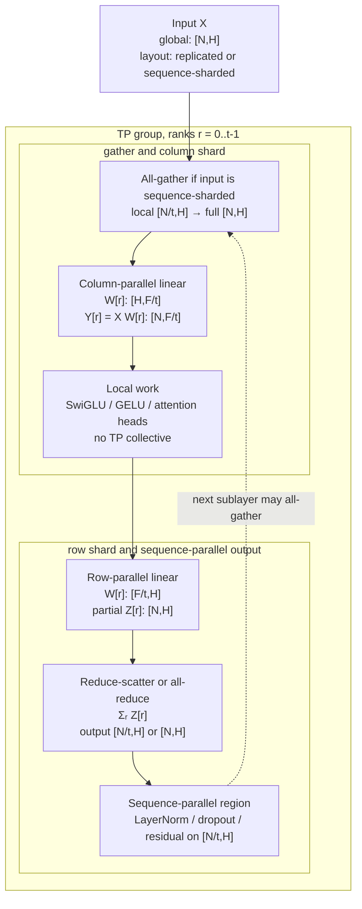

**Diagram notation key:** `W[r]`, `Y[r]`, and `Z[r]` map to $W_r$, $Y_r$, and $Z_r$; `t` is the TP degree; `[N/t,H]` means the token dimension is sharded by TP; `Σᵣ Z[r]` maps to $\sum_r Z_r$.


Sources: [PyTorch tensor parallel docs](https://docs.pytorch.org/docs/stable/distributed.tensor.parallel), [PyTorch DTensor docs](https://docs.pytorch.org/docs/stable/distributed.tensor.html), [Megatron-Core parallelism guide](https://docs.nvidia.com/megatron-core/developer-guide/latest/user-guide/parallelism-guide.html), [Megatron-Core tensor-parallel layer APIs](https://docs.nvidia.com/megatron-core/developer-guide/latest/apidocs/core/core.tensor_parallel.layers.html).

### 3.2 Column-Parallel Linear Layers

Column parallelism splits the **output feature** dimension of a linear layer. For a weight matrix:

$$
W \in \mathbb{R}^{H \times F},
$$

the TP group stores:

$$
W = [W_0, W_1, \ldots, W_{t-1}],
\quad
W_r \in \mathbb{R}^{H \times F/t}.
$$

For an input:

$$
X \in \mathbb{R}^{N \times H},
$$

rank $r$ computes:

$$
Y_r = X W_r + b_r,
\quad
Y_r \in \mathbb{R}^{N \times F/t}.
$$

The full output would be:

$$
Y = [Y_0, Y_1, \ldots, Y_{t-1}]
\in \mathbb{R}^{N \times F}.
$$

The main reason column TP is efficient is that the forward pass often does **not** need to gather $Y$. If the next operation is elementwise or head-local, each rank can continue with its shard $Y_r$. GELU, SwiGLU, and independent attention heads are the common examples.

| Quantity | Global Shape | Rank-$r$ Local Shape | Layout |
|---|---:|---:|---|
| Input $X$ | $[N,H]$ | $[N,H]$, unless sequence-sharded before all-gather | Replicated for the linear. |
| Weight $W$ | $[H,F]$ | $[H,F/t]$ | Sharded on output features. |
| Bias $b$ | $[F]$ | $[F/t]$ | Sharded on output features. |
| Output $Y$ | $[N,F]$ | $[N,F/t]$ | Sharded on output features. |

Forward collectives:

- No collective if the output remains output-feature-sharded.
- Optional `all-gather` over the output-feature dimension if a following operation requires full $[N,F]$ on every rank.

Backward collectives:

Let $G_r = \partial L/\partial Y_r \in \mathbb{R}^{N \times F/t}$, where $L$ is the training loss. Local weight-gradient computation is:

$$
\frac{\partial L}{\partial W_r}
= X^\top G_r
\in \mathbb{R}^{H \times F/t}.
$$

The partial input gradient on rank $r$ is:

$$
\widehat{G}^{X}_r
= G_r W_r^\top
\in \mathbb{R}^{N \times H}.
$$

The true input gradient is the sum over output-feature shards:

$$
\frac{\partial L}{\partial X}
=
\sum_{r=0}^{t-1}\widehat{G}^{X}_r.
$$

Therefore, a column-parallel linear usually needs an `all-reduce` in backward if the previous operation expects replicated $\partial L/\partial X$. If the model is in a sequence-parallel region, the implementation can instead use `reduce-scatter` so each rank receives only its $[N/t,H]$ token shard.

Column TP appears in:

- MLP up projections and gate projections.
- QKV projections in attention.
- LM-head variants when sharding output logits by vocabulary or feature.

Sources: [PyTorch `ColwiseParallel`](https://docs.pytorch.org/docs/stable/distributed.tensor.parallel), [Megatron-Core `ColumnParallelLinear`](https://docs.nvidia.com/megatron-core/developer-guide/latest/apidocs/core/core.tensor_parallel.layers.html), [Megatron-LM model-parallel paper](https://arxiv.org/abs/1909.08053), [NVIDIA MegatronLM explanation](https://research.nvidia.com/labs/adlr/MegatronLM/).

### 3.3 Row-Parallel Linear Layers

Row parallelism splits the **input feature** dimension of a linear layer. The global weight:

$$
W \in \mathbb{R}^{H \times F}
$$

is partitioned as:

$$
W =
\begin{bmatrix}
W_0 \\
W_1 \\
\vdots \\
W_{t-1}
\end{bmatrix},
\quad
W_r \in \mathbb{R}^{H/t \times F}.
$$

The input must be split compatibly:

$$
X = [X_0, X_1, \ldots, X_{t-1}],
\quad
X_r \in \mathbb{R}^{N \times H/t}.
$$

Rank $r$ computes a partial output:

$$
\widehat{Y}_r = X_r W_r,
\quad
\widehat{Y}_r \in \mathbb{R}^{N \times F}.
$$

The real output is:

$$
Y = \sum_{r=0}^{t-1}\widehat{Y}_r.
$$

| Quantity | Global Shape | Rank-$r$ Local Shape | Layout |
|---|---:|---:|---|
| Input $X$ | $[N,H]$ | $[N,H/t]$ | Sharded on input features. |
| Weight $W$ | $[H,F]$ | $[H/t,F]$ | Sharded on input features. |
| Local partial $\widehat{Y}_r$ | $[N,F]$ | $[N,F]$ | Partial sum, not a valid standalone output. |
| Output $Y$ | $[N,F]$ | $[N,F]$ or $[N/t,F]$ | Replicated after `all-reduce`, or sequence-sharded after `reduce-scatter`. |

Forward collectives:

- `all-reduce` if every TP rank should receive the full output $Y$.
- `reduce-scatter` if the output should enter a sequence-parallel region as $Y_r^{seq}\in\mathbb{R}^{N/t \times F}$.

Backward collectives:

If the forward used replicated output, the upstream gradient $G^Y = \partial L/\partial Y$ is already available on each rank. Then:

$$
\frac{\partial L}{\partial X_r}
=
G^Y W_r^\top
\in \mathbb{R}^{N \times H/t},
$$

and:

$$
\frac{\partial L}{\partial W_r}
=
X_r^\top G^Y
\in \mathbb{R}^{H/t \times F}.
$$

No TP collective is needed for these local gradients beyond whatever collective was used to form or distribute $G^Y$. If the forward used `reduce-scatter`, autograd needs the conjugate layout movement, commonly an `all-gather` of the output gradient or an equivalent schedule-specific redistribution.

Row TP is normally paired with column TP. The column-parallel layer creates feature shards; the row-parallel layer consumes those shards and then sums partial outputs. This pair is the core Megatron pattern: one collective after two GEMMs rather than one collective between them.

Sources: [PyTorch `RowwiseParallel`](https://docs.pytorch.org/docs/stable/distributed.tensor.parallel), [Megatron-Core `RowParallelLinear`](https://docs.nvidia.com/megatron-core/developer-guide/latest/apidocs/core/core.tensor_parallel.layers.html), [Megatron-LM paper](https://arxiv.org/abs/1909.08053), [TorchTitan async TP discussion](https://discuss.pytorch.org/t/distributed-w-torchtitan-introducing-async-tensor-parallelism-in-pytorch/209487).

### 3.4 Transformer Block Recipes: MLP and Attention

The practical TP recipe for dense transformer blocks is a repeated column-row pair.

#### MLP / SwiGLU

For a SwiGLU MLP, let the global projections be:

$$
W^{gate}\in\mathbb{R}^{H\times F_{\mathrm{ff}}},
\quad
W^{up}\in\mathbb{R}^{H\times F_{\mathrm{ff}}},
\quad
W^{down}\in\mathbb{R}^{F_{\mathrm{ff}}\times H}.
$$

Column-shard the gate and up projections:

$$
W^{gate}_r, W^{up}_r \in \mathbb{R}^{H\times F_{\mathrm{ff}}/t}.
$$

Each rank computes:

$$
G_r = X W^{gate}_r,
\quad
U_r = X W^{up}_r,
\quad
Z_r = \mathrm{SiLU}(G_r)\odot U_r,
$$

where $\odot$ is elementwise multiplication and:

$$
Z_r\in\mathbb{R}^{N\times F_{\mathrm{ff}}/t}.
$$

Then row-shard the down projection:

$$
W^{down}_r\in\mathbb{R}^{F_{\mathrm{ff}}/t\times H}.
$$

Each rank computes:

$$
\widehat{Y}_r = Z_r W^{down}_r
\in\mathbb{R}^{N\times H},
$$

and the TP group combines:

$$
Y = \sum_{r=0}^{t-1}\widehat{Y}_r.
$$

Communication:

- No collective between $W^{gate}/W^{up}$, SwiGLU, and $W^{down}$.
- `all-reduce` or `reduce-scatter` after $W^{down}$.
- Backward has the conjugate column/row collectives described above.

#### Attention

For attention, assume $A$ query heads and $A$ divisible by $t$. The QKV projection has global output width $3H$, often implemented as one fused column-parallel projection:

$$
W^{qkv}_r \in \mathbb{R}^{H \times 3H/t}.
$$

Rank $r$ owns approximately $A/t$ query heads:

$$
Q_r,K_r,V_r \in \mathbb{R}^{B\times S\times A/t \times d_h}.
$$

Scaled dot-product attention for those local heads is:

$$
\mathrm{Attn}_r(Q_r,K_r,V_r)
=
\mathrm{softmax}
\left(
\frac{Q_r K_r^\top}{\sqrt{d_h}}
+ M
\right)
V_r,
$$

where $M$ is the attention mask broadcastable to the local attention score shape. Because attention heads are independent before the output projection, local head attention needs no TP collective.

The attention output projection is row-parallel:

$$
W^o_r \in \mathbb{R}^{H/t \times H}.
$$

Each rank computes a partial output and the group combines it with `all-reduce` or `reduce-scatter`.

Grouped-query or multi-query attention changes the KV-head mapping. If the number of KV heads is smaller than $t$ or not divisible by $t$, implementations may replicate KV projections on some ranks, use uneven head assignment, or introduce layout conversions. Those choices are model-specific and should not be confused with the basic TP algorithm.

Sources: [Megatron-LM model-parallel paper](https://arxiv.org/abs/1909.08053), [NVIDIA MegatronLM transformer-block explanation](https://research.nvidia.com/labs/adlr/MegatronLM/), [Megatron-Core tensor-parallel APIs](https://docs.nvidia.com/megatron-core/developer-guide/latest/apidocs/core/core.tensor_parallel.layers.html), [PyTorch tensor parallel docs](https://docs.pytorch.org/docs/stable/distributed.tensor.parallel).

### 3.5 Sequence-Parallel Activations as a TP Companion

Megatron-style sequence parallelism (SP) is a companion to TP. It shards **activation tokens** across the TP group for operations whose parameters are replicated or small, such as LayerNorm, RMSNorm, dropout, and residual addition. It is not the same as long-context context parallelism. SP does not by itself compute attention over longer contexts; it reduces redundant activation storage inside a TP block.

The core identity is:

$$
\mathrm{AllReduce}(Y)
=
\mathrm{AllGather}(\mathrm{ReduceScatter}(Y)).
$$

Here $Y\in\mathbb{R}^{N\times H}$ is a tensor that would otherwise be replicated on every TP rank. Standard TP often all-reduces $Y$ immediately. SP performs only the `reduce-scatter` part and keeps:

$$
Y^{seq}_r \in \mathbb{R}^{N/t \times H}
$$

on rank $r$. Token-local operations can run on $Y^{seq}_r$ because each token position can be normalized, dropped out, or added to a residual without seeing other token positions. Before the next column-parallel linear needs all token rows on every TP rank, the runtime performs `all-gather`:

$$
\{Y^{seq}_0,\ldots,Y^{seq}_{t-1}\}
\xrightarrow{\mathrm{all\text{-}gather}}
Y\in\mathbb{R}^{N\times H}.
$$

Activation memory for eligible tensors drops by roughly the TP degree. If $e$ is bytes per element and $c$ is the number of simultaneously saved eligible activation tensors in the SP region, then a simple per-rank estimate is:

$$
M_{\mathrm{no\_SP}} \approx e\cdot c\cdot N H,
$$

$$
M_{\mathrm{SP}} \approx e\cdot c\cdot \frac{N}{t}H.
$$

The ideal memory ratio for those eligible activations is:

$$
\frac{M_{\mathrm{SP}}}{M_{\mathrm{no\_SP}}}\approx \frac{1}{t}.
$$

This ratio applies only to activations that can remain sequence-sharded. It does not include parameters, optimizer states, attention score storage, KV cache, or activations that must be replicated for a specific kernel.

Forward collectives:

- `reduce-scatter` after row-parallel partial outputs when entering an SP region.
- `all-gather` before column-parallel linears or any operation requiring full $[N,H]$.

Backward collectives:

- Autograd sees the conjugate movement: an `all-gather` in forward generally corresponds to a `reduce-scatter` in backward, and a `reduce-scatter` in forward generally corresponds to an `all-gather` or equivalent redistribution in backward.

Sources: [PyTorch `SequenceParallel`](https://docs.pytorch.org/docs/stable/distributed.tensor.parallel), [Megatron-Core parallelism guide](https://docs.nvidia.com/megatron-core/developer-guide/latest/user-guide/parallelism-guide.html), [Reducing Activation Recomputation in Large Transformer Models, MLSys 2023](https://proceedings.mlsys.org/paper_files/paper/2023/hash/80083951326cf5b35e5100260d64ed81-Abstract-mlsys2023.html), [Megatron Bridge parallelisms docs](https://docs.nvidia.com/nemo/megatron-bridge/latest/parallelisms.html).

### 3.6 Vocabulary Parallelism

Vocabulary parallelism shards embedding tables, LM-head weights, logits, and cross-entropy over the vocabulary dimension. It can be viewed as row-sharding an embedding table and column-sharding an LM-head output.

Let:

$$
E \in \mathbb{R}^{V\times H}
$$

be an embedding table or tied LM-head matrix. Vocabulary rank $r$ owns token IDs in interval $V_r$ and stores:

$$
E_r \in \mathbb{R}^{V/t \times H}.
$$

#### Input Embedding

For token IDs $a\in\{0,\ldots,V-1\}^{N}$, rank $r$ looks up only tokens whose IDs fall in $V_r$. It produces:

$$
\widehat{X}_r[n,:] =
\begin{cases}
E_r[a_n,:], & a_n \in V_r,\\
0, & a_n \notin V_r,
\end{cases}
$$

where $n$ indexes token positions. The final embedding is:

$$
X = \sum_{r=0}^{t-1}\widehat{X}_r.
$$

Forward communication is usually `all-reduce` over $[N,H]$, because exactly one rank contributes a nonzero row for each token. Some systems can keep the result sharded if the next layout permits it, but the common simple implementation produces replicated embeddings.

#### LM Head and Cross-Entropy

For final hidden states:

$$
H_{\mathrm{out}}\in\mathbb{R}^{N\times H},
$$

rank $r$ computes vocabulary-sharded logits:

$$
Z_r = H_{\mathrm{out}} E_r^\top
\in\mathbb{R}^{N\times V/t}.
$$

Naively gathering all $Z_r$ would materialize:

$$
Z \in \mathbb{R}^{N\times V},
$$

which is often too large. Cross-entropy can be computed with reductions instead. For token position $n$, let $y_n$ be the target token ID. Define the global maximum:

$$
m_n = \max_{r}\max_{v\in V_r} Z_r[n,v].
$$

This uses an `all-reduce(max)` over one scalar per token. Define the global denominator:

$$
D_n =
\sum_{r=0}^{t-1}
\sum_{v\in V_r}
\exp(Z_r[n,v]-m_n).
$$

This uses an `all-reduce(sum)` over one scalar per token. The loss is:

$$
\ell_n =
-Z[n,y_n] + m_n + \log D_n,
$$

where $Z[n,y_n]$ is contributed by the rank that owns $y_n$. That target logit can be obtained through masking plus `all-reduce(sum)` or an equivalent owner-based reduction.

Backward communication depends on the desired hidden-state layout. Each vocab rank computes a partial hidden gradient:

$$
\widehat{G}^{H}_r =
G^{Z}_r E_r
\in\mathbb{R}^{N\times H},
$$

where $G^{Z}_r=\partial L/\partial Z_r$. The full hidden gradient is:

$$
G^{H} = \sum_{r=0}^{t-1}\widehat{G}^{H}_r,
$$

so the runtime uses `all-reduce` for replicated hidden gradients or `reduce-scatter` when feeding a sequence-sharded/TP-sharded previous region.

Recent vocabulary-parallel PP work adds a second perspective: vocabulary layers can imbalance pipeline stages. The embedding and LM-head stages can dominate parameter memory and compute when $V$ is large. Splitting vocabulary work across pipeline devices and grouping the computation into pipeline passes balances edge stages and reduces pipeline bubbles.

Sources: [Megatron-Core `VocabParallelEmbedding`](https://docs.nvidia.com/megatron-core/developer-guide/latest/apidocs/core/core.tensor_parallel.layers.html), [Balancing Pipeline Parallelism with Vocabulary Parallelism, MLSys 2025](https://proceedings.mlsys.org/paper_files/paper/2025/hash/10e400a587ff6925e4e26333b419ff55-Abstract-Conference.html), [VocabularyParallelism repository](https://github.com/sail-sg/VocabularyParallelism), [Liger Kernel paper](https://arxiv.org/abs/2410.10989), [Megatron-LM repository](https://github.com/NVIDIA/Megatron-LM).

### 3.7 Async Tensor Parallelism

Synchronous TP exposes collectives directly on the critical path. A common pattern is:

$$
\texttt{all\text{-}gather}(X_{\mathrm{shard}}) \rightarrow \texttt{matmul}(X,W),
$$

or:

$$
\texttt{matmul}(X,W) \rightarrow \texttt{reduce\text{-}scatter}(Y).
$$

Let $C$ be the compute time for the matmul and $K$ be the communication time for the collective. A synchronous estimate is:

$$
T_{\mathrm{sync}} \approx C + K.
$$

Async TP decomposes the collective and the matmul into chunks. Let $j\in\{0,\ldots,c-1\}$ index chunks. The runtime overlaps communication for chunk $j+1$ with computation for chunk $j$. If the overlap is effective:

$$
T_{\mathrm{async}} \approx \max(C,K)+\epsilon,
$$

where $\epsilon$ is overhead from chunking, synchronization, scheduling, and any unhidden tail work.


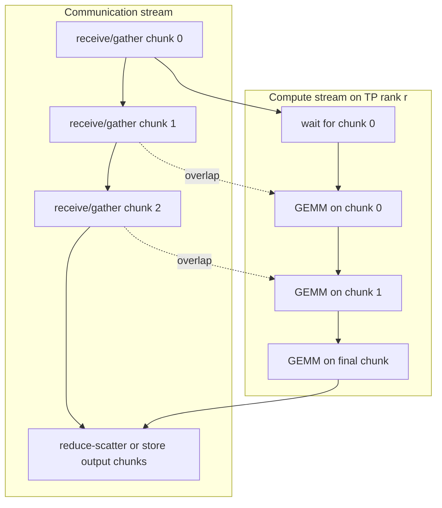

**Diagram notation key:** chunk numbers are ordinary pipeline chunks; `GEMM` is matrix multiplication; this diagram intentionally avoids symbolic tensor formulas because the point is stream overlap, not tensor placement.


At the programming-model level, async TP still implements `all-gather`, `reduce-scatter`, and sometimes `all-reduce`. At the implementation level, it may decompose those collectives into lower-level transfers, use symmetric memory, CUDA streams, and events, or rely on compiler rewrites. This is the main place where TP can involve p2p-like operations, but those operations are an implementation strategy rather than the logical TP API.

The TorchTitan/PyTorch async TP work is important because it shows this overlap entering a native PyTorch stack. The public post describes two fused patterns: `all-gather -> matmul` and `matmul -> reduce-scatter`, reports forward and end-to-end speedups on Llama-family training, and notes that `torch.compile` can detect some TP patterns and rewrite them into async TP operations.

Sources: [TorchTitan async TP post](https://discuss.pytorch.org/t/distributed-w-torchtitan-introducing-async-tensor-parallelism-in-pytorch/209487), [TorchTitan repository](https://github.com/pytorch/torchtitan), [PyTorch tensor parallel docs](https://docs.pytorch.org/docs/stable/distributed.tensor.parallel), [CoCoNeT / Breaking the Computation and Communication Abstraction Barrier, ASPLOS 2022](https://www.microsoft.com/en-us/research/publication/breaking-the-computation-and-communication-abstraction-barrier-in-distributed-machine-learning-workloads/).

### 3.8 TP-Aware CUDA and Kernel Techniques

TP changes local tensor shapes. If $t$ is too large, each rank's GEMM becomes skinny, launch overhead grows, and tensor-core utilization can fall. TP-aware kernels therefore optimize both the math and the communication boundary.

#### 3.8.1 Local GEMM Shape Quality

For a column-parallel linear, local GEMM is:

$$
[N,H]\times[H,F/t]\rightarrow[N,F/t].
$$

For a row-parallel linear, local GEMM is:

$$
[N,H/t]\times[H/t,F]\rightarrow[N,F].
$$

The total arithmetic is approximately unchanged:

$$
\mathrm{FLOPs}_{\mathrm{global}} \approx 2NHF,
\quad
\mathrm{FLOPs}_{\mathrm{rank}} \approx \frac{2NHF}{t}.
$$

But performance is not determined by FLOPs alone. Local dimensions must align with tensor-core tile requirements, memory coalescing, epilogue fusion, and launch overhead. A TP degree that fits memory may still be slower if $F/t$, $H/t$, or $N/t$ becomes too small.

#### 3.8.2 Fused Epilogues and Layout-Stable Collectives

Column-parallel projections benefit from fused epilogues because the output shard is immediately consumed locally:

$$
Y_r = \mathrm{SwiGLU}(XW^{gate}_r,\;XW^{up}_r).
$$

The runtime can fuse bias, activation, gating, quantization, or dropout-like work before any TP collective. Row-parallel projections benefit when the local partial output is laid out exactly as required by the following `all-reduce` or `reduce-scatter`. Extra transposes can dominate small local shards.

#### 3.8.3 Low-Precision Communication and Scale Layout

Low precision affects TP because TP repeatedly communicates activations and partial outputs. For block-scaled formats such as MXFP8, an element $x_k$ is represented approximately as:

$$
x_k \approx s_{b(k)} q_k,
$$

where $q_k$ is the low-precision payload, $b(k)$ maps element $k$ to a scaling block, and $s_{b(k)}$ is the scale for that block. Transformer Engine's MXFP8 documentation describes blockwise scaling with one scale per 32 consecutive values and notes that communication and GEMM may use different scale layouts. The consequence for TP is that an `all-gather` may gather compact low-precision data and scales, then swizzle scale metadata into the layout required by the GEMM kernel.

#### 3.8.4 TP-Aware Megakernels

Hazy Research's 2025 tensor-parallel Llama megakernel work treats a TP forward pass as a schedule over compute, memory movement, and inter-GPU communication. The important primitive is **in-kernel or runtime-level overlap**: some threads or SM partitions issue communication or stores while others continue useful compute. This is most relevant for inference, where batch shapes, KV-cache reads, and latency/throughput tradeoffs differ from training.

This line of work does not change the mathematical TP decomposition. It changes how local kernels and communication are interleaved. In other words, TP-aware kernels lower the same logical operations:

$$
\text{column GEMM} \rightarrow \text{local attention/activation} \rightarrow \text{row GEMM} \rightarrow \text{collective}
$$

into a more overlapped GPU program.

Sources: [Transformer Engine MXFP8 docs](https://nvidia.github.io/TransformerEngine/features/low_precision_training/mxfp8/mxfp8.html), [Transformer Engine FP8 block scaling docs](https://docs.nvidia.com/deeplearning/transformer-engine/user-guide/features/low_precision_training/fp8_blockwise_scaling/fp8_blockwise_scaling.html), [Hazy Research TP megakernel post](https://hazyresearch.stanford.edu/blog/2025-09-28-tp-llama-main), [Megatron-Core tensor-parallel APIs](https://docs.nvidia.com/megatron-core/developer-guide/latest/apidocs/core/core.tensor_parallel.layers.html), [CUTLASS documentation](https://docs.nvidia.com/cutlass/).

### 3.9 Choosing a TP Degree

The best TP degree balances memory, local GEMM efficiency, and communication exposure. A useful mental model is:

$$
T_{\mathrm{layer}}(t)
\approx
T_{\mathrm{local\_gemm}}(t)
+ T_{\mathrm{collective}}(t)
+ T_{\mathrm{layout}}(t)
- T_{\mathrm{overlap}}(t).
$$

Here:

- $T_{\mathrm{local\_gemm}}(t)$ is time for smaller per-rank GEMMs.
- $T_{\mathrm{collective}}(t)$ is time for `all-reduce`, `reduce-scatter`, or `all-gather`.
- $T_{\mathrm{layout}}(t)$ is time spent reshaping, transposing, quantizing, dequantizing, or swizzling.
- $T_{\mathrm{overlap}}(t)$ is the portion of communication hidden by async TP or kernel scheduling.

Increasing $t$ reduces per-rank parameter and activation shards:

$$
M_{\mathrm{weight,rank}} \approx \frac{M_{\mathrm{weight,total}}}{t}
$$

for TP-sharded weights, but it increases the number of participants in collectives and can make local GEMMs less efficient. Production systems therefore often keep TP within a node and use other axes for larger scale: FSDP/DP for replicas and optimizer states, PP for depth, CP for long sequence length, and EP for MoE experts.

Sources: [Megatron-Core parallelism guide](https://docs.nvidia.com/megatron-core/developer-guide/latest/user-guide/parallelism-guide.html), [TorchTitan repository](https://github.com/pytorch/torchtitan), [PyTorch DTensor docs](https://docs.pytorch.org/docs/stable/distributed.tensor.html), [Hugging Face Accelerate Megatron-LM guide](https://huggingface.co/docs/accelerate/main/usage_guides/megatron_lm).

### 3.10 Sources and Lineage

Recent sources: PyTorch [`torch.distributed.tensor.parallel`](https://docs.pytorch.org/docs/stable/distributed.tensor.parallel), PyTorch [`DTensor`](https://docs.pytorch.org/docs/stable/distributed.tensor.html), TorchTitan [async tensor parallelism](https://discuss.pytorch.org/t/distributed-w-torchtitan-introducing-async-tensor-parallelism-in-pytorch/209487), [TorchTitan repository](https://github.com/pytorch/torchtitan), NVIDIA [Megatron-Core parallelism guide](https://docs.nvidia.com/megatron-core/developer-guide/latest/user-guide/parallelism-guide.html), Megatron-Core [`ColumnParallelLinear`, `RowParallelLinear`, and `VocabParallelEmbedding`](https://docs.nvidia.com/megatron-core/developer-guide/latest/apidocs/core/core.tensor_parallel.layers.html), MLSys 2025 [Vocabulary Parallelism](https://proceedings.mlsys.org/paper_files/paper/2025/hash/10e400a587ff6925e4e26333b419ff55-Abstract-Conference.html), Transformer Engine [MXFP8](https://nvidia.github.io/TransformerEngine/features/low_precision_training/mxfp8/mxfp8.html), and Hazy Research [TP megakernel analysis](https://hazyresearch.stanford.edu/blog/2025-09-28-tp-llama-main).

Lineage: [Megatron-LM tensor model parallelism](https://arxiv.org/abs/1909.08053) introduced the column/row transformer split that remains the default dense-TP pattern. [Reducing Activation Recomputation in Large Transformer Models](https://proceedings.mlsys.org/paper_files/paper/2023/hash/80083951326cf5b35e5100260d64ed81-Abstract-mlsys2023.html) introduced Megatron-style sequence parallelism as a TP companion for activation-memory reduction. CoCoNeT and related work on breaking the compute/communication abstraction barrier provide lineage for async TP overlap, but TorchTitan is the more recent public PyTorch-native evidence.

### 3.11 Caveats

Tensor parallelism is powerful but not free. It reduces per-rank tensor size while adding synchronization inside each transformer layer. It works best when the TP group has very high bandwidth, when local GEMMs remain tensor-core efficient, and when layout transitions are minimized. Sequence parallelism saves activation memory but should not be confused with context parallelism for long-context attention. Vocabulary parallelism avoids full-logit materialization and balances vocabulary-heavy stages, but it complicates tied embeddings, loss computation, sampling, and pipeline integration. Async TP and TP-aware kernels can hide communication, but their benefits depend on exact model shapes, compiler support, CUDA/NCCL behavior, and whether enough independent work exists to overlap.

## 4. Pipeline Parallelism: Depth-Axis Parallelism and Modern Schedules


Pipeline parallelism (PP) splits a neural network along model depth. Instead of placing all transformer layers on every device, the system assigns consecutive layer intervals to pipeline stages. A microbatch enters stage 0, stage 0 sends a boundary activation to stage 1, stage 1 continues the computation, and so on until the final stage computes the loss. Backward propagation sends boundary gradients in the reverse direction.

The recent frontier-era view is that PP is not a single schedule. It is a stack of primitives: stage partitioning, boundary shape contracts, microbatching, point-to-point send/recv, warmup and drain, activation lifetime control, backward decomposition into input-gradient and weight-gradient work, optimizer barriers, activation offload/prefetch, and composition with tensor/data/expert parallel collectives. Recent work improves PP by manipulating these primitives directly:

- [Zero Bubble Pipeline Parallelism](https://proceedings.iclr.cc/paper_files/paper/2024/hash/d5a8e37f38a08c68162452dcba89ae9c-Abstract-Conference.html) splits backward into dependency-critical input-gradient work and deferrable weight-gradient work.
- [Pipeline Parallelism with Controllable Memory](https://proceedings.neurips.cc/paper_files/paper/2024/hash/527dad0b9159805289906d5740a0bdd3-Abstract-Conference.html) treats activation lifetime as a schedule-controlled quantity.
- [PipeOffload](https://icml.cc/virtual/2025/poster/45468) uses pipeline slack to evict and prefetch activations.
- [Balancing Pipeline Parallelism with Vocabulary Parallelism](https://proceedings.mlsys.org/paper_files/paper/2025/hash/10e400a587ff6925e4e26333b419ff55-Abstract-Conference.html) removes embedding and LM-head imbalance from PP.
- [DeepSeek-V3 DualPipe](https://arxiv.org/abs/2412.19437), the [DeepSeek DualPipe repository](https://github.com/deepseek-ai/DualPipe), and [DualPipeV](https://sail.sea.com/blog/articles/63) co-design PP with MoE expert-parallel all-to-all overlap.
- [PyTorch `torch.distributed.pipelining`](https://docs.pytorch.org/docs/2.9/distributed.pipelining.html) and the [TorchTitan zero-bubble post](https://discuss.pytorch.org/t/distributed-w-torchtitan-training-with-zero-bubble-pipeline-parallelism/214420) make schedules, stages, shapes, and backward partitioning runtime abstractions.

Older systems such as [GPipe](https://arxiv.org/abs/1811.06965), [PipeDream](https://arxiv.org/abs/1806.03377), and [Megatron-LM interleaved PP](https://arxiv.org/abs/2104.04473) are used here as lineage. They define the vocabulary of microbatching, 1F1B, asynchronous pipelines, and virtual stages, but recent 2024-2026 work is the center of the section.

### 4.1 System Model, Variables, and Shapes

Let a transformer have $L$ layers and let PP degree be $p$. Stage $s \in \{0,\ldots,p-1\}$ owns a consecutive layer interval $\mathcal{L}_s$ and parameters $\theta_s$. The model is decomposed as:

$$
f(x;\theta)
=
f_{p-1}
\left(
f_{p-2}
\left(
\cdots
f_0(x;\theta_0)
\cdots;\theta_{p-2}
\right);
\theta_{p-1}
\right).
$$

The global batch is split into $m$ microbatches. For data-parallel degree $d$, per-microbatch local batch size $b_\mu$, and global batch size $B_{\mathrm{global}}$:

$$
B_{\mathrm{global}} = d \cdot m \cdot b_\mu.
$$

For microbatch $i$, stage $s$ receives boundary activation $h_{i,s}$, computes:

$$
h_{i,s+1}=f_s(h_{i,s};\theta_s),
$$

and sends $h_{i,s+1}$ to stage $s+1$. During backward, stage $s$ receives:

$$
g_{i,s+1} = \frac{\partial \mathcal{L}_i}{\partial h_{i,s+1}},
$$

computes input gradient:

$$
g_{i,s} = \frac{\partial \mathcal{L}_i}{\partial h_{i,s}},
$$

and accumulates parameter gradient:

$$
\nabla_{\theta_s}\mathcal{L}_i
=
\frac{\partial \mathcal{L}_i}{\partial \theta_s}.
$$

The common dense transformer boundary shape is:

$$
h_{i,s} \in \mathbb{R}^{b_\mu \times S \times H},
$$

where $S$ is sequence length and $H$ is hidden size. In hybrid parallel jobs, the actual transmitted local shape can be:

$$
h_{i,s}^{\mathrm{local}}
\in
\mathbb{R}^{b_\mu \times S/c_p \times H/t_p},
$$

where $c_p$ is context-parallel degree and $t_p$ is tensor-parallel degree, assuming both shard the boundary tensor. Some architectures add extra axes; for example, multi-stream hidden states can use:

$$
h_{i,s}^{\mathrm{local}}
\in
\mathbb{R}^{b_\mu \times S/c_p \times r_{\mathrm{stream}} \times H/t_p},
$$

where $r_{\mathrm{stream}}$ is the number of residual or hidden streams crossing the stage boundary.

| Boundary object | Forward direction | Backward direction | Typical local shape | Required contract |
|---|---:|---:|---|---|
| Hidden activation | Stage $s \rightarrow s+1$ | Gradient $s+1 \rightarrow s$ | $[b_\mu,S,H]$, $[b_\mu,S,H/t_p]$, or $[b_\mu,S/c_p,H/t_p]$ | Shape, dtype, layout, placement, RNG/checkpoint metadata. |
| Attention KV metadata | Usually internal to stage; may cross boundary in custom partitions | Gradient metadata or recompute metadata | Ragged THD offsets, KV block ids, sparse block ids | Must match attention mask and sequence packing. |
| MoE router metadata | Can cross if router and expert block are split | Token combine gradient metadata | Token permutation, expert ids, counts, offsets | Must preserve token order and capacity/drop policy. |
| Loss/logits boundary | Penultimate stage to final stage, or vocab-parallel shards | Logit gradient or embedding gradient | $[b_\mu S,V/q]$ if vocab-sharded | Requires reductions over vocab shards. |
| Optimizer state | No PP p2p path | No PP p2p path | Stage-local or ZeRO/FSDP-sharded | Optimizer step waits for all local gradient contributions. |


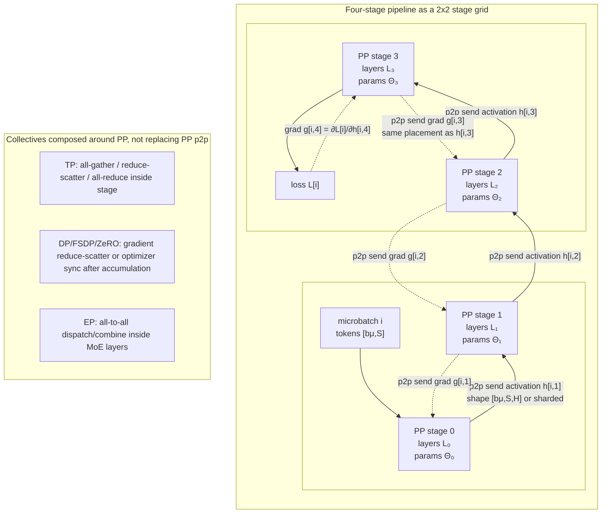

**Diagram notation key:** `bμ` maps to $b_{\mu}$; `L₀...L₃` maps to $L_0,\ldots,L_3$; `Θ₀...Θ₃` maps to $\Theta_0,\ldots,\Theta_3$; `h[i,s]` maps to $h_{i,s}$; `g[i,s]` maps to $g_{i,s}$; `∂L[i]/∂h[i,4]` maps to $\partial L_i / \partial h_{i,4}$.


### 4.2 Primitive: Stage Partitioning and Boundary Contracts

Stage partitioning decides which layers, embeddings, attention blocks, MoE experts, router blocks, normalization layers, and loss components live on each PP rank. The simplest partition assigns equal numbers of transformer blocks per stage. Modern training jobs instead balance time, memory, and boundary communication.

Let:

- $t_s^F$ be forward compute time on stage $s$.
- $t_s^B$ be input-gradient backward time on stage $s$.
- $t_s^W$ be weight-gradient time on stage $s$.
- $t_s^{\mathrm{p2p}}$ be activation/gradient point-to-point transfer time.
- $t_s^{\mathrm{coll}}$ be intra-stage or cross-axis collective time from TP, DP/FSDP, CP, or EP.
- $P_s$ be stage parameter memory.
- $O_s$ be optimizer-state memory.
- $A_s^{\mathrm{peak}}$ be peak activation memory.
- $M_s$ be available device memory.

A practical partitioning objective is:

$$
\min_{\{\mathcal{L}_s\}}
\max_s
\left(
t_s^F+t_s^B+t_s^W+t_s^{\mathrm{p2p}}+t_s^{\mathrm{coll}}
\right)
$$

subject to:

$$
P_s+O_s+A_s^{\mathrm{peak}}+M_s^{\mathrm{workspace}} \le M_s.
$$

Here $M_s^{\mathrm{workspace}}$ includes kernel scratch buffers, attention workspaces, CUDA graph pools, communication buffers, and activation offload staging buffers.

The stage boundary is a distributed ABI. A correct PP runtime must know, for each send/recv edge:

- Tensor shape and whether dimensions are global or already sharded.
- Tensor dtype and quantization state.
- Layout, such as contiguous $[B,S,H]$, sequence-sharded $[B,S/c_p,H]$, tensor-sharded $[B,S,H/t_p]$, or THD ragged layout.
- Whether the receiver expects materialized activations or will recompute them.
- Which CUDA stream and event order make the send/recv safe.
- Which RNG state, dropout mask, or activation-checkpoint metadata is required for backward.

PP boundary traffic is normally point-to-point. Tensor/data/expert/context parallelism introduces collectives around or inside a stage, but the depth boundary itself is usually $\mathrm{send}(h_{i,s+1})$ and $\mathrm{recv}(h_{i,s+1})$ in forward, then $\mathrm{send}(g_{i,s})$ and $\mathrm{recv}(g_{i,s})$ in backward. A schedule is invalid if one rank posts sends and receives in an order that no neighbor matches.

**Activation ping-pong boundary schedule.** A practical PP runtime often implements the boundary with two activation or gradient slots per neighbor. While stage $s$ computes microbatch $\mu_{i+1}$, a communication stream transfers slot $i\bmod 2$ from microbatch $\mu_i$ to stage $s+1$; in backward the same two-slot contract carries $g_{i,s}$ in the reverse direction. This is a CUDA-stream-level ping-pong schedule: the slots are ordinary device buffers, and correctness comes from stream waits and events rather than from a global device synchronization.

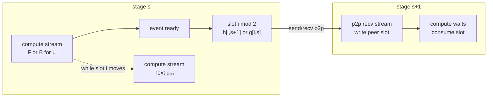

**Diagram notation key:** `μᵢ` maps to $\mu_i$; `μᵢ₊₁` maps to $\mu_{i+1}$; `h[i,s+1]` maps to $h_{i,s+1}$; `g[i,s]` maps to $g_{i,s}$; `slot i mod 2` maps to buffer slot $i\bmod 2$; `F or B` means a forward or backward stage computation.

Links: [PyTorch pipeline docs](https://docs.pytorch.org/docs/2.9/distributed.pipelining.html), [PyTorch pipeline tutorial](https://docs.pytorch.org/tutorials/intermediate/pipelining_tutorial.html), [Megatron-LM interleaved PP lineage](https://arxiv.org/abs/2104.04473).

### 4.3 Primitive: Microbatching, Warmup, Steady State, and Drain

Microbatching creates pipeline concurrency. Without microbatching, only one stage is active at a time: stage 0 computes, then stage 1, then stage 2. With $m$ microbatches, different stages process different microbatches simultaneously.

For an ideal pipeline with $p$ equal-cost stages and $m$ microbatches, the fill-drain schedule has a bubble fraction roughly:

$$
\beta_{\mathrm{flush}}
\approx
\frac{p-1}{m+p-1},
$$

and an efficiency:

$$
\eta_{\mathrm{flush}}
\approx
1-\beta_{\mathrm{flush}}
=
\frac{m}{m+p-1}.
$$

Here $\beta_{\mathrm{flush}}$ is the fraction of time lost to stages being idle, and $\eta_{\mathrm{flush}}$ is the fraction of ideal fully occupied compute time achieved by the schedule. This approximation assumes equal stage times, no communication, and no schedule overhead. Real systems depart from it, but the formula explains why increasing $m$ fills bubbles.

Pipeline time has three phases:

1. **Warmup.** Forward microbatches enter the pipeline before enough downstream gradients exist.
2. **Steady state.** Stages alternate or overlap forward and backward work.
3. **Drain.** Remaining backward work exits the pipeline after the last forward has entered.

The tradeoff is activation memory. Let $a_{i,s}$ be bytes of saved activation state for microbatch $i$ on stage $s$. Let $t_{i,s}^{\mathrm{make}}$ be the time the activation becomes live, and $t_{i,s}^{\mathrm{free}}$ be the time the last consumer of that activation finishes. Peak activation memory is:

$$
A_s^{\mathrm{peak}}
=
\max_t
\sum_{i=0}^{m-1}
a_{i,s}
\cdot
\mathbf{1}
\left[
t_{i,s}^{\mathrm{make}}
\le t <
t_{i,s}^{\mathrm{free}}
\right],
$$

where $\mathbf{1}[\cdot]$ is an indicator function equal to 1 when the condition holds and 0 otherwise. More microbatches can reduce bubbles, but they can also increase the number of live activations. Recent schedules improve PP by reducing exposed bubbles without simply increasing $m$.

Links: [GPipe lineage](https://arxiv.org/abs/1811.06965), [PipeDream/1F1B lineage](https://arxiv.org/abs/1806.03377), [Zero Bubble PP](https://proceedings.iclr.cc/paper_files/paper/2024/hash/d5a8e37f38a08c68162452dcba89ae9c-Abstract-Conference.html).

### 4.4 Primitive: Point-to-Point Send/Recv and Collective Composition

The defining communication pattern in PP is neighbor point-to-point transfer:

$$
\mathrm{send}_{s\rightarrow s+1}(h_{i,s+1}),
\qquad
\mathrm{recv}_{s\leftarrow s-1}(h_{i,s}),
$$

in forward, and:

$$
\mathrm{send}_{s\rightarrow s-1}(g_{i,s}),
\qquad
\mathrm{recv}_{s\leftarrow s+1}(g_{i,s+1}),
$$

in backward. The sent gradient $g_{i,s}$ must have the same logical placement as the forward activation $h_{i,s}$, because it is the derivative with respect to that boundary tensor.

For a boundary tensor with local shape $[b_\mu,S,H/t_p]$ and dtype size $e$ bytes, the approximate one-way transfer volume is:

$$
V_{\mathrm{p2p}}
=
b_\mu \cdot S \cdot \frac{H}{t_p} \cdot e.
$$

If context parallelism also shards the sequence dimension, replace $S$ by $S/c_p$. If a multi-stream architecture sends $r_{\mathrm{stream}}$ hidden streams, multiply by $r_{\mathrm{stream}}$.

Collectives enter PP through composition:

- **Tensor parallelism.** A stage may run all-gather, reduce-scatter, or all-reduce inside attention and MLP projections before sending its PP boundary activation.
- **Data parallelism/FSDP/ZeRO.** After all microbatches contribute gradients, the system reduces, shards, or synchronizes gradients and optimizer states across data-parallel replicas.
- **Expert parallelism.** MoE layers dispatch tokens to experts and combine outputs through all-to-all collectives inside a stage.
- **Context parallelism.** Long-context attention may all-gather, ring-stream, or reduce-scatter KV or attention states before the PP boundary is produced.
- **Vocabulary parallelism.** The final stage may reduce local vocabulary logits or cross-entropy statistics across vocabulary shards.

Correctness requires a strict distinction: PP p2p edges pass layer-boundary activations/gradients along depth; collectives synchronize or exchange shards along other mesh axes. A deadlock often appears when a schedule assumes a p2p receive can occur before an internal collective that actually produces the send tensor.

Links: [PyTorch `torch.distributed.pipelining`](https://docs.pytorch.org/docs/2.9/distributed.pipelining.html), [TorchTitan zero-bubble discussion](https://discuss.pytorch.org/t/distributed-w-torchtitan-training-with-zero-bubble-pipeline-parallelism/214420), [DeepSeek DualPipe repository](https://github.com/deepseek-ai/DualPipe).

### 4.5 Primitive: The Schedule DAG and the F/B/W Split

Every PP schedule is a topological ordering of a dependency graph. For microbatch $i$ and stage $s$, define:

- $F_{i,s}$: forward compute for stage $s$, producing $h_{i,s+1}$.
- $B_{i,s}$: backward-input compute for stage $s$, producing $g_{i,s}$.
- $W_{i,s}$: backward-weight compute for stage $s$, accumulating $\nabla_{\theta_s}\mathcal{L}_i$.

The dependencies are:

$$
F_{i,s} \rightarrow F_{i,s+1},
$$

because stage $s+1$ needs $h_{i,s+1}$. Backward dependencies reverse direction:

$$
B_{i,s+1} \rightarrow B_{i,s},
$$

because stage $s$ needs $g_{i,s+1}$. Both backward components depend on the forward activation:

$$
F_{i,s} \rightarrow B_{i,s},
\qquad
F_{i,s} \rightarrow W_{i,s}.
$$

Weight-gradient work also depends on the upstream gradient:

$$
B_{i,s+1} \rightarrow W_{i,s}.
$$

The mathematical split is:

$$
B_{i,s}:
\quad
g_{i,s}
=
g_{i,s+1}
\frac{\partial f_s(h_{i,s};\theta_s)}{\partial h_{i,s}},
$$

and:

$$
W_{i,s}:
\quad
\nabla_{\theta_s}\mathcal{L}_i
=
g_{i,s+1}
\frac{\partial f_s(h_{i,s};\theta_s)}{\partial \theta_s}.
$$

The key observation is that $B_{i,s}$ is on the dependency path that unblocks earlier stages, while $W_{i,s}$ is not. $W_{i,s}$ must finish before the optimizer step, but it does not need to run immediately after $B_{i,s}$. This creates room for Zero Bubble and controllable-memory schedules.


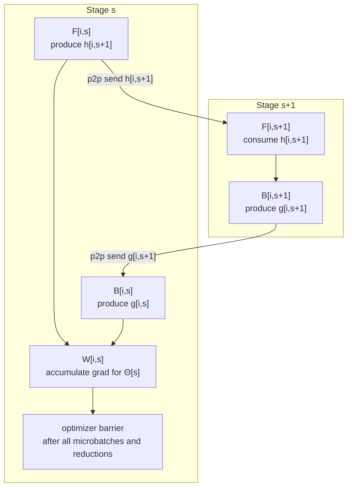

**Diagram notation key:** `F[i,s]`, `B[i,s]`, and `W[i,s]` map to $F_{i,s}$, $B_{i,s}$, and $W_{i,s}$; `h[i,s+1]` maps to $h_{i,s+1}$; `g[i,s]` maps to $g_{i,s}$; `Θ[s]` maps to $\Theta_s$.


Optimizer barriers are part of the schedule DAG. Before parameters $\theta_s$ are updated, the stage must have accumulated all microbatch gradients:

$$
G_s = \sum_{i=0}^{m-1} \nabla_{\theta_s}\mathcal{L}_i,
$$

and any required DP/FSDP/ZeRO gradient synchronization, overflow detection, global norm computation, or gradient clipping must be complete. Thus:

$$
W_{0,s},W_{1,s},\ldots,W_{m-1,s}
\rightarrow
\mathrm{GradSync}_s
\rightarrow
\mathrm{OptimizerStep}_s.
$$

Links: [Zero Bubble PP](https://proceedings.iclr.cc/paper_files/paper/2024/hash/d5a8e37f38a08c68162452dcba89ae9c-Abstract-Conference.html), [TorchTitan zero-bubble post](https://discuss.pytorch.org/t/distributed-w-torchtitan-training-with-zero-bubble-pipeline-parallelism/214420), [PyTorch schedule docs](https://docs.pytorch.org/docs/2.9/distributed.pipelining.html).

### 4.6 Zero Bubble Pipeline Parallelism

Zero Bubble Pipeline Parallelism is the central recent PP schedule advance. It keeps synchronous training semantics but fills pipeline idle slots with $W$ work. Classical 1F1B alternates forward and full backward after warmup; Zero Bubble splits backward into $B$ and $W$, then schedules $W$ in bubbles.

Let $t_{i,s}^F$, $t_{i,s}^B$, and $t_{i,s}^W$ be execution times for $F$, $B$, and $W$. Let $I_s(\sigma)$ be the amount of idle time on stage $s$ in schedule $\sigma$ after the dependencies for weight-gradient tasks are satisfied and before the optimizer barrier. A simplified hiding condition is:

$$
\sum_{i=0}^{m-1} t_{i,s}^W
\le
I_s(\sigma).
$$

This condition is not sufficient by itself because each $W_{i,s}$ can run only after its own dependencies are ready. It captures the scheduling goal: replace exposed idle time with deferrable weight-gradient compute.

Zero Bubble schedules include ZB1P, ZB2P, and ZBV variants. The exact naming is less important than the primitives:

- Split ordinary backward into `backward_input` and `backward_weight`.
- Make `backward_input` follow the critical path from final stage to first stage.
- Use `backward_weight` to fill warmup/drain and residual bubbles.
- Preserve the optimizer barrier so updates happen only after all stage-local gradients are complete.
- Optionally reduce optimizer-step synchronization overhead, a point explicitly discussed in the Zero Bubble paper as necessary to approach true zero bubble.

The ZBV schedule has a clean ideal condition. If:

$$
t^F \approx t^B \approx t^W
$$

for each stage, and the schedule has the expected number of virtual stages per rank, then the bubbles can be nearly eliminated. PyTorch's `ScheduleZBVZeroBubble` documentation notes this ideal equality condition and also notes that real models often have unequal phase times, motivating greedy or cost-aware scheduling.

The shape contract does not change under Zero Bubble. $F_{i,s}$ still sends $h_{i,s+1}$, $B_{i,s}$ still sends $g_{i,s}$, and $W_{i,s}$ produces only local parameter gradients. What changes is when $W_{i,s}$ runs and how long $h_{i,s}$ must remain available.

Links: [ICLR 2024 Zero Bubble paper](https://proceedings.iclr.cc/paper_files/paper/2024/hash/d5a8e37f38a08c68162452dcba89ae9c-Abstract-Conference.html), [arXiv summary](https://huggingface.co/papers/2401.10241), [Sail zero-bubble repository](https://github.com/sail-sg/zero-bubble-pipeline-parallelism), [PyTorch `ScheduleInterleavedZeroBubble` and `ScheduleZBVZeroBubble`](https://docs.pytorch.org/docs/2.9/distributed.pipelining.html).

### 4.7 Controllable-Memory Pipeline Schedules

Zero Bubble reduces idle time, but it can increase or preserve activation lifetime if $W$ work is delayed. Pipeline Parallelism with Controllable Memory makes activation memory an explicit schedule objective.

Let a schedule be built from repeated building blocks $q$. Each block has a first activation-producing operation at time $t_{\mathrm{first}}(q)$ and a last activation-consuming operation at time $t_{\mathrm{last}}(q)$. Define the lifespan:

$$
\ell(q)=t_{\mathrm{last}}(q)-t_{\mathrm{first}}(q).
$$

If $n_s(t)$ is the number of live blocks on stage $s$ at time $t$, and $a_s$ is activation memory per block on that stage, then:

$$
A_s^{\mathrm{peak}}
\approx
a_s \cdot \max_t n_s(t).
$$

For unequal activation sizes $a_{q,s}$:

$$
A_s^{\mathrm{peak}}
=
\max_t
\sum_q
a_{q,s}
\cdot
\mathbf{1}
\left[
t_{\mathrm{first}}(q)
\le t <
t_{\mathrm{last}}(q)
\right].
$$

Controllable-memory schedules search for a Pareto frontier:

$$
\min_{\sigma}
\left(
T(\sigma),
\max_s A_s^{\mathrm{peak}}(\sigma)
\right),
$$

where $T(\sigma)$ is iteration time. The paper introduces V-shaped blocks and schedules such as V-Min, V-Half, and V-ZB. Public abstracts report peak activation memory reductions to about one-half of 1F1B without sacrificing efficiency, and about one-third with comparable throughput under favorable assumptions.

The primitive technique is to place $F$, $B$, and $W$ so that activations die earlier. A schedule that is excellent for bubble removal can be poor for memory if it leaves many forward activations waiting for delayed $W$. Conversely, a memory-minimal schedule can expose more bubbles. The schedule designer controls:

- When to start backward for each microbatch.
- Whether $W$ runs early, late, or in bubble slots.
- Whether activation recomputation replaces storage.
- How many live building blocks each stage tolerates.
- Whether vocabulary or MoE imbalance changes the effective block size.

Links: [NeurIPS 2024 Controllable Memory paper](https://proceedings.neurips.cc/paper_files/paper/2024/hash/527dad0b9159805289906d5740a0bdd3-Abstract-Conference.html), [arXiv summary](https://huggingface.co/papers/2405.15362), [Sail zero-bubble repository with schedule implementations](https://github.com/sail-sg/zero-bubble-pipeline-parallelism), [Sea AI Lab V-shaped schedule discussion](https://sail.sea.com/blog/articles/63).

### 4.8 PipeOffload: Activation Offload and Prefetch as Schedule Primitives

PipeOffload attacks the same memory pressure from another angle. PP creates long activation lifetimes; some of that lifetime is idle. PipeOffload uses idle intervals to move activations from GPU HBM to host memory and prefetch them before backward or weight-gradient computation needs them.

For an activation $a$, define:

- $M(a)$: activation size in bytes.
- $B_{\mathrm{D2H}}$: device-to-host bandwidth.
- $B_{\mathrm{H2D}}$: host-to-device bandwidth.
- $t_{\mathrm{D2H}}(a)=M(a)/B_{\mathrm{D2H}}$: offload copy time.
- $t_{\mathrm{H2D}}(a)=M(a)/B_{\mathrm{H2D}}$: prefetch copy time.
- $t_{\mathrm{produce}}(a)$: time the activation is produced.
- $t_{\mathrm{consume}}(a)$: time the next required consumer begins.
- $t_{\mathrm{guard}}(a)$: scheduling guard time for events, stream ordering, and unavailable overlap.

The offload is hidden when:

$$
t_{\mathrm{D2H}}(a)+t_{\mathrm{H2D}}(a)+t_{\mathrm{guard}}(a)
\le
t_{\mathrm{consume}}(a)-t_{\mathrm{produce}}(a).
$$

This inequality is a useful teaching simplification. Real runtimes separately place the D2H and H2D intervals on copy engines, respect pinned-memory capacity, and account for PCIe or NVLink bandwidth contention.

For a set $\mathcal{O}$ of offloaded activations, GPU-resident peak activation memory becomes:

$$
A_{s,\mathrm{GPU}}^{\mathrm{peak}}
=
\max_t
\sum_i
a_{i,s}
\cdot
\mathbf{1}
\left[
t_{i,s}^{\mathrm{make}}
\le t <
t_{i,s}^{\mathrm{free}}
\right]
\cdot
\mathbf{1}
\left[
(i,s,t)\notin \mathcal{O}
\right].
$$

The primitive operations are:

1. **Select.** Choose activations whose lifetimes contain enough slack.
2. **Offload.** Issue async D2H copy after forward and after the last immediate local consumer.
3. **Protect.** Keep metadata, small tensors, and RNG/checkpoint state needed to reconstruct the activation's meaning.
4. **Prefetch.** Issue async H2D copy early enough that $B$ or $W$ does not stall.
5. **Synchronize.** Insert CUDA events so compute does not read a tensor before prefetch completes.

PipeOffload is not generic CPU offload. It is pipeline-schedule-aware activation migration. It is most attractive when $m$ or $p$ is large enough that many activations wait a long time before backward, and least attractive when copy bandwidth or host memory contention is already on the critical path.

Links: [ICML 2025 PipeOffload poster](https://icml.cc/virtual/2025/poster/45468), [Sea AI Lab publication page](https://sail.sea.com/research/publications/34), [Controllable Memory PP](https://proceedings.neurips.cc/paper_files/paper/2024/hash/527dad0b9159805289906d5740a0bdd3-Abstract-Conference.html).

### 4.9 Vocabulary-Balanced Pipeline Parallelism

Vocabulary layers are edge-stage hazards. The input embedding and output LM head can dominate parameters and compute when vocabulary size $V$ is large. A naive depth partition may leave the first or final PP stage slower and larger than the interior stages, increasing bubbles and memory pressure.

For logits:

$$
Z \in \mathbb{R}^{(b_\mu S) \times V},
$$

ordinary cross entropy for token row $j$ and target id $y_j$ is:

$$
\mathrm{CE}_j
=
-Z_{j,y_j}
+
\log
\sum_{v=1}^{V}
\exp(Z_{j,v}).
$$

Vocabulary parallelism shards the vocabulary dimension across $q$ devices:

$$
V=\bigcup_{r=0}^{q-1} V_r,
\qquad
|V_r|\approx V/q.
$$

Each shard computes local logits $Z_{j,V_r}$. The cross entropy can be computed by reductions over scalar statistics:

$$
m_j = \max_r \max_{v\in V_r} Z_{j,v},
$$

$$
u_j = \sum_r \sum_{v\in V_r} \exp(Z_{j,v}-m_j),
$$

$$
\mathrm{CE}_j
=
-Z_{j,y_j}
+
m_j
+
\log u_j.
$$

The shard containing $y_j$ contributes the target logit. The collectives are reductions over local maxima, local sums, and selected target logits rather than a full gather of $[b_\mu S,V]$ logits.

The MLSys 2025 vocabulary-balanced PP paper makes this pipeline-aware. It partitions vocabulary layers evenly across PP devices and groups computation into pipeline passes. The primitive is not just "tensor-parallel LM head"; it is **balancing the edge stage inside the PP schedule**. Vocab-balanced PP interacts with:

- Stage partitioning, because embedding and LM-head work no longer sit entirely on one edge stage.
- Activation lifetime, because additional passes can hold or recreate activations.
- Optimizer barriers, because vocab-sharded parameters may be sharded along a different axis than PP.
- Loss collectives, because cross-entropy reductions must happen before final gradients are produced.

Links: [MLSys 2025 Vocabulary Parallelism paper](https://proceedings.mlsys.org/paper_files/paper/2025/hash/10e400a587ff6925e4e26333b419ff55-Abstract-Conference.html), [OpenReview page](https://openreview.net/forum?id=nlRGXpglaO), [arXiv summary](https://huggingface.co/papers/2411.05288), [Controllable Memory PP](https://proceedings.neurips.cc/paper_files/paper/2024/hash/527dad0b9159805289906d5740a0bdd3-Abstract-Conference.html).

### 4.10 DualPipe and DualPipeV: Pipeline Scheduling for MoE Communication

MoE models add a second communication bottleneck. Expert parallelism dispatches tokens to ranks that own selected experts, computes expert MLPs, and combines outputs. The dispatch and combine phases are usually all-to-all communication. In DeepSeek-V3, the public technical report says expert-parallel communication creates a compute-to-communication ratio close to 1:1, motivating DualPipe.

For an MoE chunk, a simplified forward decomposition is:

$$
F_{\mathrm{MoE}}
=
F_{\mathrm{attn}}
+
C_{\mathrm{dispatch}}
+
F_{\mathrm{expert}}
+
C_{\mathrm{combine}},
$$

where $C_{\mathrm{dispatch}}$ and $C_{\mathrm{combine}}$ are all-to-all communication phases. Backward has analogous attention, dispatch/combine, and expert-gradient phases, often further split into $B$ and $W$.

If serialized, one chunk costs roughly:

$$
T_{\mathrm{serial}}
=
C_F + K_F + C_B + K_B,
$$

where $C_F$ and $C_B$ are forward/backward compute times and $K_F$, $K_B$ are forward/backward communication times. An overlapped schedule targets:

$$
T_{\mathrm{overlap}}
\approx
\max(C_F+C_B,\;K_F+K_B),
$$

or at finer granularity:

$$
T_{\mathrm{chunk}}
\approx
\max(C_{\mathrm{chunk}},K_{\mathrm{chunk}}).
$$

DualPipe is a bidirectional PP schedule that overlaps forward and backward computation-communication phases. The public DeepSeek DualPipe repository defines schedule symbols including $F$, $B$, $W$, and overlapped $F\&B$. It notes that real applications need a custom `overlapped_forward_backward` method tailored to the module.

DualPipeV is a V-shaped variant motivated by Sea AI Lab's "cut-in-half" analysis. The core claim is that the mirrored halves of DualPipe can be transformed into a V-shaped schedule that reduces the parameter redundancy of the original dual form while preserving most scheduling benefits. PyTorch's pipeline docs also expose a `ScheduleDualPipeV` schedule class, identifying DualPipeV as part of the modern PP schedule family.

The boundary tensors in DualPipe-style MoE PP include ordinary PP activations and MoE routing metadata:

$$
h_{i,s}^{\mathrm{local}}
\in
\mathbb{R}^{b_\mu \times S \times H/t_p},
$$

plus token dispatch structures such as expert ids:

$$
e_{i} \in \{0,\ldots,E-1\}^{b_\mu S \times k},
$$

where $E$ is number of experts and $k$ is top-$k$ routing. Dispatch counts and offsets must remain aligned with the activation permutation. If a PP boundary cuts across MoE internals, the stage contract must include permutation and combine metadata, not just hidden activations.

Links: [DeepSeek-V3 technical report](https://arxiv.org/abs/2412.19437), [DeepSeek DualPipe repository](https://github.com/deepseek-ai/DualPipe), [DualPipeV analysis](https://sail.sea.com/blog/articles/63), [PyTorch pipeline schedule docs](https://docs.pytorch.org/docs/2.9/distributed.pipelining.html).

### 4.11 PyTorch Pipelining and TorchTitan Runtime Support

Recent PP research becomes more useful when the runtime can express it. PyTorch's `torch.distributed.pipelining` provides three central abstractions:

- `PipelineStage`: owns a stage module, stage index, input/output shape information, device, and process group.
- `PipelineSchedule`: defines the order of microbatch operations.
- Runtime execution: lowers the schedule to local compute, p2p send/recv, gradient handling, and loss merging.

The docs list classical schedules such as `ScheduleGPipe`, `Schedule1F1B`, and `ScheduleInterleaved1F1B`, plus recent schedules such as `ScheduleInterleavedZeroBubble`, `ScheduleZBVZeroBubble`, and `ScheduleDualPipeV`. This matters because a schedule can now be described as data rather than hard-coded control flow.

TorchTitan's zero-bubble writeup highlights two runtime primitives:

1. **Declarative schedule IR.** A schedule describes operations such as full backward, backward-input, and backward-weight, decoupled from the executor.
2. **Autograd partitioning.** The runtime can separate backward-input and backward-weight without every model author manually writing a custom autograd function.

The platform-level responsibilities are:

- Validate that every stage boundary shape matches the p2p peer's expected shape.
- Split inputs into microbatches using explicit chunk specs.
- Pair sends and receives in the exact schedule order.
- Preserve loss scaling and gradient scaling across microbatch accumulation.
- Compose with FSDP, tensor parallelism, activation checkpointing, and custom loss functions.
- Handle schedules with multiple local stages per rank.

The docs mark `torch.distributed.pipelining` as alpha, so APIs may move. The system direction is nevertheless important: PP is moving from bespoke training-loop code toward explicit stage objects and schedule IRs.

Links: [PyTorch pipeline docs](https://docs.pytorch.org/docs/2.9/distributed.pipelining.html), [PyTorch pipeline tutorial](https://docs.pytorch.org/tutorials/intermediate/pipelining_tutorial.html), [TorchTitan zero-bubble post](https://discuss.pytorch.org/t/distributed-w-torchtitan-training-with-zero-bubble-pipeline-parallelism/214420), [TorchTitan repository](https://github.com/pytorch/torchtitan).

### 4.12 Optimizer Barriers, Gradient Synchronization, and Correctness

PP schedules can move compute, but they cannot move the optimizer step before gradients exist. Let:

$$
G_s = \sum_{i=0}^{m-1} \nabla_{\theta_s}\mathcal{L}_i
$$

be the accumulated local gradient on stage $s$. In data-parallel training with $d$ replicas, the synchronized gradient is:

$$
\bar{G}_s
=
\frac{1}{d}
\sum_{r=0}^{d-1}
G_s^{(r)}.
$$

With ZeRO or FSDP, this synchronization may be a reduce-scatter rather than an all-reduce, and optimizer states may be sharded. With mixed precision, overflow detection and loss-scale updates may add another global condition:

$$
\mathrm{OptimizerStep}_s
\text{ is allowed only if }
\mathrm{finite}(\bar{G}_s)
\text{ and all required gradient shards are ready.}
$$

This creates barriers that recent schedules must respect:

- **Microbatch accumulation barrier.** All $W_{i,s}$ for the step must finish.
- **Gradient synchronization barrier.** DP/FSDP/ZeRO reductions must finish.
- **Gradient clipping/global norm barrier.** If the optimizer clips by global norm, every stage and data-parallel group must contribute.
- **Overflow/loss-scale barrier.** Mixed-precision optimizers must agree on whether to skip the step.
- **Parameter update barrier.** The next iteration's forward must see the intended parameter version.

PipeDream-style asynchronous pipelines relaxed some of these constraints with weight stashing and stale weights. Modern frontier training often prefers synchronous semantics, then recovers utilization through Zero Bubble, overlap, and schedule search. The Zero Bubble paper's discussion of bypassing optimizer-step synchronization should therefore be read as an optimizer-semantics optimization, not merely a scheduling convenience.

Links: [Zero Bubble PP](https://proceedings.iclr.cc/paper_files/paper/2024/hash/d5a8e37f38a08c68162452dcba89ae9c-Abstract-Conference.html), [PipeDream lineage](https://arxiv.org/abs/1806.03377), [PyTorch pipeline docs](https://docs.pytorch.org/docs/2.9/distributed.pipelining.html).

### 4.13 Composing PP With Tensor, Context, Expert, and Data Parallelism

In frontier training, PP is rarely alone. A common mesh includes:

$$
\mathrm{world\_size}
=
d_p \cdot t_p \cdot p_p \cdot c_p \cdot e_p,
$$

where $d_p$ is data-parallel degree, $t_p$ tensor-parallel degree, $p_p$ pipeline-parallel degree, $c_p$ context-parallel degree, and $e_p$ expert-parallel degree. Not every job uses all axes.

Composition changes the PP section in four ways:

1. **Boundary shapes become local placements.** A tensor sent across PP may already be sharded by TP or CP.
2. **Stage-local compute contains collectives.** TP, CP, and EP communication may happen before a PP send can occur.
3. **Schedule timing changes.** A stage's $t^F,t^B,t^W$ include internal collectives and kernel overlap.
4. **Optimizer barriers widen.** DP/FSDP/ZeRO synchronization spans ranks that are not adjacent PP neighbors.

For example, a transformer MLP split by tensor parallelism may compute:

$$
Y = X W_1,
\qquad
Z = \phi(Y) W_2,
$$

with $W_1$ column-sharded and $W_2$ row-sharded. The stage may need TP all-gather or reduce-scatter before it can expose the PP boundary activation. In an MoE layer, the stage may need EP all-to-all dispatch and combine. In long-context training, it may need CP KV exchange. The PP scheduler sees the whole stage as a timed operation, but a high-performance runtime needs the internal communication plan to overlap with p2p sends when safe.

Links: [DeepSeek-V3 technical report](https://arxiv.org/abs/2412.19437), [DeepSeek DualPipe repository](https://github.com/deepseek-ai/DualPipe), [PyTorch TorchTitan zero-bubble post](https://discuss.pytorch.org/t/distributed-w-torchtitan-training-with-zero-bubble-pipeline-parallelism/214420), [Megatron-LM large-scale training](https://arxiv.org/abs/2104.04473).

### 4.14 Choosing a Modern PP Schedule

The schedule choice depends on compute balance, memory pressure, interconnect, and composition axes. A useful decision table is:

| Workload condition | Prefer | Primitive reason |
|---|---|---|
| Model too deep or too large for TP/FSDP alone | PP with 1F1B or interleaving baseline | Depth partition reduces per-device parameters and activations. |
| Bubble overhead dominates and memory is acceptable | Zero Bubble / ZBV | $W$ fills warmup/drain idle time. |
| Activation memory dominates | Controllable-memory schedules, recomputation, PipeOffload | Activation lifetime rather than bubble fraction is the binding constraint. |
| Many long-lived activations have slack | PipeOffload | D2H/H2D copies can be hidden behind compute or communication. |
| Embedding or LM head makes edge stage slow | Vocabulary-balanced PP | Vocab work is spread and loss reductions replace full-logit gathering. |
| MoE all-to-all dominates | DualPipe or DualPipeV | PP schedule overlaps expert dispatch/combine with compute and reverse-direction work. |
| Need native PyTorch composability | `torch.distributed.pipelining` and TorchTitan patterns | Stage objects, schedule IR, and autograd partitioning reduce bespoke schedule code. |

The critical measurement is not just model FLOPs utilization. Measure:

$$
t^F_s,\quad t^B_s,\quad t^W_s,\quad t^{\mathrm{p2p}}_s,\quad
t^{\mathrm{coll}}_s,\quad
A_s^{\mathrm{peak}},
$$

for every stage $s$, using the real sequence length, precision, attention kernel, MoE routing pattern, vocabulary size, and hardware topology. A schedule that wins on a dense model with balanced stages may lose on a MoE model where EP all-to-all dominates, or on a long-context model where attention activations dominate memory.

### 4.15 Lineage: Older PP Work as Context

[GPipe](https://arxiv.org/abs/1811.06965) introduced the influential fill-drain microbatch pipeline. It is simple and synchronous, but it pays large warmup/drain bubbles and keeps many activations live until backward.

[PipeDream](https://arxiv.org/abs/1806.03377) explored asynchronous pipeline execution, improving utilization with weight stashing and multiple in-flight weight versions. Its lineage is important because it shows the optimizer-consistency problem that synchronous modern schedules try to avoid.

1F1B, popularized in large-scale systems, starts backward as soon as possible after warmup. It reduces activation memory compared with GPipe because fewer microbatches wait for backward. It remains a baseline mental model.

[Megatron-LM interleaved PP](https://arxiv.org/abs/2104.04473) assigns multiple virtual stages to a physical rank, reducing bubbles at the cost of more boundary transfers and more complex local scheduling. Zero Bubble, V-shaped schedules, and DualPipeV can be read as more recent descendants of this idea, but with explicit $F/B/W$ decomposition and memory-aware objectives.

### 4.16 Practical Caveats

First, PP schedules are topology-sensitive. A p2p edge within an NVLink island is not equivalent to a p2p edge across nodes. A schedule can look optimal in operation counts and fail because the slowest PP boundary crosses a weak link.

Second, shapes are correctness-critical. A boundary activation may be $[b_\mu,S,H]$ in a simple dense model, $[b_\mu,S,H/t_p]$ under TP, $[b_\mu,S/c_p,H/t_p]$ under CP+TP, or $[b_\mu,S,r_{\mathrm{stream}},H/t_p]$ in multi-stream designs. The corresponding gradient must mirror that shape and placement.

Third, $W$ is deferrable but not disposable. Delaying weight-gradient work can increase activation lifetime if $W$ needs saved forward tensors. Zero Bubble should therefore be paired with controllable-memory reasoning, recomputation, or offload when HBM is tight.

Fourth, optimizer semantics are part of PP. Gradient clipping, overflow detection, ZeRO/FSDP reductions, and parameter-version consistency can reintroduce global synchronization even when the pipeline body is nearly bubble-free.

Finally, PP is a schedule plus a runtime. The schedule must describe dependencies; the runtime must enforce send/recv pairing, shape contracts, CUDA stream ordering, memory ownership, offload prefetch timing, and collective composition. Recent PyTorch and TorchTitan work is important because it moves these responsibilities into explicit abstractions rather than leaving them hidden in handwritten loops.

## 5. Sequence Parallelism and Context Parallelism


Sequence/context parallelism is the family of techniques that split the token or context axis across devices. The names are overloaded in the literature, so this section uses four deliberately narrow definitions:

1. **Megatron sequence parallelism (Megatron SP)** shards selected activations along the sequence dimension inside a tensor-parallel group. It is primarily an activation-memory optimization and is not, by itself, a complete long-context attention algorithm.
2. **Ulysses-style sequence parallelism** shards tokens before attention, then uses all-to-all collectives to convert sequence shards into head shards so each rank computes attention over the full sequence for a subset of heads.
3. **Ring Attention / ring context parallelism** shards tokens and streams remote key/value (KV) blocks through point-to-point ring send/recv steps while using blockwise online softmax to compute exact attention.
4. **Megatron context parallelism (Megatron CP)** shards the network input and activations along the context dimension across a CP group. Non-attention operators run locally; attention uses KV all-gather or KV streaming.

Recent work makes this distinction more important. NVIDIA's 2026 Dynamic Context Parallelism (Dynamic-CP) turns CP size into a per-microbatch scheduling decision for ragged long-context workloads. Megatron-Core documents CP as a sequence-length parallelism distinct from earlier Megatron SP. DeepSeek-V4 and SGLang/Miles show why million-token models combine hybrid sparse attention, CP, KV-cache placement, and attention-kernel specialization. PyTorch FlexAttention with FlashAttention-4 and cuDNN Native Sparse Attention (NSA) show the platform trend: long-context parallelism increasingly depends on metadata-rich sparse attention kernels, not just dense all-gather.

### 5.1 Notation, Tensor Shapes, and the Attention Operator

Let a transformer layer receive hidden states

$$
X \in \mathbb{R}^{B \times S \times H},
$$

where:

- $B$ is the batch size for the local microbatch or serving batch.
- $S$ is the logical sequence length after padding, or the maximum sequence length in a padded batch.
- $H$ is the hidden size.
- $h_q$ is the number of query heads.
- $h_{kv}$ is the number of key/value heads.
- $d$ is the head dimension.
- $H = h_q d$ for the attention output projection.
- $b$ is bytes per element for the communicated activation or KV dtype.

The attention projections produce

$$
Q \in \mathbb{R}^{B \times S \times h_q \times d},
\qquad
K,V \in \mathbb{R}^{B \times S \times h_{kv} \times d},
$$

where $h_{kv}=h_q$ for multi-head attention (MHA), $h_{kv}<h_q$ for grouped-query attention (GQA), and $h_{kv}=1$ for multi-query attention (MQA). MLA-style attention changes the internal latent representation, but the distributed-systems question is the same: how much KV-like state must remote ranks read or exchange?

For a query token $i$, a query head $a$, and a corresponding KV head $g(a)$, causal attention can be written as

$$
O_{i,a}
=
\sum_{j=1}^{S}
\operatorname{softmax}_j
\left(
\frac{Q_{i,a} K_{j,g(a)}^\top}{\sqrt{d}}
+ M_{i,j}
\right)
V_{j,g(a)},
$$

where $M_{i,j}$ is the attention mask. For causal dense attention, $M_{i,j}=-\infty$ when $j>i$; for document packing, sparse attention, or sliding-window attention, $M$ also encodes document boundaries and sparsity.

Let $c$ be a sequence/context parallel group size. Rank $r \in \{0,\ldots,c-1\}$ owns token interval

$$
\mathcal{S}_r
=
\left[
\left\lfloor \frac{rS}{c} \right\rfloor,
\left\lfloor \frac{(r+1)S}{c} \right\rfloor
\right),
$$

with local length

$$
S_r = |\mathcal{S}_r|.
$$

For balanced padded sequences, $S_r \approx S/c$. The local sequence-sharded tensors are

$$
X^{(r)} \in \mathbb{R}^{B \times S_r \times H},
$$

$$
Q^{(r)} \in \mathbb{R}^{B \times S_r \times h_q \times d},
\qquad
K^{(r)},V^{(r)} \in \mathbb{R}^{B \times S_r \times h_{kv} \times d},
$$

and the local output shard is

$$
O^{(r)} \in \mathbb{R}^{B \times S_r \times h_q \times d}.
$$

The core challenge is visible in these shapes: local $Q^{(r)}$ is enough to compute outputs for local query tokens, but dense attention needs $K,V$ from every token position, not only $\mathcal{S}_r$.

**Sources.** Recent docs: [Megatron-Core context parallelism](https://docs.nvidia.com/megatron-core/developer-guide/latest/user-guide/features/context_parallel.html), [NVIDIA Dynamic-CP blog](https://developer.nvidia.com/blog/speeding-up-variable-length-training-with-dynamic-context-parallelism-and-nvidia-megatron-core/), [PyTorch FlexAttention + FlashAttention-4](https://pytorch.org/blog/flexattention-flashattention-4-fast-and-flexible/), [cuDNN NSA](https://docs.nvidia.com/deeplearning/cudnn/frontend/latest/fe-oss-apis/nsa.html). Lineage: [DeepSpeed-Ulysses](https://arxiv.org/abs/2309.14509), [Ring Attention](https://arxiv.org/abs/2310.01889), [Megatron sequence parallelism](https://proceedings.mlsys.org/paper_files/paper/2023/hash/80083951326cf5b35e5100260d64ed81-Abstract-mlsys2023.html).

### 5.2 The Primitive Operations and Their Collectives

All techniques in this section are combinations of a small number of primitive operations:

| Primitive | Communication | Input local shape | Output local shape | Used by |
|---|---|---|---|---|
| Sequence activation shard | None for token-local ops | $[B,S/c,H]$ | $[B,S/c,H]$ | Megatron SP, CP |
| All-gather activations | `all-gather` | $[B,S/c,H]$ | $[B,S,H]$ | Megatron SP before operators that need full sequence layout |
| Reduce-scatter activations | `reduce-scatter` | partial $[B,S,H]$ | $[B,S/c,H]$ | Megatron SP after TP operators, and backward counterparts |
| Head/sequence layout exchange | `all-to-all` | $[B,S/u,h,d]$ | $[B,S,h/u,d]$ | Ulysses |
| KV all-gather | `all-gather` over $K,V$ | $[B,S/c,h_{kv},d]$ | $[B,S,h_{kv},d]$ | simple CP attention |
| Ring KV streaming | p2p `send`/`recv` in a ring | one local KV block | one remote KV block per step | Ring Attention, CP `p2p` modes |
| Sparse KV streaming | p2p, all-gather, or runtime block transfer | selected KV block IDs | selected local/remote KV blocks | sparse/hybrid attention, inference |
| KV page placement | page-table lookup plus optional p2p/RDMA transfer | paged KV blocks | rank-local or remote-read KV blocks | inference prefill/decode |

The following diagram gives a recoverable view of the main data layouts. It uses $c$ for context-parallel size, $u$ for Ulysses size, $t$ for tensor-parallel size, and $T$ for total packed tokens in THD layout.


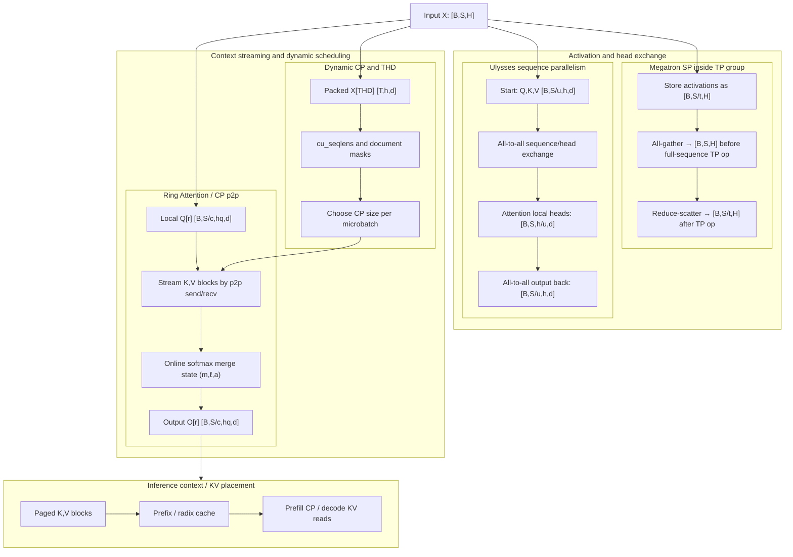

**Diagram notation key:** `Q[r]` and `O[r]` map to $Q_r$ and $O_r$; `S/t`, `S/u`, and `S/c` mean sequence length divided across TP, Ulysses, or CP groups; `(m,ℓ,a)` maps to the online-softmax max, denominator, and accumulator state; `X[THD]` maps to packed $X_{\mathrm{THD}}$.


**Sources.** Recent docs: [Megatron-Core parallelism guide](https://docs.nvidia.com/megatron-core/developer-guide/latest/user-guide/parallelism-guide.html), [Megatron-Core CP docs](https://docs.nvidia.com/megatron-core/developer-guide/latest/user-guide/features/context_parallel.html), [NVIDIA Dynamic-CP blog](https://developer.nvidia.com/blog/speeding-up-variable-length-training-with-dynamic-context-parallelism-and-nvidia-megatron-core/). Ulysses details: [Hugging Face Ulysses documentation](https://huggingface.co/docs/transformers/main/deepspeed_alst), [DeepSpeed-Ulysses paper](https://arxiv.org/abs/2309.14509). Ring details: [Ring Attention paper](https://arxiv.org/abs/2310.01889), [USP repo](https://github.com/feifeibear/long-context-attention).

### 5.3 Megatron Sequence Parallelism: Activation Sharding, Not Full Long-Context Attention

Megatron SP is the easiest technique to misread because the name sounds like generic sequence parallelism. In Megatron terminology, SP is a memory optimization coupled to tensor parallelism (TP). It shards activations along the sequence dimension across the TP group for regions such as LayerNorm, dropout, and residual paths, replacing some replicated activations with sequence-sharded activations.

Let $t$ be the TP size. A simplified SP-covered activation has local shape

$$
X_{\text{SP}}^{(r)} \in \mathbb{R}^{B \times (S/t) \times H}.
$$

Before an operator that expects all token positions in the TP group, the ranks perform an all-gather:

$$
\left\{X_{\text{SP}}^{(0)},\ldots,X_{\text{SP}}^{(t-1)}\right\}
\xrightarrow{\text{all-gather over sequence}}
X \in \mathbb{R}^{B \times S \times H}.
$$

After a TP operator whose output would normally require an all-reduce, Megatron SP uses a reduce-scatter to return to sequence-sharded form:

$$
Y_{\text{partial}} \in \mathbb{R}^{B \times S \times H}
\xrightarrow{\text{reduce-scatter over sequence}}
Y_{\text{SP}}^{(r)} \in \mathbb{R}^{B \times (S/t) \times H}.
$$

The key identity is that an all-reduce can be decomposed as

$$
\operatorname{allreduce}(x)
=
\operatorname{allgather}(\operatorname{reduce\_scatter}(x)).
$$

Megatron SP exploits this decomposition to reduce stored activation memory without adding a fundamentally new communication pattern beyond TP. For a tensor with $B S H$ elements, the ideal activation storage reduction is approximately

$$
M_{\text{SP local}}
\approx
\frac{B S H b}{t},
$$

where $b$ is bytes per element.

SP does **not** solve the attention coupling problem by itself. If rank $r$ has only $S/t$ tokens and computes attention without obtaining remote $K,V$, it computes local-window attention over $\mathcal{S}_r$, not full-sequence attention. Long-context exact attention needs Ulysses all-to-all, CP KV all-gather, ring KV streaming, or a sparse/hybrid attention scheme that defines which remote KV blocks are required.

Forward/backward collective summary:

| Phase | Collective | Purpose |
|---|---|---|
| Forward | `all-gather` | Reconstruct full sequence activations before an operator that needs them. |
| Forward | `reduce-scatter` | Replace an all-reduce after a TP operator and return to sequence-sharded activations. |
| Backward | `all-gather` / `reduce-scatter` in reverse roles | Propagate gradients through the gather/scatter decomposition. |

**Sources.** Recent docs: [Megatron-Core parallelism guide](https://docs.nvidia.com/megatron-core/developer-guide/latest/user-guide/parallelism-guide.html), [Accelerate Megatron-LM guide](https://huggingface.co/docs/accelerate/v1.10.0/usage_guides/megatron_lm). Original technique: [Reducing Activation Recomputation in Large Transformer Models](https://proceedings.mlsys.org/paper_files/paper/2023/hash/80083951326cf5b35e5100260d64ed81-Abstract-mlsys2023.html).

### 5.4 Ulysses: Sequence Shards Become Head Shards Through All-to-All

Ulysses-style sequence parallelism addresses full attention by changing the layout around the attention operator. Let $u$ be the Ulysses parallel size. Initially each rank owns a token shard:

$$
Q^{(r)} \in \mathbb{R}^{B \times (S/u) \times h_q \times d},
$$

$$
K^{(r)},V^{(r)} \in \mathbb{R}^{B \times (S/u) \times h_{kv} \times d}.
$$

Attention would be easy if each rank owned all $S$ tokens for only a subset of heads. Ulysses uses an all-to-all collective to transform the layout:

$$
[B,S/u,h_q,d]
\xrightarrow{\text{all-to-all}}
[B,S,h_q/u,d]
$$

for queries and outputs, and similarly for $K,V$ when KV heads are divisible over the Ulysses group. Each rank then computes exact attention for its local head subset:

$$
\tilde{Q}^{(r)} \in \mathbb{R}^{B \times S \times (h_q/u) \times d},
\qquad
\tilde{K}^{(r)},\tilde{V}^{(r)} \in \mathbb{R}^{B \times S \times (h_{kv}/u) \times d}
$$

when KV heads are also partitioned. After attention, a second all-to-all returns the output to sequence-sharded layout:

$$
[B,S,h_q/u,d]
\xrightarrow{\text{all-to-all}}
[B,S/u,h_q,d].
$$

The per-rank remote send volume, and symmetrically the remote receive volume, for the QKV layout exchange is approximately

$$
V_{\text{Ulysses,QKV,rank}}
\approx
\left(1-\frac{1}{u}\right)
B \frac{S}{u} (h_q + 2h_{kv}) d b.
$$

The per-rank remote send volume, and symmetrically the remote receive volume, for the output exchange is approximately

$$
V_{\text{Ulysses,O,rank}}
\approx
\left(1-\frac{1}{u}\right)
B \frac{S}{u} h_q d b.
$$

The aggregate cluster send volume is $u$ times the per-rank one-direction volume. Ulysses is attractive when:

- $h_q$ is large enough that $h_q/u$ leaves useful work per rank.
- The all-to-all stays within a high-bandwidth topology island.
- The model architecture has enough heads for the chosen $u$.

It is less natural when GQA/MQA/MLA leaves very few KV heads, because $h_{kv}/u$ may be fractional or too small. This is why later unified sequence-parallel work combines Ulysses with ring-style KV streaming: Ulysses is head-count sensitive; rings are less head-count sensitive but require stepwise p2p scheduling.

Forward/backward collective summary:

| Phase | Collective | Purpose |
|---|---|---|
| Forward before attention | `all-to-all` | Convert sequence-sharded QKV into head-sharded full-sequence QKV. |
| Forward after attention | `all-to-all` | Convert head-sharded output back to sequence-sharded output. |
| Backward | `all-to-all` | Reverse both layout conversions for $dQ,dK,dV,dO$. |

**Sources.** Recent ecosystem docs: [Hugging Face Ulysses sequence parallelism docs](https://huggingface.co/docs/transformers/main/deepspeed_alst), [Ultra-long Ulysses + Ring implementation note](https://huggingface.co/blog/exploding-gradients/ulysses-ring-attention). Primary paper: [DeepSpeed-Ulysses](https://arxiv.org/abs/2309.14509). Unified follow-up: [USP paper](https://arxiv.org/abs/2405.07719), [USP/YunChang repo](https://github.com/feifeibear/long-context-attention).

### 5.5 Ring Attention: KV Streaming With Point-to-Point Send/Recv

Ring Attention keeps the token-sharded layout and streams KV blocks through the ranks. Rank $r$ owns local queries

$$
Q^{(r)} \in \mathbb{R}^{B \times S_r \times h_q \times d}
$$

and initially owns local KV

$$
K^{(r)},V^{(r)} \in \mathbb{R}^{B \times S_r \times h_{kv} \times d}.
$$

At ring step $s \in \{0,\ldots,c-1\}$, rank $r$ attends its local queries to a KV block owned by

$$
j(r,s) = (r-s) \bmod c.
$$

The computation at that step uses

$$
Q^{(r)}, K^{(j(r,s))}, V^{(j(r,s))}.
$$

After each step, the current KV block is sent to the next rank and a new KV block is received from the previous rank:

$$
\text{send } (K,V) \text{ to } (r+1) \bmod c,
\qquad
\text{recv } (K,V) \text{ from } (r-1) \bmod c.
$$

This is p2p communication, not a monolithic all-gather. After $c$ steps, every rank has streamed all KV blocks and computed exact attention for its local query tokens. The per-rank remote KV receive volume, and in a symmetric ring also the remote send volume, is approximately

$$
V_{\text{ring,rank}}
\approx
(c-1) \cdot 2 B \frac{S}{c} h_{kv} d b
=
2 B S h_{kv} d b \left(1-\frac{1}{c}\right).
$$

This is similar in payload to receiving all remote KV once; transmit-plus-receive accounting would double the one-direction value. The memory footprint differs: a ring implementation only needs local Q, local output state, local KV, and one streamed KV block at a time. It can overlap each send/recv with blockwise attention:

$$
T_{\text{ring}}
\approx
\sum_{s=0}^{c-1}
\max
\left(
T_{\text{attention-block},s},
T_{\text{p2p-sendrecv},s}
\right).
$$

Causal attention adds load imbalance because query blocks near the beginning of the sequence have fewer valid past KV blocks than query blocks near the end. Practical ring implementations use scheduling, bidirectional rings, or block ordering to reduce exposed communication and idle ranks.

Forward/backward communication summary:

| Phase | Communication | Purpose |
|---|---|---|
| Forward | ring p2p `send`/`recv` of $K,V$ blocks | Stream remote context to local query owners. |
| Forward | no full all-gather required | Keep memory bounded to local plus streamed KV. |
| Backward | ring p2p for gradients and/or recomputed KV blocks | Propagate $dQ,dK,dV$ with the same block partitioning. |

**Sources.** Primary paper: [Ring Attention with Blockwise Transformers](https://arxiv.org/abs/2310.01889). Recent combined systems: [USP paper](https://arxiv.org/abs/2405.07719), [USP/YunChang repo](https://github.com/feifeibear/long-context-attention), [ring-flash-attention repo](https://github.com/zhuzilin/ring-flash-attention). Megatron-related docs: [Megatron-Core CP docs](https://docs.nvidia.com/megatron-core/developer-guide/latest/user-guide/features/context_parallel.html).

### 5.6 The Numerical Primitive: Blockwise Online Softmax

KV streaming is exact only because softmax attention can be accumulated over blocks without materializing the full $S \times S$ score matrix. This is the same numerical idea behind FlashAttention and distributed ring attention.

For one query row $q \in \mathbb{R}^{d}$, process KV blocks $K_1,V_1,\ldots,K_n,V_n$. Define the logits for block $j$ as

$$
z_j = \frac{qK_j^\top}{\sqrt{d}} + m_j,
$$

where $m_j$ is the mask vector for the keys in block $j$. Maintain three state variables:

- $m$: the running maximum logit.
- $\ell$: the running softmax denominator.
- $a$: the running unnormalized output accumulator.

Initialize

$$
m_0=-\infty,\qquad \ell_0=0,\qquad a_0=0.
$$

For each block $j$, compute

$$
m_j^\star = \max(m_{j-1}, \max_k z_{j,k}),
$$

$$
\ell_j =
\exp(m_{j-1}-m_j^\star)\ell_{j-1}
+
\sum_k \exp(z_{j,k}-m_j^\star),
$$

$$
a_j =
\exp(m_{j-1}-m_j^\star)a_{j-1}
+
\sum_k \exp(z_{j,k}-m_j^\star)V_{j,k}.
$$

The final output is

$$
o = \frac{a_n}{\ell_n}.
$$

Partial states can also be merged across ranks. If rank $r$ produces $(m_r,\ell_r,a_r)$, the global merged state is

$$
m = \max_r m_r,
$$

$$
\ell = \sum_r \exp(m_r-m)\ell_r,
$$

$$
a = \sum_r \exp(m_r-m)a_r,
\qquad
o=\frac{a}{\ell}.
$$

This merge rule is the bridge between CUDA attention kernels and distributed context parallelism. It lets the runtime split the KV axis over blocks, ranks, or sparse block sets while preserving the same result as dense attention over the selected keys.

**Sources.** Kernel lineage: [FlashAttention](https://arxiv.org/abs/2205.14135), [FlashAttention-3](https://arxiv.org/abs/2407.08608), [PyTorch FlexAttention + FlashAttention-4](https://pytorch.org/blog/flexattention-flashattention-4-fast-and-flexible/). Distributed use: [Ring Attention](https://arxiv.org/abs/2310.01889), [Megatron-Core CP docs](https://docs.nvidia.com/megatron-core/developer-guide/latest/user-guide/features/context_parallel.html).

### 5.7 Megatron Context Parallelism: Sequence Sharding for the Whole Network

Megatron CP differs from Megatron SP in scope. CP partitions the network input and all activations along the sequence dimension across a context-parallel group. With CP size $c$, rank $r$ stores

$$
X^{(r)} \in \mathbb{R}^{B \times S_r \times H}.
$$

Token-local modules such as LayerNorm, RMSNorm, residual addition, dropout, and MLPs can run directly on $X^{(r)}$ because

$$
Y[:,i,:] = f(X[:,i,:])
$$

does not depend on other token positions. Attention is the exception. A local query token needs global KV:

$$
Q^{(r)} \in \mathbb{R}^{B \times S_r \times h_q \times d}
\quad
\text{must attend to}
\quad
\{K^{(j)},V^{(j)}\}_{j=0}^{c-1}.
$$

The simplest CP implementation performs KV all-gather:

$$
\{K^{(0)},\ldots,K^{(c-1)}\}
\xrightarrow{\text{all-gather}}
K \in \mathbb{R}^{B \times S \times h_{kv} \times d},
$$

and similarly for $V$. Rank $r$ then computes $O^{(r)}$ for its local query tokens. In backward, the gradients for remote $K,V$ are reduced and scattered back to their owners:

$$
dK,dV
\xrightarrow{\text{reduce-scatter}}
dK^{(r)},dV^{(r)}.
$$

Megatron-Core documentation shows CP attention communication as all-gather in forward and reduce-scatter in backward, while practical implementations can use p2p ring communication to realize the same logical KV exchange with lower peak memory.

Per-rank remote KV receive volume for dense all-gather is approximately

$$
V_{\text{CP-gather,rank}}
\approx
2 B S h_{kv} d b
\left(1-\frac{1}{c}\right),
$$

where the factor 2 is for $K$ and $V$. In a ring all-gather implementation, remote send volume is the same order; transmit-plus-receive accounting doubles the one-direction value. Local activation memory ideally falls like

$$
M_{\text{CP local}}
\approx
\frac{M_{\text{activation full}}}{c}
+ M_{\text{streamed KV/workspace}}.
$$

CP composes well with GQA/MQA/MLA because reducing $h_{kv}$ directly reduces KV communication. CP also composes with TP and PP: TP splits hidden/head dimensions, CP splits token positions, PP splits layers, and DP replicates the resulting model mesh over data shards.

Forward/backward collective summary:

| Phase | Logical collective | Common implementation | Purpose |
|---|---|---|---|
| Forward attention | KV `all-gather` | all-gather or ring p2p send/recv | Make remote KV visible to local Q. |
| Backward attention | KV-gradient `reduce-scatter` | reduce-scatter or ring p2p gradient exchange | Return $dK,dV$ to KV owner ranks. |
| Non-attention forward/backward | none across CP | local compute | Token-local layers stay sharded. |

**Sources.** Recent primary docs: [Megatron-Core context parallelism](https://docs.nvidia.com/megatron-core/developer-guide/latest/user-guide/features/context_parallel.html), [Megatron-Core parallelism guide](https://docs.nvidia.com/megatron-core/developer-guide/latest/user-guide/parallelism-guide.html), [NVIDIA Dynamic-CP blog](https://developer.nvidia.com/blog/speeding-up-variable-length-training-with-dynamic-context-parallelism-and-nvidia-megatron-core/). Related implementation lineage: [USP/YunChang repo](https://github.com/feifeibear/long-context-attention).

### 5.8 Dynamic Context Parallelism: Choose CP Size Per Microbatch

Static CP chooses one $c$ for an entire job. That is inefficient for packed, variable-length data. In post-training, VLM training, video diffusion, and long-document datasets, a global batch often has a long-tailed length distribution. Some microbatches need CP to fit in HBM; others are short enough that CP only adds communication overhead.

Dynamic-CP chooses a CP size per microbatch. Let microbatch $m$ contain sequences with lengths

$$
s_1,s_2,\ldots,s_{B_m},
$$

where $B_m$ is the number of sequences in the microbatch. Define total packed tokens

$$
T_m = \sum_{i=1}^{B_m} s_i
$$

and dense attention work proxy

$$
A_m = \sum_{i=1}^{B_m} s_i^2.
$$

Let $\mathcal{C}=\{1,2,4,\ldots,c_{\max}\}$ be the allowed CP sizes. A simplified Dynamic-CP choice is

$$
c_m^\star
=
\arg\min_{c \in \mathcal{C}}
\left[
\alpha \frac{A_m}{c}
+
\beta \left(1-\frac{1}{c}\right) T_m h_{kv} d b
+
\gamma \operatorname{bubble}(m,c)
\right],
$$

subject to

$$
M_{\text{fixed}}
+ M_{\text{activation}}(m,c)
+ M_{\text{workspace}}(m,c)
\le
M_{\text{HBM}}.
$$

Here:

- $\alpha$ converts local attention work to time.
- $\beta$ converts KV communication bytes to time.
- $\gamma$ weights data-parallel and pipeline-parallel imbalance.
- $\operatorname{bubble}(m,c)$ estimates idle time from uneven microbatch work.
- $M_{\text{fixed}}$ includes parameters and persistent runtime state.
- $M_{\text{HBM}}$ is available GPU memory.

The actual NVIDIA Dynamic-CP system includes a scheduler, solver, and simulator. The important primitive is that CP size is no longer only a model-parallel hyperparameter; it becomes batch metadata.

Runtime ingredients:

- **Multiple prebuilt CP groups.** The job creates CP groups for several sizes so the training loop can select among them without creating process groups on the critical path.
- **Packed sequence metadata.** Each microbatch carries lengths, cumulative lengths, selected CP size, and selected CP group.
- **Asynchronous scheduling.** The solver can run in the data path while the previous training iteration executes.
- **Pipeline-aware balancing.** The scheduler considers PP bubbles and DP imbalance, not only per-sample attention FLOPs.

Collective summary:

| Stage | Communication | Purpose |
|---|---|---|
| Scheduling/probing | lightweight metadata gather/broadcast | Learn sequence lengths and assign microbatches/CP sizes. |
| Attention | CP KV all-gather or p2p streaming in the chosen CP group | Compute local query outputs for the selected CP size. |
| Backward | matching reduce-scatter or p2p gradient exchange | Return KV gradients to owner ranks. |

**Sources.** Recent primary source: [NVIDIA Dynamic Context Parallelism with Megatron Core](https://developer.nvidia.com/blog/speeding-up-variable-length-training-with-dynamic-context-parallelism-and-nvidia-megatron-core/). Supporting docs: [Megatron-Core CP](https://docs.nvidia.com/megatron-core/developer-guide/latest/user-guide/features/context_parallel.html), [Megatron-Core GitHub](https://github.com/NVIDIA/Megatron-LM).

### 5.9 THD and Ragged Packing: Token-Head-Dimension Layout

THD/ragged packing is not itself a parallelism strategy. It is the layout primitive that makes variable-length attention and Dynamic-CP practical.

For a padded batch with maximum length

$$
s_{\max} = \max_i s_i,
$$

dense padded attention work scales like

$$
W_{\text{padded}}
\propto
B_m s_{\max}^2.
$$

The useful ragged work is closer to

$$
W_{\text{ragged}}
\propto
\sum_{i=1}^{B_m} s_i^2.
$$

The padding waste is therefore approximately

$$
W_{\text{waste}}
\propto
B_m s_{\max}^2
-
\sum_{i=1}^{B_m} s_i^2.
$$

THD collapses batch and sequence into a token dimension:

$$
Q_{\text{THD}} \in \mathbb{R}^{T_m \times h_q \times d},
$$

$$
K_{\text{THD}},V_{\text{THD}} \in \mathbb{R}^{T_m \times h_{kv} \times d},
$$

$$
O_{\text{THD}} \in \mathbb{R}^{T_m \times h_q \times d},
$$

where $T_m=\sum_i s_i$. A cumulative sequence-length array

$$
\operatorname{cu\_seqlens}
=
[0, s_1, s_1+s_2,\ldots,T_m]
$$

maps packed token offsets back to original sequences. For token index $p$, the original sequence is the unique $i$ satisfying

$$
\operatorname{cu\_seqlens}[i]
\le
p
<
\operatorname{cu\_seqlens}[i+1].
$$

Under CP, a rank owns a subset of packed token positions:

$$
Q_{\text{THD}}^{(r)}
\in
\mathbb{R}^{T_{m,r} \times h_q \times d},
$$

where

$$
\sum_{r=0}^{c_m-1} T_{m,r}=T_m.
$$

The metadata must also preserve document boundaries, local positions, attention masks, and CP ownership. A correct THD+CP system must answer these questions for every token:

1. Which original sequence/document owns this token?
2. What is the token's position within that sequence?
3. Which CP rank owns its query block?
4. Which CP ranks own the KV blocks it may attend to?
5. Which mask or sparse-attention metadata applies?

THD changes the shape contract for attention kernels: instead of reading padded $[B,S,h,d]$, kernels read $[T,h,d]$ plus metadata such as `cu_seqlens`, maximum sequence length, block tables, and sparse masks.

**Sources.** Recent primary source: [NVIDIA Dynamic-CP blog](https://developer.nvidia.com/blog/speeding-up-variable-length-training-with-dynamic-context-parallelism-and-nvidia-megatron-core/). Kernel interfaces with similar THD-style shapes: [cuDNN NSA](https://docs.nvidia.com/deeplearning/cudnn/frontend/latest/fe-oss-apis/nsa.html), [PyTorch FlexAttention + FlashAttention-4](https://pytorch.org/blog/flexattention-flashattention-4-fast-and-flexible/).

### 5.10 Sparse and Hybrid Attention: Communicate Selected KV, Not Necessarily All KV

Dense CP assumes each query may attend to every KV token. Sparse and hybrid attention replace this with metadata-defined KV sets.

Let the sequence be partitioned into KV blocks of size $q$. Let $\mathcal{B}_i$ be the set of selected KV block IDs for query token $i$. A sparse block attention output is

$$
O_{i,a}
=
\sum_{j \in \mathcal{K}_i}
\operatorname{softmax}_j
\left(
\frac{Q_{i,a}K_{j,g(a)}^\top}{\sqrt{d}} + M_{i,j}
\right)
V_{j,g(a)},
$$

where:

- $\mathcal{K}_i = \bigcup_{b' \in \mathcal{B}_i} \operatorname{tokens}(b')$ is the set of token positions selected for query $i$.
- $a$ is a query head.
- $g(a)$ maps query head $a$ to its KV head.
- $M_{i,j}$ includes causal, padding, document, sliding-window, and sparse masks.

The dense remote KV volume for CP scales with all remote tokens. Sparse remote KV volume scales with selected remote blocks:

$$
V_{\text{sparse remote}}
\approx
2 h_{kv} d b
\sum_{i \in \text{local queries}}
\left|
\mathcal{K}_i \cap \text{remote tokens}
\right|,
$$

before accounting for reuse when multiple queries select the same block. With block reuse, a better implementation-level estimate is

$$
V_{\text{sparse block remote}}
\approx
2 q h_{kv} d b
\left|
\bigcup_{i \in \text{local queries}}
\left(
\mathcal{B}_i \cap \text{remote blocks}
\right)
\right|.
$$

The second formula explains why metadata quality matters: many queries selecting the same remote blocks can amortize transfer, while highly irregular block selection can become pointer-chasing.

cuDNN NSA exposes sparse attention as a set of components:

- **Selection attention.** Attend to dynamically selected KV blocks.
- **Compression attention.** Attend to compressed global representations.
- **Sliding-window attention.** Attend to recent local tokens.
- **Top-k reduction.** Select important blocks for the selection path.

DeepSeek-V4 public material describes a hybrid sparse-attention design combining compressed sparse attention and heavily compressed attention for million-token contexts. The SGLang/Miles Day-0 report gives runtime evidence for separate sliding-window, compressed, sparse, and compression-state pools, plus CP attention in serving and RL paths. PyTorch FlexAttention with FlashAttention-4 shows the platform direction: block-sparse iteration and score/mask modifications are compiled into high-performance attention kernels on Hopper and Blackwell.

Communication summary:

| Attention form | Communication object | Communication style |
|---|---|---|
| Dense CP | all remote $K,V$ | KV all-gather or ring p2p streaming |
| Sliding window | nearby remote boundary KV only | p2p halo exchange or local reads if window is local |
| Selection sparse attention | selected remote KV blocks plus block indices/counts | sparse KV all-gather, p2p block streaming, or runtime page transfer |
| Compressed attention | compressed KV states | smaller KV all-gather/streaming plus compression metadata |
| Hybrid attention | several KV pools plus coherence metadata | runtime-specific placement and cache-coherence protocol |

**Sources.** Recent primary sources: [cuDNN NSA documentation](https://docs.nvidia.com/deeplearning/cudnn/frontend/latest/fe-oss-apis/nsa.html), [PyTorch FlexAttention + FlashAttention-4](https://pytorch.org/blog/flexattention-flashattention-4-fast-and-flexible/), [DeepSeek-V4 official model card](https://huggingface.co/deepseek-ai/DeepSeek-V4-Pro), [SGLang/Miles DeepSeek-V4 Day-0 report](https://www.lmsys.org/blog/2026-04-25-deepseek-v4/), [SGLang DeepSeek-V4 cookbook](https://docs.sglang.io/cookbook/autoregressive/DeepSeek/DeepSeek-V4). Sparse-attention lineage: [Native Sparse Attention paper](https://arxiv.org/abs/2502.11089), [Mistral sliding-window attention](https://arxiv.org/abs/2310.06825).

### 5.11 Inference KV and Context Placement

Training-time CP asks how to compute attention and gradients over long contexts. Inference asks a related but different question: where should the KV cache live, and which ranks should read it during prefill and decode?

For autoregressive serving, each layer stores keys and values for previous tokens. If there are $L$ layers, request $r$ has cached length $S_r$, and the serving batch has $R$ live requests, dense KV memory is approximately

$$
M_{\text{KV}}
=
2 L h_{kv} d b
\sum_{r=1}^{R} S_r,
$$

where the factor 2 is for $K$ and $V$. For paged KV caches with block size $q$, the number of allocated KV blocks for request $r$ is

$$
n_r = \left\lceil \frac{S_r}{q} \right\rceil.
$$

If each block stores $q$ tokens, the ideal payload memory is

$$
M_{\text{paged payload}}
=
2 L q h_{kv} d b
\sum_{r=1}^{R} n_r,
$$

plus block-table metadata and fragmentation inside the last block of each request.

The main inference placement primitives are:

1. **Paged KV allocation.** KV is stored in fixed-size physical blocks with a logical block table. This avoids requiring one contiguous allocation per request and enables sharing and eviction at block granularity.
2. **Prefix/radix caching.** Reused prefixes map to shared KV blocks. A radix tree or prefix hash identifies cache hits across requests.
3. **Tensor/head sharding.** Under TP, each rank stores KV for its local heads:

   $$
   K_{\text{TP}}^{(r)}
   \in
   \mathbb{R}^{S \times (h_{kv}/t) \times d}.
   $$

4. **Context/page sharding.** Under CP-like inference placement, each rank stores a subset of token pages:

   $$
   K_{\text{CP}}^{(r)}
   \in
   \mathbb{R}^{S_r \times h_{kv} \times d}.
   $$

5. **Prefill/decode disaggregation.** Context workers compute prompt KV; decode workers consume it. KV transfer may use p2p, RDMA, CUDA IPC, or a serving framework's cache-exchange protocol.
6. **Hybrid-attention cache coherence.** Sliding-window KV, compressed KV, sparse selected KV, and compression-state pools need a shared virtual coordinate system so prefix reuse and speculative decoding reference the right physical state.

Prefill and decode have different communication patterns:

| Phase | Dominant work | KV/context communication |
|---|---|---|
| Prefill | compute-heavy attention over prompt tokens | can use TP/CP, KV all-gather, ring p2p streaming, or sparse KV transfer |
| Decode | memory-bandwidth-bound read of existing KV | prefers local KV reads, page locality, prefix-cache hits, or low-latency remote KV transfer |
| P/D disaggregation | transfer from prefill workers to decode workers | KV page exchange, opaque state transfer, RDMA/CUDA IPC depending on runtime |

For a single decode step, a rough latency decomposition is

$$
T_{\text{decode}}
\approx
T_{\text{read-KV}}
+ T_{\text{attention}}
+ T_{\text{collective/output}}
+ T_{\text{scheduler}},
$$

where $T_{\text{read-KV}}$ often dominates for long contexts. CP helps decode only if the benefit from sharded KV memory and parallel reads exceeds the cost of remote KV access, synchronization, and scheduling.

SGLang/Miles reports DeepSeek-V4 serving features such as ShadowRadix prefix caching, HiSparse CPU-extended KV, DP/TP/CP attention, and prefill/decode disaggregation. TensorRT-LLM documents disaggregated serving and KV cache exchange. vLLM's PagedAttention remains the central lineage for page-based KV management, and SGLang's RadixAttention/RadixCache is central lineage for automatic prefix reuse.

**Sources.** Recent runtime docs: [SGLang/Miles DeepSeek-V4 Day-0 report](https://www.lmsys.org/blog/2026-04-25-deepseek-v4/), [SGLang DeepSeek-V4 cookbook](https://docs.sglang.io/cookbook/autoregressive/DeepSeek/DeepSeek-V4), [TensorRT-LLM disaggregated serving](https://nvidia.github.io/TensorRT-LLM/1.2.0rc6/features/disagg-serving.html), [TensorRT-LLM disaggregated serving blog](https://nvidia.github.io/TensorRT-LLM/blogs/tech_blog/blog5_Disaggregated_Serving_in_TensorRT-LLM.html). Lineage and open systems: [vLLM PagedAttention design](https://docs.vllm.ai/en/v0.18.0/design/paged_attention/), [PagedAttention paper](https://arxiv.org/abs/2309.06180), [SGLang paper](https://arxiv.org/abs/2312.07104), [SGLang RadixCache implementation notes](https://deepwiki.com/sgl-project/sglang/5.2-kernel-implementations).

### 5.12 How to Choose Among SP, Ulysses, Ring, CP, Dynamic-CP, and Sparse Context Placement

The techniques in this section are not mutually exclusive. Modern systems often combine them:

- Megatron SP inside TP groups to save activation memory.
- CP or ring attention across context groups to make long-context attention fit.
- Ulysses all-to-all when head count and topology make head sharding attractive.
- Dynamic-CP when sequence lengths are highly variable.
- THD/ragged packing to avoid padded attention waste.
- Sparse/hybrid attention to reduce the KV set.
- Inference KV page placement and prefix caching to avoid recomputing or moving context.

| Technique | Primary goal | Local Q/K/V/O shapes | Communication | Best fit | Main caveat |
|---|---|---|---|---|---|
| Megatron SP | Reduce TP activation memory | $X^{(r)}:[B,S/t,H]$ | all-gather, reduce-scatter | Large TP training where activation memory is tight | Does not by itself compute full long-context attention |
| Ulysses | Full attention with sequence-to-head reshaping | before: $[B,S/u,h,d]$; during attention: $[B,S,h/u,d]$ | two all-to-alls around attention | Many heads, efficient all-to-all domain | Head-count sensitive; weaker with MQA/GQA if KV heads are few |
| Ring Attention | Exact attention with bounded KV memory | $Q_r:[B,S/c,h_q,d]$, streamed $K,V$ blocks | ring p2p send/recv | Very long dense attention with overlap | Causal imbalance and p2p scheduling complexity |
| Megatron CP | Whole-network sequence sharding | $Q_r,K_r,V_r,O_r:[B,S/c,h,d]$ | KV all-gather or ring p2p; backward reduce-scatter | Long-context Megatron training with TP/PP/DP composition | Static CP wastes comm on short sequences |
| Dynamic-CP | Variable-length efficiency | THD local $T_{m,r}$ tokens | selected CP group's KV exchange | Packed post-training, VLM/video, ragged data | Scheduler and metadata complexity |
| Sparse/hybrid attention | Reduce effective KV set | $[T,h,d]$ plus block metadata | sparse KV all-gather/streaming/page transfer | Million-token contexts and compressed/sparse models | Metadata and cache coherence become first-class bottlenecks |
| Inference KV placement | Serve long contexts efficiently | paged KV blocks or sharded KV heads/tokens | page transfer, p2p/RDMA, optional CP | Prefill/decode serving, prefix-heavy workloads | KV locality and cache misses can dominate |

A practical decision rule is:

$$
\text{Use larger CP/ring degree when memory or local attention work dominates.}
$$

$$
\text{Use smaller CP/ring degree when communication is exposed or crosses slow links.}
$$

$$
\text{Use Ulysses when heads divide cleanly and all-to-all is cheap.}
$$

$$
\text{Use sparse/hybrid attention when the model definition permits attending to fewer KV blocks.}
$$

Dynamic-CP is the runtime version of this rule: it chooses the degree per microbatch rather than forcing one global CP size.

**Sources.** Recent synthesis sources: [NVIDIA Dynamic-CP blog](https://developer.nvidia.com/blog/speeding-up-variable-length-training-with-dynamic-context-parallelism-and-nvidia-megatron-core/), [Megatron-Core CP docs](https://docs.nvidia.com/megatron-core/developer-guide/latest/user-guide/features/context_parallel.html), [SGLang/Miles DeepSeek-V4](https://www.lmsys.org/blog/2026-04-25-deepseek-v4/), [PyTorch FlexAttention + FlashAttention-4](https://pytorch.org/blog/flexattention-flashattention-4-fast-and-flexible/). Comparative lineage: [USP paper](https://arxiv.org/abs/2405.07719), [DeepSpeed-Ulysses](https://arxiv.org/abs/2309.14509), [Ring Attention](https://arxiv.org/abs/2310.01889).

### 5.13 Evidence Boundaries and Terminology Caveats

"Sequence parallelism" is not one technique. In Megatron SP it means activation sharding inside TP. In Ulysses it means sequence-to-head all-to-all around attention. In Ring Attention it means token shards plus p2p KV streaming. In Megatron CP it means full activation sharding over context with attention-specific KV exchange. In inference systems it can also refer to KV/cache placement over prompt tokens.

DeepSeek-V4 evidence should be separated by source type. The official model card is architecture evidence for the released model family, long-context claim, and hybrid attention description. SGLang/Miles is runtime integration evidence for public serving and RL support. Exact undisclosed DeepSeek production training kernels, CP schedules, and cache placement policies should be labeled as inferred unless released in official code or reports.

Sparse/hybrid attention also changes the meaning of "context." A model can expose a one-million-token context while each query attends to a mixture of local raw tokens, compressed global tokens, and selected sparse blocks. For such models, context parallelism moves $K,V$, sparse block metadata, compression state, and cache page tables. The communication object is no longer simply "all KV for all tokens."

**Sources.** Recent source-type anchors: [DeepSeek-V4 official model card](https://huggingface.co/deepseek-ai/DeepSeek-V4-Pro), [SGLang/Miles DeepSeek-V4 runtime report](https://www.lmsys.org/blog/2026-04-25-deepseek-v4/), [SGLang DeepSeek-V4 cookbook](https://docs.sglang.io/cookbook/autoregressive/DeepSeek/DeepSeek-V4), [Megatron-Core CP docs](https://docs.nvidia.com/megatron-core/developer-guide/latest/user-guide/features/context_parallel.html), [cuDNN NSA docs](https://docs.nvidia.com/deeplearning/cudnn/frontend/latest/fe-oss-apis/nsa.html).

## 6. Expert and MoE Parallelism


Expert parallelism (EP) is the distributed-systems consequence of sparse Mixture-of-Experts (MoE) layers. A dense transformer feed-forward network applies the same MLP to every token. An MoE layer replaces that single MLP with many expert MLPs, then uses a router to send each token to a small subset of experts. This increases total parameter count without increasing per-token activated computation in proportion to total parameters. It also creates a new parallelism problem: tokens and expert weights no longer live in the same place by default.

Recent public systems make EP a first-class frontier-scale axis. [DeepSeek-V4](https://huggingface.co/deepseek-ai/DeepSeek-V4-Pro) is public architecture evidence for trillion-scale MoE with 1M-token context and FP4/FP8 mixed precision. The [SGLang/Miles DeepSeek-V4 report](https://www.lmsys.org/blog/2026-04-25-deepseek-v4/) is runtime evidence for EP MoE on [DeepEP](https://github.com/deepseek-ai/DeepEP), [DeepGEMM](https://github.com/deepseek-ai/DeepGEMM) Mega MoE, FP4 expert weights, and DP/TP/SP/EP/PP/CP composition. [DeepSeek-V3](https://arxiv.org/abs/2412.19437) is training evidence for DeepSeekMoE, group-limited routing, auxiliary-loss-free load balancing, FP8 training, and schedule/communication co-design. [TensorRT-LLM Wide-EP](https://github.com/NVIDIA/TensorRT-LLM/blob/main/docs/source/features/parallel-strategy.md) shows how EP becomes a serving load-balancing problem through expert slots and hot-expert replication. [Megatron-Core](https://docs.nvidia.com/megatron-core/developer-guide/latest/user-guide/parallelism-guide.html) documents EP as a composable training parallelism axis, including the important requirement that sequence parallelism is enabled when combining TP and EP.

Older work gives the lineage. [GShard](https://research.google/pubs/gshard-scaling-giant-models-with-conditional-computation-and-automatic-sharding/) made conditional computation plus automatic sharding practical at hundreds of billions of parameters. [Switch Transformer](https://arxiv.org/abs/2101.03961) popularized top-1 routing, capacity factors, and stability techniques. [Tutel](https://proceedings.mlsys.org/paper_files/paper/2023/hash/5616d34cf8ff73942cfd5aa922842556-Abstract-mlsys2023.html) optimized adaptive MoE execution and all-to-all. [MegaBlocks](https://proceedings.mlsys.org/paper_files/paper/2023/hash/5a54f79333768effe7e8927bcccffe40-Abstract-mlsys2023.html) reframed dropless MoE as block-sparse matrix multiplication.

### 6.1 Symbols, Shapes, and the MoE Layer

This section uses the following symbols.

| Symbol | Meaning |
|---|---|
| $R$ | total number of ranks in the current distributed job or serving replica |
| $P_{\mathrm{ep}}$ | expert-parallel group size, in ranks |
| $P_{\mathrm{tp}}$ | tensor-parallel degree inside dense or expert weights |
| $P_{\mathrm{dp}}$ | data-parallel or replica degree |
| $E$ | total number of routed experts in one MoE layer |
| $E_{\mathrm{local}}$ | number of expert ids owned by one EP rank before replication |
| $N$ | total tokens entering the MoE layer in a global microbatch or serving step |
| $N_r$ | tokens initially resident on origin rank $r$ |
| $H$ | model hidden width |
| $I$ | expert intermediate width |
| $k$ | number of routed experts selected per token |
| $x_i \in \mathbb{R}^{H}$ | hidden state for token $i$ |
| $X_r \in \mathbb{R}^{N_r \times H}$ | local token matrix on origin rank $r$ |
| $F_e(\cdot)$ | expert function for expert id $e$ |
| $z_{i,e}$ | router logit for token $i$ and expert $e$ |
| $p_{i,e}$ | normalized router weight assigned to expert $e$ for token $i$ |
| $L_e$ | number of token assignments routed to expert $e$ in this MoE invocation |
| $B_h$ | bytes per hidden-state element sent during dispatch |
| $B_y$ | bytes per expert-output element sent during combine |

For one MoE layer, the local input on rank $r$ is:

$$
X_r = [x_1,\ldots,x_{N_r}]^\top \in \mathbb{R}^{N_r \times H}.
$$

Here $X_r$ is the local token matrix, $N_r$ is the number of local tokens, and $H$ is hidden width. The router computes logits:

$$
z_{i,e} = x_i^\top w_e + b_e,
\qquad e \in \{1,\ldots,E\},
$$

where $w_e \in \mathbb{R}^{H}$ is the router weight vector for expert $e$, $b_e$ is its router bias or correction term, $x_i$ is token $i$'s hidden state, and $E$ is the number of routed experts. The selected expert set is:

$$
\mathcal{E}_i = \operatorname{TopK}_k(z_{i,1},\ldots,z_{i,E}),
$$

where $\mathcal{E}_i$ contains the $k$ expert ids selected for token $i$. A common normalized top-k weight is:

$$
p_{i,e}
=
\frac{\exp(z_{i,e})}
{\sum_{j \in \mathcal{E}_i}\exp(z_{i,j})},
\qquad e \in \mathcal{E}_i,
$$

where $p_{i,e}$ is the router weight used to combine expert outputs. The MoE output is:

$$
y_i
=
\sum_{e \in \mathcal{E}_i} p_{i,e} F_e(x_i).
$$

If the architecture includes a shared expert $F_s$, a useful abstraction is:

$$
y_i
=
F_s(x_i)
+
\sum_{e \in \mathcal{E}_i} p_{i,e} F_e(x_i),
$$

where $F_s$ is applied to every token and routed experts are applied sparsely.

The MoE layer creates $N k$ token-expert assignments from $N$ input tokens. This is the central shape expansion in EP: the token matrix starts as $N \times H$, becomes assignment metadata of shape $N \times k$, is packed into expert buffers whose row counts vary by expert, and is finally combined back to $N \times H$.


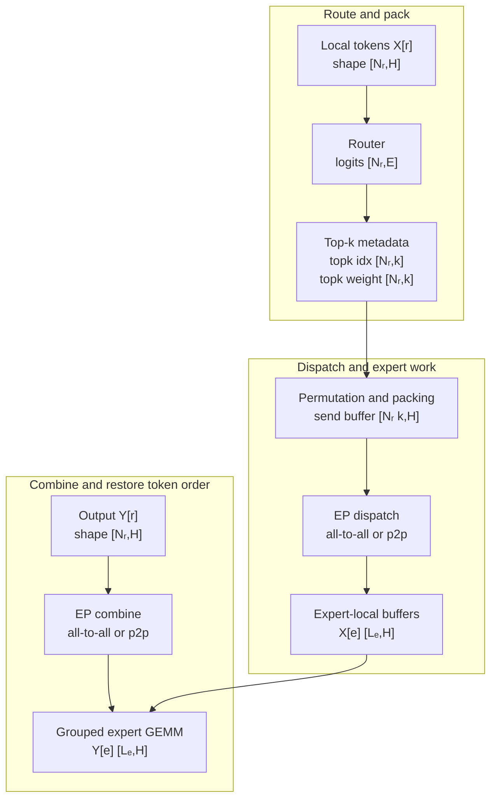

**Diagram notation key:** `X[r]` and `Y[r]` map to $X_r$ and $Y_r$; `Nᵣ` maps to $N_r$; `X[e]` and `Y[e]` map to $X_e$ and $Y_e$; `Lₑ` maps to $L_e$; `k` is the router top-k value.


Papers/repos/docs for this subsection: recent sources first: [DeepSeek-V4 model card](https://huggingface.co/deepseek-ai/DeepSeek-V4-Pro), [SGLang/Miles DeepSeek-V4](https://www.lmsys.org/blog/2026-04-25-deepseek-v4/), [DeepSeek-V3](https://arxiv.org/abs/2412.19437), [Megatron-Core parallelism guide](https://docs.nvidia.com/megatron-core/developer-guide/latest/user-guide/parallelism-guide.html), then lineage in [GShard](https://research.google/pubs/gshard-scaling-giant-models-with-conditional-computation-and-automatic-sharding/) and [Switch Transformer](https://arxiv.org/abs/2101.03961).

### 6.2 Primitive Technique: Routing and Top-k Assignment

Routing decides which experts execute which tokens. The simplest view is top-k routing over $E$ experts, but modern MoE routers add production details: group-limited routing, score correction biases, expert-load balancing, shared experts, node-limited routing, or serving-specific hot-expert handling.

The runtime outputs of routing are:

| Runtime object | Shape | Meaning |
|---|---:|---|
| `topk_idx` | $[N_r, k]$ | selected expert ids for local tokens on origin rank $r$ |
| `topk_weight` | $[N_r, k]$ | combine weights $p_{i,e}$ for each selected expert |
| `expert_counts` | $[E]$ or $[E_{\mathrm{local}}]$ | assignment count per global or local expert |
| `rank_counts` | $[P_{\mathrm{ep}}]$ | assignments from this origin rank to each EP destination rank |
| `token_pos` / inverse map | $[N_r, k]$ | where each assignment must be returned during combine |

The expert load for expert $e$ is:

$$
L_e
=
\sum_{i=1}^{N}
\mathbf{1}[e \in \mathcal{E}_i],
$$

where $L_e$ is the assignment count for expert $e$, $N$ is total token count, and $\mathbf{1}[\cdot]$ is the indicator function. Total assignments are:

$$
M
=
\sum_{e=1}^{E} L_e
=
N k,
$$

where $M$ is the total number of token-expert assignments. The ideal balanced expert load is:

$$
L^\star
=
\frac{N k}{E},
$$

where $L^\star$ is the average assignments per expert. A useful imbalance metric is:

$$
\rho_{\mathrm{expert}}
=
\frac{\max_e L_e}{L^\star},
$$

where $\rho_{\mathrm{expert}} = 1$ means perfectly balanced expert assignment and larger values indicate hotter experts.

For systems performance, rank-level load is often more important than expert-level load. If $\operatorname{owner}(e)$ returns the rank that owns expert $e$, rank $s$'s received assignment load is:

$$
L^{\mathrm{rank}}_s
=
\sum_{e:\operatorname{owner}(e)=s} L_e,
$$

where $L^{\mathrm{rank}}_s$ is the number of assignments that rank $s$ must execute. The step latency is often controlled by $\max_s L^{\mathrm{rank}}_s$, not by the average expert load.

Top-k routing affects both quality and systems behavior:

| Routing choice | Algorithmic effect | Systems effect |
|---|---|---|
| top-1 | one expert per token | lower communication and combine cost, less ensemble capacity |
| top-2 | two experts per token | better expert mixture, roughly doubles routed payload versus top-1 |
| top-8 or larger $k$ | high sparse capacity | much larger dispatch/combine volume and more grouped GEMM work |
| group-limited routing | restricts expert choices to groups | can improve locality and balance for large EP groups |
| score bias / correction | adjusts expert logits during training or serving | can reduce hot experts without changing expert weights |
| auxiliary-loss-free balancing | balances through router design rather than a separate load loss | avoids tuning an extra loss but makes router implementation more specialized |

DeepSeek-V3's group-limited routing and auxiliary-loss-free balancing are recent examples of routing as a systems-aware model component. TensorRT-LLM Wide-EP shows the serving counterpart: once a checkpoint is fixed, the runtime may balance by expert placement and replication rather than by changing router training.

Papers/repos/docs for this subsection: [DeepSeek-V3](https://arxiv.org/abs/2412.19437), [DeepSeek-V4 model card](https://huggingface.co/deepseek-ai/DeepSeek-V4-Pro), [TensorRT-LLM Wide-EP docs](https://github.com/NVIDIA/TensorRT-LLM/blob/main/docs/source/features/parallel-strategy.md), [Qwen3 technical report](https://huggingface.co/papers/2505.09388), [Switch Transformer](https://arxiv.org/abs/2101.03961), [GShard](https://research.google/pubs/gshard-scaling-giant-models-with-conditional-computation-and-automatic-sharding/).

### 6.3 Primitive Technique: Expert Ownership and Local Shard Shapes

Expert ownership maps model-defined expert ids to ranks. With $E$ experts and EP degree $P_{\mathrm{ep}}$, a simple non-replicated placement gives:

$$
E_{\mathrm{local}}
=
\frac{E}{P_{\mathrm{ep}}},
$$

where $E_{\mathrm{local}}$ is the number of experts owned per EP rank, assuming $E$ is divisible by $P_{\mathrm{ep}}$. A contiguous placement can be written as:

$$
\operatorname{owner}(e)
=
\left\lfloor
\frac{e}{E_{\mathrm{local}}}
\right\rfloor,
$$

where $e \in \{0,\ldots,E-1\}$ is a global expert id. Round-robin and topology-aware placements are also common:

$$
\operatorname{owner}_{\mathrm{rr}}(e)
=
e \bmod P_{\mathrm{ep}},
$$

where $\operatorname{owner}_{\mathrm{rr}}$ spreads adjacent expert ids across ranks.

For a SwiGLU expert with input hidden width $H$ and intermediate width $I$, a common expert has two main weight matrices:

$$
W^{(1)}_e \in \mathbb{R}^{H \times 2I},
\qquad
W^{(2)}_e \in \mathbb{R}^{I \times H},
$$

where $W^{(1)}_e$ produces gate/up activations and $W^{(2)}_e$ projects back to hidden width. Without tensor parallelism inside the expert, one EP rank stores:

$$
\Theta^{\mathrm{expert}}_s
=
\{W^{(1)}_e, W^{(2)}_e : \operatorname{owner}(e)=s\},
$$

where $\Theta^{\mathrm{expert}}_s$ is the local expert-parameter set for rank $s$. Its parameter count is approximately:

$$
P^{\mathrm{expert}}_{\mathrm{rank}}
\approx
E_{\mathrm{local}} \cdot (2HI + IH)
=
3E_{\mathrm{local}}HI,
$$

where $P^{\mathrm{expert}}_{\mathrm{rank}}$ counts expert weights only and ignores biases, scales, shared experts, and optimizer states.

If expert tensor parallelism is also used with degree $P_{\mathrm{tp}}$, a column-parallel first matrix and row-parallel second matrix can have local shards:

$$
W^{(1)}_{e,\mathrm{local}}
\in
\mathbb{R}^{H \times \frac{2I}{P_{\mathrm{tp}}}},
\qquad
W^{(2)}_{e,\mathrm{local}}
\in
\mathbb{R}^{\frac{I}{P_{\mathrm{tp}}} \times H}.
$$

Here $P_{\mathrm{tp}}$ is the tensor-parallel degree inside each expert. This reduces per-rank expert memory and increases available compute parallelism, but introduces TP collectives around expert outputs or intermediate activations. TensorRT-LLM calls the hybrid of expert parallelism and tensor parallelism for MoE an expert-tensor-parallel configuration; Megatron-Core supports EP composition with TP and notes that sequence parallelism must be enabled when combining TP and EP.

Local expert placement should be topology-aware. EP all-to-all is most efficient when the highest-volume dispatch/combine traffic stays inside NVLink or NVSwitch domains. Cross-node EP uses RDMA and may use NVSHMEM-backed kernels, as in DeepEP. Wide-EP serving adds another ownership layer by mapping model expert ids to engine slots that may replicate hot experts across GPUs.

Papers/repos/docs for this subsection: [TensorRT-LLM expert and Wide-EP docs](https://github.com/NVIDIA/TensorRT-LLM/blob/main/docs/source/features/parallel-strategy.md), [Megatron-Core parallelism guide](https://docs.nvidia.com/megatron-core/developer-guide/latest/user-guide/parallelism-guide.html), [DeepEP](https://github.com/deepseek-ai/DeepEP), [SGLang/Miles DeepSeek-V4](https://www.lmsys.org/blog/2026-04-25-deepseek-v4/), [Tutel](https://proceedings.mlsys.org/paper_files/paper/2023/hash/5616d34cf8ff73942cfd5aa922842556-Abstract-mlsys2023.html).

### 6.4 Primitive Technique: Permutation, Packing, and Inverse Permutation

Routing metadata is not enough. Expert GEMMs need contiguous token segments, and communication libraries need per-destination send buffers. The MoE runtime therefore converts token-major data into expert-major data.

For origin rank $r$:

| Buffer | Shape | Placement |
|---|---:|---|
| `X_r` | $[N_r, H]$ | local input tokens on origin rank $r$ |
| `topk_idx_r` | $[N_r, k]$ | local routing ids |
| `topk_weight_r` | $[N_r, k]$ | local routing weights |
| `assignments_r` | $[N_r k]$ | flattened token-expert assignments |
| `send_counts_r` | $[P_{\mathrm{ep}}]$ | number of assignments sent to each EP rank |
| `send_offsets_r` | $[P_{\mathrm{ep}}+1]$ | prefix sums over `send_counts_r` |
| `send_buf_r` | $[N_r k, H]$ | hidden states packed by destination rank |
| `send_meta_r` | $[N_r k]$ or structured | token id, expert id, slot, and weight metadata |

For each local token assignment $(i,j)$, where $j \in \{1,\ldots,k\}$, define:

$$
e_{i,j}
=
\texttt{topk\_idx}_r[i,j],
\qquad
s_{i,j}
=
\operatorname{owner}(e_{i,j}),
$$

where $e_{i,j}$ is the selected expert id and $s_{i,j}$ is the destination EP rank. The packed send position can be described as:

$$
u_{i,j}
=
\texttt{send\_offsets}_r[s_{i,j}]
+
\operatorname{local\_rank}_{s_{i,j}}(i,j),
$$

where $u_{i,j}$ is the row in `send_buf_r`, `send_offsets_r` is the prefix-sum offset for destination $s_{i,j}$, and $\operatorname{local\_rank}_{s_{i,j}}(i,j)$ is the assignment's position among assignments going to that destination. The packed hidden state is:

$$
\texttt{send\_buf}_r[u_{i,j}, :]
=
X_r[i, :].
$$

After dispatch, destination rank $s$ receives:

| Buffer | Shape | Meaning |
|---|---:|---|
| `recv_buf_s` | $[N^{\mathrm{recv}}_s, H]$ | token assignments received from all origins |
| `recv_expert_ids_s` | $[N^{\mathrm{recv}}_s]$ | expert id for each received row |
| `recv_origin_s` | $[N^{\mathrm{recv}}_s]$ | origin rank and original token position |
| `expert_offsets_s` | $[E_{\mathrm{local}}+1]$ | prefix sums for local expert segments |
| `X_e` | $[L_e, H]$ | contiguous token matrix for local expert $e$ |

Here $N^{\mathrm{recv}}_s = L^{\mathrm{rank}}_s$ is the number of assignments received by rank $s$. The second packing stage groups received assignments by local expert so each expert sees a contiguous slice:

$$
X_e
=
\texttt{recv\_buf}_s[o_e : o_e + L_e, :]
\in
\mathbb{R}^{L_e \times H},
$$

where $o_e$ is the offset for expert $e$ and $L_e$ is that expert's assignment count.

The inverse permutation is equally important. After expert compute, each expert output must return to the origin token and top-k slot that created it. If `inverse_pos` records that assignment $a$ belongs to origin token $i$ and top-k slot $j$, combine accumulates:

$$
Y_r[i,:]
\mathrel{+}=
p_{i,e_{i,j}}
\cdot
\texttt{return\_buf}_r[a,:],
$$

where $Y_r \in \mathbb{R}^{N_r \times H}$ is the final local MoE output.

The primitive kernels are histogram, prefix sum, scatter, optional local reorder-by-expert, and inverse scatter/add. High-performance implementations keep these on GPU, use vectorized hidden-dimension copies, align expert segments to GEMM tile sizes, and avoid host-visible dynamic shapes when CUDA Graphs are used for decoding.

Papers/repos/docs for this subsection: [DeepEP dispatch/combine examples](https://github.com/deepseek-ai/DeepEP), [DeepGEMM grouped GEMM layouts](https://github.com/deepseek-ai/DeepGEMM), [SGLang/Miles DeepSeek-V4](https://www.lmsys.org/blog/2026-04-25-deepseek-v4/), [MegaBlocks](https://proceedings.mlsys.org/paper_files/paper/2023/hash/5a54f79333768effe7e8927bcccffe40-Abstract-mlsys2023.html), [Tutel](https://proceedings.mlsys.org/paper_files/paper/2023/hash/5616d34cf8ff73942cfd5aa922842556-Abstract-mlsys2023.html).

### 6.5 Primitive Technique: All-to-All Dispatch, Notify, and Combine

Dispatch and combine are the communication core of EP. The usual logical collective is all-to-all: every origin rank may send token assignments to every expert-owner rank. Implementations may expose it as a framework collective, a custom GPU all-to-all, or a collection of p2p sends/receives over NVLink and RDMA. DeepEP names the two main operations dispatch and combine. Variable-size all-to-all also needs a notify or layout phase: ranks must know how many token rows they will receive before safely writing or interpreting receive buffers.

For origin rank $r$ and destination rank $s$, the number of assignments is:

$$
A_{r \rightarrow s}
=
\sum_{i=1}^{N_r}
\sum_{j=1}^{k}
\mathbf{1}[\operatorname{owner}(e_{i,j}) = s],
$$

where $A_{r \rightarrow s}$ is assignments sent from origin $r$ to destination $s$, $N_r$ is the token count on rank $r$, $k$ is top-k, and $e_{i,j}$ is token $i$'s $j$-th selected expert. Dispatch payload from $r$ to $s$ is approximately:

$$
V^{\mathrm{dispatch}}_{r \rightarrow s}
\approx
B_h H A_{r \rightarrow s},
$$

where $B_h$ is bytes per hidden element and $H$ is hidden width. Combine payload is:

$$
V^{\mathrm{combine}}_{s \rightarrow r}
\approx
B_y H A_{r \rightarrow s},
$$

where $B_y$ is bytes per returned expert-output element. The aggregate remote dispatch send volume across all ranks is:

$$
V^{\mathrm{dispatch}}_{\mathrm{remote}}
\approx
B_h H
\sum_{r=0}^{P_{\mathrm{ep}}-1}
\sum_{\substack{s=0 \\ s \ne r}}^{P_{\mathrm{ep}}-1}
A_{r \rightarrow s}.
$$

If routing is uniform and ownership is evenly partitioned, the expected aggregate remote dispatch send volume is:

$$
\mathbb{E}[V^{\mathrm{dispatch}}_{\mathrm{remote}}]
\approx
B_h H N k
\left(1-\frac{1}{P_{\mathrm{ep}}}\right),
$$

where $N = \sum_r N_r$ is total tokens in the EP group. The matching aggregate remote combine send estimate is:

$$
\mathbb{E}[V^{\mathrm{combine}}_{\mathrm{remote}}]
\approx
B_y H N k
\left(1-\frac{1}{P_{\mathrm{ep}}}\right).
$$

These formulas explain why top-k, hidden size, dtype, and EP degree dominate MoE network pressure.


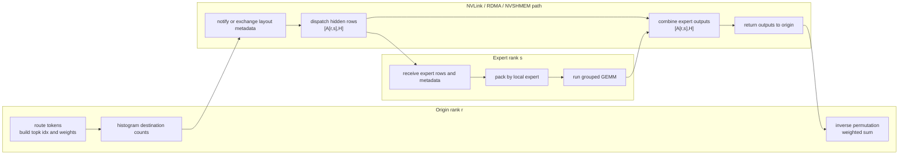

**Diagram notation key:** `A[r,s]` maps to $A_{rs}$, the number of assignments sent from origin rank `r` to expert rank `s`; `[A[r,s],H]` is the hidden-row payload shape for that peer transfer.


Communication primitives used by EP:

| Primitive | Scope | Payload | Typical use |
|---|---|---|---|
| all-to-all | all ranks in EP group | variable token rows plus metadata | dispatch and combine |
| notify/count exchange | all ranks or p2p peer pairs | row counts, offsets, handles | prepare variable-size receive buffers |
| p2p send/recv | rank pairs | packed token segments | custom all-to-all or pipeline overlap |
| RDMA write/read | inter-node ranks | token buffers and control state | cross-node EP dispatch/combine |
| NVLink/NVSwitch copy | intra-node ranks | high-bandwidth token buffers | local EP, Wide-EP, Mega MoE overlap |
| NVSHMEM-backed communication | GPU-initiated cross-rank memory access | buffers and synchronization state | DeepEP internode and low-latency paths |

DeepEP exposes two major communication modes. Normal kernels target training and inference prefill, where token batches are large enough to amortize setup and achieve high bandwidth. They support NVLink plus RDMA forwarding, FP8 dispatch, BF16 combine, SM-count control, and communication/computation overlap. Low-latency kernels target inference decode, where token counts are small and launch/synchronization overhead dominates. The public DeepEP examples show `get_dispatch_layout`, `dispatch`, `combine`, low-latency dispatch/combine, receive hooks, and background RDMA traffic that can overlap with compute without consuming GPU SMs for the receive hook.

Papers/repos/docs for this subsection: [DeepEP](https://github.com/deepseek-ai/DeepEP), [SGLang/Miles DeepSeek-V4](https://www.lmsys.org/blog/2026-04-25-deepseek-v4/), [DeepSeek-V3](https://arxiv.org/abs/2412.19437), [TensorRT-LLM Wide-EP docs](https://github.com/NVIDIA/TensorRT-LLM/blob/main/docs/source/features/parallel-strategy.md), [Tutel](https://proceedings.mlsys.org/paper_files/paper/2023/hash/5616d34cf8ff73942cfd5aa922842556-Abstract-mlsys2023.html).

### 6.6 Primitive Technique: Capacity, Dropless Execution, and Padding

MoE routing is data-dependent, so $L_e$ changes every step. A system must decide what to do when an expert receives more tokens than expected. Classical MoE systems use expert capacity:

$$
C
=
\left\lceil
\phi \frac{N k}{E}
\right\rceil,
$$

where $C$ is per-expert capacity, $\phi \ge 1$ is the capacity factor, $N$ is total tokens, $k$ is top-k, and $E$ is expert count. Assignments beyond capacity can be dropped or rerouted. The number of dropped assignments is:

$$
D_{\mathrm{drop}}
=
\sum_{e=1}^{E}
\max(0, L_e - C),
$$

where $D_{\mathrm{drop}}$ counts assignments that exceed capacity. The drop fraction is:

$$
\delta_{\mathrm{drop}}
=
\frac{D_{\mathrm{drop}}}{N k},
$$

where $\delta_{\mathrm{drop}}$ is the fraction of routed assignments not executed.

Padding avoids drops by allocating fixed expert buffers of length $C$, but it wastes compute. Padding waste is:

$$
W_{\mathrm{pad}}
=
\sum_{e=1}^{E}
\max(0, C - L_e),
$$

where $W_{\mathrm{pad}}$ is unused padded token slots across experts. The runtime tradeoff is:

| Strategy | Benefit | Cost |
|---|---|---|
| drop overflow | fixed shapes, bounded memory | quality loss or changed objective |
| reroute overflow | fewer drops | extra routing logic and possible imbalance elsewhere |
| pad to capacity | simple dense expert buffers | wasted GEMM work and HBM bandwidth |
| dropless variable execution | preserves all assignments | dynamic shapes, block-sparse or grouped kernels |

MegaBlocks is the key lineage system for dropless MoE. It avoids token dropping by representing expert work as block-sparse computation. If block size is $q$ token rows, expert $e$ uses:

$$
B_e
=
\left\lceil
\frac{L_e}{q}
\right\rceil
$$

blocks, where $B_e$ is the number of blocks assigned to expert $e$, $L_e$ is expert load, and $q$ is block row size. Total block work is:

$$
B_{\mathrm{total}}
=
\sum_{e=1}^{E} B_e.
$$

Block-sparse execution has bounded tile padding but avoids dropping tokens. This is the clean conceptual bridge from routing to GPU kernels: the router emits a dynamic sparse pattern, and the kernel consumes it as a sparse matrix layout rather than as many independent small dense GEMMs.

DeepSeek-V3's auxiliary-loss-free load balancing addresses the upstream routing side. MegaBlocks addresses the downstream execution side. DeepEP and DeepGEMM address the distributed communication and GEMM execution side. A production MoE layer needs all three levels to agree.

Papers/repos/docs for this subsection: [MegaBlocks](https://proceedings.mlsys.org/paper_files/paper/2023/hash/5a54f79333768effe7e8927bcccffe40-Abstract-mlsys2023.html), [DeepSeek-V3](https://arxiv.org/abs/2412.19437), [Megatron-Core MoE support](https://developer.nvidia.com/megatron-core), [Switch Transformer](https://arxiv.org/abs/2101.03961), [GShard](https://research.google/pubs/gshard-scaling-giant-models-with-conditional-computation-and-automatic-sharding/).

### 6.7 Primitive Technique: Grouped GEMM, MegaBlocks, DeepGEMM, and Mega MoE

After dispatch, each expert owns a variable number of token rows:

$$
X_e \in \mathbb{R}^{L_e \times H}.
$$

For a SwiGLU expert, the first projection can be written:

$$
[G_e, U_e]
=
X_e W^{(1)}_e,
$$

where $X_e \in \mathbb{R}^{L_e \times H}$, $W^{(1)}_e \in \mathbb{R}^{H \times 2I}$, and $G_e,U_e \in \mathbb{R}^{L_e \times I}$. The activation is:

$$
A_e
=
\operatorname{SwiGLU}(G_e, U_e),
$$

where $A_e \in \mathbb{R}^{L_e \times I}$. The second projection is:

$$
Y_e
=
A_e W^{(2)}_e,
$$

where $W^{(2)}_e \in \mathbb{R}^{I \times H}$ and $Y_e \in \mathbb{R}^{L_e \times H}$.

The naive implementation launches one or more GEMMs per expert. That is inefficient when $L_e$ is small or irregular. Grouped GEMM batches many expert GEMMs together. In an M-grouped expert GEMM, each expert has a different $M$ dimension $L_e$, while $N$ and $K$ dimensions are fixed by expert shape:

$$
\{X_e W^{(1)}_e\}_{e \in \mathcal{E}_{\mathrm{local}}},
\qquad
X_e \in \mathbb{R}^{L_e \times H},
\quad
W^{(1)}_e \in \mathbb{R}^{H \times 2I}.
$$

Here $\mathcal{E}_{\mathrm{local}}$ is the local expert set. DeepGEMM's contiguous grouped layout concatenates expert token rows into one buffer:

$$
X_{\mathrm{grouped}}
=
\operatorname{concat}_{e \in \mathcal{E}_{\mathrm{local}}} X_e
\in
\mathbb{R}^{N^{\mathrm{recv}}_s \times H},
$$

where $N^{\mathrm{recv}}_s = \sum_{e \in \mathcal{E}_{\mathrm{local}}} L_e$ is the total received assignments on rank $s$. A `grouped_layout` or offsets vector tells the kernel where each expert segment begins.

DeepGEMM's MoE-relevant modes are:

| Kernel family | Shape idea | Phase |
|---|---|---|
| M-grouped contiguous GEMM | variable expert token rows $L_e$, fixed $H,I$ | training forward and inference prefill |
| K-grouped GEMM | grouped along effective $K$ for expert weight gradients | training backward |
| M-grouped masked GEMM | fixed maximum buffers plus validity masks | CUDA Graph-friendly decode |
| FP8/FP4 GEMM | low-precision activations/weights with scales | Hopper/Blackwell expert compute |
| Mega MoE | fused dispatch, expert linear 1, activation, expert linear 2, combine | Blackwell-oriented low-latency MoE path |

The grouped-GEMM local shard shapes with expert tensor parallelism are:

| Tensor | No expert TP | With expert TP degree $P_{\mathrm{tp}}$ |
|---|---:|---:|
| $X_e$ | $[L_e, H]$ | often $[L_e, H]$ before expert TP, or hidden-sharded if upstream layout keeps TP shards |
| $W^{(1)}_e$ | $[H, 2I]$ | $[H, 2I/P_{\mathrm{tp}}]$ for column parallel |
| $A_e$ | $[L_e, I]$ | $[L_e, I/P_{\mathrm{tp}}]$ after first projection |
| $W^{(2)}_e$ | $[I, H]$ | $[I/P_{\mathrm{tp}}, H]$ for row parallel |
| $Y_e$ | $[L_e, H]$ | partial or reduced $[L_e,H]$, depending on TP plan |

DeepGEMM's 2026 Mega MoE path goes further. It fuses EP dispatch, FP8-by-FP4 expert linear 1, SwiGLU, expert linear 2, and EP combine into one symmetric-memory-based mega-kernel, overlapping NVLink communication with tensor-core computation. SGLang/Miles reports integrating this for DeepSeek-V4 while aliasing transformed FP4 expert layouts so deployments avoid keeping duplicate expert tensors resident. This is the recent frontier pattern: the MoE layer is no longer separate "communication then compute"; it is a fused communication-adjacent sparse linear algebra kernel.

Papers/repos/docs for this subsection: [DeepGEMM](https://github.com/deepseek-ai/DeepGEMM), [SGLang/Miles DeepSeek-V4](https://www.lmsys.org/blog/2026-04-25-deepseek-v4/), [DeepEP](https://github.com/deepseek-ai/DeepEP), [MegaBlocks](https://proceedings.mlsys.org/paper_files/paper/2023/hash/5a54f79333768effe7e8927bcccffe40-Abstract-mlsys2023.html), [CUTLASS/CuTe background](https://github.com/NVIDIA/cutlass), [Tutel](https://proceedings.mlsys.org/paper_files/paper/2023/hash/5616d34cf8ff73942cfd5aa922842556-Abstract-mlsys2023.html).

### 6.8 Primitive Technique: Backward Pass, Weight Gradients, and Overlap

Training adds backward communication and expert weight gradients. The forward path is:

$$
X
\xrightarrow{\mathrm{route}}
\texttt{topk}
\xrightarrow{\mathrm{dispatch}}
X_e
\xrightarrow{F_e}
Y_e
\xrightarrow{\mathrm{combine}}
Y.
$$

The backward path reverses these dependencies. The gradient of combine is dispatch-like: each origin token's gradient must be sent back to the expert output rows that contributed to it. The gradient of dispatch is combine-like: gradients for duplicated top-k assignments must return to the original token and be accumulated. DeepEP's examples make this symmetry explicit: dispatch backward calls combine, and combine backward calls dispatch.

For expert $e$, if $G^{(Y)}_e \in \mathbb{R}^{L_e \times H}$ is the gradient of the expert output and $A_e \in \mathbb{R}^{L_e \times I}$ is the intermediate activation, the second weight gradient is:

$$
\nabla W^{(2)}_e
=
A_e^\top G^{(Y)}_e,
$$

where $\nabla W^{(2)}_e \in \mathbb{R}^{I \times H}$. The first projection gradient depends on the SwiGLU derivative. If $G^{(A)}_e \in \mathbb{R}^{L_e \times I}$ is the gradient after the second projection and activation derivative, then:

$$
\nabla W^{(1)}_e
=
X_e^\top G^{(1)}_e,
$$

where $G^{(1)}_e \in \mathbb{R}^{L_e \times 2I}$ is the gradient with respect to the first projection output and $\nabla W^{(1)}_e \in \mathbb{R}^{H \times 2I}$.

Because $L_e$ varies, expert weight-gradient GEMMs are also grouped. DeepGEMM's K-grouped GEMM is relevant when weight-gradient computation has grouped effective dimensions. Training MoE also needs router-gradient computation for top-k scores, load-balancing or score-correction state, and possibly shared-expert gradients. If FSDP or ZeRO shards expert states, optimizer-state placement must align with EP ownership.

Overlap matters because EP communication can otherwise stall the pipeline. Useful overlap patterns include:

| Overlap pattern | Mechanism |
|---|---|
| dispatch of layer $\ell$ with attention/dense work from nearby layers | separate communication stream and CUDA events |
| partial expert compute while later token chunks are still arriving | receive hooks or chunked all-to-all |
| combine while next layer begins local preparation | schedule combine on communication stream and consume outputs after event |
| PP schedule overlap with MoE all-to-all | pipeline scheduling treats EP communication as a stage cost |
| DeepEP hook overlap | RDMA network receive proceeds in background, then hook materializes receive data when needed |

DeepSeek-V3's DualPipe is important context because sparse expert communication affects pipeline scheduling, not just the MoE layer itself. In a hybrid PP+EP run, the slowest expert all-to-all can create a pipeline bubble; schedules that overlap forward/backward, dispatch/combine, and expert compute reduce that bubble.

Papers/repos/docs for this subsection: [DeepEP](https://github.com/deepseek-ai/DeepEP), [DeepGEMM](https://github.com/deepseek-ai/DeepGEMM), [DeepSeek-V3](https://arxiv.org/abs/2412.19437), [SGLang/Miles DeepSeek-V4 RL stack](https://www.lmsys.org/blog/2026-04-25-deepseek-v4/), [Megatron-Core](https://docs.nvidia.com/megatron-core/developer-guide/latest/user-guide/parallelism-guide.html), [DualPipe in DeepSeek-V3](https://arxiv.org/abs/2412.19437).

### 6.9 Primitive Technique: DeepEP Modes and Network-Aware EP

DeepEP is useful as a concrete public decomposition of EP communication into GPU kernels. It is not merely "NCCL all-to-all for MoE." It exposes layout preparation, dispatch, combine, normal throughput kernels, low-latency decode kernels, event overlap, NVLink/RDMA paths, and NVSHMEM dependency for internode features.

The high-level DeepEP normal-mode workflow is:

$$
\texttt{layout}
=
\operatorname{GetDispatchLayout}(\texttt{topk\_idx}, E, P_{\mathrm{ep}}),
$$

where `layout` includes per-rank counts, per-RDMA-rank counts, per-expert counts, and token-in-rank metadata. Then:

$$
(\texttt{recv\_x}, \texttt{recv\_idx}, \texttt{recv\_weight}, \texttt{handle})
=
\operatorname{Dispatch}(X, \texttt{topk\_idx}, \texttt{topk\_weight}, \texttt{layout}),
$$

where `recv_x` is the received hidden-state buffer and `handle` records enough metadata to invert dispatch. After expert compute:

$$
Y
=
\operatorname{Combine}(\texttt{expert\_out}, \texttt{handle}, \texttt{topk\_weight}).
$$

In these formulas, $X$ is the local input token matrix, $E$ is expert count, and $P_{\mathrm{ep}}$ is EP group size. The `handle` is a runtime metadata object, not a mathematical tensor; it captures routing/layout state needed by combine and backward.

DeepEP modes:

| Mode | Target phase | Communication substrate | Shape regime | Notes |
|---|---|---|---|---|
| normal intranode | training, prefill | NVLink/NVSwitch | thousands of tokens | high bandwidth and SM-count control |
| normal internode | training, prefill | NVLink plus RDMA forwarding | large token batches across nodes | uses RDMA and NVSHMEM-dependent internode support |
| low-latency decode | inference decode | RDMA-oriented path, newer paths also use NVLink where possible | small token batches, often $<256$ max dispatch tokens per rank | CUDA Graph-compatible APIs and receive hooks |
| overlap hooks | training or decode | background network traffic plus CUDA events | double-buffered or microbatched | receive hook allows network progress without SM occupation until materialization |

Network details matter:

| Network mechanism | Why it matters for EP |
|---|---|
| NVLink/NVSwitch | best for high-frequency intranode dispatch/combine and Mega MoE overlap |
| RDMA over InfiniBand or RoCE | required for cross-node EP at large $P_{\mathrm{ep}}$ |
| NVSHMEM | enables GPU-side communication primitives used by DeepEP internode and low-latency paths |
| traffic isolation / virtual lanes | prevents EP traffic from interfering with other cluster traffic |
| adaptive routing | can reduce congestion under heavy load but may add latency |
| SM-count control | prevents communication kernels from starving expert GEMMs |

The practical lesson is that EP communication is not a single collective knob. It is a contract among router layout, buffer allocation, GPU streams, NIC paths, NVLink domains, and expert compute kernels.

Papers/repos/docs for this subsection: [DeepEP](https://github.com/deepseek-ai/DeepEP), [SGLang/Miles DeepSeek-V4](https://www.lmsys.org/blog/2026-04-25-deepseek-v4/), [DeepGEMM Mega MoE](https://github.com/deepseek-ai/DeepGEMM), [TensorRT-LLM Wide-EP docs](https://github.com/NVIDIA/TensorRT-LLM/blob/main/docs/source/features/parallel-strategy.md), [NVIDIA NVSHMEM documentation](https://docs.nvidia.com/nvshmem/).

### 6.10 Primitive Technique: Wide-EP Serving and Hot-Expert Replication

Training-time EP usually assigns each expert to one owner shard and optimizes throughput. Serving-time EP must also manage latency, hot experts, cache behavior, request variability, and small decode batches. TensorRT-LLM's Wide-EP reframes expert ownership for serving by separating model experts from engine slots.

Let $S$ be the number of serving expert slots in an EP serving group. A slot is an engine placement location, while an expert is a model-defined function. Wide-EP maintains a mapping:

$$
\mathcal{S}(e)
=
\{s_1,\ldots,s_{m_e}\},
$$

where $\mathcal{S}(e)$ is the set of slots that can execute expert $e$, and $m_e = |\mathcal{S}(e)|$ is the number of replicas for expert $e$. If expert $e$ is hot, $m_e > 1$ allows requests for $e$ to be split across multiple slots. A simple online slot choice is:

$$
s^\star
=
\arg\min_{s \in \mathcal{S}(e)}
\widehat{L}^{\mathrm{slot}}_s,
$$

where $s^\star$ is the selected slot and $\widehat{L}^{\mathrm{slot}}_s$ is an estimated queued or recent token load for slot $s$.

Wide-EP changes local shapes. Without replication, a rank owns $E_{\mathrm{local}}$ experts. With slots, a rank owns a set of slots:

$$
\mathcal{Q}_r
=
\{s : \operatorname{slot\_owner}(s)=r\},
$$

where $\mathcal{Q}_r$ is the local slot set. Expert weights are placed by slot rather than by expert id:

$$
\Theta^{\mathrm{slot}}_r
=
\{\theta_e : s \in \mathcal{Q}_r,\ e=\operatorname{expert}(s)\},
$$

where $\Theta^{\mathrm{slot}}_r$ is the local serving expert-weight set. If an expert is replicated, its weight tensor appears in multiple slots, increasing memory but reducing hot-expert queuing.

Serving dispatch metadata therefore uses chosen slots as well as expert ids:

| Buffer | Shape | Serving meaning |
|---|---:|---|
| `topk_idx` | $[N_r, k]$ | model expert ids selected by router |
| `slot_idx` | $[N_r, k]$ | serving slot selected for each expert assignment |
| `slot_counts` | $[S]$ | assignment count per engine slot |
| `send_counts` | $[P_{\mathrm{ep}}]$ | assignments per destination rank after slot choice |
| `slot_offsets` | $[\lvert\mathcal{Q}_r\rvert+1]$ | local packed slot offsets |

TensorRT-LLM documents both offline and online Expert Parallelism Load Balancer (EPLB) modes. Offline EPLB precomputes placement from historical workload statistics. Online EPLB adapts when traffic changes. The serving question is not "are model experts balanced in expectation?" It is "does the engine avoid hot slot queues under today's requests without disrupting inference?"

Wide-EP is especially relevant for decode. Decode batches are smaller, hot experts create tail latency, and each step has less compute with which to hide communication. Replicating hot experts can be worth the extra memory if it reduces $\max_s L^{\mathrm{slot}}_s$, where $L^{\mathrm{slot}}_s$ is assignments queued for slot $s$.

Papers/repos/docs for this subsection: [TensorRT-LLM Wide-EP docs](https://github.com/NVIDIA/TensorRT-LLM/blob/main/docs/source/features/parallel-strategy.md), [SGLang/Miles DeepSeek-V4](https://www.lmsys.org/blog/2026-04-25-deepseek-v4/), [DeepSeek-V4 model card](https://huggingface.co/deepseek-ai/DeepSeek-V4-Pro), [DeepEP](https://github.com/deepseek-ai/DeepEP), [DeepGEMM](https://github.com/deepseek-ai/DeepGEMM).

### 6.11 Composition With TP, SP, PP, CP, DP, and Precision

EP is rarely used alone in frontier systems. It composes with:

| Axis | Composition with EP | Main constraint |
|---|---|---|
| DP/FSDP | each data replica has the same logical expert layout, or expert states are sharded consistently | optimizer state and checkpoint resharding |
| TP | expert weights or dense layers are tensor-sharded | TP collectives inside expert or around expert output |
| SP | sequence dimension is sharded for non-attention activations | required or strongly recommended in Megatron TP+EP configurations |
| PP | different layers, including MoE layers, live on different pipeline stages | EP all-to-all must fit pipeline schedule without bubbles |
| CP | long-context attention split across ranks before or after MoE layers | token ownership and sequence layouts must be reconciled before routing |
| precision | FP8/FP4 expert weights, activations, scales, and combine dtypes | scale metadata and accumulation dtype become part of layout |

For local memory, a rough expert-weight estimate with EP and expert TP is:

$$
M^{\mathrm{expert}}_{\mathrm{rank}}
\approx
\frac{E}{P_{\mathrm{ep}}}
\cdot
\frac{3HI}{P_{\mathrm{tp}}}
\cdot
B_w,
$$

where $M^{\mathrm{expert}}_{\mathrm{rank}}$ is bytes of expert weights per rank, $E$ is total experts, $P_{\mathrm{ep}}$ is EP degree, $H$ is hidden width, $I$ is intermediate width, $P_{\mathrm{tp}}$ is expert tensor-parallel degree, and $B_w$ is bytes per expert-weight element. This formula excludes shared experts, dense layers, scales, optimizer states, padding, and expert replication. With Wide-EP, replicated slots add:

$$
M^{\mathrm{replica}}_{\mathrm{extra}}
\approx
\sum_{e=1}^{E} (m_e - 1)
\cdot
3HI B_w,
$$

where $m_e$ is the number of serving slot replicas for expert $e$. This extra memory is a serving tradeoff against lower hot-expert latency.

For communication, the main shape compatibility issue is hidden-state layout. If upstream TP leaves each rank with hidden shard $[N_r, H/P_{\mathrm{tp}}]$, the MoE system must decide whether to:

1. gather full hidden states before routing and expert dispatch,
2. route hidden shards and use expert TP inside experts,
3. keep sequence-parallel layouts and dispatch shard-compatible token rows, or
4. use a framework-specific fused layout that avoids redundant gathers.

Megatron-Core's "enable sequence parallelism when TP+EP" guidance is a concrete rule that prevents hidden-state layout conflicts. SGLang/Miles DeepSeek-V4 evidence shows the inference/RL side of the same theme: DP/TP/SP/EP/PP/CP can all be present, but model-specific tensors such as mHC streams and hybrid-attention metadata must be carried across the correct process groups.

Papers/repos/docs for this subsection: [Megatron-Core parallelism guide](https://docs.nvidia.com/megatron-core/developer-guide/latest/user-guide/parallelism-guide.html), [SGLang/Miles DeepSeek-V4](https://www.lmsys.org/blog/2026-04-25-deepseek-v4/), [DeepSeek-V3](https://arxiv.org/abs/2412.19437), [TensorRT-LLM parallel strategy](https://github.com/NVIDIA/TensorRT-LLM/blob/main/docs/source/features/parallel-strategy.md), [DeepGEMM](https://github.com/deepseek-ai/DeepGEMM), [Transformer Engine FP8 docs](https://docs.nvidia.com/deeplearning/transformer-engine-releases/release-2.8/user-guide/index.html).

### 6.12 End-to-End MoE Execution Recipe

A reader can now decompose one MoE layer into primitive phases:

1. **Route.** Compute router logits $[N_r,E]$, select `topk_idx` with shape $[N_r,k]$, and produce `topk_weight` with shape $[N_r,k]$.
2. **Count.** Histogram assignments by expert and by destination rank.
3. **Pack.** Prefix-sum counts and scatter hidden rows into `send_buf` with shape $[N_r k,H]$.
4. **Notify/layout.** Exchange or compute variable-size receive metadata for all-to-all.
5. **Dispatch.** Send token rows to expert-owner ranks using all-to-all or custom p2p over NVLink/RDMA/NVSHMEM.
6. **Local regroup.** Pack received rows by local expert or serving slot.
7. **Compute.** Run grouped GEMM, block-sparse GEMM, masked grouped GEMM, or Mega MoE.
8. **Combine.** Send expert outputs back to origin ranks.
9. **Inverse permute.** Accumulate top-k weighted outputs back to $[N_r,H]$.
10. **Backward or decode continuation.** In training, reverse dispatch/combine and compute expert/router gradients. In inference, commit output and continue the decode schedule.


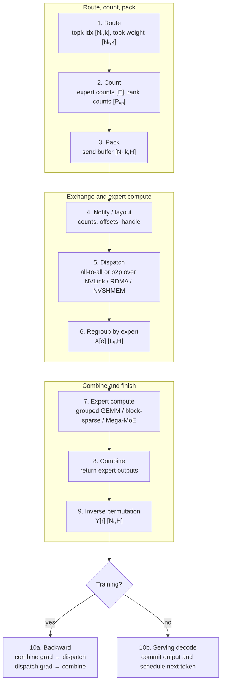

**Diagram notation key:** `Nᵣ` maps to $N_r$; `Pₑₚ` maps to $P_{\mathrm{ep}}$; `X[e]` maps to $X_e$; `Lₑ` maps to $L_e$; `Y[r]` maps to $Y_r$.


The core bottleneck can be diagnosed by asking which primitive dominates:

| Dominant symptom | Likely primitive | Typical remedy |
|---|---|---|
| hot ranks wait at combine | routing or expert ownership | load balancing, Wide-EP slots, group-limited routing |
| high network time | dispatch/combine | keep EP local, tune RDMA/NVLink path, reduce $k$, FP8 dispatch |
| poor tensor-core utilization | expert compute | grouped GEMM, block-sparse kernels, larger batches, better packing |
| CUDA Graph breaks in decode | dynamic metadata | masked grouped GEMM, fixed buffers, low-latency DeepEP path |
| pipeline bubbles | EP plus PP schedule | overlap dispatch/combine, use schedule-aware PP, tune microbatches |
| memory pressure | expert ownership or replication | increase EP, use FP4/FP8 weights, reduce replicas, shard optimizer states |

Papers/repos/docs for this subsection: [DeepEP](https://github.com/deepseek-ai/DeepEP), [DeepGEMM](https://github.com/deepseek-ai/DeepGEMM), [TensorRT-LLM Wide-EP docs](https://github.com/NVIDIA/TensorRT-LLM/blob/main/docs/source/features/parallel-strategy.md), [Megatron-Core](https://docs.nvidia.com/megatron-core/developer-guide/latest/user-guide/parallelism-guide.html), [SGLang/Miles DeepSeek-V4](https://www.lmsys.org/blog/2026-04-25-deepseek-v4/), [MegaBlocks](https://proceedings.mlsys.org/paper_files/paper/2023/hash/5a54f79333768effe7e8927bcccffe40-Abstract-mlsys2023.html), [Tutel](https://proceedings.mlsys.org/paper_files/paper/2023/hash/5616d34cf8ff73942cfd5aa922842556-Abstract-mlsys2023.html).

### 6.13 Evidence Boundaries and Caveats

The public evidence should be separated by type. DeepSeek-V4's official model card supports architecture-level claims about MoE scale, active parameters, context length, and precision. SGLang/Miles supports runtime and integration claims about serving, RL integration, DeepEP, DeepGEMM Mega MoE, and full parallelism composition. DeepEP and DeepGEMM repositories support public implementation claims about communication and grouped/fused GEMM kernels. TensorRT-LLM supports serving abstractions such as Wide-EP, expert slots, and EPLB. Exact private DeepSeek-V4 production training meshes and undisclosed kernels should be labeled inferred unless directly published.

MoE sparsity is not a guarantee of speed. It reduces activated parameters, but it also adds routing, metadata, packing, all-to-all, load imbalance, and variable-shape GEMM. An efficient MoE system is a co-design of router statistics, expert placement, communication substrate, CUDA kernel layout, serving scheduler, and precision policy.

Recent sources: [DeepSeek-V4 model card](https://huggingface.co/deepseek-ai/DeepSeek-V4-Pro), [SGLang/Miles DeepSeek-V4](https://www.lmsys.org/blog/2026-04-25-deepseek-v4/), [DeepSeek-V3](https://arxiv.org/abs/2412.19437), [DeepEP](https://github.com/deepseek-ai/DeepEP), [DeepGEMM](https://github.com/deepseek-ai/DeepGEMM), [TensorRT-LLM Wide-EP](https://github.com/NVIDIA/TensorRT-LLM/blob/main/docs/source/features/parallel-strategy.md), [Megatron-Core](https://docs.nvidia.com/megatron-core/developer-guide/latest/user-guide/parallelism-guide.html), [Qwen3](https://huggingface.co/papers/2505.09388). Lineage: [MegaBlocks](https://proceedings.mlsys.org/paper_files/paper/2023/hash/5a54f79333768effe7e8927bcccffe40-Abstract-mlsys2023.html), [Tutel](https://proceedings.mlsys.org/paper_files/paper/2023/hash/5616d34cf8ff73942cfd5aa922842556-Abstract-mlsys2023.html), [Switch Transformer](https://arxiv.org/abs/2101.03961), [GShard](https://research.google/pubs/gshard-scaling-giant-models-with-conditional-computation-and-automatic-sharding/).

## 7. Hybrid Mesh Parallelism

Hybrid mesh parallelism is now the application layer over the shared mesh model from Section 1. Rather than redefining axes, process groups, placement states, or cost formulas, this section asks how to choose degrees, map logical coordinates to physical GPUs, checkpoint a composed mesh, and reason about framework-specific implementations. The key engineering problem is not naming DP/TP/PP/CP/EP; it is choosing a physical mapping $\pi(\rho)$ and schedule that put the most frequent or least-overlappable traffic on the fastest links.

References for the shared mesh model: [NVIDIA Megatron-Core parallelism guide](https://docs.nvidia.com/megatron-core/developer-guide/latest/user-guide/parallelism-guide.html), [TorchTitan](https://github.com/pytorch/torchtitan), [MaxText](https://github.com/AI-Hypercomputer/maxtext), [GSPMD](https://arxiv.org/abs/2105.04663), [Pathways](https://research.google/pubs/pathways-asynchronous-distributed-dataflow-for-ml/), [DeepSpeed](https://github.com/deepspeedai/DeepSpeed), [Ultra-Scale Playbook](https://nanotron-ultrascale-playbook.static.hf.space/index.html).

### 7.1 Rank Mapping and Topology-Aware Placement

The logical mesh is not the physical layout. A row-major linearization such as

$$
r_{\mathrm{logical}}
=
((((i_{\mathrm{dp}} d_{\mathrm{pp}} + i_{\mathrm{pp}})
d_{\mathrm{tp}} + i_{\mathrm{tp}})
d_{\mathrm{cp}} + i_{\mathrm{cp}})
d_{\mathrm{ep}} + i_{\mathrm{ep}})
$$

is only a naming scheme. A production runtime applies a topology-aware permutation:

$$
r_{\mathrm{physical}} = \pi(r_{\mathrm{logical}}).
$$

The permutation $\pi$ should place bandwidth-sensitive groups on the fastest links. A useful ordering of sensitivity is:

1. TP collectives are frequent and often on the layer critical path, so TP usually prefers intra-node NVLink/NVSwitch.
2. EP all-to-all can be both large and latency-sensitive, especially in decode, so EP also prefers local NVLink or a carefully chosen RDMA domain.
3. CP attention exchange can be large for long context and should avoid slow cross-rack paths when possible.
4. PP p2p moves boundary activations once per microbatch per stage transition and can often tolerate a slower domain than TP.
5. DP/FSDP traffic is large but bucketed and often overlapped, so it can span the widest domain if topology pressure demands it.

Using the shared cost model, rank mapping mainly changes $B_{\mathrm{eff}}$, bisection bandwidth, and contention. Ring all-reduce is often bandwidth-predictable inside one NVSwitch domain; EP all-to-all is more sensitive to bisection and imbalance; CP traffic depends on whether the attention implementation uses all-gather, all-to-all, or ring p2p.

Example mapping for a 1024-GPU MoE training run:

$$
W = 1024 = d_{\mathrm{dp}}8 \cdot d_{\mathrm{pp}}8 \cdot d_{\mathrm{tp}}4 \cdot d_{\mathrm{cp}}2 \cdot d_{\mathrm{ep}}2.
$$

Assume 8 GPUs per node. One topology-aware local mapping is:

$$
\mathrm{local\_gpu} = i_{\mathrm{tp}} + d_{\mathrm{tp}} i_{\mathrm{ep}},
$$

so each node contains one $4 \times 2$ TP-by-EP tile. This keeps TP collectives and EP dispatch/combine local when the layer's EP group is scoped to the node. CP pairs can then be placed across adjacent nodes in the same rack, PP stages across groups of nodes, and DP replicas across the widest remaining domain.


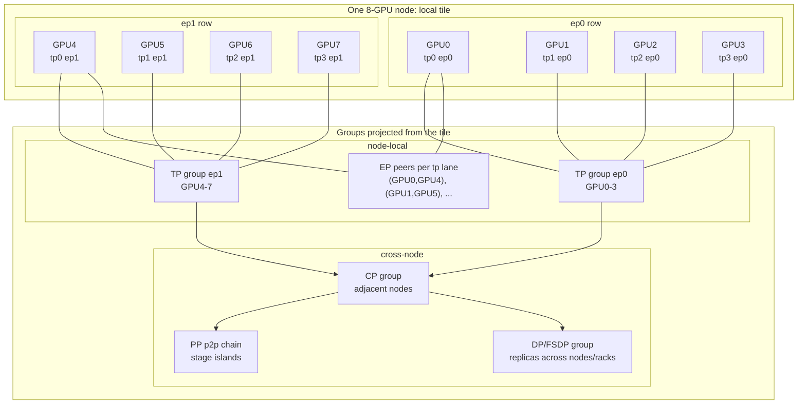

**Diagram notation key:** `tp0...tp3` and `ep0...ep1` are mesh coordinates, not tensor formulas; `(GPU0,GPU4)` denotes an EP peer pair sharing the same TP lane.


This is an illustrative mapping, not a universal rule. On an NVL72-style topology, a larger TP/EP/CP island might be local. On smaller 8-GPU nodes, cross-node EP may be unavoidable for very large expert counts. The point is that mesh axes should be assigned to physical domains based on traffic, not on naming convenience.

References for this subsection: [NVIDIA Megatron-Core](https://developer.nvidia.com/megatron-core), [NVIDIA Transformer Engine](https://docs.nvidia.com/deeplearning/transformer-engine-releases/release-2.8/user-guide/index.html), [TorchTitan](https://github.com/pytorch/torchtitan), [Ultra-Scale Playbook](https://nanotron-ultrascale-playbook.static.hf.space/index.html), [MegaScale](https://arxiv.org/abs/2402.15627), [DeepSpeed](https://www.deepspeed.ai/).

### 7.2 Checkpoint Resharding and Restart Semantics

A hybrid checkpoint must store values and placement metadata. Without placement metadata, a checkpoint only tells us tensor bytes, not which global tensor slice each rank owns.

At minimum, each sharded tensor needs:

| Metadata | Example |
|---|---|
| global tensor name | `layers.12.mlp.w1.weight` |
| global shape | $[H,H_{\mathrm{ff}}]$ |
| dtype and scale state | BF16, FP8 plus amax history, FP4 plus block scales |
| mesh axes | `dp`, `pp`, `tp`, `cp`, `ep` |
| sharding spec | `Shard(H_ff on tp)`, `Shard(layer on pp)`, `Shard(expert on ep)` |
| rank ownership | offsets, lengths, expert ids, pipeline stage id |
| optimizer state | moments, step counters, master weights, scale histories |
| RNG and sampler state | dropout, data order, activation recomputation determinism |

If a tensor $T$ was saved on an old mesh $M_{\mathrm{old}}$ and restored on a new mesh $M_{\mathrm{new}}$, the restore operation is:

$$
\mathrm{Shard}_{M_{\mathrm{new}}}(T)
=
\mathrm{Redistribute}
\left(
\mathrm{Shard}_{M_{\mathrm{old}}}(T),
M_{\mathrm{old}} \rightarrow M_{\mathrm{new}}
\right).
$$

The naive implementation gathers $T$ to a full tensor and then shards it again. That fails for very large models. Distributed checkpointing instead writes independent shards with enough metadata to let new ranks read only the slices they need, or to perform a streaming redistribution.

Checkpoint resharding is also tied to optimizer semantics. If parameters are sharded on TP and optimizer states are sharded on DP, both placements must be restored consistently. Low-precision training adds another constraint: scale tensors, amax histories, and master-weight precision policies are part of the checkpoint. A model can load successfully and still diverge if these states are silently reset or mismatched.

TorchTitan makes distributed checkpointing a first-class part of its composable training stack. Megatron-Core documents distributed checkpointing for model-parallel and optimizer-parallel state. MaxText and the JAX/XLA ecosystem use global array metadata and mesh-aware checkpointing. DeepSpeed's ZeRO checkpointing and Universal Checkpointing lineage address state partitioning and restart across different parallel configurations.

References for this subsection: [TorchTitan distributed checkpointing context](https://github.com/pytorch/torchtitan), [PyTorch Distributed Checkpoint](https://docs.pytorch.org/docs/stable/distributed.checkpoint.html), [Megatron-Core](https://docs.nvidia.com/megatron-core/developer-guide/latest/index.html), [MaxText](https://maxtext.readthedocs.io/), [DeepSpeed ZeRO checkpointing documentation](https://deepspeed.readthedocs.io/en/stable/zero3.html).

### 7.3 Composition Rules

Hybrid mesh composition is safest when each axis has a clear contract. The following rules are practical guardrails.

1. **DP/FSDP groups must compare equivalent model shards.** A DP or FSDP group should hold fixed PP, TP, CP, and EP coordinates. Otherwise ranks would reduce gradients for different layers, different hidden shards, different context shards, or different experts.

2. **TP should be placed inside a fast topology domain.** TP collectives are frequent and often block layer progress. Prefer NVLink/NVSwitch for $G_{\mathrm{tp}}$. If TP spans slow links, increase overlap, reduce TP degree, or move pressure to PP/FSDP when memory allows.

3. **SP is a TP layout technique, while CP is an attention algorithm.** SP shards selected activations across the TP group to reduce memory. CP shards context and must still compute correct attention over the required key/value set.

4. **PP boundaries require explicit tensor contracts.** Every pipeline edge must define shape, dtype, placement, and whether the tensor is replicated, sharded, partial, or a tuple of states. Nonstandard architectures with multiple residual streams or hybrid attention state need explicit boundary schemas.

5. **CP must align with attention semantics.** Causal dense attention, sliding-window attention, block-sparse attention, MLA, CSA/HCA-style hybrid attention, and prefix-cached inference all require different K/V movement and metadata. A CP split is correct only if every query sees the allowed keys.

6. **EP must align routing, capacity, dispatch, grouped GEMM, and combine.** The router's top-k policy determines token destinations; capacity or dropless routing determines buffer sizes; the all-to-all determines token layout; grouped GEMM consumes expert-contiguous buffers; combine restores token order. These steps are one distributed operator.

7. **Low precision is part of placement.** FP8, MXFP8, NVFP4, and FP4 expert weights include payload tensors plus scales and often amax histories. If the payload is sharded, the scale layout must be sharded or replicated consistently.

8. **Checkpoint layout must be a first-class API.** A run that uses $d_{\mathrm{tp}}=8$ and resumes with $d_{\mathrm{tp}}=4$ needs resharding. A run that changes PP degree needs layer-to-stage remapping. A run that changes EP degree needs expert ownership remapping.

9. **Choose axes from bottlenecks, then remap.** If model state exceeds HBM, add FSDP/ZeRO, PP, TP, or EP. If local GEMMs are too large, add TP. If attention context dominates, add CP or sparse attention. If expert parameters dominate, add EP. Each new axis changes the communication bottleneck, so rank mapping must be revisited.


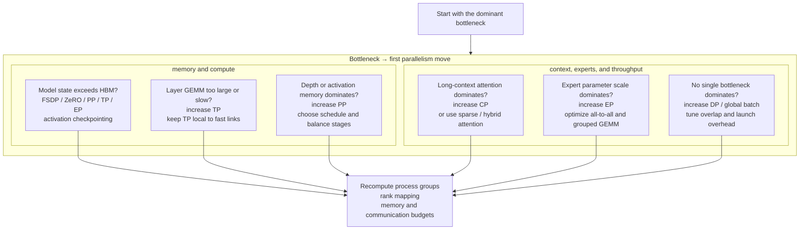

**Diagram notation key:** the decision labels are prose rather than formulas; `HBM` means GPU high-bandwidth memory, and the parallelism abbreviations match the section headings.


References for this subsection: [Ultra-Scale Playbook](https://nanotron-ultrascale-playbook.static.hf.space/index.html), [NVIDIA Megatron-Core parallelism guide](https://docs.nvidia.com/megatron-core/developer-guide/latest/user-guide/parallelism-guide.html), [TorchTitan](https://github.com/pytorch/torchtitan), [DeepSpeed](https://www.deepspeed.ai/), [MaxText](https://github.com/AI-Hypercomputer/maxtext), [GSPMD](https://arxiv.org/abs/2105.04663), [Pathways](https://research.google/pubs/pathways-asynchronous-distributed-dataflow-for-ml/).

### 7.4 System Perspectives

**Megatron-Core.** Megatron-Core is the most explicit public reference for transformer-specific hybrid mesh training on NVIDIA GPUs. It exposes tensor parallelism, pipeline parallelism, context parallelism, sequence parallelism, expert parallelism, data parallelism, distributed optimizer support, activation recomputation, Transformer Engine integration, and distributed checkpointing. Its model is close to the manual systems view: users choose degrees, groups are initialized, and kernels/collectives are specialized for the chosen layout.

**TorchTitan.** TorchTitan is important because it brings hybrid training into a PyTorch-native path. It composes FSDP2, tensor parallelism, pipeline parallelism, context parallelism, Float8, distributed checkpointing, logging, and profiling around Llama-style models. Its significance is not that it covers every frontier architecture; it is that it makes mesh composition, checkpointing, and debugging visible in mainstream PyTorch abstractions such as `DeviceMesh`, DTensor-style placement, and native distributed pipelining.

**MaxText, GSPMD, and Pathways.** MaxText represents the JAX/XLA path. The user describes tensor sharding over a logical mesh, and the compiler inserts or optimizes many collectives. GSPMD introduced the general approach of propagating tensor sharding through computation graphs; Pathways adds asynchronous distributed dataflow and accelerator orchestration. This line is strongest when shapes and control flow remain compiler-visible. It is more challenged by highly dynamic expert routing, custom CUDA kernels, or runtime-specific serving schedulers.

**DeepSpeed.** DeepSpeed remains important because it treats memory and runtime systems as first-class concerns. ZeRO and ZeRO-Infinity established practical state sharding and offload; ZeRO++ targets communication efficiency; DeepSpeed pipeline, MoE, Ulysses, and inference components cover common large-model pressure points. In a hybrid mesh taxonomy, DeepSpeed is especially useful for understanding how DP/FSDP-like state partitioning interacts with offload, PP, long-context sequence techniques, and serving.

**Ultra-Scale Playbook.** The Ultra-Scale Playbook is not a single runtime, but it is valuable because it turns mesh composition into an operational decision process. Its main lesson is to measure the bottleneck first, then choose the axis and topology placement that attacks that bottleneck. That perspective is essential because a mesh that is optimal for a dense 70B model at 8K context can be poor for a 1T-parameter MoE model at much longer context.

References for this subsection: [Megatron-Core](https://developer.nvidia.com/megatron-core), [TorchTitan](https://github.com/pytorch/torchtitan), [MaxText](https://github.com/AI-Hypercomputer/maxtext), [GSPMD](https://arxiv.org/abs/2105.04663), [Pathways](https://research.google/pubs/pathways-asynchronous-distributed-dataflow-for-ml/), [DeepSpeed](https://www.deepspeed.ai/), [Ultra-Scale Playbook](https://nanotron-ultrascale-playbook.static.hf.space/index.html).

### 7.5 Caveats and Evidence Boundaries

Hybrid mesh parallelism is a framework for composing axes, not a universal recipe. The best mesh depends on model architecture, sequence length, MoE sparsity, optimizer, precision, activation checkpointing, interconnect, NIC placement, storage bandwidth, and failure-recovery requirements. Public reports often disclose model architecture and broad parallelism families without disclosing exact production rank mappings, bucket sizes, overlap schedules, or checkpoint restore paths. Those details should be labeled inferred unless an official paper, repository, or runtime document exposes them.

The durable conclusion is that frontier systems increasingly treat mesh layout as an optimization problem over tensors, collectives, kernels, and hardware topology:

$$
\mathrm{mesh}^\star
=
\arg\min_{\mathrm{mesh},\pi,\mathrm{schedule}}
\left[
T_{\mathrm{compute}}
+
T_{\mathrm{comm}}
+
T_{\mathrm{pipeline\ bubble}}
+
T_{\mathrm{checkpoint}}
-
T_{\mathrm{overlap}}
\right]
$$

subject to:

$$
M_{\mathrm{peak,rank}} \le M_{\mathrm{HBM}},
\quad
\mathrm{correct\_placement}(T)
\quad
\mathrm{for\ every\ tensor}\ T.
$$

The reader should therefore view any stated mesh as a hypothesis tied to a workload and cluster, not as a portable law. The portable lesson is the decomposition: name the axes, form the groups, annotate tensor placements, map communication to topology, account for memory and checkpoint state, and then iterate from measured bottlenecks.

## 8. Inference Parallelism and Serving Systems

Inference parallelism is the online version of the same placement problem that appears in training, but the objective changes. Training optimizes step throughput under a fixed global batch. Serving optimizes **goodput**: completed requests per second that satisfy latency objectives while preserving cache locality, memory safety, and cost efficiency. Recent systems such as vLLM, SGLang, TensorRT-LLM, DistServe, Splitwise, DeepSpeed-FastGen, SARATHI, and the public DeepSeek-V4 integrations make this clear: the serving stack is not only TP/PP/EP over a model, but a scheduler over requests, prefill work, decode work, KV pages, prefix caches, speculative branches, and sometimes separate prefill/decode clusters.

The two core phases are:

1. **Prefill.** Given prompt tokens $X_{1:S}$, run the model over all prompt positions and write per-layer KV states. For a batch with prompt lengths $\{S_i\}$, prefill has large GEMMs and attention over many tokens, so it is usually compute-intensive.
2. **Decode.** Given the last token $x_t$ and prior KV states $(K_{1:t-1},V_{1:t-1})$, produce $x_{t+1}$. Decode has small per-request compute but repeatedly reads model weights and KV, so it is usually latency and memory-bandwidth sensitive.

For a serving replica group, a useful world-size model is:

$$
W_{\mathrm{serving}}
=
R \cdot d_{\mathrm{tp}} \cdot d_{\mathrm{pp}} \cdot d_{\mathrm{ep}} \cdot d_{\mathrm{cp}} .
$$

Here $W_{\mathrm{serving}}$ is the number of devices allocated to the serving fleet; $R$ is the number of independent replicas or serving engines; $d_{\mathrm{tp}}$, $d_{\mathrm{pp}}$, $d_{\mathrm{ep}}$, and $d_{\mathrm{cp}}$ are the tensor-, pipeline-, expert-, and context-parallel degrees inside each replica. Multiplication means that one logical replica may itself be a multi-GPU mesh.

In prefill/decode-disaggregated serving, the two phases can use different meshes:

$$
W_{\mathrm{prefill}}
=
R_p d_{\mathrm{tp},p} d_{\mathrm{pp},p} d_{\mathrm{ep},p} d_{\mathrm{cp},p},
\qquad
W_{\mathrm{decode}}
=
R_d d_{\mathrm{tp},d} d_{\mathrm{pp},d} d_{\mathrm{ep},d} d_{\mathrm{cp},d}.
$$

The subscript $p$ denotes prefill workers and $d$ denotes decode workers. Different degrees are useful because prefill may want more TP/CP for long prompts, while decode may want fewer latency-heavy collectives and more independent replicas.

The communication vocabulary for serving is:

| Communication | Where It Appears | Payload Shape | Notes |
|---|---|---|---|
| Router-to-replica assignment | request routing | request metadata, prompt tokens $[S_i]$ | CPU/control-plane routing, not a GPU collective. |
| TP all-reduce / reduce-scatter / all-gather | sharded dense layers and logits | activations $[B_{\mathrm{tok}}, H]$, logits $[B_{\mathrm{tok}}, V/t]$ | On the decode critical path every token, so latency matters more than in training. |
| PP p2p send/recv | layer-stage boundaries | activations $[B_{\mathrm{tok}}, S_{\mu}, H]$ in prefill, $[B_{\mathrm{decode}},1,H]$ in decode | Pipeline bubbles depend on active serving batch size and microbatching policy. |
| EP all-to-all dispatch/combine | MoE layers | token states $[N_{\mathrm{assign}}, H]$ plus routing metadata | Tail latency depends on hot experts and load imbalance. |
| CP KV exchange | long-context attention | local $Q_r$, remote or streamed $K,V$ blocks | Can be all-gather, ring p2p, or sparse block exchange depending on attention layout. |
| P/D KV transfer | prefill-to-decode handoff | KV pages $[L, B_{\mathrm{blk}}, n_{\mathrm{kv}}/d_{\mathrm{kv}}, d_h]$ | Often RDMA/NVLink/Ethernet transfer plus layout conversion, not an NCCL collective. |


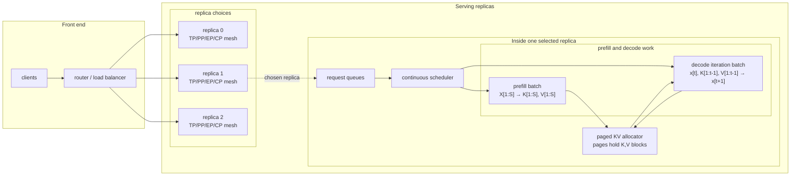

**Diagram notation key:** `X[1:S]` maps to $X_{1:S}$; `K[1:S]` and `V[1:S]` map to $K_{1:S}$ and $V_{1:S}$; `x[t+1]` maps to $x_{t+1}$; `K[1:t-1]` and `V[1:t-1]` mean all cached keys/values before step `t`.


### 8.1 Primitive Technique: Replicas and Request Routing

The simplest inference parallelism is request-level replication. Each replica is a complete model instance or a complete model-shard group. A router assigns requests to replicas using queue length, prefix-cache locality, tenant policy, [SLO](https://en.wikipedia.org/wiki/Service-level_objective) (service-level objective), context length, adapter/LoRA choice, quantization, or model variant.

If replica $j$ has arrival rate $\lambda_j$ requests/s and service rate $\mu_j$ requests/s, a necessary stability condition is:

$$
\lambda_j < \mu_j .
$$

For $R$ independent replicas, the fleet-level necessary condition is:

$$
\lambda_{\mathrm{total}}
<
\sum_{j=1}^{R} \mu_j .
$$

Here $\lambda_{\mathrm{total}}$ is the total incoming request rate. These equations use queueing-theory notation: $\lambda$ is arrival rate, $\mu$ is service rate, and the inequality says work must arrive slower than it can be served. In LLM serving, $\mu_j$ is not constant; it depends on prompt length distribution, output length distribution, prefix-cache hit rate, active KV memory, model sharding, quantization, and speculative-decoding acceptance.

| Routing Policy | Mechanism | Communication | When It Helps |
|---|---|---|---|
| Least queue | route to shortest queue | request metadata only | homogeneous short requests |
| Cache-aware | route to replica with prefix hit | metadata lookup plus possible KV locality pinning | chat, [RAG](https://en.wikipedia.org/wiki/Retrieval-augmented_generation) (retrieval-augmented generation), agents, repeated system prompts |
| SLO-aware | separate latency classes | request metadata and admission-control feedback | mixed interactive and batch workloads |
| Model-aware | route by quantization/context/adapter | request metadata | heterogeneous fleets |
| Phase-aware | route prefill and decode separately | control-plane routing plus KV transfer | P/D disaggregated serving |

Replication scales throughput without touching model internals, but it does not reduce per-replica memory. A trillion-parameter MoE model, a 1M-token context model, or a high-throughput low-latency deployment still needs TP, PP, EP, CP, paged KV, or offload inside each replica.

Further reading: vLLM serving docs, SGLang serving docs and RadixAttention documentation, TensorRT-LLM in-flight batching and parallelism docs, and DeepSpeed-FastGen.

### 8.2 Primitive Technique: Continuous Batching

Static batching waits for a group of requests and runs them together until all finish. That is wasteful for variable output lengths. **Continuous batching** schedules at iteration granularity: every decode step can admit new prefills, continue active decodes, pause requests under memory pressure, and build a new GPU batch from runnable work.

Let $\mathrm{TTFT}$ be time to first token and $\mathrm{TPOT}$ be time per output token. A useful decomposition is:

$$
\mathrm{TTFT}
=
T_{\mathrm{queue,prefill}}
+
T_{\mathrm{prefill}}
+
T_{\mathrm{schedule}}
+
T_{\mathrm{first\ decode}},
$$

$$
\mathrm{TPOT}
=
T_{\mathrm{queue,decode}}
+
T_{\mathrm{decode\ step}}
+
T_{\mathrm{sampling}}
+
T_{\mathrm{streaming}}.
$$

The notation $T_{\mathrm{queue,prefill}}$ means queueing time before prompt compute, $T_{\mathrm{prefill}}$ is prompt compute and KV write time, $T_{\mathrm{schedule}}$ is runtime overhead to build the batch and metadata, and $T_{\mathrm{first\ decode}}$ is the first autoregressive step. For TPOT, the terms analogously describe decode queueing, one decode iteration, token sampling, and response streaming.

Decode throughput can be approximated as:

$$
\mathrm{tokens/s}
\approx
\frac{B_{\mathrm{decode}}}
{T_{\mathrm{step}}(B_{\mathrm{decode}}, S_{\mathrm{active}})} .
$$

Here $B_{\mathrm{decode}}$ is the number of active sequences in a decode iteration and $S_{\mathrm{active}}$ is the total context length read by attention in that iteration. Increasing $B_{\mathrm{decode}}$ improves model-weight reuse, but increases KV reads, metadata size, and scheduling pressure.

Continuous batching uses mostly runtime metadata rather than a new GPU collective. The GPU communication is inherited from the model mesh: TP collectives, PP p2p, EP all-to-all, CP KV exchange. The scheduler decides which requests participate in those communications at each step. The main data structures are request queues, slot tables, KV block tables, sampling metadata, finished-request masks, and CUDA Graph-compatible static buffers.

Further reading: vLLM PagedAttention, TensorRT-LLM in-flight batching, SGLang scheduler docs, DeepSpeed-FastGen Dynamic SplitFuse, SARATHI, and Orca-style iteration-level scheduling lineage.

### 8.3 Primitive Technique: Paged KV Cache

The KV cache stores attention keys and values for previously processed tokens. For a dense attention model with $L$ layers, $n_{\mathrm{kv}}$ KV heads, head dimension $d_h$, bytes per KV element $b_{\mathrm{kv}}$, and live request lengths $S_i$, unsharded KV memory is:

$$
M_{\mathrm{KV}}
=
2 \cdot L \cdot n_{\mathrm{kv}} \cdot d_h \cdot b_{\mathrm{kv}}
\sum_i S_i .
$$

The factor 2 is for keys and values. The summation $\sum_i S_i$ is total live tokens across requests. With KV sharded by TP, CP, or another KV-placement degree $d_{\mathrm{kv}}$, a first-order per-rank estimate is:

$$
M_{\mathrm{KV,rank}}
\approx
\frac{2 L n_{\mathrm{kv}} d_h b_{\mathrm{kv}}}{d_{\mathrm{kv}}}
\sum_i S_i
+
M_{\mathrm{page\ tables}}
+
M_{\mathrm{fragmentation}}.
$$

Here $M_{\mathrm{page\ tables}}$ is block-table metadata and $M_{\mathrm{fragmentation}}$ is unused space in partially filled blocks. This formula assumes even KV sharding; sparse attention, MLA-style compression, or heterogeneous attention pools change the effective $n_{\mathrm{kv}}d_h$ term.

PagedAttention stores KV in fixed-size blocks. For block size $B_{\mathrm{blk}}$, request $i$ with length $S_i$ uses:

$$
N_{\mathrm{blocks},i}
=
\left\lceil \frac{S_i}{B_{\mathrm{blk}}} \right\rceil .
$$

$\lceil \cdot \rceil$ is the ceiling operator: round up to the nearest integer. The last block wastes at most $B_{\mathrm{blk}}-1$ token slots. The attention kernel reads a block table mapping logical token block $b_j$ to physical page $p_j$.

Paged KV does not require a collective inside one GPU. In distributed serving, however, KV placement interacts with the mesh:

| Placement | Communication |
|---|---|
| TP-sharded KV heads | attention kernels read local KV heads; output projections may require TP all-reduce/reduce-scatter. |
| CP-sharded context | ranks exchange KV blocks by all-gather, ring p2p, or sparse block fetch. |
| P/D disaggregation | prefill workers transfer finished KV pages to decode workers by RDMA/NVLink/Ethernet and possibly reshape TP layout. |
| Prefix sharing | replicas may avoid communication by routing to the cache owner; cross-replica KV migration is possible but costly. |


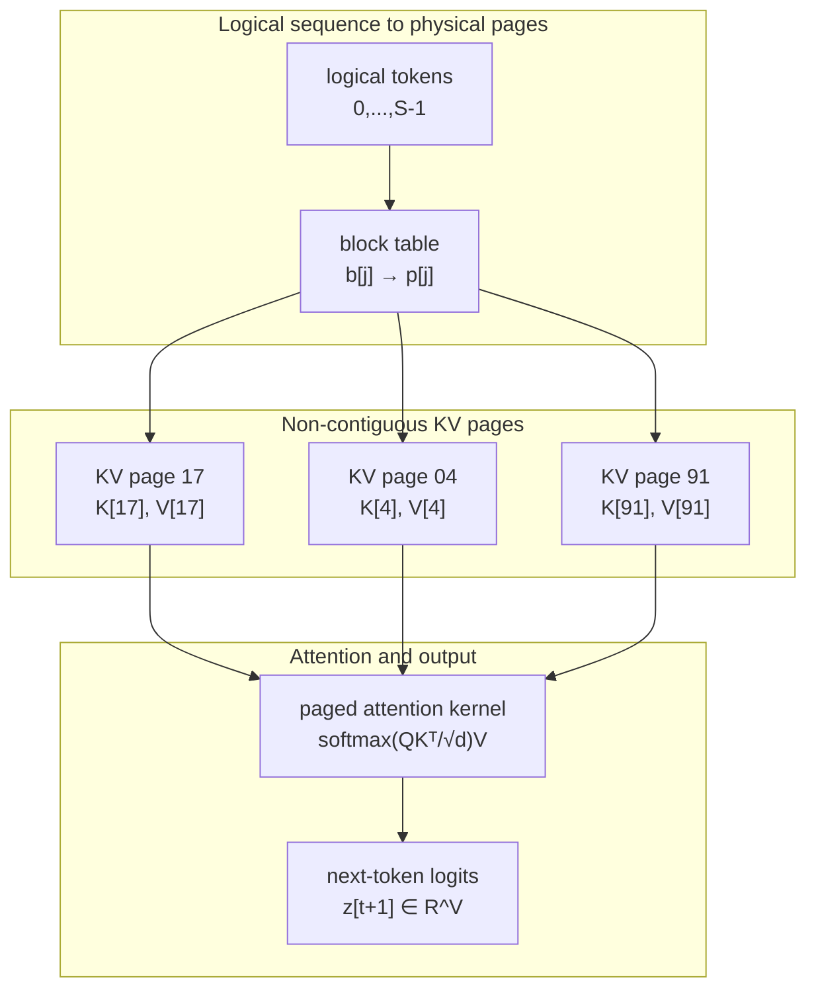

**Diagram notation key:** `b[j]` and `p[j]` map to $b_j$ and $p_j$; `K[17]` maps to $K_{17}$; `QKᵀ/√d` maps to $QK^\top/\sqrt{d}$; `z[t+1] ∈ R^V` maps to $z_{t+1} \in \mathbb{R}^{V}$.


Further reading: vLLM PagedAttention paper and docs, SGLang paged-cache docs, TensorRT-LLM KV cache docs, FlashInfer paged attention kernels, and DeepSeek-V4 SGLang cookbook notes on large-context cache layout.

### 8.4 Primitive Technique: Prefix and Radix Caching

Prefix caching reuses KV for a repeated token prefix. If a request has length $S$ and shares prefix length $h$, saved prefill time is approximately:

$$
\Delta T_{\mathrm{prefill}}
\approx
T_{\mathrm{prefill}}(S)
-
T_{\mathrm{prefill}}(S-h).
$$

$\Delta T_{\mathrm{prefill}}$ is saved latency, $T_{\mathrm{prefill}}(S)$ is prompt compute time for $S$ tokens, and $h$ is the number of cached prefix tokens. The approximation ignores cache lookup, validation, memory residency, and possible page-copy costs.

vLLM automatic prefix caching keys KV blocks by token content and prefix history. SGLang RadixAttention stores prefixes in a radix tree, which is useful for multi-turn chat, tool schemas, code agents, RAG templates, and repeated system prompts.


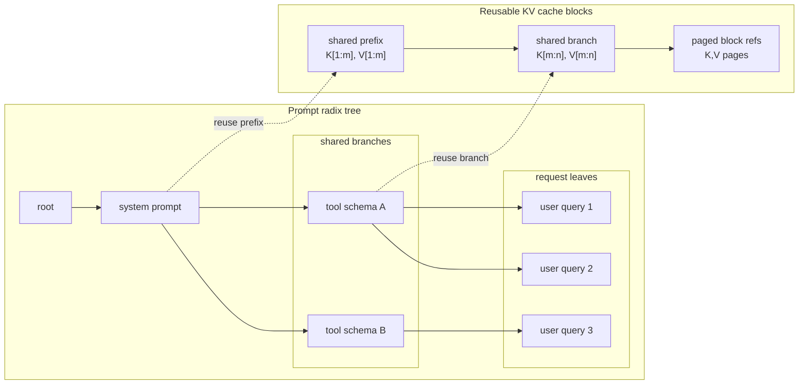

**Diagram notation key:** `K[1:m]` and `V[1:m]` map to $K_{1:m}$ and $V_{1:m}$; `K[m:n]` and `V[m:n]` map to $K_{m:n}$ and $V_{m:n}$; `m` and `n` are token positions in the shared prompt tree.


The main communication is usually avoided rather than performed: cache-aware routing sends a request to the replica that already owns the prefix pages. If a system migrates prefix pages across replicas, the payload is KV page data of shape roughly $[L, B_{\mathrm{blk}}, n_{\mathrm{kv}}/d_{\mathrm{kv}}, d_h]$ per page and the transfer is ordinary network/RDMA/NVLink movement, not an NCCL collective.

DeepSeek-V4-style hybrid attention complicates prefix caching because not all layers use one dense KV stream. Public SGLang/Miles reports describe ShadowRadix and hybrid KV/compression pools. The teaching abstraction is **logical prefix, multiple physical pools**: the scheduler sees one prefix tree, while the runtime maps it to sliding-window KV, compressed sparse attention state, heavily compressed attention state, and metadata pools.

Further reading: vLLM automatic prefix caching, SGLang RadixAttention/RadixCache, SGLang DeepSeek-V4 cookbook, and LMSYS/SGLang/Miles DeepSeek-V4 day-0 report.

### 8.5 Primitive Technique: Prefill/Decode Disaggregation

Prefill and decode stress different resources. For dense attention, a rough prefill compute model is:

$$
F_{\mathrm{prefill}}
\approx
O(L S H^2) + O(L S^2 H),
$$

while one decode step is closer to:

$$
F_{\mathrm{decode}}
\approx
O(L H^2) + O(L S H).
$$

$F$ denotes floating-point work, $L$ is layers, $S$ is context length, and $H$ is hidden width. The $S^2$ prefill term is dense attention over prompt tokens. The $S$ decode term is attention from the new token to prior KV.

Decode arithmetic intensity is low because each generated token reads model weights and KV:

$$
I_{\mathrm{decode}}
\approx
\frac{F_{\mathrm{decode}}}
{M_{\mathrm{weights\ read}} + M_{\mathrm{KV\ read}}}.
$$

$I_{\mathrm{decode}}$ is FLOPs per byte read. Batching improves weight reuse, but KV reads still grow with context length.

P/D disaggregation assigns prefill and decode to different worker pools. Prefill workers compute prompt KV, then hand it to decode workers. The handoff cost is:

$$
T_{\mathrm{handoff}}
\approx
\frac{M_{\mathrm{KV,prompt}}}{B_{\mathrm{link}}}
+
T_{\mathrm{layout\ transform}}
+
T_{\mathrm{control}}.
$$

$M_{\mathrm{KV,prompt}}$ is the prompt KV payload, $B_{\mathrm{link}}$ is effective interconnect bandwidth, $T_{\mathrm{layout\ transform}}$ is gather/scatter or format conversion time, and $T_{\mathrm{control}}$ is scheduler/control overhead. A P/D split is useful only when:

$$
T_{\mathrm{saved\ interference}}
+
T_{\mathrm{phase\ specialization}}
>
T_{\mathrm{handoff}}.
$$

The left side is time saved by preventing long prefills from blocking decode and by using phase-specialized resources. The right side is the cost of moving and reshaping state.


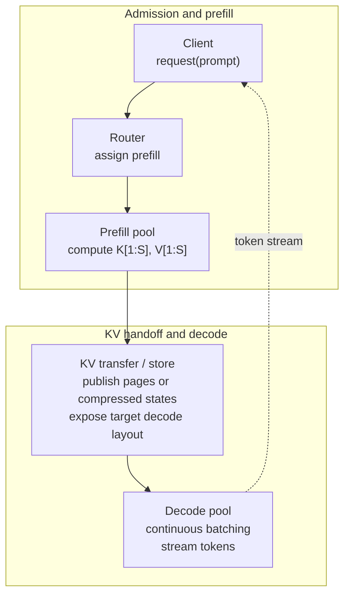

**Diagram notation key:** `K[1:S]` and `V[1:S]` map to $K_{1:S}$ and $V_{1:S}$; `S` is prompt length; `K,V` without indices denotes a KV-cache payload in the target decode layout.


The communication is not a collective in the usual training sense. It is a state transfer from producer ranks to consumer ranks. If prefill and decode use the same TP/CP layout, the transfer can copy pages directly. If they use different layouts, the runtime must gather shards into a staging layout and scatter into decode-side pages. SGLang documents heterogeneous TP staging buffers for this case, and TensorRT-LLM exposes disaggregated serving features.

Further reading: DistServe, Splitwise, TensorRT-LLM disaggregated serving, SGLang disaggregation docs, DeepSpeed-FastGen, and SGLang DeepSeek-V4 integration notes.

### 8.6 Primitive Technique: Chunked Prefill and SplitFuse

Chunked prefill splits a prompt of length $S$ into chunks of size $C$:

$$
N_{\mathrm{chunks}}
=
\left\lceil \frac{S}{C} \right\rceil .
$$

$N_{\mathrm{chunks}}$ is the number of prefill chunks and $C$ is the scheduler-chosen chunk size. The scheduler interleaves prefill chunks with decode iterations so a very long prompt does not monopolize the GPU.


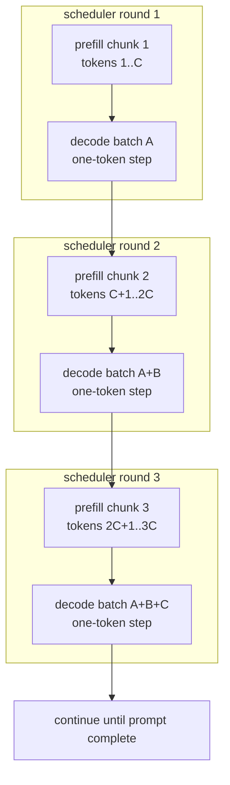

**Diagram notation key:** `C` is the chunk size from $C$ in the formula $N_{\mathrm{chunks}}=\lceil S/C\rceil$; token ranges such as `C+1..2C` are plain interval notation rather than LaTeX.


| Smaller $C$ | Larger $C$ |
|---|---|
| lower decode blocking | better prefill kernel efficiency |
| more scheduler overhead | fewer scheduling decisions |
| more metadata churn | larger TTFT spikes |
| easier latency fairness | better throughput for very long prompts |

A simple tuning rule is:

$$
T_{\mathrm{prefill\ chunk}}(C)
\le
T_{\mathrm{decode\ SLO\ slack}}.
$$

The left side is the time one chunk blocks decode work. The right side is allowed slack before decode latency violates the SLO. Chunked prefill inherits the model mesh communication of prefill: TP collectives, optional CP KV exchange, PP p2p if layers are pipelined, and EP all-to-all for MoE layers. Its new primitive is scheduling, not a new collective.

Further reading: SARATHI, DeepSpeed-FastGen Dynamic SplitFuse, TensorRT-LLM chunked context/prefill docs, and SGLang scheduling documentation.

### 8.7 Primitive Technique: Speculative and [MTP](https://arxiv.org/abs/2412.19437) (multi-token prediction) Decoding

Autoregressive decoding is serial:

$$
x_{t+1} \sim p_\theta(\cdot \mid x_{\le t}).
$$

The notation means sample token $x_{t+1}$ from the model distribution $p_\theta$ conditioned on previous tokens $x_{\le t}$. Speculative decoding creates time-axis parallelism by proposing multiple future tokens and verifying them in one target-model pass.

If $\gamma$ draft tokens are proposed and each has approximate independent acceptance probability $p$, expected accepted draft tokens per verification pass are:

$$
E[A]
\approx
\sum_{j=1}^{\gamma} p^j
=
\frac{p(1-p^\gamma)}{1-p}.
$$

$E[A]$ is expected accepted tokens, $\gamma$ is draft length, and $p$ is acceptance probability. The geometric sum assumes each later token is accepted only if all earlier draft tokens were accepted. Some algorithms also produce one extra target token when all draft tokens are accepted, adding about $p^\gamma$.

A rough speedup model is:

$$
\mathrm{speedup}
\approx
\frac{E[A] \cdot T_{\mathrm{target\ one\ token}}}
{T_{\mathrm{draft}}(\gamma) + T_{\mathrm{verify}}(\gamma) + T_{\mathrm{metadata}}}.
$$

Speculation helps when acceptance is high and draft/verification metadata overhead is low. It can hurt when the draft is inaccurate, tree attention metadata breaks CUDA Graph reuse, or KV commit/rollback becomes expensive.

| Primitive | Shape / State | Communication |
|---|---|---|
| draft proposal | candidate tokens $\hat{x}_{t+1:t+\gamma}$ | usually local to the replica |
| verification | tree/block batch of candidate positions | uses the same TP/PP/EP/CP communication as normal forward |
| acceptance mask | Boolean prefix/tree mask | local metadata, sometimes graph-captured |
| KV commit/rollback | accepted KV pages only | local page-table updates; P/D systems may transfer committed pages |

Further reading: SpecInfer, Medusa, EAGLE, DeepSeek-V3 MTP report, TensorRT-LLM speculative decoding, SGLang speculative/MTP docs, and SGLang/Miles DeepSeek-V4 report.

### 8.8 Primitive Technique: TP, PP, EP, and CP for Serving

Model-sharding axes still matter in inference, but every communication is now on a latency-sensitive online path.

| Axis | Serving Use | Communication | Shape Notes |
|---|---|---|---|
| TP | shard linears, attention heads, logits | all-reduce, reduce-scatter, all-gather over TP group | activations $[B_{\mathrm{tok}},H/t]$ or $[B_{\mathrm{tok}},H]$; logits $[B_{\mathrm{tok}},V/t]$ |
| PP | shard layer depth | p2p activation send/recv forward, p2p gradient absent in inference | prefill microbatch $[B_\mu,S_\mu,H]$; decode $[B_{\mathrm{decode}},1,H]$ |
| EP / Wide-EP | distribute MoE experts | all-to-all dispatch/combine, optional NVSHMEM/RDMA paths | token assignments $[N_{\mathrm{assign}},H]$, expert buffers $[L_e,H]$ |
| CP | split long-context attention/KV | KV all-gather, ring p2p, sparse block exchange, partial reductions | local sequence $[S/c]$; local $Q_r$, remote $K,V$ blocks |
| DP / replicas | independent request streams | no GPU collective across replicas unless cache/state is migrated | request batches and KV pages remain replica-local |

For a decode step with TP, latency can be sketched as:

$$
T_{\mathrm{decode\ step}}
\approx
T_{\mathrm{local\ GEMM}}
+
T_{\mathrm{attention\ KV}}
+
T_{\mathrm{TP\ collective}}
+
T_{\mathrm{sampling}}
+
T_{\mathrm{scheduler}}.
$$

For MoE serving:

$$
T_{\mathrm{MoE}}
\approx
T_{\mathrm{route}}
+
T_{\mathrm{alltoall\ dispatch}}
+
T_{\mathrm{grouped\ GEMM}}
+
T_{\mathrm{alltoall\ combine}}
+
T_{\mathrm{imbalance}}.
$$

For long-context CP:

$$
T_{\mathrm{attention}}
\approx
T_{\mathrm{local\ attention}}
+
T_{\mathrm{KV\ exchange\ or\ partial\ reduction}}
+
T_{\mathrm{sparse\ metadata}}.
$$

All $T$ terms are latency components. These formulas are not performance predictions; they are checklists for where latency can hide. They show why serving often chooses different prefill and decode meshes.

DeepSeek-V4 is a frontier-era example. Public sources describe a 1M-context MoE family with hybrid attention and compressed KV behavior. NVIDIA describes Blackwell-oriented deployment, SGLang documents launch recipes and P/D disaggregation, and SGLang/Miles reports ShadowRadix, HiSparse CPU-extended KV, MTP speculative decoding, FlashMLA, DeepEP-backed EP MoE, DeepGEMM/FlashInfer TRTLLM-Gen MoE paths, DP/TP/CP attention, and full DP/TP/SP/EP/PP/CP support for RL integration. These are serving and integration evidence; they should not be overread as a complete disclosure of DeepSeek's private production training mesh.

Further reading: TensorRT-LLM parallelism docs, SGLang DeepSeek-V4 cookbook, LMSYS/SGLang/Miles DeepSeek-V4 report, NVIDIA DeepSeek-V4 blog, vLLM distributed serving docs, DeepEP, DeepGEMM, FlashMLA, and FlashInfer.

### 8.9 End-to-End Serving Map


```mermaid
flowchart TB

  subgraph INTAKE["Intake and prefill path"]
    direction LR
    A["Incoming request"]
    B{"Prefix hit?"}
    B1["reuse radix/prefix<br/>K[1:m], V[1:m] blocks"]
    C["prefill or chunked prefill"]
    A --> B
    B -- "yes" --> B1
    B -- "no" --> C
  end

  subgraph HANDOFF["KV handoff"]
    direction LR
    E{"P/D disaggregated?"}
    F["transfer K,V<br/>to decode pool"]
    D["admit to decode queue"]
    E -- "yes" --> F --> D
    E -- "no" --> D
  end

  subgraph DECODE["Decode and finish loop"]
    direction LR
    G{"Speculative or MTP enabled?"}
    H["draft tokens<br/>x̂[t+1:t+k] + verify tree"]
    I["one-token decode"]
    J["commit accepted K,V pages"]
    K{"finished?"}
    L["release or retain KV for cache"]
    G -- "yes" --> H --> J
    G -- "no" --> I --> J
    J --> K
    K -- "yes" --> L
  end

  B1 --> D
  C --> E
  D --> G
  K -- "no" --> D
```

**Diagram notation key:** `K[1:m]` maps to $K_{1:m}$; `x̂[t+1:t+k]` maps to $\hat{x}_{t+1:t+k}$; `t` is the decode step and `k` is the number of proposed draft tokens.


The main serving objective is goodput:

$$
\mathrm{goodput}
=
\lambda \cdot
\Pr[\mathrm{TTFT} \le S_{\mathrm{TTFT}} \land \mathrm{TPOT} \le S_{\mathrm{TPOT}}],
$$

where $\lambda$ is arrival rate, $S_{\mathrm{TTFT}}$ is the TTFT target, $S_{\mathrm{TPOT}}$ is the TPOT target, and $\Pr[\cdot]$ is probability over the workload. Cost per token is:

$$
\mathrm{cost/token}
\approx
\frac{\mathrm{GPU\ cost/s} + \mathrm{network\ cost/s} + \mathrm{CPU/storage\ cost/s}}
{\mathrm{tokens/s}}.
$$

The numerator sums resource cost per second; the denominator is delivered token throughput. This is why raw tokens/s is not enough: a system can produce many tokens while violating TTFT/TPOT or overusing expensive KV memory and network transfer.

### 8.10 Sources and Caveats

Recent sources to continue exploring:

| Subtopic | Sources |
|---|---|
| Paged KV and continuous batching | vLLM PagedAttention paper and docs; vLLM prefix caching docs |
| Prefix/radix caching | SGLang RadixAttention/RadixCache docs; vLLM automatic prefix caching |
| P/D disaggregation | DistServe; Splitwise; TensorRT-LLM disaggregated serving; SGLang disaggregation docs |
| Chunked prefill | SARATHI; DeepSpeed-FastGen Dynamic SplitFuse; TensorRT-LLM chunked context docs |
| Speculation/MTP | SpecInfer; Medusa; EAGLE; TensorRT-LLM speculative decoding; DeepSeek-V3 MTP; SGLang DeepSeek-V4 MTP |
| Serving model parallelism | TensorRT-LLM TP/PP/EP/CP/Wide-EP docs; vLLM distributed serving; SGLang deployment docs |
| Frontier integration | DeepSeek-V4 model card/report; SGLang/Miles DeepSeek-V4 day-0 report; NVIDIA DeepSeek-V4 blog |

Inference benchmarks are workload-dependent. Prompt length distribution, output length distribution, prefix reuse, reasoning mode, context length, quantization, MoE routing entropy, cache residency, and SLO target can reverse the ranking of serving systems. Paged KV improves memory utilization but does not remove KV bandwidth. P/D disaggregation reduces prefill/decode interference but adds KV transfer and layout-conversion cost. Speculation improves latency only when acceptance is high enough. DeepSeek-V4 day-0 reports are valuable integration evidence, especially for required runtime primitives, but exact production performance and private kernel choices should be treated conservatively.

## 9. Cross-Cutting CUDA and Platform Techniques

Modern LLM parallelism is not only a high-level partitioning choice. Each parallelism family becomes practical only when several lower-level platform primitives cooperate: communication collectives move shards, CUDA streams overlap movement with compute, graph capture reduces launch overhead, low-precision formats reduce memory traffic, attention kernels control sequence scaling, GEMM kernels control tensor/expert utilization, and runtime metadata keeps dynamic workloads schedulable.

A useful mental model is:

$$
T_{\text{step}} \approx T_{\text{compute}} + T_{\text{comm}} + T_{\text{sched}} - T_{\text{overlap}}.
$$

The goal of platform work is not merely to reduce one term. It is to make the exposed, non-overlapped part small:

$$
T_{\text{exposed}}=\max(0, T_{\text{comm}}-T_{\text{hidden-by-compute}}).
$$


```mermaid
flowchart TB

  subgraph P["Platform primitives"]
    direction TB
    subgraph P0["communication and scheduling"]
      direction LR
      C["NCCL collectives"]
      O["CUDA streams and events"]
      G["CUDA Graphs"]
    end
    subgraph P1["numeric and compute kernels"]
      direction LR
      Q["FP8 / MXFP8 / FP4 scale layouts<br/>x̂ = s q"]
      A["FlashAttention / cuDNN SDPA / NSA<br/>softmax(QKᵀ/√d)V"]
      M["CUTLASS / CuTe / grouped GEMM<br/>C[i] = A[i]B[i]"]
    end
    subgraph P2["kernel authorship and progress"]
      direction LR
      S["NVSHMEM / GPU-initiated communication"]
      K["Persistent kernels / megakernels"]
      D["Triton / Pallas / TileLang / ThunderKittens"]
    end
  end

  subgraph FAM["Parallelism families"]
    direction TB
    subgraph F0["training state and layer axes"]
      direction LR
      DP["DP / FSDP / ZeRO"]
      TP["Tensor parallelism"]
      PP["Pipeline parallelism"]
    end
    subgraph F1["context, experts, and serving"]
      direction LR
      CP["Sequence / context parallelism"]
      EP["Expert / MoE parallelism"]
      INF["Inference serving"]
    end
  end

  C --> DP
  C --> TP
  C --> CP
  C --> EP
  O --> DP
  O --> TP
  O --> PP
  O --> EP
  G --> INF
  G --> EP
  Q --> DP
  Q --> TP
  Q --> EP
  Q --> INF
  A --> CP
  A --> INF
  M --> TP
  M --> EP
  S --> EP
  S --> INF
  K --> INF
  K --> EP
  D --> A
  D --> M
```

**Diagram notation key:** `x̂ = s q` maps to $\hat{x}=s q$; `QKᵀ/√d` maps to $QK^\top/\sqrt{d}$; `C[i] = A[i]B[i]` maps to $C_i=A_iB_i$; these labels name kernel-level formulas without requiring Mermaid to render LaTeX.


### 9.1 Overlap: Streams, Events, Buckets, and Progress

Overlap is the primitive that turns an expensive collective into a tolerable one. CUDA streams allow compute kernels, copies, and communication kernels to be queued independently. CUDA events express dependencies without forcing global synchronization.

A typical overlapped pattern is:

1. Split a tensor into buckets.
2. Launch compute for bucket $i$.
3. Record an event when bucket $i$ becomes ready.
4. Make a communication stream wait on that event.
5. Launch reduce-scatter, all-gather, all-to-all, or point-to-point work.
6. Continue compute for bucket $i+1$ while bucket $i$ communicates.

The simplest explicit form is a stream-level ping-pong schedule. Two buffers alternate roles: the compute stream consumes one slot while a communication or copy stream fills, sends, or reduces the other slot. Events publish readiness and release, so neither stream overwrites a slot that is still live.

```mermaid
flowchart LR

  subgraph T0["time t"]
    C0["compute stream<br/>consume buf0"]
    M1["comm/copy stream<br/>fill or send buf1"]
  end

  subgraph T1["time t+1"]
    C1["compute stream<br/>consume buf1"]
    M0["comm/copy stream<br/>fill or send buf0"]
  end

  C0 -->|"event: buf0 free"| M0
  M1 -->|"event: buf1 ready"| C1
  C0 -.-> C1
  M1 -.-> M0
```

**Diagram notation key:** `time t` maps to logical overlap step $t$; `buf0` and `buf1` map to reusable slots $B_0$ and $B_1$; `consume` means a kernel reads the slot; `fill or send` means a copy, collective, or p2p operation writes or transfers the slot; event labels map to CUDA event dependencies.

| Aspect | CUDA-stream ping-pong | Native GPU-side ping-pong |
|---|---|---|
| Scheduler | Host queues kernels, copies, and collectives on multiple CUDA streams. | Resident kernel or device scheduler alternates slots internally. |
| Synchronization | CUDA events and stream waits order slot ready/free transitions. | Memory barriers, counters, semaphores, or shared scheduler state order slot ready/free transitions. |
| Useful granularity | Coarse buckets, PP boundaries, FSDP shards, NCCL collectives, DeepEP dispatch/combine chunks. | Fine tiles, persistent-kernel tasks, TMEM/shared-memory pages, subgraph states, in-kernel peer-buffer fragments. |
| Best examples | PP activation sends, gradient reduce-scatter buckets, parameter all-gather prefetch, expert all-to-all overlap. | FlashAttention-3/4 tile pipelines, DeepGEMM Mega MoE, Hazy megakernels, Mirage MPK. |
| Main risk | Bucket too small to reach bandwidth, or too large to hide latency; communication kernels may steal SMs from compute. | Deadlock or poor progress if all resident workers wait, plus larger shared-memory/register/SM budgets. |

The native form is covered in the GPU-kernel authoring paper as a persistent-kernel primitive. From the distributed-runtime view, the decision is whether the overlap boundary is naturally host-visible, such as a PP send or FSDP bucket, or naturally tile/subgraph-local, such as an attention pipeline or megakernel task queue.

The primitive tradeoff is bucket size. Large buckets improve bandwidth efficiency but delay the first communication. Small buckets expose less latency hiding and increase scheduling overhead. For FSDP this affects parameter prefetch and gradient reduction. For async tensor parallelism it affects when partial activations can be consumed. For DeepEP-style expert routing it affects how token dispatch and expert GEMMs overlap. For pipeline parallelism it affects whether stage-boundary sends sit on the critical path.

Overlap is not automatic. It requires independent work. If a kernel consumes the all-gather result immediately, the communication remains exposed. If a collective uses too many SMs, it can reduce the compute it is supposed to overlap. Libraries such as NCCL, DeepEP, Megatron-Core, TorchTitan, and TensorRT-LLM therefore expose or tune stream placement, hook timing, communication bucket size, and sometimes the number of SMs reserved for communication.

### 9.2 CUDA Graphs and Static Metadata

CUDA Graphs reduce CPU launch overhead by recording a sequence of GPU operations and replaying it. This is especially valuable for inference decode, where each token step may contain many small kernels and collectives. The primitive requirement is that the graph structure, memory addresses, and many shapes remain stable across replays.

The usual serving trick is to make dynamic state appear static. The scheduler allocates fixed-size metadata buffers for block tables, sequence lengths, routing masks, expert counts, or speculative decoding trees. Each replay updates buffer contents but not buffer addresses. This makes CUDA Graphs compatible with continuous batching, paged KV cache, and masked grouped GEMM.

MoE and long-context inference stress graph capture because routing and sequence lengths change each step. Masked grouped GEMM, static maximum expert slots, radix/prefix cache indirection, and in-graph metadata preparation are all primitive techniques for keeping the captured graph stable while the logical workload remains dynamic. SGLang/Miles reports this pattern for DeepSeek-V4 MTP decoding and hybrid attention support, while TensorRT-LLM and vLLM use related graph-safe metadata patterns for decode.

### 9.3 Low Precision as Payload Plus Scale Layout

Low precision is a distributed systems primitive, not merely a dtype. A quantized tensor consists of payload values plus scale metadata. For a block $b$:

$$
s_b = \frac{\max_{i \in b}|x_i|}{q_{\max}}
$$

$$
q_i = \operatorname{clip}\left(\operatorname{round}\left(\frac{x_i}{s_b}\right), q_{\min}, q_{\max}\right)
$$

$$
\hat{x}_i = s_b q_i.
$$

The communication volume becomes:

$$
V_{\text{quantized}} = |X| \cdot \frac{b_q}{8} + |S| \cdot \frac{b_s}{8},
$$

where $b_q$ is payload bit width, $b_s$ is scale bit width, and $|S|$ depends on whether scales are per tensor, per channel, per row, per column, or per block.

This scale layout interacts directly with parallelism. Tensor parallelism may shard the same matrix dimension that a scale layout wants to group. Expert parallelism may use different scale blocks per expert. FSDP may need to all-gather quantized weights and the corresponding scales. FP8 delayed scaling requires amax history and scale updates. MXFP8 and NVFP4-style block scaling require the receiver to understand the block geometry. COAT extends the same principle to compressed optimizer states and activations.

The primitive lesson is: every quantized collective must define both payload placement and scale placement. A mismatch can silently destroy accuracy or force dequantization before communication, losing most of the intended benefit.

### 9.4 Attention Kernels: FlashAttention, cuDNN SDPA, NSA, and FlashMLA

Attention kernels determine whether context parallelism and long-context serving are feasible. Naive attention materializes the score matrix $QK^\top$, whose size is $O(S^2)$. FlashAttention-style kernels avoid writing the full score matrix to HBM by streaming K/V tiles and maintaining a numerically stable online softmax.

For one query block and a stream of key blocks, the running softmax update is:

$$
m_j = \max(m_{j-1}, \max(\ell_j))
$$

$$
l_j = e^{m_{j-1}-m_j}l_{j-1} + \sum_k e^{\ell_{j,k}-m_j}
$$

$$
O_j =
\frac{
e^{m_{j-1}-m_j}l_{j-1}O_{j-1} + \sum_k e^{\ell_{j,k}-m_j}V_{j,k}
}{l_j}.
$$

The relevant performance lens is arithmetic intensity:

$$
AI = \frac{\text{FLOPs}}{\text{HBM bytes}}.
$$

FlashAttention raises effective arithmetic intensity by keeping intermediate attention state on chip. FlashAttention-3 and FlashAttention-4 add hardware-specific pipeline work for Hopper and Blackwell, including asynchronous data movement, low-precision paths, and attention pipeline restructuring. cuDNN [SDPA](https://docs.pytorch.org/docs/stable/generated/torch.nn.functional.scaled_dot_product_attention.html) (scaled dot-product attention) gives a vendor-supported attention primitive; cuDNN Native Sparse Attention and public Native Sparse Attention work add sparse block metadata. FlashMLA specializes attention for MLA-style architectures.

For context parallelism, these kernels are nested inside distributed K/V exchange. The primitive decomposition is: local tiled attention, distributed movement of K/V or partial outputs, sparse or ragged metadata handling, and final reduction or concatenation. Long-context models such as DeepSeek-V4 make this more complex because hybrid attention creates multiple logical attention paths and KV pools.

### 9.5 CUTLASS, CuTe, GEMM, and Grouped Expert Compute

Most transformer compute reduces to GEMM-like primitives. For a matrix multiply $C=AB$, the arithmetic intensity is roughly:

$$
AI_{\text{GEMM}} = \frac{2MNK}{b(MK + KN + MN)}
$$

where $b$ is bytes per element. Larger $M,N,K$ generally improve tensor-core utilization; many small GEMMs are less efficient.

Tensor parallelism creates smaller local GEMMs. Expert parallelism creates many variable-size GEMMs. The grouped-GEMM primitive addresses this by launching a single kernel or coordinated kernel family over many expert matmuls:

$$
Y_e = X_e W_e,\quad e \in \{1,\dots,E\}
$$

$$
\sum_e |X_e| = T_{\text{tokens}}.
$$

The implementation first routes tokens, builds expert histograms, permutes tokens into expert-contiguous buffers, runs grouped GEMM, and then combines results back to token order. MegaBlocks expresses dropless MoE as block-sparse computation. DeepGEMM exposes FP8/FP4 grouped GEMM paths and Mega MoE fused paths. [CUTLASS](https://docs.nvidia.com/cutlass/) (CUDA Templates for Linear Algebra Subroutines) and [CuTe](https://docs.nvidia.com/cutlass/media/docs/cpp/cute/01_layout.html) (CUTLASS tensor layout algebra) provide the layout algebra and hardware primitives needed for tensor-core-friendly tiling, including Hopper/Blackwell-era features such as [WGMMA](https://docs.nvidia.com/cuda/parallel-thread-execution/#asynchronous-warpgroup-level-matrix-instructions-wgmma) (warpgroup matrix multiply-accumulate), [TMA](https://docs.nvidia.com/cutlass/media/docs/cpp/cute/0z_tma_tensors.html) (Tensor Memory Accelerator), [UMMA](https://docs.nvidia.com/cutlass/media/docs/cpp/blackwell_functionality.html) (Blackwell universal matrix multiply-accumulate), and [TMEM](https://docs.nvidia.com/cutlass/media/docs/cpp/blackwell_functionality.html) (tensor memory) abstractions.

The primitive lesson is that EP performance is not just all-to-all bandwidth. It is the combined efficiency of token permutation, grouped GEMM shape selection, low-precision scale layout, and dispatch/combine overlap.

### 9.6 NVSHMEM, GPU-Initiated Communication, and Persistent Kernels

NCCL-style collectives are host-orchestrated or library-orchestrated communication phases. [NVSHMEM](https://docs.nvidia.com/nvshmem/) (NVIDIA OpenSHMEM implementation) exposes a partitioned global address space and GPU-initiated put/get operations. This matters when communication decisions are data-dependent or latency-sensitive, as in MoE dispatch, decode-time expert routing, and persistent kernels.

Persistent kernels keep work resident on the GPU instead of launching a fresh kernel for every small operation. A persistent kernel may maintain work queues, semaphores, barriers, or communication state on GPU. In the ideal case, it reduces:

$$
T_{\text{sched}} = N_{\text{launches}} \cdot T_{\text{launch}}
$$

by replacing many launches with one resident program.

The hard part is correctness and occupancy. A persistent kernel must reserve enough SMs to make progress while leaving enough capacity for compute. It also needs careful synchronization so that communication progress, token routing, and GEMM work do not deadlock. Hazy Megakernels, Mirage [MPK](https://github.com/mirage-project/mirage) (persistent-kernel runtime), DeepGEMM Mega MoE, and DeepEP-style low-latency paths are evidence that frontier systems are moving toward fused distributed subgraphs, but full training backward through persistent distributed kernels remains emerging.

### 9.7 Kernel Authoring DSLs: Triton, Pallas, TileLang, and ThunderKittens

Kernel DSLs are implementation vehicles for the primitives above. Triton gives Python-level control over program instances, blocks, masks, and memory movement. JAX Pallas provides a JAX-native kernel path. TileLang focuses on composable tiled programming for AI kernels. ThunderKittens exposes warp-group and tensor-core oriented building blocks for research kernels. Liger-Kernel and Apex provide focused fused kernels such as loss, normalization, and optimizer components.

These systems matter to parallelism because they shorten the path from a new distributed idea to a tuned local primitive. Dynamic context parallelism needs ragged attention kernels. MoE needs grouped and masked grouped GEMMs. Vocabulary parallelism benefits from fused loss and logit handling. Low precision needs scale-aware matmul and communication-adjacent kernels.

They are not, by themselves, evidence that a parallelism strategy works at scale. A kernel DSL proves that a local primitive can be expressed and optimized; the distributed claim still requires end-to-end evidence about communication, scheduling, topology, convergence, and serving latency.

## 10. Frontier Model and Runtime Case Studies

### 10.1 DeepSeek-V3: MoE, FP8, DualPipe, and Expert Overlap

DeepSeek-V3 is the strongest public case study for training-time co-design among architecture, precision, pipeline scheduling, and expert parallelism. Its important systems pattern is:

$$
P_{\text{active}} \ll P_{\text{total}}.
$$

Sparse MoE reduces per-token compute by activating only selected experts, but it creates routing and all-to-all traffic. For each token $t$, the router chooses:

$$
E_t = \operatorname{topk}(g_t),
$$

where $g_t$ are router scores. The system then dispatches token representations to expert ranks, runs expert GEMMs, and combines results.

DeepSeek-V3 combines this sparse architecture with FP8 training, MLA-style attention, auxiliary-loss-free load balancing, DualPipe pipeline scheduling, and communication overlap. The public DeepSeek repositories for DeepSeek-V3, DualPipe, DeepEP, DeepGEMM, and FlashMLA expose the primitive decomposition: expert dispatch/combine, grouped low-precision GEMM, attention kernels, and pipeline schedule machinery.

From the parallelism perspective, V3's central lesson is that MoE scaling is not "EP plus a router." It is EP plus load balancing, all-to-all overlap, grouped GEMM, low-precision scale policy, and a pipeline schedule that hides as much communication as possible.

### 10.2 DeepSeek-V4: Hybrid Attention, mHC, FP4 Experts, and Serving Layout

DeepSeek-V4 should be treated with an evidence hierarchy. The official model card is architecture evidence. NVIDIA's DeepSeek-V4 Blackwell blog is platform and endpoint evidence. The SGLang/Miles Day-0 report is third-party runtime integration evidence. Exact DeepSeek production training kernels remain undisclosed unless present in official DeepSeek reports or repositories.

The official card describes DeepSeek-V4-Pro as a 1.6T-parameter MoE with 49B active parameters and DeepSeek-V4-Flash as a 284B-parameter MoE with 13B active parameters, both supporting 1M context. It reports hybrid attention using Compressed Sparse Attention and Heavily Compressed Attention, plus mixed precision where instruct checkpoints use FP4 expert parameters and FP8 for most other parameters.

| V4 Feature | Primitive Techniques | Parallelism Consequence |
|---|---|---|
| 1M context | sparse attention metadata, compressed KV layout, FlashMLA/SDPA-like kernels | requires CP, KV-cache paging, prefix-cache indirection, and long-context scheduling |
| CSA/HCA hybrid attention | multiple attention paths and compression states | KV cache is no longer one uniform tensor; serving needs separate physical pools |
| [mHC](https://arxiv.org/abs/2512.24880) (manifold-constrained hyper-connections) residual structure | extra residual streams across layer boundaries | PP stage boundaries may carry higher-rank tensors such as `[seq, batch, hc_mult, hidden]` |
| FP4 expert weights | payload-plus-scale layout, grouped GEMM, Blackwell-friendly kernels | EP serving becomes scale-layout-sensitive |
| MTP speculative decoding | draft/verify tree, graph-safe metadata | adds time-step parallelism during autoregressive decode |
| ShadowRadix / HiSparse | virtual prefix index mapped to physical KV pools | prefix caching becomes architecture-aware rather than simple token-prefix reuse |

SGLang/Miles reports support for DP/TP/SP/EP/PP/CP, EP MoE on DeepEP, FlashInfer [TRTLLM-Gen](https://nvidia.github.io/TensorRT-LLM/) (TensorRT-LLM generation path) fused MoE, DeepGEMM Mega MoE, TileLang mHC, PD disaggregation, and FP8 RL training paths. These are strong public signals about the runtime primitives required for DeepSeek-V4-like models, but they should not be overread as a complete disclosure of DeepSeek's private training stack.

### 10.3 Meta Llama 3 and TorchTitan: Dense Hybrid Parallelism

The Llama 3 Herd paper and TorchTitan represent the dense-model path. Dense models do not have expert routing or MoE all-to-all, so the scaling burden falls more heavily on FSDP/ZeRO-style state sharding, tensor parallelism, pipeline parallelism, context parallelism, activation checkpointing, and low precision.

TorchTitan's value is that it exposes these mechanisms in a PyTorch-native stack: FSDP2 for state sharding, TP for intra-layer matrix partitioning, PP and zero-bubble scheduling for layer partitioning, CP for long context, Float8 for reduced memory traffic, and distributed checkpointing for reshardable model state. The primitive split is therefore cleaner than in MoE systems:

$$
\text{dense scale} = \text{state sharding} + \text{TP GEMM} + \text{PP schedule} + \text{CP attention} + \text{precision policy}.
$$

The important lesson is that dense models still need hybrid mesh parallelism. Removing EP simplifies routing, but it does not remove the need to coordinate collectives, overlap, checkpointing, graph capture constraints, and topology-aware placement.

### 10.4 Qwen, Kimi, and Open MoE Directions

Qwen2/Qwen3 and Qwen3-Next show that hybrid dense/MoE architectures, long context, and inference-time efficiency are broad trends rather than DeepSeek-specific choices. NVIDIA's Qwen3-Next platform discussion emphasizes accelerated parallel processing across NVIDIA systems, while public Qwen reports show continued movement toward model families where deployment recipes matter as much as parameter count.

Kimi K2 adds another recent open MoE case. The Kimi K2 report and MoonshotAI/Kimi-K2 repository describe a 1T-total-parameter MoE model with 32B active parameters and MuonClip optimization. From this paper's perspective, the main relevance is not its benchmark ranking; it is the convergence of MoE scale, optimizer stability, and open-weight deployment pressure. Large open MoE models force serving stacks to solve expert placement, grouped GEMM, KV-cache layout, tensor/expert parallel composition, and low-precision kernels in public.

### 10.5 Google Pathways, GSPMD, and MaxText: Compiler-Mesh Parallelism

Google's Pathways/GSPMD/MaxText line represents a different abstraction boundary. Instead of exposing every collective manually, the user or framework specifies sharding over a logical mesh and the compiler inserts communication.

For a tensor $X$ and mesh axes $d,t,p,c,e$, a sharding annotation can be viewed as:

$$
\operatorname{shard}(X) = \{ \text{tensor dimension} \rightarrow \text{mesh axis} \}.
$$

The compiler then lowers local operations and collectives. This is powerful when shapes are static and model code remains compiler-visible. It is harder when the workload depends on dynamic token routing, custom CUDA kernels, highly dynamic serving batches, or hand-scheduled pipeline overlap.

MaxText is useful because it provides an open reference for JAX/XLA-style composition of DP/FSDP, TP, PP, CP, EP, quantization, checkpointing, and model-family support. The primitive lesson is that mesh compilers and hand-tuned CUDA systems are converging on the same substrate: tensor placement, collective insertion, low-precision layout, and runtime scheduling.

## 11. Source Carryover From The GPU-Kernel Paper

The GPU-kernel paper's source inventory should be carried over only when a source informs distributed execution, parallelism, communication overlap, low-precision layout, attention/KV parallelism, expert routing, or platform support. Kernel-generation and coding-agent sources are out of scope unless the paper later adds an appendix about implementation workflows.

| Source Group | Carryover Decision | Why It Belongs Or Does Not Belong |
|---|---|---|
| DeepSeek-V4 official model card, NVIDIA DeepSeek-V4 blog, SGLang/Miles Day-0 report | Carry over | Directly relevant to MoE, 1M context, hybrid attention, FP4/FP8 precision, ShadowRadix, P/D disaggregation, MTP, EP, CP, and Blackwell serving. |
| DeepSeek-V3 report, DeepSeek-V3 repo, DualPipe, DualPipeV, DeepEP, DeepGEMM, FlashMLA | Carry over | Core evidence for PP/EP overlap, expert communication, grouped GEMM, MLA attention, low-precision training, and fused MoE execution. |
| FlashAttention-3, FlashAttention-4, cuDNN SDPA, cuDNN NSA, Native Sparse Attention | Carry over | Attention kernels determine CP feasibility, sparse attention layout, KV-cache pressure, and long-context serving cost. |
| Transformer Engine FP8/MXFP8/NVFP4 docs, CUTLASS/CuTe, CUDA, NCCL, NVSHMEM | Carry over | These define the platform contracts for low precision, tensor-core layout, collectives, GPU-initiated communication, and Blackwell-era kernel design. |
| COAT, Muon/Megatron optimizer work, Kimi K2 MuonClip, mHC, Dynamic Context Parallelism | Carry over | These affect optimizer state sharding, scale synchronization, convergence stability, PP boundary tensors, and variable-length CP scheduling. |
| Liger-Kernel, Apex fused kernels, NeMo/Megatron Bridge, PyTorch activation checkpointing | Carry over as supporting sources | Relevant to fused loss/norm/optimizer paths, activation recomputation, communication overlap, and vocab or PP edge bottlenecks. |
| TileLang, Triton, Pallas, ThunderKittens | Carry over as implementation vehicles | They explain how new tiled attention, grouped GEMM, mHC, and sparse kernels are authored, but they are not themselves proof of distributed scalability. |
| MegaScale, Hazy Megakernels, Mirage MPK | Carry over | Relevant to operational large-scale training, persistent kernels, megakernel scheduling, and reducing launch or communication bubbles. |
| KernelBench, GPU Kernel Scientist, CudaForge, Claude/Codex kernel-writing docs, generic coding-agent papers | Out of scope for the main paper | These are workflow or code-generation sources. They may help future engineers write kernels, but they do not establish a parallelism algorithm, runtime topology, or distributed execution result. |

The boundary is evidence-based. A source belongs in the main paper if it changes how tensors are partitioned, moved, scheduled, quantized, cached, or computed across ranks. A source belongs only in an appendix if it changes how humans or agents write kernels.

## 12. Open Problems and Evidence Boundaries

### 12.1 Unresolved Technical Questions

| Open Problem | Why It Matters | Current Boundary |
|---|---|---|
| Exact DeepSeek-V4 training mesh | V4 combines MoE, 1M context, hybrid attention, mHC, and mixed precision; the optimal DP/TP/PP/CP/EP mesh is central to reproducibility. | Public evidence gives architecture and integration details, not a full production mesh. |
| CP plus sparse attention composition | Sparse attention reduces work, while CP splits sequence work across ranks. Their combination changes metadata, load balance, and backward communication. | cuDNN NSA, Native Sparse Attention, FlashMLA, and Dynamic CP are public, but full model-specific training schedules vary. |
| Low-precision convergence under sharding | FP8/MXFP8/FP4 reduce bandwidth, but scale synchronization and sensitive paths affect convergence. | Transformer Engine, COAT, DeepSeek-V3, and DeepSeek-V4 provide evidence; safe policies remain model-specific. |
| MoE all-to-all overlap guarantees | EP performance depends on hiding dispatch/combine behind useful compute. | DeepEP and DualPipe-style systems expose techniques, but overlap depends on shapes, routing entropy, topology, and SM reservation. |
| CUDA Graphs with dynamic routing | Serving wants graph replay; MoE, CP, and speculative decoding are dynamic. | Masked grouped GEMM and static metadata buffers help, but graph-safe dynamic scheduling remains complex. |
| Persistent kernels for training backward | Megakernels reduce launch overhead and can schedule work on GPU. | Public evidence is strongest for inference or training-adjacent subgraphs; full distributed backward remains emerging. |
| Portability across Hopper, Blackwell, AMD, TPU, and NPU | Frontier kernels increasingly rely on architecture-specific memory and tensor-core behavior. | DSLs improve portability, but peak FA4/DeepGEMM-class performance is hardware-specific. |
| Serving benchmark comparability | Throughput depends on prompt mix, output length, cache hit rate, quantization, SLO, batching, and hardware. | Day-0 reports are valuable integration evidence, not final universal rankings. |

### 12.2 The Main Boundary

The strongest conclusion supported by public evidence is that frontier LLM systems are converging on hybrid parallelism plus platform co-design:

$$
\text{frontier efficiency} =
f(\text{mesh placement}, \text{collectives}, \text{overlap}, \text{precision}, \text{kernel layout}, \text{runtime scheduling}).
$$

The weaker conclusion, which should remain labeled as inference, is any claim about an undisclosed lab's exact production kernel, mesh, schedule, or convergence recipe.

## 13. Conclusion

Parallelism in frontier LLM systems is best understood as a set of coupled placement decisions. DP/FSDP places model states over data ranks. TP places matrices and heads over fast local groups. PP places layers over time and depth. CP places context tokens over attention groups. EP places sparse experts and routed tokens over all-to-all domains. Inference places requests, KV pages, prefixes, prefill, decode, and speculative branches over a serving cluster.

Recent systems show three durable trends. First, parallelism is increasingly dynamic: CP size can vary per microbatch; serving batches are continuous; speculative decoding changes work per step; expert routing changes work per layer. Second, parallelism is increasingly low precision: FP8, MXFP8, NVFP4, and FP4 expert weights make communication and HBM layout part of the algorithm. Third, parallelism is increasingly kernel-coupled: FlashAttention-4, DeepGEMM, DeepEP, TensorRT-LLM, SGLang, and Megatron-Core all show that a distributed schedule only wins when local CUDA kernels, communication paths, and runtime metadata are co-designed.

The practical research agenda is therefore not to pick a single parallelism family, but to build systems that can search and enforce a correct mesh over data, hidden dimensions, layers, context, experts, and request state while preserving numerical stability and hardware utilization.

## Bibliography and Source Notes

### Recent Training, Parallelism, and Runtime Systems

- DeepSeek-AI, "DeepSeek-V3 Technical Report," arXiv:2412.19437, 2024/2025. https://arxiv.org/abs/2412.19437
- DeepSeek-AI, `DeepSeek-V3` repository. https://github.com/deepseek-ai/DeepSeek-V3
- DeepSeek-AI, `DualPipe` repository. https://github.com/deepseek-ai/DualPipe
- DeepSeek-AI, `DeepEP`: expert-parallel communication library. https://github.com/deepseek-ai/DeepEP
- DeepSeek-AI, `DeepGEMM`: FP8/FP4 GEMM and Mega MoE kernels. https://github.com/deepseek-ai/DeepGEMM
- DeepSeek-AI, `FlashMLA` optimized MLA attention repository. https://github.com/deepseek-ai/FlashMLA
- DeepSeek-AI, "DeepSeek-V4: Towards Highly Efficient Million-Token Context Intelligence," official model card/report. https://huggingface.co/deepseek-ai/DeepSeek-V4-Pro
- NVIDIA Technical Blog, "Build with DeepSeek V4 Using NVIDIA Blackwell and GPU-Accelerated Endpoints," 2026. https://developer.nvidia.com/blog/build-with-deepseek-v4-using-nvidia-blackwell-and-gpu-accelerated-endpoints/
- LMSYS/SGLang/Miles, "DeepSeek-V4 on Day 0: From Fast Inference to Verified RL with SGLang and Miles," 2026. https://www.lmsys.org/blog/2026-04-25-deepseek-v4/
- NVIDIA Megatron-Core developer information and parallelism guide. https://developer.nvidia.com/megatron-core and https://docs.nvidia.com/megatron-core/developer-guide/latest/user-guide/parallelism-guide.html
- NVIDIA/Megatron-LM repository. https://github.com/NVIDIA/Megatron-LM
- Deepak Narayanan et al., "Efficient Large-Scale Language Model Training on GPU Clusters Using Megatron-LM," SC 2021 / arXiv:2104.04473. https://arxiv.org/abs/2104.04473
- PyTorch/TorchTitan repository and paper. https://github.com/pytorch/torchtitan and https://huggingface.co/papers/2410.06511
- PyTorch FSDP/FSDP2 documentation. https://docs.pytorch.org/docs/stable/fsdp.html
- PyTorch FSDP2 tutorial and `fully_shard` API documentation. https://docs.pytorch.org/tutorials/intermediate/FSDP_tutorial.html and https://docs.pytorch.org/docs/2.8/distributed.fsdp.fully_shard.html
- PyTorch `torch.distributed.pipelining` documentation. https://docs.pytorch.org/docs/2.9/distributed.pipelining.html
- PyTorch Forum, "Introducing Async Tensor Parallelism in PyTorch," 2024. https://discuss.pytorch.org/t/distributed-w-torchtitan-introducing-async-tensor-parallelism-in-pytorch/209487
- PyTorch Forum, "Training with Zero-Bubble Pipeline Parallelism," 2024. https://discuss.pytorch.org/t/distributed-w-torchtitan-training-with-zero-bubble-pipeline-parallelism/214420
- PyTorch Forum, "Enabling Float8 All-Gather in FSDP2," 2024. https://discuss.pytorch.org/t/distributed-w-torchtitan-enabling-float8-all-gather-in-fsdp2/209323
- DeepSpeed repository and documentation. https://github.com/deepspeedai/DeepSpeed and https://deepspeed.readthedocs.io/
- DeepSpeed ZeRO documentation. https://deepspeed.readthedocs.io/en/stable/zero3.html
- DeepSpeed ZeRO++ tutorial. https://www.deepspeed.ai/tutorials/zeropp/
- Guanhua Wang et al., "ZeRO++: Extremely Efficient Collective Communication for Large Model Training," ICLR 2024. https://www.microsoft.com/en-us/research/publication/zero-extremely-efficient-collective-communication-for-large-model-training/
- Samyam Rajbhandari et al., "ZeRO-Infinity: Breaking the GPU Memory Wall for Extreme Scale Deep Learning," SC 2021. https://www.microsoft.com/en-us/research/publication/zero-infinity-breaking-the-gpu-memory-wall-for-extreme-scale-deep-learning/
- Ziheng Jiang et al., "MegaScale: Scaling Large Language Model Training to More Than 10,000 GPUs," arXiv:2402.15627, 2024. https://arxiv.org/abs/2402.15627
- NVIDIA Technical Blog, "Speeding Up Variable-Length Training with Dynamic Context Parallelism and NVIDIA Megatron Core," 2026. https://developer.nvidia.com/blog/speeding-up-variable-length-training-with-dynamic-context-parallelism-and-nvidia-megatron-core/
- Hugging Face/Nanotron, "The Ultra-Scale Playbook: Training LLMs on GPU Clusters," 2025. https://nanotron-ultrascale-playbook.static.hf.space/index.html

### Pipeline Parallelism

- Penghui Qi et al., "Zero Bubble Pipeline Parallelism," ICLR 2024 / arXiv:2401.10241. https://arxiv.org/abs/2401.10241
- Sea AI Lab, "Zero Bubble Pipeline Parallelism" blog and repository. https://sail.sea.com/blog/articles/56 and https://github.com/sail-sg/zero-bubble-pipeline-parallelism
- Penghui Qi et al., "Pipeline Parallelism with Controllable Memory," NeurIPS 2024. https://sail.sea.com/research/publications/57
- Sea AI Lab, "Pipeline Parallelism with Controllable Memory," 2025. https://sail.sea.com/blog/articles/57
- Xinyi Wan et al., "PipeOffload: Improving Scalability of Pipeline Parallelism with Memory Optimization," 2025. https://sail.sea.com/research/publications/70
- Man Tsung Yeung et al., "Balancing Pipeline Parallelism with Vocabulary Parallelism," MLSys 2025. https://sail.sea.com/research/publications/69
- Sea AI Lab, "DualPipe could be better without the Dual," 2025. https://sail.sea.com/blog/articles/63
- Yanping Huang et al., "GPipe: Efficient Training of Giant Neural Networks using Pipeline Parallelism," NeurIPS 2019. https://arxiv.org/abs/1811.06965
- Deepak Narayanan et al., "PipeDream: Generalized Pipeline Parallelism for DNN Training," SOSP 2019 / arXiv:1806.03377. https://arxiv.org/abs/1806.03377

### Sequence, Context, and Attention Parallelism

- NVIDIA Megatron-Core context parallelism documentation. https://docs.nvidia.com/megatron-core/developer-guide/latest/user-guide/features/context_parallel.html
- Sam Ade Jacobs et al., "DeepSpeed Ulysses: System Optimizations for Enabling Training of Extreme Long Sequence Transformer Models," 2023. https://www.microsoft.com/en-us/research/publication/deepspeed-ulysses-system-optimizations-for-enabling-training-of-extreme-long-sequence-transformer-models/
- Hao Liu, Matei Zaharia, Pieter Abbeel, "Ring Attention with Blockwise Transformers for Near-Infinite Context," ICLR 2024 / arXiv:2310.01889. https://arxiv.org/abs/2310.01889
- Jiarui Fang and Shangchun Zhao, "A Unified Sequence Parallelism Approach for Long Context Generative AI," arXiv:2405.07719, 2024. https://arxiv.org/abs/2405.07719
- DeepSeek-AI, "DeepSeek-V2: A Strong, Economical, and Efficient Mixture-of-Experts Language Model," arXiv:2405.04434, 2024. https://arxiv.org/abs/2405.04434
- Tri Dao et al., "FlashAttention: Fast and Memory-Efficient Exact Attention with IO-Awareness," arXiv:2205.14135, 2022. https://arxiv.org/abs/2205.14135
- Tri Dao, "FlashAttention-2: Faster Attention with Better Parallelism and Work Partitioning," arXiv:2307.08691, 2023. https://arxiv.org/abs/2307.08691
- Jay Shah et al., "FlashAttention-3: Fast and Accurate Attention with Asynchrony and Low-precision," arXiv:2407.08608, 2024. https://arxiv.org/abs/2407.08608
- Ted Zadouri et al., "FlashAttention-4: Algorithm and Kernel Pipelining Co-Design for Asymmetric Hardware Scaling," arXiv:2603.05451, 2026. https://arxiv.org/abs/2603.05451
- Dao-AILab, `flash-attention` repository and FA4 blog. https://github.com/Dao-AILab/flash-attention and https://tridao.me/blog/2026/flash4/
- PyTorch, "FlexAttention + FlashAttention-4: Fast and Flexible Attention," 2026. https://pytorch.org/blog/flexattention-flashattention-4-fast-and-flexible/
- NVIDIA cuDNN Frontend attention and Native Sparse Attention APIs. https://docs.nvidia.com/deeplearning/cudnn/frontend/latest/operations/Attention.html and https://docs.nvidia.com/deeplearning/cudnn/frontend/latest/fe-oss-apis/nsa.html

### MoE and Expert Parallelism

- Damai Dai et al., "DeepSeekMoE: Towards Ultimate Expert Specialization in Mixture-of-Experts Language Models," arXiv:2401.06066, 2024. https://arxiv.org/abs/2401.06066
- Dmitry Lepikhin et al., "GShard: Scaling Giant Models with Conditional Computation and Automatic Sharding," ICLR 2021. https://research.google/pubs/gshard-scaling-giant-models-with-conditional-computation-and-automatic-sharding/
- William Fedus et al., "Switch Transformers: Scaling to Trillion Parameter Models with Simple and Efficient Sparsity," JMLR 2022. https://www.jmlr.org/papers/v23/21-0998.html
- Trevor Gale et al., "MegaBlocks: Efficient Sparse Training with Mixture-of-Experts," MLSys 2023 / arXiv:2211.15841. https://arxiv.org/abs/2211.15841
- Databricks, `megablocks` repository. https://github.com/databricks/megablocks
- Changho Hwang et al., "Tutel: Adaptive Mixture-of-Experts at Scale," MLSys 2023 / arXiv:2206.03382. https://arxiv.org/abs/2206.03382
- TensorRT-LLM parallelism documentation, including EP and Wide-EP. https://github.com/NVIDIA/TensorRT-LLM/blob/main/docs/source/features/parallel-strategy.md
- Qwen2 Technical Report, arXiv:2407.10671, 2024. https://arxiv.org/abs/2407.10671
- Qwen3 Technical Report, arXiv:2505.09388, 2025. https://arxiv.org/abs/2505.09388
- NVIDIA NeMo Qwen3 MoE model coverage and recipes. https://docs.nvidia.com/nemo/automodel/latest/model-coverage/llm/qwen/qwen3-moe.html

### Inference and Serving

- Woosuk Kwon et al., "Efficient Memory Management for Large Language Model Serving with PagedAttention," SOSP 2023 / arXiv:2309.06180. https://arxiv.org/abs/2309.06180
- vLLM documentation. https://docs.vllm.ai/
- SGLang documentation. https://docs.sglang.io/
- SGLang DeepSeek-V4 cookbook and RadixAttention/RadixCache documentation. https://docs.sglang.io/cookbook/autoregressive/DeepSeek/DeepSeek-V4 and https://docs.sglang.io/
- TensorRT-LLM documentation. https://nvidia.github.io/TensorRT-LLM/
- Connor Holmes et al., "DeepSpeed-FastGen: High-throughput Text Generation for LLMs via MII and DeepSpeed-Inference," arXiv:2401.08671, 2024. https://arxiv.org/abs/2401.08671
- Yinmin Zhong et al., "DistServe: Disaggregating Prefill and Decoding for Goodput-optimized Large Language Model Serving," OSDI 2024 / arXiv:2401.09670. https://arxiv.org/abs/2401.09670
- Pratyush Patel et al., "Splitwise: Efficient generative LLM inference using phase splitting," ISCA 2024 / arXiv:2311.18677. https://arxiv.org/abs/2311.18677
- Amey Agrawal et al., "SARATHI: Efficient LLM Inference by Piggybacking Decodes with Chunked Prefills," arXiv:2308.16369, 2023. https://arxiv.org/abs/2308.16369
- Xupeng Miao et al., "SpecInfer: Accelerating Generative LLM Serving with Speculative Inference and Token Tree Verification," arXiv:2305.09781, 2023. https://arxiv.org/abs/2305.09781
- Tianle Cai et al., "Medusa: Simple LLM Inference Acceleration Framework with Multiple Decoding Heads," ICML 2024 / arXiv:2401.10774. https://arxiv.org/abs/2401.10774
- FasterDecoding, `Medusa` repository. https://github.com/FasterDecoding/Medusa

### Low Precision, Kernels, and Platform

- NVIDIA Transformer Engine documentation. https://docs.nvidia.com/deeplearning/transformer-engine-releases/release-2.8/user-guide/index.html
- NVIDIA Transformer Engine FP8 delayed scaling documentation. https://nvidia.github.io/TransformerEngine/features/low_precision_training/fp8_delayed_scaling/fp8_delayed_scaling.html
- NVIDIA Transformer Engine MXFP8 documentation. https://nvidia.github.io/TransformerEngine/features/low_precision_training/mxfp8/mxfp8.html
- NVIDIA Transformer Engine NVFP4 documentation. https://nvidia.github.io/TransformerEngine/features/low_precision_training/nvfp4/nvfp4.html
- NVIDIA CUTLASS/CuTe documentation and Blackwell kernel abstractions. https://docs.nvidia.com/cutlass/
- NVIDIA NCCL documentation. https://docs.nvidia.com/deeplearning/nccl/
- NVIDIA NVSHMEM documentation/developer page. https://developer.nvidia.com/nvshmem and https://docs.nvidia.com/nvshmem/
- NVIDIA CUDA platform documentation. https://docs.nvidia.com/cuda/
- NVIDIA Apex optimizer and fused layer norm documentation. https://nvidia.github.io/apex/optimizers.html and https://nvidia.github.io/apex/layernorm.html
- NVIDIA NeMo and Megatron Bridge documentation for activation recomputation, communication overlap, and optimizer integration. https://docs.nvidia.com/nemo-framework/ and https://docs.nvidia.com/nemo/megatron-bridge/
- PyTorch activation checkpointing documentation. https://docs.pytorch.org/docs/stable/checkpoint.html
- Haocheng Xi et al., "COAT: Compressing Optimizer states and Activation for Memory-Efficient FP8 Training," arXiv:2410.19313, 2024. https://arxiv.org/abs/2410.19313
- NVIDIA Technical Blog, "Advancing Emerging Optimizers for Accelerated LLM Training with NVIDIA Megatron," 2026. https://developer.nvidia.com/blog/advancing-emerging-optimizers-for-accelerated-llm-training-with-nvidia-megatron/
- "Scaling Muon: A 2x More Efficient Optimizer for Large Language Models," arXiv:2502.16982, 2025. https://arxiv.org/abs/2502.16982
- Zhenda Xie et al., "mHC: Manifold-Constrained Hyper-Connections," arXiv:2512.24880, 2025. https://arxiv.org/abs/2512.24880
- Pin-Lun Hsu et al., "Liger-Kernel: Efficient Triton Kernels for LLM Training," arXiv:2410.10989, 2024. https://arxiv.org/abs/2410.10989
- LinkedIn, `Liger-Kernel` repository. https://github.com/linkedin/Liger-Kernel
- Tile-AI, `tilelang` repository and "TileLang: A Composable Tiled Programming Model for AI Systems," arXiv:2504.17577. https://github.com/tile-ai/tilelang and https://arxiv.org/abs/2504.17577
- Native Sparse Attention public material: arXiv:2502.11089 and `fla-org/native-sparse-attention`. https://arxiv.org/abs/2502.11089 and https://github.com/fla-org/native-sparse-attention
- HazyResearch, `ThunderKittens` repository and paper. https://github.com/HazyResearch/ThunderKittens and https://arxiv.org/abs/2410.20399
- HazyResearch, "Look Ma, No Bubbles! Designing a Low-Latency Megakernel for Llama-1B," 2025. https://hazyresearch.stanford.edu/blog/2025-05-27-no-bubbles
- HazyResearch `Megakernels` and Mirage MPK repositories. https://github.com/HazyResearch/Megakernels and https://github.com/mirage-project/mirage

### Compiler and Mesh Systems

- Yuanzhong Xu et al., "GSPMD: General and Scalable Parallelization for ML Computation Graphs," arXiv:2105.04663, 2021. https://arxiv.org/abs/2105.04663
- Paul Barham et al., "Pathways: Asynchronous Distributed Dataflow for ML," MLSys 2022. https://research.google/pubs/pathways-asynchronous-distributed-dataflow-for-ml/
- Aakanksha Chowdhery et al., "PaLM: Scaling Language Modeling with Pathways," arXiv:2204.02311, 2022. https://arxiv.org/abs/2204.02311
- AI-Hypercomputer, `MaxText` repository and docs. https://github.com/AI-Hypercomputer/maxtext and https://maxtext.readthedocs.io/
- JAX Pallas documentation. https://docs.jax.dev/en/latest/pallas/index.html
- OpenAI Triton. https://openai.com/research/triton and https://triton-lang.org/main/

### Model Reports Used As Parallelism Context

- Meta AI, "The Llama 3 Herd of Models," arXiv:2407.21783, 2024. https://arxiv.org/abs/2407.21783
- NVIDIA Blog, "New Open Source Qwen3-Next Models Preview Hybrid MoE Architecture..." 2025. https://developer.nvidia.com/blog/new-open-source-qwen3-next-models-preview-hybrid-moe-architecture-delivering-improved-accuracy-and-accelerated-parallel-processing-across-nvidia-platform/
- Moonshot AI, "Kimi K2: Open Agentic Intelligence," arXiv:2507.20534, 2025, and `MoonshotAI/Kimi-K2` repository. https://huggingface.co/papers/2507.20534 and https://github.com/MoonshotAI/Kimi-K2

## Verification Notes

- The paper is parallelism-first and includes separate sections for DP/FSDP/ZeRO, TP/vocab parallelism, PP, SP/CP, EP/MoE, hybrid mesh, and inference parallelism.
- Shared notation, evidence labels, rank meshes, placement states, collectives, and first-order cost formulas are consolidated into Section 1 so family sections can focus on their specific split and implementation primitives.
- The former executive source-map table has been removed; mappings now live inside the relevant sections as local primitive-technique descriptions, formulas, diagrams, sources, and caveats.
- Diagrams are Mermaid-only in the paper. Diagram labels use Unicode/plain-text notation rather than LaTeX, and each diagram is followed by a notation key mapping the visible symbols back to the LaTeX notation used in the prose.
- The paper now contains 23 Mermaid blocks. The original 21-block set had been checked with Mermaid 10.9.1 internal parsers; the two ping-pong additions follow the same Mermaid-only label convention and were statically checked for raw LaTeX-free diagram bodies.
- The family sections were expanded as self-contained learning-guide sections using parallel section drafts under `parallelism-section-drafts/`; each section now emphasizes collectives/p2p communication, input/output shapes, variable definitions for formulas, and subsection-level sources for deeper reading. Diagram presentation was later standardized to Mermaid-only blocks with Unicode labels and per-diagram notation keys, so the paper no longer references local SVG/PNG diagram artifacts.
- Recent 2024-2026 sources lead each major section; older sources are listed as lineage.
- DeepSeek-V4 is treated conservatively: official model-card claims are architecture evidence, SGLang/Miles and NVIDIA are integration evidence, and undisclosed production training kernels are not asserted as fact.
- Sequence parallelism, context parallelism, and inference KV/context placement are explicitly disambiguated.
- Relevant sources from the GPU-kernel whitepaper are carried over in the "Source Carryover" section and bibliography; LLM-agent kernel generation sources are intentionally excluded from the main argument because they are workflow sources, not parallelism mechanisms.
- Ping-pong scheduling pass on 2026-04-28 added explicit PP boundary and stream-level double-buffering coverage, plus a comparison with native GPU-side ping-pong schedules in persistent kernels.
