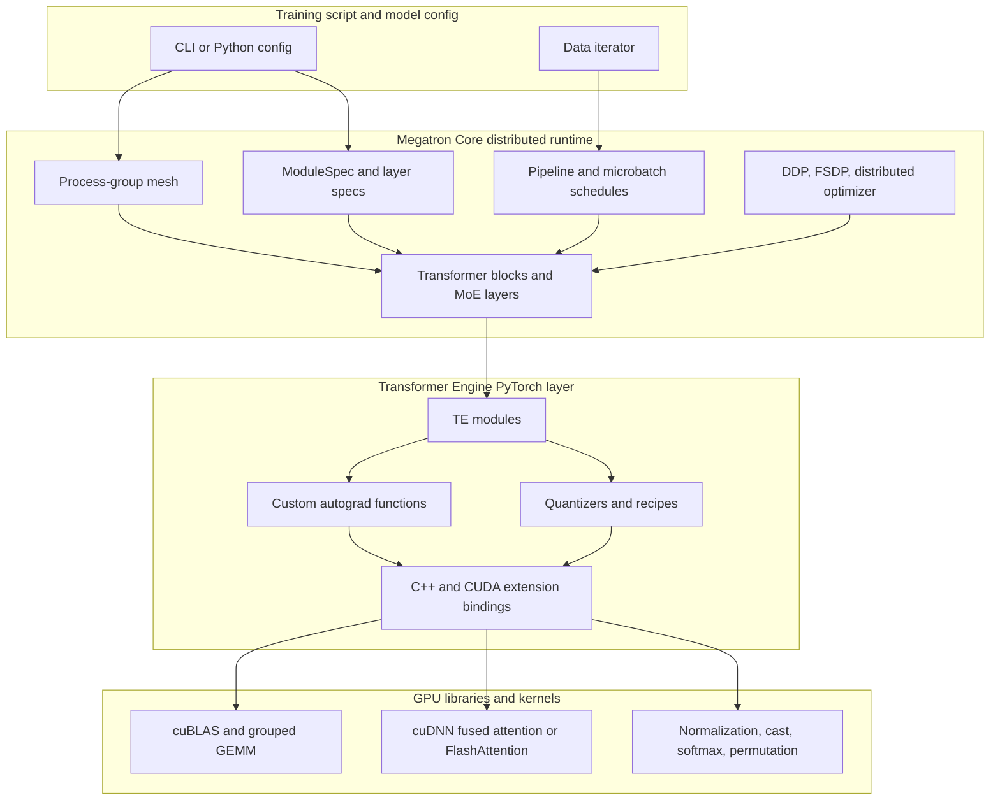
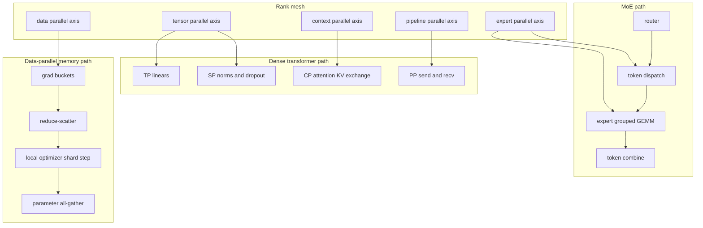
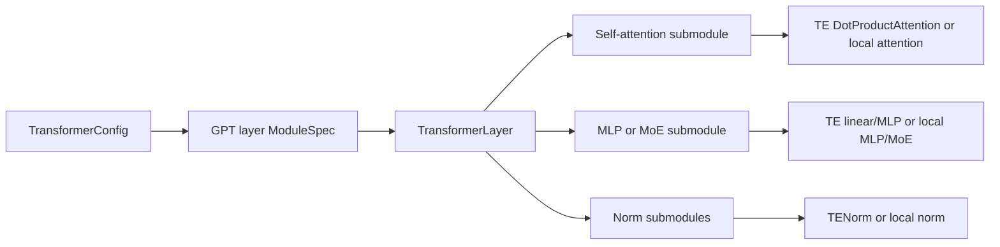
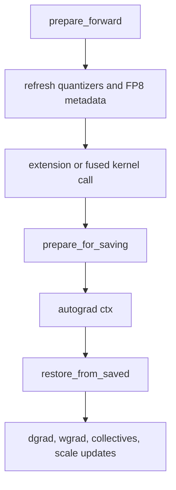
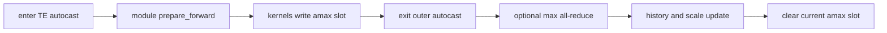
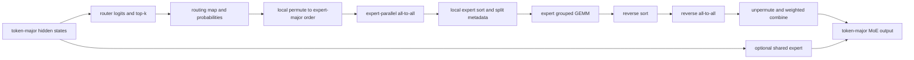
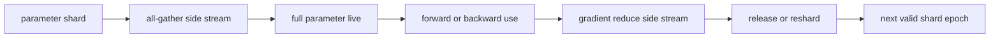
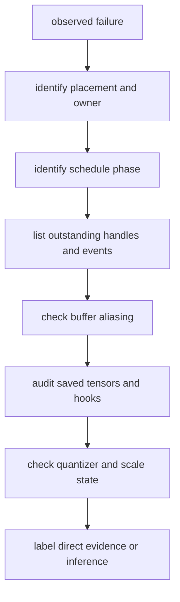

# Megatron Core and Transformer Engine: Architecture, Mathematics, and PyTorch Implementation

Source cutoff: 2026-05-06  
Megatron Core source snapshot: `NVIDIA/Megatron-LM` `core_v0.17.0`, commit `9539a12e1b04a68423f57b3eb41d6125161dca24`  
Transformer Engine source snapshot: `NVIDIA/TransformerEngine` `v2.14.1`, commit `366798ef8a0a00d8f2c1650d11e7e623d7c33e26`

## Abstract

Megatron Core and Transformer Engine form a layered training system for large transformer models. Megatron Core owns the distributed program: it constructs process-group meshes, partitions transformer layers, schedules pipeline microbatches, routes Mixture-of-Experts (MoE) tokens, shards optimizer state, and decides when activations or parameters are materialized. Transformer Engine owns many of the high-performance numerical kernels and their PyTorch-facing contracts: low-precision recipes, custom `torch.autograd.Function` implementations, fused attention, fused and grouped GEMM, normalization, permutation, and C++/CUDA bindings. The boundary is intentionally thin: Megatron Core wraps Transformer Engine modules through TE-specific adapter classes, while still exposing a local implementation path for contributors who need to reason about correctness independently of TE.

This paper explains that system from first principles for developers who contribute to both repositories. It begins with the mathematics of transformer training, distributed rank meshes, collectives, activation recomputation, and low-precision quantization. It then maps those concepts onto the pinned source code. The emphasis is not on command-line usage. The goal is to make the implementation legible: why a shape is sharded along a given axis, why an `all_gather` is paired with a `reduce_scatter`, why TE modules need custom autograd state, why MoE dispatch is a routing and permutation problem before it is a GEMM problem, and why FP8, MXFP8, and NVFP4 require scaling metadata as seriously as tensor data.

Out of scope: Transformer Engine JAX internals, inference-only serving paths, checkpoint-conversion tooling, and historical version archaeology except where it clarifies the training implementation.

## 1. How to Read This Paper

The paper is concept-first. Each major section starts with the mechanism and only then names implementation files. Inline implementation citations such as [1] point to short implementation notes at the end of each section. Source links point to external GitHub permalinks pinned to the remote-visible commits named above.

The target renderer is Markdown. Inline math uses dollar-delimited inline expressions, displayed formulas use double-dollar math blocks, and Mermaid diagrams avoid raw LaTeX inside node labels.

Diagrams in this Markdown file are source artifacts, not screenshots. Architecture, topology, and data-flow diagrams should therefore be editable Mermaid blocks. This is also a review policy: a topology change should appear as a textual diff to the diagram, with notation explained in prose below the block rather than hidden in a generated asset.

Evidence labels used below:

| Label | Meaning |
| --- | --- |
| `official docs` | NVIDIA documentation or repository documentation at the pinned checkout. |
| `official repo` | Source implementation in the pinned Megatron-LM or TransformerEngine checkout. |
| `paper` | Public research paper used for mathematical background or lineage. |
| `inferred` | A systems conclusion derived from source structure and common distributed-training design, not a separately documented NVIDIA claim. |

For rank meshes and implementation ordering, the paper distinguishes three evidence levels. The existence of an axis can be established from docs or config. Concrete rank membership requires the rank generator and process-group creation source. Communication ordering, stream behavior, and overlap windows require scheduler, bucket, or wrapper source because those properties are not implied by axis names alone.

## 2. Shared System Model, Notation, and Mathematical Preliminaries

### 2.1 Transformer Training as a Tensor Program

A dense decoder transformer layer maps hidden states $X_l$ to $X_{l+1}$ by composing normalization, self-attention, and a feed-forward network. In Megatron Core convention, hidden states commonly appear as sequence-major tensors with shape $[S, B, H]$, where $S$ is local sequence length, $B$ is local microbatch size, and $H$ is hidden width. Let $n_h$ be the number of attention heads and $d_h = H / n_h$ be head dimension.

For one attention block, the high-level computation is:

$$
Q = X W_Q,\quad K = X W_K,\quad V = X W_V
$$

$$
\operatorname{Attn}(X) =
\operatorname{softmax}\left(\frac{QK^T + M}{\sqrt{d_h}}\right)V
$$

Symbols: $X$ is the layer input, $W_Q,W_K,W_V$ are projection weights, $M$ is an additive mask or bias term, and $d_h$ is the head dimension used to normalize dot products.

The feed-forward block is usually two or three GEMMs plus an activation:

$$
\operatorname{MLP}(X) = \phi(X W_1 + b_1) W_2 + b_2
$$

Symbols: $\phi$ is GELU, SwiGLU, GeGLU, or a related activation; $W_1$ expands hidden width to an intermediate width; $W_2$ projects back to hidden width.

From a compiler or kernel perspective, this layer is a sequence of matrix multiplications, reductions, elementwise operations, data-layout transforms, and collectives. Megatron Core decides how the tensors are partitioned and ordered. Transformer Engine decides how many of the numerical kernels can be fused, quantized, or redirected to vendor libraries. Megatron Core's public parallelism guide names the same axes as data, tensor, pipeline, context, and expert parallelism, and the core configuration object stores the corresponding degrees and compatibility checks [1] [2].

### 2.2 Rank Meshes and Placement States

Let a global process be identified by a coordinate:

$$
r = (r_{dp}, r_{pp}, r_{vp}, r_{tp}, r_{cp}, r_{ep})
$$

Symbols: $r_{dp}$ is data-parallel coordinate, $r_{pp}$ is physical pipeline-stage coordinate, $r_{vp}$ is optional virtual pipeline chunk coordinate, $r_{tp}$ is tensor-parallel coordinate, $r_{cp}$ is context-parallel coordinate, and $r_{ep}$ is expert-parallel coordinate.

Megatron's rank mesh is not only a drawing aid; it is the coordinate system from which process groups are generated. If a rank-order tuple is $A=(a_0,\ldots,a_{m-1})$, a row-major linearization is:

$$
R(r_A) =
r_{a_0}
+ r_{a_1}N_{a_0}
+ r_{a_2}N_{a_0}N_{a_1}
+ \cdots
+ r_{a_{m-1}}\prod_{k=0}^{m-2}N_{a_k}
$$

Symbols: $R$ is global rank, $r_{a_j}$ is the coordinate on axis $a_j$, and $N_{a_j}$ is that axis's degree. Megatron's `RankGenerator` and `ProcessGroupCollection` turn these coordinates into masked projections: a tensor-parallel group varies only $r_{tp}$ while holding other coordinates fixed; a data-parallel-with-context group varies both $r_{dp}$ and $r_{cp}$ when context-parallel ranks replicate weights [3] [50].

The masked projection is the operation that decides group membership. For an ordered axis list $A$ and a group token $G \subseteq A$:

$$
\operatorname{vary}(G)=G,\quad
\operatorname{fixed}(G)=A \setminus G
$$

Symbols: `vary` are the coordinates that change inside one process group, and `fixed` are the coordinates held constant to select a specific group instance. Megatron's generator decomposes one integer over fixed axes and another over varying axes, then combines them through the axis strides [65]. A wrong `order` string is therefore not cosmetic; it changes the stride system used to enumerate ranks.

The product of parallel degrees must divide the world size. In a common dense model without expert parallelism:

$$
N_{\text{world}} = N_{dp} N_{pp} N_{tp} N_{cp}
$$

For MoE models, expert-parallel groups are introduced for expert parameters and token exchange. The exact data-parallel residual group depends on which parameters are dense, expert-local, or shared.

Dense and expert meshes are related but not identical. Megatron uses a dense generator that includes CP and sets EP to one, and an expert generator that includes EP and expert TP while setting CP to one, then checks that the resulting pipeline groups remain compatible [65]. Thus the tuple notation above is a paper-level unification, not always one literal generator instance. Dense attention and dense MLP parameters follow the dense groups; expert parameters and token collectives follow expert groups; pipeline stage ownership must remain compatible so a stage can call dense and expert submodules in the same schedule.

A tensor placement state describes which axes are local and which are partitioned:

| Placement | Example | Consequence |
| --- | --- | --- |
| replicated | dense parameter under ordinary DDP | all ranks in the group hold identical data. |
| column-sharded | column-parallel linear output features | output width is partitioned before optional gather. |
| row-sharded | row-parallel linear input features | partial outputs require reduction or reduce-scatter. |
| sequence-sharded | sequence-parallel activations | normalization/dropout operate on sequence shards. |
| context-sharded | long-sequence activations | attention requires remote keys and values. |
| expert-sharded | MoE experts | routing determines which rank owns token compute. |
| optimizer-sharded | distributed optimizer or FSDP | only local state shard is updated on each data-parallel rank. |

Megatron Core materializes these placements as PyTorch process groups. `initialize_model_parallel` builds and stores tensor, pipeline, context, data, and expert-parallel groups; later helpers return the current group for collectives [3]. This is one of the key reasons contributors need to read global state code carefully: many modules do not receive a process group explicitly, but instead query the globally initialized mesh.

`ProcessGroupCollection` does not eliminate that global state. It packages selected groups into an explicit object for modules, DDP, optimizer setup, wrappers, and multi-module layouts [50]. The distinction is ownership and lifetime:

| Path | Owner | Typical caller | Failure mode |
| --- | --- | --- | --- |
| global `parallel_state` | process-wide singleton | legacy helpers and initialization | stale or uninitialized state affects every module. |
| `ProcessGroupCollection` | module or subsystem constructor | transformer blocks, DDP, optimizer setup, TE wrappers | a missing field can fail late or trigger a feature-specific fallback. |
| multi-module collection | colocated module coordinator | encoder plus language-model style layouts | wrong module key can give the wrong CP-size or loss-context assumption. |

A useful developer-level tensor type is therefore:

$$
\tau(x)=
(\operatorname{shape}(x),\operatorname{dtype}(x),
\operatorname{placement}(x),\operatorname{owner}(x),
\operatorname{epoch}(x),\operatorname{pending}(x))
$$

Symbols: `placement` records which rank axes shard or replicate the tensor; `owner` is the module, process group, or runtime subsystem that may mutate the value next; `epoch` distinguishes microbatch, recompute, graph-capture, or parameter-cache generation; `pending` records asynchronous collectives, point-to-point transfers, offload copies, user-buffer operations, or graph replays that have been launched but not yet waited. A local `torch.Tensor` whose shape and dtype look right can still be semantically incomplete if its pending all-gather, reduce-scatter, all-to-all, or pipeline receive has not completed.

### 2.3 Collectives as Linear Algebra

The main collective operations used in the training path can be expressed as tensor transformations:

| Collective | Mathematical role | Typical use |
| --- | --- | --- |
| `all_reduce` | every rank receives $\sum_i x_i$ | ordinary DDP gradients or tensor-parallel partial sums. |
| `reduce_scatter` | reduce then shard the result | distributed optimizer gradients, row-parallel sequence outputs. |
| `all_gather` | concatenate shards from ranks | parameter shards, sequence shards, context keys and values. |
| `all_to_all` | every rank sends a different shard to every other rank | MoE token dispatch by expert owner. |
| point-to-point send/recv | transfer activation boundary tensors | pipeline forward and backward edges. |

For a vector $g$ sharded across $d$ data-parallel ranks, reduce-scatter and all-gather decompose all-reduce:

$$
\operatorname{all\_reduce}(g)
= \operatorname{all\_gather}(\operatorname{reduce\_scatter}(g))
$$

Symbols: $g$ is the concatenated gradient vector over a bucket; `reduce_scatter` gives each rank one reduced shard; `all_gather` reconstructs the full reduced vector when full replication is required.

This identity explains both ZeRO-style distributed optimizer updates and FSDP-style parameter sharding. Megatron Core's distributed optimizer documentation explicitly frames the memory saving as sharding optimizer state across data-parallel ranks, and the implementation builds contiguous parameter and gradient buffer ranges so each rank owns a range inside each bucket [4] [5].

Megatron's custom tensor-parallel mapping functions encode many collectives as forward/backward adjoint pairs [17]:

| Mapping | Forward effect | Backward effect |
| --- | --- | --- |
| copy to TP region | identity | all-reduce gradients. |
| reduce from TP region | all-reduce partial sums | identity. |
| scatter to TP region | split last dimension | gather last dimension. |
| gather from TP region | gather last dimension | split last dimension. |
| scatter to sequence-parallel region | split first dimension | gather first dimension. |
| reduce-scatter to sequence-parallel region | reduce and shard first dimension | gather first dimension. |
| all-to-all token exchange | exchange row blocks | exchange gradients with inverse splits. |

This is an advanced PyTorch pattern: the mathematical operator in the forward pass is not the whole distributed operator. The `torch.autograd.Function.backward` method often owns the communication that makes the forward placement legal.

Megatron and TE also rely on less-visible `torch.distributed` features: multiple `ProcessGroup` objects per rank, NCCL communicator options, high-priority streams for selected groups, asynchronous work handles, `all_gather_into_tensor` and `reduce_scatter_tensor` fast paths with compatibility fallbacks, `P2POp` batches for pipeline sends and receives, and coalescing managers for bucket communication [3] [17] [20] [28] [50].

Process-group creation order is part of the runtime contract. Megatron wraps group creation, can attach NCCL options, may create duplicate groups with identical ranks for separate all-gather and reduce-scatter traffic, creates side groups for CPU-oriented metadata paths, and has special ordering constraints for SHARP and UCC pipeline configurations [65]. Separate communicators do not mathematically change a collective, but they change what can make progress independently. If all collectives share one communicator $g$:

$$
T_{\text{comm}}(g) \approx \sum_{c \in C_g} T_c
$$

With compatible all-gather and reduce-scatter traffic split across $g_{\text{ag}}$ and $g_{\text{rs}}$, the exposed lower bound becomes:

$$
T_{\text{comm}} \geq
\max\left(
\sum_{c \in C_{g_{\text{ag}}}} T_c,\,
\sum_{c \in C_{g_{\text{rs}}}} T_c
\right)
$$

Symbols: $C_g$ is the ordered set of collectives submitted to communicator $g$, and $T_c$ is the elapsed time of collective $c$ if exposed. The exact overlap is runtime-dependent on NCCL or UCC, device topology, CUDA stream priority, and neighboring kernels; the source directly supports communicator separation and handle ordering, not a universal performance number.

### 2.4 Cost Model

A first-order training performance model separates compute, activation memory, parameter memory, and communication:

$$
T_{\text{step}} \approx
T_{\text{gemm}} + T_{\text{attention}} + T_{\text{elementwise}}
+ T_{\text{collective}} + T_{\text{p2p}} - T_{\text{overlap}}
$$

Symbols: $T_{\text{overlap}}$ is not a free term; it is the portion of communication hidden behind compute by asynchronous dispatch, stream scheduling, or pipeline scheduling.

For tensor-parallel dense GEMMs, increasing $N_{tp}$ reduces local matrix dimensions but adds collectives. For context parallelism, increasing $N_{cp}$ reduces local sequence activation memory while adding key-value exchange in attention. For pipeline parallelism, increasing $N_{pp}$ reduces per-rank layer memory but adds pipeline bubbles and point-to-point transfers. For expert parallelism, increasing $N_{ep}$ reduces per-rank expert parameters and grouped GEMM load, but increases token dispatch traffic and load-balance sensitivity.

### 2.5 Low-Precision Quantization

Transformer Engine treats FP8, MXFP8, and NVFP4 as a tensor plus metadata, not just a dtype. For a simple scaled low-precision format:

$$
\hat{x} = \operatorname{clip}\left(\operatorname{round}\left(\frac{x}{s}\right), q_{\min}, q_{\max}\right),\quad
x \approx s\hat{x}
$$

Symbols: $x$ is a high-precision value, $s$ is a scaling factor, $\hat{x}$ is the stored low-precision code, and $q_{\min},q_{\max}$ are the representable integer or floating-code bounds.

Delayed FP8 scaling chooses $s$ from a history of previous absolute maxima rather than from the current tensor read. A common form is:

$$
s_t = \frac{\operatorname{amax}_t}{x_{\max}},\quad
\operatorname{amax}_t = f(a_{t-k},\ldots,a_{t-1})
$$

Symbols: $x_{\max}$ is the maximum representable magnitude of the selected FP8 format, $a_i$ are observed absolute maxima, and $f$ is either the most recent value or a window maximum. Transformer Engine's docs describe the history buffer, and its PyTorch global state manager batches delayed-scaling amax reduction and scale update outside individual module calls [6] [7].

Block-scaling recipes replace one scale per tensor with one scale per block. MXFP8 uses one E8M0 scale per block of 32 values in the documented recipe, while NVFP4 combines a local FP8 E4M3 block scale with a global FP32 scale and can apply stochastic rounding and Random Hadamard Transform (RHT) for stability [8] [9].

### 2.6 Advanced PyTorch Mechanisms in the Shared Model

The placement state in this section becomes executable through ordinary PyTorch distributed objects. Megatron Core does not wrap activations in a custom placement-aware tensor class. Instead, it creates many `torch.distributed.ProcessGroup` instances over the same global ranks and treats the selected group as part of the tensor's semantic state [3] [50] [65]. A local tensor with shape `[S, B, H]` is therefore incomplete without the answer to: which axis is local, which process group owns the next collective, and whether an asynchronous collective, pipeline transfer, graph replay, offload copy, or recompute hook is still pending.

This distinction matters because a process group is not just a set of ranks. In the pinned Megatron source, group construction can attach NCCL options, request high-priority streams, create Gloo variants for CPU-oriented metadata paths, create duplicate groups with identical ranks for separate all-gather and reduce-scatter traffic, and impose ordering constraints for SHARP and UCC pipeline configurations [65]. Two groups with the same ranks can therefore differ in communicator identity and progress ordering. The mathematical mesh defines who participates; the PyTorch process group defines the concrete runtime channel.

The useful developer-level tensor state is:

$$
\tau_{\mathrm{runtime}}(x)=
(\operatorname{shape}, \operatorname{dtype}, \operatorname{placement},
\operatorname{process\_group}, \operatorname{owner}, \operatorname{pending})
$$

Symbols: `process_group` is the PyTorch communicator selected for the next distributed operation; `owner` is the subsystem allowed to mutate or release the tensor next; `pending` includes async work handles, CUDA events, P2P requests, offload copies, graph-buffer copies, or autograd hooks that have been registered but not fired. This is the practical reason this paper treats collectives as part of tensor type. A tensor can be locally shape-correct and numerically stale if its `pending` work has not completed.

Autograd is the other shared mechanism. Megatron's tensor-parallel mapping functions encode placement changes as custom `torch.autograd.Function` adjoints: identity in forward can all-reduce in backward, gather in forward can split or reduce-scatter in backward, and all-to-all swaps split metadata in backward [17]. Transformer Engine uses the same PyTorch substrate for fused numerical operators: custom autograd nodes save tensors, quantizer objects, process-group metadata, layout flags, RNG state, and low-precision recipes so backward can reconstruct the exact forward contract [15] [35] [54]. The visible Python call graph is therefore not the full execution graph. Contributors should ask which custom autograd node, saved-tensor hook, module hook, work handle, or CUDA event owns the next phase transition.

PyTorch mechanism links used by later sections are collected here. Public documentation links point to PyTorch 2.11 stable documentation, and implementation links point to the PyTorch `v2.11.0` source. Private APIs are marked as private rather than treated as supported public contracts.

| PyTorch mechanism | Public documentation | PyTorch implementation |
| --- | --- | --- |
| `torch.distributed.ProcessGroup` | [distributed API](https://docs.pytorch.org/docs/2.11/distributed.html#torch.distributed.ProcessGroup) | [`init.cpp` binding](https://github.com/pytorch/pytorch/blob/v2.11.0/torch/csrc/distributed/c10d/init.cpp#L2078-L2156) |
| `torch.distributed.P2POp` and `batch_isend_irecv` | [P2POp](https://docs.pytorch.org/docs/2.11/distributed.html#torch.distributed.P2POp), [batch_isend_irecv](https://docs.pytorch.org/docs/2.11/distributed.html#torch.distributed.batch_isend_irecv) | [`P2POp`](https://github.com/pytorch/pytorch/blob/v2.11.0/torch/distributed/distributed_c10d.py#L504-L564), [`batch_isend_irecv`](https://github.com/pytorch/pytorch/blob/v2.11.0/torch/distributed/distributed_c10d.py#L2847-L2898) |
| `torch.distributed.Work` async handle | [Work](https://docs.pytorch.org/docs/2.11/distributed.html#torch.distributed.Work) | [`Work` binding](https://github.com/pytorch/pytorch/blob/v2.11.0/torch/csrc/distributed/c10d/init.cpp#L3702-L3886) |
| `all_gather_into_tensor` and `reduce_scatter_tensor` | [all_gather_into_tensor](https://docs.pytorch.org/docs/2.11/distributed.html#torch.distributed.all_gather_into_tensor), [reduce_scatter_tensor](https://docs.pytorch.org/docs/2.11/distributed.html#torch.distributed.reduce_scatter_tensor) | [`all_gather_into_tensor`](https://github.com/pytorch/pytorch/blob/v2.11.0/torch/distributed/distributed_c10d.py#L4091-L4171), [`reduce_scatter_tensor`](https://github.com/pytorch/pytorch/blob/v2.11.0/torch/distributed/distributed_c10d.py#L4563-L4640) |
| `torch.distributed._coalescing_manager` | private helper; no stable public API page | [`_coalescing_manager`](https://github.com/pytorch/pytorch/blob/v2.11.0/torch/distributed/distributed_c10d.py#L2700-L2778) |
| `torch.autograd.Function` and `ctx.save_for_backward` | [Extending autograd](https://docs.pytorch.org/docs/2.11/notes/extending.html#extending-torch-autograd), [save_for_backward](https://docs.pytorch.org/docs/2.11/generated/torch.autograd.function.FunctionCtx.save_for_backward.html) | [`FunctionCtx`](https://github.com/pytorch/pytorch/blob/v2.11.0/torch/autograd/function.py#L39-L91), [`Function`](https://github.com/pytorch/pytorch/blob/v2.11.0/torch/autograd/function.py#L485-L579) |
| `torch.autograd.graph.saved_tensors_hooks` | [API docs](https://docs.pytorch.org/docs/2.11/autograd.html#torch.autograd.graph.saved_tensors_hooks), [tutorial](https://docs.pytorch.org/tutorials/intermediate/autograd_saved_tensors_hooks_tutorial.html) | [`saved_tensors_hooks`](https://github.com/pytorch/pytorch/blob/v2.11.0/torch/autograd/graph.py#L263-L410) |
| `torch._C._autograd._push_saved_tensors_default_hooks` | private API; use public `saved_tensors_hooks` docs when possible | [C++ binding](https://github.com/pytorch/pytorch/blob/v2.11.0/torch/csrc/autograd/init.cpp#L471-L479) |
| `Tensor.register_hook` and `Tensor.register_post_accumulate_grad_hook` | [register_hook](https://docs.pytorch.org/docs/2.11/generated/torch.Tensor.register_hook.html), [register_post_accumulate_grad_hook](https://docs.pytorch.org/docs/2.11/generated/torch.Tensor.register_post_accumulate_grad_hook.html) | [`register_hook`](https://github.com/pytorch/pytorch/blob/v2.11.0/torch/_tensor.py#L663-L711), [`register_post_accumulate_grad_hook`](https://github.com/pytorch/pytorch/blob/v2.11.0/torch/_tensor.py#L713-L760) |
| `nn.Module.register_forward_pre_hook` and `register_forward_hook` | [Module hook docs](https://docs.pytorch.org/docs/2.11/generated/torch.nn.Module.html#torch.nn.Module.register_forward_pre_hook) | [`register_forward_pre_hook`](https://github.com/pytorch/pytorch/blob/v2.11.0/torch/nn/modules/module.py#L1625-L1686), [`register_forward_hook`](https://github.com/pytorch/pytorch/blob/v2.11.0/torch/nn/modules/module.py#L1688-L1764) |
| `torch.autograd.graph.register_multi_grad_hook` and `Node.register_prehook` | [register_multi_grad_hook](https://docs.pytorch.org/docs/2.11/autograd.html#torch.autograd.graph.register_multi_grad_hook), [Node hooks](https://docs.pytorch.org/docs/2.11/autograd.html#torch.autograd.graph.Node.register_prehook) | [`register_multi_grad_hook`](https://github.com/pytorch/pytorch/blob/v2.11.0/torch/autograd/graph.py#L470-L563) |
| `Variable._execution_engine.queue_callback` | private API; no stable public API page | [`python_engine.cpp`](https://github.com/pytorch/pytorch/blob/v2.11.0/torch/csrc/autograd/python_engine.cpp#L387-L405) |
| `torch.cuda.Stream`, `torch.cuda.Event`, and `Tensor.record_stream` | [Stream](https://docs.pytorch.org/docs/2.11/generated/torch.cuda.Stream_class.html), [Event](https://docs.pytorch.org/docs/2.11/generated/torch.cuda.Event.html), [record_stream](https://docs.pytorch.org/docs/2.11/generated/torch.Tensor.record_stream.html) | [`streams.py`](https://github.com/pytorch/pytorch/blob/v2.11.0/torch/cuda/streams.py#L17-L221), [`record_stream` docs source](https://github.com/pytorch/pytorch/blob/v2.11.0/torch/_tensor_docs.py#L4051-L4097) |
| `torch.cuda.CUDAGraph` and graph capture helpers | [CUDAGraph](https://docs.pytorch.org/docs/2.11/generated/torch.cuda.CUDAGraph.html), [make_graphed_callables](https://docs.pytorch.org/docs/2.11/generated/torch.cuda.make_graphed_callables.html) | [`graphs.py`](https://github.com/pytorch/pytorch/blob/v2.11.0/torch/cuda/graphs.py#L66-L341) |
| `torch.Tensor._make_wrapper_subclass` | private tensor-subclass API; public background in [Extending PyTorch](https://docs.pytorch.org/docs/2.11/notes/extending.html#extending-torch) | [`python_variable.cpp`](https://github.com/pytorch/pytorch/blob/v2.11.0/torch/csrc/autograd/python_variable.cpp#L734-L795) |
| `torch.jit.script` | [API docs](https://docs.pytorch.org/docs/2.11/jit.html#torch.jit.script) | [`_script.py`](https://github.com/pytorch/pytorch/blob/v2.11.0/torch/jit/_script.py#L1236-L1444) |
| `torch.compile` | [API docs](https://docs.pytorch.org/docs/2.11/generated/torch.compile.html) | [`torch.__init__.py`](https://github.com/pytorch/pytorch/blob/v2.11.0/torch/__init__.py#L2547-L2635) |
| `torch._dynamo.disable` / `torch.compiler.disable` | [fine-grained compiler disable docs](https://docs.pytorch.org/docs/stable/user_guide/torch_compiler/torch.compiler_fine_grain_apis.html) | [`decorators.py`](https://github.com/pytorch/pytorch/blob/v2.11.0/torch/_dynamo/decorators.py#L80-L140) |
| `torch.no_grad` and `torch.enable_grad` | [no_grad](https://docs.pytorch.org/docs/2.11/generated/torch.no_grad.html), [enable_grad](https://docs.pytorch.org/docs/2.11/generated/torch.enable_grad.html) | [`grad_mode.py`](https://github.com/pytorch/pytorch/blob/v2.11.0/torch/autograd/grad_mode.py#L21-L110) |
| CPU and CUDA RNG state APIs | [torch RNG](https://docs.pytorch.org/docs/2.11/random.html), [CUDA RNG](https://docs.pytorch.org/docs/2.11/cuda.html#random-number-generator) | [`random.py`](https://github.com/pytorch/pytorch/blob/v2.11.0/torch/random.py#L10-L179), [`cuda/random.py`](https://github.com/pytorch/pytorch/blob/v2.11.0/torch/cuda/random.py#L23-L79) |
| `Tensor.untyped_storage` and `Storage.resize_` | [untyped_storage](https://docs.pytorch.org/docs/2.11/generated/torch.Tensor.untyped_storage.html), [storage docs](https://docs.pytorch.org/docs/2.11/storage.html) | [`_tensor_docs.py`](https://github.com/pytorch/pytorch/blob/v2.11.0/torch/_tensor_docs.py#L5039-L5046), [`storage.py`](https://github.com/pytorch/pytorch/blob/v2.11.0/torch/storage.py#L467-L484) |
| `torch.utils.cpp_extension.load_inline` | [C++ extension docs](https://docs.pytorch.org/docs/2.11/cpp_extension.html#torch.utils.cpp_extension.load_inline) | [`cpp_extension.py`](https://github.com/pytorch/pytorch/blob/v2.11.0/torch/utils/cpp_extension.py#L1989-L2075) |
| `torch.autograd.backward` and autograd engine execution | [backward docs](https://docs.pytorch.org/docs/2.11/generated/torch.autograd.backward.html) | [`autograd/__init__.py`](https://github.com/pytorch/pytorch/blob/v2.11.0/torch/autograd/__init__.py#L253-L389), [`engine.cpp`](https://github.com/pytorch/pytorch/blob/v2.11.0/torch/csrc/autograd/engine.cpp#L708-L779) |
| `torch.amp.autocast` and custom AMP decorators | [AMP docs](https://docs.pytorch.org/docs/2.11/amp.html), [autocast](https://docs.pytorch.org/docs/2.11/amp.html#torch.autocast) | [`autocast_mode.py`](https://github.com/pytorch/pytorch/blob/v2.11.0/torch/amp/autocast_mode.py#L52-L536) |
| `__torch_dispatch__` modes and wrapper-subclass dispatch | [Extending PyTorch](https://docs.pytorch.org/docs/2.11/notes/extending.html#extending-torch), [tensor subclassing docs](https://docs.pytorch.org/docs/2.11/notes/extending.html#subclassing-torch-tensor) | [`_python_dispatch.py`](https://github.com/pytorch/pytorch/blob/v2.11.0/torch/utils/_python_dispatch.py#L70-L142), [`_python_dispatch.py`](https://github.com/pytorch/pytorch/blob/v2.11.0/torch/utils/_python_dispatch.py#L515-L879) |
| `all_to_all_single` | [distributed API](https://docs.pytorch.org/docs/2.11/distributed.html#torch.distributed.all_to_all_single) | [`distributed_c10d.py`](https://github.com/pytorch/pytorch/blob/v2.11.0/torch/distributed/distributed_c10d.py#L4694-L4840) |
| Deterministic-algorithm switches | [determinism API](https://docs.pytorch.org/docs/2.11/generated/torch.use_deterministic_algorithms.html), [are_deterministic_algorithms_enabled](https://docs.pytorch.org/docs/2.11/generated/torch.are_deterministic_algorithms_enabled.html) | [`torch.__init__.py`](https://github.com/pytorch/pytorch/blob/v2.11.0/torch/__init__.py#L1379-L1540) |

### 2.7 Implementation Notes

- **[1]** Megatron Core's user guide summarizes DP, TP, PP, CP, and EP and states the product-style GPU-count model in [parallelism-guide.md](https://github.com/NVIDIA/Megatron-LM/blob/9539a12e1b04a68423f57b3eb41d6125161dca24/docs/user-guide/parallelism-guide.md).
- **[2]** `ModelParallelConfig` stores tensor, pipeline, virtual pipeline, sequence, context, and expert-parallel degrees and validates some cross-feature constraints in [model_parallel_config.py](https://github.com/NVIDIA/Megatron-LM/blob/9539a12e1b04a68423f57b3eb41d6125161dca24/megatron/core/model_parallel_config.py).
- **[3]** `initialize_model_parallel` and process-group accessors such as `get_tensor_model_parallel_group`, `get_pipeline_model_parallel_group`, `get_context_parallel_group`, and `get_expert_model_parallel_group` are implemented in [parallel_state.py](https://github.com/NVIDIA/Megatron-LM/blob/9539a12e1b04a68423f57b3eb41d6125161dca24/megatron/core/parallel_state.py).
- **[50]** `ProcessGroupCollection` packages named process groups for module, DDP, TE-wrapper, and FSDP construction in [process_groups_config.py](https://github.com/NVIDIA/Megatron-LM/blob/9539a12e1b04a68423f57b3eb41d6125161dca24/megatron/core/process_groups_config.py).
- **[4]** Megatron Core's distributed optimizer guide gives the memory model and reduce-scatter/all-gather update flow in [dist_optimizer.md](https://github.com/NVIDIA/Megatron-LM/blob/9539a12e1b04a68423f57b3eb41d6125161dca24/docs/user-guide/features/dist_optimizer.md).
- **[5]** `DistributedOptimizer` constructs range maps from model parameters to contiguous gradient-buffer shards in [distrib_optimizer.py](https://github.com/NVIDIA/Megatron-LM/blob/9539a12e1b04a68423f57b3eb41d6125161dca24/megatron/core/optimizer/distrib_optimizer.py).
- **[6]** Transformer Engine's FP8 delayed-scaling guide describes amax history, distributed amax reduction, and scale update behavior in [fp8_delayed_scaling.rst](https://github.com/NVIDIA/TransformerEngine/blob/366798ef8a0a00d8f2c1650d11e7e623d7c33e26/docs/features/low_precision_training/fp8_delayed_scaling/fp8_delayed_scaling.rst).
- **[7]** `FP8GlobalStateManager`, `autocast`, and helper functions for amax history and scale update are implemented in [quantization.py](https://github.com/NVIDIA/TransformerEngine/blob/366798ef8a0a00d8f2c1650d11e7e623d7c33e26/transformer_engine/pytorch/quantization.py).
- **[8]** Transformer Engine documents MXFP8 block size, E8M0 scale layout, swizzling, and distributed behavior in [mxfp8.rst](https://github.com/NVIDIA/TransformerEngine/blob/366798ef8a0a00d8f2c1650d11e7e623d7c33e26/docs/features/low_precision_training/mxfp8/mxfp8.rst).
- **[9]** Transformer Engine documents NVFP4 E2M1 data, hierarchical scaling, stochastic rounding, RHT, and quantized all-gather behavior in [nvfp4.rst](https://github.com/NVIDIA/TransformerEngine/blob/366798ef8a0a00d8f2c1650d11e7e623d7c33e26/docs/features/low_precision_training/nvfp4/nvfp4.rst).

## 3. Two-Layer Architecture: Megatron Core Above Transformer Engine

Megatron Core and Transformer Engine can be read as a two-layer system.



Diagram notation key: `MCore` is the distributed Python runtime in Megatron Core; `TE` is Transformer Engine's PyTorch layer; `Bindings` are pybind/C++ extension functions that call lower-level CUDA or vendor-library implementations.

This layering is visible in Megatron Core's transformer configuration. The default transformer implementation is `transformer_engine`, while `local` remains an option for MCore-native modules [10]. GPT layer specs are assembled as `ModuleSpec` values, so the same high-level transformer layer can be instantiated with local or TE-backed submodules [11] [12]. The TE extension wrapper maps MCore configuration and process groups into classes such as `TENorm`, `TEColumnParallelLinear`, `TELayerNormColumnParallelLinear`, and `TEDotProductAttention` [13].

The key design idea is inversion of control. Megatron Core does not ask Transformer Engine to decide the global topology. MCore decides the rank mesh, layer layout, pipeline schedule, and MoE dispatch type. TE modules receive enough local context to execute a high-performance subgraph: a linear, a layernorm-linear pair, an attention core, or an MLP. This separation makes it possible to reason about training correctness at the Megatron layer and kernel correctness at the TE layer.

The boundary is a handoff of state, not only a stack transition. `TransformerBlock` chooses stage-local layer specs, handles physical and virtual pipeline offsets, and enters layer-specific quantization contexts before constructing modules. `TransformerLayer` stores the process-group collection and routes it differently: attention receives the full collection, dense MLP-like modules usually receive the TP group they need, and MoE-family modules need the broader collection because expert token movement, expert data parallelism, and sharded state differ from dense tensor parallelism [13] [31] [32] [50].

TE wrappers are metadata adapters as much as compute adapters. `TELinear` maps Megatron flags into TE constructor behavior, chooses expert or duplicated RNG tracker names, disables TE communication when MoE dispatch owns the movement, threads `is_first_microbatch`, and sets parameter attributes used later by DDP, checkpointing, and optimizer code [13]. A wrapper bug can therefore become a stale FP8 weight-cache bug, an optimizer-sharding bug, or a duplicated-gradient bug even when the local GEMM is numerically correct.

### 3.1 Why the Boundary Exists

The distributed transformer program has concerns that are not kernel concerns:

- Which ranks form a tensor-parallel group?
- Is a parameter replicated, tensor-sharded, expert-sharded, or data-sharded?
- Which physical pipeline stage owns which layers?
- Are activations recomputed, offloaded, or saved?
- Does an MoE token go to a local expert, a peer rank, or a fused dispatcher?
- Can a data-parallel parameter all-gather be prefetched before a module's forward pass?

Conversely, kernel execution has concerns that should not be reimplemented in the distributed runtime:

- Which fused attention backend supports this dtype, mask, layout, and sequence shape?
- Does a low-precision GEMM need rowwise, columnwise, or both tensor usages?
- Can quantization and transpose be fused?
- Which CUDA extension owns the saved tensors for backward?
- How are amax histories reduced and scale factors updated?
- Which grouped GEMM path supports variable expert shapes?

The repos meet at PyTorch module and autograd boundaries. TE modules subclass `torch.nn.Module` for user-facing composition, but many heavy operations are dispatched through custom `torch.autograd.Function` classes so the forward path can save exactly the tensors and metadata required by the backward path [14] [15]. That is the first advanced PyTorch feature contributors should internalize: the apparent Python module graph is not the same as the gradient graph. The gradient graph often contains custom nodes whose context stores quantizers, transposition choices, communication handles, and auxiliary tensors.

### 3.2 Shared Contributor Mental Model

For a dense transformer layer using TE-backed modules:

1. Megatron Core builds a `TransformerConfig`, initializes process groups, and constructs a GPT layer spec.
2. The layer spec selects TE or local submodules.
3. The Megatron transformer block executes layers according to pipeline and recomputation policy.
4. TE modules enter `prepare_forward`, initialize FP8 metadata when required, choose quantizers, and call custom autograd functions.
5. Custom autograd functions call Python extension wrappers such as `general_gemm` or fused-attention wrappers.
6. C++ bindings convert PyTorch tensors into Transformer Engine tensor wrappers and call CUDA or vendor-library entry points.
7. Backward replays the saved autograd context, possibly recomputes activations, and triggers collectives through Megatron or TE communication helpers.

This chain means a contributor changing a configuration field must trace at least three layers: config validation, module construction, and kernel/autograd behavior. A contributor changing a TE kernel must trace the reverse path: C++ binding signature, Python wrapper assumptions, custom autograd saved state, and Megatron wrapper parameters.

`ModuleSpec` is deferred construction, not a per-layer object factory with hidden mutable state. A spec can hold a class, dynamic import tuple, parameters, submodule specs, and metadata; `build_module` injects submodules and constructor parameters when it finally instantiates the target [11]. `TransformerBlock` may reuse the same spec object for multiple layers and instantiate fresh modules from it. Contributors should therefore treat spec fields as declarative values: mutating `spec.params`, `spec.submodules`, or `spec.metainfo` during construction can leak across repeated references.

Layer numbering is split across build time and module time. The block computes global layer numbers to pick heterogeneous layer settings and precision contexts, while the layer constructor records the logical layer number used by submodules. Features that depend on a layer index must be placed at the right phase: precision recipes that are active during construction belong in the block; attention or MoE behavior that depends on logical layer id belongs in the layer or submodule; checkpoint remapping belongs in sharded-state-dict code.

TE's `prepare_forward` is the preflight gate below that boundary. It checks CUDA placement, TP group availability, activation dtype under AMP/autocast, FP8 metadata initialization, recipe correspondence for weight tensors, delayed-scaling amax registration, recompute metadata, and contiguity [14]. For sequence-parallel FP8 delayed scaling, a local shard's amax is not enough. If $X=\operatorname{concat}_s(X_0,\ldots,X_{p-1})$, then all TP/SP ranks need a consistent:

$$
a_{\text{global}} = \max_{0 \leq i < p} \max \lvert X_i \rvert
$$

Symbols: $p$ is tensor-parallel degree for the sequence-parallel group, $X_i$ is the local sequence shard, and $a_{\text{global}}$ is the amax that should inform shared delayed-scaling state. A shape-correct FP8 path can still be wrong if its scale clock is local when the tensor semantics are distributed.

### 3.3 Advanced PyTorch Mechanisms at the Boundary

The MCore-to-TE boundary is a PyTorch module-construction boundary before it is a kernel boundary. `ModuleSpec` describes what should be built; `build_module` later instantiates a fresh `torch.nn.Module` with runtime config, submodule specs, and process-group state [11] [31]. The same spec can be reused across layers, so spec mutation during construction is a shared-state bug. The safe mental model is that a spec is declarative input, while the instantiated module owns mutable runtime state.

Megatron's TE wrappers attach distributed ownership metadata to ordinary PyTorch parameters. `TELinear` and related wrappers map MCore flags into TE constructor arguments, choose expert or duplicated RNG tracker names, pass sequence-parallel and user-buffer-overlap settings, and set parameter attributes such as `allreduce`, `sequence_parallel`, and `tensor_model_parallel` after TE registers the parameters [13]. DDP, checkpointing, and optimizer code later read those attributes to decide whether a parameter participates in dense DP reduction, expert DP reduction, duplicated TP reduction, tensor-sharded checkpointing, or quantized parameter all-gather [28] [80].

Transformer Engine then adds a second state machine below the wrapper. Its base module records FP8 metadata, quantizers, recipe state, TP group binding, parameter initialization metadata, cached transposes, and recompute flags; `prepare_forward` validates and mutates that state before a custom autograd function sees the inputs [14]. This means a call that looks like `module(x)` is an ordered transaction:

1. MCore has selected the rank mesh, layer number, and wrapper context.
2. TE has validated device, dtype, TP group, quantizer, and recipe state.
3. A custom autograd function records tensors and non-tensor metadata for backward.
4. A Python extension wrapper converts PyTorch tensors or TE quantized wrappers into C++/CUDA-facing tensor descriptors.

Microbatch state is part of the transaction. Megatron passes `is_first_microbatch` into TE modules so TE can refresh or reuse per-iteration caches at the correct time [13]. A change that appears local to module construction can therefore alter parameter-transpose cache lifetime, FP8 metadata lifetime, or delayed wgrad behavior several phases later.

PyTorch mechanism links for this subsection:

| Mechanism in the prose | Public documentation | PyTorch implementation |
| --- | --- | --- |
| `torch.nn.Module` construction and call dispatch | [Module docs](https://docs.pytorch.org/docs/2.11/generated/torch.nn.Module.html) | [`module.py` `_call_impl`](https://github.com/pytorch/pytorch/blob/v2.11.0/torch/nn/modules/module.py#L1783-L1880) |
| Parameter registration and later parameter-attribute inspection | [Parameter docs](https://docs.pytorch.org/docs/2.11/generated/torch.nn.parameter.Parameter.html), [register_parameter](https://docs.pytorch.org/docs/2.11/generated/torch.nn.Module.html#torch.nn.Module.register_parameter) | [`parameter.py`](https://github.com/pytorch/pytorch/blob/v2.11.0/torch/nn/parameter.py#L19-L60), [`register_parameter`](https://github.com/pytorch/pytorch/blob/v2.11.0/torch/nn/modules/module.py#L593-L622) |
| Module forward pre-hooks and forward hooks around `module(x)` | [Module hook docs](https://docs.pytorch.org/docs/2.11/generated/torch.nn.Module.html#torch.nn.Module.register_forward_pre_hook) | [`register_forward_pre_hook`](https://github.com/pytorch/pytorch/blob/v2.11.0/torch/nn/modules/module.py#L1625-L1686), [`register_forward_hook`](https://github.com/pytorch/pytorch/blob/v2.11.0/torch/nn/modules/module.py#L1688-L1764) |
| Custom autograd nodes below visible modules | [Extending autograd](https://docs.pytorch.org/docs/2.11/notes/extending.html#extending-torch-autograd) | [`FunctionCtx`](https://github.com/pytorch/pytorch/blob/v2.11.0/torch/autograd/function.py#L39-L91), [`Function`](https://github.com/pytorch/pytorch/blob/v2.11.0/torch/autograd/function.py#L485-L579) |

### 3.4 Implementation Notes

- **[10]** `TransformerConfig` defines `transformer_impl`, TE-related precision fields, recomputation settings, CUDA graph options, MoE fields, and validation logic in [transformer_config.py](https://github.com/NVIDIA/Megatron-LM/blob/9539a12e1b04a68423f57b3eb41d6125161dca24/megatron/core/transformer/transformer_config.py).
- **[11]** `ModuleSpec`, `get_module`, and `build_module` define Megatron Core's module-factory abstraction in [spec_utils.py](https://github.com/NVIDIA/Megatron-LM/blob/9539a12e1b04a68423f57b3eb41d6125161dca24/megatron/core/transformer/spec_utils.py).
- **[12]** GPT layer-spec helpers select TE or local submodules, including attention, MLP, MoE, and normalization choices, in [gpt_layer_specs.py](https://github.com/NVIDIA/Megatron-LM/blob/9539a12e1b04a68423f57b3eb41d6125161dca24/megatron/core/models/gpt/gpt_layer_specs.py).
- **[13]** Megatron's TE adapter classes map MCore config and process-group state into Transformer Engine modules in [transformer_engine.py](https://github.com/NVIDIA/Megatron-LM/blob/9539a12e1b04a68423f57b3eb41d6125161dca24/megatron/core/extensions/transformer_engine.py).
- **[14]** Transformer Engine's base PyTorch module initializes FP8 metadata, weight quantizers, and `prepare_forward` context in [base.py](https://github.com/NVIDIA/TransformerEngine/blob/366798ef8a0a00d8f2c1650d11e7e623d7c33e26/transformer_engine/pytorch/module/base.py).
- **[15]** TE's `Linear` module delegates core forward/backward work to `_Linear`, a custom `torch.autograd.Function`, in [linear.py](https://github.com/NVIDIA/TransformerEngine/blob/366798ef8a0a00d8f2c1650d11e7e623d7c33e26/transformer_engine/pytorch/module/linear.py).

## 4. Distributed Parallelism in Megatron Core

Megatron Core decomposes model training along several independent axes. The axes are conceptually independent, but implementation details couple them: sequence parallelism is required in some TP+EP settings, context parallelism changes attention communication, virtual pipeline parallelism changes schedule tables, and distributed optimizer/FSDP alter data-parallel parameter residency.



Diagram notation key: `TP` owns feature and sequence-parallel collectives; `CP` owns long-context attention exchange; `PP` owns point-to-point activation boundaries; `EP` owns token exchange and expert placement; `DP` owns gradient and optimizer-state sharding.

### 4.1 Tensor Parallelism and Sequence Parallelism

Tensor parallelism partitions individual linear algebra operations. In a column-parallel linear layer, the output feature dimension is sharded:

$$
W =
\begin{bmatrix}
W_0 \\
W_1 \\
\cdots \\
W_{p-1}
\end{bmatrix},
\quad
W_i \in \mathbb{R}^{H_{\text{out}}/p \times H_{\text{in}}}
$$

$$
Y_i = X W_i^T + b_i,\quad
Y_i \in \mathbb{R}^{S_{\ell}B \times H_{\text{out}}/p}
$$

Symbols: $p=N_{tp}$ is tensor-parallel size, $S_{\ell}$ is the local sequence length at this program point, $W_i$ is the local output-feature shard, and $Y_i$ is the local output shard. If `gather_output=True`, TP ranks all-gather $Y_i$ along the last dimension.

In a row-parallel linear layer, the input feature dimension is sharded:

$$
X =
\begin{bmatrix}
X_0 & X_1 & \cdots & X_{p-1}
\end{bmatrix},
\quad
W_i \in \mathbb{R}^{H_{\text{out}} \times H_{\text{in}}/p}
$$

$$
\hat{Y}_i = X_i W_i^T,\quad
Y = \sum_{i=0}^{p-1}\hat{Y}_i + b
$$

Symbols: $X_i$ is the local input shard and $W_i$ is the corresponding row shard. The sum is implemented by all-reduce or by reduce-scatter when sequence parallelism is active.

Megatron Core implements these choices in `ColumnParallelLinear` and `RowParallelLinear`, with explicit flags such as `gather_output`, `input_is_parallel`, and `sequence_parallel` [16]. The mapping functions are custom autograd functions in Python that transform forward and backward collectives. For example, a forward identity can pair with a backward all-reduce, or a forward all-gather can pair with a backward reduce-scatter [17]. That is an important PyTorch pattern: the forward tensor shape alone does not describe distributed behavior; the autograd rule can inject collectives in the backward pass.

Sequence parallelism shards the sequence dimension for operations such as layer normalization and dropout. It reduces activation memory because each tensor-parallel rank holds a different sequence slice for certain non-GEMM operations:

$$
X_{\text{sp},i}=X[iS_{\ell}/p:(i+1)S_{\ell}/p,\ :,\ :]
$$

Symbols: $X_{\text{sp},i}$ is the local sequence slice on TP rank $i$. Megatron's tensor-parallel layers check sequence-parallel constraints and use gather/reduce-scatter helpers to restore or reshard data at boundaries where GEMMs require a different placement [16] [17]. A column-parallel linear can therefore receive a sequence-sharded input, temporarily all-gather it inside a custom autograd function, and return a feature-sharded output without exposing the temporary gathered activation in the public Python call.

### 4.2 Pipeline Parallelism and Virtual Pipeline Parallelism

Pipeline parallelism partitions layers across depth. If $L$ layers are divided across $N_{pp}$ physical stages, each stage owns roughly $L/N_{pp}$ layers. A microbatch flows forward from stage 0 to stage $N_{pp}-1$, and gradients flow backward in the opposite direction.

The basic 1F1B schedule has three phases:

1. Warmup: early stages issue forward passes until the pipeline fills.
2. Steady state: each stage alternates one forward and one backward microbatch.
3. Cooldown: remaining backward passes drain the pipeline.

Virtual pipeline parallelism subdivides a physical stage into multiple model chunks. This reduces pipeline bubbles and can improve load balance at the cost of more scheduling complexity and more activation boundary transfers. Megatron Core exposes both simple and custom pipeline layouts; the `PipelineParallelLayerLayout` parser maps layout strings into per-stage layer assignments [18]. The schedule implementation computes warmup microbatches, schedule tables, and model-chunk identifiers, then coordinates point-to-point send/recv through a `P2PCommunicator` [19] [20].

For a non-interleaved schedule with $M$ microbatches and $P_p=N_{pp}$ stages, stage $p$ performs approximately:

$$
W_p = \min(P_p-p-1,\ M),\quad
R_p = M-W_p
$$

Symbols: $W_p$ is warmup forward microbatches on stage $p$, and $R_p$ is the number that enter steady-state 1F1B. Under balanced stages, a simple bubble approximation is:

$$
\beta \approx \frac{P_p-1}{M+P_p-1}
$$

Symbols: $\beta$ is idle slots divided by total slots. This approximation ignores P2P latency, virtual stages, unequal layer cost, recomputation, and overlap; it is still the right first-order reason that more microbatches reduce pipeline waste.

The pipeline schedule is also where several other features meet: microbatch loss scaling, MoE auxiliary loss scaling, activation checkpoint decisions, parameter prefetch hooks, and CUDA graph microbatch markers. Contributors should treat this code as the temporal root of training. A module may be correct in isolation but wrong under pipeline scheduling if it assumes that all microbatches execute in simple lexical order.

Pipeline point-to-point communication has two protocols that are easy to conflate: shape exchange and tensor exchange. For variable sequence lengths or standalone multi-token prediction, adjacent stages first exchange small int64 shape tensors on CUDA, wait for those shape requests, allocate receive buffers, and only then exchange activation payloads [68]. In overlap mode, the communicator can return work handles such as `send_next`, `recv_prev`, `send_prev`, and `recv_next`. The schedule stores these handles in queues and enforces:

$$
\operatorname{wait}(h_{\text{recv}}) < \operatorname{read}(x),\quad
\operatorname{wait}(h_{\text{send}}) < \operatorname{reuse\_or\_free}(x)
$$

Symbols: $h_{\text{recv}}$ materializes tensor $x$, and $h_{\text{send}}$ may still read from $x$. These inequalities are CUDA/distributed happens-before constraints, not stylistic ordering. A sent activation cannot be pseudo-deallocated or reused until its send handle is complete [66] [68].

Virtual pipeline parallelism is table-driven. Megatron maps a virtual microbatch id to `(microbatch_id, model_chunk_id)`, while backward maps a forward chunk $v$ to `num_model_chunks - v - 1` [67]. Parameter sync and gradient sync are also aligned to virtual microbatch ids rather than lexical calls: param all-gather looks ahead so PP ranks launch gathers at the same logical time, while grad sync is delayed until the corresponding model chunk reaches its last local microbatch [19] [28] [69]. That is why a feature that works in a non-interleaved schedule can still mis-order hooks under VPP.

### 4.3 Context Parallelism

Context parallelism partitions the sequence axis for long-context training. Unlike sequence parallelism, CP intends to shard all activations by sequence, not just cheap elementwise/norm regions. The complication is attention. For a query at one token position, the attention score may require keys and values from all positions in the same sequence. Therefore CP needs key-value exchange before or during attention and a corresponding gradient exchange in backward.

The ideal memory reduction is approximately:

$$
M_{\text{activation per rank}} \approx \frac{M_{\text{sequence activations}}}{N_{cp}}
$$

Symbols: $M_{\text{sequence activations}}$ is activation memory proportional to sequence length, and $N_{cp}$ is context-parallel size.

The communication is not a single universal primitive. Megatron's documentation describes CP as exchanging key-value chunks across ranks and notes that all-gather/reduce-scatter can be implemented as point-to-point ring communication under the hood [21]. TE's attention implementation contains context-parallel custom autograd paths for P2P, all-gather, and all-to-all style strategies, including fused-attention calls inside those CP paths [22]. Megatron's TE attention wrapper passes context-parallel process-group data and creates a CUDA stream for CP when needed [13].

For a CP rank $c$, attention can be written as:

$$
Q_c,K_c,V_c \in \mathbb{R}^{S/C \times B \times n_h \times d_h}
$$

$$
O_c =
\operatorname{softmax}\left(\frac{Q_cK_{\text{full}}^T + M_c}{\sqrt{d_h}}\right)V_{\text{full}}
$$

Symbols: $C=N_{cp}$, $K_{\text{full}}$ and $V_{\text{full}}$ are logically concatenated over all CP ranks, and $M_c$ is the local mask slice. Ring and hierarchical implementations avoid forming this logical gather as one large allocation. They merge chunks using online softmax state: per-chunk maxima, denominators, and weighted value sums are corrected by the global maximum before producing the final output. This is the mathematical reason CP attention code carries log-sum-exp or softmax-stat tensors in addition to QKV payloads [22].

### 4.4 Expert Parallelism

Expert parallelism partitions MoE experts across ranks. A token first passes through a router that chooses one or more experts. Then tokens are permuted and dispatched so each expert receives its assigned token slice. After expert computation, outputs are unpermuted back to original token order.

For top-$k$ routing over $E$ experts:

$$
p = \operatorname{softmax}(X W_r),\quad
\mathcal{E}(t) = \operatorname{TopK}(p_t, k)
$$

Symbols: $W_r$ is the router projection, $p_t$ is the probability distribution over experts for token $t$, and $\mathcal{E}(t)$ is the selected expert set.

If a capacity factor is used, a simple capacity rule is:

$$
C = \left\lceil \frac{T}{E} \alpha \right\rceil
$$

Symbols: $C$ is per-expert capacity, $T$ is the number of tokens, $E$ is number of experts, and $\alpha$ is the capacity factor. Megatron Core's MoE utilities implement this capacity calculation and routing losses [23].

MoE introduces `all_to_all` traffic because expert ownership and token origin are different axes. Megatron Core's token dispatchers compute split metadata, permute tokens and probabilities, call all-to-all, run local experts, then reverse the communication and permutation [24]. The expert MLP implementation supports grouped GEMM and quantization-related padding, which is why MoE is one of the places where Megatron Core and Transformer Engine are most tightly coupled [25].

### 4.5 Data Parallelism, Distributed Optimizer, and FSDP

Data parallelism replicates model computation across ranks and partitions input samples. Standard DDP all-reduces gradients so every replica applies the same update. Distributed optimizer and FSDP reduce memory by sharding state or parameters.

For Adam-like optimizers with FP32 master weights, each parameter may require model weight, gradient, master weight, first moment, and second moment storage. The distributed optimizer guide gives per-parameter byte formulas for non-distributed and distributed optimizer cases under FP16, BF16, and FP32 configurations [4]. The implementation uses contiguous buffers for parameters and gradients. Buckets are partitioned across the data-parallel group so each rank owns a shard of the reduced gradient and optimizer state [5] [26].

Megatron FSDP takes the sharding further by making parameter materialization a module-lifecycle event. Before an FSDP unit executes, parameters are all-gathered; after execution, they can be resharded or released. Backward similarly unshards parameters, computes gradients, and reduce-scatters gradients [27]. This relies on advanced PyTorch hooks: forward pre-hooks, forward hooks, full backward pre-hooks, and autograd callbacks. The design is close to PyTorch FSDP conceptually but specialized for Megatron's model, buffer, and overlap policies.

### 4.6 Communication Overlap

Overlap is not magic; it requires dependency management. In Megatron Core, overlap appears in several forms:

- Data-parallel gradient reduce can be launched as soon as a bucket is ready.
- Parameter gather can be prefetched before a future module executes.
- Pipeline stages overlap forward and backward microbatches.
- MoE expert-parallel communication can be overlapped with delayed weight-gradient work.
- Transformer Engine can overlap communication and GEMM through user-buffer and atomic-GEMM paths.

The implementation uses PyTorch asynchronous collectives, custom bucket state, CUDA streams, and pipeline schedule ordering. For example, `DistributedDataParallel` registers gradient-ready events and starts or finishes parameter sync through bucket groups [28]. TE's module base and GEMM binding include communication-overlap and atomic-GEMM options that affect how GEMM and collective work are scheduled [29] [30].

Megatron's DDP overlap path calibrates readiness during the first batch. Bucket groups track per-parameter ready counts and compare later batches to the golden first-batch counts before launching communication [70]. This is powerful for parameters that receive multiple gradient contributions, but it creates a concurrency contract: control flow that changes how often a parameter's gradient accumulator fires can stall or mis-time the reduce. Parameter all-gather overlap has a dual contract in the forward pass: forward pre-hooks must finish the current bucket before the module reads its parameters, and optional next-bucket dispatch assumes bucket order approximates forward consumption order [69] [70].

### 4.7 Ordering and Deadlock Surfaces

For contributors changing schedules or communication placement, the highest-risk invariants are:

1. Adjacent PP ranks must enter matching send/recv helper sequences in the same phase; asymmetry can leave unmatched `isend` or `irecv` operations [20] [68].
2. Variable-shape pipeline paths must exchange shapes before allocating payload receive buffers [68].
3. Receive handles must be waited before tensor reads, and send handles before pseudo-deallocation, reuse, or storage release [66] [68].
4. VPP schedule-table changes must be audited together with `input_tensors`, `output_tensors`, `output_tensor_grads`, and released-microbatch indexing [66] [67].
5. Gradient-ready counts are learned from the first batch; dynamic control-flow changes must preserve the same hook firing semantics or disable/adjust overlap [70].
6. Parameter all-gather overlap assumes bucket dispatch order is compatible with forward parameter consumption order [69] [70].

### 4.8 Advanced PyTorch Mechanisms in Distributed Parallelism

Megatron Core's parallelism implementation is a layered PyTorch runtime, not a table of collective calls. A collective can be a mathematical operation, a custom autograd edge, an asynchronous work handle, a CUDA-stream event, and a bucket-state transition at the same time. The most compact example remains tensor and sequence parallelism: custom `torch.autograd.Function` classes encode the backward adjoint of each placement transform, so a forward gather may imply a backward split or reduce-scatter, and a forward all-to-all records split metadata that is swapped in backward [17].

Process-group identity is equally concrete. Megatron creates multiple `torch.distributed.ProcessGroup` objects with different backend choices, optional NCCL settings, high-priority stream requests, CPU-side Gloo variants, and sometimes duplicate rank membership for separate traffic classes [65]. These communicator choices are not visible in tensor shape. They determine whether a reduce-scatter and parameter all-gather serialize behind one another, whether a pipeline transfer uses NCCL or UCC, and which stream priority a collective is allowed to request.

Pipeline point-to-point communication exposes the same contract through PyTorch `P2POp` batches and asynchronous request handles. `P2PCommunicator` can exchange shape tensors before payload tensors, choose ring exchange, construct ordered batched `isend`/`irecv` operations, or use even/odd rank ordering in non-batched paths [20] [68]. The resulting request handle is part of the tensor lifetime. A receive handle must finish before the activation buffer is read; a send handle must finish before pseudo-deallocation, reuse, or storage release. Changing a send/recv helper on one pipeline rank without changing its neighbor is therefore a deadlock risk, not a local refactor.

Data-parallel overlap is driven by PyTorch hooks below the visible module graph. Megatron DDP registers parameter-gradient-accumulator hooks by reaching through `param.expand_as(param).grad_fn.next_functions`, and registers module forward pre-hooks when parameter all-gather overlap is enabled [69]. The backward hook copies `param.grad` into `param.main_grad`, clears `param.grad`, and marks a parameter ready for its bucket group; the forward pre-hook waits for the bucket that owns a module's direct parameters and can trigger the next bucket all-gather [69] [70]. In other words, DDP readiness is not "module backward is done." It is "every parameter producer fired the learned number of times for this bucket."

The distributed optimizer and FSDP paths add flattened-buffer ownership to those hooks. Bucket groups coalesce `all_gather_into_tensor`, `reduce_scatter_tensor`, or `all_reduce` calls under one synchronization handle, while distributed optimizer range maps connect model parameters to global buffer intervals, bucket-local intervals, rank-local shard intervals, and parameter-local slices [5] [26] [70]. Megatron FSDP then adds module lifecycle hooks: forward pre-hooks all-gather parameters, forward hooks reshard or release them, custom backward hooks on outputs prefetch parameters before backward, `register_post_accumulate_grad_hook` launches gradient handling, and root callbacks finalize leftover work after backward [59] [81].

The contributor rule is simple but unforgiving: preserve the pair `(placement transform, lifetime proof)`. Placement is the collective or view transform; the lifetime proof is the hook, handle, event, bucket state, or stream wait that makes the transformed tensor legal to read or release.

PyTorch mechanism links for this subsection:

| Mechanism in the prose | Public documentation | PyTorch implementation |
| --- | --- | --- |
| Custom autograd functions that pair forward placement with backward collectives | [Extending autograd](https://docs.pytorch.org/docs/2.11/notes/extending.html#extending-torch-autograd) | [`Function`](https://github.com/pytorch/pytorch/blob/v2.11.0/torch/autograd/function.py#L485-L579), [`FunctionCtx.save_for_backward`](https://github.com/pytorch/pytorch/blob/v2.11.0/torch/autograd/function.py#L39-L91) |
| Process groups, NCCL options, and communicator identity | [ProcessGroup docs](https://docs.pytorch.org/docs/2.11/distributed.html#torch.distributed.ProcessGroup) | [`ProcessGroup` binding](https://github.com/pytorch/pytorch/blob/v2.11.0/torch/csrc/distributed/c10d/init.cpp#L2078-L2156), [`ProcessGroupNCCL.Options`](https://github.com/pytorch/pytorch/blob/v2.11.0/torch/csrc/distributed/c10d/init.cpp#L3483-L3527) |
| P2P batches and asynchronous distributed work handles | [P2POp](https://docs.pytorch.org/docs/2.11/distributed.html#torch.distributed.P2POp), [Work](https://docs.pytorch.org/docs/2.11/distributed.html#torch.distributed.Work) | [`batch_isend_irecv`](https://github.com/pytorch/pytorch/blob/v2.11.0/torch/distributed/distributed_c10d.py#L2847-L2898), [`Work` binding](https://github.com/pytorch/pytorch/blob/v2.11.0/torch/csrc/distributed/c10d/init.cpp#L3702-L3886) |
| Gradient hooks on tensors and parameter accumulators | [Tensor.register_hook](https://docs.pytorch.org/docs/2.11/generated/torch.Tensor.register_hook.html), [autograd graph hooks](https://docs.pytorch.org/docs/2.11/autograd.html#autograd-graph) | [`register_hook`](https://github.com/pytorch/pytorch/blob/v2.11.0/torch/_tensor.py#L663-L711), [`Node hooks`](https://github.com/pytorch/pytorch/blob/v2.11.0/torch/autograd/graph.py#L470-L563) |
| Module forward hooks for parameter all-gather overlap | [Module hook docs](https://docs.pytorch.org/docs/2.11/generated/torch.nn.Module.html#torch.nn.Module.register_forward_pre_hook) | [`register_forward_pre_hook`](https://github.com/pytorch/pytorch/blob/v2.11.0/torch/nn/modules/module.py#L1625-L1686), [`register_forward_hook`](https://github.com/pytorch/pytorch/blob/v2.11.0/torch/nn/modules/module.py#L1688-L1764) |
| Tensor post-accumulate hooks and root post-backward callbacks | [register_post_accumulate_grad_hook](https://docs.pytorch.org/docs/2.11/generated/torch.Tensor.register_post_accumulate_grad_hook.html) | [`register_post_accumulate_grad_hook`](https://github.com/pytorch/pytorch/blob/v2.11.0/torch/_tensor.py#L713-L760), [`queue_callback`](https://github.com/pytorch/pytorch/blob/v2.11.0/torch/csrc/autograd/python_engine.cpp#L387-L410) |
| Tensor collectives used by bucket groups | [all_gather_into_tensor](https://docs.pytorch.org/docs/2.11/distributed.html#torch.distributed.all_gather_into_tensor), [reduce_scatter_tensor](https://docs.pytorch.org/docs/2.11/distributed.html#torch.distributed.reduce_scatter_tensor) | [`all_gather_into_tensor`](https://github.com/pytorch/pytorch/blob/v2.11.0/torch/distributed/distributed_c10d.py#L4091-L4171), [`reduce_scatter_tensor`](https://github.com/pytorch/pytorch/blob/v2.11.0/torch/distributed/distributed_c10d.py#L4563-L4640) |

### 4.9 Implementation Notes

- **[16]** `ColumnParallelLinear` and `RowParallelLinear` implement tensor-parallel linear layers and sequence-parallel boundary behavior in [layers.py](https://github.com/NVIDIA/Megatron-LM/blob/9539a12e1b04a68423f57b3eb41d6125161dca24/megatron/core/tensor_parallel/layers.py).
- **[17]** Tensor-parallel mapping helpers implement forward/backward collective pairs such as copy, gather, scatter, all-gather, and reduce-scatter in [mappings.py](https://github.com/NVIDIA/Megatron-LM/blob/9539a12e1b04a68423f57b3eb41d6125161dca24/megatron/core/tensor_parallel/mappings.py).
- **[18]** Custom pipeline layout parsing and validation are implemented in [pipeline_parallel_layer_layout.py](https://github.com/NVIDIA/Megatron-LM/blob/9539a12e1b04a68423f57b3eb41d6125161dca24/megatron/core/transformer/pipeline_parallel_layer_layout.py).
- **[19]** Pipeline forward/backward scheduling, interleaving, warmup, cooldown, and microbatch table logic are implemented in [schedules.py](https://github.com/NVIDIA/Megatron-LM/blob/9539a12e1b04a68423f57b3eb41d6125161dca24/megatron/core/pipeline_parallel/schedules.py).
- **[20]** Point-to-point pipeline send/recv helpers are implemented by `P2PCommunicator` in [p2p_communication.py](https://github.com/NVIDIA/Megatron-LM/blob/9539a12e1b04a68423f57b3eb41d6125161dca24/megatron/core/pipeline_parallel/p2p_communication.py).
- **[21]** Megatron Core's context-parallelism guide explains sequence partitioning and attention KV exchange in [context_parallel.md](https://github.com/NVIDIA/Megatron-LM/blob/9539a12e1b04a68423f57b3eb41d6125161dca24/docs/user-guide/features/context_parallel.md).
- **[22]** Transformer Engine implements context-parallel attention autograd paths and fused-attention calls in [context_parallel.py](https://github.com/NVIDIA/TransformerEngine/blob/366798ef8a0a00d8f2c1650d11e7e623d7c33e26/transformer_engine/pytorch/attention/dot_product_attention/context_parallel.py).
- **[23]** MoE capacity, auxiliary loss, z-loss, permutation, unpermutation, and fused TE fallbacks are implemented in [moe_utils.py](https://github.com/NVIDIA/Megatron-LM/blob/9539a12e1b04a68423f57b3eb41d6125161dca24/megatron/core/transformer/moe/moe_utils.py).
- **[24]** MoE token dispatchers implement local permutation, all-to-all routing, shared expert hooks, and dispatcher variants in [token_dispatcher.py](https://github.com/NVIDIA/Megatron-LM/blob/9539a12e1b04a68423f57b3eb41d6125161dca24/megatron/core/transformer/moe/token_dispatcher.py).
- **[25]** MoE expert implementations, including grouped-MLP behavior and quantization padding, are implemented in [experts.py](https://github.com/NVIDIA/Megatron-LM/blob/9539a12e1b04a68423f57b3eb41d6125161dca24/megatron/core/transformer/moe/experts.py).
- **[26]** Megatron Core's contiguous parameter and gradient bucket implementation is in [param_and_grad_buffer.py](https://github.com/NVIDIA/Megatron-LM/blob/9539a12e1b04a68423f57b3eb41d6125161dca24/megatron/core/distributed/param_and_grad_buffer.py).
- **[27]** Megatron FSDP docs describe FSDP unit all-gather, forward, reshard, backward, and reduce-scatter behavior in [custom_fsdp.md](https://github.com/NVIDIA/Megatron-LM/blob/9539a12e1b04a68423f57b3eb41d6125161dca24/docs/user-guide/features/custom_fsdp.md).
- **[28]** Megatron Core's DDP wrapper registers hooks and starts or finishes gradient and parameter communication through bucket groups in [distributed_data_parallel.py](https://github.com/NVIDIA/Megatron-LM/blob/9539a12e1b04a68423f57b3eb41d6125161dca24/megatron/core/distributed/distributed_data_parallel.py).
- **[29]** Transformer Engine's base module defines communication-overlap configuration for user-buffer and atomic-GEMM paths in [base.py](https://github.com/NVIDIA/TransformerEngine/blob/366798ef8a0a00d8f2c1650d11e7e623d7c33e26/transformer_engine/pytorch/module/base.py).
- **[30]** Transformer Engine's C++ GEMM binding includes atomic GEMM and communication-overlap branches in [gemm.cpp](https://github.com/NVIDIA/TransformerEngine/blob/366798ef8a0a00d8f2c1650d11e7e623d7c33e26/transformer_engine/pytorch/csrc/extensions/gemm.cpp).
- **[65]** `parallel_state.py` includes rank generation, DP-with-CP group creation, optional separate all-gather groups, high-priority stream options, and UCC pipeline backend constraints in [parallel_state.py](https://github.com/NVIDIA/Megatron-LM/blob/9539a12e1b04a68423f57b3eb41d6125161dca24/megatron/core/parallel_state.py).
- **[66]** Interleaved pipeline scheduling, P2P overlap wait-handle queues, and end-of-step handle-clearing assertions are implemented in [schedules.py](https://github.com/NVIDIA/Megatron-LM/blob/9539a12e1b04a68423f57b3eb41d6125161dca24/megatron/core/pipeline_parallel/schedules.py).
- **[67]** `get_pp_rank_microbatches` and `get_schedule_table` define VPP warmup counts, MoE-overlap extra warmup, and virtual-microbatch to model-chunk tables in [schedules.py](https://github.com/NVIDIA/Megatron-LM/blob/9539a12e1b04a68423f57b3eb41d6125161dca24/megatron/core/pipeline_parallel/schedules.py).
- **[68]** `P2PCommunicator` implements shape exchange, ring-exchange, batched P2P, ordered `isend`/`irecv`, and optional async work-handle return in [p2p_communication.py](https://github.com/NVIDIA/Megatron-LM/blob/9539a12e1b04a68423f57b3eb41d6125161dca24/megatron/core/pipeline_parallel/p2p_communication.py).
- **[69]** `DistributedDataParallel` registers gradient-accumulator hooks, forward pre-hooks for parameter all-gather overlap, `no_sync`, and explicit sync entry points in [distributed_data_parallel.py](https://github.com/NVIDIA/Megatron-LM/blob/9539a12e1b04a68423f57b3eb41d6125161dca24/megatron/core/distributed/distributed_data_parallel.py).
- **[70]** `_ParamAndGradBucketGroup` implements param all-gather handles, grad-reduce handles, coalesced collectives, first-batch golden ready counts, multi-optimizer communication streams, and FP8 bucket grouping in [param_and_grad_buffer.py](https://github.com/NVIDIA/Megatron-LM/blob/9539a12e1b04a68423f57b3eb41d6125161dca24/megatron/core/distributed/param_and_grad_buffer.py).

## 5. Transformer Construction and Execution Lifecycle

### 5.1 Configuration as a Contract

`TransformerConfig` is not just a passive dataclass. It encodes the legal region of the training program. It checks divisibility of attention heads by tensor-parallel size, compatibility between sequence parallelism and tensor parallelism, FP8/FP4 mutual exclusion, recomputation modes, MoE constraints, and CUDA graph restrictions [10]. A contributor should read configuration validation as part of the algorithm: invalid combinations often correspond to undefined collectives, impossible tensor layouts, or missing TE kernel support.

The configuration contract has three audiences:

- Model construction needs dimensions, module choices, and initialization dtype.
- Distributed runtime needs rank degrees, pipeline layout, and overlap flags.
- TE wrappers need precision recipes, process groups, sequence/context-parallel flags, and CUDA graph behavior.

The most subtle class of bugs occurs when a field is validated for one audience but silently changes the contract for another. For example, a precision flag may appear local to GEMM, but it also changes optimizer state shape, checkpoint metadata, or quantized all-gather requirements.

Newer paths can also pass an explicit `ProcessGroupCollection` instead of relying only on global parallel-state accessors. Treat it as a runtime capability object: it can carry TP, PP, CP, TPxCP, EP, expert TP, TPxEP, DP, DPxCP, expert DP, and distributed-optimizer instance groups [50]. The practical effect is that a module constructor may be correct in a legacy global-state path but wrong in a modular construction path if it forgets to thread the collection into TE wrappers, DDP, or FSDP.

### 5.2 ModuleSpec and Transformer Layer Factories

Megatron Core uses `ModuleSpec` to represent a module plus optional parameter overrides and submodule specs. That allows a GPT layer spec to choose TE-backed attention and MLP submodules or local implementations without rewriting the transformer block execution loop [11] [12].

The object graph is roughly:



Diagram notation key: `ModuleSpec` is the factory description; `TransformerLayer` is the execution wrapper; TE submodules are selected by the spec and MCore extension wrappers.

The core benefit is substitutability. Developers can isolate a numerical issue by comparing local and TE submodule choices while keeping the same global layer skeleton. The cost is that errors may be deferred: a `ModuleSpec` can look valid until `build_module` instantiates the target class with a particular config and process-group state.

### 5.3 Forward, Backward, and Activation Recomputation

Megatron Core's transformer block is responsible for applying a sequence of layers and deciding when to checkpoint activations. Full recomputation checkpoints chunks of transformer layers and reruns them during backward. Selective recomputation checkpoints specific submodules such as core attention, MLP, MoE, layernorm, or MoE activation depending on configuration [31] [32].

For a function $y = f(x)$ with activation checkpointing, the forward stores $x$ and discards selected intermediate values. During backward, it recomputes:

$$
\frac{\partial \mathcal{L}}{\partial x}
=
\frac{\partial \mathcal{L}}{\partial y}
\frac{\partial f(x)}{\partial x}
$$

Symbols: $\mathcal{L}$ is loss, $x$ is the checkpointed input, and $f(x)$ is recomputed to recover intermediate values needed by the Jacobian-vector product.

In PyTorch, this is realized through checkpoint wrappers and custom autograd behavior. Megatron uses both its tensor-parallel checkpoint path and TE's checkpoint integration when `fp8` is active, because FP8 metadata and amax history must remain consistent across recomputation [31] [32]. TE's base module also contains explicit checkpoint metadata handling so FP8 state can survive checkpoint serialization and recomputation [14].

The local cost model is:

$$
T_{\text{step}}' \approx T_{\text{step}} + C_r - T_{\text{overlap},r}
$$

$$
M_{\text{peak}}' \approx M_{\text{peak}} - M_r + M_{\text{checkpoint inputs}}
$$

Symbols: $C_r$ is recompute work for the checkpointed region, $T_{\text{overlap},r}$ is any recompute hidden by scheduling, $M_r$ is saved activation memory, and $M_{\text{checkpoint inputs}}$ is memory retained to rerun the region. Pipeline schedules complicate this because early stages can hold more outstanding microbatches and therefore benefit from partial checkpoint policies that are not uniform across time.

Selective recomputation is especially difficult with MoE and CUDA graphs because the graph may capture only a subregion of the layer, and routing decisions may create dynamic shapes or dynamic token counts. Megatron's transformer layer contains explicit branches for TE CUDA graph capture/replay, TE checkpoint fallback, offload contexts, and MoE router scopes [32] [73]. This is an advanced PyTorch/CUDA interaction: static CUDA graph replay wants stable memory addresses and shapes, while MoE routing naturally produces data-dependent metadata.

### 5.4 Pipeline Schedule as Execution Root

The pipeline schedule calls the user-provided forward step, scales losses, advances microbatch counters, dispatches pipeline sends and receives, and controls when gradients are synchronized. In interleaved mode, it also maps virtual microbatch identifiers to model chunks and microbatch IDs [19]. The schedule is therefore the execution root for several side effects:

- `set_is_first_microbatch` can tell TE or MCore modules to refresh per-iteration state.
- `set_current_microbatch` can tag CUDA graph capture/replay.
- MoE auxiliary loss scaling is set with respect to microbatch count and context-parallel size.
- Parameter synchronization may be launched earlier than module execution when overlap is enabled.

For contributors, the practical lesson is that module code should not assume that "next call" means "next global training step." In pipeline schedules, calls are interleaved across microbatches, model chunks, and forward/backward phases.

The schedule also reaches below the usual `torch.autograd.backward` abstraction in optimized pipeline paths. Megatron can pseudo-deallocate a sent pipeline output by replacing `.data` with a scalar-sized tensor while retaining `.grad_fn`; the public backward API checks shape compatibility, so the schedule may call the C++ autograd engine directly for that case [19] [74]. That is a rare but important PyTorch feature: memory optimization in the schedule can alter which autograd entry point is legal even though the gradient graph is still PyTorch's graph.

### 5.5 CUDA Graphs

CUDA graphs trade flexibility for launch overhead reduction. A captured graph can replay a fixed operation sequence with stable memory addresses. Megatron Core exposes CUDA graph scopes such as attention, MLP, MoE, and full iteration; TE exposes `make_graphed_callables` and related capture paths through Megatron's wrapper and TE modules [10] [32].

The graph constraint can be stated as:

$$
\operatorname{shape}(x_t) = \operatorname{shape}(x_{t+1}),\quad
\operatorname{addr}(x_t) \approx \operatorname{addr}(x_{t+1})
$$

Symbols: $x_t$ is a tensor participating in graph replay at step $t$; stable shape and memory identity are approximations of the practical CUDA graph constraints. Dynamic MoE routing and variable sequence packing can violate these constraints unless padded, scoped, or separated from capture.

Megatron exposes local CUDA graph managers and a TE-backed `make_graphed_callables` route. The local path manages forward and backward graph runners, graph-safe RNG state, FP8/FP4 contexts, DDP pre-forward hooks, and multiple outstanding microbatches; the TE route delegates capture to Transformer Engine's graph API, which extends PyTorch graphing with TE precision metadata and parameter caching [51] [53]. The right claim is therefore scoped graphability, not blanket graphability: a layer can be graph-safe for attention or MLP while dynamic MoE dispatch remains eager.

The local CUDA graph manager records the first eager use of forward and backward graph runners, then creates graphs in that recorded execution order. The source comments tie this ordering to shared graph memory-pool efficiency [71]. During replay, the custom graph autograd node may copy fresh user inputs into stable graph buffers, so the important invariant is:

$$
\operatorname{shape}(x_t)=\operatorname{shape}(x_0),\quad
\operatorname{dtype}(x_t)=\operatorname{dtype}(x_0),\quad
\operatorname{addr}(b_t)=\operatorname{addr}(b_0)
$$

Symbols: $x_t$ is the user tensor at replay step $t$, and $b_t$ is the graph-owned input buffer. User tensor addresses can change when the replay node copies into stable buffers; graph buffer addresses cannot [71].

### 5.6 Activation Offloading in the Runtime

Activation offloading trades device memory for host-device traffic and stream ordering. For offloaded bytes $M_{\text{offload}}$ and effective host-device bandwidth $B_{\text{host-device}}$:

$$
T_{\text{copy}}=\frac{M_{\text{offload}}}{B_{\text{host-device}}},\quad
T_{\text{copy}} \le T_{\text{overlap}}
$$

Symbols: $T_{\text{overlap}}$ is independent compute time available to hide the transfer. Megatron's fine-grained activation offload path targets named regions such as attention norm, core attention, attention projection, MLP norm, expert FC1, and MoE activation; it uses dedicated device-to-host and host-to-device streams, pinned CPU tensor pools, grouped flushes, and schedule hooks around saved tensors [49] [52] [72]. TE has a related saved-tensors-hook offload path for tensors captured by its custom autograd operations [63].

The offload path is a protocol over hooks, streams, and events. Forward saved-tensor hooks replace tensors with group-position tags; backward resolves those tags and reloads tensors. D2H copies record events after moving tensors into pinned CPU storage, H2D copies wait on those events before reloading, and the compute stream waits on reload events before use [72]. `record_stream` and forced storage release are correctness tools here: they prevent allocator reuse before an offload stream finishes and free storage that Python object lifetime would otherwise retain too long.

Offload and recompute are not interchangeable. Recomputation pays extra arithmetic; offload pays bandwidth, pinned-memory pressure, event synchronization, and CUDA graph restrictions. A contributor adding a new saved activation must decide whether it is eligible for recompute, offload, both, or neither.

### 5.7 Advanced PyTorch Mechanisms in the Execution Lifecycle

Section 5's lifecycle is implemented by carefully placed PyTorch escape hatches. Activation checkpointing snapshots CPU RNG state, CUDA RNG state, and named model-parallel RNG tracker state before running a forward region under `torch.no_grad`; backward restores those states, reruns the region under `torch.enable_grad`, invokes PyTorch backward on recomputed outputs, and then restores the pre-backward RNG state [82] [83]. The point is not merely to recompute arithmetic. The point is to replay dropout, TP/EP RNG streams, AMP state, and FP8 autocast metadata in the same logical phase.

`CheckpointWithoutOutput` is a more aggressive variant. It keeps autograd metadata alive, releases the checkpointed output payload by resizing its untyped storage to zero, registers a recomputation hook on a later gradient edge, and uses a C++ storage-sharing helper to make the original output tensor view the recomputed payload without bumping PyTorch's version counter [73]. The hook tensor must be chosen so recomputation occurs before any downstream backward function reads the discarded output. This is a memory optimization implemented as an autograd scheduling contract.

Activation offload uses the dual mechanism: saved-tensor hooks rewrite what autograd stores. Megatron's fine-grained path installs private saved-tensor default hooks; TE's modern path uses `torch.autograd.graph.saved_tensors_hooks` [52] [63] [72]. The pack hook stores a tag or index instead of the original CUDA tensor; the unpack hook reloads or returns the tensor when backward asks for it. The actual safety proof comes from CUDA stream ordering: D2H copies run on a dedicated stream, source tensors call `record_stream`, offload completion is recorded in events, H2D copies wait on those events, and the compute stream waits before backward consumes the reloaded value [72].

Megatron also inserts identity `torch.autograd.Function` nodes as lifecycle markers. Fine-grained offload start and commit functions return the input unchanged, but their forward and backward methods mark group boundaries, trigger D2H work, start H2D preload, wait on reload events, and record CUDA-graph-compatible events [72]. These nodes are not mathematical operations. They are ordered edges in the autograd graph that tell streams and memory pools when a saved activation changes residency.

CUDA graphs impose a second graph discipline on top of autograd. Megatron records eager forward/backward graph-runner order, warms up, captures with stable graph buffers, and replays by copying fresh user inputs and output gradients into static addresses before `replay()` [51] [71]. Pipeline schedules add another escape hatch: after sending an activation downstream, Megatron may pseudo-deallocate the output tensor by replacing `.data` while keeping `.grad_fn`; because public `torch.autograd.backward` checks output and gradient shapes, the schedule calls the C++ autograd engine directly for that optimized path [74]. These mechanisms are why activation memory, RNG, graph capture, and P2P scheduling must be reviewed as one lifecycle rather than independent features.

PyTorch mechanism links for this subsection:

| Mechanism in the prose | Public documentation | PyTorch implementation |
| --- | --- | --- |
| Gradient-mode control for checkpoint forward and recompute backward | [no_grad](https://docs.pytorch.org/docs/2.11/generated/torch.no_grad.html), [enable_grad](https://docs.pytorch.org/docs/2.11/generated/torch.enable_grad.html) | [`grad_mode.py`](https://github.com/pytorch/pytorch/blob/v2.11.0/torch/autograd/grad_mode.py#L21-L110) |
| CPU and CUDA RNG snapshots used by checkpoint/recompute | [torch RNG](https://docs.pytorch.org/docs/2.11/random.html), [CUDA RNG](https://docs.pytorch.org/docs/2.11/cuda.html#random-number-generator) | [`random.py`](https://github.com/pytorch/pytorch/blob/v2.11.0/torch/random.py#L10-L179), [`cuda/random.py`](https://github.com/pytorch/pytorch/blob/v2.11.0/torch/cuda/random.py#L23-L79) |
| Untyped storage release that keeps tensor metadata alive | [Tensor.untyped_storage](https://docs.pytorch.org/docs/2.11/generated/torch.Tensor.untyped_storage.html), [storage docs](https://docs.pytorch.org/docs/2.11/storage.html) | [`untyped_storage` docs source](https://github.com/pytorch/pytorch/blob/v2.11.0/torch/_tensor_docs.py#L5039-L5046), [`Storage.resize_`](https://github.com/pytorch/pytorch/blob/v2.11.0/torch/storage.py#L173-L174) |
| Recompute hooks on a later gradient edge | [Tensor.register_hook](https://docs.pytorch.org/docs/2.11/generated/torch.Tensor.register_hook.html), [Node hooks](https://docs.pytorch.org/docs/2.11/autograd.html#torch.autograd.graph.Node.register_prehook) | [`Tensor.register_hook`](https://github.com/pytorch/pytorch/blob/v2.11.0/torch/_tensor.py#L663-L711), [`autograd graph hooks`](https://github.com/pytorch/pytorch/blob/v2.11.0/torch/autograd/graph.py#L470-L563) |
| C++ storage-sharing helper compiled from Python | [C++ extension docs](https://docs.pytorch.org/docs/2.11/cpp_extension.html#torch.utils.cpp_extension.load_inline) | [`load_inline`](https://github.com/pytorch/pytorch/blob/v2.11.0/torch/utils/cpp_extension.py#L1989-L2075), [MCore helper source](https://github.com/NVIDIA/Megatron-LM/blob/9539a12e1b04a68423f57b3eb41d6125161dca24/megatron/core/tensor_parallel/random.py#L37-L75) |
| Version-counter correctness that the storage helper intentionally avoids bumping | [Autograd in-place correctness checks](https://docs.pytorch.org/docs/2.11/autograd.html#in-place-correctness-checks) | [`version_counter` helpers](https://github.com/pytorch/pytorch/blob/v2.11.0/torch/csrc/autograd/variable.cpp#L354-L373), [`_unsafe_set_version_counter` binding](https://github.com/pytorch/pytorch/blob/v2.11.0/torch/csrc/autograd/init.cpp#L416-L423) |
| Saved-tensor hooks for activation offload | [saved_tensors_hooks](https://docs.pytorch.org/docs/2.11/autograd.html#torch.autograd.graph.saved_tensors_hooks), [tutorial](https://docs.pytorch.org/tutorials/intermediate/autograd_saved_tensors_hooks_tutorial.html) | [`saved_tensors_hooks`](https://github.com/pytorch/pytorch/blob/v2.11.0/torch/autograd/graph.py#L263-L410), [`_push_saved_tensors_default_hooks`](https://github.com/pytorch/pytorch/blob/v2.11.0/torch/csrc/autograd/init.cpp#L472-L479) |
| Identity lifecycle markers implemented as custom autograd nodes | [Extending autograd](https://docs.pytorch.org/docs/2.11/notes/extending.html#extending-torch-autograd) | [`Function`](https://github.com/pytorch/pytorch/blob/v2.11.0/torch/autograd/function.py#L485-L579), [`FunctionCtx`](https://github.com/pytorch/pytorch/blob/v2.11.0/torch/autograd/function.py#L39-L91) |
| Offload streams, events, allocator lifetime, and stream waits | [Stream](https://docs.pytorch.org/docs/2.11/generated/torch.cuda.Stream_class.html), [Event](https://docs.pytorch.org/docs/2.11/generated/torch.cuda.Event.html), [record_stream](https://docs.pytorch.org/docs/2.11/generated/torch.Tensor.record_stream.html) | [`streams.py`](https://github.com/pytorch/pytorch/blob/v2.11.0/torch/cuda/streams.py#L17-L221), [`record_stream` docs source](https://github.com/pytorch/pytorch/blob/v2.11.0/torch/_tensor_docs.py#L4051-L4097) |
| CUDA graph capture and replay | [CUDAGraph](https://docs.pytorch.org/docs/2.11/generated/torch.cuda.CUDAGraph.html), [make_graphed_callables](https://docs.pytorch.org/docs/2.11/generated/torch.cuda.make_graphed_callables.html) | [`graphs.py`](https://github.com/pytorch/pytorch/blob/v2.11.0/torch/cuda/graphs.py#L66-L341) |
| Public backward API versus private autograd-engine path | [torch.autograd.backward](https://docs.pytorch.org/docs/2.11/generated/torch.autograd.backward.html) | [`backward`](https://github.com/pytorch/pytorch/blob/v2.11.0/torch/autograd/__init__.py#L253-L389), [`Engine::execute`/post-processing](https://github.com/pytorch/pytorch/blob/v2.11.0/torch/csrc/autograd/engine.cpp#L708-L779) |

### 5.8 Implementation Notes

- **[31]** `TransformerBlock` implements full activation checkpointing over layer chunks and selects TE or tensor-parallel checkpoint handlers in [transformer_block.py](https://github.com/NVIDIA/Megatron-LM/blob/9539a12e1b04a68423f57b3eb41d6125161dca24/megatron/core/transformer/transformer_block.py).
- **[32]** `TransformerLayer` implements selective recomputation, TE CUDA graph capture/replay paths, and MoE-specific graph scopes in [transformer_layer.py](https://github.com/NVIDIA/Megatron-LM/blob/9539a12e1b04a68423f57b3eb41d6125161dca24/megatron/core/transformer/transformer_layer.py).
- **[51]** Megatron's CUDA graph manager and TE-backed graph capture integration are implemented in [cuda_graphs.py](https://github.com/NVIDIA/Megatron-LM/blob/9539a12e1b04a68423f57b3eb41d6125161dca24/megatron/core/transformer/cuda_graphs.py).
- **[52]** Megatron's fine-grained activation offload manager and stream/pinned-memory machinery are implemented in [fine_grained_activation_offload.py](https://github.com/NVIDIA/Megatron-LM/blob/9539a12e1b04a68423f57b3eb41d6125161dca24/megatron/core/pipeline_parallel/fine_grained_activation_offload.py).
- **[53]** Transformer Engine's `make_graphed_callables` support is implemented in [graph.py](https://github.com/NVIDIA/TransformerEngine/blob/366798ef8a0a00d8f2c1650d11e7e623d7c33e26/transformer_engine/pytorch/graph.py).
- **[63]** Transformer Engine's saved-tensors CPU offload support is implemented in [cpu_offload.py](https://github.com/NVIDIA/TransformerEngine/blob/366798ef8a0a00d8f2c1650d11e7e623d7c33e26/transformer_engine/pytorch/cpu_offload.py) and documented in [cpu_offloading.rst](https://github.com/NVIDIA/TransformerEngine/blob/366798ef8a0a00d8f2c1650d11e7e623d7c33e26/docs/features/other_optimizations/cpu_offloading/cpu_offloading.rst).
- **[71]** `_CudagraphGlobalRecord`, `_CudagraphReplayNode`, graph input-buffer reuse, TE graph markers, and graph-safe FP8/FP4 replay metadata are implemented in [cuda_graphs.py](https://github.com/NVIDIA/Megatron-LM/blob/9539a12e1b04a68423f57b3eb41d6125161dca24/megatron/core/transformer/cuda_graphs.py).
- **[72]** Fine-grained activation offload uses saved-tensor hooks, D2H/H2D streams, pinned CPU pooling, events, `record_stream`, delayed groups, and forced storage release in [fine_grained_activation_offload.py](https://github.com/NVIDIA/Megatron-LM/blob/9539a12e1b04a68423f57b3eb41d6125161dca24/megatron/core/pipeline_parallel/fine_grained_activation_offload.py).
- **[73]** `TransformerLayer` integrates offload contexts, `CheckpointWithoutOutput`, TE checkpoint fallback for FP8/FP4, scoped CUDA graph capture/replay, and MoE router graph output handling in [transformer_layer.py](https://github.com/NVIDIA/Megatron-LM/blob/9539a12e1b04a68423f57b3eb41d6125161dca24/megatron/core/transformer/transformer_layer.py).
- **[74]** Schedule-level pseudo-deallocation and direct C++ autograd-engine invocation are implemented by `deallocate_output_tensor` and `custom_backward` in [schedules.py](https://github.com/NVIDIA/Megatron-LM/blob/9539a12e1b04a68423f57b3eb41d6125161dca24/megatron/core/pipeline_parallel/schedules.py).

## 6. Transformer Engine PyTorch Internals

### 6.1 The TE Module Contract

Transformer Engine's PyTorch modules are ordinary `torch.nn.Module` objects at the API boundary, but their internal contract is richer. A TE module may need:

- high-precision parameter storage,
- quantized parameter storage or quantizers,
- FP8 metadata buffers for forward and backward tensors,
- amax history and scale tensors,
- saved tensors for custom backward,
- optional user-buffer communicators,
- CUDA graph compatibility metadata,
- checkpoint compatibility state.

`TransformerEngineBaseModule` owns much of this shared machinery: FP8 metadata initialization, recipe-state creation, quantizer updates, and `prepare_forward` context setup [14]. The module then delegates operation-specific work to subclasses such as `Linear`, `LayerNormLinear`, `LayerNormMLP`, and attention modules.

This is why TE modules often feel like small runtimes rather than thin layers. They coordinate PyTorch state, custom extension calls, precision metadata, and distributed communication assumptions.

### 6.2 Quantizers and Tensor Wrapper Subclasses

Transformer Engine separates the policy "how should this value be quantized?" from the storage "what bytes and scale metadata currently represent it?" `Quantizer` objects carry recipe-specific knobs such as rowwise usage, columnwise usage, internal use, and GEMM optimization. They can create `QuantizedTensorStorage` objects for values that remain inside TE autograd nodes, or `QuantizedTensor` wrapper subclasses when PyTorch needs to treat a quantized value as tensor-like state [54].

This distinction is a practical PyTorch design:

- `QuantizedTensorStorage` is lighter and can be saved by TE-specific helper logic inside a custom autograd context.
- `QuantizedTensor` subclasses `torch.Tensor` through wrapper-subclass machinery, so it can pass through selected PyTorch APIs, checkpointing, parameter registration, and state-dict operations.
- `prepare_for_saving` and `restore_from_saved` bridge the two worlds because `ctx.save_for_backward` can save only tensors, not arbitrary Python storage objects.

The quantization autograd rule is intentionally a straight-through estimator at this boundary:

$$
y=Q(x),\quad
\frac{\partial \mathcal{L}}{\partial x}
\leftarrow
\frac{\partial \mathcal{L}}{\partial y}
$$

Symbols: $Q$ is the quantization operation, $x$ is the high-precision source tensor, $y$ is the quantized wrapper or storage object, and $\mathcal{L}$ is the training loss [55]. The wrapper subclasses deliberately support only selected operations. A generic PyTorch op may dequantize, drop columnwise metadata, or fail if a view violates packed FP4/MXFP8 layout constraints.

### 6.3 Custom Autograd Functions

TE uses custom `torch.autograd.Function` for operations where PyTorch's default autograd is insufficient or too slow:

- `_Linear` handles quantized GEMM, optional bias, output quantization, dgrad, wgrad, communication overlap, and saved quantizer state [15].
- `_LayerNormLinear` fuses normalization and linear behavior with custom backward state [33].
- `_LayerNormMLP` fuses layernorm, FC1, activation, FC2, and optional checkpoint behavior [34].
- `FusedAttnFunc` and context-parallel attention functions wrap fused attention kernels and save auxiliary tensors [35] [22].
- Softmax, RoPE, padding, and unpadding also use custom autograd functions where useful.

In PyTorch, a custom autograd function has the form:

```python
class Op(torch.autograd.Function):
    @staticmethod
    def forward(ctx, inputs):
        ctx.save_for_backward(...)
        return outputs

    @staticmethod
    def backward(ctx, grad_outputs):
        ...
        return grad_inputs
```

The `ctx` object is where TE records the hidden contract of backward: quantizers, transpose decisions, GEMM layouts, and whether a tensor is saved, recomputed, or quantized. This enables performance, but it also means contributors must audit backward when changing forward arguments. A new forward option that is not saved into `ctx` may silently produce incorrect gradients.



Diagram notation key: `prepare_for_saving` lowers TE storage objects into tensors that PyTorch can save; `restore_from_saved` reconstructs recipe-specific storage for backward.

The saved state is larger than the layer's mathematical definition. TE may need quantized storage tensors, quantizer usage flags, FP8 recipe metadata, process groups, FSDP scatter shapes, main-gradient callbacks, user-buffer names, and fused-attention auxiliary tensors. The invariant is:

$$
\text{backward state} =
\text{saved tensors}
+ \text{restored TE storage}
+ \text{ctx metadata}
$$

Symbols: "saved tensors" are accepted by PyTorch autograd, "TE storage" is recipe-specific storage reconstructed from those tensors, and `ctx metadata` is non-tensor state that controls communication, layouts, and scale-update timing [15] [35] [54].

### 6.4 GEMM Path

The TE GEMM path begins in Python wrappers such as `general_gemm` and `general_grouped_gemm`, then passes to pybind/C++ extension functions that create Transformer Engine tensor wrappers and call lower-level GEMM APIs [36] [30]. The C API surface includes cuBLAS GEMM, grouped GEMM, multi-tensor GEMM, grouped bias add, atomic GEMM, and matmul configuration wrappers [37].

For a linear layer, training requires three GEMMs:

$$
Y = X W^T,\quad
\nabla_X = \nabla_Y W,\quad
\nabla_W = \nabla_Y^T X
$$

Symbols: $X$ is input, $W$ is weight, $Y$ is output, $\nabla_Y$ is output gradient, $\nabla_X$ is input gradient, and $\nabla_W$ is weight gradient.

The low-precision complication is that each operand may need rowwise and columnwise usage. Transformer Engine's performance documentation explains how matrix access patterns imply rowwise or columnwise tensor usages and why Hopper and Blackwell differ in layout requirements [38]. The `Linear` autograd implementation sets quantizer usage for forward, dgrad, and wgrad, then calls `general_gemm` with the appropriate quantization parameters [15].

Grouped GEMM is especially important for MoE. Instead of launching one GEMM per expert, grouped GEMM lets the runtime execute a batch of GEMMs with different expert matrices and token counts. TE exposes grouped GEMM Python wrappers and C++ extension functions, while Megatron's MoE experts prepare token group sizes and expert-local inputs [25] [36].

For flattened input $X \in \mathbb{R}^{M \times K}$ and weight $W \in \mathbb{R}^{N \times K}$, `_Linear` owns more than the three GEMM formulas. It may all-gather sequence-parallel input before forward, configure user-buffer overlap, quantize input/weight/output and grad-output/grad-input, save or discard layouts for backward, delay the weight-gradient GEMM through `WeightGradStore`, and record FSDP scatter/gather metadata on `ctx` [15]. Operand usage follows this contract:

| GEMM | Logical formula | Operand usage |
| --- | --- | --- |
| forward | $Y=XW^T$ | $X$ rowwise, $W$ rowwise. |
| dgrad | $\nabla_X=\nabla_YW$ | $\nabla_Y$ rowwise, $W$ columnwise. |
| wgrad | $\nabla_W=\nabla_Y^TX$ | $\nabla_Y$ columnwise, $X$ columnwise. |

GroupedLinear generalizes this pattern to $E_l$ local expert GEMMs. If expert $e$ receives $M_e$ routed tokens:

$$
X_e \in \mathbb{R}^{M_e \times K},\quad
W_e \in \mathbb{R}^{N \times K},\quad
Y_e=X_eW_e^T
$$

$$
Y=\operatorname{concat}_{e=1}^{E_l}(Y_e)
$$

Symbols: $E_l$ is local expert count, and `m_splits=[M_1,\ldots,M_{E_l}]` tells TE where each expert segment begins and ends. TE's `GroupedLinear` does not own MoE tensor-parallel communication; Megatron's dispatcher and expert code own the all-gather/reduce-scatter around expert TP [25] [56].

### 6.5 Attention Path

Transformer Engine's dot-product attention module selects among backends: FlashAttention, FusedAttention, and unfused attention. The selection depends on dtype, qkv layout, mask type, sequence shape, context parallelism, dropout, deterministic settings, and backend availability [39]. Fused attention calls pass through Python wrappers into C++ extension functions that allocate auxiliary tensor packs and call `nvte_fused_attn_fwd` and `nvte_fused_attn_bwd` [40].

Mathematically, attention is a softmax over a matrix of size $S_q x S_{kv}$ for each head and batch element. The memory hazard is that materializing the full score matrix is expensive:

$$
M_{\text{scores}} = B n_h S_q S_{kv} \cdot \operatorname{bytes(dtype)}
$$

Symbols: $B$ is local batch, $n_h$ is number of heads, $S_q$ is query length, and $S_{kv}$ is key-value length.

Fused attention and FlashAttention-style kernels reduce memory traffic by tiling the computation and avoiding full score-matrix materialization. Context parallelism adds another dimension: each rank may own only part of $K,V$, so TE's CP attention functions combine communication with per-tile fused attention calls [22].

Packed variable-length attention introduces another PyTorch-facing contract. In `thd` layout the leading dimension is total tokens rather than sequence length:

$$
Q \in \mathbb{R}^{T_q \times H_q \times D},\quad
K,V \in \mathbb{R}^{T_{kv} \times H_{kv} \times D}
$$

with cumulative sequence-length tensors in $\mathbb{Z}^{B+1}$. Backend selection must therefore check not only dtype and head dimension, but also layout, mask semantics, deterministic mode, context-parallel metadata, and whether the fused backend can save the auxiliary tensors required by backward [35] [39] [57].

### 6.6 Extension Boundary

The C++ extension boundary is where PyTorch tensors become Transformer Engine tensor wrappers. Files such as `extensions.h`, `attention.cpp`, `gemm.cpp`, and `pybind.cpp` define the binding surface [40] [41]. The lower-level common include files expose C-style APIs such as `nvte_cublas_gemm_v2`, `nvte_grouped_gemm`, fused attention entry points, normalization, softmax, permutation, and multi-tensor optimizer kernels [37] [42].

This boundary is a source of both power and risk:

- Power: TE can call optimized CUDA kernels without exposing all details to Python.
- Risk: Python shape checks, C++ tensor wrapper assumptions, and CUDA kernel preconditions must match.
- Debugging implication: a failure may appear as a Python autograd bug while originating from a layout or dtype precondition in C++.

The extension wrapper does the final impedance matching: it converts Python tensor or quantized-tensor handles into TE tensor wrappers, infers output shape, decides whether output quantization can be fused, constructs bias/GELU epilogue tensors, sets matmul configuration flags, swizzles block-scaling factors when needed, and dispatches to communication-overlap or vendor-library paths [30] [36] [58]. This is why shape and dtype validation should be duplicated at the Python and C++ boundary; either side alone is too late for good error messages and too early for complete kernel preconditions.

### 6.7 Advanced PyTorch Mechanisms Inside Transformer Engine

Transformer Engine's PyTorch layer is a narrow runtime around specialized tensor representations and C++/CUDA extension calls. The public boundary is `torch.nn.Module`, but the internal execution model relies on custom autograd nodes, wrapper-subclass tensors, explicit CUDA-stream conventions, and layout contracts stronger than ordinary PyTorch strided-tensor semantics.

The central pattern is custom `torch.autograd.Function`. `_Linear`, `_LayerNormLinear`, `_LayerNormMLP`, `GroupedLinear`, quantization helpers, fused attention, padding, unpadding, and multiple attention paths implement explicit `forward(ctx, ...)` and `backward(ctx, ...)` methods [15] [33] [34] [35] [55] [56]. `_Linear.forward` configures rowwise and columnwise quantizer usage, calls GEMM wrappers, and saves both tensors and non-tensor execution state on `ctx`; backward restores that state and separately handles dgrad, wgrad, communication, delayed wgrad storage, and FP8 updates [15]. The mathematical operator is only part of the node. The node also owns the replay recipe for layout, precision metadata, and communication.

`ctx.save_for_backward` is not enough for many TE paths. PyTorch can save tensors, but TE sometimes needs to preserve quantized storage objects that contain data tensors, scale metadata, amax metadata, and reconstruction behavior. TE's `prepare_for_saving` and `restore_from_saved` flatten those objects into saveable tensor payloads while retaining Python objects that can reconstruct the storage during backward [54]. Non-tensor metadata is stored directly on `ctx`: process groups, TP flags, FSDP scatter shapes, user-buffer names, quantizer objects, recipe objects, CPU-offload flags, callbacks for `main_grad`, and delayed-wgrad state [15] [56].

Quantized tensors use another advanced PyTorch mechanism: wrapper subclasses. TE distinguishes internal `QuantizedTensorStorage` objects from `QuantizedTensor`, a `torch.Tensor` wrapper subclass created with `_make_wrapper_subclass` and partial `__torch_dispatch__` behavior [54]. The wrapper allows state-dict, copy, detach, empty-like, and selected PyTorch operations to observe a tensor-shaped object while preserving low-precision data plus scale metadata. The implementation is deliberately partial: unsupported operations may dequantize or reject view-like behavior, because generic PyTorch views cannot be assumed to preserve rowwise, columnwise, MXFP8, or NVFP4 metadata contracts [54] [61] [62].

The pybind boundary turns these Python objects into TE tensor wrappers. Python GEMM wrappers validate layout strings, workspaces, communication-overlap options, explicit-output contiguity, and grouped-GEMM split metadata before calling extension functions [36]. C++ bindings then build TE tensor descriptors, allocate outputs through quantizers when needed, swizzle scale factors, select cuBLAS or grouped-GEMM paths, and launch on PyTorch's current CUDA stream [30] [37] [58]. Fused attention follows the same pattern: Python backend selection records mask, layout, dropout, deterministic, FP8, and auxiliary-tensor state; C++ bindings convert q/k/v, sequence lengths, bias, RNG, and workspaces before calling TE fused-attention APIs [35] [40] [57].

TE autocast and PyTorch AMP are related but distinct state machines. PyTorch AMP controls operator compute dtype; TE autocast controls low-precision recipes, amax collection, calibration, reduction groups, and graph flags [7] [43]. Delayed-scaling reduction is coupled to autocast exit, so all participating ranks must enter, register modules, and exit consistently. A module invoked twice inside one `reduce_amax` region can overwrite its current amax slot before the region-level reduction consumes it [7].

TE also uses selective compilation boundaries. Small elementwise helpers can be decorated with `@jit_fuser`, but that name is not a primitive compiler by itself: in Megatron Core it starts as `torch.jit.script` and is switched to `torch.compile` on newer PyTorch unless disabled; in TE it is a no-op unless `NVTE_TORCH_COMPILE` is enabled, then lazily wraps the first call in `torch.compile` [85]. Extension-backed fused attention and complex module paths often use Dynamo-disabling wrappers because their Python-visible state mutation and external library calls already define the graph boundary. Contributors should not infer that because a helper function is compilable, a full low-precision TE module can be freely traced or reordered.

Finally, communication overlap changes ownership, not just latency. In `_Linear`, a forward all-gather can quantize before gather and may force rowwise-only usage when columnwise gather is unsupported; reduce-scatter overlap can make GEMM write an extra output buffer; dgrad overlap may use explicit async work or a user-buffer communicator; delayed wgrad is incompatible with some overlap modes because communication and GEMM order must stay fixed [14] [15] [29] [36]. For MXFP8 and NVFP4, data and scale metadata are communicated as structured objects, so a gathered row-scaled tensor cannot simply be reinterpreted as column-scaled storage [61] [62] [64].

PyTorch mechanism links for this subsection:

| Mechanism in the prose | Public documentation | PyTorch implementation |
| --- | --- | --- |
| Custom autograd functions and `ctx` saved state | [Extending autograd](https://docs.pytorch.org/docs/2.11/notes/extending.html#extending-torch-autograd), [save_for_backward](https://docs.pytorch.org/docs/2.11/generated/torch.autograd.function.FunctionCtx.save_for_backward.html) | [`FunctionCtx`](https://github.com/pytorch/pytorch/blob/v2.11.0/torch/autograd/function.py#L39-L91), [`Function`](https://github.com/pytorch/pytorch/blob/v2.11.0/torch/autograd/function.py#L485-L579) |
| Tensor wrapper subclasses and `__torch_dispatch__` | [Extending PyTorch](https://docs.pytorch.org/docs/2.11/notes/extending.html#extending-torch), [tensor subclassing docs](https://docs.pytorch.org/docs/2.11/notes/extending.html#subclassing-torch-tensor) | [`_make_wrapper_subclass`](https://github.com/pytorch/pytorch/blob/v2.11.0/torch/csrc/autograd/python_variable.cpp#L734-L795), [`TorchDispatchMode` helpers](https://github.com/pytorch/pytorch/blob/v2.11.0/torch/utils/_python_dispatch.py#L70-L142) |
| PyTorch C++/CUDA extension boundary | [C++ extension docs](https://docs.pytorch.org/docs/2.11/cpp_extension.html) | [`cpp_extension.py`](https://github.com/pytorch/pytorch/blob/v2.11.0/torch/utils/cpp_extension.py#L1709-L2075), [`pybind11 c10d examples in PyTorch`](https://github.com/pytorch/pytorch/blob/v2.11.0/torch/csrc/distributed/c10d/init.cpp#L2078-L2156) |
| CUDA current stream and extension launch stream convention | [current_stream](https://docs.pytorch.org/docs/2.11/generated/torch.cuda.current_stream.html), [Stream](https://docs.pytorch.org/docs/2.11/generated/torch.cuda.Stream_class.html) | [`streams.py`](https://github.com/pytorch/pytorch/blob/v2.11.0/torch/cuda/streams.py#L17-L221) |
| PyTorch AMP/autocast compared with TE autocast | [AMP docs](https://docs.pytorch.org/docs/2.11/amp.html), [autocast](https://docs.pytorch.org/docs/2.11/amp.html#torch.autocast) | [`autocast_mode.py`](https://github.com/pytorch/pytorch/blob/v2.11.0/torch/amp/autocast_mode.py#L52-L536) |
| Selective compilation and Dynamo graph breaks | [torch.compile](https://docs.pytorch.org/docs/2.11/generated/torch.compile.html), [fine-grained compiler APIs](https://docs.pytorch.org/docs/stable/user_guide/torch_compiler/torch.compiler_fine_grain_apis.html) | [`torch.compile`](https://github.com/pytorch/pytorch/blob/v2.11.0/torch/__init__.py#L2547-L2635), [`torch._dynamo.disable`](https://github.com/pytorch/pytorch/blob/v2.11.0/torch/_dynamo/decorators.py#L80-L140) |
| Distributed async work used by overlap paths | [Work](https://docs.pytorch.org/docs/2.11/distributed.html#torch.distributed.Work) | [`Work` binding](https://github.com/pytorch/pytorch/blob/v2.11.0/torch/csrc/distributed/c10d/init.cpp#L3702-L3886) |

### 6.8 Implementation Notes

- **[33]** `LayerNormLinear` delegates fused normalization and linear work to `_LayerNormLinear`, a custom autograd function, in [layernorm_linear.py](https://github.com/NVIDIA/TransformerEngine/blob/366798ef8a0a00d8f2c1650d11e7e623d7c33e26/transformer_engine/pytorch/module/layernorm_linear.py).
- **[34]** `LayerNormMLP` delegates fused MLP behavior and selective checkpoint logic to `_LayerNormMLP` in [layernorm_mlp.py](https://github.com/NVIDIA/TransformerEngine/blob/366798ef8a0a00d8f2c1650d11e7e623d7c33e26/transformer_engine/pytorch/module/layernorm_mlp.py).
- **[35]** TE fused attention custom autograd and backend wrappers are implemented in [backends.py](https://github.com/NVIDIA/TransformerEngine/blob/366798ef8a0a00d8f2c1650d11e7e623d7c33e26/transformer_engine/pytorch/attention/dot_product_attention/backends.py).
- **[36]** Python GEMM wrappers for general GEMM, grouped GEMM, and grouped tensor GEMM are implemented in [gemm.py](https://github.com/NVIDIA/TransformerEngine/blob/366798ef8a0a00d8f2c1650d11e7e623d7c33e26/transformer_engine/pytorch/cpp_extensions/gemm.py).
- **[37]** Transformer Engine's common GEMM C API exposes cuBLAS GEMM, grouped GEMM, matmul config wrappers, and atomic GEMM declarations in [gemm.h](https://github.com/NVIDIA/TransformerEngine/blob/366798ef8a0a00d8f2c1650d11e7e623d7c33e26/transformer_engine/common/include/transformer_engine/gemm.h).
- **[38]** TE's performance guide explains rowwise and columnwise GEMM operand usage, transpose handling, and quantization fusions in [performance_considerations.rst](https://github.com/NVIDIA/TransformerEngine/blob/366798ef8a0a00d8f2c1650d11e7e623d7c33e26/docs/features/low_precision_training/performance_considerations/performance_considerations.rst).
- **[39]** `DotProductAttention` documents and implements backend selection among FlashAttention, FusedAttention, and unfused attention in [dot_product_attention.py](https://github.com/NVIDIA/TransformerEngine/blob/366798ef8a0a00d8f2c1650d11e7e623d7c33e26/transformer_engine/pytorch/attention/dot_product_attention/dot_product_attention.py).
- **[40]** Fused attention C++ bindings allocate auxiliary tensors and call TE fused-attention APIs in [attention.cpp](https://github.com/NVIDIA/TransformerEngine/blob/366798ef8a0a00d8f2c1650d11e7e623d7c33e26/transformer_engine/pytorch/csrc/extensions/attention.cpp).
- **[41]** The PyTorch extension declaration surface is collected in [extensions.h](https://github.com/NVIDIA/TransformerEngine/blob/366798ef8a0a00d8f2c1650d11e7e623d7c33e26/transformer_engine/pytorch/csrc/extensions.h).
- **[42]** Transformer Engine's public C headers expose normalization, softmax, permutation, fused router, multi-tensor, and related CUDA APIs under [common/include/transformer_engine](https://github.com/NVIDIA/TransformerEngine/tree/366798ef8a0a00d8f2c1650d11e7e623d7c33e26/transformer_engine/common/include/transformer_engine).
- **[54]** `QuantizedTensorStorage`, `Quantizer`, and `QuantizedTensor` wrapper-subclass behavior are implemented in [quantized_tensor.py](https://github.com/NVIDIA/TransformerEngine/blob/366798ef8a0a00d8f2c1650d11e7e623d7c33e26/transformer_engine/pytorch/quantized_tensor.py).
- **[55]** `_QuantizeFunc` implements quantization as a custom autograd function with straight-through backward in [_quantization_helpers.py](https://github.com/NVIDIA/TransformerEngine/blob/366798ef8a0a00d8f2c1650d11e7e623d7c33e26/transformer_engine/pytorch/tensor/_quantization_helpers.py).
- **[56]** `GroupedLinear` and `_GroupedLinear` implement grouped GEMM autograd for MoE-style expert batches in [grouped_linear.py](https://github.com/NVIDIA/TransformerEngine/blob/366798ef8a0a00d8f2c1650d11e7e623d7c33e26/transformer_engine/pytorch/module/grouped_linear.py).
- **[57]** Fused-attention Python extension wrappers are implemented in [fused_attn.py](https://github.com/NVIDIA/TransformerEngine/blob/366798ef8a0a00d8f2c1650d11e7e623d7c33e26/transformer_engine/pytorch/cpp_extensions/fused_attn.py) and map to the public C fused-attention API in [fused_attn.h](https://github.com/NVIDIA/TransformerEngine/blob/366798ef8a0a00d8f2c1650d11e7e623d7c33e26/transformer_engine/common/include/transformer_engine/fused_attn.h).
- **[58]** TE's pybind registration surface for GEMM, attention, quantization, permutation, and overlap helpers is implemented in [pybind.cpp](https://github.com/NVIDIA/TransformerEngine/blob/366798ef8a0a00d8f2c1650d11e7e623d7c33e26/transformer_engine/pytorch/csrc/extensions/pybind.cpp).
- **[85]** The `jit_fuser` and Dynamo-disable wrappers are defined in Megatron Core [jit.py](https://github.com/NVIDIA/Megatron-LM/blob/9539a12e1b04a68423f57b3eb41d6125161dca24/megatron/core/jit.py) and Transformer Engine [jit.py](https://github.com/NVIDIA/TransformerEngine/blob/366798ef8a0a00d8f2c1650d11e7e623d7c33e26/transformer_engine/pytorch/jit.py).

## 7. Low-Precision Training Across MCore and TE

### 7.1 BF16 and FP16 Baseline

BF16 and FP16 mixed precision are the baseline for understanding lower-precision recipes. GEMMs run in reduced precision where hardware throughput is high; sensitive reductions, normalizations, loss computation, and optimizer state often use higher precision. TE's introduction explains weight precision, computation precision through `torch.autocast`, and master-weight approaches for PyTorch [43].

The master-weight issue can be written as a numerical update problem:

$$
w_{t+1}^{fp32} = w_t^{fp32} - \eta m_t,\quad
w_{t+1}^{low} = \operatorname{cast}_{low}(w_{t+1}^{fp32})
$$

Symbols: $w^{fp32}$ is the master parameter, $w^{low}$ is the model-facing low-precision copy, $\eta$ is learning rate, and $m_t$ is the optimizer update. Without a high-precision master copy, small updates can be rounded away.

Megatron Core's distributed optimizer uses FP32 main parameters for optimizer steps, so low-precision training interacts directly with optimizer sharding and parameter-copy logic [4] [5].

### 7.2 FP8 Recipes

FP8 training is not just "use float8 dtype." TE recipes control format, scaling granularity, amax history, amax reduction, and GEMM behavior. Megatron Core's `TransformerConfig` exposes FP8 format, recipe, parameter-storage, amax history, amax compute algorithm, dot-product attention choices, and related constraints [10].

Delayed scaling is a good example of a cross-module contract. Individual modules collect local amax observations, but the scale update can be delayed until the autocast context exits. If `reduce_amax` is enabled, those observations are reduced across a process group. That means all participating ranks must enter and exit the autocast region consistently; otherwise the collective can hang [6] [7].

The scale update logic is:

$$
s = \frac{x_{\max}}{\operatorname{amax}}\cdot 2^{-\operatorname{margin}}
$$

Symbols: $s$ is the multiplicative quantization scale used by TE metadata, $x_{\max}$ is format maximum, `amax` is selected from history, and `margin` shifts the scale by a power of two. The exact convention of scale versus inverse scale depends on the kernel interface, but the numerical purpose is to map the observed dynamic range into the low-precision representable range.

Delayed scaling is also a clock. Kernels write current amax observations into the current history slot, but the scale used by those kernels was computed earlier. The outermost TE autocast region later concatenates registered amax tensors, optionally all-reduces them with max, updates histories and scales, and clears the current amax slot [7] [14]. With `reduce_amax=True`, invoking the same module twice inside one FP8 autocast region is unsafe because the later call can overwrite the current amax slot before the region-level reduction consumes it.



Diagram notation key: `amax slot` is the current observation buffer; scale updates happen at autocast boundary rather than after every kernel.

### 7.3 MXFP8 and NVFP4

MXFP8 and NVFP4 are Blackwell-oriented recipes with block scaling. The developer implication is that tensor data and scale data have separate layout constraints.

For MXFP8:

$$
x \approx \hat{x}_{e4m3} s_b,\quad b = \left\lfloor \frac{i}{32} \right\rfloor
$$

Symbols: $\hat{x}_{e4m3}$ is an FP8 E4M3 value, $s_b$ is the E8M0 scale for a block of 32 consecutive values, and $i$ is element index along the scaled dimension. TE documents rowwise and columnwise MXFP8 scaling layouts and GEMM swizzling requirements [8].

For NVFP4:

$$
x \approx \hat{x}_{e2m1} s_{\text{block}} s_{\text{global}}
$$

Symbols: $\hat{x}_{e2m1}$ is the stored 4-bit E2M1 value, $s_{\text{block}}$ is a local FP8 scale, and $s_{\text{global}}$ is a tensor-level FP32 scale. TE documents the global/block scale formulas, stochastic rounding, RHT, and quantized all-gather semantics [9].

Rowwise and columnwise usages become concrete storage requirements. For a logical matrix $A \in \mathbb{R}^{M \times K}$:

| Usage | Meaning | Why it matters |
| --- | --- | --- |
| rowwise | GEMM reads consecutive elements along rows | forward and dgrad often need this layout. |
| columnwise | GEMM reads consecutive elements along columns or a transposed representation | wgrad and some dgrad paths need this layout. |

For MXFP8, TE requires the last dimension and the product of earlier dimensions to be divisible by 32 for the quantized tensor path, because scale blocks cover 32 values. Rowwise and columnwise MXFP8 are generally different quantizations because the block axes differ [61]. For NVFP4, TE uses packed E2M1 data with two FP4 values per byte, local FP8 scale-inverse metadata, an FP32 global scale path, optional stochastic rounding, optional 16-by-16 Random Hadamard Transform, and columnwise packed layouts for wgrad paths [62].

These recipes change distributed communication. Per-block scales may not require the same synchronization as delayed per-tensor FP8, but gathered tensors still need compatible scale metadata. Contributors should resist thinking of all-gather as moving "the tensor"; low-precision all-gather moves a structured object:

$$
\operatorname{AG}(X_r^q,S_r,A_r)=
\left(
\operatorname{concat}_r X_r^q,
\operatorname{concat}_r S_r,
\operatorname{combine}_r A_r
\right)
$$

Symbols: $X_r^q$ is local quantized data, $S_r$ is scale or scale-inverse metadata, and $A_r$ is auxiliary amax or global-scale metadata when the recipe needs it. TE's `gather_along_first_dim` dispatches to recipe-specific FP8, MXFP8, NVFP4, and blockwise paths, and user-buffer all-gather has narrower constraints such as unswizzled MXFP8 scale metadata [64].

A useful communication cost model is:

$$
\operatorname{bytes}_{\text{block}} \approx
\operatorname{bytes}_{\text{data}}
+ \operatorname{bytes}_{\text{scale}}\left\lceil \frac{N}{B} \right\rceil
$$

Symbols: $N$ is logical element count and $B$ is block size. If both rowwise and columnwise usages are resident, the approximate storage doubles for data and scale metadata, ignoring padding. That duplication can still be cheaper than dequantize-transpose-requantize on the critical path [15] [54] [61] [62].

### 7.4 Quantized Parameters in Megatron Core

Megatron Core exposes `fp8_param` and `fp4_param` options. These do not imply that every parameter becomes low precision; the config comments state that primarily GEMM weights are affected and biases remain unchanged. The distributed optimizer includes paths for FP8 parameters, dequantization, quantization of parameter shards, and shard-to-model parameter copies [5]. This is another example of a vertical feature: one precision flag crosses config validation, TE quantizer creation, parameter storage, optimizer state, and checkpoint behavior.

### 7.5 Advanced PyTorch Mechanisms Behind Low Precision

Low-precision training is a PyTorch runtime protocol, not a dtype switch. A forward call may enter a TE autocast region, allocate recipe-specific quantizers, register delayed-scaling amax metadata in global buffers, save quantized storage objects through custom autograd helpers, communicate data plus scale metadata, and restore the right state during backward, recomputation, or parameter all-gather [7] [54] [64] [83].

TE autocast is distinct from PyTorch AMP. AMP decides compute dtypes for eligible PyTorch operators; TE autocast controls quantization recipes, calibration, amax-reduction groups, graph mode, and FP8 module clocks [7] [43]. For delayed scaling, modules register amax tensors and history buffers during forward or backward; the outer autocast exit concatenates observations, optionally max-reduces them over a distributed group, updates histories and scales, and clears the current slots [7]. This makes the autocast region a synchronization boundary. All ranks sharing an amax-reduction group must agree on entry, module order, and exit.

Autograd saving is specialized because quantized values are structured objects. TE's `QuantizedTensorStorage` and wrapper-subclass `QuantizedTensor` carry low-precision data, scale or scale-inverse metadata, and sometimes amax or global-scale state [54]. `prepare_for_saving` flattens saveable tensor payloads out of those objects, while `restore_from_saved` reconstructs the storage during backward [54]. A generic PyTorch operation may dequantize or reject unsupported view behavior; that is intentional because rowwise, columnwise, blockwise, and packed FP4 layouts are not arbitrary strided views.

Quantized parameter communication is also structured. Megatron's distributed optimizer can ask TE to cast FP32 master shards into FP8/MXFP8/NVFP4 parameter storage before model parameters are refreshed [5]. Later, DDP parameter all-gather may either post-process FP8 parameters after gather or copy gathered slices into MXFP8 `param.data` while reusing shared gradient-buffer storage [69] [70]. TE's `gather_along_first_dim` dispatches by quantized representation: per-tensor FP8 can gather data under shared scale assumptions, while blockwise FP8, MXFP8, and NVFP4 gather data plus scale metadata and sometimes run post-processing after an async coalesced handle completes [64].

Stochastic rounding makes RNG part of the low-precision contract. NVFP4 paths can consume Philox state inside TE C++ extension code, and checkpointing must preserve CPU RNG, CUDA RNG, model-parallel tracker state, PyTorch autocast contexts, and TE FP8 autocast state so recomputation observes the same stochastic and precision environment [83] [84]. Same seed is not sufficient if a change reorders casts, changes grouping, or switches a gather from quantized communication to high-precision gather plus requantization.

The compile boundary is selective. TE's small `jit_fuser`-decorated helpers may become lazy `torch.compile` functions when enabled, but low-precision module correctness depends on Python-visible side effects: global FP8 buffers, tensor subclasses, saved quantized storage, graph flags, and extension-owned metadata. A successful trace of nearby elementwise code is therefore not evidence that a full TE low-precision module can be safely reordered.

PyTorch mechanism links for this subsection:

| Mechanism in the prose | Public documentation | PyTorch implementation |
| --- | --- | --- |
| PyTorch AMP/autocast that TE composes with but does not replace | [AMP docs](https://docs.pytorch.org/docs/2.11/amp.html), [autocast](https://docs.pytorch.org/docs/2.11/amp.html#torch.autocast) | [`autocast_mode.py`](https://github.com/pytorch/pytorch/blob/v2.11.0/torch/amp/autocast_mode.py#L52-L536) |
| Custom autograd save/restore paths for quantized payloads | [Extending autograd](https://docs.pytorch.org/docs/2.11/notes/extending.html#extending-torch-autograd), [save_for_backward](https://docs.pytorch.org/docs/2.11/generated/torch.autograd.function.FunctionCtx.save_for_backward.html) | [`FunctionCtx`](https://github.com/pytorch/pytorch/blob/v2.11.0/torch/autograd/function.py#L39-L91), [`Function`](https://github.com/pytorch/pytorch/blob/v2.11.0/torch/autograd/function.py#L485-L579) |
| Tensor wrapper subclasses carrying scale metadata | [Extending PyTorch](https://docs.pytorch.org/docs/2.11/notes/extending.html#extending-torch), [tensor subclassing docs](https://docs.pytorch.org/docs/2.11/notes/extending.html#subclassing-torch-tensor) | [`_make_wrapper_subclass`](https://github.com/pytorch/pytorch/blob/v2.11.0/torch/csrc/autograd/python_variable.cpp#L734-L795), [`__torch_dispatch__ helpers`](https://github.com/pytorch/pytorch/blob/v2.11.0/torch/utils/_python_dispatch.py#L515-L879) |
| Distributed gather/reduce APIs used by quantized parameter communication | [all_gather_into_tensor](https://docs.pytorch.org/docs/2.11/distributed.html#torch.distributed.all_gather_into_tensor), [Work](https://docs.pytorch.org/docs/2.11/distributed.html#torch.distributed.Work) | [`all_gather_into_tensor`](https://github.com/pytorch/pytorch/blob/v2.11.0/torch/distributed/distributed_c10d.py#L4091-L4171), [`Work` binding](https://github.com/pytorch/pytorch/blob/v2.11.0/torch/csrc/distributed/c10d/init.cpp#L3702-L3886) |
| RNG snapshots around recompute and stochastic low-precision paths | [torch RNG](https://docs.pytorch.org/docs/2.11/random.html), [CUDA RNG](https://docs.pytorch.org/docs/2.11/cuda.html#random-number-generator) | [`random.py`](https://github.com/pytorch/pytorch/blob/v2.11.0/torch/random.py#L10-L179), [`cuda/random.py`](https://github.com/pytorch/pytorch/blob/v2.11.0/torch/cuda/random.py#L23-L79) |
| `torch.compile` and `torch.jit.script` behind `jit_fuser` | [torch.compile](https://docs.pytorch.org/docs/2.11/generated/torch.compile.html), [torch.jit.script](https://docs.pytorch.org/docs/2.11/jit.html#torch.jit.script) | [`torch.compile`](https://github.com/pytorch/pytorch/blob/v2.11.0/torch/__init__.py#L2547-L2635), [`torch.jit.script`](https://github.com/pytorch/pytorch/blob/v2.11.0/torch/jit/_script.py#L1236-L1444) |
| CUDA graph flags that constrain low-precision state mutation | [CUDAGraph](https://docs.pytorch.org/docs/2.11/generated/torch.cuda.CUDAGraph.html) | [`graphs.py`](https://github.com/pytorch/pytorch/blob/v2.11.0/torch/cuda/graphs.py#L66-L341) |

### 7.6 Implementation Notes

- **[43]** Transformer Engine's mixed-precision introduction explains BF16/FP16, master weights, PyTorch `torch.autocast`, low-precision recipes, and operation categories in [introduction.rst](https://github.com/NVIDIA/TransformerEngine/blob/366798ef8a0a00d8f2c1650d11e7e623d7c33e26/docs/features/low_precision_training/introduction/introduction.rst).
- **[61]** `MXFP8Quantizer`, `MXFP8Tensor`, and storage-shape logic are implemented in [mxfp8_tensor.py](https://github.com/NVIDIA/TransformerEngine/blob/366798ef8a0a00d8f2c1650d11e7e623d7c33e26/transformer_engine/pytorch/tensor/mxfp8_tensor.py) and [mxfp8_tensor_storage.py](https://github.com/NVIDIA/TransformerEngine/blob/366798ef8a0a00d8f2c1650d11e7e623d7c33e26/transformer_engine/pytorch/tensor/storage/mxfp8_tensor_storage.py).
- **[62]** `NVFP4Quantizer`, `NVFP4Tensor`, RHT, stochastic rounding, and packed storage behavior are implemented in [nvfp4_tensor.py](https://github.com/NVIDIA/TransformerEngine/blob/366798ef8a0a00d8f2c1650d11e7e623d7c33e26/transformer_engine/pytorch/tensor/nvfp4_tensor.py) and [nvfp4_tensor_storage.py](https://github.com/NVIDIA/TransformerEngine/blob/366798ef8a0a00d8f2c1650d11e7e623d7c33e26/transformer_engine/pytorch/tensor/storage/nvfp4_tensor_storage.py).
- **[64]** Quantized all-gather dispatch for FP8, blockwise FP8, MXFP8, and NVFP4 is implemented in [distributed.py](https://github.com/NVIDIA/TransformerEngine/blob/366798ef8a0a00d8f2c1650d11e7e623d7c33e26/transformer_engine/pytorch/distributed.py).

## 8. MoE as Routing, Communication, and Grouped GEMM

### 8.1 First Principles

A dense MLP applies the same weights to every token. An MoE layer replaces the dense MLP with a set of expert MLPs and a router. The router maps tokens to experts; expert parallelism maps experts to ranks; token dispatch maps token tensors to expert owners.

For token matrix $X \in \mathbb{R}^{T \times H}$ and $E$ experts:

$$
Z = X W_r,\quad P = \operatorname{softmax}(Z)
$$

$$
Y_t = \sum_{e \in \mathcal{E}(t)} P_{t,e} f_e(X_t)
$$

Symbols: $T$ is token count, $H$ is hidden width, $W_r$ is router weight, $P_{t,e}$ is token-to-expert probability, $\mathcal{E}(t)$ is the selected expert set, and $f_e$ is expert $e$.

Megatron represents this as both probabilities and a routing map. For top-$k$ routing:

$$
R_{t,e} =
\begin{cases}
1 & e \in \operatorname{TopK}(\operatorname{score}(Z_t), k),\\
0 & \text{otherwise},
\end{cases}
\quad
P_{t,e}=0\ \text{when}\ R_{t,e}=0
$$

Symbols: $R \in \{0,1\}^{T \times E}$ defines placement and token counts, while $P$ defines weighted recombination and router gradients. They are not redundant: a top-2 token appears twice in expert-major order but must accumulate into one token-major output row [46].

Router dtype is a separate contract from activation dtype. Megatron initializes router parameters in float32, stores them according to model parameter dtype, and can force router logits to fp32 or fp64 through `moe_router_dtype` even when the surrounding activation is BF16 or FP16 [75]. The router gate uses a custom autograd function to cast only the router GEMM operands and to cast gradients back to the original input and weight dtypes. TE's fused router path supports common low/high precision choices but not fp64, so fp64 routing falls back to PyTorch matrix multiplication [75] [78].

The layer has three separable concerns:

- Routing: compute probabilities and selected experts.
- Dispatch: move tokens to expert owners and restore order after expert computation.
- Expert compute: run local expert MLPs, preferably as grouped GEMM.

Megatron Core's MoE README lists the supported architecture features, performance knobs, and recommended flags such as grouped GEMM, router fusion, permutation fusion, and communication overlap [44]. The implementation follows the decomposition above: `MoELayer` owns the high-level layer, router classes own routing, dispatchers own movement, and experts own computation [45] [46] [24] [25].



Diagram notation key: `routing map` controls placement and split sizes; `probabilities` control weighted recombination; `all-to-all` moves token rows to expert owners; `grouped GEMM` batches local expert MLP work.

### 8.2 Routing Losses and Stability

Routing introduces a load-balancing problem. If too many tokens choose one expert, that expert becomes a compute bottleneck and other experts receive little gradient. Auxiliary losses encourage balanced assignment. Megatron implements auxiliary loss, z-loss, and Sinkhorn-related helpers in `moe_utils.py` [23].

One auxiliary-loss form in the implementation is:

$$
L_{aux}
= E\alpha
\sum_{e=1}^{E}
\left(
\frac{1}{TK}\sum_{t=1}^{T} R_{t,e}
\right)
\left(
\frac{1}{T}\sum_{t=1}^{T} P^{aux}_{t,e}
\right)
$$

Symbols: $K$ is router top-k, $\alpha$ is `moe_aux_loss_coeff`, $R_{t,e}$ is the token-to-expert map, and $P^{aux}$ is the score matrix used for auxiliary balancing. Megatron also implements z-loss to discourage unbounded router logits:

$$
L_z = \beta \frac{1}{T}\sum_{t=1}^{T}
\left(\log \sum_{e=1}^{E}\exp(Z_{t,e})\right)^2
$$

Symbols: $\beta$ is `moe_z_loss_coeff`, and $Z_{t,e}$ is the router logit. Group-limited routing adds another constraint by selecting expert groups before individual experts, which can reduce cross-device or cross-node all-to-all pressure [23] [46].

MoE loss accounting also needs PyTorch autograd care. Megatron includes an autograd function that attaches auxiliary loss to the main output so the loss remains in the graph and receives a backward scale [23]. This is a small but instructive advanced PyTorch feature: not all training signals enter through the model's returned scalar loss in the obvious way.

The auxiliary-loss attachment preserves the activation value but adds a second autograd edge. If per-token loss is enabled, Megatron multiplies aux loss and z-loss by the valid-token count before attachment so later token normalization does not shrink router gradients [23] [76]. Z-loss is attached before top-k selection and only when gradients are enabled; a no-grad recomputation or capture region can intentionally skip that attachment.

Group-limited routing should be read as a communication constraint, not only a modeling policy. Megatron forms group scores by summing the top scores inside each group, selects `moe_router_group_topk` groups, masks experts outside those groups, and only then performs final top-k [23]. The dispatcher will faithfully move tokens implied by that map; it will not repair a group policy that accidentally selects experts across the wrong device or node boundary.

### 8.3 Token Dispatch and Permutation

Token dispatch transforms from token-major order to expert-major order. A simplified local permutation is:

$$
X_{\text{expert-major}} = X[\operatorname{argsort}(\operatorname{expert\_id})]
$$

After expert compute, unpermutation scatters results back:

$$
Y[\operatorname{original\_index}_i] \mathrel{+}= \hat{Y}_i
$$

Symbols: `expert_id` is the selected expert for each token, `original_index` is the inverse permutation map, and accumulation is required for top-$k$ routing because one token may contribute to multiple experts.

When experts are distributed, local permutation is only the first step. The dispatcher computes send and receive splits, performs all-to-all, computes expert-local tokens, then performs the reverse all-to-all and unpermutation [24]. TE contributes fused permutation kernels and grouped GEMM support; Megatron calls TE fused permute/unpermute helpers when available [23].

Megatron's dispatcher families have different communication contracts:

| Dispatcher | Main communication | Developer caveat |
| --- | --- | --- |
| `allgather` | gather tokens across the TPxEP domain | simple but can replicate many tokens. |
| `alltoall` | variable-size expert-parallel all-to-all | requires accurate send/receive split metadata and can introduce CPU synchronization for dynamic sizes. |
| `flex` | fused backend abstraction such as DeepEP or HybridEP | backend-specific dtype, probability, and layout constraints. |

A first-order all-to-all payload estimate for dispatch plus combine is:

$$
B_{\text{EP,A2A}} \approx 2T_lKHb_x
$$

Symbols: $T_l$ is local token count before top-$k$ expansion, $K$ is router top-k, $H$ is hidden width, and $b_x$ is bytes per activation element. Real traffic depends on routing distribution and locality, but the scaling law is the important part: expert-parallel communication grows linearly with routed token replicas.

Split metadata is not free. Dropless routing gives a static total of $T_lK$ assignments, but token dropping, padding, flex dispatch, or quantization alignment can make output sizes data-dependent. The dispatcher may need token counts on CPU before allocating receive buffers or launching collectives, so a small metadata dependency can become a visible CPU/GPU gap [24].

The all-to-all path preserves a two-level ordering convention. First, tokens are grouped by global expert id; second, global experts are partitioned into contiguous blocks owned by destination EP rank; after EP all-to-all, chunks are grouped by source rank and local expert, then optionally sorted into local-expert-major order before grouped GEMM [24]. The inverse path must undo the local sort, expert-TP movement, reverse all-to-all, and token unpermutation in the paired order. A bug here often passes shape checks because all rows have width $H$; the failure is that rows are multiplied by the wrong expert weights or merged with the wrong probabilities.

### 8.4 Shared Experts and Overlap

Shared experts add a dense expert-like pathway present for all tokens. Megatron Core implements shared expert modules and optional overlap paths where shared expert work can be overlapped with dispatch or expert computation [47]. This adds another dependency edge to the MoE schedule: a token's final output may be the sum of routed expert output and shared expert output, and graph capture or recomputation must preserve both.

With a shared gate:

$$
Y = Y_{\text{routed}} + \sigma(Xw_s)\odot f_s(X)
$$

Symbols: $f_s$ is the shared expert MLP, $w_s$ is the shared gate vector, $\sigma$ is sigmoid, and $\odot$ is elementwise multiplication. The overlap path splits shared expert execution into pre-forward communication, FC1 plus activation, FC2, post-forward communication, and output retrieval; the token dispatcher interleaves those calls with routed dispatch and combine [24] [47]. That means the overlap flag changes the local execution graph, not only its performance.

The shared expert overlap path also uses a separate CUDA stream and cached intermediate tensors. Megatron disables some internal tensor-parallel communication overlap in shared expert linears and performs explicit communication around the cached stages [47]. In backward, it can tune PyTorch grad-function sequence numbers so communication-related gradient functions are scheduled earlier. Flex dispatch and latent MoE projections explicitly reject shared expert overlap because they change the hidden-state representation or dispatch window that the shared stream expects [24] [45] [47].

### 8.5 MoE and Low Precision

MoE magnifies low-precision complications:

- Expert token counts can vary per iteration, changing GEMM shapes.
- Some experts may receive no tokens, affecting amax collection.
- Grouped GEMM needs packed expert inputs and per-expert sizes.
- FP8/MXFP8/NVFP4 may require padding token counts for alignment.
- Quantized all-to-all or fused permutation must preserve probability scaling and inverse maps.

Megatron's MoE code contains explicit quantization padding, router padding, and FP8-related constraints in configuration and expert code [10] [25]. TE's grouped GEMM and permutation extension paths are therefore central to high-performance MoE, but Megatron remains responsible for routing semantics and global communication order.

A correct low-precision MoE path preserves a coupled structure:

$$
\left(X^{perm},\ \operatorname{row\_id\_map},\ \operatorname{scale}^{perm}\right)
$$

Symbols: $X^{perm}$ is expert-major activation data, `row_id_map` restores token order, and $\operatorname{scale}^{perm}$ is permuted scale metadata when the activation is quantized. Permuting only data and not scale metadata is a correctness bug, not a performance detail [23] [25] [79].

Common MoE failure modes:

| Failure mode | Symptom | Root cause |
| --- | --- | --- |
| Expert collapse | token counts concentrate on a few experts | auxiliary loss, z-loss, bias update, or routing dtype is misconfigured. |
| Split mismatch | all-to-all hang or invalid grouped GEMM sizes | `input_splits`, `output_splits`, or `tokens_per_expert` disagree after routing or padding. |
| Empty expert edge case | kernel launch or amax update failure | an expert receives zero tokens but metadata does not represent an empty segment safely. |
| Padding mismatch | correct shapes in BF16 but wrong FP8/FP4 output | router padding, expert padding, and scale padding use different alignment rules. |
| Probability applied twice | numerically wrong output with plausible shapes | probabilities are applied in both permute/unpermute and activation paths. |
| TP communication inside TE grouped linear | hangs or layout mismatch | TE `GroupedLinear` intentionally leaves expert TP communication to Megatron dispatch/combine. |

Determinism and CUDA graphs introduce separate constraints. Under `torch.are_deterministic_algorithms_enabled()`, Megatron uses deterministic map construction and accumulation alternatives; `RouterReplay` can record top-k indices and replay them during recompute or debugging while gathering current scores at those indices [77]. Full MoE graph capture is narrower than "MoE can be graphed": dynamic token counts, D2H split metadata, and variable output allocation sizes must be padded or kept outside the captured scope [10] [45].

### 8.6 Advanced PyTorch Mechanisms in MoE

MoE is implemented as a sequence of PyTorch contracts rather than as one sparse MLP. The router injects auxiliary training signals through custom autograd; permutation creates an expert-major layout while preserving inverse state; all-to-all dispatch depends on host-visible split metadata; grouped GEMM splits one packed matrix into per-expert matmuls; shared experts overlap on a side CUDA stream; and low-precision permutation must move scale metadata with activation rows [23] [24] [25] [47] [56] [79].

Routing uses custom autograd in two places. `RouterGatingLinearFunction` lets Megatron choose a router compute dtype independently of surrounding hidden-state dtype, saving original input, weight, and optional bias while casting GEMM operands for the router path [75]. `MoEAuxLossAutoScaler` returns its visible output unchanged in forward but injects a scaled synthetic gradient into the auxiliary loss during backward [76]. Thus the forward value can remain the activation tensor while the backward graph carries router load-balancing and z-loss signals.

Permutation and unpermutation are placement transforms with gradient inverses. Megatron maps token-major activations and a routing map into expert-major packed rows, optionally carrying route probabilities in the same order; unpermutation scatters or index-adds expert outputs back to original token rows, accumulating top-k contributions [23]. TE's fused permutation mirrors the contract with paired autograd functions: fused permute backward calls the corresponding unpermute helper, and fused unpermute backward calls the corresponding permute helper [79]. Shape checks alone cannot catch a wrong inverse because every row can still have width $H$.

The all-to-all dispatcher has a CPU/GPU synchronization boundary that is easy to miss. `tokens_per_expert`, input splits, output splits, and expert-TP split metadata are computed from GPU routing maps, but PyTorch all-to-all split arguments and local expert chunk sizes eventually need host-visible lists [24]. Megatron schedules nonblocking GPU-to-CPU copies of that metadata on a side stream and synchronizes at the earliest point required by dynamic output allocation, EP all-to-all launch, local expert sorting, or grouped GEMM [24] [77]. Those D2H copies are part of the dispatcher critical path, not incidental logging.

Grouped GEMM is a custom autograd contract over a packed expert-major matrix. Megatron passes `tokens_per_expert` into TE grouped linears, and TE's `_GroupedLinear` uses those row counts to split or quantize inputs, prepare one weight per local expert GEMM, allocate a single output with summed rows, and save quantizers, split sizes, FP8 state, and wgrad state for backward [25] [56]. Expert tensor parallel communication remains owned by Megatron's dispatch/combine path; TE grouped GEMM owns the local batched matrix multiplications.

Shared expert overlap changes stream and autograd ordering. The shared expert path can allocate a dedicated CUDA stream, split work into pre-forward communication, FC1/activation, FC2, post-forward communication, and final output retrieval, then interleave those stages with routed expert dispatch [24] [47]. It also adjusts gradient-function sequence ordering where supported so shared-expert communication gradients are scheduled early in backward [47]. The overlap is therefore not a cosmetic stream wrapper; it carries cached intermediate state across dispatcher phases.

Low-precision MoE adds metadata preservation. TE's fused MoE permutation detects quantized activation wrappers and, for blockwise FP8 or MXFP8, permutes rowwise scale-inverse metadata with the activation rows [79]. The invariant is:

$$
\operatorname{row}(X_i^{perm})
\leftrightarrow
\operatorname{row}(S_i^{perm})
\leftrightarrow
P_i^{perm}
\leftrightarrow
\operatorname{row\_id}_i
$$

Symbols: $X_i^{perm}$ is a permuted activation row, $S_i^{perm}$ is the matching scale or scale-inverse metadata row, $P_i^{perm}$ is the matching route probability, and `row_id` maps the packed row back to its original token. Permuting activation data without its scale metadata is a correctness bug even when the resulting tensor shape is valid.

PyTorch mechanism links for this subsection:

| Mechanism in the prose | Public documentation | PyTorch implementation |
| --- | --- | --- |
| Router and auxiliary-loss custom autograd functions | [Extending autograd](https://docs.pytorch.org/docs/2.11/notes/extending.html#extending-torch-autograd) | [`Function`](https://github.com/pytorch/pytorch/blob/v2.11.0/torch/autograd/function.py#L485-L579), [`FunctionCtx.save_for_backward`](https://github.com/pytorch/pytorch/blob/v2.11.0/torch/autograd/function.py#L39-L91) |
| Gather/scatter/index-add tensor transforms used by routing inverses | [gather](https://docs.pytorch.org/docs/2.11/generated/torch.gather.html), [Tensor.index_add_](https://docs.pytorch.org/docs/2.11/generated/torch.Tensor.index_add_.html), [Tensor.scatter_](https://docs.pytorch.org/docs/2.11/generated/torch.Tensor.scatter_.html) | [`gather` docs source](https://github.com/pytorch/pytorch/blob/v2.11.0/torch/_torch_docs.py#L4575-L4608), [`index_add_`](https://github.com/pytorch/pytorch/blob/v2.11.0/torch/_tensor_docs.py#L2373-L2423), [`scatter_`](https://github.com/pytorch/pytorch/blob/v2.11.0/torch/_tensor_docs.py#L4389-L4517) |
| Expert-parallel all-to-all dispatch and async work handles | [all_to_all_single](https://docs.pytorch.org/docs/2.11/distributed.html#torch.distributed.all_to_all_single), [Work](https://docs.pytorch.org/docs/2.11/distributed.html#torch.distributed.Work) | [`all_to_all_single`](https://github.com/pytorch/pytorch/blob/v2.11.0/torch/distributed/distributed_c10d.py#L4694-L4840), [`Work` binding](https://github.com/pytorch/pytorch/blob/v2.11.0/torch/csrc/distributed/c10d/init.cpp#L3702-L3886) |
| D2H metadata copies and side-stream synchronization | [Tensor.cpu](https://docs.pytorch.org/docs/2.11/generated/torch.Tensor.cpu.html), [Tensor.copy_](https://docs.pytorch.org/docs/2.11/generated/torch.Tensor.copy_.html), [Stream](https://docs.pytorch.org/docs/2.11/generated/torch.cuda.Stream_class.html) | [`cpu` docs source](https://github.com/pytorch/pytorch/blob/v2.11.0/torch/_tensor_docs.py#L1324-L1328), [`copy_` docs source](https://github.com/pytorch/pytorch/blob/v2.11.0/torch/_tensor_docs.py#L1204-L1217), [`streams.py`](https://github.com/pytorch/pytorch/blob/v2.11.0/torch/cuda/streams.py#L17-L221) |
| Shared-expert overlap on side CUDA streams | [Stream](https://docs.pytorch.org/docs/2.11/generated/torch.cuda.Stream_class.html), [Event](https://docs.pytorch.org/docs/2.11/generated/torch.cuda.Event.html) | [`streams.py`](https://github.com/pytorch/pytorch/blob/v2.11.0/torch/cuda/streams.py#L17-L221) |
| Quantized activation wrappers whose metadata must follow rows | [Extending PyTorch](https://docs.pytorch.org/docs/2.11/notes/extending.html#extending-torch), [tensor subclassing docs](https://docs.pytorch.org/docs/2.11/notes/extending.html#subclassing-torch-tensor) | [`_make_wrapper_subclass`](https://github.com/pytorch/pytorch/blob/v2.11.0/torch/csrc/autograd/python_variable.cpp#L734-L795), [`__torch_dispatch__ helpers`](https://github.com/pytorch/pytorch/blob/v2.11.0/torch/utils/_python_dispatch.py#L515-L879) |
| Deterministic-mode switch that changes routing helper choices | [use_deterministic_algorithms](https://docs.pytorch.org/docs/2.11/generated/torch.use_deterministic_algorithms.html), [are_deterministic_algorithms_enabled](https://docs.pytorch.org/docs/2.11/generated/torch.are_deterministic_algorithms_enabled.html) | [`determinism switches`](https://github.com/pytorch/pytorch/blob/v2.11.0/torch/__init__.py#L1379-L1540) |

### 8.7 Implementation Notes

- **[44]** Megatron Core's MoE README documents feature support, routing options, grouped GEMM, dispatcher choices, and performance recommendations in [README.md](https://github.com/NVIDIA/Megatron-LM/blob/9539a12e1b04a68423f57b3eb41d6125161dca24/megatron/core/transformer/moe/README.md).
- **[45]** `MoELayer` coordinates routers, token dispatchers, experts, shared experts, recomputation, and CUDA graph behavior in [moe_layer.py](https://github.com/NVIDIA/Megatron-LM/blob/9539a12e1b04a68423f57b3eb41d6125161dca24/megatron/core/transformer/moe/moe_layer.py).
- **[46]** Router classes and top-k routing behavior are implemented in [router.py](https://github.com/NVIDIA/Megatron-LM/blob/9539a12e1b04a68423f57b3eb41d6125161dca24/megatron/core/transformer/moe/router.py).
- **[47]** Shared expert computation and overlap hooks are implemented in [shared_experts.py](https://github.com/NVIDIA/Megatron-LM/blob/9539a12e1b04a68423f57b3eb41d6125161dca24/megatron/core/transformer/moe/shared_experts.py).
- **[75]** Router dtype selection and `RouterGatingLinearFunction` implement the router GEMM dtype-cast contract in [router.py](https://github.com/NVIDIA/Megatron-LM/blob/9539a12e1b04a68423f57b3eb41d6125161dca24/megatron/core/transformer/moe/router.py) and [moe_utils.py](https://github.com/NVIDIA/Megatron-LM/blob/9539a12e1b04a68423f57b3eb41d6125161dca24/megatron/core/transformer/moe/moe_utils.py).
- **[76]** `MoEAuxLossAutoScaler`, z-loss helpers, per-token scaling, and router load-balancing utilities are implemented in [moe_utils.py](https://github.com/NVIDIA/Megatron-LM/blob/9539a12e1b04a68423f57b3eb41d6125161dca24/megatron/core/transformer/moe/moe_utils.py).
- **[77]** Deterministic MoE map/unmap helpers and `RouterReplay` live in [moe_utils.py](https://github.com/NVIDIA/Megatron-LM/blob/9539a12e1b04a68423f57b3eb41d6125161dca24/megatron/core/transformer/moe/moe_utils.py) and [router_replay.py](https://github.com/NVIDIA/Megatron-LM/blob/9539a12e1b04a68423f57b3eb41d6125161dca24/megatron/core/transformer/moe/router_replay.py).
- **[78]** Transformer Engine fused router top-k and auxiliary-score wrappers are implemented in [router.py](https://github.com/NVIDIA/TransformerEngine/blob/366798ef8a0a00d8f2c1650d11e7e623d7c33e26/transformer_engine/pytorch/router.py) and imported by Megatron's TE extension in [transformer_engine.py](https://github.com/NVIDIA/Megatron-LM/blob/9539a12e1b04a68423f57b3eb41d6125161dca24/megatron/core/extensions/transformer_engine.py).
- **[79]** Transformer Engine fused MoE permutation preserves quantized rowwise scale metadata in [permutation.py](https://github.com/NVIDIA/TransformerEngine/blob/366798ef8a0a00d8f2c1650d11e7e623d7c33e26/transformer_engine/pytorch/permutation.py) and the Triton permutation helper in [common/triton/permutation.py](https://github.com/NVIDIA/TransformerEngine/blob/366798ef8a0a00d8f2c1650d11e7e623d7c33e26/transformer_engine/common/triton/permutation.py).

## 9. Memory, Correctness, and Advanced PyTorch Features

Memory correctness in Megatron Core and Transformer Engine is a runtime protocol over aliasing, readiness, process groups, autograd hooks, CUDA streams, events, graph capture, and RNG state. Large-model training intentionally makes separate logical objects share physical storage: parameters can be views into flat buffers; `main_grad` tensors can be views into gradient buckets; optimizer state can be a rank-local shard of a larger interval; activations can leave GPU memory between forward and backward; FSDP parameters can be valid only inside an all-gather window; FP4 stochastic rounding can consume CUDA RNG inside an extension kernel [26] [28] [52] [59] [63] [70] [84].

The protocol has five recurring obligations:

1. A view must point at the intended storage interval when it is read or written.
2. A bucket may communicate only after all expected producers have written into it.
3. A parameter shard may be gathered, released, or overwritten only after the previous stream user has finished.
4. A recomputed forward must restore the relevant RNG, autocast, and low-precision metadata state.
5. A stochastic quantization path must preserve generator choice and consumption order when reproducibility is claimed.

### 9.1 Parameter and Gradient Buffers

Megatron Core's distributed memory strategy depends on flattening parameters and gradients into contiguous buffers. Contiguity enables fewer collectives, simpler shard ranges, and direct mapping between model parameters and buffer ranges. It also means that PyTorch parameter tensors may be views into managed storage rather than independent allocations. The distributed optimizer and DDP wrapper coordinate these buffers through bucket groups and range maps [5] [26] [28].

Correctness invariant:

$$
\operatorname{param.data}(p) =
\operatorname{view}\!\left(B_{\mathrm{param}}[s_p:e_p], \operatorname{shape}(p)\right),
\quad
\operatorname{param.main\_grad}(p) =
\operatorname{view}\!\left(B_{\mathrm{grad}}[s_p:e_p], \operatorname{shape}(p)\right)
$$

Symbols: $B_{\mathrm{param}}$ is the contiguous parameter buffer when parameter all-gather is enabled, $B_{\mathrm{grad}}$ is the gradient buffer, and $[s_p:e_p]$ is the flattened interval assigned to parameter $p$. Writing `param.data` after buffer construction may write a communication buffer slice, not an independent tensor allocation. Zeroing or resizing a flat buffer can invalidate many parameter or gradient views [26].

The distributed optimizer owns a shard by intersecting a parameter's range with rank $r$'s bucket interval:

$$
q_b = n_b / D,\quad
R_{b,r}=[o_b+r q_b,\ o_b+(r+1)q_b)
$$

$$
I_{p,b,r} =
[\max(s_p,\ o_b+r q_b),\ \min(e_p,\ o_b+(r+1)q_b))
$$

Symbols: $n_b$ is padded bucket length, $D$ is data-parallel sharding degree, $o_b$ is the bucket offset, $R_{b,r}$ is the rank-local bucket interval, and $I_{p,b,r}$ is the part of parameter $p$ owned by rank $r$ for bucket $b$. A parameter can straddle shard boundaries because optimizer ownership follows contiguous bucket ranges, not parameter identity [5]. This is why the optimizer carries multiple coordinate spaces: global buffer range, bucket-local range, rank-local shard range, and parameter-local range.

Padding is not cosmetic. A bucket's `numel` may exceed `numel_unpadded` so reduce-scatter and all-gather operations divide evenly or satisfy alignment requirements. The padded suffix participates in collective shape agreement; the unpadded prefix represents model data. Checkpoint, optimizer copy, and low-precision parameter paths must keep those lengths distinct [5] [26].

For BF16 parameters with FP32 gradients and Adam states, Megatron's theoretical distributed-optimizer memory row can be decomposed as:

$$
M_{\text{dist}} =
b_{\text{param}}+b_{\text{grad}}
\frac{b_{\text{main}}+b_{m_1}+b_{m_2}}{d}
=2+4+\frac{4+4+4}{d}
$$

Symbols: $b_{\text{param}}$ is model parameter bytes, $b_{\text{grad}}$ is main-gradient bytes, $b_{\text{main}}$ is FP32 master-parameter bytes, and $b_{m_1},b_{m_2}$ are Adam moment bytes [4]. Exact constants change for other dtypes, FP8/MXFP8 parameter storage, and CPU offload, but the sharding principle is the same.

### 9.2 PyTorch Hooks

Megatron Core uses PyTorch hooks for distributed side effects:

- DDP-style gradient hooks mark parameters or buckets ready.
- Forward pre-hooks can gather parameters before module execution.
- Forward hooks can release or reshard parameters after execution.
- Full backward pre-hooks can materialize parameters before backward.
- Autograd engine callbacks can finalize post-backward state.

Megatron FSDP documentation describes this hook-based lifecycle in detail [27]. The pinned source includes both an adapter around PyTorch FSDP and a Megatron FSDP implementation under `megatron/core/distributed/fsdp`, reflecting that FSDP is a subsystem rather than a single wrapper class [48].

DDP bucket communication is launched by readiness, not by bucket existence. Let $G$ be a bucket group, $P_G$ its parameters, $c_p(t)$ the observed ready count for parameter $p$, and $c_p^\*$ the first-batch learned expected count. The launch predicate is:

$$
\operatorname{ready}(G,t)
\iff
\forall p \in P_G,\ c_p(t)=c_p^\*
$$

Communication is safe only on the transition from not-ready to ready. Launching earlier misses a producer; launching twice double-counts a producer; waiting for a count that cannot occur deadlocks. The first-batch "golden" counts are therefore correctness state, not only overlap tuning [70].

The DDP backward hook also treats `param.grad` as a transient mailbox. It accumulates or copies `param.grad` into `param.main_grad`, clears `param.grad`, and marks `grad_added_to_main_grad` so the same autograd-produced gradient is not accumulated twice. That flag is reset with the gradient buffer lifecycle, with special handling for the TE CUDA Graph path [28] [70]. The durable training gradient lives in `main_grad` or the flat grad buffer, so seeing `param.grad is None` after a hook can be the expected state.

Dense and expert parameters do not necessarily share a data-parallel group. Megatron separates parameters by attributes such as `allreduce`, routes dense parameters through DP-with-CP groups, and routes expert parameters through expert-data groups [80]. If the dense group has size $D$ and the expert data group has size $E$, an internally averaged expert collective needs a pre-scale of $E/D$ to preserve dense-style normalization:

$$
g_{\mathrm{expert}} =
\frac{E}{D}
\left(
\frac{1}{E}
\sum_{r \in \mathrm{ExpertDP}} g_r
\right)
=
\frac{1}{D}
\sum_{r \in \mathrm{ExpertDP}} g_r
$$

When the collective returns a sum rather than an average, the scale moves to $1/D$ before or after the collective. The invariant is the same final normalization target; the implementation detail is which group performed which reduction [80].

For parameter-sharded training, an FSDP unit has the lifecycle:

$$
P^{shard}_r
\xrightarrow{\operatorname{all\_gather}}
P^{full}
\xrightarrow{\operatorname{forward/backward}}
\nabla P^{full}
\xrightarrow{\operatorname{reduce\_scatter}}
\nabla P^{shard}_r
$$

Symbols: $P^{shard}_r$ is rank $r$'s parameter shard, $P^{full}$ is the temporarily materialized parameter for one FSDP unit, and $\nabla P^{shard}_r$ is the reduced gradient shard. A simple peak-memory model for a ZeRO-3-like strategy is:

$$
M_{\text{rank}}
\approx
\frac{M_P+M_G+M_O}{d}
+ M_{\text{AG}}^{window}
+ M_{\text{act}}
+ M_{\text{temp}}
$$

Symbols: $M_P$, $M_G$, and $M_O$ are total parameter, gradient, and optimizer-state memory; $M_{\text{AG}}^{window}$ is temporary all-gathered parameter memory for active or prefetched units; $M_{\text{act}}$ is activation memory; and $M_{\text{temp}}$ includes communication, CUDA graph, quantization, and kernel workspaces [48] [59] [60].

The lower-level Megatron FSDP implementation makes this a state-and-stream protocol. Module state tracks forward and backward phases; bucket state tracks whether storage is empty, communicating, or ready to use; side streams launch all-gather and gradient reduction; events prove readiness before the compute stream consumes or releases a buffer [59] [81].



Diagram notation key: arrows are lifetime and synchronization edges, not a single Python call chain. `next valid shard epoch` represents the next iteration or replay point after release, avoiding the visual implication that release itself is an immediate read-safe transition.

### 9.3 Activation Recomputation and Offloading

Activation memory can be reduced by recomputation or offloading. Recomputation trades extra compute for lower memory. Offloading trades host-device transfer bandwidth and scheduling complexity for lower GPU memory. Megatron Core's fine-grained activation offloading documentation lists supported offload modules and notes compatibility with pipeline parallelism, recomputation, FP8, MoE, and CUDA graphs with scope restrictions [49].

Recomputation and offloading are not equivalent:

| Technique | Saves | Pays | Risk |
| --- | --- | --- | --- |
| full recomputation | most intermediate activations | repeated forward compute | extra compute and RNG/FP8 metadata consistency. |
| selective recomputation | chosen submodule activations | targeted repeated compute | submodule boundary and custom autograd complexity. |
| activation offloading | GPU memory for chosen tensors | host-device transfer | overlap failure, pinned memory pressure, graph incompatibility. |

Offload correctness depends on event ordering. A D2H stream must wait until the producer stream has written the saved tensor, copy it into pinned CPU storage, and record an event. The H2D path must wait on that event before reloading, and the compute stream must wait before backward reads the tensor [52] [63]. `record_stream` and explicit storage release matter because Python object lifetime is not enough to prevent the CUDA allocator from recycling storage still owned by an offload stream.

For a first-order sizing model, if each offloaded layer saves about $T$ bytes and $L_o$ layers are offloaded:

$$
M_{\mathrm{GPU,saved}}
\approx
(L-L_o)T + M_{\mathrm{margin}},\quad
M_{\mathrm{CPU,pinned}}
\approx
L_oT + M_{\mathrm{pool\_slack}}
$$

Symbols: $L$ is total offload-eligible layer count, $M_{\mathrm{margin}}$ accounts for live non-offloaded activations and temporary tensors, and $M_{\mathrm{pool\_slack}}$ accounts for pinned-pool retention and shape bucketing. The true peak is runtime-dependent on schedule, graph capture, dynamic MoE shapes, allocator behavior, and pre-reload timing.

### 9.4 RNG, Dropout, and Determinism

Large distributed training systems need consistent random behavior across sharded computations. Dropout masks, stochastic rounding, MoE routing randomness, and recomputation all interact with RNG state. Although this paper does not audit every RNG tracker, contributors should use the following rule: if a forward region can be recomputed in backward, its random choices and low-precision metadata must be reproducible or intentionally refreshed with a documented rule.

TE attention docs and backend code also distinguish deterministic and non-deterministic fused attention behavior depending on backend support and configuration [39]. This is not just a reproducibility question; deterministic algorithms may select different kernels or disable faster paths.

Megatron maintains named CUDA RNG states for data-parallel, tensor-parallel, and expert-parallel use. The tracker forks into a named state, updates it on exit, and restores the previous generator state, with graph-safe handling where available [82]. TE checkpointing saves CPU RNG state, CUDA RNG state, tracker state, autocast contexts, and FP8 autocast state so backward recompute observes the same stochastic forward context and then restores the backward context for later operations [83].

Stochastic rounding in FP4-like paths is another RNG consumer. A simplified unbiased model for quantization step $s$ is:

$$
y=x/s,\quad n=\lfloor y\rfloor,\quad f=y-n
$$

$$
Q_{\mathrm{SR}}(x)=s\left(n+\operatorname{Bernoulli}(f)\right),
\quad
\mathbb{E}[Q_{\mathrm{SR}}(x)]=x
$$

Symbols: this omits finite-format clipping and packing. TE's extension path supplies Philox state from the CUDA generator and can allocate separate rowwise and columnwise random states for grouped quantization [84]. Same seed is not sufficient for bitwise stability if tensor grouping, dispatch order, or rowwise/columnwise RNG sharing changes.

### 9.5 `torch.distributed` Features

Both repos rely on advanced `torch.distributed` behavior:

- `ProcessGroup` objects encode submeshes.
- NCCL options and high-priority streams can affect collective scheduling.
- Async collectives return handles that must be waited before dependent tensor use.
- Some code paths select newer `all_gather_into_tensor` or `reduce_scatter_tensor` APIs with fallback to older private base APIs [17].
- FSDP and distributed checkpointing interact with `DTensor`-style state in newer Megatron FSDP documentation.

The source evidence supports a general rule: a collective is part of a tensor's type. A tensor's dtype and shape are incomplete without placement and pending-communication state.

### 9.6 Failure Modes Worth Reviewing

| Failure mode | Symptom | Root cause |
| --- | --- | --- |
| parameter view invariant broken | optimizer updates do not affect model weights | a parameter was reallocated instead of copied into its managed buffer view. |
| gradient copied twice | gradient norm too large | `grad_added_to_main_grad` or fused accumulation state is not reset correctly. |
| bucket readiness hang | `finish_grad_sync` blocks | a hook did not fire, delayed wgrad did not flush, or a control-flow path changed ready counts. |
| expert gradient scaling mismatch | expert layers train at a different effective learning rate | expert DP group differs from dense DP group. |
| async param gather race | forward reads stale data | pre-forward hook order does not match parameter bucket prefetch order. |
| offload not hidden | lower memory but slower steps | host-device copy time exceeds available overlap. |
| stochastic rounding drift | same seed gives different low-precision results | quantization grouping, tensor order, or RNG-state sharing changed. |

### 9.7 Advanced Mechanism Audit

When debugging memory or correctness in this stack, enumerate the PyTorch mechanism before inspecting the arithmetic. DDP overlap starts with `AccumulateGrad` hooks registered on parameter gradient accumulators; delayed TE wgrad paths can redirect the same post-backward action through module-side wgrad accumulation hooks; FSDP uses forward pre-hooks, forward hooks, output-tensor gradient hooks, `register_post_accumulate_grad_hook`, and root autograd-engine callbacks; activation offload uses saved-tensor hooks; checkpointing uses explicit RNG snapshots and recompute hooks [28] [59] [63] [69] [73] [81] [83].

A useful audit table is:

| Mechanism | Registration site | Fires when | Typical failure |
| --- | --- | --- | --- |
| DDP grad accumulator hook | parameter `AccumulateGrad` node | parameter gradient is produced | bucket never becomes ready or `main_grad` is double-added. |
| DDP forward pre-hook | module pre-forward hook | module is about to read parameters | param all-gather handle is waited too late or next bucket dispatch is misordered. |
| TE delayed wgrad hook | TE module wgrad callback list | delayed `backward_dw()` computes weight grad | bucket readiness waits for a hook that never flushes. |
| FSDP output backward hook | output tensor multi-grad hook | output gradients arrive | parameter all-gather for backward starts too late. |
| FSDP post-accumulate hook | parameter post-grad hook | parameter grad is accumulated | reduce-scatter or release races with a later consumer. |
| saved-tensor hook | autograd save/unpack path | activation is saved or read | unpack reloads before D2H copy completed, or CPU pinned pool is over-retained. |
| recompute hook | selected gradient edge | downstream backward reaches checkpoint boundary | RNG, autocast, or FP8 metadata is not restored. |

Hooks alone do not prove safety. Each hook must be paired with a lifetime mechanism: a bucket ready count, async work handle, CUDA event, stream wait, storage-alias invariant, or graph replay buffer. `record_stream` proves that a tensor's storage cannot be recycled before an off-stream user finishes; `untyped_storage().resize_(0)` or `storage().resize_(0)` proves only that payload bytes were released while tensor metadata and graph edges remain [52] [72] [73]. Those are precise tools, and they are dangerous when moved outside their intended stream or autograd phase.

For FSDP and distributed optimizer, ask whether you are looking at a Python tensor object, a view into a flat buffer, a temporarily all-gathered parameter, or a shard-local optimizer interval. The same `Parameter` object can point at different storage epochs across pre-forward all-gather, forward use, post-forward release, pre-backward all-gather, post-backward gradient reduction, optimizer step, and parameter refresh [5] [59] [60] [81]. A stale view can have the right shape and dtype while pointing at an epoch that is no longer valid.

For RNG and low precision, ask whether the operation is replayed. Recomputation must restore PyTorch RNG, CUDA RNG, Megatron's named RNG trackers, AMP state, and TE FP8 autocast state; stochastic rounding can also consume Philox state inside the TE extension [82] [83] [84]. Reordering quantization, changing grouping, or moving a cast across a collective can change RNG consumption and amax history even when loss scaling and seeds are unchanged.

PyTorch mechanism links for this subsection:

| Audit mechanism | Public documentation | PyTorch implementation |
| --- | --- | --- |
| Tensor gradient hooks, including parameter accumulator hooks | [Tensor.register_hook](https://docs.pytorch.org/docs/2.11/generated/torch.Tensor.register_hook.html), [autograd graph hooks](https://docs.pytorch.org/docs/2.11/autograd.html#autograd-graph) | [`Tensor.register_hook`](https://github.com/pytorch/pytorch/blob/v2.11.0/torch/_tensor.py#L663-L711), [`Node hooks`](https://github.com/pytorch/pytorch/blob/v2.11.0/torch/autograd/graph.py#L470-L563) |
| Module forward and backward hooks used by FSDP lifecycle | [Module hook docs](https://docs.pytorch.org/docs/2.11/generated/torch.nn.Module.html#torch.nn.Module.register_forward_pre_hook) | [`forward hooks`](https://github.com/pytorch/pytorch/blob/v2.11.0/torch/nn/modules/module.py#L1625-L1764), [`full backward hooks`](https://github.com/pytorch/pytorch/blob/v2.11.0/torch/nn/modules/module.py#L1386-L1509) |
| Output multi-grad hooks and post-accumulate hooks | [register_multi_grad_hook](https://docs.pytorch.org/docs/2.11/autograd.html#torch.autograd.graph.register_multi_grad_hook), [register_post_accumulate_grad_hook](https://docs.pytorch.org/docs/2.11/generated/torch.Tensor.register_post_accumulate_grad_hook.html) | [`register_multi_grad_hook`](https://github.com/pytorch/pytorch/blob/v2.11.0/torch/autograd/graph.py#L470-L563), [`register_post_accumulate_grad_hook`](https://github.com/pytorch/pytorch/blob/v2.11.0/torch/_tensor.py#L713-L760) |
| Root post-backward autograd-engine callback | private API; no stable public docs | [`queue_callback` Python binding](https://github.com/pytorch/pytorch/blob/v2.11.0/torch/csrc/autograd/python_engine.cpp#L387-L410), [`Engine::queue_callback`](https://github.com/pytorch/pytorch/blob/v2.11.0/torch/csrc/autograd/engine.cpp#L1512-L1519) |
| Saved-tensor hooks for activation offload | [saved_tensors_hooks](https://docs.pytorch.org/docs/2.11/autograd.html#torch.autograd.graph.saved_tensors_hooks), [tutorial](https://docs.pytorch.org/tutorials/intermediate/autograd_saved_tensors_hooks_tutorial.html) | [`saved_tensors_hooks`](https://github.com/pytorch/pytorch/blob/v2.11.0/torch/autograd/graph.py#L263-L410), [`default saved-tensor hooks binding`](https://github.com/pytorch/pytorch/blob/v2.11.0/torch/csrc/autograd/init.cpp#L472-L479) |
| Stream lifetime proof and explicit storage release | [record_stream](https://docs.pytorch.org/docs/2.11/generated/torch.Tensor.record_stream.html), [Tensor.untyped_storage](https://docs.pytorch.org/docs/2.11/generated/torch.Tensor.untyped_storage.html) | [`record_stream` docs source](https://github.com/pytorch/pytorch/blob/v2.11.0/torch/_tensor_docs.py#L4051-L4097), [`untyped_storage` docs source](https://github.com/pytorch/pytorch/blob/v2.11.0/torch/_tensor_docs.py#L5039-L5046) |
| Tensor views and storage aliasing across flat buffers | [Tensor.view](https://docs.pytorch.org/docs/2.11/generated/torch.Tensor.view.html), [Tensor.set_](https://docs.pytorch.org/docs/2.11/generated/torch.Tensor.set_.html), [storage docs](https://docs.pytorch.org/docs/2.11/storage.html) | [`view` docs source](https://github.com/pytorch/pytorch/blob/v2.11.0/torch/_tensor_docs.py#L6122-L6177), [`set_` docs source](https://github.com/pytorch/pytorch/blob/v2.11.0/torch/_tensor_docs.py#L4667-L4676), [`storage.py`](https://github.com/pytorch/pytorch/blob/v2.11.0/torch/storage.py#L467-L484) |
| RNG and AMP state replay | [torch RNG](https://docs.pytorch.org/docs/2.11/random.html), [CUDA RNG](https://docs.pytorch.org/docs/2.11/cuda.html#random-number-generator), [AMP docs](https://docs.pytorch.org/docs/2.11/amp.html) | [`random.py`](https://github.com/pytorch/pytorch/blob/v2.11.0/torch/random.py#L10-L179), [`cuda/random.py`](https://github.com/pytorch/pytorch/blob/v2.11.0/torch/cuda/random.py#L23-L79), [`autocast_mode.py`](https://github.com/pytorch/pytorch/blob/v2.11.0/torch/amp/autocast_mode.py#L52-L536) |

### 9.8 Implementation Notes

- **[48]** Megatron's FSDP source tree includes adapter and implementation modules under [distributed/fsdp](https://github.com/NVIDIA/Megatron-LM/tree/9539a12e1b04a68423f57b3eb41d6125161dca24/megatron/core/distributed/fsdp).
- **[49]** Megatron Core's fine-grained activation offloading guide documents supported offload modules and compatibility notes in [fine_grained_activation_offloading.md](https://github.com/NVIDIA/Megatron-LM/blob/9539a12e1b04a68423f57b3eb41d6125161dca24/docs/user-guide/features/fine_grained_activation_offloading.md).
- **[59]** `MegatronFSDP` implements hook-driven parameter unshard, reshard, backward, and state transitions in [megatron_fsdp.py](https://github.com/NVIDIA/Megatron-LM/blob/9539a12e1b04a68423f57b3eb41d6125161dca24/megatron/core/distributed/fsdp/src/megatron_fsdp/megatron_fsdp.py).
- **[60]** Megatron FSDP model and optimizer sharding helpers are implemented in [fully_shard.py](https://github.com/NVIDIA/Megatron-LM/blob/9539a12e1b04a68423f57b3eb41d6125161dca24/megatron/core/distributed/fsdp/src/megatron_fsdp/fully_shard.py).
- **[80]** Megatron DDP separates dense and expert parameters, assigns dense and expert buffers to different process-group families, and applies group-size-aware gradient scaling in [distributed_data_parallel.py](https://github.com/NVIDIA/Megatron-LM/blob/9539a12e1b04a68423f57b3eb41d6125161dca24/megatron/core/distributed/distributed_data_parallel.py) and [process_groups_config.py](https://github.com/NVIDIA/Megatron-LM/blob/9539a12e1b04a68423f57b3eb41d6125161dca24/megatron/core/process_groups_config.py).
- **[81]** Megatron FSDP all-gather and gradient-reduction pipelines track bucket status, side streams, event maps, prefetch limits, queue capacity, and release rules in [param_and_grad_buffer.py](https://github.com/NVIDIA/Megatron-LM/blob/9539a12e1b04a68423f57b3eb41d6125161dca24/megatron/core/distributed/fsdp/src/megatron_fsdp/param_and_grad_buffer.py).
- **[82]** Megatron's CUDA RNG tracker stores named generator states, forks/restores state, handles graph-safe RNG where available, and seeds data, tensor, and expert parallel streams in [random.py](https://github.com/NVIDIA/Megatron-LM/blob/9539a12e1b04a68423f57b3eb41d6125161dca24/megatron/core/tensor_parallel/random.py).
- **[83]** Transformer Engine checkpointing preserves RNG tracker state, CPU/CUDA RNG state, autocast contexts, and FP8 autocast state around recomputation in [distributed.py](https://github.com/NVIDIA/TransformerEngine/blob/366798ef8a0a00d8f2c1650d11e7e623d7c33e26/transformer_engine/pytorch/distributed.py).
- **[84]** Transformer Engine's PyTorch C++ extension initializes Philox RNG state and rowwise/columnwise stochastic rounding resources for FP4 quantization paths in [cast.cpp](https://github.com/NVIDIA/TransformerEngine/blob/366798ef8a0a00d8f2c1650d11e7e623d7c33e26/transformer_engine/pytorch/csrc/extensions/cast.cpp).

## 10. Contributor Triage Guide

Contributor triage is fastest when it starts from placement, execution phase, and ownership rather than from the local tensor that happened to throw. A training step in this stack is a distributed schedule with pipeline messages, bucket collectives, optional FSDP all-gathers and reduce-scatters, TE custom autograd state, quantized storage, and sometimes CUDA graph replay. The first question is: which rank or subsystem owns this tensor at this time, and which outstanding operation is allowed to mutate it next?



Diagram notation key: `placement` includes TP, SP, CP, PP, EP, DP, FSDP, and optimizer sharding; `phase` includes warmup, steady 1F1B, cooldown, recompute, graph replay, pre-forward all-gather, and post-backward reduction.

### 10.1 When a Shape Is Wrong

Start with the global tensor contract, then descend to local storage:

1. Identify global logical shape.
2. Identify TP, CP, EP, PP, and DP degrees.
3. Determine whether the tensor is sequence-sharded, context-sharded, tensor-sharded, or replicated at this point.
4. Check whether a forward collective has a paired backward collective.
5. Check whether TE expects rowwise, columnwise, transposed, or swizzled scale layout.

Pipeline receives may allocate from an expected `tensor_shape`, but variable-sequence paths first exchange shape tensors. P2P helpers can return wait handles, and schedule code must consume receive handles before the forward or backward user reads the buffer [66] [68]. A shape bug can therefore be an ordering bug: the receive buffer has the intended shape, but the payload work has not completed.

For TP/SP collectives, check the split dimension before the collective and the adjoint in backward. Tensor-parallel mappings use last-dimension split/gather for many hidden-width placements and first-dimension split/gather for sequence-parallel placements [17]. For TE low-precision tensors, distinguish visible shape from storage layout. A quantized tensor may have rowwise data, columnwise data, scale-inverse metadata, or wrapper-subclass state; gathering only the data and dropping scale layout is a shape-preserving correctness bug [54] [64].

For MoE, distinguish `routing_map`, `probs`, `tokens_per_expert`, permuted activations, padding, and quantized scale metadata. All rows may have width $H$, so a wrong expert order can pass shape checks while multiplying tokens by the wrong expert weights or recombining them with the wrong probabilities [24] [79].

### 10.2 When Gradients Are Wrong

Audit the autograd boundary:

- Did a custom `torch.autograd.Function` save all required tensors and metadata?
- Did activation recomputation replay with compatible RNG and FP8 state?
- Did a collectives-backed mapping perform the inverse or adjoint communication in backward?
- Did sequence/context/expert parallelism change the loss scaling or auxiliary loss scaling?
- Did a parameter point into the expected contiguous buffer range?

For TE modules, inspect the custom autograd function before blaming the visible `torch.nn.Module`. `_Linear` forward can save quantized storage, original or quantized weights, FSDP scatter metadata, quantizers, TP flags, user-buffer flags, and FP8 update state; backward restores storage objects, may gather FSDP-scattered tensors, and can launch dgrad communication or delayed wgrad paths [15]. For quantized tensors, TE's save/restore helpers exist because PyTorch's `ctx.save_for_backward` cannot directly save every storage object [54].

For Megatron DDP, `param.grad` being cleared can be normal. The hook moves data into `param.main_grad`, guards with `grad_added_to_main_grad`, and registers bucket readiness only when that microbatch is allowed to synchronize [28] [70]. Wrong gradients under accumulation often mean a `no_sync`, `is_last_microbatch`, shared-parameter, or delayed-wgrad boundary moved. Wrong expert gradients often mean the dense DP and expert DP scaling rules were collapsed into one group-size assumption [80].

For recompute, check RNG, autocast, and scale state. TE checkpointing restores forward RNG and autocast context for recompute, then restores backward RNG state so later operations consume the same sequence they would have consumed without recomputation [83]. If the path includes stochastic rounding, tensor grouping and dispatch order are part of the numerical contract [84].

### 10.3 When Performance Regresses

Classify the bottleneck by the dependency edge that became exposed:

| Symptom | Hidden mechanism to audit | First evidence to inspect |
| --- | --- | --- |
| Pipeline ranks idle | P2P wait handles consumed too early or too late | interleaved schedules and P2P communicator [66] [68] |
| DP communication exposed | bucket ready counts changed or sync boundary moved | DDP hooks and bucket groups [28] [70] |
| parameter all-gather exposed | forward pre-hook order no longer matches bucket prefetch order | DDP and param/grad bucket paths [28] [70] |
| FSDP peak memory jumps | prefetch window, release timing, or side-stream event map changed | Megatron FSDP lifecycle [59] [81] |
| CUDA graph replay slows or corrupts | capture order, static buffers, or graph stream sync changed | MCore and TE graph paths [51] [53] [71] |
| TE GEMM overlap disappears | user-buffer or atomic-GEMM path disabled or ordered differently | TE base module and GEMM binding [29] [30] |
| MoE all-to-all dominates | dispatcher preprocess/postprocess added exposed communication | MoE dispatcher and shared expert overlap [24] [47] |
| FP8 accuracy drifts | amax clock, autocast region, or scale metadata changed | TE quantization manager [7] |

Draw a per-rank timeline with at least compute stream, communication stream, graph replay stream, and CPU scheduling points. Mark every `async_op=True`, wait handle, `wait_stream`, event wait, and explicit synchronize. Most performance cliffs in this stack are lost overlap windows, not slower individual kernels.

### 10.4 When Memory Is Wrong

Memory bugs are often aliasing bugs:

- Identify whether a parameter, grad view, optimizer shard, gathered buffer, quantized wrapper, or TE storage object owns the bytes.
- Carry padded and unpadded bucket sizes separately. Communication shapes and checkpoint state care about different lengths [5] [26].
- For FP8/MXFP8 parameter all-gather, verify whether gathered values are copied into `param.data` and whether shared scratch storage is cleared only after the corresponding consumer finishes [70].
- For TE `_Linear`, distinguish local input, gathered input, quantized weight workspace, saved tensors, and FSDP-scattered saved state [15].
- For offload, a tensor object can survive while its GPU storage has been released or moved. The validity proof is the event and stream protocol, not the Python reference [52] [63].
- For CUDA graphs, user inputs may be copied into stable graph buffers. Graph-owned addresses must remain stable even if caller tensor addresses change [71].

### 10.5 When a New Feature Crosses Repos

Use a vertical checklist:

- Add or validate config fields in Megatron Core.
- Decide whether the feature is local, tensor-parallel, context-parallel, expert-parallel, or data-parallel.
- Add or update `ModuleSpec` and TE wrapper paths.
- Ensure TE module constructor has enough process-group and precision metadata.
- Define custom autograd saved state.
- Add C++ binding shape/dtype/layout checks.
- Add tests for local path, TE path, distributed placement, checkpointing, and recomputation.
- Document evidence boundaries: what is supported, what is inferred, and what is intentionally not supported.

Make the contract explicit at each layer: configuration legality, process-group ownership, logical and local tensor shape, quantized storage layout, custom autograd saved state, forward collective and backward adjoint, memory owner and release point, pipeline phase behavior, graph/recompute behavior, and extension-boundary dtype/layout checks. A feature that crosses both repos should be reviewed vertically, because a local kernel change can violate a distributed runtime assumption several layers above it.

### 10.6 Minimal Reproducer Ladder

When a regression appears only at scale, shrink the problem without removing the mechanism under suspicion:

| Step | Keep | Remove | Question answered |
| --- | --- | --- | --- |
| local eager | same module and dtype | all distributed axes | is the operator numerically valid? |
| TP only | TP group and TE TP metadata | PP, DP, EP, CP | is the forward/backward collective pair correct? |
| TP plus SP | sequence sharding | PP, DP, EP, CP | is the first-dimension gather/reduce-scatter contract correct? |
| PP only | microbatch schedule and P2P | TP, CP, EP, DP | is activation and grad ordering correct? |
| PP plus overlap | wait handles and prefetch buffers | other axes | is the race in P2P ordering? |
| EP or MoE only | router, dispatch, expert compute | PP, DP, CP | is token permutation and grouped GEMM correct? |
| DP plus distributed optimizer | buckets, reduce-scatter, param all-gather | FSDP and graphs | are buffer ranges and hooks correct? |
| FSDP | unshard/reshard hooks and streams | graphs if possible | are parameter lifetimes and waits correct? |
| recompute | RNG, autocast, and FP8 state | graphs | is backward replay semantically equivalent? |
| CUDA graphs | static shapes and replay buffers | dynamic paths if needed | does capture order match replay order? |

### 10.7 Advanced PyTorch Mechanism Checklist

When a bug crosses subsystem boundaries, write down the PyTorch mechanism that should have made the transition safe:

| Question | Mechanism to inspect | Relevant sections |
| --- | --- | --- |
| Who owns the tensor's bytes now? | flat buffer view, quantized wrapper storage, graph input buffer, offload CPU backup, or FSDP all-gather window | 2, 5, 6, 9 |
| What proves the data is ready? | async work handle, CUDA event, `wait_stream`, `record_stream`, bucket-ready count, or graph replay boundary | 4, 5, 9 |
| Which autograd edge carries the side effect? | custom `torch.autograd.Function`, saved-tensor hook, output multi-grad hook, post-accumulate hook, or TE wgrad callback | 4, 5, 6, 8, 9 |
| Is the tensor representation structured? | FP8/MXFP8/NVFP4 data plus scale metadata, route probabilities, split lists, or packed expert rows | 6, 7, 8 |
| Is replay involved? | activation checkpoint, `CheckpointWithoutOutput`, CUDA graph, router replay, or TE recompute context | 5, 8, 9 |

For distributed bugs, prefer tracing from the side effect backward to the Python mechanism that registered it. A hung reduce is often a hook-count or process-group-ordering bug. A shape-correct MoE error is often an inverse-permutation or split-metadata bug. A low-precision drift is often an amax-clock, scale-layout, or RNG-consumption bug. The fastest reproducer keeps that mechanism alive while removing unrelated axes.

PyTorch mechanism links for this checklist:

| Checklist mechanism | Public documentation | PyTorch implementation |
| --- | --- | --- |
| Tensor storage ownership, views, and in-place storage rebinding | [Tensor.view](https://docs.pytorch.org/docs/2.11/generated/torch.Tensor.view.html), [Tensor.set_](https://docs.pytorch.org/docs/2.11/generated/torch.Tensor.set_.html), [storage docs](https://docs.pytorch.org/docs/2.11/storage.html) | [`view` docs source](https://github.com/pytorch/pytorch/blob/v2.11.0/torch/_tensor_docs.py#L6122-L6177), [`set_` docs source](https://github.com/pytorch/pytorch/blob/v2.11.0/torch/_tensor_docs.py#L4667-L4676), [`storage.py`](https://github.com/pytorch/pytorch/blob/v2.11.0/torch/storage.py#L467-L484) |
| Async distributed readiness | [Work](https://docs.pytorch.org/docs/2.11/distributed.html#torch.distributed.Work), [ProcessGroup](https://docs.pytorch.org/docs/2.11/distributed.html#torch.distributed.ProcessGroup) | [`Work` binding](https://github.com/pytorch/pytorch/blob/v2.11.0/torch/csrc/distributed/c10d/init.cpp#L3702-L3886), [`ProcessGroup` binding](https://github.com/pytorch/pytorch/blob/v2.11.0/torch/csrc/distributed/c10d/init.cpp#L2078-L2156) |
| Stream readiness and allocator lifetime | [Stream](https://docs.pytorch.org/docs/2.11/generated/torch.cuda.Stream_class.html), [Event](https://docs.pytorch.org/docs/2.11/generated/torch.cuda.Event.html), [record_stream](https://docs.pytorch.org/docs/2.11/generated/torch.Tensor.record_stream.html) | [`streams.py`](https://github.com/pytorch/pytorch/blob/v2.11.0/torch/cuda/streams.py#L17-L221), [`record_stream` docs source](https://github.com/pytorch/pytorch/blob/v2.11.0/torch/_tensor_docs.py#L4051-L4097) |
| Side-effect-carrying autograd edges | [Extending autograd](https://docs.pytorch.org/docs/2.11/notes/extending.html#extending-torch-autograd), [autograd graph hooks](https://docs.pytorch.org/docs/2.11/autograd.html#autograd-graph) | [`Function`](https://github.com/pytorch/pytorch/blob/v2.11.0/torch/autograd/function.py#L485-L579), [`graph hooks`](https://github.com/pytorch/pytorch/blob/v2.11.0/torch/autograd/graph.py#L470-L563) |
| Saved-tensor hooks and post-backward callbacks | [saved_tensors_hooks](https://docs.pytorch.org/docs/2.11/autograd.html#torch.autograd.graph.saved_tensors_hooks) | [`saved_tensors_hooks`](https://github.com/pytorch/pytorch/blob/v2.11.0/torch/autograd/graph.py#L263-L410), [`queue_callback`](https://github.com/pytorch/pytorch/blob/v2.11.0/torch/csrc/autograd/python_engine.cpp#L387-L410) |
| Structured tensor representations | [Extending PyTorch](https://docs.pytorch.org/docs/2.11/notes/extending.html#extending-torch), [tensor subclassing docs](https://docs.pytorch.org/docs/2.11/notes/extending.html#subclassing-torch-tensor) | [`_make_wrapper_subclass`](https://github.com/pytorch/pytorch/blob/v2.11.0/torch/csrc/autograd/python_variable.cpp#L734-L795), [`__torch_dispatch__ helpers`](https://github.com/pytorch/pytorch/blob/v2.11.0/torch/utils/_python_dispatch.py#L515-L879) |
| Replay through checkpointing and CUDA graphs | [torch.autograd.backward](https://docs.pytorch.org/docs/2.11/generated/torch.autograd.backward.html), [CUDAGraph](https://docs.pytorch.org/docs/2.11/generated/torch.cuda.CUDAGraph.html) | [`backward`](https://github.com/pytorch/pytorch/blob/v2.11.0/torch/autograd/__init__.py#L253-L389), [`graphs.py`](https://github.com/pytorch/pytorch/blob/v2.11.0/torch/cuda/graphs.py#L66-L341) |

## 11. Evidence Matrix

| Concept | Main evidence | Evidence grade | Caveat |
| --- | --- | --- | --- |
| Parallelism taxonomy | Megatron parallelism guide [1], `ModelParallelConfig` [2] | official docs and repo | Docs are usage-oriented; source defines exact validation. |
| Process-group mesh | `parallel_state.py` [3], `ProcessGroupCollection` [50] | official repo | Global state and explicit collection paths must stay consistent. |
| Tensor and sequence parallelism | TP layers [16], mappings [17] | official repo | TE-backed linears may substitute different local kernels. |
| Pipeline scheduling | schedules [19], P2P communicator [20], layout parser [18] | official repo | Full training scripts add outer-loop behavior not covered here. |
| Context parallelism | MCore CP docs [21], TE CP attention [22] | official docs and repo | Backend selection depends on runtime hardware and installed packages. |
| Distributed optimizer | docs [4], implementation [5], buffers [26] | official docs and repo | Byte formulas are theoretical and depend on dtype/config. |
| Megatron FSDP | docs [27], source tree [48], FSDP lifecycle [59], sharding helpers [60] | official docs and repo | The docs note recent refactors; implementation should be read for exact current behavior. |
| Transformer construction | `ModuleSpec` [11], GPT specs [12], config [10] | official repo | Specs defer some errors until instantiation. |
| TE wrapper boundary | MCore TE extension [13], TE base module [14] | official repo | Wrapper behavior depends on installed TE version matching assumptions. |
| TE custom autograd and tensor wrappers | `_Linear` [15], `_LayerNormLinear` [33], `_LayerNormMLP` [34], fused attention [35], quantized tensor wrappers [54], straight-through quantization [55] | official repo | Saved-state contracts are operation-specific. |
| Low precision recipes | TE intro [43], delayed FP8 [6], MXFP8 docs/source [8] [61], NVFP4 docs/source [9] [62], quantized all-gather [64], quantization manager [7] | official docs and repo | Hardware availability affects support. |
| GEMM and grouped GEMM | TE Python GEMM wrappers [36], C++ GEMM binding [30], C API [37], grouped linear [56], pybind surface [58] | official repo | Vendor-library behavior is below the repo boundary. |
| Fused attention | TE dot-product attention [39], C++ attention binding [40], fused-attention wrappers [57] | official repo | FlashAttention availability is runtime-dependent. |
| MoE | MoE README [44], MoELayer [45], router [46], dispatcher [24], experts [25], utilities [23] | official docs and repo | Dynamic token routing complicates graph capture and exact performance prediction. |
| CUDA graphs and activation offload | MCore CUDA graphs [51], TE graph API [53], offload docs [49], MCore offload manager [52], TE CPU offload [63] | official docs and repo | Dynamic MoE and variable-length paths remain scoped or eager. |
| Pipeline P2P ordering | P2P communicator [68], interleaved scheduler [66] | official repo | Exact exposure depends on overlap flags and PyTorch distributed backend behavior. |
| DDP bucket readiness | DDP hooks [28], bucket groups [70] | official repo | First batch establishes expected ready counts; later batches need identical autograd reachability. |
| Dense versus expert DP | DDP dense/expert buffer routing [80], process groups [50] | official repo | Expert gradient scaling depends on collective averaging semantics and group size. |
| FSDP runtime protocol | FSDP hooks [59], side-stream bucket pipelines [81] | official repo | Peak memory depends on unit granularity, prefetch windows, recompute, and runtime allocator behavior. |
| RNG and recomputation | Megatron RNG tracker [82], TE checkpoint state [83] | official repo | Bitwise stability also depends on kernel dispatch order and stochastic rounding grouping. |
| Stochastic rounding | TE cast extension [84], NVFP4 docs [9] | official docs and repo | The paper gives the standard unbiased model; actual kernels also clip, pack, and scale values. |
| Renderer-safe diagrams | current Markdown artifact and verification policy | direct artifact check | Diagrams remain editable Mermaid source in the Markdown artifact. |

## 12. Mathematical and Paper Bibliography

These sources provide the mathematical and systems lineage for the mechanisms discussed above. They are not a substitute for the pinned implementation citations, but they are useful background for contributors.

- Megatron-LM: Shoeybi et al., "Megatron-LM: Training Multi-Billion Parameter Language Models Using Model Parallelism", arXiv:1909.08053.
- ZeRO: Rajbhandari et al., "ZeRO: Memory Optimizations Toward Training Trillion Parameter Models", arXiv:1910.02054.
- GPipe: Huang et al., "GPipe: Efficient Training of Giant Neural Networks using Pipeline Parallelism", arXiv:1811.06965.
- PipeDream: Narayanan et al., "PipeDream: Generalized Pipeline Parallelism for DNN Training", SOSP 2019.
- Megatron sequence parallelism and activation memory lineage: Korthikanti et al., "Reducing Activation Recomputation in Large Transformer Models", arXiv:2205.05198.
- Ring Attention: Liu et al., "Ring Attention with Blockwise Transformers for Near-Infinite Context", arXiv:2310.01889.
- Switch Transformer: Fedus et al., "Switch Transformers: Scaling to Trillion Parameter Models with Simple and Efficient Sparsity", JMLR 2022.
- GShard: Lepikhin et al., "GShard: Scaling Giant Models with Conditional Computation and Automatic Sharding", ICLR 2021.
- FlashAttention: Dao et al., "FlashAttention: Fast and Memory-Efficient Exact Attention with IO-Awareness", NeurIPS 2022.
- FlashAttention-2: Dao, "FlashAttention-2: Faster Attention with Better Parallelism and Work Partitioning", arXiv:2307.08691.
- PyTorch FSDP background: Zhao et al., "PyTorch FSDP: Experiences on Scaling Fully Sharded Data Parallel", VLDB 2024 / arXiv:2304.11277.

## 13. Evidence Boundaries and Known Ambiguities

The following points are intentionally labeled rather than overclaimed:

- `direct source`: behavior is visible in the pinned Python, C++, CUDA binding surface, or repository docs.
- `direct docs`: behavior is described in official documentation but not independently audited through every implementation path in this paper.
- `runtime-dependent`: behavior is selected by hardware, installed libraries, PyTorch/CUDA/NCCL behavior, environment variables, tensor shapes, or configuration.
- `inferred from call structure`: the paper infers intent from names, control flow, and neighboring checks, but no explicit source statement proves the full claim.
- `omitted`: intentionally outside this training-architecture scope.
- Runtime hardware support is partly inferred from docs and source checks. Whether a fused attention, MXFP8, NVFP4, or grouped GEMM path is selected depends on GPU architecture, installed libraries, environment variables, tensor layout, and runtime shapes.
- Vendor-library internals below TE's public C/CUDA calls are not audited here. The paper cites TE bindings and headers, not cuBLAS, cuDNN, or FlashAttention kernel internals except as background.
- Transformer Engine docs at the public NVIDIA site may move faster than the pinned `v2.14.1` source tag. This paper treats the pinned source as authoritative for implementation claims.
- Megatron Core's `core_v0.17.0` tag includes inference, export, post-training, and dataset subsystems. This paper focuses on training architecture, as requested.
- Some MoE roadmap text in the README mentions development features by date. Those are treated as documentation context, while implementation claims are tied to pinned code.
- P2P behavior is direct source at the Megatron layer for work handles, waits, shape exchange, and batched operations; timing below `torch.distributed` remains runtime-dependent.
- DDP and distributed optimizer ownership are direct source for contiguous slicing and sharded main parameters; byte-level memory formulas remain dtype, padding, optimizer, and low-precision-wrapper dependent.
- FSDP lifecycle claims are direct source for hooks, states, side streams, and bucket events; exact peak memory depends on prefetch distance, FSDP unit boundaries, user-buffer allocation, recompute, and allocator behavior.
- TE graph replay claims are direct source for capture order and stream/event synchronization; graph safety remains runtime-dependent on static shapes, PyTorch CUDA graph support, graph-safe RNG, and whether dynamic MoE or variable-length paths are captured.
- MoE performance claims are partly inferred from call structure. Source proves routing, dispatch choices, padding, shared expert overlap hooks, and grouped compute paths; it does not prove a universal ranking because token skew and topology dominate.
- Mermaid diagrams and LaTeX math remain canonical in the Markdown source; renderer-generated diagram or formula assets are not part of the source artifact.

## 14. Verification Notes

- Megatron Core external source pin: [NVIDIA/Megatron-LM `9539a12e1b04a68423f57b3eb41d6125161dca24`](https://github.com/NVIDIA/Megatron-LM/tree/9539a12e1b04a68423f57b3eb41d6125161dca24), commit date `2026-04-14 16:29:33 +0200`.
- Transformer Engine external source pin: [NVIDIA/TransformerEngine `366798ef8a0a00d8f2c1650d11e7e623d7c33e26`](https://github.com/NVIDIA/TransformerEngine/tree/366798ef8a0a00d8f2c1650d11e7e623d7c33e26), commit date `2026-04-24 15:15:19 -0700`.
- Source cutoff date: 2026-05-06.
- Markdown diagram policy: architecture and data-flow diagrams are Mermaid code fences. Static diagram image links should not be added to the canonical Markdown. Mermaid labels should stay plain text; put math in the notation paragraph below the diagram.
- Completed mechanical checks: citation/reference matching, placeholder scan, table pipe scan, math delimiter balance, Mermaid label scan, external GitHub pinned-path existence, and absence of Markdown image links.

Verification matrix:

| Target | Check | Failure signature | Required action |
| --- | --- | --- | --- |
| inline citations | every prose `[n]` has one implementation note | missing or duplicate note number | add, remove, or renumber the citation-note pair. |
| implementation notes | every note is cited at least once | orphan note | cite it near a supported claim or remove it. |
| GitHub permalinks | each path exists at the pinned commit | commit/path mismatch | correct path, commit, or evidence label. |
| Mermaid-only source diagrams | no Markdown image syntax for diagrams | static diagram linked from Markdown | convert to Mermaid or remove duplicate. |
| Mermaid labels | no raw math or table pipes inside node labels | renderer parse failure | simplify label and move notation to prose. |
| math delimiters | balanced inline and display math outside code fences | raw formula visible or split display block | repair delimiters or rewrite in prose. |
| tables | consistent pipe count per row | broken table row | escape the cell or move complex math outside the table. |
| evidence boundaries | inferred and runtime-dependent claims are labeled | implementation advice overclaims source evidence | add a direct citation or label the boundary. |
